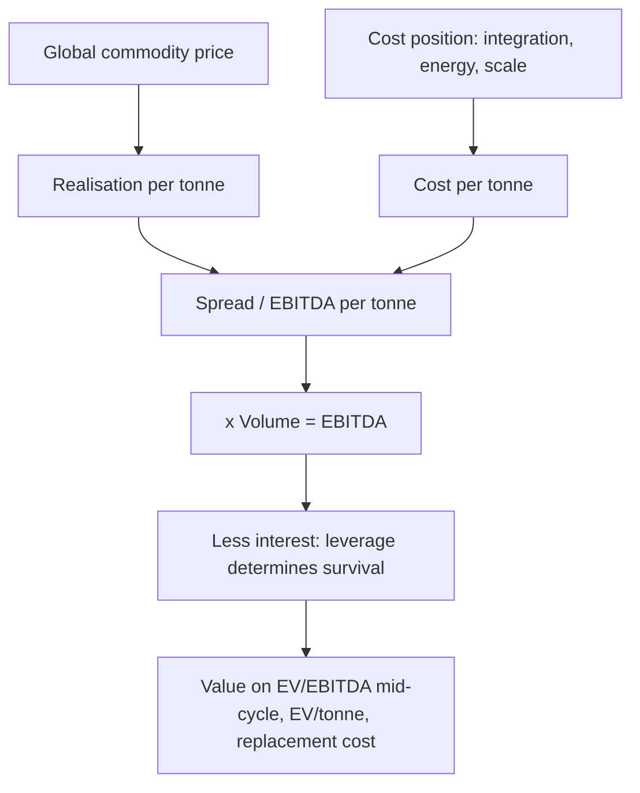

# Metals and Mining — A Full Analytical Deep Dive

## The Problem / Why this matters
Metals is the purest cyclical in the listed market and the sector where the P/E inversion trap claims the most victims. It is also the sector where a single variable — the global commodity price — dominates earnings so completely that company-specific analysis can feel secondary. That impression is wrong, and understanding why is the key to covering the sector well: two steel companies facing identical prices can have entirely different outcomes depending on integration, cost position and balance sheet.

## Core Idea
Metals earnings are **volume × (realisation − cost per tonne)**, where realisation is set globally and largely outside management control. The analyst's edge therefore lies not in forecasting the price but in **cost-curve position, integration, and balance-sheet capacity to survive the trough**.

## Why it works this way
A tonne of steel is a tonne of steel; buyers pay the market price regardless of who produced it. Since revenue per tonne is essentially given, competitive advantage lives entirely on the cost side — and because the industry is capital-intensive with high fixed costs, the spread between price and cost swings violently, producing earnings that can move several hundred percent while revenue moves twenty.

## Full technical content

### The per-tonne framework

As with cement, everything reduces to per-tonne economics — and companies disclose enough to build it:

| Metric | Driver |
|---|---|
| **Realisation per tonne** | Global price, product mix (flat vs long, value-added share), domestic premium/discount to import parity |
| **Cost per tonne** | Iron ore, coking coal, energy, conversion cost, freight |
| **EBITDA per tonne** | The spread — the sector's headline metric |

**Import parity pricing** is the mechanism that sets domestic prices: the domestic price generally tracks the landed cost of imports (international price + freight + duty), so an analyst must track both the international benchmark and the duty structure. Changes in import duty are therefore genuine, direct earnings events.

### Integration — the central quality differentiator

The single most important structural factor in steel:

| Integration level | Economics |
|---|---|
| **Fully integrated** (captive iron ore + captive coking coal) | Lowest cost, most stable margin; profits through the cycle |
| **Partially integrated** (captive ore, purchased coal) | Common in India; exposed to coking-coal price swings |
| **Non-integrated** (purchased ore and coal) | Highest cost, most volatile; first to lose money in a downturn |

Captive raw material converts a purchased input into an owned asset, which means the company captures the margin that would otherwise go to the miner. In a price upcycle, integrated producers see margin expand far more than converters — and in a downturn, they survive while non-integrated players do not. **Captive ore linkage percentage** is a disclosed metric and belongs in any steel comparison.

For **aluminium**, the equivalent variables are captive bauxite, alumina refining capacity, and — critically — **captive power**, since aluminium smelting is enormously power-intensive and power can be 35–40% of production cost.

### The cost curve

The industry cost curve determines who earns and who suffers:
- The **marginal producer's cost** sets the price floor in a downturn — prices fall until high-cost capacity shuts.
- A producer in the **first quartile** of the global cost curve earns through the entire cycle.
- A producer in the **fourth quartile** loses money at the trough and survives only on balance-sheet strength.

An analyst covering the sector should know, at least approximately, where each covered company sits, and should express company quality primarily in those terms rather than in margin terms (which are price-dependent and therefore uninformative about relative position).

### Volume and mix

- **Capacity and utilisation** — utilisation drives fixed-cost absorption, so the same spread produces different EBITDA at different utilisation.
- **Product mix** — flat products (auto, appliances, packaging) versus long products (construction). Flat generally realises more.
- **Value-added share** — coated, galvanised, cold-rolled and speciality grades carry a realisation premium and, importantly, are **less volatile** than commodity grades, so a high value-added share genuinely dampens cyclicality. This is the sector's main route to earning a better multiple.
- **Domestic versus export mix** — exports expose the company directly to global prices and to trade actions (anti-dumping duties, safeguard measures) in destination markets.

### The balance sheet — the survival variable

Metals is the sector where leverage most reliably destroys companies. The pattern is well documented: companies expand at the top of the cycle using debt raised against peak cash flows, capacity commissions into a downturn, cash flow collapses, and the debt becomes unserviceable.

The metrics that matter:
- **Net debt / EBITDA**, computed on **mid-cycle** EBITDA rather than current — a company at 2× on peak EBITDA may be at 6× mid-cycle.
- **Interest coverage** at trough EBITDA — the stress test that matters.
- **Debt maturity profile** — near-term maturities in a downturn are what force distress.
- **Capex commitments** — contracted spending that cannot easily be stopped.

**The capex-timing test is the clearest management-quality signal in this sector**: expanding counter-cyclically (buying or building when assets are cheap and competitors are retrenching) versus expanding at the peak is the difference between compounding and destroying value across a full cycle.

### Commodity price — the honest analytical position

An equity analyst should not present a confident commodity price forecast. The professional approach:
- Use **forward curves or consensus** as the base case, stated explicitly and prominently.
- Publish **sensitivity**: "every $50/t change in realisation changes FY27 EBITDA by X% and our fair value by Y%."
- Run **scenarios** rather than a point view.
- Concentrate genuine analytical effort where edge exists: **supply pipeline** (announced global capacity and its timing), **Chinese production and export policy** (the dominant swing factor in most metals), **cost-curve movements**, and **inventory levels** across the chain.

**China is the single most important external variable** in most metals — as producer, consumer and exporter. Chinese property activity, production controls, environmental curtailments and export rebate policy move global prices more than any other factor, and tracking them is a legitimate and productive use of an analyst's time.

### Valuation

- **EV/EBITDA on mid-cycle EBITDA** — the primary method, avoiding the peak/trough distortion.
- **EV per tonne of capacity** — comparable across companies and independent of the cycle.
- **Replacement cost** — the value anchor. Capacity trading well below the cost of building it constrains new supply and eventually supports prices.
- **P/B** — more stable than P/E, though book value can be distorted by past impairments and revaluations.
- **P/E** — use with explicit caution and only on normalised earnings, given the inversion trap.

### Red flags

- **Debt-funded expansion announced at peak** cycle earnings.
- **Non-integrated** producer with high leverage entering a downturn.
- Volume growth achieved by pushing into **export markets at low realisation**.
- Capacity commissioning coinciding with a **wave of global additions**.
- **Impairment history** suggesting past capital destroyed at previous peaks.
- Rising **net debt/mid-cycle EBITDA** while reported leverage looks comfortable on peak numbers.
- Reliance on **treasury or other income** to service interest.

## Common mistakes
- Buying on a **low trailing P/E at the cycle peak** — the canonical sector error.
- Measuring leverage on **peak EBITDA** rather than mid-cycle.
- Forecasting **commodity prices** confidently instead of publishing sensitivities.
- Ignoring **integration level**, treating all producers as equivalent.
- Overlooking the **announced global supply pipeline**, which is knowable.
- Underweighting **China** as the dominant swing factor.
- Reading margin as a quality signal when it is mostly a price signal — cost-curve position is the quality measure.
- Ignoring **import duty structure**, which directly sets domestic realisation.

## Interview angle
"Steel prices are up 30%. Which steel company would you buy?" Resist the implication that all producers benefit equally. Work through: integration level, because a fully integrated producer captures the ore and coal margin too while a converter sees input costs rise alongside output prices; cost-curve position, which determines through-cycle earning power; value-added share, which dampens volatility and supports the multiple; balance sheet measured against *mid-cycle* rather than peak EBITDA, since leverage is what kills in this sector; and capex timing history as the management-quality test. Then note the valuation discipline — EV/EBITDA on mid-cycle earnings and EV/tonne against replacement cost, never P/E on peak earnings.
