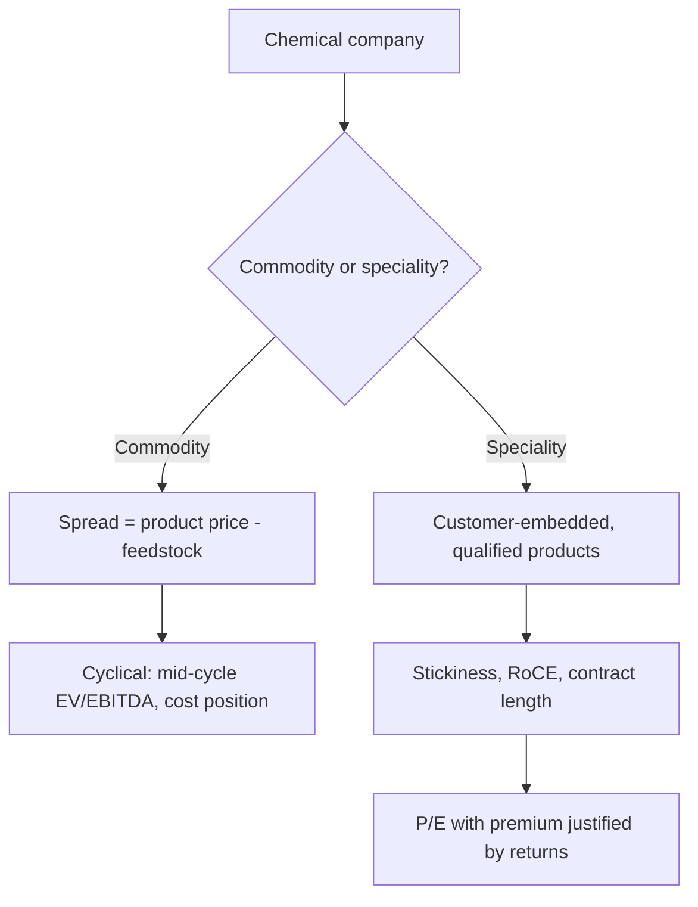

# Chemicals — A Full Analytical Deep Dive

## The Problem / Why this matters
"Chemicals" covers businesses with almost nothing in common: a bulk commodity chemical producer competing purely on cost, a speciality chemicals maker with customer-embedded products and multi-year contracts, an agrochemical company exposed to monsoons and global crop cycles, and a CRAMS/CDMO business selling capability to innovators. These trade at wildly different multiples for good reasons, and applying one framework to the sector produces confidently wrong conclusions. The sector has also been one of the most significant Indian equity themes of recent years, making it hard to avoid.

## Core Idea
Classify first. **Commodity chemicals** are spread businesses valued on mid-cycle EV/EBITDA; **speciality chemicals** are relationship-and-capability businesses valued on P/E with the multiple justified by customer stickiness and RoCE.

## Why it works this way
A commodity chemical is fungible — the buyer cares only about price and reliability, so returns get competed toward the cost of capital and earnings swing with the spread. A speciality chemical is designed into a customer's product and validated in their process, so switching requires re-qualification that can take years. That switching cost is a genuine moat, and it is why speciality businesses sustain higher and more stable returns.

## Full technical content

### The classification test

Judge by economics, not by what the company calls itself — many commodity producers describe themselves as "speciality":

| Test | Commodity | Speciality |
|---|---|---|
| **Product** | Standardised, fungible | Customised, customer-specific |
| **Pricing** | Market-determined spread | Negotiated, cost-plus or value-based |
| **Customer relationship** | Transactional | Qualified, embedded, multi-year |
| **Switching cost** | Near zero | High — re-qualification required |
| **Gross margin** | Volatile, spread-driven | Stable, higher |
| **RoCE** | Cyclical, often below cost of capital at trough | Sustained above cost of capital |
| **Number of customers per product** | Many | Few, sometimes one |
| **Multiple** | Low, EV/EBITDA on mid-cycle | High, P/E |

**The empirical test is RoCE stability through a cycle.** A genuine speciality business sustains returns through downturns; a commodity business with a speciality label does not. Plotting 10-year RoCE settles the question faster than any qualitative argument.

### Commodity chemicals — the spread framework

**Spread = product price − feedstock cost**

The spread, not the product price, is what drives earnings — a producer can be profitable with falling prices if feedstock falls faster. Track:
- **The relevant delta** (e.g. the gap between a petrochemical product and its naphtha or gas feedstock), published by industry data services and often disclosed qualitatively by companies.
- **Feedstock advantage** — access to cheaper feedstock (gas versus naphtha, captive intermediates) is the structural cost advantage.
- **Global capacity cycle** — as with all commodities, announced capacity with commissioning dates is publicly knowable and determines future spreads. Large capacity waves, particularly in China and the Middle East, compress spreads globally regardless of local demand.
- **Utilisation** — the standard operating-leverage driver.
- **Backward integration** into key intermediates, which captures more of the chain's margin and stabilises supply.

### Speciality chemicals — the value drivers

| Driver | Why it matters | What to look for |
|---|---|---|
| **Customer qualification** | The moat — re-qualification takes 12–36 months | Length of key relationships; share of revenue from customers over 5 years |
| **Product portfolio breadth** | Reduces single-product risk | Number of products; revenue concentration |
| **R&D and process capability** | Enables new molecules and cost reduction | R&D as % of sales; new-product revenue share |
| **Contract structure** | Visibility | Long-term agreements, take-or-pay, cost pass-through clauses |
| **Customer concentration** | Risk | Top-5 share; loss of one customer can be severe |
| **Capacity and capex pipeline** | Growth | Announced expansions, commissioning timeline, expected asset turns |

**Cost pass-through clauses** deserve specific attention: speciality contracts frequently allow raw-material cost changes to be passed to the customer with a lag. This dramatically reduces margin volatility and is a genuine structural quality feature — worth confirming from disclosures rather than assuming.

### Agrochemicals — a distinct sub-sector

Different drivers again:
- **Monsoon and crop prices** drive domestic demand directly.
- **Global crop cycles and farm incomes** drive export demand — soft agricultural commodity prices reduce farmer spending on inputs.
- **Channel inventory** — a recurring sector issue where distributors accumulate stock in a good season and destock in a weak one, producing revenue swings unrelated to end demand. The primary-versus-secondary sales check applies directly.
- **Product registration and patent status** — off-patent generics versus patented actives, with registration in each destination market as a barrier.
- **Regulatory bans** on specific molecules, which can remove a product line abruptly.

### The China+1 theme — analysing it properly

The structural narrative supporting Indian chemicals has been global customers diversifying supply away from China. The disciplined way to assess whether a specific company benefits:
- **Evidence of actual customer wins**, not management assertion — new long-term contracts, customer additions, capacity contracted in advance.
- **Capacity being built against committed demand** versus speculative capacity. The latter is how a theme becomes an overcapacity problem.
- **Regulatory and environmental compliance capability** — a genuine barrier, since global customers audit suppliers and Chinese environmental crackdowns raised the bar.
- Whether the company's products are ones where **China remains dominant and low-cost** — in which case the theme may not translate.

The risk to name explicitly: when a theme is widely believed, capacity gets built across the industry simultaneously, and the resulting oversupply destroys the spreads that made the theme attractive. Capacity announcements across the sector are the metric to watch.

### Financial characteristics to check

- **Capital intensity** — chemicals plants are expensive; check asset turns and capex/sales, and whether announced expansions earn above the cost of capital.
- **Working capital** — often substantial, with long receivables in export markets.
- **Environmental compliance capex** — a real, recurring and rising cost, and a genuine barrier to entry for smaller players.
- **Plant safety and incident history** — a serious operational and regulatory risk with occasional catastrophic outcomes.

### Valuation

- **Speciality**: P/E, with the premium justified by sustained RoCE, customer stickiness and growth visibility. Cross-check with EV/EBITDA and against global speciality peers.
- **Commodity**: EV/EBITDA on **mid-cycle** spreads, with the same cyclical discipline as metals — never P/E on peak-spread earnings.
- **Mixed companies**: SOTP, with different multiples for the commodity and speciality segments. This is common and frequently done badly.

### Red flags

- A company describing itself as speciality while showing **commodity-like RoCE volatility**.
- **Capacity built speculatively** on a theme without contracted demand.
- Rising **customer concentration** without contract protection.
- **Channel inventory build** in agrochemicals masking weak end demand.
- Environmental or safety incidents, or capex deferred on compliance.
- Spread expansion driven purely by a **feedstock collapse** that will mean-revert.
- Aggressive capitalisation of R&D or project costs.

## Common mistakes
- Accepting a company's **self-description** as speciality without testing RoCE stability.
- Applying one multiple to a company with **both** commodity and speciality segments.
- Analysing product prices rather than **spreads**.
- Ignoring the **global capacity pipeline**, particularly Chinese and Middle Eastern additions.
- Treating the China+1 theme as automatically benefiting every Indian chemical company.
- Missing **channel inventory** effects in agrochemicals.
- Overlooking **cost pass-through clauses**, and so mis-modelling margin volatility.
- Using peak-spread earnings for a commodity chemical valuation.

## Interview angle
"Why do some chemical companies trade at 40x and others at 8x?" Answer with the economics rather than the labels: the 40x business is speciality — products designed into customers' processes requiring 12–36 month re-qualification to switch, which produces sustained above-cost-of-capital RoCE, stable margins helped by cost pass-through clauses, and predictable growth. The 8x business is a commodity spread business where the product is fungible, earnings swing with the delta between product and feedstock prices, and returns get competed away. Then give the test that settles which is which: plot RoCE through a full cycle — genuine speciality businesses hold returns in a downturn, and companies that merely call themselves speciality do not.
