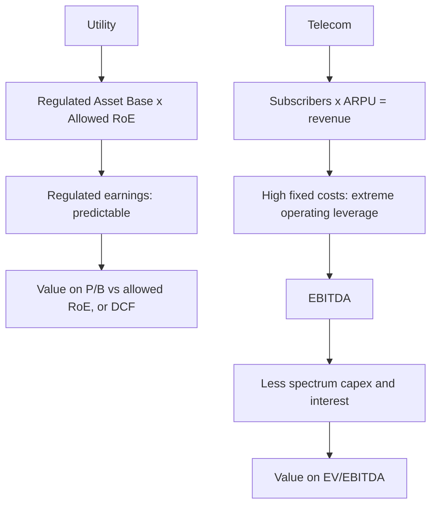

# Telecom and Utilities — A Full Analytical Deep Dive

## The Problem / Why this matters
Telecom and utilities share a defining characteristic that separates them from most of the market: enormous fixed assets, high leverage, and — critically — a **regulator standing between the company and its returns**. In utilities the regulator sets the return directly; in telecom it controls spectrum, pricing intervention and levies. This makes conventional competitive analysis secondary to understanding the regulatory framework, and it makes these sectors ones where analysts either learn the specific rules or get the calls wrong.

## Core Idea
For **utilities**, returns are largely regulator-determined, so analysis centres on the regulated asset base and the allowed return. For **telecom**, the economics reduce to **ARPU × subscribers**, against a fixed cost base with extreme operating leverage and periodic, very large spectrum capital calls.

## Why it works this way
Both are natural-monopoly-adjacent, capital-intensive businesses providing essential services. Society resolves the resulting market-power problem by regulating them — capping returns in exchange for allowing scale. The consequence for an analyst is that the regulator's framework, not competitive dynamics, is often the primary determinant of value.

## Full technical content

## Part 1 — Telecom

### The core equation

**Revenue = Subscribers × ARPU**

| Metric | What to watch |
|---|---|
| **Subscribers** | Net adds; more importantly **active** subscribers (VLR data) rather than reported SIMs |
| **ARPU** (average revenue per user) | The key pricing metric; the sector's whole narrative in recent years |
| **Data usage per subscriber** | Consumption growth, and the monetisation gap |
| **Postpaid share** | Higher ARPU, lower churn — a quality metric |
| **Churn** | Monthly rate; high churn means acquisition spend is a treadmill |
| **4G/5G subscriber mix** | Upgrade path to higher ARPU |

**Active subscribers matter more than reported subscribers.** Reported SIM counts include inactive connections; regulatory VLR (visitor location register) data shows genuinely active users. A company reporting subscriber growth while VLR-active numbers stagnate is adding SIMs, not customers.

**ARPU is the sector's central variable.** Because the cost base is overwhelmingly fixed — network, spectrum, towers — an ARPU increase drops through to EBITDA at very high incremental margin. This is the source of the sector's extreme operating leverage: a 10% ARPU rise can produce a 25–30% EBITDA rise. The same leverage works viciously in reverse, which is what tariff wars do to the sector.

### The cost structure and operating leverage

Largely fixed: network operating costs, spectrum amortisation, tower rentals, employee costs, licence fees and spectrum usage charges as a percentage of revenue. Variable costs are a small share.

The practical modelling consequence: **model incremental EBITDA on a contribution basis**, not by applying a flat EBITDA margin. A flat-margin forecast for a business with this cost structure systematically understates both upside and downside — the same error as in autos, but more extreme.

### Capital intensity and the spectrum problem

Telecom's defining financial burden:
- **Spectrum auctions** require very large, lumpy, debt-funded payments, with the asset then amortised over the licence period.
- **Network capex** is continuous, and each technology generation (3G → 4G → 5G) requires a fresh cycle before the previous one has been fully monetised.
- **Regulatory levies** — licence fees and spectrum usage charges computed on adjusted gross revenue, where the definition of AGR has itself been the subject of major litigation with severe financial consequences.

The result is chronically high leverage. **Net debt/EBITDA is the survival metric**, and the sector's history includes companies that could not service spectrum-related obligations.

**Free cash flow, not EBITDA, is the honest measure** in telecom. A company with strong EBITDA that never converts to FCF because capex and spectrum payments consume it is not generating value for equity holders. Always compute EBITDA less capex less interest.

### Market structure

Telecom economics depend overwhelmingly on the number of competitors. A market with many players competes to unsustainable tariffs; consolidation to three or fewer allows ARPU repair. Tracking **market share, subscriber movement between operators, and any regulatory intervention on pricing** is therefore the sector's central strategic analysis.

## Part 2 — Utilities

### The regulated model

For a regulated utility (transmission, distribution, and regulated generation), returns are set by the regulator:

**Allowed earnings ≈ Regulated Asset Base (RAB) × Allowed Return on Equity**

| Concept | Meaning |
|---|---|
| **Regulated Asset Base** | Approved capital investment on which a return is permitted |
| **Allowed RoE** | The regulator-permitted return, periodically reset |
| **Tariff order** | The regulator's determination setting allowed revenue |
| **True-up** | Reconciliation of allowed versus actual costs, with recovery in later periods |
| **Regulatory assets** | Costs approved but not yet recovered through tariffs — a receivable-like item |

**Growth in a regulated utility comes from growing the RAB** — that is, from investing approved capital. This makes the capex programme, not demand growth, the primary earnings driver, and it makes the regulator's approval of that capex the key event.

Two risks that matter and are frequently underappreciated:
1. **Regulatory reset risk** — the allowed RoE is periodically revised, and a downward revision reduces earnings on the entire asset base at once.
2. **Regulatory asset accumulation** — where a distribution utility's approved costs are not being recovered in current tariffs, a large receivable builds. This is a genuine cash-flow and credit risk that reported profit conceals.

### Generation — regulated versus merchant

- **Regulated / long-term PPA generation** — capacity tied up under power purchase agreements at determined tariffs. Predictable, bond-like, and valued accordingly. Key risks are counterparty (state distribution companies with weak finances) and plant availability.
- **Merchant generation** — power sold at market prices on exchanges. Genuinely cyclical, driven by demand, fuel costs and the supply-demand balance, and valued like a commodity business.
- **Plant Load Factor (PLF)** — utilisation, and the key operating metric for thermal generation.
- **Fuel supply and cost pass-through** — whether fuel cost is a pass-through under the PPA determines whether the generator bears commodity risk at all.

**Receivables from state distribution companies** are the sector's chronic issue. A generator with strong reported earnings but ballooning receivables from financially weak state utilities has an earnings-quality problem that only cash-flow analysis reveals.

### Renewables

A distinct sub-sector with its own economics: near-zero marginal cost, PPA-determined tariffs, capacity utilisation dependent on resource (solar irradiation, wind speeds), and value driven by cost of capital more than by anything operational — since a renewable project is essentially a leveraged annuity, small changes in financing cost move project IRR substantially. Key risks are PPA counterparty credit, curtailment, and tariff renegotiation attempts.

### Valuation

**Utilities:**
- **P/B against allowed RoE** — the direct analogue of the bank framework, since returns are earned on an asset base at a determined rate.
- **DCF** works well given predictable, contracted cash flows.
- **EV/EBITDA** for merchant or mixed businesses.
- **Dividend yield** — utilities are typically high payers, so yield versus the bond yield is a genuine valuation anchor, and this makes them **rate-sensitive** in the same way as REITs.

**Telecom:**
- **EV/EBITDA** is the convention, given leverage differences and heavy depreciation.
- Cross-check on **EV per subscriber**.
- **FCF yield** as the honest sanity check.
- P/E is often meaningless given heavy amortisation and periodic losses.

### Red flags

- Telecom: **reported subscriber growth without VLR-active growth**.
- Telecom: EBITDA growth that never converts to **free cash flow**.
- Telecom: net debt/EBITDA rising ahead of a spectrum auction cycle.
- Utility: **regulatory assets accumulating** — approved but unrecovered costs.
- Utility: rising **receivables from state distribution companies**.
- Utility: an approaching **regulatory reset** with expectations of a lower allowed return.
- Generation: reported profit with weak cash collection.

## Common mistakes
- Modelling telecom with a **flat EBITDA margin** despite extreme operating leverage.
- Using **reported subscribers** rather than active ones.
- Valuing telecom on EBITDA while ignoring **spectrum and network capex**, so FCF never appears.
- Treating a regulated utility as a growth business — growth comes from **approved capex**, not demand.
- Ignoring **regulatory reset risk** on the allowed return.
- Missing **regulatory assets** and state-utility receivables as cash-quality issues.
- Valuing merchant and regulated generation with the same framework.
- Forgetting that high-yield utilities **de-rate when bond yields rise**, independent of operations.

## Interview angle
"Telecom ARPU rose 8%. What happens to earnings?" The expected answer engages with operating leverage: because the cost base is overwhelmingly fixed — network, spectrum amortisation, tower rentals — an ARPU increase flows through at very high incremental margin, so an 8% ARPU rise could plausibly lift EBITDA 20%+ depending on the cost structure. Then add the qualifications that show depth: check whether *active* subscribers held (an ARPU rise achieved by shedding low-value users is different from genuine repricing), and check whether the EBITDA gain converts to free cash flow after network capex and any upcoming spectrum obligations — because in telecom, EBITDA and equity value can diverge for years.
