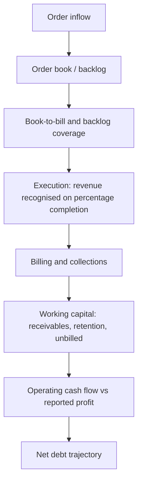

# Capital Goods and Infrastructure — A Full Analytical Deep Dive

## The Problem / Why this matters
Capital goods and EPC companies are the market's most direct expression of the investment cycle, and they are also where the gap between reported revenue and economic reality is widest. Revenue is recognised on percentage-of-completion — a management estimate — while cash arrives on milestones that may lag by quarters. The result is a sector where profitable-looking companies routinely run out of cash, and where the order book, not the income statement, is the primary analytical object.

## Core Idea
Analysis runs on the **order book → execution → cash conversion** chain. Order inflow is the leading indicator, execution converts backlog to revenue, and collections determine whether that revenue becomes cash. Failure at the third step is what destroys these companies.

## Why it works this way
An EPC contractor bids for projects, executes over years, and gets paid against milestones with a portion held as retention until completion. Because revenue recognition depends on estimated completion percentage, reported profit is an estimate; because working capital absorbs cash as projects run, growth consumes cash. Both features make cash metrics dominate accounting ones.

## Full technical content

### The order-book framework

| Metric | Definition | Why it matters |
|---|---|---|
| **Order inflow** | New orders won in the period | The leading indicator — precedes revenue by quarters or years |
| **Order book / backlog** | Unexecuted orders outstanding | Forward revenue visibility |
| **Book-to-bill** | Order inflow ÷ revenue | Above 1 means the backlog is growing |
| **Backlog coverage** | Order book ÷ trailing revenue | Years of visibility; typically 2–3× for EPC |
| **Execution rate** | Revenue ÷ opening order book | How fast backlog converts |
| **Order-book margin** | Expected margin on the backlog | Quality, not just quantity |

**The essential discipline: order book quality matters more than size.** A large backlog won at thin margins in a competitive bidding round is worse than a smaller one at healthy margins. Questions to ask:
- **Margin profile** of recent wins versus the existing book.
- **Customer mix** — government versus private, and which government entity. Payment behaviour varies enormously.
- **Fixed-price versus cost-plus** — fixed-price contracts transfer input-cost risk to the contractor, which is dangerous in an inflationary period unless price-escalation clauses exist.
- **Slow-moving or stuck orders** — backlog that is not executing because of land acquisition, approvals or client funding. This inflates reported backlog while contributing nothing. Companies sometimes disclose a "slow-moving" bucket; if they do not, ask.

### Execution and the percentage-of-completion problem

Revenue is recognised as **costs incurred ÷ total estimated costs**, applied to contract value. The vulnerabilities:
- The denominator is a **management estimate**. Underestimating total cost overstates the completion percentage and pulls revenue and profit forward.
- **Cost overruns** are recognised only when acknowledged, so a deteriorating project can carry its original margin in the accounts until reality forces a change.
- **Claims and variations** — additional work claimed from the client but disputed. Recognising claim revenue before it is agreed is an aggressive practice worth checking in the accounting policy and notes.

The practical check: **compare cumulative operating cash flow to cumulative reported profit** over several years. In a business with genuine profitability, they should converge. Persistent divergence means profit is being recognised that cash is not confirming.

### Working capital — where these companies die

The sector's defining financial characteristic:

| Item | Issue |
|---|---|
| **Receivables** | Long payment cycles, especially government clients |
| **Retention money** | 5–10% of contract value withheld until completion and defect-liability expiry — capital locked for years |
| **Unbilled revenue** | Work done and recognised but not yet invoiced; a leading indicator of billing or dispute problems if it grows faster than revenue |
| **Advances from customers** | A funding source — mobilisation advances reduce working capital; declining advances mean tighter terms |
| **Inventory/WIP** | Materials and work in progress |

**Growth consumes cash.** With a long cash conversion cycle, every rupee of incremental revenue requires working-capital funding, so a fast-growing EPC company will show profit alongside negative operating cash flow and rising debt — the classic pattern that precedes distress. This is why the sector's survivors are those that prioritise cash over order-book growth.

**Unbilled revenue deserves particular scrutiny.** Rising unbilled revenue as a share of total revenue means the company is recognising work it has not yet been able to invoice — often because milestones are disputed or client certification is pending. It is one of the earliest available warnings.

### The macro linkage

- **Government capex** — budget allocations, and more importantly **execution rates** against those allocations, which historically lag announcements.
- **Private capex cycle** — corporate capacity utilisation is the leading indicator; companies invest when utilisation is high.
- **Interest rates** — project IRRs and client funding costs.
- **Ordering activity in specific verticals** — power T&D, water, roads, metros, railways, defence, data centres.

The sector is a **derivative of the investment cycle**, which means it is early-cyclical: orders turn before revenue, and revenue before profit. An analyst tracking order inflow across the sector has a genuine read on the capex cycle before it appears in national statistics.

### Balance sheet and risk

- **Net debt / EBITDA** and interest coverage — the survival metrics.
- **Guarantees and performance bonds** — contingent liabilities that can crystallise.
- **Contingent liabilities** relative to net worth; disputed claims run both ways.
- **Arbitration and claims receivable** — often material, long-dated and uncertain; treat recognised claim receivables sceptically.
- **BOT/HAM assets** — where a contractor also owns concession assets, these should be valued separately on a DCF or equity-IRR basis and consolidated via SOTP, not blended into an EPC multiple.

### Valuation

- **P/E on the EPC business**, with the multiple reflecting execution quality, order-book strength and — critically — cash conversion. Companies with demonstrated cash discipline deserve a genuine premium.
- **EV/EBITDA** where leverage differs.
- **SOTP** where concession assets (roads, transmission) sit alongside the EPC business, valuing those on their own cash flows.
- **P/B** as a floor check for asset-heavy players.
- Cross-check against **order book per share** and backlog-implied revenue visibility.

### Red flags

- Order-book growth at **declining margins** — buying revenue.
- **Unbilled revenue** growing faster than revenue.
- Cumulative operating cash flow persistently **below** cumulative PAT.
- Rising **receivable days**, particularly with government clients.
- Growing share of **slow-moving** orders in the backlog.
- **Debt rising** alongside revenue growth.
- Large recognised **claim receivables** pending arbitration.
- Fixed-price contracts won during an input-cost upswing without escalation clauses.

## Common mistakes
- Reading **order-book size** without margin, customer mix and slow-moving disclosure.
- Trusting **percentage-of-completion** revenue without the cash-flow cross-check.
- Missing **unbilled revenue** growth as an early warning.
- Ignoring **retention money** as long-term locked capital.
- Treating revenue growth as success when it is consuming cash and adding debt.
- Blending **concession assets** into an EPC multiple instead of SOTP.
- Recognising **claim receivables** at face value.
- Underestimating how long government receivables actually take.

## Interview angle
"An EPC company's order book is up 40%. Positive?" Refuse to answer on size alone. Ask about the margin profile of the new wins versus the existing book — backlog won cheaply in a competitive bid round is a liability, not an asset; the customer mix and their payment behaviour; whether the contracts are fixed-price without escalation clauses in an inflationary period; and what share of the backlog is slow-moving and not executing. Then go to cash: has cumulative operating cash flow tracked cumulative profit, is unbilled revenue growing faster than revenue, and is net debt rising with growth? The sector's central point — that growth consumes cash and companies fail on working capital rather than on order books — is what the question is testing.
