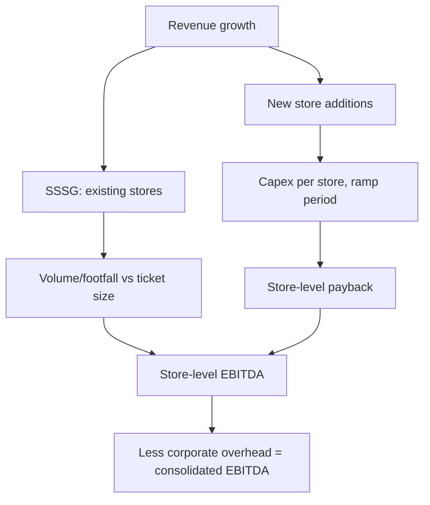

# Retail and Quick Commerce — A Full Analytical Deep Dive

## The Problem / Why this matters
Retail is a store-economics business analysed at the wrong level by most investors, who look at consolidated revenue growth without asking whether it came from opening stores or from selling more per store — two entirely different propositions. Layered on top, quick commerce and e-commerce have introduced business models with fundamentally different economics that consolidated financials obscure completely, since a profitable mature store network can subsidise a heavily loss-making delivery operation with the blended number revealing neither.

## Core Idea
Retail value is created at the **store level**: revenue per square foot, store-level EBITDA margin, capex per store and payback period. Growth from new stores must earn above the cost of capital; growth from existing stores (SSSG) is the health signal.

## Why it works this way
A retailer is a portfolio of individual units, each with its own P&L. Consolidated numbers blend mature high-performing stores with immature new ones that are still ramping, so they systematically misrepresent both. Analysing at the unit level is the only way to see whether the model works and whether expansion is creating or destroying value.

## Full technical content

### The store-economics framework

| Metric | Definition | Why it matters |
|---|---|---|
| **Revenue per sq ft** | Annual revenue ÷ retail area | The core productivity metric |
| **SSSG / LFL growth** | Growth in stores open over a year | Underlying health, stripped of expansion |
| **Store-level EBITDA margin** | Before corporate overhead | The unit's true profitability |
| **Capex per store** | Fit-out plus initial inventory | Investment per unit |
| **Payback period** | Capex ÷ annual store EBITDA | Whether expansion creates value |
| **Ramp period** | Time to mature revenue | Drag on consolidated margin during expansion |
| **Store count and net adds** | Openings less closures | **Closures matter** — a company reporting net adds while closing stores is churning |

**The essential decomposition:** revenue growth = SSSG + new store contribution. A company growing 25% with 3% SSSG and 22% from new stores is buying growth with capital; one growing 12% with 9% SSSG is generating it. The second is far more valuable per unit of capital, and the multiple should reflect that.

**SSSG decomposes further** into footfall (transactions) and ticket size (revenue per transaction). SSSG driven by footfall is stronger than SSSG driven purely by price increases — the same volume-versus-value logic that governs FMCG analysis.

### The maturity-mix distortion

A rapidly expanding retailer's consolidated margin is systematically depressed because immature stores drag it down. This cuts both ways analytically:
- A company expanding fast may look less profitable than it is at maturity — the store-level numbers are what matter.
- Conversely, a company that **stops expanding** will show margin expansion that is purely a maturity-mix effect, not an operational improvement. Treating that as sustainable improvement is a common error.

Always ask for the split between mature and non-mature store performance where disclosed.

### Format-specific economics

| Format | Character |
|---|---|
| **Grocery / supermarket** | Low margin, high frequency, working-capital favourable (fast inventory turns, supplier credit) |
| **Apparel / fashion** | Higher margin, inventory and markdown risk, seasonality, fashion risk |
| **Electronics / appliances** | Low margin, high ticket, price-transparent and therefore e-commerce-vulnerable |
| **Jewellery** | High ticket, gold price and inventory funding critical, regulatory (hallmarking) |
| **QSR / food service** | Store economics plus commodity input costs; strong brand and location dependence |
| **Pharmacy** | Regulated pricing, high frequency, prescription stickiness |

**Inventory management is the operational core** in most formats: inventory days, markdown percentage, and shrinkage. In fashion especially, markdowns are where margin is lost, and rising markdown intensity is an early warning that merchandise is not selling.

### Working capital

Retail can be working-capital favourable — a grocery retailer turning inventory in 20 days while paying suppliers in 45 is being funded by its supply chain, producing **negative working capital** and meaning growth generates rather than consumes cash. This is a genuine structural advantage worth identifying explicitly.

Fashion and jewellery are the opposite: slow-turning, high-value inventory that absorbs capital as the store count grows.

### Quick commerce and e-commerce — different economics entirely

The newer models must be analysed separately, and a company operating both should be assessed on a segment basis:

| Metric | Meaning |
|---|---|
| **GOV / GMV** | Gross order value — *not* revenue; the company usually books only a commission or a margin |
| **Net revenue / take rate** | What the company actually earns |
| **AOV** (average order value) | Ticket size; critical because fixed delivery cost is spread over it |
| **Contribution margin per order** | AOV × gross margin − delivery cost − packaging − discounts |
| **Dark store economics** | Orders per day per store, capex per store, breakeven order density |
| **Order density** | The single most important variable — delivery cost per order falls sharply with density |

**The central economic point in quick commerce:** the model works only at sufficient **order density** within a delivery radius. Fixed dark-store and rider costs are spread over orders, so a store doing 1,200 orders a day has fundamentally different economics from one doing 400. This is why the analysis must be at store-cohort level — mature, high-density stores can be profitable while newer ones lose money heavily, and the blended number tells you nothing about either.

**GMV is not revenue.** Conflating them is the most common error in this space. A platform reporting ₹10,000cr GMV with a 15% take rate has ₹1,500cr of revenue, and valuing it on a revenue multiple applied to GMV overstates value by nearly seven times.

**Cohort discipline applies:** older dark-store cohorts should show improving contribution margin as density builds. If mature cohorts are not profitable, scale will not fix it.

### Omnichannel considerations

Where a retailer operates both stores and online, the store network's contribution extends beyond its own sales — stores serve as fulfilment points, return centres and discovery channels. A store's point-of-sale revenue therefore understates its contribution, which matters directly for store-closure decisions and is exactly the invisible cross-channel value the omnichannel research framework addresses.

### Valuation

- **EV/EBITDA** is the primary approach for established retailers.
- **P/E** where profitability is stable and mature.
- **EV/Sales** for high-growth or loss-making models, but only with an explicit terminal-margin view.
- **Store-count-based valuation** — mature store EBITDA × expected store count, discounted — for expanding networks with proven unit economics.
- Cross-check **EV per store** and **EV per sq ft** against peers.

Retail multiples are usually justified by growth runway (how many more stores the format supports) and by unit-level returns, so both belong in the valuation narrative explicitly.

### Red flags

- Revenue growth almost entirely from **new stores** with flat or negative SSSG.
- **Store closures** rising, or net adds masking gross closures.
- **Margin expansion from maturity mix** presented as operational improvement.
- Rising **markdowns** or inventory days in fashion.
- Quick commerce: **contribution margin negative in mature cohorts**.
- Quick commerce: **GMV growth** highlighted while take rate and contribution margin are not disclosed.
- Expansion funded by debt with payback periods lengthening.
- Rising rental cost per square foot outpacing revenue per square foot.

## Common mistakes
- Analysing **consolidated** revenue growth without the SSSG-versus-new-store split.
- Reading margin improvement that is purely a **maturity-mix** effect.
- Ignoring **store closures**.
- Confusing **GMV with revenue** in e-commerce and quick commerce.
- Assessing quick commerce on blended numbers rather than **store cohorts and order density**.
- Missing the working-capital character of the format — negative working capital is a genuine advantage.
- Valuing a store network without checking **payback period** on new stores.
- Ignoring the store's role in omnichannel fulfilment when assessing its contribution.

## Interview angle
"A retailer reports 25% revenue growth. What do you want to know?" Split it immediately: how much is SSSG and how much is new stores, because those are different businesses — 3% SSSG with 22% from expansion means growth is being bought with capital, and the question then becomes what the payback period on a new store is and whether it beats the cost of capital. Then decompose SSSG into footfall versus ticket size, check whether store closures are being netted out of the store-count figure, and ask whether consolidated margin moves are operational or just maturity mix. For a quick-commerce business, pivot to order density and cohort-level contribution margin, and insist on the distinction between GMV and net revenue.
