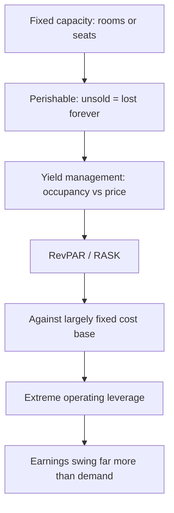

# Hotels, Aviation and Consumer Services — A Full Analytical Deep Dive

## The Problem / Why this matters
Hotels and airlines share a defining economic feature that makes them behave unlike almost anything else: their product is **perishable inventory**. An unsold room-night or an empty seat on a departed flight is revenue lost permanently — it cannot be stored and sold later. Combined with very high fixed costs, this produces extreme operating leverage in both directions, which is why these sectors swing from large losses to large profits on modest changes in demand, and why they attract and destroy capital in cycles.

## Core Idea
Both sectors are **yield-management businesses**: value comes from maximising revenue per unit of perishable capacity (RevPAR for hotels, RASK for airlines) against a largely fixed cost base. Occupancy and pricing are the two levers, and the trade-off between them is the operating decision.

## Why it works this way
With capacity fixed in the short run and marginal cost of serving one more customer close to zero, any revenue above marginal cost improves the outcome — which creates powerful incentives to discount when demand is weak. The result is that pricing discipline collapses in downturns, and the swing between good and bad conditions is amplified far beyond the change in underlying demand.

## Full technical content

## Part 1 — Hotels

### The metric set

| Metric | Definition | Notes |
|---|---|---|
| **ARR** (average room rate) | Room revenue ÷ rooms sold | The pricing lever |
| **Occupancy** | Rooms sold ÷ rooms available | The volume lever |
| **RevPAR** | ARR × occupancy, or room revenue ÷ available rooms | **The headline metric** — captures both |
| **F&B revenue** | Food and beverage, banqueting | Often 30–40% of revenue; banqueting is high-margin |
| **GOP margin** | Gross operating profit | Property-level profitability |
| **Cost per available room** | Fixed cost intensity | Determines breakeven occupancy |

**RevPAR is the metric that matters** because it combines rate and occupancy — a hotel filling rooms by discounting has rising occupancy and falling ARR, and RevPAR tells you whether the net effect was positive. The decomposition matters too: RevPAR growth driven by **ARR** is higher quality than growth driven by occupancy, because it indicates pricing power rather than volume-chasing.

### The supply cycle — the dominant variable

Hotel returns are driven overwhelmingly by the **supply-demand balance in each micro-market**:
- New hotel supply takes 3–5 years to build and is publicly announced, making the pipeline forecastable — the same knowable-supply advantage as in commodities.
- When demand outpaces supply, occupancy rises first, then ARR rises sharply once occupancy exceeds roughly 70%, because operators gain pricing confidence. This is why hotel earnings inflect non-linearly.
- The reverse in oversupply is equally sharp.
- **Micro-market matters** — the relevant supply-demand balance is city- and even sub-market-specific, not national.

### The asset-light shift

An important structural distinction affecting valuation:
- **Owned hotels** — full economics, full capital intensity, high operating leverage, cyclical.
- **Managed / franchised** — the company earns a management fee (a percentage of revenue plus an incentive on profit) without owning the asset. Capital-light, higher RoCE, far less cyclical, and deserving a materially higher multiple.

A hotel company shifting toward management contracts is genuinely re-rating its business model, and analysts should value the two streams separately — owned hotels on EV/EBITDA or per-key value, management fees on a services multiple.

### Hotel valuation

- **EV per key** (per room) — benchmarked against replacement cost and recent transactions, the sector's asset-based anchor.
- **EV/EBITDA on mid-cycle** RevPAR, given the cyclicality.
- **Sum-of-the-parts** where owned and managed businesses coexist.
- Cross-check against **capitalised NOI at a cap rate**, treating hotels as real estate.

## Part 2 — Aviation

### The metric set

| Metric | Definition |
|---|---|
| **ASK** (available seat kilometres) | Capacity: seats × distance flown |
| **RPK** (revenue passenger kilometres) | Demand: passengers × distance |
| **PLF** (passenger load factor) | RPK ÷ ASK — the occupancy analogue |
| **RASK** | Revenue ÷ ASK — revenue per unit capacity |
| **CASK** | Cost ÷ ASK — cost per unit capacity |
| **CASK ex-fuel** | Cost excluding fuel — **the real efficiency measure** |
| **Yield** | Revenue per RPK — the pricing measure |
| **Spread** | RASK − CASK — the profitability driver |

**The RASK−CASK spread is everything.** Airlines operate on very thin spreads, which is precisely why the sector is so volatile: a small adverse move in either fuel cost or fares eliminates the margin entirely.

**CASK ex-fuel is the genuine efficiency metric**, because fuel is largely outside management control while everything else — fleet utilisation, aircraft type commonality, turnaround times, employee productivity, maintenance strategy — reflects operational quality. A low-cost carrier's structural advantage shows up precisely here.

### The cost structure

- **Fuel** — typically 30–40% of costs, denominated in USD, and the single largest swing factor. Airlines are effectively leveraged bets on jet fuel prices unless hedged.
- **Currency** — a double exposure: fuel is priced in dollars, and aircraft leases are usually dollar-denominated, while revenue is largely in local currency. Rupee depreciation hits Indian carriers twice.
- **Aircraft ownership** — lease versus own, with lease accounting bringing large right-of-use assets and lease liabilities onto the balance sheet (materially affecting reported leverage and EBITDA comparability across carriers and across time).
- **Airport charges, maintenance, crew.**

### The structural challenges

Aviation is famously a sector where the industry as a whole has struggled to earn its cost of capital, for identifiable structural reasons:
- **Perishable inventory** plus near-zero marginal cost creates powerful discounting incentives.
- **Low switching costs** — most passengers choose on price and schedule.
- **High fixed costs** and capital intensity.
- **Capacity is lumpy** — aircraft arrive in large increments on long-lead orders, so supply frequently overshoots demand.
- **Fuel and currency exposure** outside management control.
- **Regulatory constraints** on slots, routes and ownership.

The carriers that succeed do so through structural cost advantage (single fleet type, high utilisation, lean operations), not through demand forecasting.

### Aviation valuation

- **EV/EBITDAR** — earnings before interest, tax, depreciation, amortisation **and rent** — historically used to normalise between carriers that lease and those that own. Lease accounting changes have reduced but not eliminated the comparability issue.
- **EV/EBITDA** with careful attention to lease treatment.
- **P/B** as a floor check.
- **EV per aircraft or per ASK** for cross-carrier comparison.
- P/E is largely unusable given earnings volatility and frequent losses.

Balance sheet analysis is critical: liquidity (months of cash at current burn), lease obligations, and forward aircraft order commitments that cannot easily be cancelled.

## Common drivers across both sectors

- **Discretionary demand** — both are highly income-elastic, so they lead and lag economic cycles sharply.
- **Business versus leisure mix** — business travel is higher-yield but more cyclical; leisure is more price-sensitive but more resilient.
- **Seasonality** is pronounced and must be handled in quarterly comparisons.
- **Event and shock sensitivity** — both are acutely exposed to demand shocks, which is a genuine, recurring tail risk rather than a theoretical one.

### Red flags

- Hotels: RevPAR growth entirely from **occupancy** with falling ARR — discounting to fill.
- Hotels: expansion into a micro-market with a **large supply pipeline**.
- Hotels: capex-heavy owned-hotel expansion at the top of the cycle.
- Aviation: capacity (ASK) growth well ahead of demand (RPK) — load factors will fall.
- Aviation: **CASK ex-fuel rising** — deteriorating operational efficiency.
- Aviation: thin liquidity against fixed lease and order commitments.
- Both: expansion funded by debt into a cyclical peak.

## Common mistakes
- Reading hotel **occupancy alone** rather than RevPAR, missing rate deterioration.
- Ignoring the **micro-market supply pipeline**, which is knowable and dominant.
- Valuing an asset-light management business on the same multiple as owned hotels.
- Using total **CASK** rather than CASK ex-fuel to judge airline efficiency.
- Treating an airline's earnings as sustainable when they reflect a temporary fuel-price trough.
- Ignoring **lease obligations** in airline leverage analysis.
- Applying P/E to either sector at cyclical extremes.
- Comparing quarters without adjusting for pronounced seasonality.

## Interview angle
"An airline reported record profits. Is it a good business?" Distinguish the cycle from the structure: record profits usually coincide with low fuel prices and tight capacity, neither of which management controls. Ask what happened to **CASK ex-fuel** — the genuine efficiency measure — and whether the RASK−CASK spread improvement came from cost discipline or from a fuel windfall that will mean-revert. Then note the structural reasons the industry struggles to earn its cost of capital: perishable inventory with near-zero marginal cost, low switching costs, lumpy capacity additions, and fuel and currency exposure outside management control. The good businesses in the sector are the ones with a durable CASK ex-fuel advantage, and that is what to look for rather than the current profit number.
