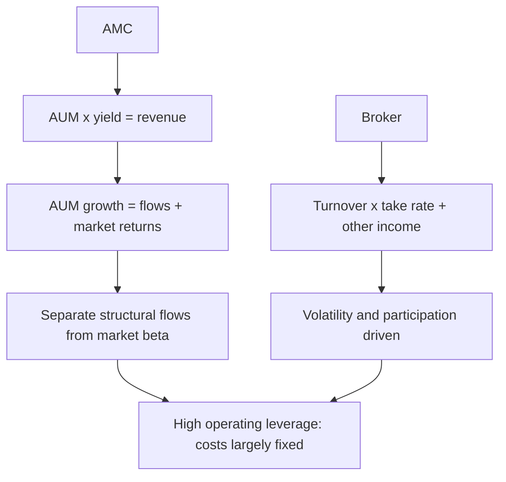

# Asset Managers, Brokers and Capital-Market Intermediaries

## The Problem / Why this matters
Asset management companies, brokers, exchanges and depositories are the businesses that *serve* the equity market rather than being ordinary constituents of it — and they have an unusual and attractive economic structure: very high operating leverage, low capital intensity, and revenue linked to market levels and activity. That last feature makes them reflexive: their earnings rise when markets rise, which means valuing them requires separating structural growth from cyclical market beta. Analysts who miss this extrapolate bull-market earnings and get the calls badly wrong.

## Core Idea
These are **annuity-on-assets or fee-per-transaction businesses** with high fixed costs. The core analysis is separating **structural growth** (rising financialisation, new customers, share gains) from **cyclical beta** (market levels and turnover), because only the former deserves a durable multiple.

## Why it works this way
An asset manager earning a percentage of assets under management has revenue that rises with markets even if it acquires no new customers. A broker earning per trade has revenue that rises with volatility and turnover. Both look excellent at market peaks and poor at troughs, so a naive multiple applied to current earnings systematically buys the top and sells the bottom — the same inversion trap that governs commodities, in a different guise.

## Full technical content

### Asset management companies (AMCs)

**Revenue = Average AUM × yield (management fee as % of AUM)**

| Metric | What to watch |
|---|---|
| **AUM** | Absolute, and its split by asset class |
| **AUM mix** | **Equity vs debt vs liquid** — equity carries far higher fees |
| **Yield / blended fee** | Basis points on AUM; structurally declining industry-wide |
| **Net flows** | The structural indicator, separated from market appreciation |
| **SIP book and SIP count** | Sticky, recurring, predictable flows — the sector's quality metric |
| **Market share** | By asset class, and in individual/retail versus institutional |
| **Cost-to-income** | Operating leverage measure |
| **Equity AUM share** | The single biggest driver of blended yield |

**The essential decomposition: AUM growth = net flows + market returns.** An AMC reporting 25% AUM growth in a year when equity markets rose 22% has grown almost entirely on market beta, which will reverse in a downturn. Net flows are the structural signal, and **SIP flows** especially, because they are automated, recurring and far less sensitive to market sentiment than lump-sum flows.

**Yield compression is the sector's structural headwind.** Regulatory caps on total expense ratios, competition, the shift toward passive products (which carry a fraction of active fees), and the growth of direct plans (which bypass distributor commissions and carry lower TERs) all push blended yields down over time. A forecast assuming stable yields is usually wrong; model gradual compression and let mix shift toward equity partially offset it.

**Operating leverage is high** — costs are largely fixed (fund management, distribution infrastructure, compliance), so incremental AUM drops through at very high margins. This is what produces the sector's excellent economics in good markets and the sharp reversal in bad ones.

**Valuation:** the sector convention is **percentage of AUM** (market cap ÷ AUM) as a cross-check, alongside P/E. The AUM multiple should reflect mix — an AMC with high equity AUM share deserves a higher percentage-of-AUM valuation than one dominated by low-fee liquid funds. Cross-check on P/E against growth, remembering to normalise for where markets sit in their own cycle.

### Brokers

**Revenue = turnover × take rate, plus interest income (margin funding), plus distribution and other income.**

| Metric | What to watch |
|---|---|
| **Active clients** | The genuine customer base (exchange-defined active) |
| **Client additions** | Growth, and the cost of acquisition |
| **Market share** | In cash, F&O, and by segment |
| **Turnover and its mix** | Cash vs derivatives; delivery vs intraday |
| **Blended yield** | Revenue per unit of turnover, structurally declining |
| **MTF / margin book** | Interest income, a growing revenue stream |
| **Cost-to-income** | Operating leverage |
| **Revenue diversification** | Share from non-broking sources |

**The reflexivity point is acute here.** Broker revenue rises with market turnover, which rises with volatility and retail participation — both of which peak with bull markets. Applying a bull-market P/E to bull-market earnings compounds the error in both directions.

**The discount-broking structural shift** compressed per-trade pricing dramatically, which means volume growth has been partially offset by yield decline. The strategic response across the industry has been **revenue diversification** — margin trading funding (interest income), distribution of mutual funds and insurance, and wealth management — and the share of revenue from these more stable sources is a genuine quality metric.

**Regulatory sensitivity is unusually high**: changes to margin requirements, F&O lot sizes, position limits, or expiry structures directly affect turnover and therefore revenue, and these have been active areas of regulatory attention.

### Exchanges and depositories

Structurally the most attractive businesses in this group:
- **Near-monopoly or duopoly positions** with powerful network effects — liquidity attracts liquidity, which is among the strongest moats that exist.
- **Very high operating leverage** — incremental trades cost almost nothing to process.
- **Multiple revenue streams** — transaction charges, listing fees, market data, index licensing, clearing and settlement, and colocation services.
- **Regulated** — pricing is subject to oversight, which caps the upside.

**Diversification away from pure transaction revenue** (data, index licensing, listing services) is the quality signal, because it reduces dependence on market turnover cycles.

Depositories similarly benefit from network effects and earn annuity-like custody and transaction fees, with revenue tied to the number of demat accounts and transaction volumes.

### The reflexivity discipline — the sector's central analytical issue

Every business in this group has earnings correlated with market levels. The disciplined approach:

1. **Normalise** — estimate earnings at mid-cycle market levels and turnover, not current.
2. **Decompose growth** into structural (customer additions, financialisation, share gains) and cyclical (market appreciation, turnover surges).
3. **Apply the multiple to normalised earnings**, and be explicit that the multiple should be *lower* when current earnings are cyclically elevated.
4. Recognise that these stocks are **high-beta expressions of the market itself** — recommending them is partly a market call, and should be stated as such.

### The structural growth story

The genuine long-term case for the sector, distinct from market beta:
- **Financialisation of savings** — household savings shifting from physical assets (gold, real estate) to financial ones.
- **Rising equity participation** — demat account growth, SIP penetration, and first-time investors from smaller cities.
- **Low base penetration** relative to comparable economies.
- **Formalisation and digitisation** lowering the cost of acquiring and serving customers.

This is real and is what justifies a growth multiple — but it must be separated from the cyclical component, because in any given year the cyclical component usually dominates the reported numbers.

### Red flags

- AUM growth driven almost entirely by **market appreciation** with weak or negative net flows.
- **SIP flows declining** or SIP discontinuation rates rising — the sticky base eroding.
- Blended yield compressing faster than mix improvement offsets.
- Broker: client additions high but **active-client conversion** poor.
- Broker: revenue heavily concentrated in F&O ahead of regulatory tightening.
- Any of these valued on **peak-cycle earnings** at a peak-cycle multiple.
- Rising client-acquisition cost with falling revenue per client.

## Common mistakes
- Not separating **net flows from market returns** in AUM growth.
- Assuming **stable fee yields** despite structural compression.
- Applying a full multiple to **cyclically elevated** earnings.
- Treating broker volume growth as structural when it reflects a volatility spike.
- Ignoring **regulatory risk** to F&O turnover, which is material for brokers.
- Valuing an AMC on percentage of AUM without adjusting for **asset mix**.
- Forgetting that these are **high-beta market proxies**, so recommending them embeds a market view.

## Interview angle
"An AMC's AUM grew 25% this year. How impressed are you?" The expected first move is to decompose: how much came from net flows versus market appreciation? If equity markets rose 22%, the structural growth is minimal and the AUM gain will reverse in a drawdown. Then examine flow quality — SIP flows are sticky and recurring, lump-sum equity flows are sentiment-driven and reverse fastest. Check the AUM mix, since equity carries far higher fees than liquid funds and mix drives blended yield more than anything else. Note the structural yield compression from TER caps, passive competition and direct plans. Finally, value on normalised rather than peak-market earnings, and be explicit that recommending the stock embeds a market call.
