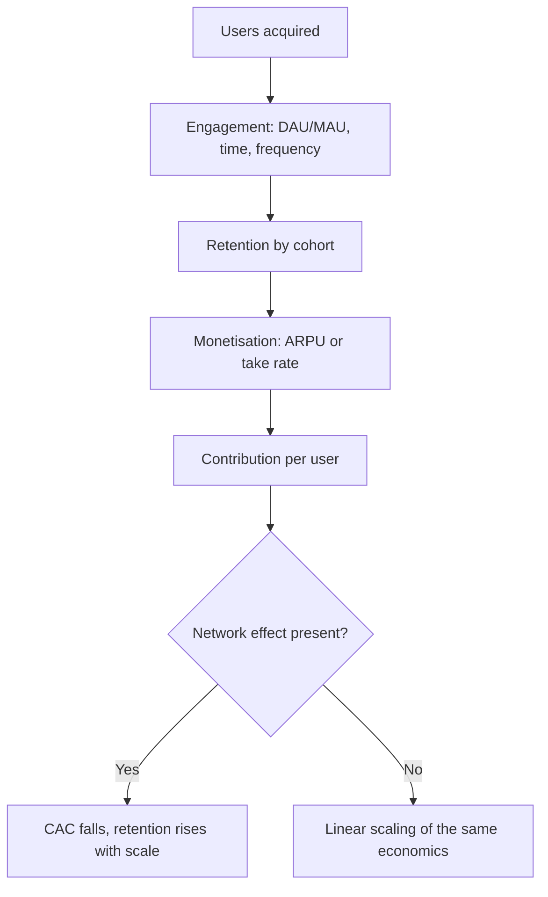

# Media, Internet and Platform Businesses

## The Problem / Why this matters
Platform and internet businesses defeat conventional analysis in a specific way: their most valuable asset — the network of users and the data about them — appears nowhere on the balance sheet, while the spending that builds that asset is expensed immediately as a loss. The result is that the accounts of a successful scaling platform and a failing one can look similar, and distinguishing them requires an entirely different metric set. With several such businesses now listed in India, this is no longer a niche competence.

## Core Idea
Platform value comes from **network effects and engagement**, measured through user cohorts and unit economics rather than through the income statement. The central analytical question is whether the network effect is genuine and strengthening, because that is what makes scale economics improve rather than merely enlarge.

## Why it works this way
In a business with genuine network effects, each additional user makes the product more valuable to existing users, which lowers acquisition cost and raises retention over time — the economics improve with scale. Without that property, growth is simply a larger version of the same unit economics, and if those units are unprofitable, scale makes matters worse. This distinction is the whole game, and it is invisible in consolidated financials.

## Full technical content

### The engagement metric set

| Metric | Meaning | What good looks like |
|---|---|---|
| **MAU / DAU** | Monthly / daily active users | Growth, and quality of the "active" definition |
| **DAU/MAU ratio** | Stickiness — how often monthly users return | Higher indicates habitual use |
| **Time spent / sessions** | Engagement depth | Rising with scale |
| **Retention by cohort** | Share of a cohort still active after N months | Curves that flatten rather than decay to zero |
| **ARPU** | Revenue per user | Rising through better monetisation |
| **Take rate** | Platform commission ÷ GMV | Stable or rising indicates pricing power |

**The definition of "active" matters enormously** and varies between companies — a user who opened the app once in thirty days is not comparable to one transacting weekly. Read the definition in the disclosures before comparing across companies or over time, and watch for definitional changes, which conveniently tend to occur when the metric weakens.

**Cohort retention curves are the single most informative disclosure.** A curve that decays steeply and continues toward zero indicates no durable habit; one that flattens at a meaningful level indicates a retained base on which lifetime value can be built. Comparing *successive* cohorts is even more informative — newer cohorts retaining better than older ones is a genuinely strong signal, and the reverse is the earliest warning that growth quality is deteriorating.

### Testing whether network effects are real

The claim is made far more often than it is true. Evidence that would support it:

| Test | What genuine network effects produce |
|---|---|
| **CAC trend** | Falling or stable as scale grows — organic and referral acquisition rising |
| **Organic share of new users** | Rising proportion arriving without paid acquisition |
| **Retention by cohort** | Newer cohorts retaining better |
| **Take rate** | Stable or rising — pricing power because participants cannot easily leave |
| **Competitive entry outcomes** | Well-funded entrants failing to gain durable share |
| **Multi-homing** | Low — users do not routinely use competitors simultaneously |

**Multi-homing is the key vulnerability test.** If users and suppliers routinely operate on several platforms at once — as is common in food delivery, ride-hailing and travel aggregation — the network effect is weak, switching costs are minimal, and competition tends to be resolved through discounting rather than through durable advantage. Categories with genuine single-homing behaviour are far more defensible.

**Rising CAC with rising scale is the strongest evidence *against* a network effect** — it indicates the company has exhausted its most accessible users and is buying progressively more expensive ones, which is the opposite of what a network effect produces.

### Business-model variants

| Model | Revenue driver | Key metrics |
|---|---|---|
| **Marketplace** | Take rate on GMV | GMV, take rate, buyer/seller retention, multi-homing |
| **Advertising** | Impressions × CPM, or clicks × CPC | Users, time spent, ad load, pricing |
| **Subscription** | Subscribers × price | Churn, ARPU, content cost per subscriber |
| **Transactional / fintech** | Payments volume × take rate | TPV, take rate, credit losses if lending |
| **Content/OTT** | Subscription and/or advertising | Content cost, churn, engagement per title |

**GMV is not revenue** — a point that bears repeating because it is the most frequent error in this space. A marketplace reporting large GMV earns only its take rate, and valuing it on a multiple of GMV rather than net revenue overstates value by the inverse of the take rate.

**For content and OTT specifically:** content is a capitalised asset amortised over time, and the critical questions are content cost per subscriber, whether content spend is rising faster than subscribers, and how much of the library drives ongoing engagement versus being written off. Content businesses can have terrible economics disguised by capitalisation.

### Monetisation maturity

A common and legitimate platform strategy is to build the user base first and monetise later, which means early revenue understates potential. Assessing whether that potential is real:
- **Monetisation in comparable markets** — what ARPU do equivalent platforms achieve in more mature geographies at similar income levels?
- **Willingness-to-pay evidence** — pricing tests, conversion of free to paid.
- **Ad load headroom** — for advertising models, how much inventory remains unmonetised.
- **Adjacent revenue streams** — advertising layered onto a marketplace, financial services onto a transaction platform.

The risk to name: **monetisation frequently degrades engagement**. Raising take rates or ad loads can reduce the very usage that made the platform valuable, so monetisation potential is not free — and the trade-off should be modelled rather than assumed away.

### Valuation

- **DCF to a defined steady state** — the most rigorous, and highly sensitive to terminal margin and scale assumptions, so present as a range.
- **EV/Sales** with an explicit terminal-margin bridge; never as a bare multiple.
- **Forward P/E on the maturity year**, discounted back.
- **Per-user valuation** (EV ÷ active users) as a cross-check against comparable platforms — crude, but useful for sanity-checking.
- **Reverse-DCF** to state what the market is implying, then test that against implied market share and achievable ARPU.

**Dilution must be modelled explicitly.** Loss-making platforms fund themselves with equity, and ESOP issuance in this sector is unusually heavy. Per-share value can stagnate while enterprise value grows, and ignoring this is a material error.

### Red flags

- **CAC rising** with scale — network effects absent.
- Newer **cohorts retaining worse** than older ones.
- **"Active user" definition changed** or unusually loose.
- **GMV growth** highlighted while take rate and contribution margin are not disclosed.
- Engagement metrics disclosed selectively, or a previously-reported metric quietly dropped.
- Heavy **multi-homing** in the category with discount-driven competition.
- Content spend rising faster than subscribers in an OTT business.
- Aggressive capitalisation of content or technology development.
- ESOP dilution running at a high percentage of share count annually.

## Common mistakes
- Confusing **GMV with revenue**.
- Accepting a **network effect claim** without testing CAC trends, organic share and multi-homing.
- Using **blended** rather than marginal CAC, masking cohort deterioration.
- Ignoring the definition of "active" users.
- Not modelling **dilution** from ongoing equity funding and ESOPs.
- Assuming monetisation is free rather than a trade-off against engagement.
- Valuing on EV/Sales without a terminal-margin view.
- Extrapolating a bull-market funding environment in which losses can be financed indefinitely.

## Interview angle
"How would you tell a real network effect from a story?" Give the tests rather than the theory: is customer acquisition cost falling or at least stable as the platform scales, and is the organic share of new users rising — because a genuine network effect makes acquisition cheaper over time; are newer cohorts retaining better than older ones; has the take rate held or risen, indicating participants cannot easily leave; and crucially, how much **multi-homing** exists in the category, because if users and suppliers routinely use several platforms simultaneously, switching costs are near zero and competition resolves through discounting rather than durable advantage. Then add the falsifier: rising CAC alongside rising scale is direct evidence against the claim, whatever management says.
