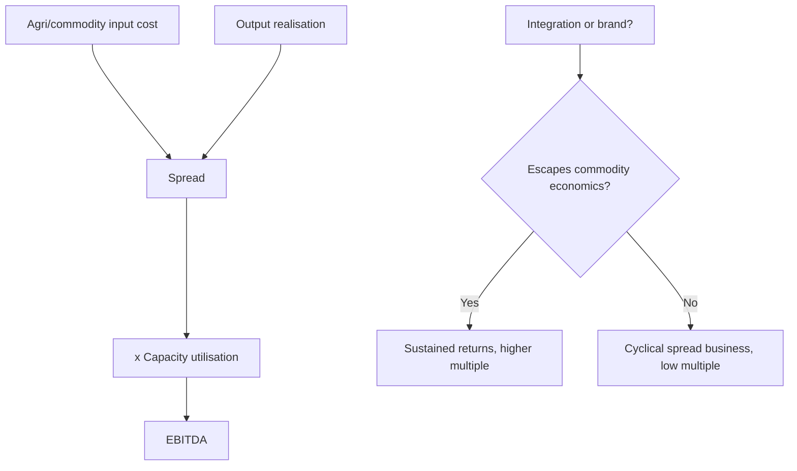

# Textiles, Paper and the Agri Value Chain

## The Problem / Why this matters
These are the sectors most Indian analysts encounter early in their careers because they are heavily represented among mid- and small-cap companies, and they are the sectors where the most capital has historically been destroyed. All three are commodity-adjacent, capital-intensive, working-capital-heavy, and subject to input costs the company cannot control — a combination that produces persistent value destruction unless a specific structural advantage exists. Learning to identify the exceptions is the analytical task.

## Core Idea
All three are **spread businesses with agricultural or commodity inputs**: the analysis reduces to input cost versus realisation, capacity utilisation, and whether the company has integration or brand that lifts it above pure commodity economics.

## Why it works this way
When the input is an agricultural commodity with volatile, weather-driven pricing and the output is largely undifferentiated, margins compress in both directions — input spikes are hard to pass on quickly, and input collapses invite competitive price cuts. Only integration (owning more of the chain) or genuine branding (escaping fungibility) breaks the pattern.

## Full technical content

## Part 1 — Textiles

### The value chain

Textiles is a long chain, and where a company sits determines its economics entirely:

**Cotton → yarn (spinning) → fabric (weaving/knitting) → processing → garments → retail/brand**

| Segment | Economics |
|---|---|
| **Spinning** | Pure commodity; cotton-yarn spread is everything; highly cyclical |
| **Weaving/knitting** | Commodity, fragmented, low barriers |
| **Processing** | Capital and environmental-compliance intensive |
| **Home textiles** | Export-oriented; customer concentration with large global retailers |
| **Garments** | Labour-intensive; competes with Bangladesh and Vietnam on cost |
| **Branded apparel** | The only genuinely value-accretive segment — brand escapes fungibility |

**The cotton-yarn spread** is the sector's core variable for spinners. Cotton prices are driven by acreage, monsoon, global crop, MSP and export policy — all outside management control. Spinners with no downstream integration are pure spread plays, and their earnings are effectively a bet on that spread.

**Key drivers:**
- **Cotton price and availability** — domestic versus international parity, government MSP and procurement, and export restrictions, which have repeatedly changed abruptly.
- **Capacity utilisation** — high fixed costs mean utilisation drives fixed-cost absorption.
- **Export competitiveness** — versus Bangladesh, Vietnam and China. Labour cost, scale, duty access under trade agreements, and logistics all matter.
- **Government schemes** — production-linked incentives, interest subvention and export incentives materially affect economics and can change with policy.
- **Working capital** — cotton is procured seasonally and inventoried, so the sector carries heavy working capital and is vulnerable when cotton prices fall after procurement.

**The quality differentiator:** integration downstream, and any genuine brand. A vertically integrated player capturing spinning-through-garment margin is less volatile than a pure spinner; a branded apparel company operates in a different economic universe altogether and should be analysed with the consumer/retail framework rather than this one.

## Part 2 — Paper

### The framework

**Realisation per tonne − cost per tonne, × volume** — structurally identical to cement and metals.

| Input | Consideration |
|---|---|
| **Wood / agro-residue** | Captive plantations are a genuine cost and security advantage |
| **Recycled fibre (waste paper)** | Imported for many producers; price-volatile |
| **Pulp** | Imported pulp price is the global benchmark driver |
| **Energy** | Very energy-intensive; captive power is a structural advantage |
| **Chemicals** | Meaningful input |

**Segment economics differ sharply:**
- **Writing and printing paper** — mature, structurally challenged by digitisation, though education/textbook demand provides a floor in India.
- **Packaging paper / kraft** — the growth segment, driven by e-commerce, FMCG packaging and the substitution away from single-use plastics. Structurally the most attractive part of the sector.
- **Tissue and speciality** — small but growing, higher realisation.
- **Newsprint** — structurally declining.

**The analytical points:**
- **Integration into captive plantations** materially reduces input volatility and is a genuine, hard-to-replicate advantage given the land and time required.
- **Captive power** is significant given energy intensity.
- **Import parity** sets domestic pricing, so global pulp and paper prices plus duty structure drive realisation.
- **Environmental compliance** is a rising cost and a genuine barrier to entry — an advantage to established, compliant players.
- The **plastic-substitution theme** is real but must be assessed for whether the specific company has the right product mix and capacity to benefit.

## Part 3 — Agri value chain

A diverse group requiring separate treatment:

| Sub-sector | Economics |
|---|---|
| **Sugar** | Highly regulated: cane price (FRP/SAP) is government-set while sugar price is market-determined — a structural margin squeeze. Ethanol blending has materially improved the economics by providing an alternative, better-priced outlet |
| **Edible oils** | Import-dependent, thin margins, duty-structure sensitive, brand matters at the consumer end |
| **Agrochemicals** | Covered separately under chemicals |
| **Seeds** | R&D-driven, higher margin, regulatory approval barriers, better economics than most agri |
| **Fertilisers** | Subsidy-driven; receivables from government are the key working-capital risk |
| **Food processing** | Moves toward consumer economics as branding increases |
| **Dairy** | Procurement network is the moat; milk price volatility; branded value-added products carry far better margins |

**The sugar case is worth understanding specifically** because it illustrates how regulation shapes economics: cane cost is fixed by government formula regardless of sugar prices, so when sugar prices fall the entire squeeze lands on the miller. **Ethanol blending programmes changed this materially** by allowing diversion of cane juice or B-heavy molasses to ethanol at administered prices, giving mills a second, more stable revenue stream. Analysing a sugar company now requires understanding its ethanol capacity and the diversion economics, not just sugar prices.

**Fertilisers similarly turn on the subsidy mechanism** — companies sell below cost and recover the difference from government, so **subsidy receivable levels and payment delays** are the dominant working-capital and cash-flow variable, frequently more important than operating performance.

**Dairy's moat is procurement** — a village-level milk collection network takes decades to build and is genuinely defensible. The value-added mix (curd, cheese, paneer, ice cream, whey products versus liquid milk) determines margin, and rising value-added share is the quality signal.

### Cross-cutting analytical themes

**Working capital dominates.** All three areas carry heavy inventory (seasonal agricultural procurement) and, in several cases, government receivables. Cash conversion should be checked before anything else, and growth funded by rising debt in these sectors is the standard route to distress.

**Government policy is a first-order variable**, not a background factor: MSP, export/import restrictions, subsidy mechanisms, ethanol blending targets, and duty structures each move earnings directly and can change at short notice. An analyst covering these sectors must track policy actively.

**Capacity utilisation and operating leverage** determine profitability given high fixed costs.

**The route out of commodity economics** is the same in each case: integration (capturing more of the chain), or brand (escaping fungibility at the consumer end). Companies that have achieved either deserve genuinely different treatment and multiples; those that have not should be valued as the cyclical spread businesses they are.

### Valuation

- **EV/EBITDA on mid-cycle spreads** for the commodity segments — never P/E on peak-spread earnings, per the cyclical inversion trap.
- **EV per tonne of capacity** for paper and spinning.
- **P/E** only for genuinely branded or value-added businesses.
- **SOTP** where a company has both commodity and branded/value-added segments — common in dairy, food processing and textiles, and frequently done badly.
- **P/B and replacement cost** as floor checks for asset-heavy players.

### Red flags

- Debt-funded capacity expansion at **peak spreads**.
- Heavy **inventory build** ahead of a falling input-price environment.
- **Government receivables** rising (fertilisers, sugar under some schemes).
- Pure commodity player with **no integration or brand** trading at a growth multiple.
- Export-dependent textile player losing competitiveness to lower-cost geographies.
- Reliance on a government incentive scheme with an approaching expiry.
- Environmental non-compliance or pending regulatory action in paper or processing.

## Common mistakes
- Applying **P/E to peak-spread** commodity earnings.
- Treating a spread expansion caused by an **input-price collapse** as sustainable.
- Ignoring **policy risk** — MSP, export bans, subsidy changes and duty structures move these sectors abruptly.
- Missing **working-capital intensity** and the cash consumed by growth.
- Valuing an integrated or branded player and a pure commodity player on the same basis.
- Overlooking **government receivables** as a cash-quality issue.
- Assuming a structural theme (plastic substitution, ethanol blending, China+1 in textiles) benefits every company in the sector.

## Interview angle
"A cotton spinning company reports record margins. Would you buy it?" Treat it as a spread question: record margins in spinning almost always reflect a favourable cotton-yarn spread rather than anything the company did, and spreads mean-revert. Ask where cotton prices sit relative to history, what the crop and export-policy outlook is, and what the industry capacity pipeline looks like — because peak spreads attract capacity that then compresses them. Check whether the company has any integration downstream or any brand, since a pure spinner is a spread play with no structural defence. Then note the working-capital risk: cotton procured at high prices becomes an inventory loss when prices fall. Value on mid-cycle spread EV/EBITDA, not peak-earnings P/E.
