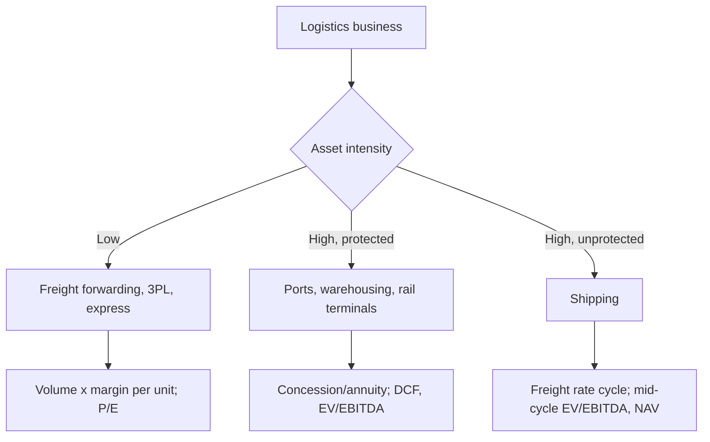

# Logistics, Ports and Shipping

## The Problem / Why this matters
Logistics spans businesses with radically different economics under one label — an asset-light freight forwarder, a capital-intensive port concession, a warehousing developer, and a shipping company whose earnings swing several hundred percent on freight rates. The sector is also the most direct listed proxy for goods movement in the economy, which makes it both a useful macro read and highly cyclical. Getting it right requires classifying by asset intensity before applying any framework.

## Core Idea
Classify by **asset intensity and contract structure**: asset-light logistics is a services business valued on P/E; ports and warehousing are infrastructure annuities valued on cash flows and concession life; shipping is a pure commodity cycle valued on mid-cycle earnings and asset value.

## Why it works this way
An asset-light forwarder earns a margin on arranging transport, needs little capital, and scales with volumes — its returns are stable and its risk is competitive. A port has enormous sunk capital, a concession granting exclusivity, and near-fixed costs — its returns are annuity-like once volumes mature. A shipowner has enormous sunk capital and *no* protection, so its returns are set entirely by the global vessel supply-demand balance.

## Full technical content

### Asset-light logistics — express, 3PL, freight forwarding

**Revenue = volume × realisation per unit (per tonne, per shipment, per TEU)**

| Metric | What to watch |
|---|---|
| **Volume growth** | Tonnage or shipment count — the demand read |
| **Realisation per unit** | Pricing; mix between express, surface and air |
| **Gross margin per shipment** | After bought-in transport cost |
| **Network utilisation** | Load factor on owned or contracted capacity |
| **Fixed cost absorption** | Hub and network costs are fixed; volume drives leverage |
| **Customer mix** | B2B contract logistics vs B2C e-commerce delivery |

**The e-commerce shift** transformed this space: B2C delivery has higher volumes, smaller shipment sizes, more complex last-mile economics and higher return rates than traditional B2B freight. **Cost per shipment and first-attempt delivery rate** are the operational metrics that determine whether B2C volume is profitable, and companies that grew B2C volumes without those economics working have destroyed value.

**Contract logistics / 3PL** is stickier — running a customer's warehousing and distribution creates switching costs and multi-year contracts, so it earns a better multiple than spot freight brokerage.

**Freight forwarding** is largely a spread business on bought-in ocean and air capacity: forwarders benefit from rate volatility (buying capacity in bulk and selling in smaller lots) but the underlying business is competitive and low-margin.

### Ports and terminals

Infrastructure economics with concession protection:

| Metric | Meaning |
|---|---|
| **Cargo volume** | TEUs for containers, tonnes for bulk |
| **Cargo mix** | Containers (higher realisation, stickier) vs bulk vs liquid |
| **Realisation per TEU/tonne** | Tariff, often regulated at major ports and market-determined at private ones |
| **EBITDA per TEU/tonne** | The unit profitability metric |
| **Capacity utilisation** | Operating leverage; fixed costs are high |
| **Concession life remaining** | **Critical** — the asset reverts at expiry |
| **Hinterland connectivity** | Rail and road links determine catchment |

**Concession structure is the central analytical issue.** A port operating under a concession that expires in twelve years has a finite asset — cash flows end (or the asset transfers back) at expiry, so a DCF over the remaining concession life is the correct valuation, and applying a perpetuity multiple materially overstates value. Check: remaining life, renewal terms, revenue-share obligations to the concessioning authority, and any capex commitments under the concession.

**Volume drivers:** EXIM trade volumes, domestic industrial activity, commodity flows, and — importantly — **competition from neighbouring ports**, since a port's catchment can be eroded by a competitor with better connectivity. Hinterland rail links are frequently the deciding factor.

### Warehousing and logistics parks

Increasingly a real-estate-like business:
- Valued on **rental yields and occupancy**, similar to commercial REIT analysis.
- **Grade-A warehousing** demand driven by e-commerce, organised retail and the post-GST consolidation of warehousing into fewer, larger, better-located facilities.
- **WALE, tenant quality and rental escalations** matter as they do for REITs.
- Development pipeline and land bank drive growth.

### Shipping — the pure cycle

Shipping is among the most volatile sectors in any market, and the mechanism is worth understanding precisely:

**Freight rates are set by the global supply-demand balance for vessels.** Demand is trade volumes; supply is the world fleet plus the orderbook less scrapping. Because vessels take 2–3 years to build and last 20–25 years, supply responds to price with a long lag — the classic capacity-cycle mechanism in its most extreme form.

| Metric | What it tells you |
|---|---|
| **Freight rate indices** | Baltic Dry Index (dry bulk), tanker rate indices, container indices |
| **Orderbook as % of fleet** | **The key forward supply indicator** — a large orderbook means rates will fall |
| **Scrapping rates** | Supply removal; rises when rates are poor |
| **Fleet age** | Older fleets scrap sooner; also affects fuel efficiency and compliance cost |
| **Charter cover** | Share of fleet on long-term charters vs spot — determines earnings volatility |
| **Vessel NAV** | Fleet market value less debt — the asset-value floor |

**Charter structure determines the business's character:** a shipping company with most of its fleet on multi-year time charters has annuity-like, predictable earnings and should be valued accordingly; one operating in the spot market is a leveraged bet on freight rates. These are genuinely different businesses and must not be given the same multiple.

**The orderbook is the sector's most valuable public data.** Global orderbooks as a percentage of the existing fleet are published, and because delivery schedules are known, future supply is highly forecastable — a large orderbook delivering into flat demand guarantees rate weakness regardless of current conditions. Analysts who track this have a real edge over those who extrapolate current rates.

**Valuation:** **NAV** (fleet market value less net debt) is the primary anchor, since vessels are traded assets with observable prices. Shipping companies trade at large discounts to NAV in downturns and premiums at peaks. Cross-check with EV/EBITDA on **mid-cycle** rates, never on peak.

### Cross-sector considerations

**The macro read:** logistics volumes are among the cleanest available proxies for real economic activity. **E-way bill volumes, port cargo data, rail freight volumes and freight rate indices** are published frequently and give an early read on goods movement — useful for the sector itself and as a leading indicator for industrials and consumer sectors generally.

**Fuel cost** is a major variable across road, rail, air and sea, with pass-through mechanisms varying by contract. Whether fuel is a pass-through determines who bears commodity risk.

**Regulatory and structural change:** GST consolidated warehousing; dedicated freight corridors shift road-to-rail economics; multimodal logistics parks and the broader national logistics policy affect route economics. These are genuine structural shifts, not background noise.

### Red flags

- Shipping: fleet expansion ordered at **peak rates**, delivering into a large industry orderbook.
- Shipping: heavy **spot exposure** with high leverage.
- Ports: **short remaining concession life** valued on a perpetuity basis.
- Ports: volume growth from a single commodity or customer.
- Asset-light: **volume growth with falling realisation** — buying share.
- Asset-light: B2C volume growth without cost-per-shipment improvement.
- Any: debt-funded capacity added into a cyclical peak.

## Common mistakes
- Applying one framework across **asset-light, infrastructure and shipping** businesses.
- Valuing a **finite-life concession** on a perpetuity multiple.
- Using **P/E on peak freight rates** in shipping.
- Ignoring the **global orderbook**, which makes future vessel supply largely knowable.
- Treating spot-exposed and charter-covered shipping companies as comparable.
- Missing **hinterland competition** when assessing a port's volume outlook.
- Assuming e-commerce volume growth is automatically profitable in last-mile delivery.

## Interview angle
"Freight rates have tripled. Would you buy a shipping company?" The expected reflex is caution rather than enthusiasm: tripled rates mean peak earnings, and a low P/E on peak earnings is the classic cyclical trap. The decisive question is the **global orderbook as a percentage of the existing fleet** — because vessels ordered now deliver in two to three years and will compress rates then, and that supply is already knowable. Then check the company's charter cover, since a spot-exposed fleet captures the upside but has no protection when rates normalise, and its leverage, since shipping companies fail in downturns. Value on NAV against fleet market value and on mid-cycle EV/EBITDA, and note that the right time to buy shipping is usually when rates are poor and the orderbook is empty.
