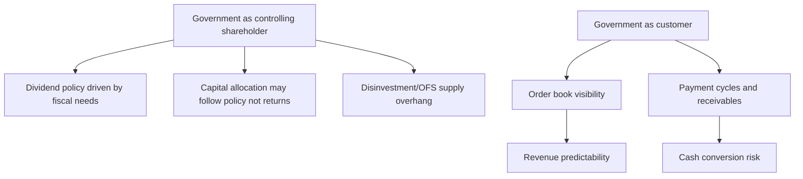

# Defence, Railways and PSU Analysis

## The Problem / Why this matters
Public sector undertakings and government-linked contractors are a large and growing part of the Indian listed market, and they break several assumptions that ordinary equity analysis relies on. The dominant shareholder is the government, whose objectives include but are not limited to shareholder value; the primary customer is often also the government; capital allocation is subject to fiscal rather than commercial logic; and order books can be enormous while conversion to cash is slow. Analysing these companies with a standard private-sector framework produces systematically wrong answers in both directions.

## Core Idea
For a PSU, the **government's dual role as controlling shareholder and principal customer** is the central analytical fact. It creates a genuinely different risk-return profile: order visibility and demand security on one side, capital-allocation and minority-treatment risk on the other.

## Why it works this way
A controlling shareholder with non-commercial objectives can direct decisions that a purely profit-maximising owner would not — high dividend payouts to meet fiscal targets, capex driven by policy, pricing set below commercial levels, or cross-subsidy of related entities. None of this is improper, but all of it affects minority shareholders and must be priced.

## Full technical content

### The PSU-specific analytical framework

**1. Government shareholding and disinvestment risk.** The holding percentage matters directly: a high government stake means a persistent possibility of an offer-for-sale or strategic disinvestment, which creates supply overhang. Track the announced disinvestment pipeline and the minimum public shareholding position, since MPS compliance can itself force supply.

**2. Dividend policy.** PSUs frequently carry very high payout ratios because the government uses dividends to meet fiscal targets. This can be genuinely attractive for a yield-oriented investor, but it should be read as **fiscally driven rather than as evidence of capital-allocation discipline** — the same payout in a private company would signal management returning what it cannot reinvest, whereas here it may signal a shareholder extracting cash regardless of reinvestment opportunities.

**3. Capital-allocation quality.** Apply the incremental-RoCE test as usual, but expect the answer to reflect policy objectives. Capex directed by strategic considerations rather than returns is common; so is acquisition of stressed assets at government direction. Both are legitimate national objectives and simultaneously value-negative for minority holders, and a research note should say so plainly.

**4. Pricing and subsidy mechanisms.** Where a PSU sells at administered or subsidised prices, the subsidy-recovery mechanism becomes the dominant financial variable — the fertiliser and oil-marketing cases being the clearest. **Subsidy receivables and the timing of government payment** frequently matter more than operating performance.

**5. Operational efficiency.** PSUs vary enormously. Some are genuinely well-run with competitive cost structures; others carry excess employee cost, low asset turns and weak working-capital discipline. Judge empirically — employee cost per unit of output, asset turns, working-capital days versus private peers — rather than by reputation in either direction.

**6. Governance and minority treatment.** Board independence is constrained; related-party transactions with other government entities are common; and decisions serving policy over returns are a genuine, recurring risk. The historical record of how minorities have been treated in past restructurings, mergers and capital raises is the best available evidence.

### Defence

A sector transformed by the indigenisation policy push, and one where order books have become very large.

| Metric | What to watch |
|---|---|
| **Order book** | Size, and **execution timeline** — defence orders run over many years |
| **Order inflow** | New contracts won; the leading indicator |
| **Indigenisation content** | Domestic value addition; policy-favoured |
| **Execution rate** | Revenue ÷ opening order book — defence execution is characteristically slow |
| **Margin profile** | Cost-plus vs fixed-price contracts |
| **Export orders** | Higher margin, diversifies away from a single domestic customer |
| **Receivables** | Government payment cycles |

**The central analytical caution:** defence order books are frequently enormous relative to revenue — coverage of five to ten years is not unusual — which makes headline backlog numbers spectacular and revenue conversion slow. **The execution rate, not the order book, determines near-term earnings**, and the gap between an impressive backlog and modest revenue growth is where expectations get mispriced. Ask what proportion of the book is actually executable in the next two years, and what has historically slipped.

**Contract structure matters:** cost-plus contracts protect margin but cap it; fixed-price contracts risk overruns, particularly on long-duration development programmes with technology risk. Development-stage programmes carry genuine execution risk that production-stage orders do not.

**Barriers to entry are unusually high** — security clearances, capability, qualification and long-standing relationships — which supports margins for established players. This is a real moat, and one of the reasons the sector deserves more than a commodity-contractor multiple.

### Railways

The listed railway ecosystem spans rolling stock manufacturers, wagon makers, signalling and electrification contractors, track construction and catering/tourism entities.

- **Demand is government capex driven**, so budget allocations and — critically — **execution rates against those allocations** are the driver. Historically, announced allocations have exceeded actual spend, so tracking execution rather than announcement is the analytical discipline.
- **Order book and execution** framework applies as in capital goods.
- **Customer concentration is total** in most cases — a single customer with administered pricing and long payment cycles.
- **Competitive intensity** varies: some segments are effectively single-supplier, others are competitively bid with thin margins.
- **Capacity and capability** to execute a rapidly growing order book is the practical constraint, and companies frequently under-deliver against backlog for this reason.

### Oil marketing and refining PSUs

A distinct case worth noting because of the pricing mechanism:
- **Refining margin (GRM)** is the commodity-driven component — the spread between crude and product prices, set globally.
- **Marketing margin** is the retail component, which in practice has been subject to informal pricing restraint during periods of high crude prices, transferring the burden from consumers to the companies.
- The result is that **earnings can diverge sharply from what the underlying spreads would imply**, based on pricing decisions that are not commercially determined.
- **Inventory gains and losses** on large crude and product inventories add substantial reported-earnings volatility unrelated to operations, and should be stripped out to assess underlying performance.

### Valuation of PSUs

- Standard sector frameworks apply for the operating business — the sector-appropriate multiple.
- **A PSU discount is empirically observable and analytically defensible**, reflecting capital-allocation risk, policy interference in pricing, disinvestment overhang and governance constraints. As with holding-company discounts, derive it from the **company's own historical range** rather than applying a convention, and assess what would narrow it.
- **Dividend yield** is often a genuine part of the return case and should be assessed for sustainability — is it covered by free cash flow, and is it a stated policy?
- **Replacement cost and asset value** provide a floor for asset-heavy PSUs.
- The re-rating case, when it exists, usually rests on: improving operational metrics, a credible capital-allocation change, resolution of a subsidy or pricing issue, or a disinvestment that changes control.

### Red flags

- **Subsidy or dues receivable** rising sharply.
- Capex directed into low-return projects at policy direction.
- Acquisition of stressed government assets.
- Order book growing while **execution rate deteriorates**.
- Dividend maintained by borrowing.
- Pricing restraint imposed during a cost spike, compressing margins with no commercial recourse.
- Disinvestment announced into a weak market, creating overhang.

## Common mistakes
- Applying a private-sector **capital-allocation** framework without recognising policy objectives.
- Reading a **high dividend payout** as management discipline rather than fiscal extraction.
- Being impressed by a **defence order book** without checking the execution rate and what is realistically executable near-term.
- Assuming **budget allocations equal actual spending** in railways and infrastructure.
- Ignoring **subsidy receivables** as the dominant cash-flow variable where they exist.
- Applying a conventional PSU discount rather than the company's own historical range.
- Treating **inventory gains** in refining as operating performance.
- Dismissing all PSUs as poorly run — several are operationally competitive, and the evidence should decide.

## Interview angle
"A defence PSU has an order book of eight times revenue. Attractive?" Engage with the execution question rather than the headline: eight times coverage sounds spectacular, but defence programmes run over many years and historically slip, so the relevant number is how much of that book is realistically executable in the next two to three years and what the historical execution rate against opening backlog has been. Then check contract structure — cost-plus protects margin but caps it, fixed-price development programmes carry real overrun risk — and receivables, given government payment cycles. Finally address the PSU dimension: capital allocation may follow policy rather than returns, the dividend may be fiscally driven, and disinvestment creates supply overhang — all of which justify a discount that should be derived from the company's own history rather than assumed.
