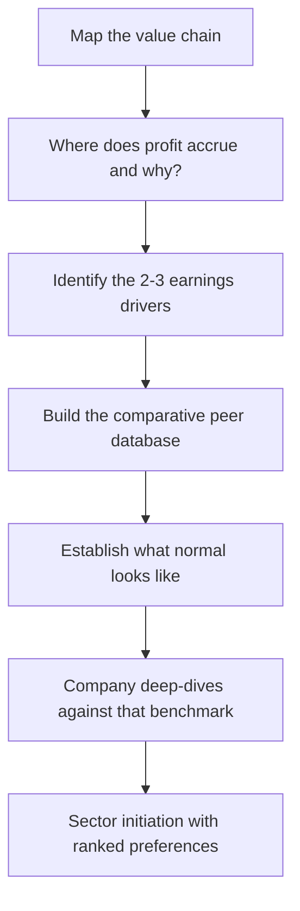

# Building a Sector Model and Initiating Sector Coverage

## The Problem / Why this matters
An analyst asked to take on a new sector faces a genuinely different problem from analysing one more company in a familiar space. There is no existing mental model, no sense of what normal looks like, no peer benchmarks, and no instinct for which metrics matter. Doing this well — building a working understanding of an unfamiliar sector from scratch in weeks rather than years — is one of the most valuable and least taught skills in equity research, and it is exactly what a lateral hire or a sector-reassignment demands.

## Core Idea
Build the sector understanding **top-down and comparatively**: map the value chain to find where profit accrues, identify the two or three variables that actually drive earnings, build a **comparative peer database** so "normal" becomes visible, and only then go deep on individual companies.

## Why it works this way
Company-level analysis without sector context produces conclusions with no benchmark — a 14% margin means nothing until you know whether peers earn 8% or 22%. The comparative frame is what converts raw numbers into judgements, so it must be built first even though the instinct is to start with the largest company.

## Full technical content

### Step 1 — Map the value chain

Before any company work, understand the chain from raw input to end customer, and at each link ask: who has pricing power, what are the barriers, and where does the profit pool actually sit? The metals, cement and pharma frameworks in earlier chapters are all applications of this single method.

Practical sources: industry association reports, regulator publications, the annual reports of companies at *each* link (a customer's annual report tells you about your company's pricing power), global peers in more mature markets, and consultant/industry reports for structure and sizing.

### Step 2 — Identify the earnings drivers

Every sector reduces to two or three variables that explain most earnings variation. Finding them quickly is the core skill:

| Sector | Dominant drivers |
|---|---|
| Banks | Loan growth, NIM, credit cost |
| IT services | cc revenue growth, utilisation, currency |
| Cement | Regional utilisation → realisation; power/fuel cost |
| Autos | Volumes, mix, raw-material cost |
| Pharma (US generics) | Launches, price erosion, plant status |
| Hotels | RevPAR (supply-demand balance) |
| Shipping | Freight rates (fleet supply vs trade demand) |

**The test of whether you have found them:** can you explain the last five years of a company's EBITDA variation using only those variables? If not, keep looking. This exercise — regressing or simply tabulating historical earnings against candidate drivers — is the fastest route to genuine sector understanding.

### Step 3 — Build the comparative database

The single highest-value artefact in sector coverage. A spreadsheet with every listed company in the sector, ideally including global comparables, containing 5–10 years of:

- Revenue, growth, and the sector-specific volume/price decomposition
- Margins at each level (gross, EBITDA, EBIT, net)
- **RoCE and RoE** — the returns comparison that reveals quality
- Capital intensity: capex/sales, asset turns
- Working capital days, decomposed
- Leverage: net debt/EBITDA, interest coverage
- Cash conversion: CFO/EBITDA, cumulative CFO vs PAT
- The **sector-specific operating metrics** (utilisation, per-tonne, per-store, per-subscriber)
- Valuation multiples, current and historical ranges

What this produces that nothing else can: **a sense of what normal looks like**. Which companies sustain above-cost-of-capital returns, and which do not. Which metrics separate the good from the mediocre. Where each company sits on each dimension. It converts every subsequent company-level number into a comparative judgement rather than an isolated fact.

**Include the failures.** Companies that went bankrupt or were acquired in distress carry more information about what kills businesses in this sector than the survivors do, and survivorship-biased peer sets systematically understate risk.

### Step 4 — Establish the historical valuation frame

For each company and for the sector aggregate: the 5- and 10-year range of the relevant multiple, current position within that range, and — critically — **what the multiple did around cyclical turning points**. This is what prevents both the cyclical P/E trap and the "cheap versus history" value trap, because it forces the question of whether anything structural has changed.

### Step 5 — Talk to the industry

Sector understanding built only from filings is shallow. Prioritise:
- **Industry association** officials, who see aggregate data and structural trends.
- **Former executives** from several companies — structural and historical understanding, never current confidential information.
- **Suppliers and customers** at adjacent links, who assess your sector's participants dispassionately.
- **Consultants and specialist journalists** covering the industry.
- **Management meetings** across several companies — comparing how different managements describe the same competitive dynamics is unusually revealing.

The compliance boundary from the primary-research chapter applies throughout.

### Step 6 — Company deep-dives, ranked

Only now go company by company, using the comparative database as the benchmark throughout. For each: business model, position in the chain, moat assessment, returns history, capital allocation, governance, forecast, and valuation.

The output of a sector initiation is a **ranked preference order with the reasoning made explicit** — not just individual ratings but a clear statement of which companies you prefer and why, on which dimensions. That relative ranking is what clients actually use when allocating within a sector.

### The sector initiation note

| Section | Content |
|---|---|
| **Summary and preferences** | Ranked calls with the one-line reason for each |
| **Sector thesis** | The structural view — is the profit pool growing, and who captures it |
| **Industry structure** | Value chain, concentration, competitive dynamics, barriers |
| **Demand drivers** | What actually drives volumes, with historical elasticities |
| **Supply and capacity** | The pipeline — the most forecastable element in most sectors |
| **Cost structure** | Key inputs and their outlook |
| **Regulation** | Framework and pending changes |
| **Comparative analysis** | The peer database, presented |
| **Company sections** | Each with thesis, model summary, valuation, risks |
| **Valuation framework** | Which multiple, and why, for this sector |

### The recurring maintenance

Sector coverage is a standing commitment, not a one-time project:
- **A tracking sheet** of the sector's high-frequency data — monthly volumes, prices, spreads, utilisation, government data.
- **A capacity/supply pipeline tracker**, updated as announcements are made. Since supply is the most forecastable driver in most sectors, this is where a sustained edge accumulates.
- **Quarterly comparative updates** across the peer set, so relative performance is always visible.
- **A policy and regulation watch** for sectors where it matters.

### What good sector coverage produces

An analyst with genuine sector command can answer, without preparation: which company has the lowest cost position and why; where each sits on returns; what the supply pipeline implies for pricing over the next two years; which metric would change their view; and which company they would own and which they would avoid. That fluency is the actual deliverable — the notes are its expression.

## Common mistakes
- Starting with the **largest company** rather than with sector structure.
- Building company models with no **comparative benchmark**, so numbers have no meaning.
- Excluding **failed companies** from the peer set, understating risk.
- Not identifying the **two or three dominant drivers**, and so modelling everything with equal effort.
- Ignoring the **supply pipeline**, which is usually the most knowable and most important forward variable.
- Relying only on filings without industry conversations.
- Producing individual ratings without a **relative ranking**, which is what clients actually use.
- Treating initiation as the end rather than the start of a maintained tracking discipline.

## Interview angle
"You're assigned a sector you've never covered. What do you do in the first month?" Describe the order deliberately, because the order is the answer: map the value chain first to find where profit accrues and why; identify the two or three variables that explain most earnings variation, testing them against five years of historical EBITDA; build a comparative database across every listed player including the ones that failed, covering returns, margins, capital intensity, working capital and the sector-specific operating metrics, so that "normal" becomes visible; establish historical valuation ranges and how multiples behaved at cyclical turns; talk to industry associations, former executives and adjacent links; and only then go company by company, benchmarked against that database. Finish on the point that the deliverable is a ranked preference order with explicit reasoning, not a set of isolated ratings.
