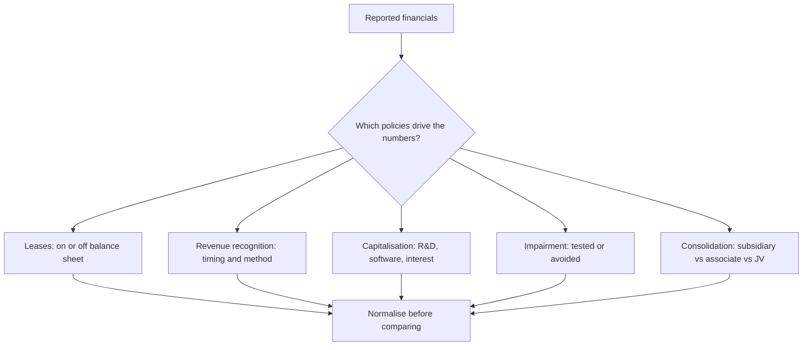

# Accounting Standards That Change What Analysts See

## The Problem / Why this matters
Accounting standards determine what appears in the financial statements, and changes to them can alter reported EBITDA, leverage and margins by large amounts with no change whatsoever in the underlying business. An analyst who does not know which standard produced a number will compare figures that are not comparable — across companies using different policies, and across time for the same company through a transition. This is quiet, systematic error, and it is entirely avoidable.

## Core Idea
Know which accounting choices are **judgement-heavy** (leases, revenue recognition, impairment, capitalisation, consolidation) and normalise for them before comparing companies or periods. Reported numbers are outputs of policy as much as of performance.

## Why it works this way
Accounting standards must accommodate genuinely different business circumstances, so they contain judgement. Where judgement exists, comparability breaks — two identical businesses can report materially different numbers by making different defensible choices. The analyst's job is to see through to the economics.

## Full technical content

### Leases — the change that redefined EBITDA

The move to bringing operating leases onto the balance sheet (IND-AS 116 / IFRS 16) had large mechanical effects with no economic change:

| Item | Before | After |
|---|---|---|
| Balance sheet | Operating leases off balance sheet | **Right-of-use asset** and **lease liability** recognised |
| P&L — rent | Single rent expense in EBITDA | Split into **depreciation** (below EBITDA) and **interest** (below EBIT) |
| **EBITDA** | Lower | **Mechanically higher** |
| **Net debt** | Excluded lease obligations | **Includes lease liability** |
| Net debt/EBITDA | — | Both numerator and denominator change |
| Cash flow | Rent in operating | Split between operating and financing |

**The analytical consequences:**
- **EBITDA is not comparable across the transition date.** Any multi-year EBITDA series spanning it must be adjusted, or the growth rate is fictitious.
- **Lease-heavy sectors are most affected** — retail, aviation, hotels, telecom (towers), logistics (warehouses). A retailer's EBITDA can rise substantially with no change in the business.
- **EV/EBITDA comparisons** across companies with different lease-versus-own strategies were always distorted; the standard change altered the direction of the distortion rather than eliminating it.
- **EBITDAR** (before rent) was the traditional workaround and remains useful for comparing lease-heavy businesses.

The discipline: for any lease-intensive company, check whether debt includes lease liabilities and whether historical EBITDA has been restated, and state your treatment explicitly.

### Revenue recognition

The five-step model (IND-AS 115 / IFRS 15) governs when revenue is recognised, and the judgement points matter:

- **Over time versus point in time** — the percentage-of-completion question that dominates EPC and long-cycle businesses, where the total-cost estimate is a management input.
- **Principal versus agent** — whether a platform reports **gross** transaction value or **net** commission as revenue. This single determination can change reported revenue by an order of magnitude for a marketplace, and it is why GMV-versus-revenue confusion is so consequential.
- **Variable consideration** — discounts, rebates and returns estimated and netted at recognition.
- **Contract assets and unbilled revenue** — revenue recognised before invoicing, and a genuine early-warning metric when it grows faster than revenue.
- **Financing components** — long payment terms may require imputing interest.

### Capitalisation choices

Where costs are capitalised rather than expensed, current profit rises and assets grow:

| Item | Judgement | Effect if aggressive |
|---|---|---|
| **R&D / development** | Development costs may be capitalised once technical feasibility is established | Flatters current margin; inflates assets |
| **Software and technology** | Internal development costs | Same |
| **Interest during construction** | Capitalised into the asset | Understates current interest expense |
| **Content (media/OTT)** | Capitalised and amortised over an estimated life | Amortisation profile is a judgement |
| **Customer acquisition** | Generally expensed, but treatment of contract costs varies | — |

**Always compare capitalisation policy to peers.** A company capitalising development costs that competitors expense will show better margins with no economic difference, and the gap belongs in any margin comparison. The capitalisation rate as a percentage of total R&D is usually derivable from the notes.

### Impairment

Goodwill and intangibles are tested rather than amortised, which makes impairment a judgement about future cash flows:
- **Serial acquirers who never impair** despite underperforming acquisitions are making an implicit claim the evidence should be tested against.
- Impairment timing is often clustered with management change — new management takes the write-down for their predecessor's decisions.
- Because impairment is non-cash, it is routinely excluded from "adjusted" earnings; when impairments recur, that exclusion is not legitimate.

### Consolidation

How an investee is treated changes the financial statements substantially:

| Treatment | When | Effect |
|---|---|---|
| **Subsidiary** (control) | Full consolidation | 100% of revenue, EBITDA, debt; minority interest shown separately |
| **Associate** (significant influence) | Equity method | Only the share of profit; **revenue and debt do not appear** |
| **Joint venture** | Usually equity method | Same |

**The key trap:** a company with large associates or joint ventures shows none of their revenue or debt on the consolidated statements — so leverage can look far lower than the group's real economic exposure, particularly where guarantees have been given. Read the related-party and contingent-liability notes for guarantees to associates and JVs.

Note also that consolidated EV/EBITDA is distorted when a company owns 60% of a large subsidiary: the full EBITDA consolidates while only 60% of the economics accrue, which is why minority interest must be added in enterprise value.

### Other frequently-relevant areas

- **Financial instruments (IND-AS 109)** — expected-credit-loss provisioning for lenders, replacing incurred-loss models; fair-value measurement of investments flowing through P&L or OCI, which can add volatility unrelated to operations.
- **Employee share-based payment** — a real cost recognised in the P&L; excluding it from "adjusted" earnings systematically overstates profitability.
- **Deferred tax** — timing differences; a large deferred tax asset depends on future profits being available to use it, which is an assumption.
- **Foreign currency translation** — for companies with overseas subsidiaries, translation effects run through OCI, and reported growth blends business and currency.
- **Segment reporting** — definitions are management's choice, and changes break comparability.

### The practical normalisation checklist

Before comparing any two companies:

1. Are **lease treatments** comparable, and does debt include lease liabilities in both?
2. Is revenue **gross or net** (principal versus agent) in both?
3. Are **capitalisation policies** for R&D, software and interest comparable?
4. Are **share-based payments** treated the same way in any adjusted figures?
5. Are **associates and JVs** material, and is off-balance-sheet exposure comparable?
6. Have there been **policy changes or restatements** in either company's history?
7. Are the periods and **currency treatments** aligned?

### Where standards differ across jurisdictions

For cross-border comparisons — relevant when using global peers, as the sector chapters frequently recommend — note that IND-AS is largely converged with IFRS but with specific carve-outs, while US GAAP differs in several areas including inventory (LIFO permitted), development-cost capitalisation (generally expensed), and lease classification. Cross-market multiple comparisons without adjusting for these are a common source of error.

## Common mistakes
- Comparing **EBITDA across the lease-standard transition** without restatement.
- Excluding **lease liabilities** from net debt for a lease-heavy company.
- Comparing margins across companies with different **capitalisation policies**.
- Treating **share-based compensation** as a non-cost because it is non-cash.
- Missing off-balance-sheet exposure through **associates and JVs**.
- Forgetting **minority interest** in enterprise value for partly-owned subsidiaries.
- Accepting **gross revenue** from a platform that is economically an agent.
- Ignoring a **policy change** disclosed in the notes and its quantified effect.

## Interview angle
"How did the new lease accounting standard change how you analyse a retailer?" Explain the mechanics precisely: operating leases came onto the balance sheet as a right-of-use asset and a lease liability, so rent expense split into depreciation and interest — which means **EBITDA rose mechanically with no change in the business**, while net debt rose by the lease liability. Both sides of net debt/EBITDA moved, and EV/EBITDA comparisons across the transition or across companies with different lease-versus-own strategies became unreliable without adjustment. Then give the practical response: use EBITDAR or a consistently-restated series for historical comparison, ensure lease liabilities are in debt for every company in the peer set, and state the treatment explicitly in the note.
