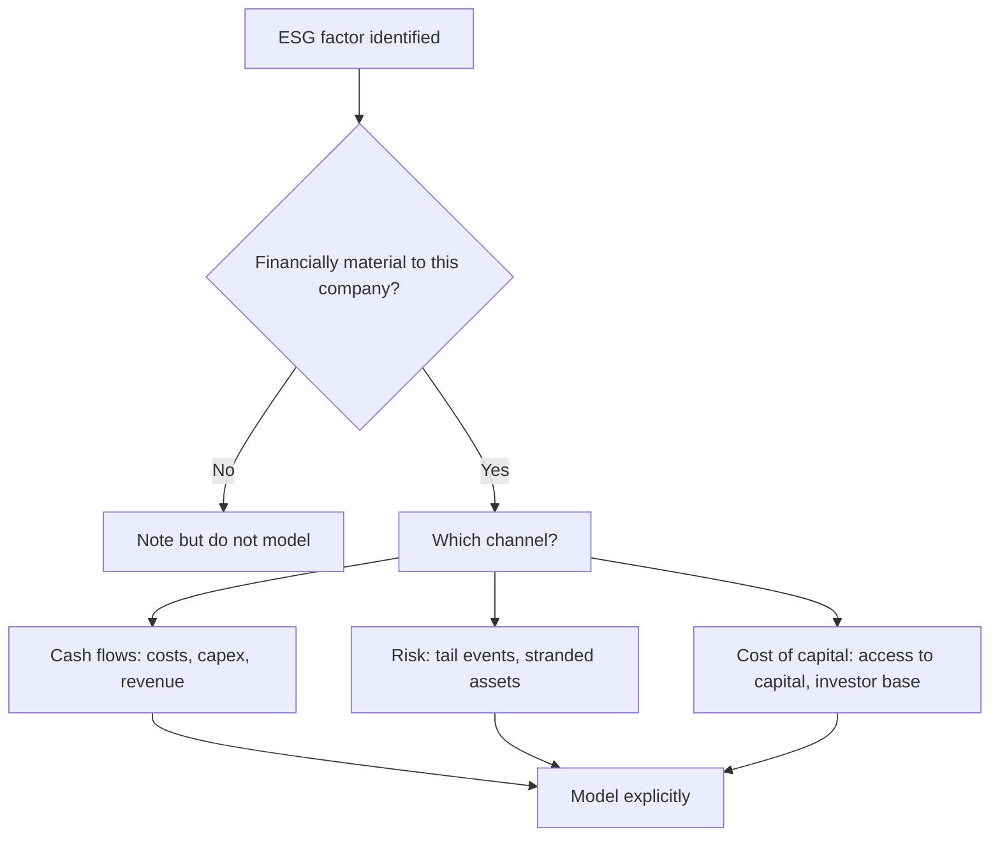

# ESG and Sustainability in Equity Analysis

## The Problem / Why this matters
ESG occupies an awkward place in equity research: mandated in many institutional mandates, widely discussed, and frequently analysed badly — reduced to third-party scores that measure disclosure quality more than actual performance, or dismissed entirely as unrelated to returns. Both extremes are wrong. The analytically defensible position treats ESG factors as **financially material risks and opportunities where evidence supports it**, and says so where it does not. Indian regulation now mandates structured sustainability reporting for large listed companies, making this a standing part of the disclosure landscape rather than an optional overlay.

## Core Idea
Assess ESG through **financial materiality**: which environmental, social or governance factors plausibly affect this specific company's cash flows, cost of capital, or risk of catastrophic loss — and quantify them where possible rather than scoring them.

## Why it works this way
A carbon price is a cost. A water shortage in a manufacturing region is an operational risk. A safety failure is a shutdown and a liability. Poor governance is value leakage. Each of these enters the model through an identifiable line. Where a factor cannot be linked to cash flows or risk, its inclusion is a values judgement rather than an analytical one — legitimate for a mandate, but it should be labelled as such.

## Full technical content

### Materiality varies enormously by sector

The single most important point: ESG factors are not uniformly relevant. Sector determines which matter.

| Sector | Most material factors |
|---|---|
| **Cement, steel, power** | Carbon intensity, emissions regulation, transition capex, stranded-asset risk |
| **Chemicals, pharma** | Effluent and hazardous waste, plant safety incidents, regulatory shutdowns |
| **Mining** | Community relations, land acquisition, rehabilitation liabilities, water |
| **IT services** | Human capital — attrition, skills, diversity; data privacy |
| **Banks, NBFCs** | Governance, credit exposure to transition-exposed sectors, conduct/mis-selling |
| **FMCG** | Packaging waste, water use, supply-chain labour practices |
| **Apparel/textiles** | Labour practices in the supply chain, water and dye effluent |
| **Autos** | Emission regulation, EV transition, supply-chain sourcing |

For any covered company, the disciplined starting question is: **which two or three factors could plausibly move earnings or create a tail risk?** Everything else is disclosure, not analysis.

### The environmental channel — quantify where possible

- **Carbon cost exposure** — for emissions-intensive businesses, estimate the earnings impact of a plausible carbon price. This is straightforward arithmetic (emissions × price) and is far more useful than a score.
- **Transition capex** — the investment required to meet tightening standards, and whether it earns a return or is purely compliance.
- **Stranded-asset risk** — assets whose economic life may end before their accounting life, most acutely in fossil-fuel-linked capacity.
- **Physical risk** — water availability for water-intensive manufacturing, flood and cyclone exposure for coastal facilities, heat effects on labour productivity and agricultural inputs.
- **Regulatory shutdown risk** — pollution-control-board actions have closed Indian plants, sometimes for extended periods. This is a direct, quantifiable revenue risk for specific facilities, analogous to the USFDA plant-status framework in pharma.

### The social channel

- **Human capital** — for people-dependent businesses, attrition and skills availability are direct earnings drivers, as the IT services framework shows.
- **Safety** — incident rates and their trend. A fatality or major incident can mean shutdown, liability and management distraction. In hazardous-process industries this is a first-order operational risk, not a reporting metric.
- **Supply-chain labour practices** — a genuine risk for export-oriented businesses whose customers audit suppliers, where a finding can mean loss of a major customer.
- **Community relations** — critical for mining and large infrastructure, where opposition can delay or stop projects. Land acquisition difficulties are a recurring cause of Indian project delays.
- **Product responsibility and conduct** — mis-selling in financial services, product safety in consumer and pharma.

### The governance channel — usually the most financially material

For Indian equities specifically, governance is typically where ESG analysis has the highest financial payoff, and it maps directly onto the management-quality and forensic-accounting frameworks: promoter pledge, related-party transactions, board independence, auditor changes, minority-shareholder treatment, remuneration alignment, and disclosure quality.

The practical point: **governance failure is a far more common cause of permanent capital loss in Indian equities than environmental or social factors** — which is why an ESG assessment that spends most of its effort on emissions disclosure while under-weighting related-party transactions has misallocated attention relative to actual risk.

### The problem with ESG scores

Third-party ESG ratings are widely used and should be treated cautiously:
- **Ratings disagree substantially** between providers for the same company — far more than credit ratings do — which indicates they are measuring different things rather than converging on an underlying truth.
- They are heavily influenced by **disclosure volume**, so large companies with well-resourced sustainability teams score better than smaller companies that may perform better but report less. This is a size and resource bias, not a performance measure.
- They are often **backward-looking** and slow to reflect incidents.
- **Sector-relative scoring** means a company can score well within a high-impact sector while having high absolute impact.

The defensible use: as a **screening input and a source of underlying data**, not as a conclusion. An analyst should form their own materiality view and quantify it.

### Regulatory context in India

Large listed Indian companies are required to file structured sustainability disclosure (the BRSR framework), with a core set of assured metrics. For an analyst this is genuinely useful: it produces standardised, comparable, company-reported data on emissions, energy, water, waste, safety, employee metrics and community spend across the market — which supports the kind of quantified, comparative analysis that scores do not. Reading BRSR data across a peer set is a practical exercise worth doing for any covered sector.

### Integrating into valuation honestly

Where ESG factors are material, they enter through the standard channels rather than as an adjustment factor:
- **Cash flows** — carbon costs, compliance capex, efficiency savings, revenue from transition-aligned products.
- **Risk and discount rate** — a genuinely elevated risk of catastrophic operational or regulatory loss justifies a higher cost of equity or an explicit scenario, though this should be argued rather than asserted.
- **Terminal value** — stranded-asset risk shortens the economic life assumed.
- **The multiple** — where governance quality or transition positioning affects sustainable returns.

**Be honest about uncertainty.** Carbon-price paths, regulatory timelines and physical-risk timing are genuinely uncertain. Scenario analysis is the appropriate treatment, and a single-point ESG adjustment usually conveys false precision.

### The greenwashing check

Companies have strong incentives to present favourably, so verification matters:
- Are targets **quantified with dates**, or aspirational?
- Is progress **reported against prior targets**, and were they met?
- Are emissions **assured** by a third party?
- Does **capex actually reflect** the stated transition strategy, or is the spending unchanged?
- Is a company's "green revenue" definition reasonable, or does it include marginal products?

The most reliable test is the same one used for management credibility generally: **compare what was promised in earlier reports against what was subsequently delivered.**

## Common mistakes
- Treating **ESG scores** as analysis rather than as an input.
- Applying the same factors across sectors regardless of **materiality**.
- Under-weighting **governance**, which is where the financial risk in Indian equities concentrates.
- Asserting a discount-rate adjustment without a mechanism.
- Accepting **targets without checking delivery** against past targets.
- Confusing disclosure quality with performance.
- Ignoring quantifiable exposures — carbon cost, water risk, plant regulatory status — in favour of qualitative commentary.
- Presenting a single-point ESG valuation adjustment where scenarios are appropriate.

## Interview angle
"How do you incorporate ESG into your analysis?" Lead with materiality: identify the two or three factors that could plausibly move *this* company's cash flows or create a tail risk, since the relevant factors differ entirely by sector — carbon cost and transition capex for cement, plant safety and effluent for chemicals, attrition for IT services, governance for almost everything in India. Then quantify where possible — emissions times a plausible carbon price, or the revenue at risk from a facility's regulatory status — and model it through cash flows, risk or terminal value rather than as an arbitrary adjustment. Be explicit that third-party scores measure disclosure as much as performance and disagree substantially between providers, so they are an input rather than a conclusion. Noting that governance failure is the dominant cause of permanent capital loss in Indian equities shows you are prioritising by actual financial risk.
