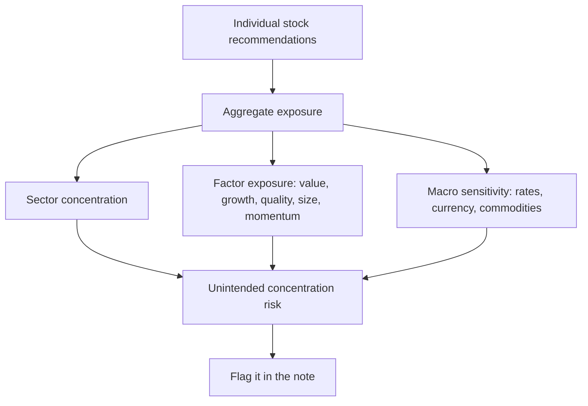

# Portfolio Construction and Factor Awareness for Analysts

## The Problem / Why this matters
A single-stock analyst who never thinks about portfolio context produces recommendations that a portfolio manager cannot easily use. Three separate Buy calls that are all leveraged bets on the same commodity price are not three ideas — they are one idea in triplicate, and a PM who acts on all three has taken a concentrated position without intending to. Understanding how individual recommendations aggregate into portfolio risk is what makes an analyst's work usable, and it is essential for anyone moving to the buy side.

## Core Idea
Individual stock views combine into portfolio outcomes through **correlation and factor exposure**. An analyst who understands what drives their recommendations in common — sector, factor, macro sensitivity — can flag it, which materially increases the value of their work.

## Why it works this way
Portfolio risk is not the sum of individual stock risks; it depends on how they move together. Two positions with identical standalone risk contribute very differently depending on whether they are correlated. This is why diversification works at all, and why unrecognised common exposure is the most frequent source of unintended portfolio concentration.

## Full technical content

### The equity risk factors

Empirical research has identified persistent return patterns associated with stock characteristics. Whether these represent risk premia or behavioural anomalies is debated; that they describe common exposures across portfolios is not.

| Factor | Characteristic | Typical proxy metrics |
|---|---|---|
| **Value** | Cheap relative to fundamentals | Low P/E, P/B, EV/EBITDA; high earnings or FCF yield |
| **Quality** | Profitable, stable, low leverage | High RoE/RoCE, stable margins, low debt, high accruals quality |
| **Size** | Smaller companies | Market capitalisation |
| **Momentum** | Recent relative outperformance | 6–12 month trailing relative return |
| **Low volatility** | Lower price variability | Trailing volatility, beta |
| **Growth** | High expected growth | Revenue/EPS growth rates |

**Why this matters to a fundamental analyst:** your stock-picking style probably has a consistent factor tilt whether or not you intend one. An analyst who habitually recommends cheap, out-of-favour cyclicals has a value tilt; one who prefers high-RoCE consumer franchises has a quality tilt. Both are legitimate, but recognising it explains why an analyst's calls tend to work and fail together, and why a run of underperformance may reflect the factor being out of favour rather than the analysis being wrong.

**Factors go through extended cycles.** Value underperformed growth for a long period and then reversed sharply; quality outperforms in downturns and lags in speculative rallies. An analyst whose entire book shares one tilt will experience long stretches of collective under- or outperformance unrelated to the quality of individual work.

### Correlation and unintended concentration

The specific risks worth flagging:

- **Sector concentration** — obvious, but also the easiest to overlook when recommendations are made one at a time over months.
- **Common macro driver** — three separate ideas that are all long the same commodity, all short the rupee, or all leveraged to the domestic capex cycle. The stocks are different; the bet is not.
- **Shared supply chain** — companies dependent on the same input or customer.
- **Factor concentration** — a book that is entirely value or entirely quality.
- **Liquidity concentration** — several positions all in illiquid small caps, which correlate sharply in a stressed market because the exits are all narrow at the same time.

**The practical contribution an analyst can make:** in each note, state the position's principal common exposures — "this is a leveraged bet on the domestic construction cycle and shares that exposure with cement and construction names" — so a PM can size accordingly. It takes one sentence and materially improves the note's usability.

### Position sizing frameworks

Understanding how a PM sizes clarifies what they need from you:

- **Conviction-weighted** — larger positions where risk-reward is best. Requires the analyst to have quantified the bear case, which is why the risk chapter's discipline matters.
- **Risk-parity / volatility-adjusted** — sized inversely to expected volatility so each position contributes comparable risk.
- **Fixed fractional** — position size = risk budget ÷ distance to the bear case. **A wider bear case mechanically means a smaller position**, which is the clearest link between analytical work and sizing.
- **Kelly-derived approaches** — theoretically optimal given edge and odds, but sensitive to estimation error, so practitioners typically use a fraction of the Kelly number.
- **Correlation-adjusted** — an idea correlated with existing holdings adds less diversification and warrants less size.

Constraints that bind in practice: mandate limits (single-stock and sector caps), liquidity (days to build and exit), and benchmark-relative tracking error for funds managed against an index.

### Benchmark-relative thinking

For benchmark-constrained funds, the relevant question is not "do I like this stock" but "what active weight relative to the index":
- **Overweight / underweight** relative to the benchmark weight.
- **Not owning** a large index constituent is itself an active position — a fund not owning a stock with a 6% index weight has a 6% underweight, which is a substantial bet.
- **Tracking error** — the volatility of active returns, and the budget within which the PM operates.
- **Active share** — how much the portfolio differs from the index.

The implication for a sell-side analyst: a Sell rating on a large index constituent is far more actionable to a benchmark-constrained PM than a Buy on a small non-index name, because the former can be expressed at scale.

### Diversification's real limits

- Correlations **rise in stressed markets** — diversification weakens exactly when it is most needed, which is why stress-scenario correlation matters more than average correlation.
- **Domestic-only portfolios** share a common macro exposure that no amount of within-market diversification removes.
- Beyond roughly 20–30 well-chosen positions, additional names add little diversification while diluting the impact of the best ideas — which is why concentrated managers argue that over-diversification is a bigger practical problem than under-diversification.

### What the analyst should actually provide

Practical additions that make a note portfolio-usable:

1. **The principal common exposures** of the idea, named explicitly.
2. **Liquidity data** — ADTV, days to build and exit at a reasonable participation rate.
3. **The quantified bear case**, since sizing depends on it.
4. **Correlation context** — which other covered names would move with this one.
5. **The factor character** of the idea — is this a value call on a de-rated business or a quality call on a compounder, since PMs know their own tilts.
6. **Benchmark context** — index weight, if any.

### Risk metrics an analyst should recognise

Not to compute routinely, but to understand when a PM refers to them: beta, tracking error, information ratio (active return per unit of active risk), Sharpe ratio, maximum drawdown, and value-at-risk. The one most relevant to research quality is the **information ratio**, since it measures skill in generating active return per unit of active risk taken — which is precisely what good stock selection should produce.

## Common mistakes
- Making recommendations with **no portfolio context**.
- Not recognising that several ideas share a **single underlying bet**.
- Being unaware of one's own **factor tilt**, and so misreading a factor drawdown as an analytical failure.
- Ignoring **liquidity** in small-cap recommendations, especially the correlated illiquidity of several such positions.
- Not providing a **quantified bear case**, leaving the PM unable to size.
- Forgetting that **not owning** a large index constituent is an active position.
- Assuming diversification holds in stressed markets.

## Interview angle
"You have three Buy ideas. How would a PM think about owning all three?" Move immediately to common exposure: are they in the same sector, driven by the same macro variable, exposed to the same input cost or customer, or the same factor tilt — because three stocks that are all leveraged to the same commodity are one bet, not three, and a PM acting on all of them has concentrated unintentionally. Then discuss sizing: conviction and risk-reward determine base size, the width of the bear case scales it down, correlation with existing holdings reduces it further, and liquidity caps it. Volunteering that you'd flag the shared exposure explicitly in the note is what shows you understand how research actually gets used.
