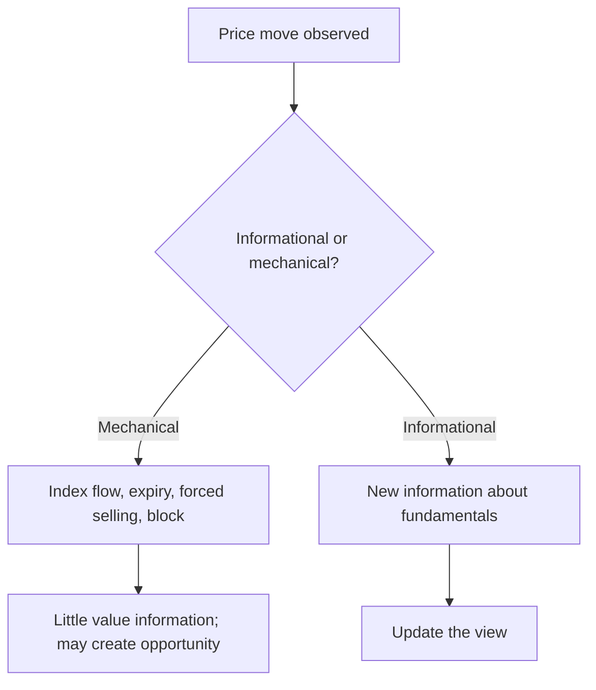

# Market Microstructure for Fundamental Analysts

## The Problem / Why this matters
A fundamental analyst can be entirely right about value and still see the recommendation fail commercially because the position could not be built at a reasonable price, or because a mechanical flow unrelated to fundamentals moved the stock. Microstructure — how orders actually execute, who is trading, and what non-fundamental flows exist — is not the fundamental analyst's specialism, but ignorance of it produces recommendations that cannot be implemented and price moves that get misread as information.

## Core Idea
Understand **liquidity, execution cost and non-fundamental flows** well enough to know whether an idea is implementable at the intended size, and to distinguish mechanical price moves from informative ones.

## Why it works this way
Price is set by order flow, not by value. Value determines where price tends over time; flow determines where it is now. A great deal of daily flow — index rebalancing, fund redemptions, margin calls, expiry hedging — carries no information about value at all, and reading it as though it did produces confidently wrong conclusions.

## Full technical content

### Liquidity — the constraint that decides implementability

| Metric | Definition | Use |
|---|---|---|
| **ADTV** | Average daily traded value | The base liquidity measure |
| **Free float** | Shares available to trade (excluding promoter, locked-in) | Determines real tradeable supply |
| **Days to build / exit** | Target position ÷ (participation % × ADTV) | Implementability |
| **Impact cost** | Price move caused by transacting a given size | Execution cost |
| **Bid-ask spread** | Quoted spread | Round-trip cost for small trades |
| **Turnover ratio** | Annual volume ÷ free float | How actively the float trades |

**The asymmetry that matters most:** liquidity is not constant. It contracts sharply in stressed markets, precisely when exit is most wanted. A stock with acceptable normal-conditions liquidity can become effectively untradeable in a drawdown, which is why position sizing should be set against **stressed** rather than average liquidity — the discipline the small-cap chapter emphasises.

**Free float matters more than market capitalisation.** A ₹20,000cr company with 80% promoter holding has a ₹4,000cr tradeable float, and its liquidity resembles a much smaller company's. Always compute float-adjusted rather than headline size.

### Execution and market impact

- **Market impact** — large orders move the price against the trader. Impact rises with order size relative to ADTV and falls with patience.
- **Participation rate** — executing at 10–25% of volume is generally considered manageable; higher participation moves the price materially.
- **VWAP / TWAP execution** — algorithms spreading an order across the session to reduce impact, benchmarked against the volume- or time-weighted average price.
- **Block deals and bulk deals** — negotiated large transactions executed outside continuous trading, disclosed to the exchange. These are how genuinely large positions actually change hands in less liquid names.
- **Implementation shortfall** — the difference between the decision price and the achieved price, which is the true cost of implementing a recommendation and can consume a meaningful part of an expected return in illiquid names.

**The practical point for research:** an idea with 20% expected upside in a stock where building and exiting costs 4% in impact is a materially worse idea than the headline suggests, and stating the liquidity constraint in the note is a professional courtesy that many notes omit.

### Non-fundamental flows — the moves that carry no information

Recognising these prevents both misreading and, occasionally, creates opportunity:

| Flow | Mechanism | Signature |
|---|---|---|
| **Index rebalancing** | Passive funds must trade at the effective date | Volume spike concentrated near the close; largely pre-anticipated |
| **Fund flows** | Redemptions force selling across a manager's holdings regardless of view | Correlated selling in a manager's typical holdings |
| **Margin calls / forced selling** | Leveraged holders liquidated | Sharp, high-volume declines with no news; often in pledged or high-MTF names |
| **Lock-in expiry** | Pre-IPO or anchor shares become sellable | Dated and knowable in advance |
| **Expiry-related hedging** | Options positioning drives underlying flow near expiry | Pinning near heavy-OI strikes; reverses after expiry |
| **Tax-loss selling** | Year-end realisation of losses | Seasonal, in prior underperformers |
| **Block deal placement** | Large holder exiting | Sharp move on the day; disclosed after |

**The analytical discipline:** before revising a view on a price move, ask whether a mechanical explanation exists. A stock falling 6% on heavy volume with no news, in a company with a known pledge, is more likely forced selling than a change in fundamentals — and the correct response may be to buy rather than to reassess.

### Who is trading — ownership structure as context

- **Shareholding pattern** — promoter, FII, DII, retail. Available quarterly and genuinely informative about behaviour.
- **High FII ownership** means greater sensitivity to global risk sentiment regardless of company fundamentals.
- **High retail ownership** tends to mean higher volatility and greater sensitivity to sentiment and momentum.
- **High promoter holding** means small float and potentially thin liquidity.
- **Passive/index ownership** creates mechanical flows at rebalances.
- **Pledged shares and MTF book** indicate leveraged holders who can be forced to sell — a structural downside-acceleration risk.

### The market's own structure

Worth understanding as context rather than as a research input:
- **Order types and priority** — price-time priority in a continuous auction.
- **Circuit filters and trading halts** — which can prevent exit entirely at the worst moment in small caps.
- **Pre-open and closing price mechanisms** — as covered in the closing-price material, the official close is a VWAP over a final window, not the last tick.
- **Settlement cycle** — determines when shares and funds actually move, and the corporate-action cutoffs.
- **Surveillance measures** (ASM/GSM) — which impose margins or restrict trading in stocks showing unusual activity, and can make a position unexitable.

### What a fundamental analyst should actually do with this

1. **Compute and state liquidity** for every recommendation — ADTV, float, days to build and exit at 20–25% participation.
2. **Size the recommendation** to what is implementable, and say so.
3. **Check for mechanical explanations** before reacting to price moves.
4. **Know the ownership structure** — FII share, pledge, MTF exposure — as context for volatility.
5. **Flag scheduled flow events** — lock-in expiries, index reviews, large holder positions — as dated risks in the note.
6. **Do not attempt to compete on microstructure.** A fundamental analyst's edge is in value, not in execution or short-term flow; the purpose of this knowledge is to avoid errors, not to generate signals.

## Common mistakes
- Recommending a position size the stock's **float cannot absorb**.
- Using **market capitalisation** rather than free float to judge liquidity.
- Sizing against **average** rather than stressed liquidity.
- Reading a **mechanical flow** move as fundamental information.
- Ignoring **impact cost** when assessing whether expected upside is worth capturing.
- Overlooking pledge and MTF exposure as forced-selling risk.
- Missing dated flow events — lock-in expiries and index reviews — that are knowable in advance.
- Attempting to trade short-term flow patterns without the infrastructure to do so.

## Interview angle
"You're bullish on a small cap. What could stop the idea working even if you're right?" Move to implementation: with, say, ₹8 crore ADTV and a ₹200 crore intended position, building at 20% participation takes weeks and exiting in stress may be impossible — so the position must be sized against stressed rather than average liquidity, and the impact cost may consume a meaningful share of the expected return. Then add the structural risks: a high promoter pledge or large MTF book means leveraged holders can be forced to sell in a drawdown, accelerating declines regardless of fundamentals; circuit filters or surveillance measures can prevent exit entirely; and scheduled events like lock-in expiries create dated supply. Naming stressed-liquidity sizing and forced-selling risk unprompted is what distinguishes a practical answer from a theoretical one.
