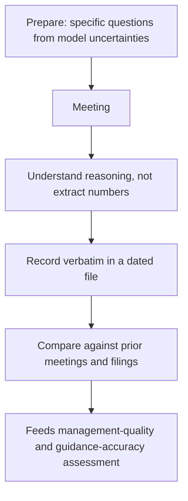

# Working With Management and Corporate Access

## The Problem / Why this matters
Management meetings are among the most valuable and most misused inputs in equity research. Valuable, because they give access to the people who know the business best and to the reasoning behind decisions that filings only record. Misused, because analysts routinely treat them as a source of forecast numbers (which are public anyway), fail to prepare properly, and — most damagingly — allow proximity and relationship to erode independence. The commercial pressure to maintain access makes this the point where research integrity is most often quietly compromised.

## Core Idea
The purpose of management access is to understand **how management thinks** — about capital allocation, competition, risk and trade-offs — not to extract guidance. The guidance is public; the reasoning is not, and the reasoning is what informs a differentiated view.

## Why it works this way
Any material forward-looking information a company shares must be disclosed to everyone simultaneously, so a meeting cannot legitimately produce numbers others do not have. What it can produce is judgement: whether management understands its own competitive position, how it frames trade-offs, whether its explanations are consistent over time, and whether it is candid about difficulty. Those inputs feed the management-quality assessment, which is genuinely analytical.

## Full technical content

### Preparation — where most of the value is created

A meeting is worth roughly what was put into preparing for it. Before any management interaction:

- **Read everything current** — the last four quarters' results and transcripts, the latest annual report, recent filings and any regulatory developments.
- **Have the model open and know its weak points.** The best questions come from the specific assumptions you are least confident about.
- **Write the questions in advance**, prioritised, and expect to get through fewer than planned.
- **Know what is already public**, so no time is wasted on answerable-from-filings questions — the fastest way to lose a management team's engagement.
- **Review your notes from the previous meeting**, and specifically what was said would happen.

### What to ask — and what not to

**Questions that produce value:**

| Type | Example |
|---|---|
| **Capital allocation reasoning** | "How did you evaluate the returns on the Dahej expansion versus returning cash?" |
| **Competitive dynamics** | "When the new capacity comes in, how do you expect pricing to behave?" |
| **Trade-offs** | "What would you sacrifice first if demand disappointed — margin or share?" |
| **Assumption testing** | "Our model assumes utilisation reaches 82% by FY27. What would prevent that?" |
| **Historical accountability** | "Two years ago you targeted 18% margin by now. What didn't work?" |
| **Risk framing** | "What keeps you concerned about the business that the market isn't discussing?" |

**Questions that waste the meeting:**
- Anything answerable from the filings.
- Requests for guidance already publicly given.
- Requests for the next quarter's numbers — which management cannot answer and should not.
- Broad open-ended questions ("how do you see the industry?") that invite rehearsed answers.

**The historical-accountability question is the highest-yield one.** Asking directly what happened to a previously stated target — respectfully but without letting it slide — produces genuinely informative responses. Managements that engage honestly with a missed target are different from those that reframe it, and that difference is exactly what the credibility assessment needs.

### The compliance boundary

The rules from the regulatory and primary-research material apply directly and without exception:
- **Never solicit unpublished price-sensitive information** — results before publication, unannounced orders, pending M&A, or specific forward numbers not publicly guided.
- If management **begins to disclose something material and non-public**, stop the conversation and escalate to compliance. The obligation is affirmative.
- **Sharing a draft note** with management is acceptable only for **factual verification** — checking that historical figures and descriptions are accurate. Never share the recommendation, target price or the view.
- Selective disclosure obligations run both ways: a company giving you material information privately has a problem, and so do you if you act on it.

### The independence problem

This is the part of the job where commercial and analytical incentives most directly conflict, and it deserves honesty rather than euphemism.

**How independence erodes, usually gradually:**
- Frequent, friendly contact creates genuine relationship, and negative research feels like a personal betrayal.
- Downgrades cost access — calls unreturned, meetings unavailable, conference invitations withdrawn.
- The firm may have or want banking business with the company.
- A well-liked management team is easier to believe than the numbers.

**Practical defences:**
- **Write the thesis before the meeting**, so the meeting tests rather than forms the view.
- **Weight documentary evidence above conversation.** Filings are audited; conversation is not.
- **Track guidance accuracy formally** — a table of what was promised and what was delivered is unsentimental in a way that impressions are not.
- **Notice access as a variable.** If a management team becomes markedly less available after a cautious note, that is information about the company's attitude to independent research, and it belongs in the governance assessment rather than in your rating decision.
- **Accept that losing access is sometimes the correct outcome.** An analyst who has never lost access to a company has probably never published a genuinely negative view.

### Recording and compounding the value

Management interactions compound only if recorded systematically. Maintain a **dated per-company file** with:
- What was said, as close to verbatim as possible on key points.
- Specific targets, timelines and commitments stated.
- Tone and what was avoided or deflected.
- Any change in framing from previous meetings.

The highest-value use of this file is the **year-over-year comparison** — what was said would happen, and what did. Over several years it becomes the evidence base for the management-credibility assessment, and it is something almost no competitor will have built.

### Types of access and their uses

| Format | Character | Best used for |
|---|---|---|
| **One-on-one meeting** | Most valuable; focused | Testing specific assumptions, capital-allocation reasoning |
| **Group meeting / conference** | Broader; other analysts present | Hearing others' questions and management's unrehearsed responses |
| **Earnings call Q&A** | Public, recorded | Noting which questions get specific answers versus deflection |
| **Plant / store visit** | Operational | Verifying utilisation, condition, processes — genuinely informative |
| **Investor day** | Strategic, curated | Understanding the narrative management wants; note what is omitted |
| **Non-deal roadshow** | Arranged by the broker | Access; also reveals what management chooses to emphasise to investors |

**Plant and store visits deserve emphasis** because they produce observations available in no filing — actual utilisation, inventory condition, workforce activity, maintenance standards, and store footfall and layout. They are also where a management-curated narrative most often meets physical reality.

### Reading management communication

Consistent with the earnings-call material, watch for:
- **Changes in language** around the same topic across quarters — a shift from "confident" to "hopeful" is a downgrade regardless of the numbers attached.
- **Topics that disappear** from the narrative.
- **Who answers** a difficult question, and whether the answer is specific.
- **Deflection patterns** — "we don't guide on that" applied selectively to unfavourable topics.
- **Over-claiming** — narrative disproportionate to the actual scale or evidence.

## Common mistakes
- Treating the meeting as a source of **numbers** rather than reasoning.
- Turning up **unprepared**, asking what the filings already answer.
- Letting the meeting **form** the view rather than test it.
- Sharing a draft's **conclusions** with management.
- Allowing relationship or access concerns to soften a warranted negative view.
- Not **recording** meetings systematically, so the credibility evidence never accumulates.
- Failing to ask about **previously stated targets** that were missed.
- Treating a curated plant visit or investor day as independent verification.

## Interview angle
"What would you ask a CEO in a one-on-one?" Avoid guidance-seeking questions entirely and say why — anything material must be public, so the meeting's value is in reasoning rather than numbers. Then give specific, high-yield questions: how they evaluated a recent capital-allocation decision against alternatives including returning cash; how they expect competitors to respond to incoming capacity; what they would sacrifice first if demand disappointed; what would prevent the specific assumption your model depends on; and what happened to a target stated two years ago that was missed. Close on independence: you write the thesis before the meeting so the meeting tests rather than forms it, weight filings above conversation, and accept that a genuinely negative view sometimes costs access.
