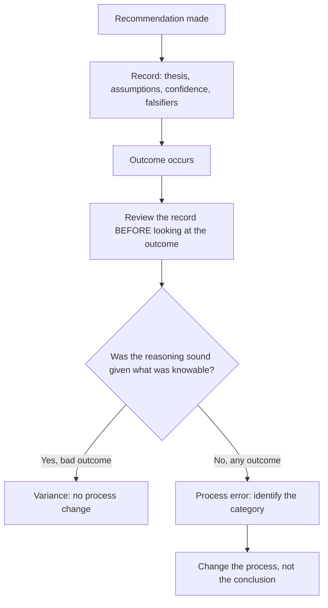

# Learning From Mistakes — Post-Mortems and Track Records

## The Problem / Why this matters
Equity research has an unusually poor learning environment: feedback is delayed by months or years, noisy (a good call can lose money and a bad one can make it), and easily rationalised after the fact. Analysts who do not deliberately structure their learning therefore improve far more slowly than the volume of their experience would suggest, and can repeat the same category of error for years without noticing. Building a genuine feedback loop is one of the highest-return investments an analyst can make in their own capability.

## Core Idea
Separate **decision quality** from **outcome quality**. Good process can produce bad outcomes and vice versa, so learning must be based on whether the reasoning was sound given what was knowable — which requires a contemporaneous record, because memory reconstructs.

## Why it works this way
Markets are probabilistic. A recommendation with genuinely favourable odds will still be wrong a substantial share of the time, and a poorly reasoned one will sometimes work. Judging process by outcome therefore teaches the wrong lessons in both directions — punishing sound analysis that got unlucky and reinforcing sloppy analysis that got lucky.

## Full technical content

### The decision journal

The single most effective tool, and the one almost nobody maintains. At the time of each recommendation, record:

| Field | Why |
|---|---|
| **The thesis in one paragraph** | What you believe and why |
| **Key assumptions**, quantified | What must be true |
| **Where you differ from consensus** | The differentiated claim |
| **Confidence level** | Calibration data over time |
| **Falsification conditions** | What would prove you wrong — stated *in advance* |
| **Expected timeline and catalyst** | Testable |
| **What you were uncertain about** | The honest version |
| **Position size / conviction** | Whether sizing matched conviction |

The critical property is that it is written **before** the outcome, so it cannot be reconstructed favourably. Hindsight bias is powerful enough that without a contemporaneous record, most post-mortems are fiction.

### Conducting a post-mortem properly

1. **Read the original record first**, before looking at what happened. Re-establish what you actually believed and why.
2. **Then examine the outcome.**
3. **Ask the diagnostic question:** was the reasoning sound *given what was knowable at the time*? Not given what is known now.
4. **Classify the error** if there was one (see taxonomy below).
5. **Identify the process change** — a checklist item, a source to consult, a bias to counter.
6. **Record the conclusion** so it is retrievable, and review these conclusions periodically as a set.

The fourth step matters most: an error without a category is an anecdote, and anecdotes do not compound into skill.

### A taxonomy of research errors

Classifying errors is what turns individual mistakes into pattern recognition:

| Category | Description | Typical fix |
|---|---|---|
| **Analytical** | The model or logic was wrong | Checklist item; peer review |
| **Informational** | A knowable fact was missed | Improve the intake routine or primary research |
| **Assumption** | A key assumption was wrong but reasonably held | Wider scenario ranges |
| **Base-rate neglect** | Extrapolated without checking how often such outcomes occur | Explicit base-rate check |
| **Confirmation** | Evidence was filtered to support a formed view | Pre-committed falsifiers; write the bear case first |
| **Anchoring** | Consensus, current price or a prior forecast drove the number | Build from drivers before looking at either |
| **Timing** | Right thesis, wrong horizon | Insist on a dated catalyst |
| **Governance/accounting** | The reported numbers or management were not what they seemed | Strengthen forensic and governance work |
| **Sizing/implementation** | Correct view, unimplementable or badly sized | Liquidity and risk-reward discipline |
| **Variance** | Reasoning sound, outcome adverse | **No change** — resisting spurious change is itself a skill |

That final row is important and frequently violated: changing a sound process because of one adverse outcome is a common and costly error, and recognising variance for what it is requires the same discipline as recognising a genuine mistake.

### Tracking estimate accuracy

Separate from recommendation outcomes, and more quickly informative because there are four data points per company per year:

- Maintain **forecast versus actual** by line item — revenue, margin, EPS — across covered companies.
- Look for **systematic bias**: most analysts have a consistent direction of error, commonly over-forecasting revenue growth and under-forecasting cost inflation.
- Check whether errors cluster in **particular companies** (a management whose guidance you over-trust) or **particular conditions** (turning points, which is where extrapolation fails).
- Track **revision behaviour** — do you revise too slowly after new information, the conservatism bias that produces post-earnings drift?

This is the fastest-improving loop available, because the feedback arrives quarterly rather than annually.

### Tracking recommendation performance

- **Absolute and relative** to benchmark and sector, over the stated horizon rather than a convenient one.
- **Hit rate** — the proportion of calls that worked.
- **Slugging ratio** — average gain on winners versus average loss on losers. This matters more than hit rate: an analyst right 40% of the time whose winners are three times their losers adds far more value than one right 60% of the time with symmetric outcomes.
- **Contribution by category** — which sectors, which idea types, which market conditions.
- **Timing analysis** — were you early, late, or wrong? Systematically early is a fixable process problem, not an analytical one.

### The institutional dimension

Individual learning is limited if the environment punishes acknowledged error. Characteristics of teams that actually learn:
- **Changing a view promptly is treated as competence**, not as failure.
- **Post-mortems are routine** and conducted on successes as well as failures, since a lucky success carries as much process information as an unlucky failure.
- **Pre-mortems** — before committing, asking "if this fails in a year, what will have caused it?" — which surfaces risks that optimism suppresses.
- **Red-teaming** — a colleague assigned to argue the opposite case.
- **The record is kept and revisited**, rather than each analyst relying on memory.

### What good looks like over time

An analyst with a functioning feedback loop can answer, with evidence: which categories of error they are prone to; whether their estimates are systematically biased and in which direction; whether their calls tend to be early or late; whether their conviction is calibrated (do the high-confidence calls actually work more often); and what specific process changes they have made in response. Very few analysts can answer these, and the ones who can improve materially faster.

## Common mistakes
- Judging calls by **outcome** rather than by process quality.
- No **contemporaneous record**, so post-mortems are hindsight-contaminated.
- Post-mortems only on **failures**, missing the lucky successes.
- **Not classifying** errors, so mistakes stay anecdotal.
- Changing a sound process because of a single adverse outcome (**variance misread as error**).
- Never checking **estimate accuracy**, so systematic forecasting biases persist.
- Tracking hit rate while ignoring the **slugging ratio**, which matters more.
- Working in an environment where admitting error is costly, and adapting by not admitting it.

## Interview angle
"Tell me about a call you got wrong." Structure the answer to demonstrate a functioning learning process rather than to narrate an outcome: state the thesis and the key assumptions as you held them at the time; what actually happened; and then the crucial distinction — whether the reasoning was unsound given what was knowable, or whether it was sound and the outcome adverse. If it was a genuine error, name the category — anchoring on consensus, neglecting a base rate, filtering evidence toward a formed view, or no dated catalyst — and state the specific process change made in response, such as pre-committing falsification conditions or building the model before looking at consensus. Candidates who can separate decision quality from outcome quality, and who reference a contemporaneous record rather than recollection, stand out immediately.
