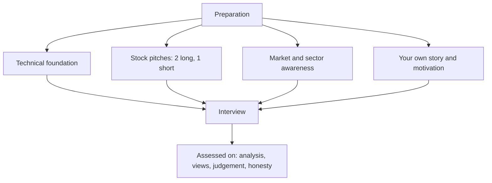

# The Equity Research Interview — Preparation and Execution

## The Problem / Why this matters
Equity research interviews test something different from most finance interviews. Technical knowledge is necessary but rarely decisive — every serious candidate can walk through a DCF. What separates candidates is whether they think like an analyst: whether they have genuine views, can defend them under pressure, know what they do not know, and demonstrate the specific habits of mind the job requires. Preparing for the wrong thing is the most common cause of failure.

## Core Idea
The interview is assessing three things: **can you analyse** (technical competence), **do you have views** (a defensible, differentiated stock pitch), and **would you be good at the job** (curiosity, judgement, communication, intellectual honesty). Preparation must address all three, and most candidates over-prepare the first.

## Why it works this way
Technical skills can be taught in months; judgement and genuine market interest cannot. Interviewers therefore probe for evidence of the latter — which is why "pitch me a stock" carries more weight than any accounting question, and why an honest "I don't know, here's how I'd find out" beats a confident fabrication.

## Full technical content

### The four preparation areas

**1. Technical foundation**

Expect questions across accounting, valuation and markets. The standard set:
- Link the three statements; what happens to each if depreciation rises by 10.
- Walk through a DCF; which assumption matters most and why (terminal value dominance).
- When would you use EV/EBITDA over P/E, and why.
- How do you value a bank, and why not on P/E.
- What is WACC, how is each component estimated, and what are the pitfalls.
- Working capital and why profit diverges from cash.
- What red flags would make you distrust reported earnings.

Depth matters more than breadth here. Knowing *why* P/B applies to banks — that the balance sheet is the product and returns are earned on equity — is what distinguishes understanding from memorisation.

**2. Stock pitches — the centrepiece**

Prepare **two long ideas and one short**, and know all three deeply.

For each, per the pitching framework: recommendation and target first, the differentiated insight stated as a quantified difference from consensus, two or three evidenced pillars, valuation with a bear case and the resulting risk-reward, a dated catalyst, the strongest counter-argument and your answer, what would falsify the thesis, and the position size with the liquidity constraint.

**Selection guidance:**
- Choose companies you genuinely know, not impressive-sounding ones.
- Avoid the most-covered mega-caps unless the differentiated angle is real — the bar for differentiation there is very high.
- Ideally pick something in the firm's coverage universe or investment style.
- **Prepare the short.** Most candidates do not, and being asked "what would you sell?" is common.
- Know your own numbers cold — the model's key assumptions, the target multiple, the bear-case value.

**3. Market and sector awareness**

- Where the major indices are, roughly, and how they have performed recently.
- The main macro variables currently in play — rates, inflation, currency, policy.
- Two or three sectors you can discuss with structural understanding: drivers, key metrics, valuation convention, current dynamics.
- Recent significant market events and what they mean.
- An investment book or two you can discuss substantively — not to name-drop, but because a genuine reading habit is evidence of genuine interest.

**4. Your own narrative**

- Why equity research specifically, versus banking, corporate finance or consulting.
- Why this firm — and know its actual coverage, style and reputation.
- Why this sector, if applying to a specific team.
- What you have done that demonstrates genuine market interest: a personal portfolio and its reasoning, a model built independently, a blog, competition participation, relevant certifications.

For a candidate with a derivatives or trading background moving toward research, the transition narrative matters: what carries over (market structure familiarity, comfort with data and risk, understanding of how prices actually behave) and what is genuinely new (fundamental modelling, longer horizons, written communication). Owning that honestly is far stronger than implying equivalence.

### Common interview formats

| Format | What it tests |
|---|---|
| **Technical Q&A** | Foundation |
| **Stock pitch** | Views, structure, defence under questioning |
| **Modelling test** | Structure, transparency, accuracy under time pressure |
| **Case / written exercise** | Analysis and written communication |
| **Market awareness** | Genuine engagement |
| **Behavioural** | Judgement, honesty, teamwork, resilience |

**On modelling tests:** what is assessed is structure and transparency more than speed — a clean assumptions sheet, driver-based build, consistent formulas, a live balance check, and sensible sanity checks matter more than completing every schedule. State assumptions explicitly and flag what you would refine with more time.

### Questions that reveal the most

Interviewers use certain questions because the answers are hard to fake:

- **"Pitch me a stock"** — views, structure, depth, defence.
- **"What would make you wrong?"** — intellectual honesty and whether the thesis was stress-tested.
- **"Tell me about a call you got wrong"** — reflection, and the decision-versus-outcome distinction.
- **"What have you read recently?"** — genuine interest.
- **"What's the most interesting thing happening in markets right now?"** — engagement, and whether you have your own view.
- **"How would you analyse [unfamiliar sector]?"** — structured thinking rather than recall.
- **"What do you think of our recent note on X?"** — preparation, and willingness to disagree respectfully.

### Execution — what actually distinguishes candidates

- **Structure every answer.** "Three things: first… second… third…" This is the single most improvable behaviour and interviewers notice it immediately.
- **Lead with the conclusion**, then support it — the same BLUF discipline as written research.
- **Say "I don't know"** when you don't, followed by how you would find out. Fabrication is detected and is disqualifying.
- **Concede good points immediately.** Defending an indefensible detail damages credibility for everything else you have said.
- **Quantify.** "Margins should improve" is weak; "we model 250bp of margin expansion, 150 from mix and 100 from operating leverage" is strong.
- **Ask genuine questions** — about the team's process, how ideas are generated, how disagreements are resolved, what makes an analyst successful there. Questions reveal how you think about the job.
- **Be honest about your background.** Overstating experience is discovered quickly and ends the process.

### Preparing the short pitch specifically

Since most candidates neglect it, a well-constructed short is disproportionately impressive. Per the shorting framework: name the specific flaw — accounting, business deterioration, or expectations embedded in the price; give the evidence; if it is a valuation short, use a reverse-DCF to show what the market must be assuming and why that fails a plausibility test; give the catalyst with timing; and address the mechanics — borrow availability, squeeze risk, and smaller sizing given unbounded downside.

### After the interview

- Note the questions asked and how you answered, while fresh — this compounds across processes.
- Follow up briefly and specifically, referencing something discussed.
- If rejected, ask for feedback; some will give it, and it is more useful than any amount of self-assessment.

## Common mistakes
- Over-preparing **technicals** and under-preparing **views**.
- A pitch that describes a company without a **differentiated insight**.
- No **bear case**, no catalyst, no falsification condition.
- Not knowing your own pitch's **numbers** under questioning.
- **Fabricating** an answer instead of saying you don't know.
- No **short idea** prepared.
- No genuine questions for the interviewer.
- Overstating background or experience.
- Not knowing the firm's actual coverage and style.

## Interview angle
The whole chapter is the interview angle, but the compressed version: prepare two longs and a short to genuine depth; lead every answer with the conclusion and structure it explicitly; quantify claims; volunteer what would make you wrong; concede fair points immediately; say "I don't know, here's how I'd find out" without embarrassment; and have real questions about how the team works. The underlying assessment is whether you think like an analyst — someone with views held for stated reasons, who knows the limits of those reasons, and who can change their mind when the evidence changes.
