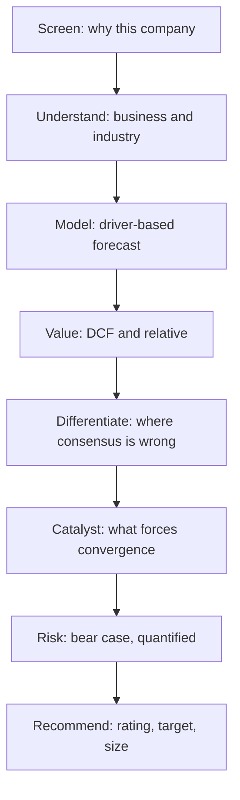

# A Complete Worked Research Case, End to End

## The Problem / Why this matters
Every preceding chapter covers one component of the research process. This chapter runs a single company through the entire sequence — from screening to published recommendation — so the components connect. Analysts learn the pieces separately and frequently struggle to assemble them under time pressure; seeing the full chain once, with the reasoning visible at each step, is what makes the process usable rather than merely known.

## Core Idea
A complete research case is a chain: **screen → understand → model → value → differentiate → catalyse → risk → recommend**. Each step feeds the next, and the output is a falsifiable view with a size, not a description of a company.

## Why it works this way
Research produces value only when analysis becomes a decision. Every step in the chain exists to convert information into a defensible, actionable, testable conclusion — and a step skipped shows up as a weakness in the recommendation.

## Full technical content

*The company below is illustrative. The purpose is the reasoning chain, not the specific numbers.*

### Step 1 — The screen and why it surfaced

**Company:** a mid-cap speciality chemicals manufacturer, market cap ~₹6,400cr, ADTV ~₹18cr, three analysts covering.

**Why it surfaced:** a screen for companies with RoCE above 18% sustained over five years, net debt/EBITDA below 1.5×, and trading below their own five-year average EV/EBITDA. It appeared because the multiple has de-rated from ~16× to ~11× over eighteen months while returns held.

**The immediate question:** is the de-rating justified — has something structurally changed — or is it an opportunity? That question frames the entire subsequent work.

### Step 2 — Understanding the business

- **Products:** four intermediate molecules supplied to agrochemical and pharmaceutical customers, each requiring customer qualification.
- **Customers:** top five are 61% of revenue; the largest is 22%. All relationships exceed five years.
- **Classification test** (per the chemicals framework): RoCE held at 18–24% through the last down-cycle, gross margin varied within a 400bp band, and contracts contain raw-material pass-through clauses. **This is genuinely speciality, not commodity wearing the label.**
- **Moat:** customer qualification — switching requires 18–24 months of re-validation. Evidence: no customer lost in seven years; two competitors' entry attempts in one molecule failed to displace share.
- **Capacity:** operating at 84% utilisation; a new block commissioning in nine months adds 40% capacity.

### Step 3 — Why the de-rating happened

Establishing the market's reason is essential before disagreeing with it:
- Two consecutive quarters of margin compression, caused by a raw-material spike ahead of the contractual pass-through lag.
- A large agrochemical customer's channel destocking reduced volumes for three quarters.
- Sector sentiment weakened as the China+1 narrative cooled and several peers announced speculative capacity.

**Assessment:** all three are cyclical or timing effects rather than structural. Pass-through has since restored gross margin to 41% from a trough of 36%. Customer destocking has ended, evidenced by the customer's own disclosed inventory normalisation. The peer capacity concern is real but is concentrated in different molecules.

### Step 4 — The model

Driver-based, not growth-rate-based:

| Driver | FY25A | FY26E | FY27E | Basis |
|---|---|---|---|---|
| Capacity (kt) | 24 | 24 | 34 | New block from H2 FY26 |
| Utilisation | 84% | 86% | 78% | Ramp on expanded base |
| Volume (kt) | 20.2 | 20.6 | 26.5 | Capacity × utilisation |
| Realisation (₹/kg) | 412 | 418 | 425 | Contracted, with escalation |
| Revenue (₹cr) | 832 | 861 | 1,126 | |
| Gross margin | 38.4% | 41.0% | 41.5% | Pass-through restored; mix |
| EBITDA margin | 22.1% | 24.2% | 25.0% | Operating leverage on ramp |
| EBITDA (₹cr) | 184 | 208 | 282 | |

**Sanity checks applied:** implied market share at FY27 revenue is 9% of the addressable molecule market — plausible; terminal margin of 25% sits below the company's own historical peak of 26.4%; capex/sales normalises to 6% post-expansion; working capital days held flat with a stated reason (no historical improvement assumed).

### Step 5 — Valuation

**DCF:** WACC 11.4% (Rf 6.9%, ERP 7.0%, peer-median unlevered beta re-levered to 0.78, cost of debt 8.6% after tax, target D/E 0.25). Terminal growth 4.5%, capped below nominal GDP. Terminal margin 24%, below the forecast peak. **Value: ₹1,180/share.**

Sensitivity (WACC × terminal growth) spans ₹940 to ₹1,510 — a range worth publishing rather than concealing.

**Relative:** peer set of five domestic speciality chemical companies with comparable RoCE and growth, median FY27E EV/EBITDA 14.2×. Applying 13× (a modest discount for smaller scale and customer concentration) to FY27E EBITDA of ₹282cr, less net debt of ₹190cr, gives **₹1,095/share**.

**Triangulated target: ₹1,120**, weighting relative valuation more heavily given DCF sensitivity.

### Step 6 — The differentiated insight

**Consensus FY27 EBITDA: ₹241cr. Our estimate: ₹282cr — 17% above.**

The gap is entirely in the new capacity's ramp assumption. Consensus models the block contributing from Q4 FY27 at low utilisation. Our channel work — equipment-supplier conversations and the company's own hiring pattern for the site — indicates commissioning is running roughly two quarters ahead, and one customer has already contracted a majority of the incremental volume.

**This is the note's reason to exist**, and it is stated on the front page.

### Step 7 — Catalysts

| Catalyst | Timing |
|---|---|
| Commissioning announcement for the new block | Next 1–2 quarters |
| Q3 result showing gross margin sustained above 40% | ~3 months |
| Volume contribution visible in Q4/Q1 results | 4–7 months |
| Potential coverage initiation by larger brokers post-expansion | 6–12 months |

### Step 8 — Risks, quantified

| Risk | Trigger | EPS impact | Value impact |
|---|---|---|---|
| Commissioning delayed two quarters | Execution slip | −9% FY27 | −7% |
| Largest customer (22%) reduces volumes 30% | Contract change | −11% | −13% |
| Raw-material spike without pass-through | Contract renegotiation | −8% | −8% |
| Peer capacity enters this molecule | Competitive entry | −14% | −18% |

**Bear case: ₹690** (delayed ramp, margin at 21%, multiple de-rating to 9×).
**Bull case: ₹1,420** (early ramp, margin 26%, multiple 15×).

**Falsification conditions, stated in advance:** gross margin failing to hold above 39% for two consecutive quarters; any disclosed customer loss among the top three; commissioning slipping beyond FY27 Q1.

### Step 9 — The recommendation

**Buy. Target ₹1,120. Current price ₹745. Upside 50%. Bear ₹690 (−7%). Risk-reward ≈ 7:1.**

**Sizing note:** ADTV ₹18cr; a 2% position in a ₹1,000cr fund is ₹20cr, requiring roughly 5 days to build at 20% participation and materially longer to exit in stressed conditions. Position sized accordingly.

**Monitorables:** quarterly gross margin, the commissioning announcement, top-five customer concentration in the annual report, and peer capacity announcements in this molecule.

### What the chain demonstrates

Each step in the sequence did specific work:
- The **screen** raised a question rather than producing an answer.
- **Understanding** established that the business is genuinely speciality — which justified the entire subsequent approach.
- Establishing **why the market de-rated it** was necessary before disagreeing.
- The **model** is driver-based, so a reader can disagree with a specific assumption.
- **Valuation** produced a range, and the triangulation logic is explicit.
- The **differentiated insight** is quantified against consensus and evidenced by primary work.
- **Catalysts** give the thesis a timeline.
- **Risks** are quantified, and **falsification conditions** are stated in advance.
- The **recommendation** includes size and the liquidity constraint.

Remove any one and the recommendation weakens in an identifiable way — which is the practical argument for the discipline of the whole chain.

## Common mistakes
- Screening producing a **conclusion** rather than a question.
- Disagreeing with the market **without establishing why it holds its view**.
- A growth-rate model rather than a **driver-based** one.
- A single-point target with **no range or sensitivity**.
- A thesis with no **quantified difference from consensus**.
- No dated **catalyst**.
- Risks listed without **numbers**.
- No **falsification conditions**, so the thesis can never be wrong.
- Ignoring **liquidity and sizing**.

## Interview angle
This chapter is effectively a worked answer to "walk me through how you'd analyse a company." Compress it to: what surfaced it and what question that raised; what the business actually is and whether its economics are what they appear; why the market prices it as it does; a driver-based forecast with the assumptions visible; valuation triangulated with a published range; the specific, quantified way your view differs from consensus and the evidence for it; the catalyst that forces convergence; the quantified bear case and risk-reward; and the position size given liquidity. Ending with the falsification conditions — stated before being asked — is what marks the answer as a professional's rather than a student's.
