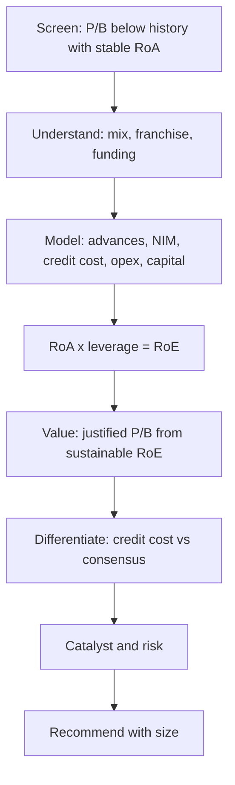

# A Second Worked Case — Analysing a Bank End to End

## The Problem / Why this matters
The previous worked case followed a manufacturing business, where the analytical chain is relatively intuitive: volumes, prices, costs, cash flows. Banks break that chain at every step — there is no volume, no gross margin, no free cash flow in the usual sense, and the largest single earnings variable is a management estimate. Running a bank through the full research process is therefore a genuinely different exercise, and it is the one most frequently tested in Indian equity research interviews given the sector's index weight.

## Core Idea
A bank case runs on the same chain — screen, understand, model, value, differentiate, catalyse, risk, recommend — but every step uses the balance-sheet framework: growth, spread, asset quality, efficiency, capital, and P/B against sustainable RoE.

## Why it works this way
The bank's product is its balance sheet, so the model is built from advances and deposits outward rather than from revenue inward. Because leverage is roughly 7–10×, small changes in credit cost swing RoE by several points — meaning the case's differentiated view usually lives in asset quality rather than in growth.

## Full technical content

*Illustrative company; the reasoning chain is the point.*

### Step 1 — The screen and the question

**Company:** a mid-sized private-sector bank. Market cap ~₹52,000cr, P/B 1.6× on FY26E book, against a five-year average of 2.3×. RoA has held at 1.5–1.7% through the period.

**Why it surfaced:** de-rating of nearly a third on the multiple, with returns broadly intact.

**The question:** is the market pricing a credit-quality deterioration that has not yet appeared in reported numbers, or has sentiment de-rated a franchise whose economics are unchanged? Everything that follows serves that question.

### Step 2 — Understanding the franchise

**Loan mix (FY25):**

| Segment | Share | Yield | Character |
|---|---|---|---|
| Retail — secured (home, LAP, auto) | 44% | 9.2% | Low loss, low yield |
| Retail — unsecured (PL, cards) | 18% | 15.8% | High yield, high loss in stress |
| MSME | 21% | 11.4% | Cyclically sensitive |
| Corporate | 17% | 8.6% | Lumpy risk |

**Funding:** CASA 41%, cost of funds 5.1%, credit-deposit ratio 84%. The CASA level is the structural quality marker — it allows the bank to lend to safer borrowers and still earn a competitive spread.

**The observation that frames the case:** unsecured retail has risen from 11% to 18% of advances over three years. NIM expanded 34bp over the same period. **The critical question is whether NIM expansion reflects pricing power or a mix shift into higher risk** — and on this evidence it is substantially the latter. That matters because it means reported NIM strength has a credit-cost bill attached that has not yet arrived.

### Step 3 — Why the market de-rated it

Establishing the market's reasoning before disagreeing with it:
- Unsecured retail growth attracted regulatory commentary sector-wide, and risk weights on such lending were raised.
- Two quarters of rising slippages, concentrated in the unsecured book.
- Sector-wide concern about unsecured retail asset quality after a period of rapid industry growth.

**Assessment:** the concern is legitimate and directionally correct. The analytical question is not whether credit costs rise, but **by how much, and whether the market has over- or under-priced it.**

### Step 4 — The model

Built from the balance sheet outward:

| Line (% of avg assets) | FY25A | FY26E | FY27E | Basis |
|---|---|---|---|---|
| Advances growth | 18% | 14% | 13% | Deliberate unsecured slowdown |
| NIM | 4.28% | 4.15% | 4.05% | Mix stabilises; deposit repricing |
| Fee income | 1.32% | 1.30% | 1.32% | Cards, distribution |
| Total income | 5.60% | 5.45% | 5.37% | |
| Operating expense | 2.42% | 2.35% | 2.26% | Cost-to-income improving on scale |
| **PPOP** | **3.18%** | **3.10%** | **3.11%** | The buffer |
| Credit cost | 1.02% | 1.55% | 1.30% | **The swing variable** |
| Pre-tax | 2.16% | 1.55% | 1.81% | |
| **RoA** | **1.62%** | **1.16%** | **1.36%** | |
| Leverage (×) | 9.4 | 9.1 | 9.0 | |
| **RoE** | **15.2%** | **10.6%** | **12.2%** | |

**The credit-cost build** — where the real work is:
- Unsecured book of ₹1.42 lakh crore. Assume peak lifetime loss of 6.5% on the FY23–25 vintages (against 4.1% historically), recognised across FY26–27.
- Secured retail and corporate credit costs held near historical levels.
- MSME modestly higher on a slowing economy.
- Result: credit cost peaks at 1.55% in FY26 before normalising to 1.30%.

**Why this is defensible rather than arbitrary:** the loss assumption is anchored to disclosed vintage performance, the bank's own SMA-1/SMA-2 disclosure trend, and the observed relationship between slippage and eventual loss in comparable books.

**Capital check:** CET-1 of 14.2% against a 13% internal floor. At 13–14% advances growth with 11–12% RoE and a 15% payout, the bank funds growth internally without dilution. **No equity raise modelled** — an explicit conclusion, not an omission.

### Step 5 — Valuation

**Justified P/B = (RoE − g) ÷ (Ke − g)**

- Sustainable RoE: 14.5% (recovering past FY27 as credit costs normalise and the mix stabilises)
- Cost of equity: 13.0% (Rf 6.9%, beta 1.05, ERP 5.8%)
- Growth: 11%

Justified P/B = (14.5 − 11) ÷ (13.0 − 11) = **1.75×**

Applied to FY27E book value per share of ₹412 → **target ₹721**.

**Cross-check on P/ABV:** net NPA of 0.6% is small relative to book, so adjusted book value is close to reported. No material adjustment required — worth stating explicitly, since it would matter greatly for a more stressed lender.

**Cross-check on P/E:** at ₹721 the stock would trade at 14.2× FY27E EPS. FY27 credit cost of 1.30% is above the historical 1.02% but below the FY26 peak — so this is close to a normalised-earnings multiple rather than a trough or peak one. The two methods are consistent.

### Step 6 — The differentiated view

**Consensus FY26 credit cost: 1.85%. Our estimate: 1.55%.**

The difference is the loss assumption on the unsecured vintages. Consensus appears to apply a stress-case loss rate uniformly to the whole unsecured book. Our work distinguishes:
- The bank's unsecured growth was concentrated in **existing-to-bank customers** (disclosed at 71% of unsecured originations), whose loss experience has historically been materially better than new-to-bank sourcing.
- **Average ticket size** in its personal-loan book is well below the segment's stressed cohorts.
- The bank tightened underwriting three quarters before peers, visible in its own disclosed origination-score mix.

**The resulting gap: our FY26 EPS is 19% above consensus, and FY27 is 12% above.**

This is a genuinely differentiated, evidenced view on the single variable that matters most — which is what makes the note worth publishing.

### Step 7 — Catalysts

| Catalyst | Timing |
|---|---|
| Q3 slippage number below consensus expectation | ~3 months |
| SMA-2 book stabilising in the quarterly disclosure | 3–6 months |
| Credit cost peaking and guided lower | 6–9 months |
| Unsecured mix stabilising as growth slows | Visible over 2–3 quarters |

### Step 8 — Risks, quantified

| Risk | Trigger | RoE impact | Value impact |
|---|---|---|---|
| Unsecured losses at consensus stress level | Vintages worse than modelled | −180bp FY26 RoE | −14% |
| Losses at severe stress (9% lifetime) | Broad unsecured deterioration | −340bp | −27% |
| NIM compresses 25bp on deposit competition | Funding cost pressure | −90bp | −8% |
| Regulatory risk-weight increase | Policy | Capital, not P&L | Dilution risk if CET-1 falls below floor |

**Bear case: ₹455** (severe unsecured stress, RoE trough at 8%, P/B de-rating to 1.1×).
**Bull case: ₹880** (losses at historical levels, RoE recovering to 16%, P/B 2.0×).

**Falsification conditions, stated in advance:** slippages rising for two further consecutive quarters; SMA-2 book expanding; PCR falling below 70%; or any disclosed divergence between RBI-assessed and reported NPAs.

### Step 9 — Recommendation

**Buy. Target ₹721. Current ₹596. Upside 21%. Bear ₹455 (−24%). Risk-reward ≈ 0.9:1.**

**And here the discipline bites.** A 0.9:1 risk-reward does not support a Buy under the 2:1 threshold the risk framework sets — the differentiated view is real, but the downside if wrong is nearly as large as the upside if right.

**The honest recommendation is therefore a Hold, with a stated trigger:** the thesis becomes actionable at roughly ₹520, where risk-reward improves to about 2.3:1, or earlier if the Q3 slippage number confirms the vintage view and compresses the bear case.

This is deliberately the case's most important teaching point: **a differentiated view that is probably right is not automatically a Buy.** Position-level risk-reward, not conviction alone, determines the rating — and analysts who ignore that produce recommendations that lose money while being analytically correct.

### What differed from the manufacturing case

- The model is built from the **balance sheet outward**, not from revenue.
- The differentiated view sits in **credit cost**, a management estimate, rather than in volumes or prices.
- **Capital adequacy** is a modelled constraint that can force dilution.
- Valuation runs through **P/B justified by sustainable RoE** rather than DCF.
- **PPOP** serves as the stress buffer — the metric with no manufacturing analogue.
- The recommendation was governed by **risk-reward discipline overriding conviction**.

## Common mistakes
- Modelling a bank from revenue rather than from advances and spread.
- Reading **NIM expansion** as pricing power when it is a risk-mix shift.
- Applying a stress loss rate **uniformly** rather than by origination vintage and channel.
- Ignoring the **capital constraint** and so missing dilution risk.
- Valuing on P/E rather than P/B against sustainable RoE.
- Watching GNPA rather than **slippages and SMA-2**.
- Converting a differentiated view into a Buy without checking **risk-reward**.

## Interview angle
This case is the long-form answer to "walk me through how you'd analyse a bank." Compressed: establish the franchise — loan mix, CASA, funding cost — and ask immediately whether NIM strength reflects pricing power or a shift into riskier lending; build the model outward from advances with credit cost as the explicit swing variable, anchored to vintage and channel data rather than a blanket stress rate; check whether growth can be funded without dilution; value on justified P/B from sustainable RoE, cross-checked on P/ABV and on a normalised P/E; state where you differ from consensus on credit cost and why; then — the part that distinguishes a senior answer — apply risk-reward discipline, and be willing to conclude Hold with a stated entry trigger even when your differentiated view is favourable.
