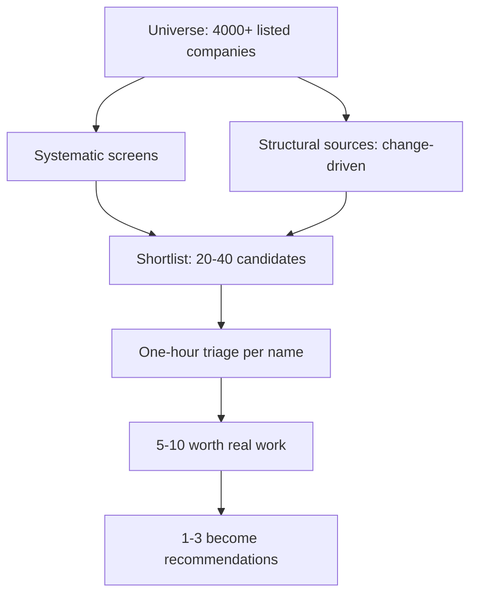

# Screening and Idea Generation

## The Problem / Why this matters
Before any analysis happens, an analyst must decide what to analyse. With several thousand listed companies and finite time, the selection process determines the ceiling on the value of everything that follows — perfect analysis of an uninteresting company produces nothing. Yet idea generation is usually left to chance: whatever is in the news, whatever a colleague mentioned, whatever presented at a conference. Making it systematic is one of the most direct improvements an analyst can make to their output.

## Core Idea
Good idea generation combines **systematic screens** (which surface candidates without bias) with **structural sources** (change-driven situations that screens miss) — and treats every output as a **question to investigate**, never as a conclusion.

## Why it works this way
Screens find statistical anomalies; they cannot tell you why the anomaly exists. Most cheap stocks are cheap for good reasons, so a screen's real function is to reduce a universe of thousands to a shortlist of dozens worth an hour each. The analytical work begins where the screen ends.

## Full technical content

### Screen families and what each finds

**1. Valuation screens**
- Low P/E, P/B, EV/EBITDA relative to sector and to the company's own history.
- Discount to own 5-year average multiple — the "de-rated but unchanged" screen used in the worked cases.
- High FCF yield or dividend yield.

*What they surface:* cheapness, most of which is deserved. Always pair with a quality filter, or the output is a list of value traps.

**2. Quality screens**
- Sustained high RoCE/RoE (say, above 15% for five consecutive years).
- Low leverage, high interest coverage.
- Strong cash conversion (CFO/EBITDA above 0.8 consistently).
- Stable or expanding margins.

*What they surface:* good businesses, usually at full prices. The productive version pairs quality with a valuation filter.

**3. Change screens — usually the most productive**
- Accelerating revenue or margin trend after a flat period.
- Positive estimate-revision momentum and breadth.
- RoCE inflecting upward.
- Capacity expansion commissioning.
- Working-capital cycle improving.
- Management change, particularly a new CEO with a different capital-allocation record.

*Why these work best:* markets price the status quo efficiently and adjust to change with a lag, so inflection points are where mispricing concentrates. This is the same insight that makes post-earnings drift and estimate-revision momentum persistent.

**4. Risk and forensic screens (for shorts and for avoidance)**
- Rising receivable or inventory days.
- Cumulative CFO well below cumulative PAT.
- Rising promoter pledge.
- Frequent "exceptional" items.
- Rising contingent liabilities relative to net worth.
- Auditor change or resignation.
- Beneish M-Score or high accruals ratio.

**5. Event screens**
- Corporate actions — demergers, buybacks, open offers, rights issues.
- Index inclusion or exclusion candidates.
- Lock-in expiries.
- Delisting or open-offer situations.
- Insolvency resolutions.

**6. Ownership screens**
- Meaningful FII/DII holding changes in the quarterly shareholding pattern.
- Promoter buying, especially discretionary open-market purchases.
- Creeping acquisition at the annual limit.
- Under-covered names — fewer than three analysts with reasonable liquidity.

### Structural idea sources that screens cannot find

Screens work on reported numbers; the highest-value ideas often precede them.

| Source | What it surfaces |
|---|---|
| **Regulatory change** | Policy shifts creating winners and losers before financials show it |
| **Value-chain reasoning** | If input costs collapse for one sector, who benefits downstream? |
| **Global analogues** | A business model or transition already completed in another market |
| **Customer/supplier commentary** | A company's customers describing supply tightness or vendor consolidation |
| **Concall transcripts of adjacent companies** | Competitors and customers describing your sector's dynamics |
| **Capacity announcements** | Supply arriving, knowable years ahead |
| **Trade and government data** | Import/export shifts, GST, e-way bills, vehicle registrations |
| **Alternative data** | Hiring surges, app rankings, patent filings, satellite observations |

**The value-chain approach deserves emphasis** because it is systematic rather than serendipitous: when something significant happens to one company or sector, work explicitly up and down the chain asking who else is affected and whether the market has connected it. Second-order effects are consistently under-priced because they require an extra inferential step that most participants do not take.

### The triage discipline

A screen producing 40 names is useless without a fast filter. A disciplined **one-hour triage** per name:

1. **What does it do, and is the industry structurally sound?** (10 min)
2. **Returns history** — RoCE over 5–10 years. Does it earn above the cost of capital? (10 min)
3. **Cash conversion** — cumulative CFO vs PAT. (5 min)
4. **Balance sheet** — leverage, and any obvious distress markers. (5 min)
5. **Governance quick-check** — promoter pledge, related-party scale, auditor changes. (10 min)
6. **Why is it cheap / why did the screen catch it?** — the essential question. (15 min)
7. **Is there a plausible catalyst?** (5 min)

**Outcome: reject, watch, or investigate.** Most should be rejected, and rejecting quickly is the skill — the cost of a slow rejection is the good idea not examined.

### Building a personal idea funnel

The systematic version, maintained rather than performed occasionally:

- **A standing screen set**, run monthly, with results logged so changes are visible.
- **A watchlist** with the specific reason each name is on it and what would trigger action — "watching for the capacity commissioning announcement," "waiting for the multiple to reach 12×."
- **A rejected-with-reason file**, so a name that reappears can be reassessed quickly against what previously disqualified it. This compounds enormously.
- **A structural-theme list** — shifts being tracked and the companies exposed to each.
- **A trigger list** — dated events (lock-in expiries, capacity commissioning, regulatory decisions) that will change specific situations.

### Screening pitfalls

- **Survivorship bias** — screens run on current constituents exclude companies that failed, systematically understating risk.
- **Data quality** — screening databases carry errors and inconsistent adjustments; verify anything material from filings before acting.
- **Backward-looking metrics** — trailing figures may reflect conditions that have already reversed, which is exactly the cyclical trap in screen form.
- **Cyclical distortion** — screening on trailing P/E systematically surfaces cyclicals at their earnings peak. Screen cyclicals on P/B or mid-cycle earnings instead.
- **One-off distortion** — trailing earnings inflated by an asset sale make a stock look cheap.
- **Crowding** — widely-used screens produce widely-known lists; the edge is in the analysis, not the screen.
- **Illiquidity** — a screen with no liquidity filter surfaces names that cannot be traded.

### What separates good idea generation

- **Volume and discipline** — examining many candidates quickly, and rejecting ruthlessly.
- **Asking why**, always: why is this cheap, why has nobody noticed, what does the market believe that might be wrong.
- **Looking where others are not** — under-covered mid-caps, unfashionable sectors, post-disappointment situations.
- **Recording rejections** so the funnel compounds.
- **Combining sources** — a name that appears on a valuation screen *and* has a change catalyst *and* shows promoter buying is a far stronger candidate than one that appears on any single filter.

## Common mistakes
- Treating a screen output as a **conclusion** rather than a question.
- Screening on **valuation alone**, producing a list of value traps.
- Screening **cyclicals on P/E**, surfacing them at peak earnings.
- No **liquidity filter**, generating unimplementable ideas.
- Not recording **why a name was rejected**, so the work is repeated.
- Relying only on screens and missing **change-driven** and second-order ideas.
- Slow triage, so few names get examined.
- Assuming a widely-used screen confers edge.

## Interview angle
"How do you find ideas?" Describe a system rather than a habit: standing screens across valuation, quality, change and forensic families — noting that **change screens are usually most productive** because markets price the status quo efficiently and adjust to inflections with a lag; structural sources that screens cannot reach, particularly value-chain reasoning about second-order effects and regulatory change; a disciplined one-hour triage per candidate ending in reject/watch/investigate, where rejecting fast is the actual skill; and a maintained funnel with a watchlist carrying explicit triggers and a rejected-with-reason file so the work compounds. Add the pitfall you actively guard against — screening cyclicals on trailing P/E surfaces them at exactly the wrong moment.
