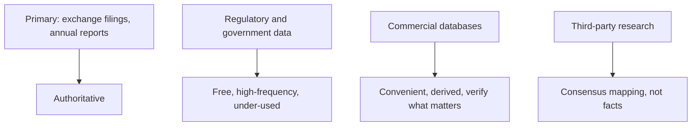

# Data Sources and the Analyst's Toolkit

## The Problem / Why this matters
An equity analyst's output is only as good as the inputs, and a surprising amount of the difference between a strong analyst and a weak one is simply knowing where the data lives. Much of the most useful information in Indian markets is free, public, high-frequency and systematically under-used, while analysts pay for terminals and then rely on their summary screens. Knowing the primary sources — and going to them rather than to someone else's summary — is a genuine and cheap edge.

## Core Idea
Build a **hierarchy of sources**: primary filings first (authoritative), then regulatory and government data (free, high-frequency, under-used), then commercial databases (convenient, but derived), then third-party research (useful for consensus mapping, not for facts).

## Why it works this way
Every step away from the primary source introduces potential error and delay. A database's "adjusted EPS" reflects that vendor's adjustment policy; a broker note's number reflects that analyst's judgement. For anything material to a recommendation, the filing is the only authoritative source, and going there directly is both more accurate and more likely to surface something others missed.

## Full technical content

### Primary sources — always first for anything material

| Source | Contains |
|---|---|
| **Exchange filings (NSE/BSE)** | Results, investor presentations, corporate announcements, shareholding patterns, board outcomes, disclosures under listing regulations |
| **Annual report** | The densest single document — notes, related-party transactions, contingent liabilities, auditor's report, CARO, segment data |
| **Concall transcripts and recordings** | Management reasoning and the unrehearsed Q&A |
| **Offer documents (DRHP/RHP)** | For IPOs — risk factors, capital-structure history, objects of the issue |
| **Credit rating agency reports** | Frequently the most detailed public analysis of a company's debt, covenants and group structure — and free |
| **Regulatory orders** | SEBI orders, tribunal judgments, sectoral regulator decisions |

**Credit rating rationales deserve specific mention** because analysts routinely overlook them. They contain granular detail on debt structure, covenants, group exposures, contingent liabilities and sometimes segment-level information not disclosed elsewhere — assembled by an analyst with management access and a different objective from equity research.

### Indian regulatory and government data — free and under-used

This is where a genuine, low-cost edge exists, because the data is public, frequent, and most participants do not track it systematically:

| Source | What it gives | Frequency |
|---|---|---|
| **VAHAN** | Vehicle registrations by category, state, manufacturer — the retail read for autos | Daily/monthly |
| **GST collections** | Aggregate and state-wise economic activity | Monthly |
| **E-way bill volumes** | Goods movement — a real-time freight and industrial proxy | Monthly |
| **IIP** | Industrial production by sector | Monthly |
| **RBI data** | Credit growth by sector, deposit growth, sectoral deployment, monetary aggregates | Fortnightly/monthly |
| **CEIC / MOSPI** | National accounts, inflation, and a wide statistical base | Various |
| **Port and shipping data** | Cargo volumes by port and commodity | Monthly |
| **Power generation and PLF** | Sectoral demand and utility utilisation | Daily |
| **DGCA** | Airline traffic, load factors, market share | Monthly |
| **TRAI** | Telecom subscribers, active (VLR) subscribers, ARPU trends | Monthly |
| **Coal, steel, cement ministries** | Production and dispatch data | Monthly |
| **DGFT / customs** | Import-export volumes by product | Monthly |
| **SEBI** | FII/DII flows, bulk and block deals, disclosures | Daily |
| **Company shareholding patterns** | Ownership by category, pledge | Quarterly |

**The practical point:** an analyst covering autos who tracks VAHAN alongside company dispatch numbers sees the inventory divergence that the dispatch numbers alone conceal. One covering telecom who tracks TRAI's VLR data sees the difference between reported and active subscribers. In both cases the information is free and public, and most of the market does not look.

### Commercial databases

| Type | Use | Caution |
|---|---|---|
| **Bloomberg / Refinitiv / FactSet** | Consensus estimates, historical financials, screening, news | Adjustment policies vary; consensus can be stale |
| **Capitaline / Ace Equity / Prowess** | Indian company financials, standardised | Standardisation can obscure company-specific detail |
| **Screener / Trendlyne / Tijori** | Accessible screening and visualisation | Derived data; verify anything material |
| **Industry data services** | Commodity prices, spreads, capacity | Expensive but often the only source for spreads |

**The discipline:** databases are for **screening, consensus and historical convenience**. Anything that will appear in a published recommendation should be verified against the filing. Standardised databases also frequently mis-handle exceptional items, segment restatements and accounting-policy changes — exactly the areas where analytical judgement matters most.

### Third-party research

- Useful for **consensus mapping** — understanding what the market believes, which is the baseline for differentiation.
- Useful for **sector education** when entering an unfamiliar space, particularly initiation notes.
- Useful for **models**, saving reconstruction time.
- **Not a source of facts** — verify anything material independently, since errors propagate through the research ecosystem when everyone copies the same number.

### The analyst's own toolkit

**Excel/spreadsheets** remain the core modelling tool. Beyond basic competence, the genuinely useful capabilities: INDEX/MATCH and XLOOKUP, structured tables, data tables for sensitivity, scenario management, Power Query for repetitive data pulls, and disciplined use of named ranges.

**Python** is increasingly common for research productivity rather than for quantitative modelling: automating data pulls from public sources, processing transcripts at scale, building screening pipelines, and handling alternative datasets. For an analyst with a technical background, this is a genuine differentiator — automating a weekly data-gathering routine that competitors do by hand creates time for actual analysis.

**Practical automation worth building:**
- A script pulling monthly government data series into a tracking sheet.
- Transcript downloading and keyword/tone analysis across a coverage universe.
- Peer-comparison sheets that refresh from a database.
- Alerts on exchange filings for covered names.
- A screening pipeline run on a schedule with results logged.

**Charting and visualisation** — the ability to produce a clean chart that makes a point (titled with the conclusion, per the writing chapter) is a communication skill, not a technical one.

### Building the personal data infrastructure

What a well-organised analyst maintains:

1. **A per-company file** — dated notes from every meeting, call and observation.
2. **A model repository** — versioned, with an assumptions log.
3. **A peer-comparison database** for each covered sector, updated quarterly.
4. **A high-frequency tracker** — the government and industry series relevant to the coverage, updated monthly.
5. **A capacity/supply pipeline tracker** — the most forecastable variable in most sectors.
6. **A screen log** — standing screens with results over time.
7. **A decision journal** — as the post-mortem chapter describes.

None of this is technically difficult; the differentiator is that it is maintained. The compounding value over years is substantial and is largely unavailable to anyone starting fresh.

### Verification discipline

Before any number appears in published research:
- Is it from the **filing** or from a derived source?
- If derived, does it match the filing?
- Is the **period and basis** consistent (standalone vs consolidated, adjusted vs reported)?
- Has any **restatement or policy change** affected comparability?
- For a ratio, are numerator and denominator on a **consistent basis**?

## Common mistakes
- Relying on **database summary screens** rather than filings for material numbers.
- Ignoring free **government high-frequency data**, which is where cheap edge exists.
- Overlooking **credit rating rationales** as a detailed free source.
- Using another analyst's number **without verification**.
- Mixing **standalone and consolidated** figures.
- Not noticing **restatements** that break historical comparability.
- Building nothing that compounds — no per-company file, no maintained trackers.
- Treating consensus from a database as current immediately after an event, when it may be stale.

## Interview angle
"Where would you get information on a company nobody covers?" Work down the hierarchy and be specific: exchange filings and the last three annual reports including the notes, related-party disclosures and the auditor's report with CARO; concall transcripts if they exist, and those of listed customers, suppliers and competitors, which often describe the company's market directly; **credit rating agency rationales**, which are free and frequently the most detailed public analysis of the company's debt and group structure; sector-specific government data — VAHAN, TRAI, port cargo, GST, e-way bills, RBI sectoral credit — depending on the industry; and primary work through channel checks. Mentioning rating rationales and free government high-frequency data unprompted signals that you actually work with under-covered names rather than relying on a terminal.
