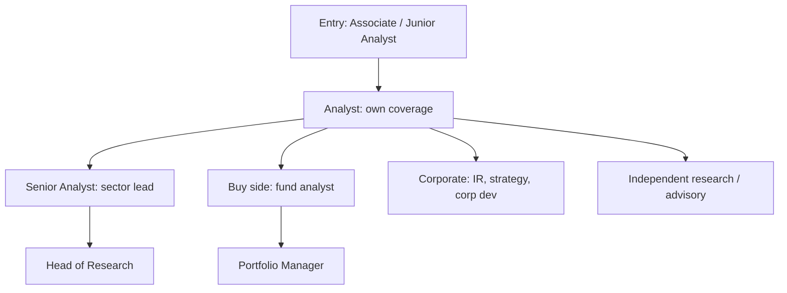

# Career Paths in Equity Research

## The Problem / Why this matters
Equity research sits within a broader ecosystem of investment roles, and candidates frequently pursue it without understanding what the day-to-day work actually involves, how careers progress, how compensation is structured, or what the realistic exit paths are. The role is also changing — research budgets have compressed, coverage has consolidated, and technology has altered what the job requires. Making an informed choice, and articulating that choice credibly in an interview, requires understanding the landscape rather than the job title.

## Core Idea
Equity research is a **craft apprenticeship** — the skills compound slowly and transfer well, which is why it remains a strong training ground even as the sell-side industry itself has contracted. The core question for a candidate is whether they want to produce **research as a product** (sell side) or **decisions on capital** (buy side).

## Why it works this way
Fundamental analysis is learned through repetition across many companies and at least one full market cycle. The judgement about what matters, what managements are worth believing, and how businesses actually behave in downturns cannot be compressed. This is why seniority in research correlates with genuine capability more than in many finance roles, and why the skills transfer readily to investing roles.

## Full technical content

### The sell-side progression

| Level | Typical experience | Work |
|---|---|---|
| **Associate / Junior** | 0–3 yrs | Model building and maintenance, data gathering, drafting sections, supporting the analyst |
| **Analyst** | 3–7 yrs | Own coverage of a sub-sector, publish under own name, client interaction |
| **Senior Analyst** | 7–15 yrs | Lead sector coverage, franchise value, client relationships, ranked in surveys |
| **Head of Research** | 15+ yrs | Manage the team, resource allocation, quality control, less direct coverage |

**What actually determines progression:** the ability to generate differentiated views that clients value, communicate them clearly under pressure, and build relationships across the buy side. Analytical ability is the entry ticket; the differentiator is judgement plus communication.

**The associate-to-analyst transition** is the hardest step, because it requires moving from executing analysis to originating views — a genuinely different skill that some technically strong associates never make.

### The buy-side path

As the buy-side chapter details, the work differs in objective and output. Progression typically runs analyst → senior analyst → portfolio manager, though many excellent analysts remain analysts by choice, since PM work is as much about portfolio construction and psychology as about security selection.

**Fund types offer genuinely different experiences:** long-only mutual funds (benchmark-relative, larger AUM, liquidity-constrained), hedge funds (absolute return, can short, higher turnover, higher pressure), PMS and family offices (concentrated, less constrained), and insurance/pension (very long horizon, size-constrained). The style differences are large enough to be worth understanding before choosing.

### Other destinations from research

| Path | What transfers |
|---|---|
| **Investor relations** | Understanding what investors ask and why; a natural fit |
| **Corporate strategy / development** | Industry knowledge, valuation, competitive analysis |
| **Private equity / VC** | Valuation, diligence, business assessment |
| **Investment banking** | Valuation and modelling, though the work is transactional rather than analytical |
| **Independent research / advisory** | Direct use of the same skills, with the registration requirements the regulatory chapter covers |
| **Financial media / content** | Communication skills and market knowledge |
| **Founding an AIF/PMS** | The entrepreneurial route, requiring capital and a track record |

The breadth of these exits is a genuine argument for research as an early-career choice: few finance roles build a skill set that transfers this widely.

### The Indian market specifically

- **Domestic institutional growth** — the expansion of mutual fund AUM and SIP flows has grown the domestic buy side substantially, creating demand for analysts.
- **Sell-side consolidation** — research budgets have compressed globally, and coverage has concentrated on larger names, reducing the number of sell-side seats while raising the bar.
- **Under-covered mid and small caps** — a genuine opportunity, since the growth in listed companies has outpaced the growth in analysts covering them.
- **Independent research** — a growing category, enabled by registration frameworks and by demand from smaller institutions and HNI investors.
- **Certifications** — the NISM Research Analyst certification is the practical requirement for publishing recommendations; the CFA remains the most recognised international credential and is common among Indian buy-side analysts.

### Compensation structure

Broadly: sell-side compensation is base plus bonus, with the bonus linked to the firm's revenue, the analyst's client rankings and votes, and franchise value. Buy-side compensation is base plus bonus linked to fund performance, with hedge funds typically offering higher variability and higher ceilings. Compensation rises steeply with demonstrated ability to generate ideas that make money or that clients pay for — which is why franchise value, once built, is durable.

### What the job actually involves day to day

Worth stating plainly, because the reality differs from the perception:
- A substantial share of time on **model maintenance and updates**, particularly during results season.
- Heavy, deadline-driven periods during earnings, with long hours in those weeks.
- **Client calls and marketing** for sell-side analysts — a large, often underestimated proportion of time.
- Considerable **reading** — filings, transcripts, industry material.
- Genuine intellectual work, but a minority of total time; the rest is execution and communication.
- **Being publicly wrong** periodically, and having to explain it.

Candidates who expect continuous high-level analysis are usually disappointed; those who enjoy the craft — the models, the detail, the accumulation of knowledge about businesses — do well.

### How the role is changing

- **Technology and automation** — data gathering and routine model updating are increasingly automatable, which shifts the value toward judgement, primary research and communication. Analysts who automate their routine work create time for the parts that cannot be automated.
- **Alternative data** — as the relevant chapter describes, now a standard part of institutional research.
- **Research unbundling** — where implemented, it made research a separately-priced product, compressing budgets but strengthening the link between quality and payment.
- **AI tools** — useful for summarisation, transcript processing and first drafts. What they do not replace is the differentiated view, the primary research behind it, and accountability for a recommendation — which is precisely where the value has been concentrating.

### Building a career deliberately

- **Develop genuine sector depth** rather than shallow breadth; franchise value is sector-specific.
- **Build a public track record** where possible — a maintained model, written work, competition participation, a personal portfolio with documented reasoning.
- **Maintain the decision journal**, since demonstrable calibration is rare and valuable.
- **Invest in communication** — the constraint on most technically capable analysts.
- **Build buy-side relationships** early; they determine both sell-side franchise value and future opportunities.
- **Get the certifications** that gate the role.

## Common mistakes
- Choosing research **without understanding the day-to-day** reality of model maintenance and client work.
- Assuming the associate-to-analyst transition is automatic — originating views is a different skill from executing analysis.
- Neglecting **communication**, which constrains more careers than analytical ability does.
- Spreading across many sectors rather than building **depth** where franchise value accrues.
- Ignoring the **buy-side/sell-side distinction** when interviewing, and pitching in the wrong frame.
- Treating certifications as sufficient rather than as necessary.
- Not building a demonstrable track record while junior.

## Interview angle
"Why equity research, and where do you see yourself in five years?" Answer with an informed view of the actual work rather than an idealised one: you want the craft — building genuine understanding of businesses, forming views you can defend, and being accountable for them — and you understand that the reality includes heavy model maintenance, earnings-season intensity and substantial client interaction. On the five-year question, be specific and coherent: sector depth first, because franchise value is sector-specific, then either originating your own coverage on the sell side or moving to a decision-making seat on the buy side — and say which, with a reason connected to whether you want to produce research as a product or make capital decisions. A candidate who articulates that distinction has genuinely thought about the choice.
