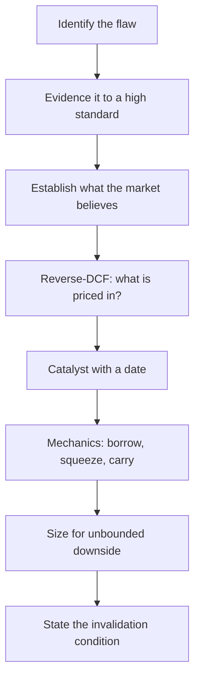

# A Third Worked Case — Constructing a Short

## The Problem / Why this matters
The two preceding cases were long ideas, where the analytical chain is familiar and the payoff structure forgiving. A short requires everything a long requires plus a catalyst, a timeline, and an understanding of mechanics — because the payoff is inverted, carry costs accumulate, and being right eventually is not sufficient. Since well-constructed negative research is scarce, working through one properly is disproportionately valuable, both for the buy side and as interview preparation.

## Core Idea
A short case runs the same chain but with three additions that longs do not require: **the flaw must be evidenced to a higher standard**, the **catalyst must be dated**, and the **mechanics** — borrow, squeeze risk, sizing — must be assessed before the idea is actionable.

## Why it works this way
A long position's worst case is total loss with no carrying cost; a short's worst case is unbounded and it costs borrow fees daily. That asymmetry raises the evidentiary bar and makes timing a first-order rather than a secondary consideration.

## Full technical content

*Illustrative company. The reasoning chain is the point.*

### Step 1 — What surfaced it

**Company:** a consumer-facing lending platform. Market cap ~₹18,500cr, listed 20 months ago, currently 42% below its listing-day high but still 2.1× its pre-IPO placement price.

**What surfaced it:** a forensic screen — cumulative operating cash flow well below cumulative reported profit over eight quarters, alongside receivables growing faster than revenue. Both flags in the same name.

**The question:** is the cash-profit gap explained by the lending business model (where loan growth legitimately consumes cash), or is something else happening?

### Step 2 — Distinguishing model from problem

This distinction determines whether there is a case at all.

For a lender, disbursement growth genuinely consumes cash — that is the business, not a red flag. So the cash-profit gap alone proves nothing. The work is to separate:

| Component | Expected for a growing lender | Observed |
|---|---|---|
| Cash used in loan growth | Large, proportional to disbursement | Consistent with disclosed disbursements |
| **Interest receivable accrued but uncollected** | Small relative to interest income | **Rising from 4% to 13% of interest income over six quarters** |
| Fee income timing | Recognised on disbursement | Fee recognised upfront on multi-year products |
| Provisions | Rising with book seasoning | Rising, but slower than book growth |

**The finding:** the cash-profit gap is *mostly* explained by loan growth, which is legitimate. But a specific, growing component is not — accrued-but-uncollected interest has tripled as a share of interest income. That is income recognised on loans where the borrower is not paying, and it is the thread worth pulling.

**This step matters more than any other in the case.** A weaker analyst would have stopped at the screen output and built a thesis on the headline cash-profit gap, which is largely explainable. The differentiated finding required decomposing it.

### Step 3 — Building the evidence

Multiple independent sources, because the claim is contrarian:

**From disclosures:**
- Accrued interest receivable rising from 4% to 13% of interest income across six quarters.
- **Provision coverage falling** from 68% to 51% while the book grew 74%.
- Stage-2 assets (significant increase in credit risk) rising from 5.1% to 9.4% of the book.
- Write-offs rising sharply — and reconciling the NPA movement shows **reported GNPA improvement was driven by write-offs, not recoveries** (the check the banks chapter specifies).
- A change in the definition of a "delinquent" account disclosed in the notes to the most recent annual report, with no restatement of prior periods.

**From primary work:**
- Conversations with two former collections employees (structural and historical only, per the compliance boundary) describing collection-efficiency deterioration in a specific product cohort.
- App-store review mining showing a sharp rise in complaints regarding collection practices and account statements — consistent with stress.
- Job postings showing a surge in collections hiring disproportionate to book growth.

**From adjacent sources:**
- Two listed competitors in the same segment flagged deterioration in this exact customer cohort on their own calls, while this company reported improvement — a divergence requiring an explanation the company has not given.

**That last point is often the strongest form of evidence in a short:** when peers describe deterioration in a shared market and one company reports the opposite, either it is genuinely better or its recognition is different. Both are testable claims.

### Step 4 — What the market believes

The stock trades at 4.2× book and 31× trailing earnings. A **reverse-DCF / implied-assumption exercise**:

At the current price, the market is implying:
- Book value compounding at ~34% for five years
- Sustained RoE of ~19%
- Credit cost stabilising near 3.2%

**Testing those implied assumptions:**
- 34% book growth for five years requires either extraordinary internal generation or repeated equity raises — the company's own RoE of 19% with no dividend supports only ~19% internal book growth, so **the implied path requires substantial dilution the current price does not appear to account for**.
- Credit cost at 3.2% sits below where two peers in the same segment currently operate, and below where this company's own Stage-2 migration trend points.

**This is the valuation core of the short:** not "31× is expensive," which is an opinion, but "the price embeds a specific combination of growth, returns and credit cost that the company's own disclosed metrics contradict" — which is testable.

### Step 5 — Quantifying the thesis

| Scenario | Credit cost | RoE | Book growth | P/B | Value |
|---|---|---|---|---|---|
| Market-implied | 3.2% | 19% | 34% | 4.2× | ₹640 (current) |
| **Our base** | 5.4% | 11% | 18% | 2.3× | **₹342** |
| Severe | 7.8% | 4% | 8% | 1.4× | ₹198 |
| Bull (we're wrong) | 3.0% | 20% | 30% | 4.6× | ₹745 |

**Base case downside: −47%. Bull-case loss: +16%.**

Note the asymmetry runs the right way here, which is what makes the idea worth pursuing — many valuation shorts fail this test.

### Step 6 — The catalyst, dated

The critical element, and where most short theses fail:

| Catalyst | Timing | Why it forces recognition |
|---|---|---|
| **Q3 results** — Stage-2 migration and PCR disclosure | ~2 months | The trend is already disclosed quarterly; continuation is visible |
| **Annual report** — full accrued-interest disclosure and any auditor commentary | ~5 months | The most granular disclosure; a KAM on provisioning would be significant |
| **Regulatory** — sector-wide review of unsecured lending practices already underway | 3–9 months | Could force provisioning or classification changes |
| **Capital raise** — CET-equivalent buffer thin against modelled growth | 6–12 months | Dilution at a lower price, or a growth slowdown that breaks the narrative |

**The strongest catalyst here is the capital raise**, because it is close to arithmetically forced: the modelled growth cannot be funded internally at the current RoE, so either growth slows sharply (breaking the valuation) or equity is raised (diluting it). Both outcomes support the thesis, which is an unusually favourable catalyst structure.

### Step 7 — Mechanics

**Borrow:** available in the SLB segment at approximately 9% annualised. High, indicating the trade is already somewhat crowded — which is itself information.

**Squeeze risk:**
- Short interest ~6% of free float — meaningful but not extreme.
- Days-to-cover ~4 — manageable.
- Promoter holding 51%, so free float is limited, which raises squeeze risk.
- **Recent promoter buying** disclosed — a genuine squeeze risk to monitor, since promoter accumulation into a shorted name can force covering.

**Carry:** at a 9% borrow cost, the position must deliver more than 9% annualised to break even. With base-case downside of 47% and catalysts inside 12 months, that is acceptable — but a thesis requiring three years would not be.

**Sizing:** given unbounded downside, a smaller position than an equivalent-conviction long, with a defined stop. Sized so that the bull-case outcome is tolerable.

### Step 8 — The invalidation conditions, stated in advance

- Accrued interest receivable falling back below 8% of interest income for two consecutive quarters.
- PCR rising above 65%.
- Stage-2 assets declining for two consecutive quarters.
- A credible, disclosed explanation for the peer divergence.
- An equity raise completed at or above the current price without a growth slowdown.

**Pre-committing these is what makes the thesis honest.** Without them, every adverse data point gets reinterpreted as confirmation.

### Step 9 — The recommendation

**Sell / Short. Target ₹342. Current ₹640. Downside 47%. Bull case ₹745 (+16%). Risk-reward ≈ 2.9:1.**

Size at roughly half of an equivalent-conviction long, given unbounded downside, the 9% carry cost and the limited free float. Reassess at every quarterly disclosure against the invalidation list.

### What differed from the long cases

- **The evidentiary bar was higher** — multiple independent sources rather than one differentiated insight.
- The **first analytical step was distinguishing the business model from the problem**, since the screen flag was largely explainable.
- The differentiated view was expressed through **implied assumptions** (reverse-DCF) rather than a direct forecast difference.
- The **catalyst had to be dated**, and its quality assessed — here the near-arithmetic funding constraint is unusually strong.
- **Mechanics** — borrow cost, squeeze risk, carry — determined whether a correct thesis was actually tradeable.
- **Sizing was reduced** for asymmetry rather than raised for conviction.

## Common mistakes
- Building a thesis on a screen flag that the **business model explains**.
- Evidencing a contrarian claim to the same standard as a consensus one.
- Shorting on **multiple alone** without showing what the price implies and why it fails.
- **No dated catalyst** — the most common reason correct shorts lose money.
- Not checking **borrow cost**, so carry erodes the return.
- Ignoring **free float and promoter buying** as squeeze risks.
- Sizing a short like a long.
- No pre-committed **invalidation conditions**.

## Interview angle
"Pitch me a short." Use this structure: name the specific flaw in one sentence — here, income recognised on loans that are not being collected, visible in accrued interest tripling as a share of interest income while provision coverage falls; show you distinguished it from what the business model legitimately explains; give multi-source evidence including the peer divergence; state what the price implies using a reverse-DCF and why those implied assumptions contradict the company's own disclosures — particularly that the implied growth cannot be funded at the implied RoE without dilution; give the dated catalysts and identify the strongest, which here is a near-forced capital raise; then the mechanics — borrow cost, squeeze risk, carry — and reduced sizing for unbounded downside; and finish with the pre-committed invalidation conditions. Volunteering the invalidation list before being asked is the single strongest signal in a short pitch.
