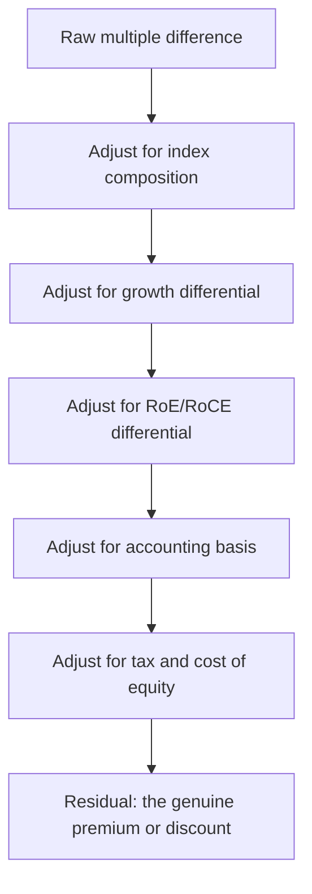

# Comparative Valuation Across Markets

## The Problem / Why this matters
Indian equities frequently trade at higher multiples than their global sector peers, and the question "is India expensive?" arises constantly — in client conversations, in allocation decisions, and in interviews. Answering it badly is easy: comparing headline P/E ratios across markets ignores differences in growth, returns, accounting, tax, index composition and cost of capital that are large enough to make the raw comparison meaningless. Answering it well requires knowing which adjustments matter and in which direction.

## Core Idea
Cross-market multiple comparisons are only informative after adjusting for **growth, returns on capital, index composition, accounting basis, tax regime and cost of equity**. Most apparent "premiums" and "discounts" shrink substantially once these are handled.

## Why it works this way
A multiple is a compressed summary of growth, returns and risk. Two markets with different growth rates, different sector mixes and different risk-free rates should trade at different multiples — and do. The analytical question is never whether a difference exists, but whether the difference is larger or smaller than the fundamentals justify.

## Full technical content

### Adjustment 1 — Index composition

The most important and most frequently omitted adjustment. A market index's multiple is a weighted average of its constituents, so composition drives much of the difference:

- An index heavy in **banks and commodities** (low-multiple sectors by nature) will show a low aggregate multiple.
- An index heavy in **technology and consumer** (high-multiple sectors) will show a high one.
- Neither says anything about whether individual companies are expensive.

**The correct approach is sector-neutral comparison** — compare Indian banks to global banks, Indian consumer to global consumer — or compute what the index multiple would be if it had the other market's sector weights. A meaningful share of India's apparent premium versus some markets is composition: a higher weight in consumer and financials with high RoE, and a lower weight in low-multiple heavy industry.

### Adjustment 2 — Growth

Higher expected growth justifies a higher multiple, mechanically. Compare on:
- **PEG-style normalisation** — multiple divided by expected growth — as a rough first cut.
- Better: compare **expected EPS CAGR** alongside the multiple, and ask whether the multiple gap is proportionate to the growth gap.

Note the distinction between **nominal and real growth**: an economy with higher inflation shows higher nominal earnings growth, which supports a higher nominal multiple but is not a genuine advantage. Comparisons should be like-for-like on this.

### Adjustment 3 — Returns on capital

The most fundamental driver of justified multiples, and where India's case is strongest. A market whose companies sustain higher RoE at similar growth genuinely deserves a higher multiple, because more of each rupee of earnings is distributable rather than consumed by reinvestment.

The relationship: **justified P/B rises with sustainable RoE**, and justified P/E rises with RoE for a given growth rate, because a high-RoE company funds the same growth with less retained capital. Comparing multiples without comparing RoE omits the single most legitimate justification for a difference.

### Adjustment 4 — Accounting basis

As the accounting-standards chapter details, differences distort comparisons:
- **Lease treatment** affects EBITDA and net debt.
- **Development-cost capitalisation** differs — generally expensed under US GAAP, capitalisable under IFRS/IND-AS conditions.
- **Inventory methods** (LIFO permitted under US GAAP) affect reported margins in inflationary periods.
- **Share-based compensation** treatment in "adjusted" earnings varies by market convention, and US technology companies' adjusted figures frequently exclude it while Indian companies' do not.

The last point matters specifically when comparing technology companies across markets, where adjusted-EPS conventions differ enough to shift the comparison materially.

### Adjustment 5 — Tax

Effective corporate tax rates differ across jurisdictions, so the same pre-tax earnings produce different post-tax earnings and therefore different justified P/E ratios on identical businesses. **EV/EBITDA is less affected** and is the more robust cross-market multiple for this reason, which is one argument for preferring it in international comparisons.

### Adjustment 6 — Cost of equity

Different risk-free rates and equity risk premia mean different justified multiples:
- A market with a 7% risk-free rate has a structurally higher cost of equity than one with 4%, which justifies a *lower* multiple all else equal.
- This works against the "India deserves a premium" argument and is frequently omitted from bullish comparisons.
- **Country risk premium** captures political, institutional and currency risk.

**The currency dimension matters for a foreign investor**: returns must eventually be repatriated, so expected currency depreciation reduces the dollar return from a given rupee return. A market with a structurally depreciating currency should trade at a discount on that basis alone, from a foreign investor's perspective.

### Putting it together

A structured answer to "is India expensive versus market X":

1. **Compare sector-neutral**, not headline index multiples.
2. **Compare growth** — is the multiple gap proportionate?
3. **Compare RoE/RoCE** — is the premium justified by superior returns?
4. **Check accounting comparability** for the specific companies or sectors.
5. **Adjust for tax** or use EV/EBITDA.
6. **Account for the cost-of-equity differential**, including currency.
7. **State the residual** — the part of the difference that fundamentals do not explain, which is the actual answer.

Steps 3 and 6 usually pull in opposite directions: India's higher corporate returns support a premium, while its higher cost of equity and currency depreciation argue for a discount. Where the residual lands after both is the analytically honest answer, and it is usually a smaller number than either the bull or bear framing suggests.

### Using global peers in single-stock work

The sector chapters repeatedly recommend global comparables where the domestic peer set is thin. Practical disciplines:

- **Match business model, not label** — an Indian IT services company and a US software product company are not comparable despite both being "technology."
- Adjust for **growth and RoE** differentials explicitly rather than applying a blanket country discount.
- Check **accounting basis** for the specific line items driving the multiple.
- Prefer **EV/EBITDA or EV/Sales** over P/E for cross-border work, given tax differences.
- Use global peers for **structural insight** as much as for valuation — how a mature version of this business behaves, what terminal margins are achievable, how the industry consolidated elsewhere. This is often more valuable than the multiple itself.

### Where cross-market analogues are most useful

- **Terminal margin assumptions** for growth companies — what does this business model earn at maturity in a market where it has matured?
- **Penetration trajectories** — how a category's adoption evolved in a comparable economy at a similar income level, which is the strongest evidence available for thematic sizing.
- **Industry structure evolution** — how many players a market ultimately supports, and what consolidation did to returns.
- **Regulatory precedent** — how similar regulation played out elsewhere.

These uses are frequently more valuable than the valuation comparison, because they inform the forecast rather than just the multiple.

## Common mistakes
- Comparing **headline index multiples** without adjusting for sector composition.
- Ignoring the **RoE differential**, the most legitimate justification for a multiple gap.
- Omitting the **cost-of-equity and currency** differential, which argues the other way.
- Comparing **P/E across tax regimes** rather than using EV/EBITDA.
- Treating companies as comparable because they share a sector label.
- Ignoring **adjusted-earnings convention** differences, especially share-based compensation.
- Confusing nominal with real growth.
- Presenting a single verdict where the honest answer is a residual after several offsetting adjustments.

## Interview angle
"Indian equities trade at a premium to emerging-market peers. Is that justified?" Refuse the headline comparison and work through the adjustments: first index composition, since a market's aggregate multiple largely reflects its sector weights and India's tilt toward consumer and financials with high returns explains part of the gap; then growth, asking whether the multiple premium is proportionate to the earnings-growth differential; then RoE, which is the strongest genuine justification since Indian corporates have sustained higher returns on capital; then the arguments the other way — a higher risk-free rate means a higher cost of equity, and expected currency depreciation reduces a foreign investor's realised return. Conclude with the residual after those offsetting adjustments, and note it is usually smaller than either side of the debate claims.
