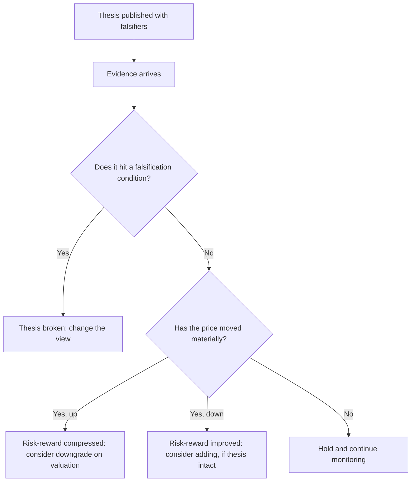

# Maintaining Conviction Through a Cycle

## The Problem / Why this matters
Most research writing addresses forming a view. Far less addresses the harder problem: holding, adjusting or abandoning that view over the following two years as evidence arrives, the price moves against you, clients question the call, and the temptation to rationalise grows. This is where most analytical value is won or lost — a correct thesis abandoned at the point of maximum discomfort produces the same outcome as a wrong one, and a wrong thesis defended indefinitely produces worse.

## Core Idea
Distinguish, continuously and explicitly, between **the thesis being wrong** and **the thesis being early** — because they demand opposite responses, and the evidence that separates them is the pre-committed falsification conditions, not the price.

## Why it works this way
Price is not evidence about a fundamental thesis in the short run; it is evidence about other participants' current opinions. A stock falling does not mean the analysis was wrong, and a stock rising does not mean it was right. Only the thesis's own testable predictions can settle that — which is why they must be specified in advance, before the price starts arguing with you.

## Full technical content

### The three distinct situations, and their different responses

| Situation | Evidence | Correct response |
|---|---|---|
| **Thesis broken** | A falsification condition has been met | Change the view promptly and say why |
| **Thesis intact, price down** | Fundamentals tracking; price fell on sentiment, flows or sector de-rating | Reaffirm; risk-reward has improved |
| **Thesis intact, price up to target** | Fundamentals tracking; the market has converged | Downgrade on valuation — this is success, not failure |

The third case is routinely mishandled. An analyst who upgraded at ₹600 with a ₹900 target, and maintains the Buy at ₹880, has stopped applying the risk-reward discipline that justified the original call. **A rating change with no change in the fundamental view is entirely legitimate** when the price has done the work — and saying so explicitly is a mark of discipline rather than inconsistency.

### The scheduled review

The counter to drift is a **review on a calendar rather than on price moves**, since price-triggered reviews systematically occur when emotion is highest. At each quarterly result, and at least annually in full:

1. **Re-read the original thesis** and the falsification conditions, before looking at anything else.
2. **Check each thesis pillar** against what has actually happened.
3. **Check each falsification condition** — met, approaching, or not.
4. **Update the model** and recompute the target.
5. **Recompute risk-reward** at the current price.
6. **Decide** — reaffirm, adjust the target, or change the rating.
7. **Record the reasoning**, so the next review has continuity.

### Distinguishing "wrong" from "early" honestly

The hardest judgement in the job, and the one where self-deception is easiest. Useful tests:

- **Have any falsification conditions been met?** If yes, it is wrong, regardless of how compelling the story still feels.
- **Is the delay explained by something specific and temporary** (a commissioning slip, a destocking cycle, a delayed regulatory decision) or by nothing identifiable? Unexplained delay is more concerning than explained delay.
- **Has the catalyst passed without the expected effect?** If the event you said would force convergence has happened and nothing changed, the market has considered your evidence and disagreed. That is meaningful information.
- **Is the bear case getting stronger?** Not the price — the bear *case*. New adverse facts differ from an unchanged situation with a lower price.
- **Would you initiate today** at the current price with what you now know? If not, the position is being held from commitment rather than conviction.

That last test is the most useful single question, because it strips out anchoring on the entry price and prior public commitment.

### Managing the model through the cycle

- **Roll forward** the valuation year as time passes — a target based on FY26 earnings needs to become an FY27-based target, and this mechanically changes the target price without any view change. State it as such rather than presenting it as a fresh view.
- **Do not quietly adjust assumptions** to preserve the target. If the forecast falls but the target does not, the multiple has been raised to compensate, which is reverse-engineering. If that happens, say so or change the target.
- **Keep the assumptions log** current, so the reason for each change is retrievable.
- **Watch for accumulated small revisions** — three quarters of "minor" cuts can be a large cumulative change that was never explicitly acknowledged. Compare the current forecast to the original one periodically, not just to last quarter's.

### Communicating through the difficult period

- **Proactive contact** when a call is going badly is far better than silence. Clients holding the position need the analyst's current view most precisely when it is uncomfortable to give.
- **Acknowledge the situation plainly** — "the stock is down 22% since our upgrade; here is what has and has not changed in the thesis."
- **Separate what was wrong from what was early**, explicitly.
- **Restate the falsification conditions** and where the situation sits against them.
- Do not become **defensive or promotional**. Analysts who argue harder as evidence weakens lose credibility that outlasts the specific call.

### Changing a view well

When the evidence requires it:
- **Do it promptly.** The cost of a delayed downgrade is borne by clients holding the position.
- **State plainly what changed** — new facts, or an acknowledgement that the original reasoning was flawed.
- **Do not pretend it was foreseen.** Rating changes framed as though always anticipated are transparent and damage credibility.
- **Give the new view fully** — new target, new thesis, new risks — rather than simply removing the rating.
- **Record the post-mortem** per the learning framework, classifying the error type.

Analysts who change views promptly and explain them honestly build more durable credibility than those whose ratings never move. The buy side notices which kind it is dealing with.

### The valuation-driven rating change

Worth stating as its own discipline, because it is the most common source of stale ratings:

**If the price approaches the target and the fundamental view is unchanged, the rating must change.** Maintaining a Buy at target implies either the target should rise (which requires a fundamental reason) or the risk-reward discipline has been abandoned. Both need to be resolved explicitly. The professional formulation: *"We retain our positive fundamental view but downgrade to Hold on valuation; risk-reward at ₹880 is 0.7:1 against 3.1:1 at initiation. We would revisit below ₹740."*

### The institutional context

Several pressures work against good conviction management, and naming them helps resist them:
- **Commitment** — a published rating carries your name.
- **Client positioning** — clients who acted on the call may not want a downgrade.
- **Corporate access** — downgrades cost management relationships.
- **Herding** — moving against consensus alone is more career-risky than being wrong with everyone.

None of these are analytical reasons, and recognising them as pressures rather than arguments is the whole defence.

## Common mistakes
- Treating **price movement as evidence** about the thesis.
- No **pre-committed falsification conditions**, so nothing can ever disprove the view.
- Reviewing on **price triggers** rather than on a schedule.
- Maintaining a Buy after the price has reached the target — **abandoning risk-reward discipline**.
- Quietly raising the multiple to preserve a target when the forecast falls.
- Missing **cumulative** revision drift by only comparing to last quarter.
- Going quiet when a call is going badly.
- Framing a downgrade as though it had always been anticipated.

## Interview angle
"Your Buy is down 30% and the client is asking why. What do you say?" Structure the answer around the distinction that matters: go through the thesis pillars one by one and state which are tracking and which are not; check the pre-committed falsification conditions and say explicitly whether any have been met; then separate *wrong* from *early* — if the fundamentals are tracking and the decline is sentiment or sector de-rating, risk-reward has improved and you reaffirm with reasoning; if a falsification condition has been met, you change the view now rather than defending it, and say plainly what you got wrong. Add the test that keeps the answer honest: would you initiate today at this price knowing what you now know? Volunteering that test, and the willingness to be publicly wrong promptly, is what a client actually values.
