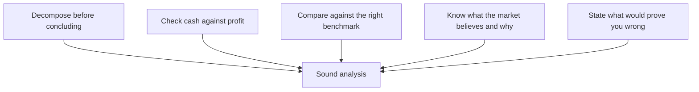

# Synthesis — What Actually Matters

## The Problem / Why this matters
The preceding ninety chapters cover a great deal: process, sector frameworks, modelling, valuation methods, accounting quality, communication, regulation, and worked cases. Volume creates its own difficulty — under time pressure, in an interview or facing a real decision, an analyst needs to know which of it carries the most weight. This chapter compresses the material into the principles that do the most work, and the errors that cause the most damage.

## Core Idea
Most of equity research reduces to a small number of repeated moves: **decompose before concluding, check cash against profit, compare against the right benchmark, know what the market believes and why, and be explicit about what would prove you wrong.**

## Why it works this way
The specific frameworks differ by sector and situation, but the underlying analytical habits are the same everywhere. An analyst who has internalised the habits can construct a reasonable approach to an unfamiliar situation; one who has memorised frameworks without the habits cannot.

## Full technical content

### The five habits that generalise

**1. Decompose before concluding.**
Almost every analytical error in this book's common-mistakes sections comes from acting on an aggregate. Revenue growth means nothing until split into volume and price. AUM growth means nothing until split into flows and market returns. Retail growth means nothing until split into SSSG and new stores. Margin change means nothing until split into mix, pricing and cost. A multiple gap means nothing until decomposed into growth, returns and risk. **When given an aggregate, the first move is always to break it apart.**

**2. Check cash against profit.**
Cumulative CFO versus cumulative PAT over three to five years is the single most efficient integrity test available. It catches aggressive revenue recognition, working-capital deterioration, capitalisation games and outright fabrication — often before anything else does. It takes minutes and it is skipped constantly.

**3. Compare against the right benchmark.**
A number in isolation is uninterpretable. Every metric needs a comparison: the company's own history, the relevant peer set, and where applicable the theoretical benchmark (RoCE against cost of capital, terminal growth against nominal GDP, implied market share against the addressable market). Choosing the *right* benchmark — regional not national for cement, sector-neutral not headline for cross-market comparison, mid-cycle not current for cyclicals — is where most of the judgement lies.

**4. Know what the market believes, and why.**
A view is only differentiated relative to something. Before disagreeing, establish what consensus assumes and the reasons it holds that view — because those reasons are usually not stupid. The most productive form is decomposing the current price into its implied assumptions (reverse-DCF) and identifying which specific one fails a plausibility test.

**5. State what would prove you wrong.**
Pre-committed falsification conditions do more work than any other single discipline: they prevent confirmation bias during research, force honesty during conviction management, and make post-mortems meaningful. An analyst who cannot say what would change their mind does not have a thesis; they have a position.

### The errors that cause the most damage

Ranked by frequency and cost across the preceding chapters:

| Error | Where it appears |
|---|---|
| **Applying P/E to peak-cycle earnings** | Metals, cement, autos, chemicals, shipping, textiles — the single most repeated trap |
| **Governance failure under-weighted** | The dominant cause of permanent capital loss in Indian equities |
| **Profit without cash accepted** | Forensic, working capital, EPC, real estate |
| **No catalyst** | Longs, shorts, thematic — being right eventually is not investable |
| **Bear case flexing earnings but not the multiple** | Understates real downside systematically |
| **Ignoring liquidity and sizing** | Correct calls that cannot be implemented |
| **Terminal assumptions that break economics** | g above nominal GDP; capex below depreciation; margins above any precedent |
| **Reverse-engineering to a predetermined answer** | The most damaging, because it invalidates everything else |

### The sector-specific facts worth carrying

If only one thing per sector were retained:

| Sector | The one thing |
|---|---|
| Banks | Slippages, not GNPA — and check whether GNPA fell on write-offs |
| NBFC | ALM mismatch converts a liquidity event into a solvency crisis |
| IT services | Constant-currency growth; headcount adds turn before revenue |
| Pharma | Maintain a plant-to-revenue map for regulatory outcomes |
| FMCG | Volume versus value growth; A&P cuts are borrowed margin |
| Autos | Dispatches versus retails reveals dealer inventory |
| Cement | Markets are regional; utilisation drives realisation |
| Metals | Integration and cost-curve position, not current margin |
| Chemicals | RoCE stability through a cycle settles speciality vs commodity |
| Telecom | EBITDA and free cash flow diverge for years |
| Utilities | Growth comes from approved capex, not demand |
| Insurance (life) | Persistency validates whether booked value is real |
| Real estate | Collections, not pre-sales; net debt is the survival metric |
| Retail | SSSG versus new-store contribution |
| Capital goods | Order book *quality*; unbilled revenue as early warning |
| Hotels/aviation | Perishable inventory; CASK ex-fuel is the real efficiency measure |
| Asset managers | Separate net flows from market beta |
| Platforms | Multi-homing determines whether the network effect is real |
| Shipping | The global orderbook makes future supply knowable |
| PSU | Government is both controlling shareholder and customer |

### What a complete recommendation contains

Regardless of sector or direction:

1. **Rating, target, current price, upside** — in the first line
2. **The differentiated insight**, quantified against consensus
3. **Two or three evidenced pillars**
4. **Valuation** with method, key assumptions, and a range
5. **The bear case value**, and the resulting risk-reward
6. **A dated catalyst**
7. **Quantified risks**
8. **Falsification conditions**
9. **Monitorables**
10. **Position size and the liquidity constraint**

Anything missing is a specific, identifiable weakness — which is a useful checklist both for writing and for evaluating someone else's work.

### The judgement that cannot be systematised

Some things this book can frame but not resolve:
- Whether a moat is genuinely durable or merely has been so far.
- Whether a management team's explanation is honest or plausible-sounding.
- Whether a decline is cyclical or structural — the distinction on which the largest sums are won and lost.
- Whether you are early or wrong.
- How much weight to give a strong qualitative signal that the numbers do not yet show.

These improve with cycles observed and post-mortems conducted, which is why research is an apprenticeship. The frameworks reduce the space in which judgement operates; they do not eliminate it.

### The intellectual posture that matters most

Beyond technique: **hold views strongly enough to act on and loosely enough to change.** The two failure modes are symmetrical — an analyst with no conviction produces nothing usable, and one who cannot revise destroys capital defending a position. The mechanism that makes both avoidable is the same one that appears throughout these chapters: state in advance what would change your mind, and then actually watch for it.

## Common mistakes
- Learning frameworks without the underlying habits, so unfamiliar situations cannot be handled.
- Producing comprehensive analysis with **no view**.
- Holding a view with **no falsification condition**.
- Treating the checklist as the work rather than as a check on it.
- Assuming judgement can be replaced by process.

## Interview angle
"What makes a good analyst?" Answer with habits rather than credentials: someone who decomposes aggregates before drawing conclusions; who checks cash against profit as a matter of routine; who compares every number against the right benchmark rather than an available one; who establishes what the market believes and why before disagreeing with it; and who states in advance what would prove them wrong — and then changes their view when it happens. Add the posture that ties it together: conviction strong enough to act on, held loosely enough to revise. That combination is rarer than technical ability and is what the job actually rewards.
