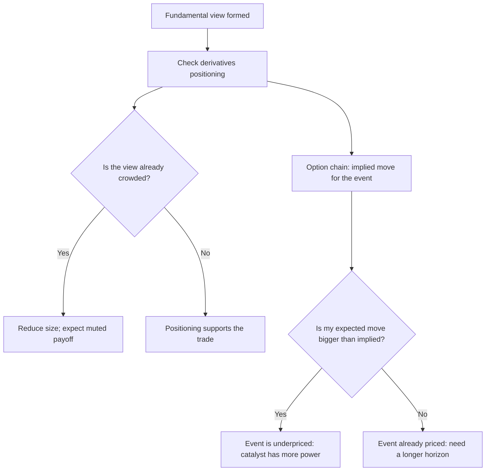

# Derivatives Data for the Fundamental Analyst

## The Problem / Why this matters
A fundamental analyst who ignores the F&O segment is discarding the single richest public dataset on how other participants are positioned in the stocks they cover. NSE publishes daily open interest, futures basis, option chains, and category-wise participant data — all free, all specific to individual names. Used carelessly this becomes noise-chasing; used properly it answers questions fundamental data cannot: how crowded is my view, who is on the other side, and what is the market pricing for the upcoming event?

## Core Idea
Derivatives data does not tell you what a company is worth. It tells you **what positioning and expectations already exist around it** — which determines how much a correct fundamental view will actually pay, and when.

## Why it works this way
Price reflects the marginal buyer; positioning reflects the accumulated stock of commitments. A stock where every leveraged participant is already long has no marginal buyer left for good news, and a forced unwind waiting for bad news. That asymmetry is invisible in the financials and visible in open interest.

## Full technical content

### The four datasets worth checking

| Dataset | Published | What it answers |
|---|---|---|
| **Stock futures open interest** | Daily, NSE | How much leveraged positioning exists, and which direction |
| **Futures basis (premium/discount to spot)** | Continuous | Cost of carry, and whether longs or shorts are paying to hold |
| **Option chain (strike-wise OI, IV)** | Continuous | Expected move, skew, and where participants expect resistance |
| **Participant-wise data (FII/DII/pro/client)** | Daily, NSE | Which category is building or unwinding positions |

### Open interest and price, read together

The classic four-quadrant reading, which is standard but frequently misapplied:

| Price | Open interest | Conventional reading |
|---|---|---|
| Up | Up | Long build-up — new money supporting the move |
| Up | Down | Short covering — the move is being driven by exits, not conviction |
| Down | Up | Short build-up — new bearish positioning |
| Down | Down | Long unwinding — holders exiting, not new shorts arriving |

**The critical caveat:** these are inferences, not observations. Open interest is a net figure and does not identify who is on which side. A rising OI with rising price is *consistent with* long build-up but also with hedged positions, arbitrage, or a cash-futures spread being put on. Treat the reading as a hypothesis to be corroborated by participant-wise data, not a conclusion.

### The futures basis

Stock futures trade at a premium to spot in normal conditions, reflecting the cost of carry (financing cost minus expected dividend). Departures are informative:

- **Unusually high premium** — strong demand for leveraged long exposure; carrying cost is elevated for longs.
- **Discount to spot (backwardation)** — unusual in single stocks and typically indicates either heavy short demand or an imminent dividend/corporate action. **Always check the corporate-action calendar before reading a discount as a sentiment signal**, since an ex-dividend adjustment mechanically produces one.
- **Basis collapsing into expiry** is arithmetic, not information.

### The option chain and the implied move

The most directly useful application for a fundamental analyst working around a catalyst.

**Extracting the implied move for an event:** take the at-the-money straddle price (ATM call + ATM put) for the expiry that captures the event, divided by the spot price. That approximates the move the market is pricing, in either direction, over that period.

The analytical use: **compare it to your own expected move.**
- If you expect a 14% move on the result and the straddle prices 6%, the event is underpriced relative to your view — your catalyst has more power than the market assumes, which strengthens the case.
- If the straddle prices 15% and you expect 8%, the event is already anticipated. A correct fundamental view may produce a disappointing price response, because expectations have run ahead of it.

This is the same "what does the price imply" discipline used in the reverse-DCF, applied to a short-horizon event rather than to long-run assumptions.

### Skew and strike-wise open interest

- **Put skew** (puts trading at higher implied volatility than equidistant calls) indicates demand for downside protection — normal in equities, but a sharp steepening is a signal.
- **Large call OI at a strike** is conventionally read as "resistance." Treat this loosely: the OI concentration can reflect covered-call writing by holders rather than a directional view, and the causation is weaker than practitioners often assert.
- **Sudden IV spikes without news** are worth investigating, since they occasionally precede information becoming public.

### Participant-wise data

NSE publishes daily category-wise (FII, DII, proprietary, client) positioning in index and stock derivatives. For the equity analyst:
- **FII index-futures net position** is a widely followed proxy for foreign directional positioning.
- Extremes are more informative than levels — positioning at multi-year extremes has more mean-reversion content than positioning in a normal range.
- **The stock-specific data is limited** relative to index data, so this is more useful for market context than for single-name work.

### Where this genuinely helps a fundamental analyst

1. **Crowding check before publishing a call.** If your differentiated long is already the most crowded long in the sector, the payoff to being right is compressed and the downside to being wrong is amplified by a disorderly unwind.
2. **Sizing a short.** The chapter on shorts flagged borrow cost, squeeze risk and days-to-cover — all of which come from this data.
3. **Catalyst calibration.** The implied move tells you whether your catalyst is a surprise or an expectation.
4. **Expiry-week distortions.** Recognising that a move is expiry-driven prevents mistaking mechanical flow for a fundamental re-rating — an easy and common error when writing an intra-month update.
5. **Detecting information you do not have.** Unusual activity ahead of an event is not actionable on its own, but it is a prompt to check whether you have missed something.

### Where it does not help

- It says nothing about **value**. Positioning is not a valuation input, and constructing a fundamental thesis from OI patterns is a category error.
- **Single-day readings are noise.** Only sustained changes over multiple sessions carry content.
- The F&O universe is limited to eligible stocks, so **most small and mid caps have no derivatives data at all** — precisely the segment where crowding information would be most valuable.

## Common mistakes
- Treating the OI/price quadrant reading as observation rather than inference.
- Reading a futures **discount** as bearish sentiment when it is an ex-dividend adjustment.
- Building a fundamental thesis on positioning data.
- Reacting to **single-day** changes.
- Interpreting call OI as resistance without considering covered-call writing.
- Attributing expiry-week price action to fundamentals.
- Ignoring the implied move and being surprised when a correct call produces no price response.

## Interview angle
"You're bullish and the stock reports next week. What does the options market tell you?" Answer with the implied move: take the ATM straddle for the expiry covering the result, express it as a percentage of spot, and compare it to the move your own forecast implies. If your expected move is materially larger, the event is underpriced and the catalyst has genuine power; if the straddle already prices more than you expect, a correct forecast may still produce a flat or negative reaction because expectations exceed it. Then add the crowding check — futures OI build-up and skew tell you whether your view is already consensus among leveraged participants, which affects both sizing and the payoff. Close by being explicit about the limit: none of this informs what the business is worth, only what is already priced and positioned.
