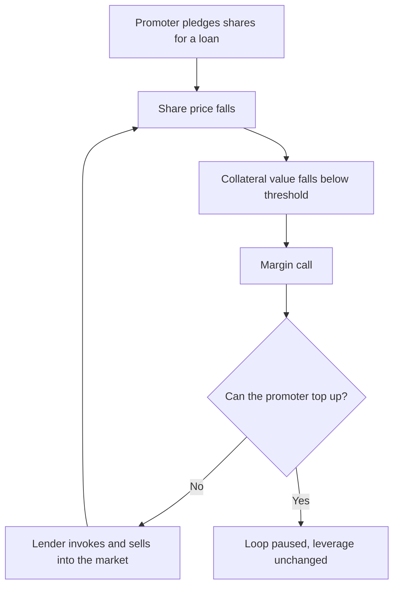

# Shareholding Patterns, Pledging and Block Deals

## The Problem / Why this matters
The quarterly shareholding pattern is one of the highest-information, lowest-effort disclosures available in Indian markets, and it is routinely skimmed rather than analysed. It reveals who owns the company, whether promoters have pledged their stake to lenders, whether institutional conviction is building or eroding, and whether the float is large enough to support a position. Promoter pledging in particular has preceded a meaningful share of India's most severe permanent capital losses.

## Core Idea
Ownership structure is a **risk disclosure**, not administrative trivia: pledged promoter shares create a mechanical link between the share price and control of the company, and float concentration determines whether the stock can be traded at all.

## Why it works this way
When a promoter pledges shares against a loan, a falling share price triggers margin calls. If the promoter cannot meet them, the lender sells the pledged shares into the open market — which pushes the price lower, triggering further calls. The feedback loop is self-reinforcing and can destroy a company's equity value in weeks regardless of operating performance.

## Full technical content

### What the shareholding pattern contains

Filed quarterly with the exchanges under SEBI's LODR requirements:

| Category | What to read from it |
|---|---|
| **Promoter and promoter group** | Level, direction of change, and pledged proportion |
| **FII/FPI** | Foreign institutional conviction; also headroom against the foreign limit |
| **Domestic MFs** | Which funds hold it; concentration in a few schemes is a liquidity risk |
| **Insurance and banks** | Typically long-horizon, low-turnover holders |
| **Public / retail** | High retail share often means a wider, less informed holder base |
| **Free float** | Determines index weight, liquidity and tradeable size |

### Reading promoter holding changes

- **Promoter buying** is generally the most credible bullish insider signal available, because it is a costly, undiversifiable, publicly disclosed commitment. It is not decisive — promoters can be wrong about their own companies — but the incentive alignment is real.
- **Promoter selling** requires an explanation. Legitimate reasons exist (estate planning, diversification, funding another venture, meeting minimum-public-shareholding requirements). The absence of an explanation is itself informative.
- **Creeping acquisition** — promoters may acquire up to a specified annual limit without triggering an open offer. Steady quarterly increases suggest accumulation.
- **Watch for reclassification** — a promoter reclassified as a public shareholder changes the reported promoter holding without any actual sale, and the disclosure needs reading rather than the headline number.

### Pledging — the analysis that matters

Disclosed as a percentage of promoter holding. The essential points:

**Compute both ratios.** Pledge disclosed as a percentage of *promoter* holding understates the systemic issue; also express it as a **percentage of total shares outstanding**, because that is the quantum that could hit the market.

*Illustration:* promoters hold 40% and 60% of that is pledged. Headline reads "60% pledged" — but the exposure is 0.40 × 0.60 = **24% of the company's equity** potentially available for forced sale, against a free float of 60%. That is a 40%-of-float supply overhang.

**Escalation markers, in order of seriousness:**
1. Pledge percentage **rising** quarter on quarter.
2. Pledging **while the share price falls** — indicates top-ups, meaning the promoter is already under pressure.
3. Pledging against **acquisition of further shares**, which is leverage on leverage.
4. **Invocation** disclosed — the lender has already sold; the loop has started.
5. Pledged shares in a **group holding company** rather than the operating company, which obscures the exposure and requires reading the group structure.

**The correct analytical treatment:** high pledging is a **risk multiplier applied to everything else**, not a standalone negative. It converts an ordinary earnings disappointment into a potential loss of control, and it justifies both a valuation discount and a smaller position size. Where pledging is high and rising, the appropriate response is frequently to decline coverage-driven recommendation altogether rather than to model a discount.

### Institutional ownership as a signal

- **Rising domestic MF holding** across multiple unrelated fund houses is a stronger signal than a single fund building a position, which may reflect one manager's view or a fund's own inflows.
- **FII holding near the permitted limit** matters for MSCI weighting (see the index chapter) and can cap further foreign buying.
- **Very low institutional holding** in a company with a long listing history is worth investigating — institutions have usually looked and declined, and understanding why is cheap research.
- **Concentration risk**: if two schemes hold 9% of a mid cap, redemption pressure at those schemes is a supply risk unrelated to the company.

### Block and bulk deals

Exchanges publish bulk deals (above a volume threshold) and block deals (executed in the designated window) daily, with counterparty names.

**Analytical uses:**
- **Explaining unexplained moves.** A sharp price move with a large block print is a supply/demand event, not a re-rating — the same discipline as the index chapter.
- **Identifying an overhang.** A private-equity holder selling in tranches creates a known future supply that caps the stock until it clears. Sizing the residual stake tells you how much overhang remains.
- **Reading the counterparty.** A long-horizon institution buying a block differs in implication from a proprietary desk warehousing it.
- **Post-IPO lock-in expiry** is a scheduled, forecastable overhang of exactly this kind, and should be on the calendar for any recently listed company.

### Building the ownership picture into the recommendation

A complete treatment in a research note covers:
1. Promoter holding, direction, and any pledge — with the pledge expressed against total equity.
2. Free float in rupee terms, and what position size it supports.
3. Institutional composition and any concentration risk.
4. Known overhangs — PE stakes, lock-in expiries, minimum-public-shareholding compliance deadlines.
5. Foreign headroom, where relevant to index weight.

## Common mistakes
- Reading pledging **only** as a percentage of promoter holding, understating the float impact.
- Treating pledging as a discrete negative rather than a **risk multiplier** on every other risk.
- Missing that promoter holding fell because of **reclassification** rather than a sale.
- Reading a single fund's purchase as institutional endorsement.
- Ignoring **lock-in expiry** calendars for recently listed companies.
- Not checking block-deal data before attributing a price move to fundamentals.
- Overlooking scheme-level **concentration** as a redemption-driven supply risk.
- Ignoring the free-float constraint when recommending a position size.

## Interview angle
"Promoters have pledged 65% of their holding. How does that change your view?" Do the arithmetic out loud first — 65% of a 45% stake is roughly 29% of total equity potentially subject to forced sale against a 55% float, so more than half the float is a contingent overhang. Then make the structural point: pledging creates a reflexive loop where a falling price triggers margin calls, invocation and further selling, so it converts an ordinary earnings miss into a potential change of control. That means it is not a fixed discount to apply but a multiplier on every other risk in the name, and it argues for materially smaller sizing or for not recommending the stock at all. Finish with the escalation markers you would monitor: pledge rising quarter on quarter, top-ups during price declines, and any disclosed invocation.
