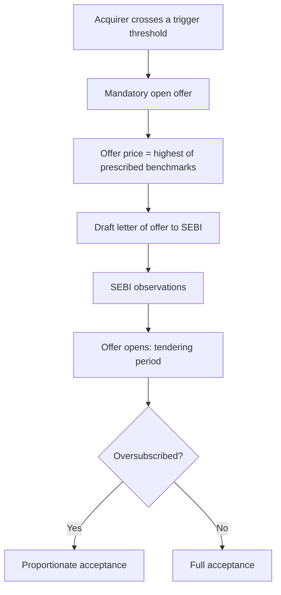

# The Takeover Code, Open Offers and Control Transactions

## The Problem / Why this matters
Control transactions — acquisitions, open offers, delistings, promoter changes — produce some of the largest and most analytically tractable price moves in equity markets, because the outcomes are governed by a published rulebook rather than by opinion. An analyst who knows the SEBI Takeover Regulations can compute the mandatory offer price, identify when a trigger is imminent, and value a stock against a floor the regulations create. One who does not will be repeatedly surprised by moves that were entirely derivable.

## Core Idea
In a control transaction, **the rules set the price floor and the timetable**. Most of the analysis is applying a known formula and a known calendar, and the judgement is concentrated in a small number of genuinely uncertain points: whether a competing bid emerges, and whether the acquirer will pay above the mandatory minimum.

## Why it works this way
The regulations exist to protect minority shareholders from a change of control happening over their heads. The mechanism is to force the acquirer to offer public shareholders an exit at a price benchmarked to what the acquirer itself paid — which mechanically creates a computable floor.

## Full technical content

### The triggers

Under the SEBI (Substantial Acquisition of Shares and Takeovers) Regulations, an open offer is triggered by:

| Trigger | Nature |
|---|---|
| Crossing the **initial threshold** of voting rights | Quantitative |
| **Creeping acquisition** beyond the permitted annual limit by an existing holder above the threshold | Quantitative |
| Acquisition of **control**, regardless of shareholding | Qualitative — the important one |

**The control trigger is where the analysis lies.** Control is defined substantively — the right to appoint a majority of directors, or to control management or policy decisions, whether directly or indirectly and by any means, including through shareholder agreements. A transaction can therefore trigger an offer at a small shareholding if the agreements confer control, and disputes over whether specific rights constitute control have been a recurring source of litigation. When reading an acquisition announcement, **read the governance rights, not just the percentage.**

### Computing the offer price

The regulations prescribe the offer price as the **highest** of several benchmarks, which typically include:

- The **highest price paid by the acquirer** for shares of the target in a specified look-back period;
- The **negotiated price** under the agreement triggering the offer;
- The **volume-weighted average price** paid by the acquirer over a preceding period;
- The **60-day volume-weighted average market price**, where the shares are frequently traded.

Additional rules apply to infrequently traded shares, where a valuation-based floor substitutes for the market benchmark, and indirect acquisitions carry their own computation.

**The analytical consequence:** once a deal is announced with a disclosed acquisition price, the open-offer floor is largely determinable. If the stock trades below that floor, the gap is the market's assessment of completion risk plus the time value of waiting — which is a quantifiable, testable proposition rather than a matter of sentiment.

### The exemptions worth knowing

Several acquisitions are exempt from the open-offer obligation, including certain intra-promoter transfers, acquisitions under a scheme of arrangement approved by a court or tribunal, and acquisitions pursuant to a resolution plan under the insolvency framework. **The insolvency exemption matters commercially**: a resolution applicant can acquire control of a listed company without an open offer, which removes a cost that would otherwise be borne and changes the economics for minority holders.

### Delisting

A distinct regime with different mechanics, and one where the analytical structure is unusual:

- The promoter seeks to acquire all public shares and remove the company from the exchange.
- A **floor price** is computed under the regulations, but the discovered price is determined through a **reverse book-building** process in which public shareholders tender at prices they choose.
- The offer succeeds only if the specified threshold of shares is tendered and the promoter accepts the discovered price.

**Why this creates unusual dynamics:** shareholders collectively have bargaining power, since the promoter needs a high acceptance level. Institutional holders frequently tender at prices well above the floor. The result is that delisting candidates can trade above any conventional fundamental valuation, purely on the option value of a successful reverse book-build — and analysts who value such a stock on a DCF while ignoring the delisting mechanics will produce a target that has nothing to do with how the situation will resolve.

A **failed delisting** typically produces a sharp reversal, since the option value evaporates.

### Minimum public shareholding

Listed companies must maintain a specified minimum public shareholding. Where promoter holding exceeds the permitted level — commonly after a takeover, or in some PSU cases — the promoter must dilute within a prescribed timeline through mechanisms such as an offer for sale or a qualified institutional placement.

**This is a dated, disclosed, forecastable supply overhang**, and it belongs on the monitorable list for any company where promoter holding sits above the threshold. It typically caps the stock until resolved.

### The analyst's checklist in a control situation

1. **What triggered the obligation** — threshold crossing or acquisition of control?
2. **Compute the floor** from the disclosed benchmarks.
3. **Where does the market price sit** relative to the floor, and what does the gap imply about perceived completion risk?
4. **Acceptance ratio** — if the offer is for a partial stake and is oversubscribed, acceptance is proportionate, so the blended outcome for a tendering shareholder is (accepted portion at offer price) plus (residual at the post-offer market price), which is frequently much lower. **Failing to model the residual is the single most common error in evaluating an open offer.**
5. **Competing offer** possibility, which can raise the price.
6. **Conditions and approvals** — competition authority, sectoral regulator, lender consents.
7. **What the company is worth to the acquirer** versus standalone, which sets the realistic ceiling.

### Worked illustration of the acceptance-ratio point

An open offer is made for 26% of a company at ₹480 against a market price of ₹430. A naive reading is a 12% gain. But if the offer is oversubscribed threefold, only about a third of tendered shares are accepted. The blended outcome is roughly one-third at ₹480 and two-thirds at whatever the stock trades at after the offer closes — which, with the event resolved, may be well below ₹430. **The apparent 12% arbitrage can be a loss**, and the entire analysis turns on the expected acceptance ratio and the post-offer price, neither of which appears in the headline.

## Common mistakes
- Reading only the **shareholding percentage** in an acquisition announcement and missing a control trigger created by governance rights.
- Evaluating an open offer on the **headline price** without modelling the acceptance ratio and the residual stub.
- Valuing a delisting candidate on fundamentals alone, ignoring the **reverse book-building** dynamic.
- Ignoring **minimum-public-shareholding** compliance as a dated supply overhang.
- Assuming the announced deal price sets the offer price, when the regulations prescribe the highest of several benchmarks.
- Overlooking the **insolvency exemption** and assuming an open offer must follow a change of control.
- Treating the price gap to the floor as free money rather than as a market-implied completion probability.

## Interview angle
"An open offer is announced at a 12% premium to the market price. Is that an arbitrage?" The answer that separates candidates is the acceptance ratio. Point out that a partial offer which is oversubscribed is accepted proportionately, so the realised outcome is a blend of the offer price on the accepted portion and the post-offer market price on the residual — and once the event resolves, the stub frequently trades below the pre-announcement price, which can turn the apparent premium into a loss. Then work through what you would actually check: whether the offer is for the full remaining float or a partial stake, the likely tendering behaviour of large institutional holders, the pending approvals and their timelines, whether a competing bid is plausible, and what the target is worth to the acquirer. Note also that the regulations set the floor as the highest of several prescribed benchmarks, so the floor itself is computable from the disclosures rather than a matter of estimation.
