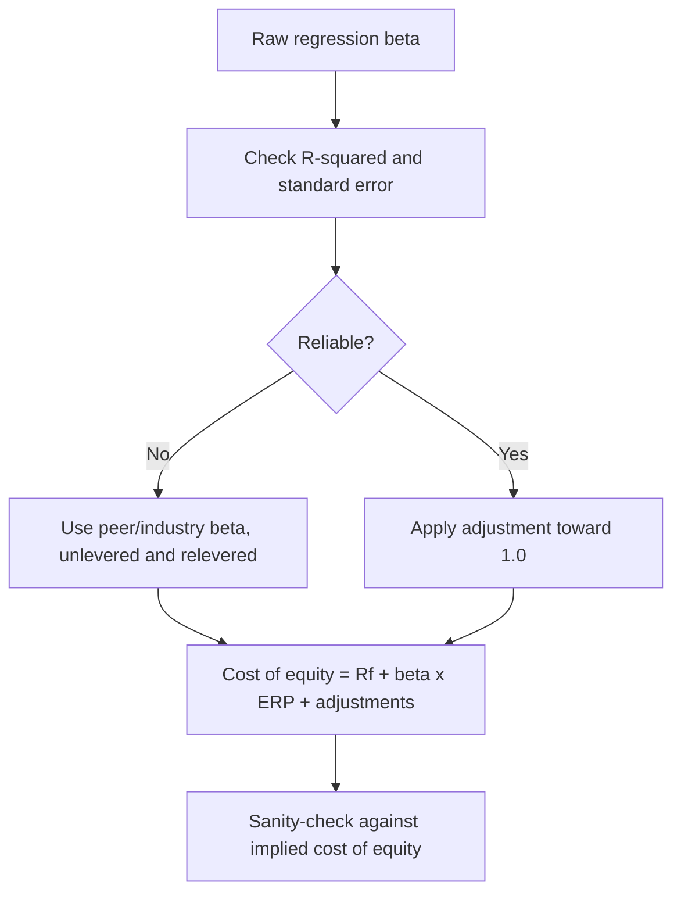

# Estimating Beta and the Cost of Equity in Practice

## The Problem / Why this matters
The cost of equity is the single most influential assumption in most DCF valuations, and it is routinely produced by pulling a beta from a data terminal, adding a remembered equity risk premium to a current bond yield, and moving on. Because terminal value dominates a DCF, a 100 basis point error in the discount rate can change the fair value by a quarter or more. Getting this input to a defensible number — and knowing how much it can be pushed around — is one of the higher-leverage skills in valuation work.

## Core Idea
Beta and the equity risk premium are **estimates with wide confidence intervals, not observations**. The professional response is not to pretend to precision but to build the estimate transparently, sanity-check it against implied evidence, and present the valuation as a range across a defensible discount-rate band.

## Why it works this way
Beta is estimated by regressing historical returns, and historical returns are noisy. Different lookback periods, return frequencies and index choices produce materially different betas for the same company, none of which is uniquely correct. The equity risk premium is unobservable in principle, since it is a forward-looking expectation.

## Full technical content

### The problems with a regression beta

Running a regression of stock returns against index returns produces a number, and the number is more fragile than its decimal places suggest:

| Choice | Effect |
|---|---|
| **Lookback period** (2y vs 5y) | Different regimes produce different betas; longer captures a full cycle but includes a company that may no longer exist in the same form |
| **Return frequency** (daily/weekly/monthly) | Daily data introduces non-synchronous-trading bias in illiquid stocks, biasing beta downward |
| **Index choice** | Beta against a broad index differs from beta against a sectoral one; use the index that represents the diversified investor's portfolio |
| **Thin trading** | Stale prices mechanically depress measured beta — the most serious problem in Indian small and mid caps |

**Always look at the R² and the standard error.** A beta of 1.15 with an R² of 0.07 and a standard error of 0.35 is not an estimate of 1.15; it is a statement that beta lies somewhere in a very wide range. Reporting it to two decimals implies a precision that the regression does not support.

### Adjusted beta

The common practitioner adjustment shrinks the raw beta toward 1.0, typically as:

**Adjusted β = (2/3) × raw β + (1/3) × 1.0**

The justification is empirical — betas tend to revert toward the market beta over time, as companies mature and diversify — and it reduces the influence of estimation noise. Most data providers apply some version of this, so **know whether the number you have pulled is raw or adjusted** before comparing it to another source.

### The bottom-up (peer) beta — usually the better method

For most single-company work in India, particularly outside large caps, a bottom-up beta is more defensible than the company's own regression:

1. **Identify a peer set** in the same business.
2. **Take each peer's levered beta.**
3. **Unlever each** to remove the effect of different capital structures:
   βu = βL / [1 + (1 − t) × D/E]
4. **Take the median** unlevered beta — the median, not the mean, because the peer set is small and one outlier distorts an average.
5. **Relever** at the target company's own capital structure:
   βL = βu × [1 + (1 − t) × D/E]

**Why this is better:** it averages away individual estimation error across the peer set, it is unaffected by the target's own thin trading, and it forces an explicit statement of the capital structure assumption. It is essential for recently listed companies with no return history, and for companies whose leverage has changed materially.

**Use the target capital structure, not necessarily the current one**, when the company is deleveraging or levering toward a stated policy — and say which you used.

### The risk-free rate

- Use the **government bond yield matched to the valuation currency** — a rupee-denominated valuation uses the Indian government bond yield, not a US Treasury yield.
- Use a **long-dated** yield (commonly the 10-year) to match the long horizon of the cash flows.
- **Consistency is what matters most**: a nominal discount rate must discount nominal cash flows. Mixing a nominal rate with real cash flows is a large and surprisingly common error.
- Avoid over-reacting to short-term yield moves. A DCF is a long-horizon exercise, and rebuilding targets on every 20bp move in the bond produces noise rather than information.

### The equity risk premium

The unobservable input. Three approaches:

| Approach | Method | Weakness |
|---|---|---|
| **Historical** | Realised equity returns minus bond returns over a long period | Depends heavily on the period; survivorship bias; assumes the past premium is the expected one |
| **Implied** | Solve for the discount rate that equates the index price to expected future cash flows | Depends entirely on the growth assumptions fed in |
| **Survey** | Ask practitioners | Anchoring and recency bias |

Practitioners commonly settle on a figure in a range for the mature market and add a **country risk premium** for India, often derived from the sovereign spread, sometimes scaled by relative equity-market volatility.

**The important disciplines:** apply the same ERP consistently across your entire coverage — an ERP that varies by stock is reverse-engineering — and disclose the figure used, so a reader can adjust for their own view.

### Additional premia, used carefully

- **Size premium** — an extra premium for small caps, based on historical small-cap outperformance. Defensible but contested, and easily abused as a lever to reach a desired answer.
- **Illiquidity premium** — for genuinely thinly traded stocks, more defensible in India than in deeper markets.
- **Company-specific risk premium** — the most abused input in valuation. If used at all, it must be tied to a stated, specific risk (single-customer concentration, litigation, governance) and quantified with reasoning rather than asserted.

**Governance risk is better handled explicitly than buried in the discount rate.** Adding 300bp for "promoter concerns" is unfalsifiable; modelling a scenario where value is extracted from minorities is testable.

### The sanity check that should always be run

Compute the **implied cost of equity**: given the current market price and a reasonable set of cash-flow forecasts, what discount rate does the market appear to be applying?

- If your build-up gives 12.5% and the implied rate is 15.5%, either the market's cash-flow expectations are far below yours, or it perceives risk you have not captured. **Both are worth understanding before publishing a Buy.**
- This is the same reverse-engineering logic used elsewhere in these chapters, applied to the discount rate rather than to growth.

### Presenting it honestly

Given the estimation uncertainty, the right presentation is **a valuation range across a discount-rate band**, not a point estimate:

| Cost of equity | 11.5% | 12.5% | 13.5% |
|---|---|---|---|
| Fair value | ₹1,105 | ₹935 | ₹810 |

This is more useful to a client than a single number, and it is honest about where the sensitivity lies. It also pre-empts the obvious challenge, which is that the target was manufactured by choosing a convenient discount rate.

## Common mistakes
- Reporting a regression beta to two decimals when the standard error is 0.3.
- Using a **daily-return beta for a thinly traded stock**, which biases it downward.
- Comparing a raw beta from one source to an adjusted beta from another.
- Mixing a **nominal discount rate with real cash flows**, or a foreign risk-free rate with rupee cash flows.
- Varying the ERP by stock, which is reverse-engineering.
- Using an unexplained **company-specific premium** as a lever to reach a predetermined value.
- Relevering at the current capital structure when the company is deliberately deleveraging.
- Never checking the **implied** cost of equity against the built-up one.
- Rebuilding targets on every small bond-yield move.

## Interview angle
"How do you estimate the cost of equity for a mid-cap company?" Lead with why the obvious method fails: a regression beta on a thinly traded mid cap is biased downward by non-synchronous trading and typically has an R² low enough that the point estimate is meaningless. So use a bottom-up beta — take a peer set, unlever each peer's beta for its capital structure, take the median rather than the mean because the sample is small, and relever at the target's own or target capital structure. Add the rupee risk-free rate matched to the cash-flow currency, a consistently applied equity risk premium including a country component, and — if justified — a stated illiquidity premium rather than a vague company-specific one. Then give the check that shows maturity: back out the cost of equity the market appears to be applying at the current price, and if it differs materially from your build-up, understand why before publishing. Present the valuation as a range across a discount-rate band, not a false point estimate.
