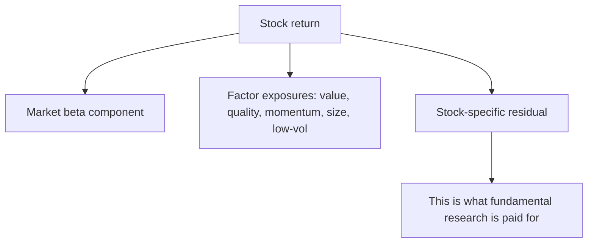

# Factor Investing and Quantitative Screens

## The Problem / Why this matters
A large share of institutional equity capital is now allocated by factor exposure rather than by stock-specific view, and factor-based smart-beta products are a growing part of the Indian market. A fundamental analyst who does not know what factors their coverage loads on cannot explain why a portfolio of individually sound picks moved together, cannot anticipate the flows that hit a stock when a factor rotates, and cannot answer a buy-side client whose risk model is expressed entirely in these terms.

## Core Idea
Factors explain a substantial part of the return of any individual stock. Knowing your coverage's factor exposures tells you **how much of a move was the stock and how much was the style** — which is essential both for attribution and for understanding what you are actually being paid for.

## Why it works this way
Stocks with similar characteristics tend to move together, because the same investors buy and sell them for the same reasons. When capital rotates from expensive growth into cheap value, every stock with a low multiple rises regardless of its individual merits. A fundamental analyst who attributes that to their thesis is misreading the evidence.

## Full technical content

### The main factors

| Factor | Typical proxies | The economic story |
|---|---|---|
| **Value** | Low P/E, P/B, EV/EBITDA; high earnings or FCF yield | Compensation for distress risk, or a behavioural over-extrapolation of bad news |
| **Quality** | High RoE/RoCE, low leverage, stable earnings, high accruals quality | Persistent profitability is under-priced relative to its durability |
| **Momentum** | Trailing 6–12 month returns, excluding the most recent month | Under-reaction to information; investor herding |
| **Size** | Small market capitalisation | Compensation for illiquidity and higher fundamental risk |
| **Low volatility** | Low realised or beta volatility | Leverage constraints push investors into high-beta stocks, over-pricing them |
| **Growth** | Historical or forecast earnings/revenue growth | Not a factor with a consistent long-run premium; more a style than a compensated exposure |

The two competing explanations — **risk compensation** versus **behavioural mispricing** — matter practically. If a factor premium is compensation for a real risk, it should persist but will hurt precisely when the risk materialises. If it is a behavioural anomaly, publication and crowding should erode it. Several factor premia have compressed since being widely documented, which is evidence for the second.

### Why factor awareness matters to a fundamental analyst

**1. Attribution honesty.** If your Buy rose 22% in a quarter when the value factor returned 15% and the stock is a high-value-loading name, most of the return was style, not your insight. The post-mortem chapter's discipline of separating skill from luck requires this decomposition.

**2. Unintended concentration.** An analyst who covers "cheap, high-dividend, low-growth" names has one bet expressed twenty times. Individually differentiated ideas that all load on the same factor are a single position for risk purposes — and this is invisible unless the exposures are checked.

**3. Explaining flows.** Factor rotations move stocks with no company-specific news at all. Recognising this prevents writing a note attributing a factor-driven move to fundamentals, which is the same error as the index-flow case.

**4. Speaking the client's language.** Buy-side risk systems are expressed in factor terms. An analyst who can say "this idea is a quality-at-a-reasonable-price exposure with low momentum loading" is more useful to a portfolio manager than one who cannot.

### Screening as idea generation, and its limits

Quantitative screens are the standard entry point to idea generation, and the standard failure mode is treating output as conclusion.

**Constructing a screen that works:**
- **Start from a hypothesis**, not from the data. "Companies where high RoCE is masked by a recent acquisition" is a screen; "low P/E" is a list.
- **Combine factors** — value alone surfaces value traps; value plus quality plus improving momentum is far more productive, and this combination is the practical form of most successful systematic strategies.
- **Screen on change, not just level.** Improving RoCE, accelerating revenue, positive estimate revisions — these surface situations at an inflection, which is where the analytical opportunity is.
- **Exclude structurally** — remove sectors where the metric is meaningless (P/B for asset-light businesses, EV/EBITDA for financials).
- **Set a liquidity floor** consistent with the position sizes actually deployable.

**Where screens systematically fail:**
- **Value traps** — a low multiple on peak-cycle earnings screens as cheap and is expensive, which is why the cyclicals chapter insists on normalised earnings.
- **Accounting distortions** — a one-off gain makes a company look profitable and screens as quality.
- **Financials and cyclicals** break most standard screen metrics.
- **Backward-looking data** — a screen sees the last reported quarter, not the change already underway.
- **Survivorship in backtests** — a screen that would have "worked" historically often did so on a universe that excludes the companies that failed.

**The correct posture:** a screen narrows 2,000 names to 30. It has done its job at that point. Everything that determines whether an idea is good happens in the fundamental work on those 30, and the screen output is never itself a recommendation.

### Where fundamental and quantitative approaches genuinely combine

- **Quality screens as a filter** applied before fundamental work, to avoid spending time on names that fail basic tests.
- **Forensic screens** — accrual ratios, cash-conversion gaps, days-receivable trends — are among the highest-yield systematic tools, and they surfaced the short case in an earlier chapter.
- **Estimate-revision momentum** as a timing overlay on a fundamental view, since revisions tend to be serially correlated.
- **Factor-neutral idea construction** — asking whether an idea's expected return survives after stripping out its factor exposures is the sharpest available test of whether the insight is genuinely stock-specific.

That last point is the most useful single discipline in this chapter: **if the idea's return is entirely explained by its factor loadings, there is no differentiated insight**, however well-researched the note is.

## Common mistakes
- Treating a screen's output as a recommendation.
- Screening on **value alone**, generating a list of value traps.
- Attributing a **factor-driven** move to a company-specific thesis.
- Holding twenty ideas that are one factor bet, without realising it.
- Screening on levels only, missing inflection points that show up in changes.
- Applying standard metrics to **financials and cyclicals** where they do not hold.
- Trusting backtests with survivorship bias.
- Never testing whether the idea's expected return survives factor neutralisation.

## Interview angle
"Your value picks all did well last quarter. Were you right?" The expected answer is a decomposition: check what the value factor itself returned over the period, and what the stocks' loadings were, because if a broad value rotation returned most of the move then the calls were style exposure rather than stock selection. Say plainly that the part worth taking credit for is the residual after factor returns are stripped out. Then extend it to a risk point — if every idea in the book loads on the same factor, that is one position expressed many times, and the diversification is illusory. Finish with how you use quantitative tools without deferring to them: screens combining value, quality and change-based metrics narrow the universe, forensic screens are especially high-yield, but a screen has done its job when it produces a shortlist and never when it produces a recommendation.
