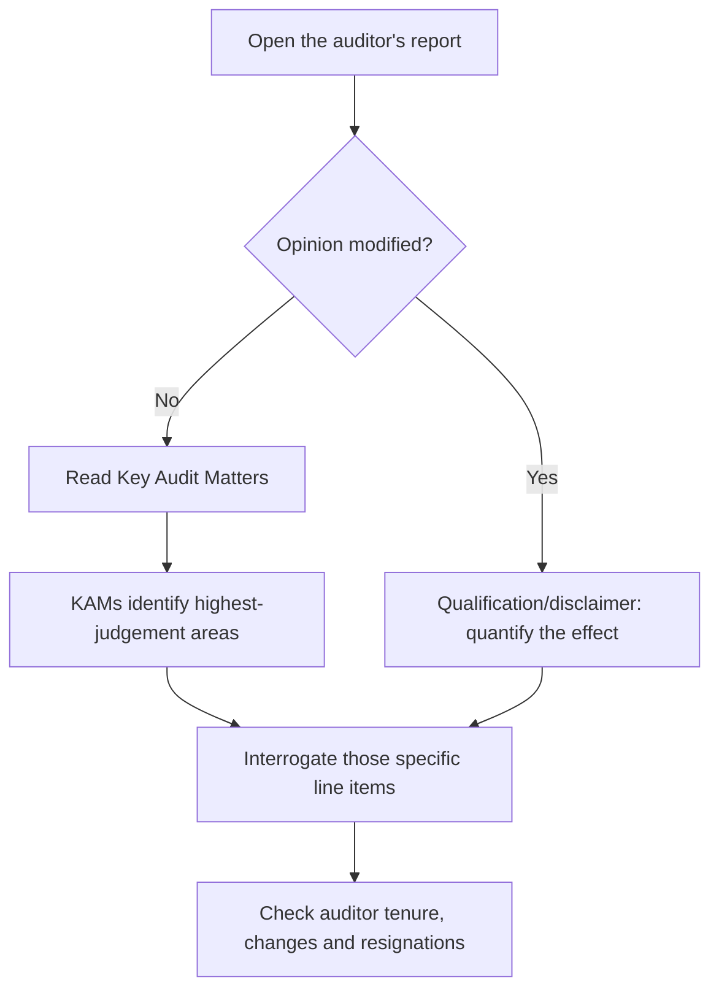

# Reading the Auditor's Report

## The Problem / Why this matters
The auditor's report is the one section of an annual report written by someone with a statutory duty to the shareholder rather than a communications objective, and it is the section most analysts skip. It is short, structured, and contains the profession's own assessment of where the financial statements are most likely to be wrong. In several prominent Indian accounting failures, the warning appeared in the audit report — in a qualification, a Key Audit Matter, or a resignation — before it appeared in the price.

## Core Idea
Read the audit report **first**, before the financials, because it tells you which numbers the auditor found hardest to verify — and those are precisely the numbers most worth interrogating.

## Why it works this way
Auditors are required to disclose the matters of most significance in the audit and to modify their opinion where they cannot obtain sufficient evidence. Both requirements force disclosure of exactly the areas where management judgement is greatest, which is where earnings management occurs.

## Full technical content

### The opinion, and its gradations

| Opinion type | Meaning | Analytical response |
|---|---|---|
| **Unmodified (clean)** | Statements give a true and fair view | Baseline; proceed to KAMs |
| **Qualified** | Except for a specified matter, the statements are fair | Quantify the matter and adjust the numbers yourself |
| **Adverse** | The statements do **not** give a true and fair view | The financials are unusable as presented |
| **Disclaimer** | The auditor could not obtain sufficient evidence to form an opinion | Severe; treat as a governance event |

**A qualification is not a technicality.** The correct response is to determine the quantum, adjust the affected line items, and recompute your metrics on the adjusted basis — then state in the note that you have done so.

**Emphasis of Matter** paragraphs do not modify the opinion but draw attention to something the auditor considers fundamental — a material uncertainty regarding going concern, a significant litigation, an unusual transaction. **A going-concern emphasis is among the most serious signals in any annual report** and should reframe the entire analysis around survival rather than valuation.

### Key Audit Matters — the highest-value section

KAMs are the matters that, in the auditor's professional judgement, were of most significance in the audit. They are a roadmap to where the estimates are.

Common KAMs and what they should prompt:

| KAM | What to interrogate |
|---|---|
| **Revenue recognition** (especially percentage-of-completion) | Compare revenue to collections; check unbilled revenue trends |
| **Expected credit loss / provisioning** | Compare coverage to peers; check Stage-2 migration |
| **Impairment of goodwill or intangibles** | Check the assumptions in the impairment test against reality |
| **Inventory valuation** | Check inventory days and any write-down history |
| **Litigation and contingent liabilities** | Read the contingent-liability note in full |
| **Related-party transactions** | Map the counterparties and the pricing basis |
| **Capitalisation of development or borrowing costs** | Compare capitalised amounts to cash outflow |

**The practical discipline:** for each KAM, find the corresponding note in the financial statements and read it fully. The KAM tells you where to look; the note tells you what is there. This single habit is a large part of what separates thorough analysis from surface reading.

**Track KAMs across years.** A KAM appearing for the first time indicates a new area of judgement or risk. A KAM disappearing may mean the issue was resolved — or that the auditor changed.

### The CARO reporting requirements

Indian audit reports include a supplementary report under the Companies (Auditor's Report) Order covering specific matters. Items worth reading rather than skipping:

- Whether **statutory dues** have been deposited on time — delays in remitting taxes or provident fund are an early liquidity signal, and one that predates most other visible stress.
- Whether **loans and advances** to related parties are on prejudicial terms.
- Whether **funds raised for a stated purpose** were used for that purpose — diversion of IPO or borrowing proceeds is disclosable here.
- Whether the company has **defaulted** in repayment to lenders.
- Whether **fraud** has been reported or noticed.
- Whether the company's **internal financial controls** are adequate and operating effectively — an adverse opinion on internal controls is a serious signal frequently buried at the end.

### Auditor changes and resignations

**An auditor resigning mid-term, before completing the audit, is one of the strongest negative signals available in public disclosure.** Auditors do not lightly give up a fee stream, and the circumstances usually involve a disagreement they were unwilling to resolve on management's terms.

What to check:
- **The stated reason.** "Pre-occupation" and similar formulations are non-explanations. Read the resignation letter filed with the exchange; SEBI requires disclosure of the reasons.
- **The timing.** A resignation shortly before results is more serious than one at the end of a term.
- **The replacement.** A large firm replaced by a much smaller one with no comparable experience is a downgrade in scrutiny, and warrants a lower weight on subsequent reported numbers.
- **Rotation versus resignation.** Statutory rotation is mandatory and routine; distinguish it from a genuine resignation before drawing conclusions.

Other auditor-related checks:
- **Audit fees relative to peers and to company size** — unusually low fees can indicate limited scope; unusually high non-audit fees can indicate an economic dependence that compromises independence.
- **Subsidiary auditors.** Where a material share of consolidated revenue or assets is audited by other auditors, the principal auditor relies on their work — and the report discloses the proportion. **A high proportion of unaudited-by-principal-auditor subsidiaries, particularly overseas ones, is a recognised structural risk** and has featured in more than one Indian accounting failure.

### Integrating this into the process

Sequence for any annual report:
1. Auditor's report — opinion, Emphasis of Matter, KAMs.
2. CARO annexure — statutory dues, defaults, fund utilisation, internal controls.
3. The specific notes flagged by the KAMs.
4. Related-party transaction note.
5. Contingent liabilities note.
6. Then the financial statements themselves.

Reading in this order means you approach the numbers already knowing where the judgement is concentrated, which changes what you notice.

## Common mistakes
- Skipping the audit report entirely.
- Noting a qualification without **quantifying and adjusting** for it.
- Ignoring an **Emphasis of Matter** because the opinion was technically unmodified.
- Reading KAMs without opening the corresponding notes.
- Not tracking KAMs **year on year** for new appearances or disappearances.
- Missing CARO disclosures on **delayed statutory dues**, an early liquidity signal.
- Accepting a non-explanation for an auditor resignation.
- Ignoring the proportion of consolidated financials audited by **other auditors**.
- Treating routine statutory rotation as a red flag.

## Interview angle
"What do you look for in an annual report that most people miss?" The auditor's report is a strong answer if you can be specific. Explain that you read it before the financials: the opinion type and any Emphasis of Matter first, since a going-concern emphasis reframes the whole analysis; then the Key Audit Matters, because those are the auditor's own statement of where management judgement is greatest, and each one sends you to a specific note to interrogate. Add the CARO items that carry early-warning content — delayed statutory dues as a liquidity signal, any adverse opinion on internal financial controls, and disclosed diversion of funds from their stated purpose. Then name the two structural checks: whether a large share of consolidated revenue is audited by other auditors rather than the principal one, and whether there has been a mid-term auditor resignation, which is among the strongest negative signals in public disclosure and where the filed reason is worth reading rather than the headline.
