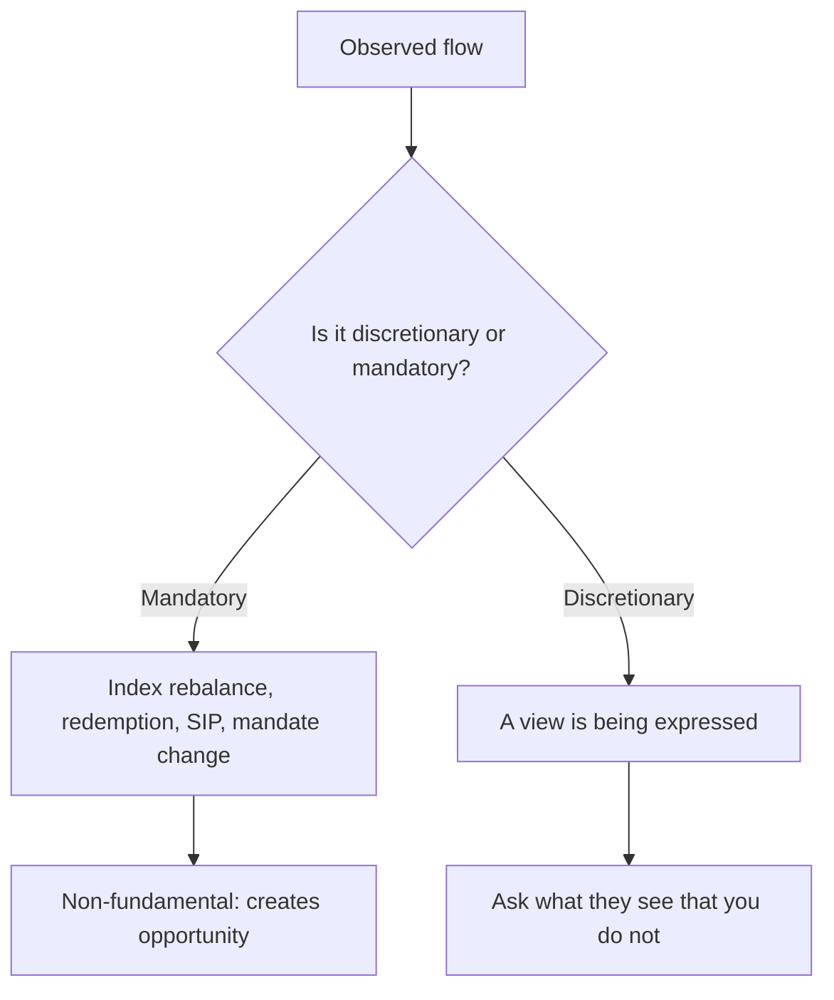

# Institutional Ownership and Flow Analysis

## The Problem / Why this matters
Indian equity market direction over any horizon shorter than a few years is substantially a flow story: foreign portfolio investors and domestic institutions are frequently on opposite sides, and the balance between them explains a large share of index moves that have no fundamental explanation. Analysts are asked about this constantly — by clients, in morning meetings, and in interviews — and the common answers ("FIIs sold, so the market fell") are circular rather than analytical.

## Core Idea
Flow data explains **who is transacting and why they must**, which is different from why a stock is worth what it is. Its analytical value lies in identifying flows that are **mandatory or structural** rather than opinion-driven, because those are predictable and non-fundamental.

## Why it works this way
A large part of institutional buying and selling is not a view on value. An index fund buys because of a weight change; an SIP-funded domestic scheme buys because money arrived; a global emerging-market fund sells India because it received redemptions or reduced its EM allocation. None of this is a judgement on any Indian company, yet all of it moves prices.

## Full technical content

### The main participant groups in India

| Group | Behaviour | Data available |
|---|---|---|
| **FPIs/FIIs** | Larger caps, sensitive to global risk appetite, currency and relative EM allocation | Daily net cash and derivatives data; monthly sectoral detail |
| **Domestic mutual funds** | Increasingly SIP-funded, therefore structurally steady inflows | Monthly AUM and scheme data; quarterly portfolio disclosures |
| **Insurance** | Long horizon, low turnover, valuation-sensitive | Slower disclosure |
| **Retail (direct)** | Higher turnover, more mid/small-cap skew, pro-cyclical | Inferred from shareholding patterns and demat data |
| **Proprietary desks** | Short-horizon, largely derivatives | Daily participant-wise F&O data |

### The structural change worth understanding

The most important development in Indian equity flows is the growth of **systematic domestic investment through SIPs**. Its significance is not the size alone but the *character* of the flow:

- It arrives **monthly regardless of market level**, which is the opposite of discretionary allocation.
- It gives domestic funds a **steady bid** that historically was absent, reducing the market's dependence on foreign flows.
- It has changed the market's response to FPI selling — episodes that would once have produced severe declines have been absorbed with much smaller moves.

**The analytical implication:** the historical rule of thumb that heavy FPI selling means a falling market is materially weaker than it was, and using historical FPI-flow relationships without accounting for the domestic offset will produce wrong conclusions. The right question is now the *net* of the two.

**The risk to monitor:** SIP flows have not been fully tested through a deep, extended drawdown. Whether the behaviour persists through one is a genuinely open question, and an honest analyst says so rather than assuming permanence.

### Reading FPI flows properly

- **Distinguish cash from derivatives.** FPI cash-market selling accompanied by index-futures buying is a hedging or positioning change, not an exit.
- **Distinguish primary from secondary.** Large FPI purchases in IPOs and QIPs are recorded in the flow data but represent primary issuance absorbing capital, not secondary buying pressure.
- **Look at sectoral allocation data**, published periodically, rather than only headline numbers — the composition tells you far more than the total.
- **Consider the driver.** FPI selling driven by a global risk-off event says nothing about Indian fundamentals; selling driven by a reduction in India's weight in a global benchmark is structural; selling driven by a domestic policy change is a view on India.

Those three drivers demand completely different responses, and collapsing them into "FIIs sold" discards all the information.

### The currency link

Foreign investors earn dollar returns, so:
- Rupee depreciation **reduces** dollar returns and can trigger further selling, which pressures the rupee — a reinforcing loop.
- Sustained FPI inflows support the rupee, and the causation runs both ways.
- For sectors, the currency effect is offsetting rather than uniform: exporters (IT services, pharma) benefit from depreciation while importers and companies with foreign-currency borrowings are hurt. **A "weak rupee is bad for equities" statement is too coarse to be useful** — the sectoral composition determines the net effect.

### Fund-level positioning work

Beyond aggregate flows, more granular work is available and under-used:

- **Quarterly mutual fund portfolio disclosures** show scheme-level holdings, from which additions, exits and position sizing changes can be derived.
- **Consensus positioning** — computing what proportion of relevant funds hold a stock, and at what weight, identifies crowded and neglected names. A stock held by almost every fund at an overweight has limited marginal domestic buying available.
- **Under-owned quality** — a company with strong fundamentals and low institutional ownership is worth understanding: either the market has missed it, or there is a reason institutions have declined that you should find before assuming the former.
- **Concentration risk** — a mid cap where a few schemes hold a large combined stake carries redemption-driven supply risk unrelated to the business.

### What flow analysis cannot do

Necessary to state, because the discipline is frequently over-claimed:

- **Flows are not predictive of returns in any reliable way.** The relationship is contemporaneous and the causation ambiguous — flows move prices, and prices attract flows.
- **Daily data is noise.** Only sustained multi-week or multi-month trends carry content.
- **It says nothing about value.** A stock can be under-owned and expensive.
- **Circular explanation is the standard failure mode.** "The market fell because FIIs sold" explains nothing, since FIIs selling and the market falling are the same event described twice.

The defensible use is narrower and more valuable: identifying **specific, dated, mandatory flows** — index rebalances, lock-in expiries, minimum-public-shareholding compliance, fund-level redemption pressure — and treating those as non-fundamental supply or demand that creates opportunity for a fundamental investor with a longer horizon.

## Common mistakes
- Explaining a market move by the flow that constituted it — pure circularity.
- Reading FPI cash selling **without** checking the derivatives position.
- Counting **primary issuance** absorption as secondary buying pressure.
- Applying historical FPI-flow relationships without adjusting for the **domestic SIP offset**.
- Assuming SIP flows are permanent, when they are untested through a deep drawdown.
- Treating a weak rupee as uniformly negative, ignoring exporter offsets.
- Reacting to **daily** flow numbers.
- Assuming low institutional ownership means an opportunity, without asking why.

## Interview angle
"FPIs have sold heavily for three months but the market is flat. What's happening?" The answer should centre on the domestic offset: SIP-funded domestic institutions now receive steady monthly inflows that must be deployed regardless of market level, so the market's dependence on foreign flows is structurally lower than the historical relationship implies, and the relevant figure is the net of the two rather than the FPI number alone. Then show the decomposition habit — check whether FPI cash selling is accompanied by index-futures buying, which would make it hedging rather than exit; check whether primary issuance is absorbing the flow; and identify the driver, since global risk-off, a benchmark weight reduction and a domestic policy reaction have completely different implications. Close with the honest limitation: flow data explains who is transacting and under what constraint, it is not predictive of returns, and the one genuinely open question is whether SIP behaviour persists through a deep drawdown, which has not yet been tested.
