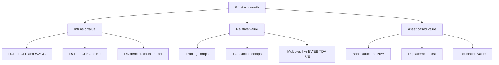
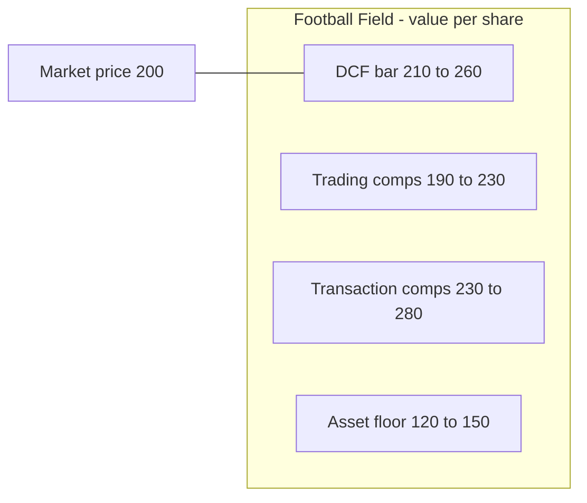

# Valuation Overview: Intrinsic, Relative & Asset-Based

> "Price is what you pay. Value is what you get." — Warren Buffett (paraphrasing Ben Graham)

This is the opening chapter of the valuation book, and it is deliberately the widest. Before you can build a discounted cash flow model line by line, before you can argue that a stock trades at 11x forward EBITDA when peers trade at 9x, before you can defend a liquidation value in a distressed credit — you need a **map of the whole territory**. This chapter is that map. It teaches the three great families of valuation, when each one earns its keep, how they are reconciled on a single page (the "football field"), the difference between price and value, and the exact vocabulary an analyst is expected to deploy without hesitation in an interview.

Master this chapter and the rest of the book becomes a series of deep dives you already know how to place. Skip it and every later technique feels like a disconnected trick.

---

## 1. The Problem — Why this matters

Imagine you are handed a company: a business that sells software, or cement, or airline seats. Someone asks the only question that ultimately matters in finance:

> **"What is it worth?"**

That question is deceptively hard, because "worth" is not a single observable number stamped on the business. A publicly listed company has a **price** — the last trade on the exchange, updated every second — but price is a poll of the crowd's opinion, not a statement of truth. A private company does not even have that; it has nothing until someone negotiates a deal. So the analyst's job is to **manufacture an estimate of value** from evidence: cash flows, comparable transactions, the replacement cost of assets, and a disciplined argument about risk and time.

Here is why getting this right is the entire game:

- **In equity research**, your buy/sell/hold rating and price target *are* a valuation claim. "I think this is worth 250 vs a price of 200, so buy" is the whole job in one sentence.
- **In investment banking (M&A)**, you advise a board on whether an offer of $40/share is fair. Your fairness opinion rests on a valuation range.
- **In private equity**, you decide the maximum you can pay and still hit a 20%+ IRR. Overpay by 15% and the deal is dead on arrival.
- **In credit / distressed**, you ask "if this blows up, what do the assets fetch, and does that cover my loan?" That is asset-based valuation deciding whether you get repaid.
- **In an interview**, the fastest way to sound like an amateur is to reach for one method as if it were *the* method. The fastest way to sound like a professional is to say: "It depends on the business and the purpose — let me triangulate."

Valuation is hard for four structural reasons, and every method in this book is an attempt to cope with one or more of them:

| Difficulty | Why it bites | Which method copes with it |
|---|---|---|
| The future is uncertain | Value depends on cash flows that have not happened yet | DCF forces you to state your assumptions explicitly |
| Money has a time value | A dollar in 2031 is worth less than a dollar today | Discounting (WACC / cost of equity) |
| Risk must be priced | Riskier cash flows deserve a higher discount rate | The discount rate is the price of risk |
| We have no crystal ball | Any single estimate is fragile | Relative valuation & triangulation cross-check the DCF |

The professional posture, drilled into you by the end of this chapter, is: **no single number, ever.** You produce a *range*, you show your *method*, and you *triangulate*.

---

## 2. Core Idea — in plain language

There are exactly **three families** of valuation. Every technique you will ever meet is a member of one of them. If you can hold this three-box mental model, you can classify any valuation you encounter for the rest of your career.

1. **Intrinsic valuation (what it's worth on its own).** Value a business by the cash it will generate over its life, discounted back to today for time and risk. The flagship is the **Discounted Cash Flow (DCF)**. Philosophy: *a business is worth the present value of the cash you can pull out of it.* It ignores what the crowd thinks; it looks only at the asset's own economics.

2. **Relative valuation (what the market pays for similar things).** Value a business by comparing it to similar businesses that already have a price — using ratios (multiples) like EV/EBITDA, P/E, EV/Sales. Philosophy: *similar assets should sell for similar prices.* If cement companies trade at 9x EBITDA and yours is comparable, yours is probably worth about 9x its EBITDA. It borrows the market's collective judgment.

3. **Asset-based valuation (what the pieces are worth).** Value a business as the sum of its assets minus its liabilities — either as a going concern (replacement cost) or in a shutdown (liquidation / net realizable value). Philosophy: *a business is worth at least what you'd pay to rebuild it, or what you'd get by selling off its parts.* It sets a floor and dominates for asset-heavy or dying businesses.

A picture of the whole map:



The final move — the one that separates a good analyst from a spreadsheet jockey — is **triangulation**: you run two or three of these, plot the ranges side by side on a **football field**, and form a judgment about the true value zone where they overlap. No method is "right." Each is a witness; you cross-examine all of them.

---

## 3. Why it works this way — first principles

### 3.1 Why intrinsic value is the philosophical anchor

Strip finance down to bedrock. Why would a rational person pay anything for a business? Only one reason: **to receive cash from it in the future** — dividends, buybacks, or the cash proceeds when they eventually sell it (and the buyer, in turn, is paying for *their* future cash). Follow that chain to the end and every claim on a business resolves into one thing: **the stream of cash it can distribute over its life.**

That single insight forces the entire DCF machinery:

- Because the cash arrives in the **future**, and a rupee today can be invested to become more than a rupee tomorrow, future cash must be **discounted** to a present value. Time value is not an accounting convention; it is the observable fact that capital earns a return.
- Because the future cash is **uncertain**, and humans (and markets) demand extra compensation to bear uncertainty, the discount rate must include a **risk premium** on top of the risk-free rate. Riskier cash → higher discount rate → lower present value. This is why a stable utility and a speculative biotech with the same expected cash flows are *not* worth the same.
- Because a business can, in principle, operate **forever**, but we cannot forecast forever, we split its life into an **explicit forecast** period (where we model line by line) and a **terminal value** (a compact formula for everything after).

So DCF is not an arbitrary technique. It is the *only* method that is true "from first principles" — it is what value *is*. Every other method is, in a deep sense, a shortcut that tries to approximate the DCF answer using market information, because the DCF's inputs (especially the far future and the discount rate) are so hard to pin down.

### 3.2 Why relative valuation exists at all

If DCF is the "true" method, why does anyone use multiples? Three hard practical reasons:

1. **The market has already done a lot of the work.** When a peer trades at 12x earnings, that price embeds thousands of investors' collective forecasts of growth and risk. A multiple is a *compressed DCF* — it packs an infinite forecast into one number. Instead of forecasting your company's next 40 years, you borrow the market's forecast for a similar company and rent it.
2. **DCF is fragile; small input changes swing the answer wildly.** Move the terminal growth rate from 2% to 3% and your value can jump 15–20%. Multiples are more robust because they are anchored to *observed transaction prices*, not to your assumptions about 2035.
3. **Speed and defensibility.** In a live deal, "peers trade at 8–10x and here's why we're at the top of the range" is a faster, more market-grounded argument than a 3,000-row model that only you understand.

The deep principle underneath relative valuation is the **law of one price**: two assets that generate the same cash flows with the same risk must sell for the same price, otherwise arbitrage closes the gap. Multiples are the practical, imperfect implementation of that law — imperfect because no two companies are truly identical, so you must adjust for differences in growth, margin, risk, and capital intensity.

### 3.3 Why asset-based value is the floor

Now imagine a business whose future cash flows are worthless — a failing retailer bleeding money. A DCF gives you a small or negative number. But the company owns real estate, inventory, and equipment. Someone could buy it, fire everyone, and sell the assets. That salvage number is the **liquidation value**, and it acts as a **floor**: a rational owner will never sell the whole business for *less* than they'd get by breaking it up (ignoring frictions). Conversely, the **replacement cost** — what it would cost a competitor to build the same asset base from scratch — acts as a *ceiling* on what a strategic buyer should rationally pay, because above it they'd rather build than buy.

Asset-based value works from first principles because ownership of a business is ultimately ownership of a **bundle of assets net of what you owe**. When the "going-concern premium" (the extra value from the assets working together to produce cash) collapses to zero or goes negative, the bundle's break-up value is all that's left, and it dominates.

### 3.4 Why we triangulate rather than pick one

Each method has a blind spot:

- DCF is only as good as your forecast — "garbage in, garbage out."
- Multiples inherit the market's mistakes — if the whole sector is in a bubble, your comps say the bubble price is "fair."
- Asset value ignores the earning power of a great business — it would badly undervalue a brand like Coca-Cola, whose worth is mostly intangible cash-generating goodwill, not factories.

Because the errors are **partly independent**, combining the methods cancels some of the noise, exactly like taking several noisy measurements of the same object and looking at where they cluster. That clustering is the football field, and the overlap is your best estimate of intrinsic worth.

---

## 4. Full technical content

### 4.1 The master vocabulary — get fluent or get filtered

Interviews test vocabulary ruthlessly, because sloppy terms reveal you've never built a model. Learn these cold.

| Term | Precise meaning |
|---|---|
| **Enterprise Value (EV)** | Value of the *entire operating business* to *all* capital providers (debt + equity), independent of capital structure. What you'd pay to own the operations free and clear. |
| **Equity Value (market cap, if listed)** | Value of the business to **shareholders only**, after lenders are paid. `Equity Value = Share price × diluted shares`. |
| **Net Debt** | `Total debt − Cash & cash equivalents`. The bridge between EV and Equity Value. |
| **FCFF (Free Cash Flow to Firm)** | Unlevered cash flow available to *all* capital providers, **before** financing. Discounted at **WACC** → gives **EV**. |
| **FCFE (Free Cash Flow to Equity)** | Levered cash flow available to *shareholders* after debt service. Discounted at **cost of equity (Ke)** → gives **Equity Value** directly. |
| **WACC** | Weighted Average Cost of Capital — the blended required return of debt and equity; the discount rate for FCFF. |
| **Cost of Equity (Ke)** | Return shareholders require; usually via CAPM: `Ke = Rf + β × ERP`. |
| **Terminal Value (TV)** | Value of all cash flows beyond the explicit forecast, as a single lump at the forecast's end. |
| **Multiple** | A ratio of value to a value-driver, e.g. `EV/EBITDA`, `P/E`. A shorthand for how much the market pays per unit of a metric. |
| **NAV (Net Asset Value)** | Assets minus liabilities; asset-based equity value. |
| **Minority interest (NCI)** | Portion of a consolidated subsidiary the parent doesn't own; **added** in the EV bridge. |
| **Going concern** | Assumption the business keeps operating indefinitely (vs. liquidation). |

**The single most important structural fact in valuation** — memorize it, draw it, love it:

```
Enterprise Value (operations, all capital)
  − Net Debt            (debt minus cash)
  − Preferred Stock
  − Minority Interest
  = Equity Value        (what common shareholders own)
  ÷ Diluted Shares
  = Value per Share
```

Or, read the other direction (the **EV build**), starting from what a screen shows you:

```
Equity Value (market cap)
  + Total Debt
  + Preferred Stock
  + Minority Interest
  − Cash & equivalents
  = Enterprise Value
```


**Why cash is subtracted:** EV represents the *operating* business. Cash is a non-operating asset — a buyer, on closing, could use the target's own cash to pay themselves back, so it reduces the net cost of the operations. Debt is added because the buyer inherits the obligation to repay it. This is the logic behind *why a metric is levered or unlevered*, and it is the number-one conceptual test in an interview.

**The matching rule (never violate it):**

| Numerator of a multiple | Denominator must be | Because |
|---|---|---|
| **EV** (all-capital) | A **pre-interest** figure: EBITDA, EBIT, Sales, unlevered FCF | These flows belong to *all* capital providers |
| **Equity value / Price** | A **post-interest** figure: Net income, EPS, Book equity, FCFE | These flows belong to *shareholders only* |

The classic trap: **EV/Net Income** or **P/EBITDA**. Both are nonsense — they mix a whole-firm numerator with an equity denominator or vice versa. If you catch yourself writing either, stop.

### 4.2 Family 1 — Intrinsic valuation (DCF)

The DCF says: value today = present value of future free cash flows + present value of terminal value.

**FCFF (unlevered) build:**

```
    EBIT
  × (1 − tax rate)        →  NOPAT  (net operating profit after tax)
  + Depreciation & Amortization   (non-cash, add back)
  − Capital Expenditure           (cash out to sustain/grow assets)
  − Increase in Net Working Capital
  = FCFF
```

**Present value:**

$$
\text{Enterprise Value} = \sum_{t=1}^{n} \frac{FCFF_t}{(1+WACC)^t} \;+\; \frac{TV_n}{(1+WACC)^n}
$$

**Terminal value — two methods:**

- **Gordon Growth (perpetuity):** $TV_n = \dfrac{FCFF_{n} \times (1+g)}{WACC - g}$, where $g$ = perpetual growth (usually ≈ long-run GDP/inflation, 2–4%). Requires $WACC > g$.
- **Exit multiple:** $TV_n = EBITDA_n \times \text{(exit EV/EBITDA multiple)}$ — anchor terminal value to where comparable businesses trade.

**WACC:**

$$
WACC = \frac{E}{E+D}\,K_e + \frac{D}{E+D}\,K_d\,(1 - t)
$$

where $K_e$ from CAPM $= R_f + \beta(ERP)$, $K_d$ = pre-tax cost of debt, $t$ = tax rate (debt is tax-shielded, hence the $(1-t)$).

**Discounting convention:** professionals often use the **mid-year convention** (cash flows arrive on average mid-year, so discount by $t-0.5$), which lifts value slightly. Default to year-end unless told otherwise, but *know the term*.

**FCFE route (less common in IB, standard for banks/financials):**

```
    Net Income
  + D&A
  − Capex
  − Increase in NWC
  − Debt repayments + New debt issued   (net borrowing)
  = FCFE   → discount at Ke → Equity Value directly (no EV bridge needed)
```

**Dividend Discount Model (DDM):** a special case of intrinsic valuation where the only cash flow to equity you count is dividends. Gordon form: $P_0 = \dfrac{D_1}{K_e - g}$. Best for stable, high-payout businesses (mature banks, utilities).

### 4.3 Family 2 — Relative valuation (multiples)

Two flavors:

| Type | What it uses | Key trait |
|---|---|---|
| **Trading comps** (comparable companies) | Multiples of *public peers trading today* | Reflects current public-market value; **no control premium** |
| **Transaction comps** (precedent transactions) | Multiples paid in *past M&A deals* | Includes a **control premium** (typically 20–40%) and synergies; tends to run higher |

**The common multiples:**

| Multiple | Formula | Best for | Watch out |
|---|---|---|---|
| **EV/EBITDA** | EV ÷ EBITDA | Capital-intensive, cross-capital-structure comparison; the IB workhorse | Ignores capex differences and D&A intensity |
| **EV/EBIT** | EV ÷ EBIT | When D&A/capital intensity differs across peers | — |
| **EV/Sales** | EV ÷ Revenue | Early-stage / unprofitable firms with no EBITDA | Ignores profitability entirely |
| **P/E** | Price ÷ EPS | Stable, profitable firms; equity investors' shorthand | Distorted by leverage & one-offs; useless if EPS < 0 |
| **P/B** | Price ÷ Book value | Banks, insurers, asset-heavy | Book value ≠ market value for intangibles |
| **PEG** | P/E ÷ growth % | Growth-adjusted P/E; ≈1 seen as "fair" | Crude; growth is estimated |

**Process for a comps valuation:**

1. **Select the peer set** — same industry, similar size, geography, growth, margins. Quality of comps > quantity.
2. **Spread the comps** — compute each peer's multiples on a clean, consistent basis (calendarize to same fiscal period; use diluted shares; strip one-offs from EBITDA/EPS).
3. **Choose a statistic** — median is usually preferred over mean (robust to outliers).
4. **Apply to your company's metric** — e.g., median EV/EBITDA × your EBITDA = implied EV → bridge to equity → per share.
5. **Position within the range** — argue *where* in the peer range your company belongs (premium if faster-growing / higher-margin; discount if riskier / smaller).

**Forward vs trailing:** LTM (last twelve months, trailing) uses actuals; NTM (next twelve months, forward) uses estimates. Markets are forward-looking, so forward multiples are usually more meaningful — but state which you're using.

### 4.4 Family 3 — Asset-based valuation

| Method | What it measures | Use case |
|---|---|---|
| **Book value / NAV** | Accounting assets − liabilities | Quick floor; but historical cost distorts |
| **Adjusted NAV** | Assets marked to *fair/market* value − liabilities | Real estate, holding companies, investment firms |
| **Replacement cost** | Cost to rebuild the asset base today | Ceiling for a "build vs buy" strategic buyer |
| **Liquidation value** | Net proceeds from selling assets piecemeal, minus wind-down costs | Distressed, insolvency, credit recovery |

Liquidation splits into **orderly** (time to find buyers, higher recoveries) and **forced/fire-sale** (immediate, deep discounts). Recovery haircuts by asset type: cash ~100%, receivables ~75–85%, inventory ~40–70%, PP&E highly variable, intangibles often ~0.

**Sum-of-the-parts (SOTP)** is a hybrid: value each division by the method that best fits it (a cash-cow division by DCF, a stake in a listed company at market, a real-estate arm by NAV), then add and subtract net debt. Essential for conglomerates.

### 4.5 When each family is appropriate — the decision grid

| Situation | Primary method | Why |
|---|---|---|
| Mature, stable cash-generative company | **DCF + trading comps** | Forecastable cash flows; good peer set exists |
| High-growth / early-stage, thin profits | **EV/Sales, DCF with scenarios** | No stable EBITDA; value is in the future |
| M&A / control acquisition | **Transaction comps + DCF (with synergies)** | Buyer pays a control premium |
| Cyclical (commodities, steel) | **EV/EBITDA mid-cycle, replacement cost** | Point-in-time earnings mislead; normalize |
| Banks / insurers | **P/E, P/B, DDM** | EV is meaningless (debt is raw material); regulated capital |
| Real estate / holding co | **NAV / adjusted NAV, SOTP** | Value = marked-to-market assets |
| Distressed / bankrupt | **Liquidation value, asset-based** | Going-concern premium has collapsed |
| Conglomerate with diverse arms | **Sum-of-the-parts** | One multiple can't capture the mix |
| Pre-revenue startup | **VC method, real options, scenario DCF** | No metrics to anchor on |

**The one-liner every analyst should own:** *"The method must match the business and the purpose."* Say that in an interview and you've signaled maturity.

### 4.6 The football field — the deliverable that ties it together

The **football field** is a horizontal bar chart. The x-axis is value (per share or equity value or EV). Each method contributes a **horizontal bar** spanning its low-to-high range. Overlaid is the **current market price** (a vertical line). The zone where the bars overlap is your defensible value range; the position of price relative to that zone drives your recommendation.



Reading it: if price (200) sits *below* the overlap of DCF and comps (roughly 210–230), the stock looks **undervalued** → lean buy. Transaction comps sit highest because they embed a control premium — relevant only if a takeover is plausible. The asset floor (120–150) tells you the downside if everything goes wrong. That single chart is the analyst's entire thesis on one page.

### 4.7 Price vs Value — the distinction the whole field rests on

| | **Price** | **Value** |
|---|---|---|
| What it is | What the market *charges* right now | What the asset is *worth* on the fundamentals |
| Source | Supply & demand, sentiment, liquidity, flows | Cash flows, growth, risk |
| Observable? | Yes, instantly (for listed) | No — must be estimated |
| Can it be "wrong"? | It's never wrong, it just *is* — but it can diverge from value | Your estimate can be wrong |

The entire active-investing industry exists on one bet: **price and value diverge, and eventually converge.** You buy when price < value ("margin of safety," Graham), and you profit as the market re-rates toward value. In an **efficient market**, price ≈ value and there's no edge; in the real, semi-efficient market, gaps appear from sentiment, forced selling, index flows, and neglect. Your DCF is a claim about *value*; the screen shows *price*; your job is to have a defensible view of the gap.

A crisp interview line: *"Price is a fact; value is an opinion. I get paid for the difference between them."*

---

## 5. Worked examples

### Example 1 — Full triangulation on "Zenith Cement Ltd"

**Setup.** Zenith is a mid-size cement maker. Given data (₹ crore):

- EBITDA (LTM) = 800
- EBIT (LTM) = 600
- Net income = 350
- Total debt = 1,500; Cash = 300 → **Net debt = 1,200**
- Diluted shares = 100 crore
- Current share price = ₹185 → **Market cap = ₹18,500 cr... wait, check units.** Shares 100 cr × ₹185 = ₹18,500 cr. Let's keep consistent: this is a large cap. (All figures ₹ crore, per-share in ₹.)

Hold on — to keep the per-share math clean, let me restate share count as **10 crore shares**, so market cap = 10 × 185 = ₹1,850 cr. That reconciles with an 800-EBITDA business. Using **10 crore diluted shares** throughout.

**Given peer data:** comparable cement companies trade at a **median EV/EBITDA of 9.0x** and **median P/E of 16x**.

**(a) Relative valuation — EV/EBITDA route:**

```
Implied EV      = 9.0 × EBITDA = 9.0 × 800 = 7,200
Less net debt   = − 1,200
Implied equity  = 6,000
÷ shares (10cr) = ₹600 per share
```

**(b) Relative valuation — P/E route (cross-check):**

```
Implied equity value = 16 × Net income = 16 × 350 = 5,600
÷ 10 cr shares       = ₹560 per share
```

The two multiples give ₹560–₹600 — a tight, mutually confirming range. Good.

**(c) Reconcile the current price into a multiple (sanity check):**

```
Current market cap = 10 × 185 = 1,850
Current EV         = 1,850 + net debt 1,200 = 3,050
Current EV/EBITDA  = 3,050 / 800 = 3.8x
Current P/E        = 1,850 / 350 = 5.3x
```

Zenith trades at **3.8x EV/EBITDA vs peers at 9.0x** — a massive discount. Either the market sees a problem (cyclical trough, governance, leverage) or the stock is cheap. This is exactly the kind of gap that triggers a "why?" — the analyst's real work.

**Takeaway:** relative valuation says fair value ≈ ₹560–600 vs a ₹185 price. Before shouting "buy," we run a DCF (Example 2) and check the asset floor.

### Example 2 — A clean 5-year DCF on Zenith

**Assumptions:**

- FCFF year 1 = ₹400 cr, growing 8% for years 1–5.
- WACC = 11%.
- Terminal growth g = 4%.
- Net debt = 1,200; shares = 10 cr (consistent with Ex.1).

**Step 1 — project FCFF:**

| Year | FCFF (₹ cr) |
|---|---|
| 1 | 400.0 |
| 2 | 432.0 |
| 3 | 466.6 |
| 4 | 503.9 |
| 5 | 544.2 |

(Each = prior × 1.08. E.g. 400×1.08 = 432.0; 432×1.08 = 466.56; ×1.08 = 503.88; ×1.08 = 544.19.)

**Step 2 — discount factors at 11%:**

| Year | Factor 1/(1.11)^t | PV of FCFF |
|---|---|---|
| 1 | 0.9009 | 360.4 |
| 2 | 0.8116 | 350.6 |
| 3 | 0.7312 | 341.2 |
| 4 | 0.6587 | 331.9 |
| 5 | 0.5935 | 323.0 |
| **Sum PV of explicit FCFF** | | **1,707.1** |

(Check year 1: 400 × 0.9009 = 360.4. Year 5: 544.19 × 0.5935 = 323.0. Sum ≈ 1,707.)

**Step 3 — terminal value (Gordon):**

```
TV(year5) = FCFF5 × (1+g) / (WACC − g)
          = 544.19 × 1.04 / (0.11 − 0.04)
          = 566.0 / 0.07
          = 8,085.5
PV of TV  = 8,085.5 × 0.5935 = 4,798.7
```

**Step 4 — enterprise value → equity → per share:**

```
Enterprise Value = 1,707.1 + 4,798.7 = 6,505.8
Less net debt    = − 1,200.0
Equity Value     = 5,305.8
÷ 10 cr shares   = ₹530.6 per share
```

**Reconciliation with Example 1:** DCF → ₹531; comps → ₹560–600. All three intrinsic/relative estimates cluster in **₹530–600**, dramatically above the ₹185 price. Note the terminal value is 4,798.7 / 6,505.8 ≈ **74% of EV** — completely normal for a growing business, and a reminder that DCF output is highly sensitive to g and WACC (a classic interview point).

**Sensitivity flavor (interview-ready):** if g drops to 3% and WACC rises to 12%, TV = 544.19×1.03/(0.12−0.03) = 560.5/0.09 = 6,228; PV(TV) at factor 1/1.12^5 = 0.5674 → 3,534; PV of explicit FCFF at 12% ≈ 1,668; EV ≈ 5,202; equity ≈ 4,002; per share ≈ **₹400**. So a plausible bear case still sits at ₹400 — well above ₹185. That robustness *is* the thesis.

### Example 3 — Asset-based floor and the EV↔Equity bridge both directions

**Liquidation floor for Zenith (orderly).** Balance-sheet book values and estimated recovery rates:

| Asset | Book (₹ cr) | Recovery % | Realizable (₹ cr) |
|---|---|---|---|
| Cash | 300 | 100% | 300 |
| Receivables | 500 | 80% | 400 |
| Inventory | 400 | 60% | 240 |
| PP&E (plants, land) | 3,000 | 55% | 1,650 |
| Intangibles/Goodwill | 600 | 0% | 0 |
| **Total assets** | 4,800 | | **2,590** |
| Less: total liabilities | | | (2,000) |
| **Liquidation equity value** | | | **590** |
| ÷ 10 cr shares | | | **₹59 / share** |

So the **asset floor ≈ ₹59/share** (orderly liquidation). This is *below* the current price of ₹185 — meaning even in a break-up, and even though the market is pessimistic, shareholders aren't pricing pure liquidation; there's going-concern value being recognized. Good: the ₹59 floor tells us the theoretical downside.

**Now verify the EV bridge works both directions** (the reconciliation interviewers love):

Forward (from operations to shareholders), using the DCF EV:
```
Enterprise Value        6,505.8
− Net debt (1,500−300)  (1,200.0)
= Equity Value          5,305.8
÷ 10 cr shares          ₹530.6
```
Reverse (from equity back to EV), to prove closure:
```
Equity Value            5,305.8
+ Total debt            1,500.0
− Cash                  (300.0)
= Enterprise Value      6,505.8   ✓ matches
```

Both directions reconcile to the penny — that closure is exactly what you're expected to demonstrate.

**The football field for Zenith (per share):**

| Method | Low | High |
|---|---|---|
| Liquidation (asset floor) | 55 | 65 |
| DCF (bear→base) | 400 | 531 |
| Trading comps (P/E→EV/EBITDA) | 560 | 600 |
| Current price | — 185 — | |

The overlap zone (DCF base + comps) is roughly **₹530–600**; price is ₹185; the floor is ₹59. The thesis writes itself: *deeply undervalued if the cash flows are real, with limited but non-trivial downside; the whole trade hinges on whether the 8% FCFF growth and 9x peer multiple are justified.*

---

## 6. How it is tested in interviews

Valuation is *the* most-tested topic in ER/IB/PE interviews. Below are the exact questions and tight model answers. Practice saying them out loud until they're reflexive.

### Q: "What are the three main ways to value a company?"

> "Intrinsic, relative, and asset-based. Intrinsic — mainly DCF — values a company on the present value of its own future cash flows. Relative uses market multiples of comparable companies or precedent transactions, so you borrow the market's pricing of similar assets. Asset-based sums the assets net of liabilities — book, replacement, or liquidation value — and typically sets a floor. In practice you triangulate across at least two and reconcile them on a football field."

### Q: "Walk me through a DCF." *(The single most common valuation question — nail the sequence.)*

> "Sure. **One**, I project unlevered free cash flow — FCFF — for an explicit period, usually five to ten years: start with EBIT, tax it to get NOPAT, add back D&A, subtract capex, and subtract the increase in net working capital. **Two**, I estimate a discount rate — WACC — as the weighted cost of debt and equity, with cost of equity from CAPM: risk-free plus beta times the equity risk premium. **Three**, I calculate a terminal value at the end of the forecast, either with Gordon growth or an exit EBITDA multiple. **Four**, I discount all the FCFFs and the terminal value back to today at WACC and sum them — that's enterprise value. **Five**, I bridge to equity: subtract net debt, preferred, and minority interest, then divide by diluted shares to get value per share. Finally I sanity-check the implied multiples and the terminal-value share of EV."

### Q: "How do you get from enterprise value to equity value?" / "Why subtract cash and add debt?"

> "Enterprise value is the value of the operating business to all capital providers. To get to equity value — what common shareholders own — I subtract net debt, preferred stock, and minority interest. I subtract cash because it's a non-operating asset: on acquiring the firm a buyer effectively gets the cash back, lowering the net cost of operations. I add debt because the buyer inherits that obligation. So Equity Value = EV − net debt − preferred − minority interest, divided by diluted shares for per-share value."

### Q: "Why would you use EV/EBITDA instead of P/E?"

> "EV/EBITDA is capital-structure-neutral — EBITDA is pre-interest and EV is pre-financing — so I can compare firms with different leverage on a like-for-like basis. It also strips out D&A, useful when peers have different depreciation policies, and it works even when net income is negative. P/E is distorted by leverage, tax, and one-off items, and breaks down entirely if earnings are negative. I'd still show P/E for equity investors and for financials, where EV is meaningless."

### Q: "Which method gives the highest valuation?"

> "There's no universal ranking, but as a rule of thumb precedent transactions tend to be highest because they embed a control premium and synergies. Trading comps reflect minority, no-control public prices. DCF depends entirely on your assumptions — it can be highest or lowest. Asset-based, especially liquidation, is usually the floor. That ordering is exactly what a football field visualizes."

### Q: "A company has negative EBITDA and no profits. How do you value it?"

> "Multiples on earnings won't work, so I'd pivot to EV/Sales or revenue-per-user type metrics against comparable early-stage peers, and lean on a scenario or probability-weighted DCF that models the path to profitability. For a true startup I might use the venture-capital method — project an exit value and discount at a high target rate — or a real-options frame. The key is to be explicit that value here is almost entirely in the terminal, growth-dependent part, so I'd show a wide range, not a point estimate."

### Q: "Two identical companies, one has more debt. Which has the higher EV? Higher equity value?"

> "Enterprise value should be roughly the same — EV reflects the operating business, which is identical, and is capital-structure-neutral in theory. But equity value is lower for the levered firm, because more of the EV is claimed by debt: Equity = EV − net debt, and net debt is higher. In practice extra leverage can nudge EV via the tax shield and higher distress risk, but the first-order answer is same EV, lower equity value for the levered one."

### Q: "What's the difference between price and value?"

> "Price is what the market quotes right now — driven by supply, demand, and sentiment. Value is what the asset is worth on its fundamentals — the present value of its cash flows. Price is observable and never 'wrong,' but it can diverge from value. Active investing is the bet that the two diverge and eventually converge; you buy when price is below your estimate of value, with a margin of safety."

### Q: "Your DCF gives 250, comps give 180. What do you do?"

> "First, I don't average blindly — I investigate the gap. I'd check whether my DCF assumptions are aggressive: is terminal growth too high, WACC too low, are margins expanding beyond what peers achieve? And I'd check the comps: is the peer set truly comparable, or is the sector temporarily depressed? Often the DCF is optimistic on the terminal value or the comps sector is mispriced. I'd present both, explain the drivers of the gap, and take a view — maybe weighting comps more if my forecast confidence is low, or defending the DCF if I have a differentiated, well-supported thesis on cash flows."

### Q: "What's the biggest weakness of a DCF?"

> "Sensitivity to assumptions, concentrated in the terminal value — which is often 60–80% of the total. Small changes in the perpetual growth rate or WACC swing the answer a lot, so 'garbage in, garbage out.' That's exactly why I cross-check with multiples, run sensitivity tables on g and WACC, and present a range rather than a single number."

**Interview meta-tip:** whenever you're unsure, retreat to the safe, senior line — *"It depends on the business and the purpose of the valuation; I'd triangulate."* It's almost never wrong and signals judgment.

---

## 7. Traps & common mistakes

| Trap | Why it's wrong | Fix |
|---|---|---|
| **Mixing EV and equity metrics** (EV/Net income, P/EBITDA) | Numerator and denominator belong to different capital claimants | Match: EV with pre-interest (EBITDA, EBIT, Sales); Price with post-interest (EPS, book equity) |
| **Discounting FCFF at cost of equity** (or FCFE at WACC) | FCFF belongs to all capital → WACC; FCFE to equity → Ke | Pair the flow with its matching rate |
| **Forgetting to subtract net debt** in the EV→equity bridge | You'd hand shareholders value that belongs to lenders | Always run the full bridge; reconcile both directions |
| **Terminal growth ≥ WACC** | Gordon formula explodes / goes negative and is nonsensical | Keep g < WACC, and g ≤ long-run GDP (~2–4%) |
| **Terminal growth above long-run GDP** | Implies the firm eventually becomes bigger than the economy | Cap g at nominal GDP growth |
| **Using basic instead of diluted shares** | Understates share count, overstates per-share value | Use diluted (treasury-stock method for options/converts) |
| **Comparing across different periods** (LTM vs NTM) | Not apples-to-apples | Calendarize all comps to the same period; state trailing vs forward |
| **Not adjusting EBITDA for one-offs** | Inflated/deflated multiple | Use "clean"/adjusted EBITDA; strip non-recurring items |
| **Treating the market price as fair value** | Circular — you'd never find mispricing | Price ≠ value; estimate value independently |
| **Single point estimate** | False precision; fragile | Always a range + football field |
| **Ignoring minority interest / preferred** in the bridge | Overstates equity value | Add both back to get EV; subtract in reverse bridge |
| **Applying transaction comps to a minority stake** | Embeds a control premium you're not paying for | Use trading comps for minority; transaction comps for control |
| **Book value = value** | Historical cost ignores intangibles and market prices | Adjust NAV to fair value; know book is a rough floor only |

---

## 8. First-principles recap

- **A business is worth the cash it will return to its owners, discounted for time and risk.** That single sentence *is* intrinsic value, and it is the philosophical anchor for everything else.
- **Every valuation method is one of three families** — intrinsic (DCF), relative (multiples), asset-based (NAV/liquidation). If you can name the family, you understand the tool.
- **Multiples are compressed DCFs** — they rent the market's forecast for a comparable asset instead of building your own; fast and market-grounded, but they inherit the market's errors.
- **Asset value is the floor; the going-concern premium is everything above it** — when a business's cash-earning power collapses, break-up value is all that remains.
- **EV and equity value are linked by a rigid bridge** — EV − net debt − preferred − minority = equity; match every multiple's numerator and denominator to the same capital claimants.
- **Price is a fact, value is an opinion, and the gap between them is where money is made** — but only if you estimate value independently of price.
- **No single number, ever** — triangulate at least two methods, show a range, plot the football field, and take a defensible view.

---

## 9. Quick-reference

| Concept | Formula / Rule |
|---|---|
| EV → Equity | `Equity = EV − Net debt − Preferred − Minority interest` |
| Equity → EV | `EV = Equity + Total debt + Preferred + Minority − Cash` |
| Net debt | `Total debt − Cash & equivalents` |
| Value per share | `Equity value ÷ diluted shares` |
| FCFF | `EBIT×(1−t) + D&A − Capex − ΔNWC` |
| FCFE | `Net income + D&A − Capex − ΔNWC + Net borrowing` |
| Enterprise Value (DCF) | `Σ FCFFₜ/(1+WACC)ᵗ + TVₙ/(1+WACC)ⁿ` |
| WACC | `(E/V)Ke + (D/V)Kd(1−t)` |
| Cost of equity (CAPM) | `Ke = Rf + β×ERP` |
| Terminal value (Gordon) | `FCFFₙ(1+g)/(WACC−g)`, need `WACC > g` |
| Terminal value (exit) | `EBITDAₙ × exit EV/EBITDA` |
| DDM (Gordon) | `P₀ = D₁/(Ke−g)` |
| EV/EBITDA | `EV ÷ EBITDA` (capital-structure neutral) |
| P/E | `Price ÷ EPS` (equity, post-interest) |
| Liquidation equity | `Σ(Asset × recovery%) − liabilities − wind-down costs` |
| Matching rule | EV ↔ pre-interest metric; Price ↔ post-interest metric |
| Method-to-situation | Match method to business + purpose; triangulate |

**One-line summary of the chapter:** *Value a company three ways — on its own cash (DCF), against its peers (multiples), and on its assets (NAV/liquidation) — reconcile them on a football field, remember that price is not value, and never trust a single number.*
