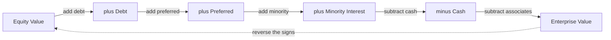
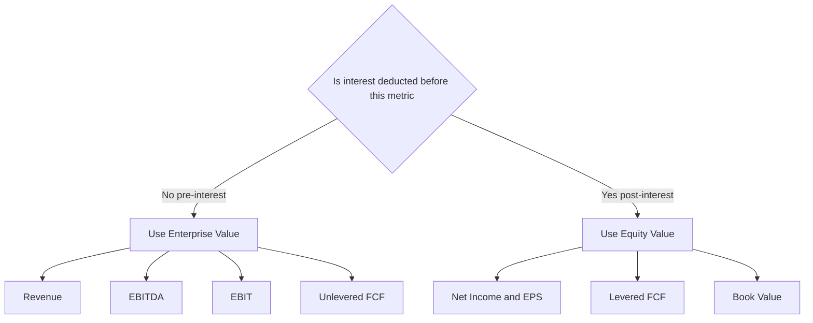
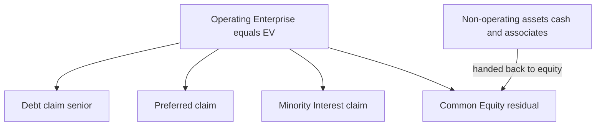

# Enterprise Value vs Equity Value — the Bridge

## The Problem / Why this matters

Ask a first-year analyst "what is a company worth?" and you will get a number. Ask a *good* analyst and the first thing they will do is ask you back: **"Worth to whom?"** Because a company is worth one thing to the people who own its shares (the equity holders) and a *different, larger* thing to *all* the people who financed it — the shareholders, the banks, the bondholders, the preferred stockholders. Confuse those two numbers and every downstream calculation you do is wrong: your multiple is wrong, your comps are apples-to-oranges, your DCF output lands in the wrong place, your football field is misdrawn, and — most painfully — you get caught in the interview.

The distinction between **Enterprise Value (EV)** and **Equity Value** is the single most tested concept in valuation interviews for a reason. It is not hard math. It is a *concept* that is deceptively easy to get muzzy about, and interviewers use it as a filter: it separates the candidate who has memorised a formula from the candidate who actually understands what a balance sheet *means*. Nearly every DCF question ends with "...and how do you get from that to the share price?" Nearly every comps question hides a trap about which multiple pairs with which value. Nearly every LBO conversation assumes you can walk the bridge in both directions in your head.

If you internalise this one chapter — not memorise, *internalise* — you will answer a whole family of interview questions correctly and, more importantly, you will never again build a model that silently mixes the two worlds. This is the load-bearing wall of the entire valuation house.

Here is the promise of this chapter: by the end you will be able to (1) define both values from first principles, (2) walk the full bridge in both directions without hesitation, (3) explain *why* every single line item is added or subtracted — not just *that* it is, (4) instantly know which multiple attaches to which value, (5) handle diluted shares with the treasury stock method, and (6) survive the classic traps ("does an increase in cash lower EV?", "what happens to EV when a company issues debt to buy a factory?").

---

## Core Idea

Strip away all the jargon and here is the whole thing in plain language.

A business is a machine that produces cash. That machine — the factories, the brand, the customer relationships, the trucks, the working capital, the whole operating enterprise — has a value. That value is called **Enterprise Value**. It is the value of the *core operations*, independent of how those operations happen to be financed.

Now, *who owns that machine?* Not just the shareholders. The machine was paid for partly with the owners' money (equity) and partly with borrowed money (debt), and sometimes with preferred stock and other claims. So the value of the machine has to be *split up* among everyone who has a claim on it.

**Equity Value** (also called market capitalisation when we mean the traded value of common stock) is the slice that belongs to the common shareholders — the residual, what is left *after* everyone with a senior claim has been paid.

The **bridge** is the arithmetic that connects the two. In one direction:

> **Equity Value + Net Debt + Preferred + Minority Interest − Investments in Associates = Enterprise Value**

And in reverse:

> **Enterprise Value − Net Debt − Preferred − Minority Interest + Investments in Associates = Equity Value**

That is the entire chapter in two lines. Everything else is understanding *why* each term sits where it sits, and being able to defend it under pressure.

A one-sentence intuition to hold onto: **Enterprise Value is the price to buy the whole business and operate it; Equity Value is the price to buy just the stock.** If you bought every share of a company (paying Equity Value), you would also inherit its debts (you would have to repay them) and you would get its cash (you could use it to repay some of that debt). EV is what you *really* end up paying for the operating business once you account for the debt you took on and the cash you got.

---

## Why it works this way — first principles

Let us build the concept up from nothing, because if you understand the *why*, you never have to memorise the *what*.

### 1. A company's assets are funded by claims — the balance-sheet identity

Every dollar of value inside a business was put there by someone with a claim on it. This is just the accounting identity, restated in market-value terms:

> **Value of Assets = Value of all Claims against those assets**

The claims are, in order of seniority: debt (banks, bondholders), preferred stock, and finally common equity (the residual). Minority interests are claims held by *outside* shareholders of subsidiaries the parent controls. So:

> **Enterprise (operating) assets + Non-operating assets = Debt + Preferred + Minority Interest + Common Equity**

Rearrange to solve for the operating enterprise, and the bridge falls straight out. There is nothing to memorise — it is algebra on a balance sheet expressed at market values.

### 2. Why the *acquirer's cheque* is the cleanest mental model

Imagine you want to *buy the whole company* — a 100% takeover. What do you actually have to pay?

- First, you buy all the shares. That costs you **Equity Value**.
- But the moment you own it, the company's **debt** is now *your* problem. As the new owner you must service and eventually repay it. So the debt is an *additional* cost of control. **Add debt.**
- However, the company also has **cash** sitting on its balance sheet. The instant you own the company, that cash is yours. You can sweep it out and use it to pay down the debt (or reimburse yourself). So cash *reduces* your true cost. **Subtract cash.**
- If there is **preferred stock**, those holders have a claim senior to yours that you must satisfy — treat it like debt. **Add preferred.**
- If the company **controls a subsidiary but doesn't own 100% of it**, the financials *consolidate* 100% of that subsidiary's operations — but a slice belongs to outside (minority) shareholders. To reconcile the fully-consolidated EV with the value belonging to your claims, you must **add minority interest.**
- If the company owns **minority stakes in *other* companies** (associates / equity-method investments), those are *non-operating* assets whose earnings are *not* in the operating numbers. Their value should be handed back to equity, so **subtract investments in associates.**

What you are left with — Equity Value + Debt + Preferred + Minority Interest − Cash − Associates — is the true, all-in cost of acquiring and controlling the *operating* enterprise. That is Enterprise Value. The acquirer's cheque *is* the bridge.

### 3. Why EV is "capital-structure neutral" and why that is the whole point

Here is the deep reason the finance world bothers with EV at all.

Two companies can run *identical* operations — same factories, same products, same operating cash flow — but finance themselves completely differently. Company A is all-equity. Company B borrowed half its capital. Their **Equity Values differ** (B's equity is smaller and riskier because debt sits ahead of it), but the underlying *operating machine* is worth the same. **Enterprise Value is the number that is the same for both**, because it deliberately strips out the financing decision.

That is why EV is the right numerator when you compare companies to each other: it neutralises capital structure. Equity Value, by contrast, is *contaminated* by leverage — it depends on how much debt sits in front of the shareholders. When you want to compare *businesses*, you compare enterprises. When you want the answer to "what is a share worth?", you land on equity.

### 4. Net debt, and why cash is subtracted

People stumble on "why subtract cash?" more than anything else. Three ways to see it, all consistent:

- **Acquirer's view:** cash is yours the moment you buy; it offsets the price. Net cost of the operating business is debt *net of* cash.
- **Redundancy view:** cash is a *non-operating* asset. EV is meant to capture only the *operating* enterprise. So you remove the value of assets that are not part of core operations — cash first among them.
- **Symmetry-with-the-multiple view (the killer argument):** the EV/EBITDA multiple must be internally consistent. EBITDA is a *pre-interest* operating number — it contains **no** interest income earned on cash. So the cash that generates that (excluded) interest income must also be excluded from the numerator. Include the cash in EV but exclude its income from EBITDA and you have double-counted an inconsistency. Subtracting cash keeps numerator and denominator talking about the same thing: pure operations.

Combine debt and cash and you get **Net Debt = Total Debt − Cash and cash equivalents**. The bridge is most compactly written using net debt:

> **EV = Equity Value + Net Debt + Preferred + Minority Interest − Associates**

---

## Full technical content

### Definitions

**Enterprise Value (EV)** — the total value of a company's *core operating business*, attributable to *all* providers of capital (debt, preferred, minority, and common equity), and independent of the specific capital structure. Also called *Total Enterprise Value (TEV)* or *firm value*. It is the theoretical takeover price of the operating enterprise.

**Equity Value** — the value of the company attributable to *common shareholders only*: the residual claim after all senior claims are satisfied. When measured from the public market it equals **Market Capitalisation = Share price × Diluted shares outstanding**. When derived from a DCF it is the present value of cash flows to equity, or (more commonly) EV minus net debt and other claims.

**Market Capitalisation** — the *market* measure of equity value: current share price times shares outstanding. In interviews "equity value" and "market cap" are often used interchangeably for a public company, but be precise: equity value can also be a *derived* (intrinsic) number, whereas market cap is always the observed market figure. The best practice is to use **diluted** shares, not basic.

### The full bridge — every line item

The canonical bridge, written to go **from Equity Value up to Enterprise Value**:

| Line item | Sign (Equity → EV) | Why |
|---|---|---|
| **Equity Value (market cap, diluted)** | start | Value of common shares |
| **+ Total Debt** (short-term + long-term) | **add** | A senior claim; acquirer inherits and must repay it |
| **+ Preferred Stock** | **add** | Senior to common; treated like debt |
| **+ Minority (Non-controlling) Interest** | **add** | Reconciles 100%-consolidated financials with the claims; outsiders own a slice |
| **+ Other debt-like items** (capital/finance leases, unfunded pension, some provisions) | **add** | Economic obligations that behave like debt |
| **− Cash & cash equivalents** | **subtract** | Non-operating asset; acquirer gets it and can offset the price |
| **− Short-term / long-term investments** (marketable securities) | **subtract** | Non-operating; not part of core operations |
| **− Investments in Associates / Equity-method stakes** | **subtract** | Non-operating asset; its earnings are excluded from operating metrics |
| **= Enterprise Value** | | Value of the core operating business |

And in reverse, **from Enterprise Value down to Equity Value** (the direction you use at the end of a DCF):

| Line item | Sign (EV → Equity) |
|---|---|
| **Enterprise Value** | start |
| **− Total Debt** | subtract |
| **− Preferred Stock** | subtract |
| **− Minority Interest** | subtract |
| **− Debt-like items** (leases, pension) | subtract |
| **+ Cash & equivalents** | add |
| **+ Investments / Associates** | add |
| **= Equity Value** | |

Then: **Equity Value ÷ Diluted shares outstanding = Implied share price.**

> **Mnemonic:** going *up* to EV, you **add the claims senior to equity** and **subtract the non-operating assets**. Going *down* to equity you reverse every sign. Debt goes *up* with a plus, cash goes *up* with a minus. "Add debt, subtract cash" is the two-word summary — the rest are cousins of debt (add) or cousins of cash (subtract).

### Signs, restated as a principle (so you never memorise)

- **Senior claims** (things that must be paid *before* common equity): **debt, preferred, minority interest, pensions, leases.** Going Equity → EV, you **ADD** them.
- **Non-operating assets** (things not part of the core operating machine): **cash, marketable securities, associates, other financial investments.** Going Equity → EV, you **SUBTRACT** them.

Every line item is either a senior claim or a non-operating asset. Classify it, and the sign is automatic.

### Net debt

> **Net Debt = Total Debt − Cash & Cash Equivalents (− other liquid non-operating investments, by convention)**

- If Total Debt > Cash, the company is in a **net debt** position; EV > Equity Value.
- If Cash > Total Debt, the company is **net cash**; EV < Equity Value. (Common for cash-rich tech companies — a subtle interview point: yes, EV *can* be below market cap, and can even be *negative* in extreme distress/cash-rich cases.)

The compact bridge: **EV = Equity Value + Net Debt + Preferred + Minority Interest − Associates.**

### Which multiple pairs with which value — the consistency rule

This is the single most important operational takeaway, and a guaranteed interview question. The rule is one line:

> **The numerator and the denominator must be claimed by the same set of investors.**

- **EV multiples** pair with metrics available to **ALL** capital providers — i.e. metrics measured *before* any payment to debt or equity holders specifically. These are **pre-interest** and **pre-dividend** figures.
- **Equity multiples** pair with metrics available to **common shareholders only** — i.e. metrics measured *after* debt (interest) and *after* preferred, so **post-interest**, attributable to equity.

| Metric | Available to whom | Pairs with | Example multiple |
|---|---|---|---|
| **Revenue / Sales** | All capital providers | **EV** | EV/Revenue |
| **EBITDA** | All (pre-interest, pre-tax) | **EV** | EV/EBITDA |
| **EBIT / Operating income** | All (pre-interest) | **EV** | EV/EBIT |
| **Unlevered Free Cash Flow (FCFF)** | All | **EV** | EV/uFCF |
| **NOPAT** | All | **EV** | EV/NOPAT |
| **Net Income / EPS** | Equity only (post-interest, post-tax) | **Equity** | P/E |
| **Levered Free Cash Flow (FCFE)** | Equity only | **Equity** | P/FCFE |
| **Book value of equity** | Equity only | **Equity** | P/B |
| **Dividends** | Equity only | **Equity** | Dividend yield / P/Div |

The logic test you can apply to *any* metric on the spot: **"Does interest expense get deducted before you reach this number?"** If **no** (EBITDA, EBIT, revenue), it belongs to everyone → **EV**. If **yes** (net income, EPS, FCFE), it belongs to equity only → **Equity Value**. Interest is the "toll" debt holders collect; anything measured *before* the toll is a whole-firm number, anything *after* the toll is an equity number.

The classic trap: **EV/Net Income** or **EV/EPS** is *wrong* (EV over an equity metric), and so is **P/EBITDA** (equity price over a whole-firm metric). Both mix the two worlds. Interviewers love to slip these in.

### Treasury Stock Method (TSM) and diluted shares

Equity value uses **diluted** shares, not basic, because options, warrants, RSUs and convertibles will turn into real shares that dilute existing owners. The **Treasury Stock Method** is the standard way to convert in-the-money options/warrants into net new shares.

The logic: when option holders exercise, (1) the company issues new shares, increasing the count, but (2) it *receives cash* from the strike price paid, and the assumption is the company uses that cash to *buy back* shares at the current market price. The net new shares are the difference.

For a tranche of in-the-money options:

> **Net new shares = Options outstanding − (Options × Strike ÷ Current share price)**
>
> equivalently: **Net new shares = Options × (1 − Strike/Price) = Options × (Price − Strike)/Price**

Rules:
- Only **in-the-money** options (Strike < current Price) are included. Out-of-the-money options are ignored — no rational holder exercises at a loss.
- **Diluted shares = Basic shares + Net new shares from all in-the-money option/warrant tranches + shares from RSUs + net dilution from convertibles.**
- **Convertible debt / convertible preferred:** if in-the-money (share price above conversion price), use the **if-converted method** — add the shares from conversion to the diluted count *and* remove the corresponding debt/preferred from the bridge (because it converts to equity, it is no longer a claim). If out-of-the-money, leave it as debt/preferred in the bridge and add no shares. Use whichever treatment yields the *more dilutive* (lower per-share value) result — that is the conservative, GAAP-consistent approach.

Because the diluted share count depends on the share price, and (in a target-price DCF) the share price depends on the diluted count, there is a mild **circularity**. In practice you either (a) use the current market price to fix the TSM share count, or (b) iterate/use a circular reference switch in Excel. For most interview purposes, use the current price.

### A note on gross vs net, and consistency

You may add **gross debt** and subtract cash separately, or add **net debt** in one line — same answer. The one rule that must never break: **whatever you subtract as a non-operating asset, its income must be excluded from the paired operating metric, and whatever you add as a claim, its cost (interest/dividend) must be excluded too.** Consistency between the bridge and the metric is everything.

---

## Worked examples

### Worked Example 1 — The full bridge, both directions

**Given (all figures in $ millions unless stated):**

| Item | Value |
|---|---|
| Share price | $40.00 |
| Diluted shares outstanding | 100 million |
| Short-term debt | 150 |
| Long-term debt | 850 |
| Preferred stock | 100 |
| Minority (non-controlling) interest | 50 |
| Cash & cash equivalents | 200 |
| Short-term investments | 100 |
| Investments in associates | 80 |

**Step 1 — Equity Value (market cap).**
Equity Value = Share price × Diluted shares = $40.00 × 100m = **$4,000m**.

**Step 2 — Total debt and net debt.**
Total Debt = 150 + 850 = **$1,000m**.
Cash-like non-operating assets to net off: Cash 200 + ST investments 100 = 300.
Net Debt (broad) = 1,000 − 300 = **$700m**.

**Step 3 — Build up to Enterprise Value.**

| Line | Amount | Running EV |
|---|---:|---:|
| Equity Value | 4,000 | 4,000 |
| + Total Debt | +1,000 | 5,000 |
| + Preferred | +100 | 5,100 |
| + Minority Interest | +50 | 5,150 |
| − Cash | −200 | 4,950 |
| − ST Investments | −100 | 4,850 |
| − Investments in Associates | −80 | **4,770** |

**Enterprise Value = $4,770m.**

**Step 4 — Reverse the bridge to check.** Start from EV 4,770 and go back to equity:
4,770 − 1,000 (debt) − 100 (pref) − 50 (MI) + 200 (cash) + 100 (ST inv) + 80 (assoc) = **4,000** ✓ — reconciles exactly to Equity Value. The bridge is internally consistent.

**Interpretation:** the operating machine is worth $4,770m; the shareholders' slice is $4,000m. The difference ($770m) is net claims senior to equity plus non-operating assets handed back: +1,000 debt +100 pref +50 MI −200 cash −100 ST inv −80 assoc = +770. Good.

---

### Worked Example 2 — Diluted shares via the Treasury Stock Method, then the bridge and a multiple

**Given:**

- Basic shares outstanding: 90 million
- Current share price: $50.00
- **Options tranche A:** 5.0m options, strike $30 (in the money)
- **Options tranche B:** 3.0m options, strike $60 (out of the money)
- RSUs (treated as shares): 1.0m
- Total debt: $600m; Cash: $150m; no preferred, no minority, no associates
- LTM EBITDA: $420m

**Step 1 — Apply TSM to each option tranche.**

*Tranche A (strike $30 < price $50 → in the money):*
Cash received on exercise = 5.0m × $30 = $150m.
Shares repurchased with that cash = $150m ÷ $50 = 3.0m.
Net new shares = 5.0m − 3.0m = **2.0m**.
(Check with formula: 5.0m × (1 − 30/50) = 5.0m × 0.40 = 2.0m ✓)

*Tranche B (strike $60 > price $50 → out of the money):* excluded. Net new shares = **0**.

*RSUs:* add **1.0m** shares (no strike, fully dilutive).

**Step 2 — Diluted share count.**
Diluted shares = 90 + 2.0 + 0 + 1.0 = **93.0 million**.

**Step 3 — Equity Value.**
Equity Value = $50.00 × 93.0m = **$4,650m**.

**Step 4 — Enterprise Value.**
Net Debt = 600 − 150 = $450m.
EV = Equity Value + Net Debt = 4,650 + 450 = **$5,100m**.

**Step 5 — EV/EBITDA multiple.**
EV/EBITDA = 5,100 ÷ 420 = **12.14x**.

**Self-check:** EBITDA is a whole-firm (pre-interest) metric, correctly paired with EV — consistent. Had we (wrongly) used market cap over EBITDA we would have reported 4,650/420 = 11.07x, understating the multiple by ignoring the $450m of net debt that also has a claim on that EBITDA. The whole point of using EV is to capture *all* the capital that EBITDA services.

---

### Worked Example 3 — Full DCF-to-share-price, convertible in the money, net cash surprise

**Scenario:** You have run an unlevered DCF (free cash flow to the firm) and arrived at an **Enterprise Value of $8,000m**. Now walk it to a share price.

**Given:**

- Enterprise Value (from DCF) = $8,000m
- Straight debt: $1,200m
- **Convertible bond:** face $500m, converts into 20m shares at a $25 conversion price; current share price is expected ~$46 (in the money → assume conversion)
- Preferred stock: $300m
- Minority interest: $150m
- Cash & equivalents: $2,600m (cash-rich)
- Investments in associates: $250m
- Basic shares outstanding: 150m
- In-the-money options: 4m, strike $20, valued at the market price (use $46)

**Step 1 — Decide the convertible treatment (if-converted).** The convert is in the money ($46 > $25 conversion price), so it converts to equity. Under the if-converted method we therefore: (a) **remove the $500m convert from the claims** (it is no longer debt), and (b) **add 20m shares** to the diluted count. This is the more-dilutive, correct treatment when in the money.

**Step 2 — TSM on the options.**
Net new shares = 4m × (1 − 20/46) = 4m × (26/46) = 4m × 0.5652 = **2.26m** (2.261m).

**Step 3 — Diluted share count.**
Diluted shares = 150 (basic) + 20 (convert) + 2.261 (options) = **172.261m**.

**Step 4 — Walk EV down to Equity Value.** Note the convert is *excluded* from debt because it converted.

| Line | Amount | Running |
|---|---:|---:|
| Enterprise Value | 8,000 | 8,000 |
| − Straight debt | −1,200 | 6,800 |
| − Convertible (converted → excluded) | 0 | 6,800 |
| − Preferred | −300 | 6,500 |
| − Minority interest | −150 | 6,350 |
| + Cash | +2,600 | 8,950 |
| + Investments in associates | +250 | **9,200** |

**Equity Value = $9,200m.**

**Step 5 — Implied share price.**
Share price = Equity Value ÷ Diluted shares = 9,200 ÷ 172.261 = **$53.41**.

**Step 6 — Consistency / circularity check.** We assumed a ~$46 price to decide the convert converts and to run TSM, but the model implies $53.41. Both are well above the $25 conversion price and the $20 option strike, so the *in-the-money decisions still hold* — the convert still converts, the options still count. (For a precise share price you would iterate the TSM at $53.41: net new option shares = 4m × (1 − 20/53.41) = 4m × 0.6255 = 2.502m, diluted = 172.502m, price = 9,200/172.502 = $53.33 — a rounding-level change that does not alter any in/out-of-money conclusion. Good enough; the circularity converges.)

**The teaching point:** this company is **net cash** — cash ($2,600m) plus associates ($250m) exceeds debt+pref+MI ($1,650m) by $1,200m — so **Equity Value ($9,200m) exceeds Enterprise Value ($8,000m)**. That is not an error; it is exactly what "net cash" means. Watch for candidates who "correct" this because they think equity must be below EV. It need not be.

**Cross-check the bridge closes:** From equity 9,200, go back up to EV: 9,200 + 1,200 (debt) + 300 (pref) + 150 (MI) − 2,600 (cash) − 250 (assoc) = 8,000 ✓ (the convert nets to zero on both sides since it became equity). Reconciled.

---

## How it is tested in interviews

Below are the questions you *will* be asked, with model answers and the exact crisp lines to say.

### Q: "What is the difference between enterprise value and equity value?"

**Model answer / what to say:** "Equity value is the value of the business to its common shareholders — market cap for a public company, or share price times diluted shares. Enterprise value is the value of the *core operating business* to *all* capital providers — debt, preferred, minority interest and equity combined. The key idea is EV is capital-structure neutral: two companies with identical operations but different leverage have the same EV but different equity values. To bridge from equity to EV you add net debt, preferred and minority interest and subtract non-operating assets like associates."

### Q: "Walk me through how you get from enterprise value to equity value" (or the reverse)

**Crisp line:** "Take enterprise value, subtract net debt — that's total debt minus cash — subtract preferred stock and minority interest, add back any investments in associates or other non-operating assets, and you're left with equity value. Divide by diluted shares and you have the implied share price."

### Q: "Walk me through a DCF" — the ending is always the bridge

**The last third of your answer must be:** "...I discount the unlevered free cash flows and the terminal value at WACC to get enterprise value. Then I bridge to equity: subtract net debt, preferred and minority interest, add associates, to get equity value. Finally I divide equity value by *diluted* shares — using the treasury stock method for options — to get an implied share price, which I compare to where the stock trades today." The reason unlevered FCF → *EV* (not equity) is that unlevered cash flow is *pre-financing*, so it belongs to all capital providers, so discounting it gives you the whole-firm value.

### Q: "Why do you subtract cash and add debt?"

**Say:** "Think of buying the whole company. You pay equity value for the shares, but you also inherit the debt and have to repay it — so debt adds to your true cost. Meanwhile the cash on the balance sheet becomes yours and you can use it to pay down that debt — so cash reduces your cost. Net, you add debt and subtract cash. There's also a consistency reason: EBITDA is pre-interest, so it doesn't include interest income on cash — to keep the multiple consistent, cash has to come out of the numerator too."

### Q: "Which is bigger, EV or equity value?"

**Say:** "It depends on net debt. If the company has more debt than cash — net debt positive — EV is bigger. If it's net cash, like a lot of tech companies, equity value can actually exceed EV, and in extreme cases EV can even be negative. So there's no universal answer; it's driven by the balance sheet."

### Q: "Why do we use enterprise value with EBITDA but equity value with net income?"

**Say:** "Consistency between numerator and denominator. EBITDA is calculated before interest, so it's cash available to *everyone* — debt and equity — which matches EV, the value belonging to everyone. Net income is *after* interest, so it's what's left for equity holders only, which matches equity value. The one-line test: if interest expense is deducted before the metric, it's an equity metric; if not, it's an EV metric."

### Q: "A company issues $500m of debt and uses it to buy a factory. What happens to EV?"

**Say:** "In the instant of the transaction, essentially nothing to EV. Debt goes up by $500m — which *adds* to EV — but cash went up by $500m first (from the debt raise), which *subtracts*, and they offset. Then cash of $500m converts into a factory (an operating asset). Net debt is unchanged, equity value is unchanged, so EV is unchanged. The financing and the asset swap are both capital-structure or asset-mix changes that EV is designed to look through. Over time, if the factory earns a return, the operating cash flows rise and *that* raises EV — but not the financing act itself."

### Q: "A company issues $500m of debt and just holds it as cash. What happens to EV?"

**Say:** "No change. Debt up $500m adds to EV; cash up $500m subtracts from EV; net debt is unchanged; EV is unchanged. Equity value is also unchanged. This is the cleanest illustration that EV is capital-structure neutral."

### Q: "Does buying back stock with cash change EV?"

**Say:** "Equity value falls by the cash spent and cash falls by the same amount, so net debt *rises* by that amount. The two effects offset: equity down X, net debt up X, EV unchanged — assuming the buyback is at fair value. It shifts value from cash to a smaller, more-levered equity base but doesn't change the value of the operating business."

### Q: "What's the treasury stock method?"

**Say:** "It's how you convert in-the-money options into net new shares for the diluted count. You assume all in-the-money options are exercised — that adds shares — and the company uses the strike-price proceeds to buy back shares at the current market price. The net new shares are options minus shares repurchased, which equals options times one-minus-strike-over-price. Out-of-the-money options are ignored."

---

## Traps & common mistakes

1. **Using basic shares instead of diluted.** Equity value should use *diluted* shares (TSM for options, if-converted for convertibles). Using basic understates the share count and overstates the per-share value. Interviewers check for this.

2. **Mixing the numerator and denominator.** EV/Net Income and P/EBITDA are both wrong. Always ask "who is this metric available to?" and match. The interest-toll test settles it every time.

3. **Forgetting minority interest.** If financials are *consolidated* (100% of a controlled subsidiary is on the income statement), and the parent owns less than 100%, you *must add minority interest* to EV so the numerator (which reflects 100% of the sub) matches a metric that also reflects 100% of the sub. Omitting it makes EV too small relative to consolidated EBITDA.

4. **Double-counting associates.** Investments in associates are accounted for under the *equity method* — their earnings are **not** in operating EBITDA/EBIT (only a one-line "share of profit" below the operating line). So their *value* must be *removed* from EV (subtract) to stay consistent, and handed back to equity. Leaving them in inflates EV against an EBITDA that never included them.

5. **Assuming EV is always bigger than equity value.** Net-cash companies flip this. Do not "fix" a model just because equity > EV.

6. **Thinking issuing debt raises EV.** Raising debt and holding the proceeds as cash leaves net debt — and therefore EV — unchanged. EV only moves when *operations* change, not when *financing* changes.

7. **Subtracting the wrong "cash".** Only genuinely non-operating, excess cash should be netted. A retailer needs some operating cash to run tills; purists strip out only *excess* cash. In interviews, use total cash unless told otherwise, but know the nuance exists.

8. **Ignoring debt-like items.** Underfunded pensions, capitalised/finance leases, and certain provisions are economically debt and (in a rigorous bridge) get *added* like debt. Post-IFRS 16 / ASC 842, leases sit on the balance sheet as debt-like — be ready to discuss whether EBITDA is pre- or post-lease (IFRS 16 EBITDA is higher, so pair carefully).

9. **Out-of-the-money options counted as dilutive.** TSM includes *only* in-the-money options. Counting OTM options overstates dilution.

10. **Convertible mishandling.** If a convertible is in the money you cannot *both* keep it as debt in the bridge *and* count its shares — that double counts. Either it converts (remove from debt, add shares) or it doesn't (keep as debt, no shares). Pick the more-dilutive outcome.

11. **Preferred stock netted against equity.** Preferred is a *senior* claim; it is *added* to reach EV (like debt), not lumped into common equity value.

12. **Forgetting the circularity in TSM.** The diluted count depends on price and price depends on the count. It converges quickly; know it exists but don't let it paralyse you — fix on current price for interviews.

---

## First-principles recap

- **Assets are funded by claims.** EV is the value of the operating assets; equity value is the residual claim after every senior claim (debt, preferred, minority) is satisfied. The bridge is just this identity rearranged at market values.
- **EV is capital-structure neutral; equity value is not.** Identical operations financed differently share the same EV but have different equity values. That is *why* EV exists — to compare businesses without the noise of leverage.
- **Add senior claims, subtract non-operating assets.** Every bridge item is one or the other. Classify it and the sign is automatic: debt/preferred/minority get *added*, cash/investments/associates get *subtracted*, going from equity up to EV.
- **The multiple must be internally consistent.** Numerator and denominator must belong to the same investors. Pre-interest metrics (revenue, EBITDA, EBIT) pair with EV; post-interest metrics (net income, EPS, FCFE) pair with equity value. The test: is interest deducted before the metric?
- **Net debt is the hinge.** EV = Equity Value + Net Debt (+ pref + MI − associates). Net cash flips EV below equity value — and that is fine.
- **Diluted, not basic.** Use the treasury stock method for in-the-money options and if-converted for convertibles to get the diluted count before dividing equity value into a share price.
- **Financing acts don't move EV; operating results do.** Issuing debt, buying back stock, or holding cash leave EV unchanged because they only shuffle the right-hand side of the balance sheet.

---

## Quick-reference

| Concept | Formula |
|---|---|
| **Equity Value (market cap)** | Share price × Diluted shares |
| **Enterprise Value (from equity)** | Equity Value + Total Debt + Preferred + Minority Interest − Cash − Investments − Associates |
| **Enterprise Value (compact)** | Equity Value + Net Debt + Preferred + Minority Interest − Associates |
| **Equity Value (from EV)** | EV − Total Debt − Preferred − Minority Interest + Cash + Investments + Associates |
| **Net Debt** | Total Debt − Cash & equivalents (− liquid investments) |
| **Implied share price** | Equity Value ÷ Diluted shares |
| **TSM net new shares (per tranche)** | Options × (1 − Strike ÷ Price), only if Strike < Price |
| **Diluted shares** | Basic + Σ TSM net new shares + RSUs + if-converted convertible shares |
| **EV multiples** | EV/Revenue, EV/EBITDA, EV/EBIT, EV/uFCF (pre-interest metrics) |
| **Equity multiples** | P/E, P/FCFE, P/B, Dividend yield (post-interest metrics) |
| **Consistency test** | Is interest deducted before the metric? Yes → equity multiple. No → EV multiple. |

---

### Visual 1 — The EV ⇄ Equity bridge (both directions)

### Visual 2 — Which value pairs with which multiple

### Visual 3 — DCF output to share price

### Visual 4 — The claims stack on the operating machine

