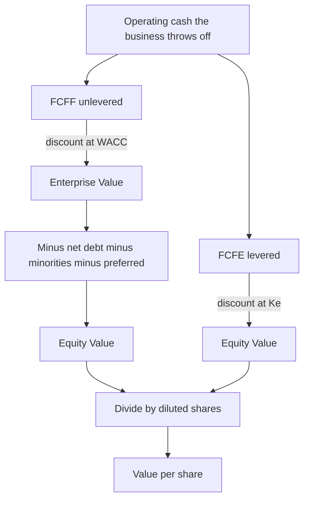

# Free Cash Flow: FCFF vs FCFE

## The Problem / Why this matters

A company reports net income of ₹127.5 crore. Is that what the business "made" for its owners? Almost never. Net income is an accounting number stuffed with non-cash charges (depreciation), it ignores the cash the business had to sink into machines and working capital to stay alive, and it sits *after* interest — so it already belongs to equity holders, not to the whole capital structure. If you discount net income, or dividends, or "profit," you will misvalue the business.

Valuation — the discounted cash flow (DCF) at the heart of it — needs a specific, defensible measure of the **cash a business generates that is genuinely available to the people who funded it.** That is *free cash flow* (FCF). And there is not one free cash flow — there are two, depending on *which* funders you are talking about:

- **FCFF — Free Cash Flow to the Firm** — cash available to *all* capital providers: debt *and* equity. It is **unlevered** (computed before the effect of financing). Discount it at **WACC**, get **Enterprise Value**.
- **FCFE — Free Cash Flow to Equity** — cash available to *equity holders only*, after debt has been paid its interest and principal. It is **levered**. Discount it at the **cost of equity (Kₑ)**, get **Equity Value** directly.

This chapter is the engine room of every DCF you will ever build in equity research, investment banking, or credit. The single most common way candidates blow a "walk me through a DCF" question is by muddling these two: they build an unlevered cash flow, discount it at cost of equity, then forget to subtract net debt — three errors compounding. Get FCFF vs FCFE dead right and you will sound like someone who has actually built models, not memorised bullet points.

The other reason this matters: **the cash-flow-to-discount-rate match is the one rule that ties the whole subject together.** FCFF pairs with WACC and produces Enterprise Value. FCFE pairs with Kₑ and produces Equity Value. Break that pairing and every number downstream is wrong. Interviewers test it precisely because it separates people who *understand* valuation from people who have *memorised a formula sheet.*

## Core Idea

Think of a business as a machine that throws off cash. Two questions:

1. **How much cash does the machine throw off before we decide how it was financed?** → **FCFF.** This is the cash generated by operations and assets, sitting *above* the debt-vs-equity split. Because debt hasn't taken its cut yet, this cash belongs to the *whole firm.* It is discounted at the *blended* cost of all capital (WACC) and gives the value of the *whole firm* — Enterprise Value.

2. **How much cash is left for the owners after the lenders have been served?** → **FCFE.** Take FCFF, pay the lenders their after-tax interest, account for debt drawn down and repaid, and what remains is the shareholders' cash. Discount it at the *shareholders'* required return (Kₑ) and you get *Equity Value* straight away.

The two are linked by one bridge:

> **FCFE = FCFF − After-tax interest + Net borrowing**

That's it. FCFE is FCFF minus what leaks out to (and plus what comes in from) the debt providers. Everything else in this chapter is just building each number cleanly and not crossing the wires.

A second core idea, equally important: **consistency beats precision.** The two methods — discount FCFF at WACC, or discount FCFE at Kₑ — must give the *same equity value* when the assumptions are consistent. If they don't, you've made an error. This internal check is what senior people use to catch juniors' models.

## Why it works this way — first principles

### Cash, not profit

Value is the present value of future cash flows. Not profit — *cash*. Why? Because you can only spend, reinvest, or distribute cash. Accounting profit is an opinion; cash is a fact. Depreciation reduces profit but no cash leaves the building the year you book it (the cash left years earlier, when you bought the asset). Conversely, buying a new machine (capex) crushes your cash but barely touches this year's profit. So to measure what a business *truly* generates, we must strip accounting artifacts out and count only cash movements.

### "Free" means available for distribution

The word *free* is doing real work. It means **cash left over after the business has funded everything it needs to keep running and growing at the assumed rate.** A business must:

- **Pay tax** — non-negotiable cash out.
- **Reinvest in long-term assets (capex)** — to replace worn-out assets and fund growth.
- **Fund working capital (ΔNWC)** — as a business grows, it ties up more cash in receivables and inventory than it gets from payables. That increase is a real cash drain.

Only *after* funding all of that is cash "free" to hand to capital providers. That is why every FCF build subtracts capex and the change in working capital. Miss either and you overstate free cash flow and overvalue the company.

### Why "unlevered" FCFF ignores interest — and adds tax back

FCFF is the cash the *operating business* produces, independent of how it's financed. Two identical factories should have the same FCFF whether one is 100% equity-funded and the other 50% debt — because the *operations* are identical. Financing is a separate decision, captured in the discount rate (WACC), not in the cash flow.

So FCFF is computed *before* interest. But there's a subtlety: **interest is tax-deductible.** A levered firm pays *less* tax than an unlevered one because interest shields income. If we want a truly financing-neutral cash flow, we must strip out that financing benefit too. That's why FCFF uses **EBIT × (1 − tax)** — we tax EBIT *as if the firm had no debt* (no interest deduction). The tax saving from debt — the "interest tax shield" — is deliberately *excluded* from FCFF and instead captured inside **WACC**, which uses the *after-tax* cost of debt Kd × (1 − t). Put the shield in one place, not both. This is the deepest reason WACC uses after-tax cost of debt: it is where the tax benefit of leverage lives in an FCFF/WACC model.

### Why FCFE is "levered"

FCFE is what's left for equity *after* the capital structure has done its thing. Lenders get paid interest (a cash outflow) and they lend and get repaid principal (net borrowing — a cash inflow when the firm draws more debt, an outflow when it repays). Equity holders are residual claimants: they get whatever is left. Because FCFE is computed *after* actual interest and *after* actual debt flows, it *depends on leverage* — hence "levered." More debt → more interest paid out → but also more borrowing potentially drawn in. FCFE reflects the real financing of the firm.

### Why the discount rate must match

A cash flow belongs to specific claimants. The discount rate must be the required return of *exactly those claimants*:

- FCFF belongs to **debt + equity** → discount at the **blended** required return of both → **WACC** → value of the whole firm → **Enterprise Value.**
- FCFE belongs to **equity only** → discount at **equity's** required return → **Kₑ** → **Equity Value.**

Discounting FCFF (a firm-level, larger cash flow that has *not* paid debt) at Kₑ (equity's higher rate) is a category error: you'd be valuing firm cash flows as if they all belonged to equity, at the wrong rate. This mismatch is the classic interview trap.

## Full technical content

### The four flavours of the FCFF build

FCFF can be built from four different starting points on the income statement / cash flow statement. **All four give the identical number** — they are algebraic rearrangements of one another. Interviewers love asking you to start from a specific line ("start from EBITDA," "start from net income") to check you actually understand the build rather than memorising one version.

The canonical build starts from **EBIT**:

> **FCFF = EBIT × (1 − t) + D&A − Capex − ΔNWC**

where:
- **EBIT × (1 − t)** = *NOPAT* (Net Operating Profit After Tax) — operating profit taxed as if unlevered.
- **+ D&A** = add back depreciation & amortisation (non-cash charge deducted to get EBIT).
- **− Capex** = cash spent on long-term assets.
- **− ΔNWC** = cash absorbed by the *increase* in net working capital (a decrease is a source of cash, so it's added).

**Sign convention for ΔNWC (memorise this):** ΔNWC = NWC(this year) − NWC(last year). NWC = (current assets excl. cash) − (current liabilities excl. short-term debt). If NWC *rises*, the firm has tied up more cash → subtract it. If NWC *falls*, cash is released → it adds to FCFF. The formula subtracts ΔNWC, so a positive ΔNWC (growth) reduces FCF. This trips people up constantly.

The four equivalent starting points:

| # | Start from | Formula | Intuition |
|---|-----------|---------|-----------|
| 1 | **EBIT** | EBIT×(1−t) + D&A − Capex − ΔNWC | The canonical build. Tax EBIT unlevered, add back non-cash, subtract reinvestment. |
| 2 | **EBITDA** | EBITDA×(1−t) + t×D&A − Capex − ΔNWC | EBITDA is pre-D&A, so we lose the *tax shield on D&A*; add it back as t×D&A. |
| 3 | **Net income** | NI + Int×(1−t) + D&A − Capex − ΔNWC | NI is post-interest & post-tax; add back after-tax interest to "unlever" it. |
| 4 | **CFO** (cash flow from ops) | CFO + Int×(1−t) − Capex | CFO already has D&A and ΔNWC baked in; just unlever interest and subtract capex. |

**Deriving flavour 2 (from EBITDA) — because interviewers ask "why t×D&A?":**
EBIT = EBITDA − D&A, so
EBIT×(1−t) = (EBITDA − D&A)(1−t) = EBITDA(1−t) − D&A(1−t).
Substitute into flavour 1:
FCFF = EBITDA(1−t) − D&A(1−t) + D&A − Capex − ΔNWC
= EBITDA(1−t) + D&A[1 − (1−t)] − Capex − ΔNWC
= **EBITDA(1−t) + t×D&A − Capex − ΔNWC.**
The +t×D&A term *is* the depreciation tax shield — the tax you save because D&A is deductible. Starting from EBITDA you skipped over D&A, so you must add its tax benefit back.

**Deriving flavour 4 (from CFO):** CFO (indirect method) ≈ NI + D&A − ΔNWC (+ other non-cash). But CFO is computed *after* interest was paid (interest sits in NI). To get to the *firm* level, add back the after-tax interest: **FCFF = CFO + Int×(1−t) − Capex.** Note CFO already contains D&A and ΔNWC, so you do *not* re-add them — a very common double-count error. **Warning on flavour 4:** under IFRS, interest paid can sit in financing rather than operating CFO, and CFO is stated after cash taxes (which include the shield) — so the CFO route needs care; the EBIT build is cleaner and is the interview default.

### The FCFE build

FCFE can also be built several ways. The two you must know cold:

**From FCFF (the bridge):**
> **FCFE = FCFF − Int×(1−t) + Net borrowing**

where **Net borrowing = new debt raised − debt repaid** (a net inflow is positive).

**From net income (the direct build — most common in practice):**
> **FCFE = NI + D&A − Capex − ΔNWC + Net borrowing**

Intuition: start with what equity earned (NI, already after interest and tax), add back non-cash D&A, subtract the reinvestment equity must fund (capex and ΔNWC), then add net new debt the firm raised (cash that flows in and is available to equity) — or subtract net repayment.

**From CFO:**
> **FCFE = CFO − Capex + Net borrowing**

(Because CFO is already after-tax and after-interest, you just subtract capex and add net borrowing.)

A useful special case: if the firm keeps a *constant debt ratio*, net borrowing = Debt Ratio × (Capex − D&A + ΔNWC), and FCFE = NI − (1 − DR)×(Capex − D&A + ΔNWC). Handy for quick FCFE modelling, but know it's an assumption, not a law.

### FCFF vs FCFE — the master comparison table

| Dimension | **FCFF (unlevered)** | **FCFE (levered)** |
|-----------|----------------------|--------------------|
| Cash available to | All capital providers (debt + equity) | Equity holders only |
| Levered / unlevered | Unlevered (before financing) | Levered (after financing) |
| Interest treatment | Excluded (added back / never deducted) | Deducted (after-tax) |
| Net borrowing | Not included | Included (added) |
| Tax basis | EBIT × (1 − t) — unlevered tax | Actual tax (interest shield already in NI) |
| Discount rate | **WACC** | **Cost of equity (Kₑ)** |
| Output of DCF | **Enterprise Value (EV)** | **Equity Value directly** |
| Get to equity by | EV − Net debt − minorities − prefs (+ non-op assets) | Already equity — no bridge needed |
| Stability | More stable (independent of leverage) | Volatile if leverage changes |
| Best used when | Leverage is stable or changing; cross-company comparability; most DCFs | Banks/financials; stable leverage; when equity cash flow is the direct focus |

### The discount-rate match and the EV → Equity bridge

This is where most of the marks are in an interview. The DCF produces a *present value of the discounted cash flows*. What that PV *is* depends on what you discounted:

- Discount **FCFF at WACC** → PV = **Enterprise Value.** You must then **bridge to equity.**
- Discount **FCFE at Kₑ** → PV = **Equity Value.** No bridge — you're already there.

**The EV → Equity bridge (memorise the sign of every line):**

| Line | Sign | Why |
|------|------|-----|
| **Enterprise Value** | start | Value of the operating business to all capital providers |
| − Total debt | subtract | Debt holders' claim comes out first |
| − Preferred equity | subtract | Ranks ahead of common |
| − Minority (non-controlling) interest | subtract | Portion of a consolidated sub owned by others |
| − Unfunded pension / leases (if not in debt) | subtract | Debt-like claims |
| + Cash & equivalents | add | Non-operating asset; belongs to equity |
| + Non-operating assets / investments | add | Value not captured in operating FCFF |
| = **Equity Value** | | What common shareholders own |
| ÷ Diluted shares outstanding | | **Value per share** |

Shorthand: **Equity Value = EV − Net Debt − Minorities − Preferred + Non-operating assets**, where **Net Debt = Total Debt − Cash.**

Why add cash? FCFF is built from *operating* earnings (EBIT), so it never includes the interest earned on the cash pile. That cash is therefore a *separate, non-operating asset* not captured in EV — so we add it. (Assuming cash is genuinely excess; operating cash needed to run the till is sometimes treated as operating.)

### Normalising and adjusting cash flows

A DCF is only as good as the cash flows you feed it. Raw reported numbers are full of noise. **Normalisation** means adjusting the historical/forecast cash flow to reflect the *sustainable, ongoing* economics of the business, stripping out one-offs and correcting distortions. This is judgment-heavy and heavily tested in research interviews ("how would you normalise this?").

Key normalisation adjustments:

| Item | Adjustment | Why |
|------|-----------|-----|
| **One-time / non-recurring items** | Remove restructuring charges, litigation settlements, asset write-downs, gains on asset sales, insurance proceeds | These won't recur; including them distorts the run-rate |
| **Capex vs depreciation mismatch** | In steady state, normalise capex toward maintenance level; ensure long-run capex ≥ D&A if the firm is growing | A firm can't perpetually spend less on capex than it depreciates and keep growing |
| **Working capital spikes** | Normalise ΔNWC to a sustainable % of revenue; strip out one-off inventory build/release | A single bad year distorts the WC trend |
| **Stock-based compensation (SBC)** | Treat as a real economic cost. Best practice: don't blindly add it back as "non-cash"; either expense it in the cash flow or capture dilution in the share count | Adding SBC back *and* ignoring dilution double-benefits and overvalues |
| **Operating leases (post-IFRS 16 / ASC 842)** | Be consistent: if capitalised on balance sheet, treat lease as debt-like and rent as financing; don't double count | Standard changes shifted lease expense between operating and financing |
| **R&D / intangibles** | Consider capitalising if it's really investment, not expense | Expensing understates assets and reinvestment |
| **Non-operating income** | Exclude income from non-operating assets from EBIT/FCFF; value those assets separately and add in the bridge | FCFF must be *operating* cash only |
| **Tax rate** | Use a *normalised marginal/effective* rate, not a distorted single-year rate | One-off tax items (NOLs, credits) distort the rate |
| **Cyclical businesses** | Normalise to mid-cycle margins/volumes | A peak or trough year is not representative |

The golden rule of normalisation: **every adjustment must be internally consistent.** If you normalise capex up, make sure D&A and the asset base are consistent. If you strip a one-off gain from EBIT, strip its tax effect too. And crucially, **in the terminal/steady state, capex should roughly equal D&A grown by inflation, and reinvestment should be consistent with the terminal growth rate** (Reinvestment rate = g / ROIC). Otherwise your terminal value implies free growth — the single biggest source of DCF nonsense.

## Worked examples

### Example 1 — Build FCFF four ways and FCFE three ways (they must all reconcile)

**Company: BlueOak Ltd. Given (₹ crore):**

| Item | Value |
|------|-------|
| Revenue | 1,000 |
| EBITDA | 250 |
| D&A | 50 |
| EBIT | 200 |
| Interest expense | 30 |
| Tax rate (t) | 25% |
| Capex | 70 |
| Increase in NWC (ΔNWC) | 20 |
| New debt raised | 40 |
| Debt repaid | 15 |

First, some derived numbers:
- **NOPAT = EBIT × (1 − t) = 200 × 0.75 = 150**
- **Net income = (EBIT − Interest) × (1 − t) = (200 − 30) × 0.75 = 170 × 0.75 = 127.5**
- **After-tax interest = Int × (1 − t) = 30 × 0.75 = 22.5**
- **Net borrowing = 40 − 15 = 25**

**FCFF — flavour 1 (from EBIT):**
FCFF = EBIT(1−t) + D&A − Capex − ΔNWC = 150 + 50 − 70 − 20 = **110**

**FCFF — flavour 2 (from EBITDA):**
FCFF = EBITDA(1−t) + t×D&A − Capex − ΔNWC = 250×0.75 + 0.25×50 − 70 − 20
= 187.5 + 12.5 − 70 − 20 = **110** ✓

**FCFF — flavour 3 (from net income):**
FCFF = NI + Int(1−t) + D&A − Capex − ΔNWC = 127.5 + 22.5 + 50 − 70 − 20 = **110** ✓

**FCFF — flavour 4 (from CFO):**
CFO = NI + D&A − ΔNWC = 127.5 + 50 − 20 = 157.5
FCFF = CFO + Int(1−t) − Capex = 157.5 + 22.5 − 70 = **110** ✓

All four agree: **FCFF = ₹110 crore.** This is the check senior analysts run — if your four builds don't tie, there's a sign error somewhere.

**FCFE — from FCFF (the bridge):**
FCFE = FCFF − Int(1−t) + Net borrowing = 110 − 22.5 + 25 = **112.5**

**FCFE — from net income:**
FCFE = NI + D&A − Capex − ΔNWC + Net borrowing = 127.5 + 50 − 70 − 20 + 25 = **112.5** ✓

**FCFE — from CFO:**
FCFE = CFO − Capex + Net borrowing = 157.5 − 70 + 25 = **112.5** ✓

All three agree: **FCFE = ₹112.5 crore.**

Note FCFE (112.5) > FCFF (110) here — that happens when net borrowing (25) exceeds after-tax interest (22.5), i.e., the firm drew *more* new debt than the interest it paid, so extra cash flowed to equity this year. In a year of net debt *repayment*, FCFE would be well below FCFF.

### Example 2 — A full FCFF DCF: from projections to value per share

**Company: Meridian Industries.** Five-year FCFF forecast, then a terminal value. Assumptions:
- WACC = **10%**
- Terminal growth g = **3%**
- Total debt = ₹400 cr; Cash = ₹100 cr; Minority interest = ₹20 cr; Preferred = 0
- Diluted shares outstanding = **100 crore**

**Projected FCFF (₹ cr):**

| Year | 1 | 2 | 3 | 4 | 5 |
|------|---|---|---|---|---|
| FCFF | 110 | 120 | 130 | 138 | 145 |

**Step 1 — Terminal value (Gordon growth, at end of Year 5):**
TV₅ = FCFF₅ × (1 + g) / (WACC − g) = 145 × 1.03 / (0.10 − 0.03) = 149.35 / 0.07 = **2,133.57**

**Step 2 — Discount factors at WACC = 10%:** DF = 1 / (1.10)ⁿ

| Year | Discount factor |
|------|-----------------|
| 1 | 0.9091 |
| 2 | 0.8264 |
| 3 | 0.7513 |
| 4 | 0.6830 |
| 5 | 0.6209 |

**Step 3 — PV of explicit FCFFs:**

| Year | FCFF | DF | PV |
|------|------|-----|-----|
| 1 | 110 | 0.9091 | 100.00 |
| 2 | 120 | 0.8264 | 99.17 |
| 3 | 130 | 0.7513 | 97.67 |
| 4 | 138 | 0.6830 | 94.25 |
| 5 | 145 | 0.6209 | 90.03 |
| | | **Sum** | **481.12** |

**Step 4 — PV of terminal value:** (TV occurs at end of Year 5, so discount by Year-5 factor)
PV(TV) = 2,133.57 × 0.6209 = **1,324.73**

**Step 5 — Enterprise Value:**
EV = PV(explicit FCFF) + PV(TV) = 481.12 + 1,324.73 = **₹1,805.85 cr**

*Sanity check:* TV as % of EV = 1,324.73 / 1,805.85 = **73.4%** — typical (usually 60–80%); high but not alarming. If it were >90%, you'd worry the value is all in an unverifiable terminal assumption.

**Step 6 — EV → Equity bridge:**

| Line | ₹ cr |
|------|------|
| Enterprise Value | 1,805.85 |
| − Total debt | (400.00) |
| − Minority interest | (20.00) |
| − Preferred | (0.00) |
| + Cash | 100.00 |
| **= Equity Value** | **1,485.85** |

**Step 7 — Value per share:**
Value per share = Equity Value / Diluted shares = 1,485.85 / 100 = **₹14.86**

Clean walk-through: build FCFF → discount at WACC → get EV → subtract net debt (and minorities) → get equity → divide by shares → price. If you can narrate exactly this in an interview with your own numbers, you're in the top decile.

### Example 3 — FCFF and FCFE give the *same* equity value (the reconciliation that impresses)

The acid test of understanding: with consistent assumptions, discounting FCFF at WACC and FCFE at Kₑ produce the **identical equity value.** Let's prove it on a constant-growth firm.

**Company: Vertex Corp. Assumptions:**
- Year-1 FCFF = ₹110 cr, constant growth g = 3%, WACC = 10%
- Debt = ₹400 cr, **Cash = 0** (so net debt = total debt, keeps the algebra clean)
- Pre-tax cost of debt Kd = 7.5%, tax t = 25%
- Firm holds leverage constant → debt grows at g

**Route A — FCFF / WACC:**
EV = FCFF₁ / (WACC − g) = 110 / (0.10 − 0.03) = 110 / 0.07 = **1,571.43**
Equity value = EV − Net debt = 1,571.43 − 400 = **₹1,171.43 cr**

**Route B — FCFE / Kₑ.** First build FCFE₁:
- Interest = Debt × Kd = 400 × 0.075 = 30; after-tax interest = 30 × 0.75 = 22.5
- Net borrowing (to hold leverage constant, debt grows at g) = Debt × g = 400 × 0.03 = 12
- **FCFE₁ = FCFF₁ − Int(1−t) + Net borrowing = 110 − 22.5 + 12 = 99.5**

Now we need Kₑ. Derive it from WACC. Market-value weights use V = D + E = 400 + 1,171.43 = 1,571.43 (equals EV since cash = 0):
- E/V = 1,171.43 / 1,571.43 = 0.7454
- D/V = 400 / 1,571.43 = 0.2546

WACC = Kₑ × (E/V) + Kd × (1−t) × (D/V)
0.10 = Kₑ × 0.7454 + 0.075 × 0.75 × 0.2546
0.10 = 0.7454 Kₑ + 0.05625 × 0.2546
0.10 = 0.7454 Kₑ + 0.01432
Kₑ = (0.10 − 0.01432) / 0.7454 = 0.08568 / 0.7454 = **0.11494 = 11.49%**

Equity value = FCFE₁ / (Kₑ − g) = 99.5 / (0.11494 − 0.03) = 99.5 / 0.08494 = **₹1,171.43 cr** ✓

**Both routes give ₹1,171.43 cr.** They *must* — they value the same equity, just approached from different sides of the capital structure. If in a real model your FCFF-DCF and FCFE-DCF disagree, your assumptions (leverage, Kₑ vs WACC, net debt) are inconsistent — that's the bug to hunt. This reconciliation is exactly what a strong candidate offers unprompted to demonstrate mastery.

### Example 4 — Normalising a noisy cash flow

**Company: Cyclone Steel** reports a messy Year 0. Reported figures (₹ cr):

| Item | Reported | Adjustment | Normalised |
|------|----------|-----------|------------|
| EBIT | 300 | − 40 one-time gain on land sale; + 25 restructuring charge (non-recurring) | 300 − 40 + 25 = **285** |
| Tax rate | 18% (one-off credits) | Use normalised marginal rate 25% | **25%** |
| D&A | 60 | — | 60 |
| Capex | 30 (unusually low — deferred) | Normalise to maintenance ≈ D&A + growth → 65 | **65** |
| ΔNWC | −35 (one-off inventory dump) | Normalise to sustainable +15 | **+15** |

**Reported FCFF (naive):** 300×(1−0.18) + 60 − 30 − (−35) = 246 + 60 − 30 + 35 = **311** — flattering and wrong: it banks a one-off gain, a fire-sale of inventory, and under-investment.

**Normalised FCFF:** 285×(1−0.25) + 60 − 65 − 15 = 213.75 + 60 − 65 − 15 = **193.75**

The normalised FCFF (₹193.75 cr) is **38% lower** than the naive number. Feeding the reported 311 into a growing-perpetuity terminal value would have massively overvalued the business. This gap — and being able to explain each adjustment's logic and its tax consistency — is exactly what an equity research interviewer probes with "the reported cash flow looks great; what would you adjust?"

## How it is tested in interviews

### Q: "Walk me through a DCF."

The canonical opener. A tight, confident model answer:

> "I'd forecast the company's unlevered free cash flow — FCFF — for an explicit period, usually five to ten years. I start from EBIT, tax it at the marginal rate to get NOPAT, add back non-cash D&A, then subtract capex and the increase in net working capital. That gives FCFF. I discount each year's FCFF back at the WACC, because FCFF belongs to all capital providers. Then I calculate a terminal value at the end of the explicit period — either Gordon growth or an exit multiple — and discount that back too. Summing the PV of the explicit cash flows and the PV of the terminal value gives me Enterprise Value. To get to equity value, I subtract net debt, minority interest, and preferred, and add back any non-operating assets. Divide equity value by diluted shares outstanding and I have an intrinsic value per share, which I compare to the market price."

Then be ready for every follow-up below.

### Q: "Why do you use FCFF and not net income?"

> "Net income is post-interest and full of non-cash items and ignores capex and working capital, so it doesn't measure cash available to fund the business. And net income is already a *levered*, equity-level number — if I discount it at WACC I've mismatched the claimant. FCFF is unlevered operating cash, which correctly pairs with WACC to give Enterprise Value."

### Q: "Why discount FCFF at WACC and not cost of equity?"

> "Because FCFF is cash available to *all* capital providers — debt and equity — so I must discount at the blended required return of all of them, which is WACC. Discounting it at cost of equity would value firm-wide cash flows as if they belonged only to equity, at too high a rate. FCFE pairs with cost of equity; FCFF pairs with WACC."

### Q: "How do you get from Enterprise Value to equity value?"

> "Subtract net debt — that's total debt minus cash — subtract minority interest and any preferred stock, and add back non-operating assets. That leaves the common equity value. Divide by diluted shares for value per share."

Crisp line to remember: **"Equity = EV − net debt − minorities − preferred + non-operating assets."**

### Q: "Why do you add cash back?"

> "FCFF is built from operating earnings, so it never captures the return on the company's cash pile — cash is a non-operating asset sitting outside Enterprise Value. So I add it back in the bridge to equity."

### Q: "What's the difference between FCFF and FCFE?"

> "FCFF is unlevered — before financing — and belongs to debt and equity together; discount it at WACC to get Enterprise Value. FCFE is levered — after after-tax interest and net borrowing — and belongs to equity alone; discount at cost of equity to get equity value directly. The bridge between them is: FCFE equals FCFF minus after-tax interest plus net borrowing."

### Q: "When would you use FCFE instead of FCFF?"

> "For financial firms — banks, insurers — where debt is raw material, not just financing, and interest income/expense is core to operations, so a clean unlevered FCFF is meaningless and WACC is hard to define. Also when leverage is stable and I want to value equity directly. For most industrials, FCFF/WACC is the default because it's robust to changing capital structure."

### Q: "If the firm takes on more debt, what happens to FCFF and FCFE?"

> "FCFF is unchanged — it's unlevered, independent of financing; the operations didn't change. FCFE changes: more interest gets paid out, reducing FCFE, though the initial borrowing adds cash in the year it's raised. Over time, higher leverage means higher and more volatile FCFE. This is exactly why FCFF is preferred when leverage is expected to change."

### Q: "Walk me through the FCFF build starting from EBITDA."

> "FCFF equals EBITDA times one minus the tax rate, plus the tax rate times D&A, minus capex, minus the change in working capital. The 't times D&A' term is the depreciation tax shield — because starting from EBITDA I skipped over D&A, I have to add back the tax I save from it being deductible."

### Q: "Your terminal value is 85% of your EV — is that a problem?"

> "It's a flag. A high TV share means the valuation rests heavily on long-run assumptions I can't observe. I'd sanity-check the terminal growth against long-run GDP, make sure terminal reinvestment is consistent with growth via reinvestment rate equals g over ROIC, and cross-check the implied exit multiple against comparables. If the story holds, high TV share is normal for a growing company — but I'd never hide behind it."

### Q (numerical, on the spot): "EBIT 200, tax 25%, D&A 50, capex 60, working capital up 10 — what's FCFF?"

> "NOPAT is 200 times 0.75 equals 150. Plus D&A 50 is 200. Minus capex 60 is 140. Minus the 10 working capital increase is **130.** FCFF is 130."

Practice these until the arithmetic is reflexive — interviewers do fire off quick mental-math versions.

## Traps & common mistakes

1. **Discounting the wrong cash flow at the wrong rate.** FCFF at Kₑ, or FCFE at WACC. The cardinal sin. FCFF↔WACC↔EV; FCFE↔Kₑ↔Equity. Never cross the wires.

2. **Discounting FCFF and forgetting to subtract net debt.** FCFF/WACC gives you *Enterprise Value*, not equity value. Stopping there overvalues equity by the entire net debt. Always run the bridge.

3. **Subtracting interest in an FCFF build.** FCFF is *unlevered* — interest never appears. If you start from net income, you must *add back* after-tax interest, not leave it deducted.

4. **Double-counting the tax shield.** The interest tax shield lives in WACC (via after-tax Kd). Don't *also* add it to FCFF. Use EBIT×(1−t) — the *unlevered* tax — in the FCFF build, not the actual (lower, levered) tax.

5. **Wrong sign on ΔNWC.** An *increase* in working capital *uses* cash → subtract it. A decrease *releases* cash → add it. Reversing this is one of the most common build errors.

6. **Double-counting D&A or WC when starting from CFO.** CFO already contains D&A and ΔNWC. Starting from CFO, only add back after-tax interest and subtract capex. Don't re-add D&A.

7. **Forgetting net borrowing in FCFE.** FCFE = FCFF − after-tax interest **+ net borrowing.** Omitting net borrowing understates FCFE in a year the firm draws debt (and overstates it in a repayment year).

8. **Adding SBC back as "non-cash" while ignoring dilution.** Stock comp is a real cost. Add it back *and* ignore the extra shares and you've double-counted the benefit and overvalued the equity.

9. **Terminal value inconsistency (the big one).** Assuming perpetual growth while capex ≈ D&A and no incremental working capital — i.e., growth for free. In steady state, reinvestment must fund growth: reinvestment rate = g / ROIC. Also never set terminal g above the long-run economy growth rate.

10. **Using a distorted single-year tax rate.** One-off credits or NOLs make the effective rate unrepresentative. Normalise to the marginal/sustainable rate.

11. **Mismatched share count.** Use *diluted* shares (options, RSUs, convertibles) for value per share, not basic — otherwise you overstate per-share value.

12. **Capex chronically below depreciation for a growing firm.** Impossible to sustain; it inflates near-term FCF. Normalise so long-run capex supports the assumed growth.

13. **Leaving non-operating income in EBIT.** FCFF must be *operating*. Value non-operating assets separately and add them in the bridge; don't bake their income into the operating cash flow.

## First-principles recap

- **Value is the present value of cash, not profit** — so every FCF build strips out non-cash items (add back D&A) and counts real reinvestment (subtract capex and ΔNWC).
- **"Free" = left over after funding operations, tax, capex, and working capital** — only then is cash available to capital providers.
- **FCFF is unlevered — the cash the *business* generates before financing** — so it belongs to debt + equity, pairs with WACC, and yields Enterprise Value. The interest tax shield is deliberately housed in WACC, not in FCFF.
- **FCFE is levered — what's left for equity after debt is served** — so it pairs with cost of equity and yields equity value directly, with no bridge.
- **The bridge is FCFE = FCFF − after-tax interest + net borrowing** — everything ties back to this one identity.
- **The discount rate must match the claimant of the cash flow** — mismatch it and every downstream number is wrong.
- **Consistent FCFF/WACC and FCFE/Kₑ models give the same equity value** — that internal reconciliation is both the deepest proof of understanding and the best debugging tool.

## Quick-reference

| Concept | Formula |
|---------|---------|
| FCFF from EBIT | EBIT×(1−t) + D&A − Capex − ΔNWC |
| FCFF from EBITDA | EBITDA×(1−t) + t×D&A − Capex − ΔNWC |
| FCFF from net income | NI + Int×(1−t) + D&A − Capex − ΔNWC |
| FCFF from CFO | CFO + Int×(1−t) − Capex |
| FCFE from FCFF | FCFF − Int×(1−t) + Net borrowing |
| FCFE from net income | NI + D&A − Capex − ΔNWC + Net borrowing |
| FCFE from CFO | CFO − Capex + Net borrowing |
| Net borrowing | New debt raised − Debt repaid |
| NOPAT | EBIT × (1 − t) |
| ΔNWC | NWC(t) − NWC(t−1); increase → subtract |
| Terminal value (Gordon) | FCF_n × (1+g) / (r − g) |
| Enterprise Value (FCFF DCF) | Σ PV(FCFF) + PV(TV), discounted at **WACC** |
| Equity Value (FCFE DCF) | Σ PV(FCFE) + PV(TV), discounted at **Kₑ** |
| EV → Equity bridge | Equity = EV − Net debt − Minorities − Preferred + Non-op assets |
| Net debt | Total debt − Cash & equivalents |
| Value per share | Equity Value ÷ Diluted shares outstanding |
| Cash-rate match | FCFF↔WACC↔EV; FCFE↔Kₑ↔Equity |
| Reinvestment rate (terminal) | g ÷ ROIC |
