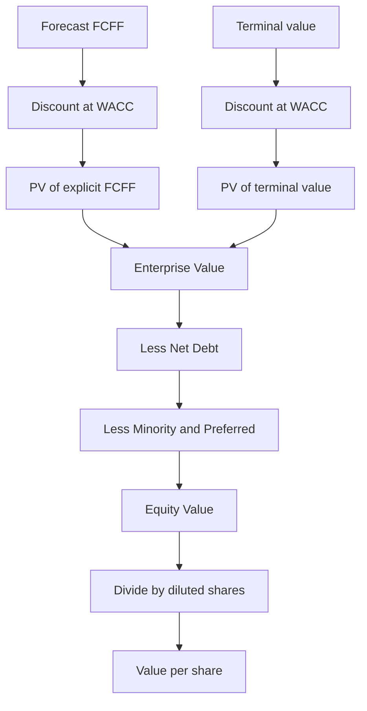
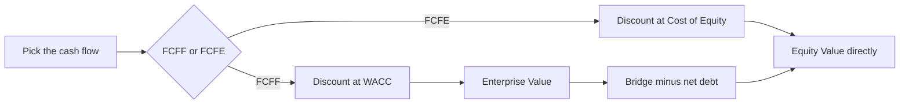
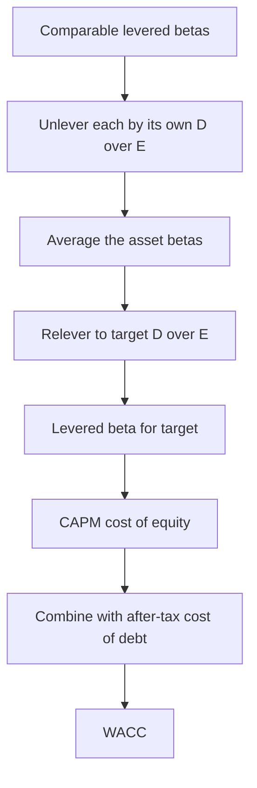

# WACC & Discount Rates for Valuation

## The Problem / Why This Matters

Every valuation you will ever build reduces to one deceptively simple sentence: **a business is worth the present value of the cash it will generate for its investors.** The word that does almost all the heavy lifting in that sentence is *present*. Cash arriving in 2031 is not worth the same as cash in your hand today — it must be discounted back. The number you discount it *at* is the **discount rate**, and getting it right (or defensibly close) is the single most consequential judgement in a DCF.

Here is why interviewers obsess over it. A DCF has two engines: the cash flows and the discount rate. Analysts spend 90% of their time forecasting revenue, margins, and capex — the cash flows — and then plug in a discount rate almost as an afterthought. That is backwards in terms of sensitivity. Move your WACC from 9% to 8% on a stable company and the enterprise value can jump 15–25%. The discount rate is where a valuation is quietly won or lost, and it is where a sharp interviewer will probe to see whether you actually understand what you're doing or whether you're a spreadsheet monkey pulling numbers from a Bloomberg terminal.

There is a second, subtler reason this chapter matters. The discount rate is not one number — it is a *family* of numbers, and using the wrong member of the family is one of the most common and most fatal errors in valuation. Discount **free cash flow to the firm (FCFF)** at the **WACC**. Discount **free cash flow to equity (FCFE)** or **dividends** at the **cost of equity**. Mix them up — discount FCFF at the cost of equity, or FCFE at WACC — and you will double-count or ignore the financing, producing a number that is not just imprecise but conceptually meaningless. Interviewers love this trap because it instantly separates people who memorised a formula from people who understand what the formula *represents*.

This chapter builds the discount rate from first principles. By the end you will be able to construct a WACC from scratch, defend every input, unlever and relever a beta in your head, know exactly when to reach for WACC versus cost of equity, add country and size premia without hand-waving, and answer "walk me through how you'd pick a discount rate" with the calm authority of someone who has done it a hundred times.

## Core Idea

The discount rate is an **opportunity cost of capital**. It is the return investors could earn *elsewhere* on an investment of equivalent risk. When you discount a company's cash flows, you are asking: "Given that I could put my money into other assets of the same riskiness and earn *r*, how much is this stream of future cash worth to me today?"

Two consequences fall out of that one idea and you should be able to recite them:

1. **The discount rate is set by the risk of the cash flows, not by the identity of the investor.** A safe utility's cash flows get discounted at a low rate; a speculative biotech's at a high rate — regardless of who owns them. Risk lives in the asset, and the market prices that risk into a required return.

2. **The discount rate must match the cash flow.** Cash flows available to *all* investors (debt + equity) — i.e. FCFF — are discounted at the blended required return of all investors — i.e. **WACC**. Cash flows available to *equity only* — FCFE, dividends — are discounted at the return equity investors require — the **cost of equity**. This matching principle is the spine of the whole chapter.

**WACC**, the Weighted Average Cost of Capital, is exactly what its name says: a weighted average of what the two capital providers — lenders and shareholders — require, weighted by how much of the capital structure each provides, with one adjustment: because interest on debt is tax-deductible, the *effective* cost of debt to the firm is lower than the coupon. That tax shield is the only "free lunch" in the formula and it is baked in.

## Why It Works This Way — First Principles

Let's derive WACC rather than memorise it, because the derivation *is* the interview answer.

Imagine a firm financed by two claims. Debtholders put in **D** and demand a return **Kd** (the cost of debt). Shareholders put in **E** and demand a return **Ke** (the cost of equity, which is higher because equity is a residual, junior claim — shareholders get paid last and bear the most risk). Total capital is **V = D + E**.

The firm generates operating cash flow. Out of that, it must satisfy *both* sets of investors. The total peso/dollar return the firm must produce to keep everyone whole is:

> Return needed = (Ke × E) + (Kd × D)

Express that as a *rate* on total capital V, and you get the weighted average of the two required returns:

> r = Ke × (E/V) + Kd × (D/V)

That is a plain weighted average — nothing clever yet. The cleverness is the **tax shield**. Interest expense reduces taxable income, so every dollar of interest saves the firm **T × interest** in taxes (T = marginal tax rate). The government effectively subsidises debt. The *after-tax* cost of debt is therefore **Kd × (1 − T)**, not Kd. Slot that in:

> **WACC = Ke × (E/V) + Kd × (1 − T) × (D/V)**

Why does the tax shield attach to debt and not equity? Because dividends are paid out of *after-tax* profit — they are not deductible — while interest is paid *before* tax. That asymmetry is a feature of the tax code, and it is the entire reason a levered firm can, in theory, be worth more than an identical unlevered firm (Modigliani-Miller with taxes). You need this reasoning at your fingertips; "because interest is tax-deductible" is the one-liner, but knowing *why that lowers WACC* is what separates you.

Now, **why does the discount rate rise with risk?** Because investors are risk-averse and can diversify. Diversification washes out company-specific (idiosyncratic) risk — one biotech blowing up is offset by another doing well in a broad portfolio. What *cannot* be diversified away is **systematic risk**: the tendency of an asset to move with the overall market (recessions, rate shocks, broad sentiment). Since idiosyncratic risk is free to eliminate, the market refuses to pay you for bearing it; it only compensates you for systematic risk. That single insight is the engine of the **Capital Asset Pricing Model (CAPM)**, which we use to derive the cost of equity — and it's why beta (a measure of systematic risk *only*) is the risk term, not total volatility.

## Full Technical Content

### 1. The building blocks at a glance

| Symbol | Name | What it is |
|---|---|---|
| **Ke** | Cost of equity | Return shareholders require; from CAPM |
| **Kd** | Pre-tax cost of debt | Yield the firm pays on its debt |
| **Kd(1−T)** | After-tax cost of debt | Effective cost after the interest tax shield |
| **T** | Marginal tax rate | Rate at which interest saves tax |
| **E, D, V** | Market values of equity, debt, and total capital | V = D + E |
| **E/V, D/V** | Target weights | Proportions of the capital structure |
| **Rf** | Risk-free rate | Return on a "riskless" government bond |
| **β (beta)** | Beta | Sensitivity of the stock to market moves = systematic risk |
| **ERP / MRP** | Equity risk premium | Extra return of equities over Rf |
| **CRP** | Country risk premium | Extra return for emerging-market risk |
| **SP** | Size premium | Extra return small caps have historically earned |

### 2. Cost of equity via CAPM

The CAPM is the workhorse. Learn it cold:

> **Ke = Rf + β × ERP**

- **Rf (risk-free rate):** Use the yield on a long-dated government bond that matches the currency and horizon of your cash flows — for USD valuations, the **10-year (or 20-year) US Treasury**. Match currency to cash flows; never discount INR cash flows at a US Treasury rate.
- **β (beta):** The slope of the stock's returns regressed on the market's returns. β = 1 means the stock moves with the market; β = 1.5 means it amplifies market moves 1.5×; β = 0.6 means it dampens them. Beta captures *only* systematic risk.
- **ERP (equity risk premium):** The reward for holding equities over the risk-free asset. Two ways to estimate it: **historical** (long-run average of equity returns minus bond returns, ~4.5–6% for the US depending on window and arithmetic vs geometric averaging) and **implied/forward** (back it out of current index prices and expected cash flows — Damodaran's approach). Interview-safe range: **4.5%–6.0%** for developed markets.

Extended CAPM (build-up form) that practitioners actually use for private / small / emerging-market companies:

> **Ke = Rf + β × ERP + SP + CRP + α**

where **SP** = size premium, **CRP** = country risk premium, and **α** = a company-specific (alpha) adjustment for idiosyncratic factors the model misses (use sparingly and be ready to justify it — interviewers are suspicious of fudge factors).

### 3. Cost of debt

The cost of debt is the yield a lender demands *today* to hold the firm's debt — **not the coupon on old bonds** and **not the interest expense ÷ book debt** unless you have nothing better. Best-to-worst hierarchy:

1. **Yield to maturity (YTM)** on the company's traded bonds — the market's live verdict.
2. **Synthetic rating approach:** estimate a credit rating from an interest coverage ratio (EBIT ÷ interest), map the rating to a **default spread**, and add it to Rf: **Kd = Rf + default spread**. Essential when the firm has no traded debt.
3. **Recent borrowing rate** the company disclosed on a new facility.
4. Last resort: **interest expense ÷ average total debt** (a book proxy — flag it as such).

Then apply the tax shield: **after-tax Kd = Kd × (1 − T)**. Use the **marginal** tax rate (the rate on the next dollar of income, usually the statutory rate), not the effective rate from the accounts, because the shield operates at the margin. If the firm is loss-making or its interest exceeds tax-deductible limits, the shield may be worth less than T suggests — a nuance worth mentioning.

### 4. Weights — market value, and *target*, not book

Three rules that get tested:

- **Use market values, not book values.** Equity weight = market capitalisation (share price × shares outstanding). Debt weight = market value of debt (use book value as a proxy only if debt isn't traded and trades near par). Book values reflect historical accounting, not what investors would pay today.
- **Use *target* / long-run weights, not today's snapshot** — especially if the current structure is temporary (e.g. a company mid-LBO carrying 80% debt it intends to pay down). WACC discounts cash flows over the *whole* forecast, so the weights should reflect the *sustainable* capital structure. Common practice: use the company's target, or the industry-average / peer-median structure for a mature company.
- **Weights and levered beta must be consistent.** If you assume a target D/E, the beta you use must be **relevered to that same D/E**. This is the link to the next section.

### 5. Levered vs unlevered beta — and relevering

This is the most technically demanding piece and a favourite interview topic. The logic:

A company's **observed (levered / equity) beta** — the βL you get from regressing its stock — reflects **two** sources of risk:
1. **Business risk** — how cyclical the underlying operations are (captured by the *unlevered* / asset beta, βU).
2. **Financial risk** — the amplification from leverage. Debt is a fixed claim; it makes the residual equity riskier, like operating leverage but for the balance sheet. More debt → higher equity beta.

So the observed beta of *any* comparable company is contaminated by *its own* capital structure. To value your target you must:

1. **Unlever** each comparable's beta to strip out its leverage → get its pure business-risk asset beta.
2. **Average** the unlevered betas of the peer set (removes the noise of any single regression).
3. **Relever** that average asset beta to *your target company's* capital structure.

The standard **Hamada equation** (assumes debt beta ≈ 0 and a constant dollar of debt / tax shield discounted at Kd):

> **Unlever:** βU = βL / [ 1 + (1 − T) × (D/E) ]
>
> **Relever:** βL = βU × [ 1 + (1 − T) × (D/E) ]

Where D/E is the debt-to-equity ratio *in market values*. Notes:
- If you assume debt has its own beta (βD > 0), the fuller form is βU = [βL + βD × (1−T) × (D/E)] / [1 + (1−T)(D/E)]. Interviews usually assume βD = 0 unless the debt is risky (deeply sub-investment-grade).
- The **(1 − T)** term appears because the tax shield reduces the effective riskiness that leverage adds. Some practitioners (Harris-Pringle) drop the (1−T) if they assume the tax shield is as risky as the assets. Know the standard Hamada version cold; mention the variant to show depth.

**Why not just use the target's own levered beta?** Because (a) the target may be private with no beta, (b) its historical structure may differ from its target structure, and (c) a single regression beta is statistically noisy — the peer-median unlevered beta is far more robust.

### 6. Country risk premium (CRP)

CAPM was born on US data. Value a company operating in Brazil, India, or Nigeria and you must compensate investors for extra risks — political instability, currency, expropriation, weaker rule of law — that a pure US-market beta misses. Two mainstream approaches:

- **Sovereign default spread:** CRP = yield on the country's USD-denominated sovereign bond − yield on a US Treasury of the same maturity (i.e., the country's default spread). Simple, defensible.
- **Damodaran's scaled spread:** CRP = sovereign default spread × (σ_equity / σ_bond), scaling the bond spread up because equities are more volatile than bonds. This is the industry-standard refinement.

Where to put it? Two conventions:
1. **Flat add-on:** Ke = Rf + β×ERP + CRP (every company in the country bears the full CRP).
2. **Lambda / exposure-weighted:** Ke = Rf + β×ERP + λ×CRP, where λ reflects how much of the company's revenue/operations are actually exposed to the risky country (an exporter earning in USD has lower λ). More precise, more defensible in a research interview.

Alternatively, fold CRP into the ERP: use a *total* ERP for the country = mature-market ERP + CRP. Same result, cleaner presentation.

### 7. Size premium (SP)

Empirically, small-cap stocks have historically earned returns *above* what their CAPM betas predict (the "size effect," documented by Fama-French and by Ibbotson/Duff & Phelps data). To reflect this, add a **size premium** to Ke for small companies — roughly **+1% to +5%** depending on how small (micro-caps get the biggest add-on). Caveats to voice: the size premium has been *weaker and contested* in recent decades, may partly reflect illiquidity or survivorship bias, and should be applied with judgement. Still, for valuing a small private company against large-cap comps, ignoring it will *understate* the discount rate and *overstate* value.

### 8. When to use WACC vs cost of equity — the matching principle

| Cash flow being discounted | Discount rate | Gives you |
|---|---|---|
| **FCFF** (free cash flow to firm; pre-financing) | **WACC** | **Enterprise value** |
| **FCFE** (free cash flow to equity; post-financing) | **Cost of equity (Ke)** | **Equity value** directly |
| **Dividends** | **Cost of equity (Ke)** | Equity value |
| **After-tax operating cash to all capital** | **WACC** | Enterprise value |

The iron rule: **discount a cash flow at the required return of the exact set of investors who have a claim on it.** FCFF is what's left for *everyone* (before interest and debt movements), so use everyone's blended cost — WACC. FCFE is what's left for *shareholders* (after interest, after debt repayments/drawdowns), so use shareholders' cost — Ke.

Two things you must **never** do:
- **Never discount FCFF at Ke.** You'd be applying the (higher) equity cost to cash that partly belongs to lower-cost debt — you'd *understate* value... no — you'd apply too high a rate and understate EV, *and* the financing is double-handled. It's simply the wrong claimholder set.
- **Never discount FCFE at WACC.** FCFE already has the cost of debt removed via interest; discounting it at WACC (which *also* accounts for debt) double-counts the debt benefit and inflates equity value.

**Why prefer FCFF/WACC in practice?** Because FCFE is volatile and sensitive to financing decisions (a big debt drawdown spikes FCFE for one year), and because WACC lets you value the whole enterprise independent of a changing capital structure, then bridge to equity at the end. FCFE is used for **financial institutions** (banks, insurers) where debt is raw material and "enterprise value" is meaningless, and sometimes for stable-leverage firms.

### 9. The EV-to-equity bridge

Once a FCFF/WACC DCF gives you **enterprise value**, you bridge to **equity value** and then per share:

> Equity value = Enterprise value − Net debt − Preferred − Minority interest + Non-operating assets
>
> where Net debt = Total debt − Cash & equivalents

Per share = Equity value ÷ diluted shares outstanding. Getting this bridge to reconcile is itself an interview test — see the worked examples.

### 10. Circularity and iteration

A subtle technical point interviewers reward: WACC uses **market-value weights**, but if you're valuing the equity *to find* its market value, you have a chicken-and-egg problem — E is both an input to WACC and an output of the DCF. Solutions: (a) use **target** weights (breaks the loop cleanly — the common choice), or (b) iterate: guess WACC → get equity value → recompute weights → recompute WACC → repeat until it converges. Say "I'd use target weights to avoid circularity, or iterate to convergence" and you sound like a pro.

## Worked Examples

### Worked Example 1 — Build a WACC from scratch

**Company:** "NovaParts Inc.", a US auto-components maker. Given:
- Risk-free rate (10Y UST): **Rf = 4.0%**
- Levered equity beta (regressed): **βL = 1.20**
- Equity risk premium: **ERP = 5.0%**
- Market cap (equity): **E = $6,000m**
- Market value of debt: **D = $2,000m**
- Pre-tax cost of debt: **Kd = 6.0%**
- Marginal tax rate: **T = 25%**

**Step 1 — Cost of equity (CAPM):**
Ke = Rf + βL × ERP = 4.0% + 1.20 × 5.0% = 4.0% + 6.0% = **10.0%**

**Step 2 — After-tax cost of debt:**
Kd(1−T) = 6.0% × (1 − 0.25) = 6.0% × 0.75 = **4.5%**

**Step 3 — Weights (market value):**
V = D + E = 2,000 + 6,000 = 8,000
E/V = 6,000 / 8,000 = **0.75**
D/V = 2,000 / 8,000 = **0.25**

**Step 4 — WACC:**
WACC = Ke×(E/V) + Kd(1−T)×(D/V)
= 10.0% × 0.75 + 4.5% × 0.25
= 7.50% + 1.125%
= **8.625% ≈ 8.6%**

**Sanity check:** WACC (8.6%) sits below Ke (10.0%) and above after-tax Kd (4.5%) — as it must, being a weighted average of the two. ✓

### Worked Example 2 — Unlever, average, relever, then WACC for a private target

**Target:** "Meridian Foods", a **private** packaged-food company. No traded stock, so no beta. We use three public comps.

**Comparables (levered betas and market-value D/E):**

| Comp | Levered β (βL) | D/E | Tax T |
|---|---|---|---|
| A | 0.90 | 0.25 | 25% |
| B | 1.10 | 0.60 | 25% |
| C | 0.80 | 0.10 | 25% |

**Step 1 — Unlever each (Hamada, βD = 0):** βU = βL / [1 + (1−T)(D/E)]

- Comp A: denom = 1 + 0.75×0.25 = 1.1875 → βU = 0.90 / 1.1875 = **0.758**
- Comp B: denom = 1 + 0.75×0.60 = 1.45 → βU = 1.10 / 1.45 = **0.759**
- Comp C: denom = 1 + 0.75×0.10 = 1.075 → βU = 0.80 / 1.075 = **0.744**

**Step 2 — Average unlevered beta:**
βU(avg) = (0.758 + 0.759 + 0.744) / 3 = 2.261 / 3 = **0.754**

**Step 3 — Relever to Meridian's target structure.** Meridian targets **D/E = 0.40**, tax **T = 25%**:
βL = βU × [1 + (1−T)(D/E)] = 0.754 × [1 + 0.75×0.40] = 0.754 × 1.30 = **0.980**

**Step 4 — Cost of equity.** Rf = 4.0%, ERP = 5.5%. Meridian is small and private, so add a **size premium SP = 2.0%**:
Ke = Rf + βL×ERP + SP = 4.0% + 0.980×5.5% + 2.0% = 4.0% + 5.39% + 2.0% = **11.39%**

**Step 5 — WACC.** From D/E = 0.40 → D/V = 0.40/1.40 = 0.2857, E/V = 1.00/1.40 = 0.7143. Pre-tax Kd = 6.5%:
Kd(1−T) = 6.5% × 0.75 = 4.875%
WACC = 11.39% × 0.7143 + 4.875% × 0.2857
= 8.136% + 1.393%
= **9.53% ≈ 9.5%**

**Sanity check:** Relevering to a *higher* D/E (0.40) than most comps raised beta above the unlevered 0.754 to 0.980 — leverage adds risk, as expected. WACC 9.5% lies between after-tax Kd (4.875%) and Ke (11.39%). ✓

### Worked Example 3 — Full FCFF DCF with EV-to-equity bridge (and a country premium)

**Company:** "Andes Telecom", operating in an emerging market. Value it with a 5-year FCFF DCF.

**Discount rate build:**
- Rf (US) = 4.0%, βL = 1.10, mature-market ERP = 5.0%
- Country risk premium **CRP = 3.0%** (added to Ke, full exposure)
- Ke = 4.0% + 1.10×5.0% + 3.0% = 4.0% + 5.5% + 3.0% = **12.5%**
- Kd = 8.0% (includes country spread), T = 30% → Kd(1−T) = 8.0%×0.70 = **5.6%**
- Target weights: E/V = 0.70, D/V = 0.30
- **WACC = 12.5%×0.70 + 5.6%×0.30 = 8.75% + 1.68% = 10.43% ≈ 10.4%**

**FCFF forecast ($m):**

| Year | 1 | 2 | 3 | 4 | 5 |
|---|---|---|---|---|---|
| FCFF | 100 | 110 | 121 | 133 | 146 |

**Terminal value** at end of Year 5 (Gordon growth, g = 3.0%):
TV₅ = FCFF₅ × (1+g) / (WACC − g) = 146 × 1.03 / (0.1043 − 0.03) = 150.38 / 0.0743 = **2,024m**

**Discount factors** at WACC = 10.43%: DF_t = 1 / (1.1043)^t

| Year | FCFF | DF | PV |
|---|---|---|---|
| 1 | 100 | 0.9055 | 90.6 |
| 2 | 110 | 0.8199 | 90.2 |
| 3 | 121 | 0.7425 | 89.8 |
| 4 | 133 | 0.6723 | 89.4 |
| 5 | 146 | 0.6088 | 88.9 |
| TV | 2,024 | 0.6088 | 1,232.2 |

- PV of explicit FCFF = 90.6 + 90.2 + 89.8 + 89.4 + 88.9 = **448.9m**
- PV of terminal value = 2,024 × 0.6088 = **1,232.2m**
- **Enterprise value = 448.9 + 1,232.2 = 1,681.1m ≈ $1,681m**

**EV-to-equity bridge.** Andes has: total debt $500m, cash $80m, minority interest $60m, a non-operating stake worth $40m, 200m diluted shares.
- Net debt = 500 − 80 = 420
- Equity value = EV − net debt − minority + non-operating = 1,681.1 − 420 − 60 + 40 = **1,241.1m**
- **Value per share = 1,241.1 / 200 = $6.21**

**Sanity checks:**
- WACC (10.4%) > g (3%), so the terminal value is finite and positive. ✓
- Terminal value is ~73% of EV (1,232 / 1,681) — typical for a growing company; worth flagging that the answer leans heavily on terminal assumptions. ✓
- Bridge reconciles: EV 1,681.1 − net debt 420 − minority 60 + non-op 40 = equity 1,241.1; ÷200 = $6.21. ✓

### Worked Example 4 (bonus) — FCFE valued directly at cost of equity

To cement the matching principle, value the *same* stream as equity cash flow. Suppose Andes's **FCFE** (after interest and debt movements) is forecast at $70m growing 4% forever, and Ke = 12.5% (from above).

Equity value = FCFE₁ / (Ke − g) = 70 × 1.04 / (0.125 − 0.04) = 72.8 / 0.085 = **$856m**
Per share = 856 / 200 = **$4.28**

Note we discounted FCFE at **Ke (12.5%)**, *not* WACC — and we got **equity value directly**, with **no EV bridge** (no net-debt subtraction, because interest and debt flows are already inside FCFE). That's the whole point: FCFE→Ke→equity value in one step. (The two methods needn't give identical numbers here because the cash-flow forecasts differ; in a fully consistent model they would reconcile.)

## How It Is Tested in Interviews

Interviewers rarely ask "what is WACC?" flat. They probe the *reasoning*. Here are the exact questions and crisp model answers.

**Q: "Walk me through a DCF."**
Model answer (say it in this order): *"I forecast unlevered free cash flow — FCFF — for an explicit period, usually five to ten years. I discount each year back to today at the WACC. I estimate a terminal value at the end, either with Gordon growth or an exit multiple, and discount that back too. Summing the PVs gives enterprise value. Then I bridge to equity: subtract net debt, subtract minority interest and preferred, add back non-operating assets, and divide by diluted shares to get value per share. The two big judgement areas are the cash-flow forecast and the WACC."*

**Q: "How do you calculate WACC?"**
*"It's the weighted average of the cost of equity and the after-tax cost of debt, weighted by target market-value capital structure. Cost of equity comes from CAPM: risk-free plus beta times the equity risk premium. Cost of debt is the yield on the company's debt, times one minus the tax rate for the interest shield. Weights are market values, and ideally target weights so I'm not distorted by a temporary capital structure."*

**Q: "Why do you use the after-tax cost of debt but not an after-tax cost of equity?"**
*"Because interest is tax-deductible — it's paid before tax, so it generates a tax shield worth T times interest. Dividends are paid out of after-tax profit, so equity carries no such shield. WACC captures the shield through the (1−T) on the debt term."*

**Q: "Why is the cost of equity higher than the cost of debt?"**
*"Equity is a junior, residual claim — shareholders get paid last, after debtholders, and their return is uncertain. Debt has contractual, senior, secured cash flows. More risk demands more return, so Ke > Kd essentially always."*

**Q: "What discount rate do you use for FCFF versus FCFE?"**
*"FCFF at WACC — it's cash to all capital providers, so I use the blended cost of all capital, and I get enterprise value. FCFE at the cost of equity — it's cash to shareholders only, so I use their required return, and I get equity value directly, no net-debt bridge."*

**Q: "You have a private company with no beta. How do you get one?"**
*"I take a set of listed comparables, unlever each one's equity beta using its own D/E and tax rate to strip out financial risk, average the unlevered betas to get a clean asset beta, then relever to my target's capital structure. That gives a levered beta reflecting my company's business risk and its target leverage."*

**Q: "If a company takes on more debt, what happens to its WACC?"**
*"Initially WACC tends to fall — you're adding cheaper, tax-shielded debt and replacing expensive equity. But as leverage rises, both Kd and Ke climb because default and financial risk rise, and beyond an optimal point WACC turns back up. It's a U-shape. So 'more debt lowers WACC' is only true up to a point."*
(Great follow-up bait — have the U-shape ready.)

**Q: "Your WACC is 9%. Cut it to 8%. What happens to value, roughly?"**
*"Value rises, and more than proportionally, because the terminal value — often 60–80% of a DCF — is very sensitive to the spread between WACC and g. On a stable company a 100bp cut can lift EV by 15–25%. It's the single most sensitive assumption, which is why I stress-test it."*

**Q: "What risk-free rate do you use?"**
*"A long-dated government bond matched to the currency of my cash flows — the 10-year Treasury for USD. I match maturity to the duration of the cash flows and currency to the cash flows, so I never mix an INR forecast with a USD risk-free rate."*

**Q: "Should the discount rate change year to year in the forecast?"**
*"In principle yes if the capital structure or risk changes materially — for example an LBO that deleverages over time, where you'd use a changing WACC or switch to APV. In practice, for a stable company, a constant target WACC is standard and cleaner."*

The meta-signal interviewers want: you understand the discount rate is an *opportunity cost driven by risk*, you match the rate to the cash flow, and you can defend every input. Say those three things and you're ahead of most candidates.

## Traps & Common Mistakes

- **Mismatching cash flow and rate.** Discounting FCFF at Ke or FCFE at WACC. The single most common fatal error. Match the claimholder set.
- **Book weights instead of market weights.** Using balance-sheet equity (which can be tiny or negative) instead of market cap grossly distorts the mix. Always market value.
- **Using the current, temporary capital structure** for a company mid-transition (LBO, distressed) instead of target weights — the WACC then misrepresents the forecast horizon.
- **Forgetting to relever beta.** Pulling a comp's levered beta and using it directly, ignoring that its leverage differs from your target's. Unlever, average, relever.
- **Wrong tax rate.** Using the effective tax rate from the accounts (distorted by one-offs, deferred items) rather than the marginal/statutory rate for the shield.
- **Coupon or book cost of debt instead of yield.** The cost of debt is what the firm would pay to borrow *today* — a YTM or synthetic-rating spread — not last decade's coupon.
- **Ignoring country and size risk** when valuing an emerging-market or small-cap company against large developed comps — you'll understate the discount rate and overstate value.
- **Double-counting country risk** — adding a CRP to Ke *and* using a country-inflated Kd *and* haircutting the cash flows for the same risk. Pick a consistent place to reflect it.
- **WACC < g in the terminal value.** If your growth rate exceeds WACC, the Gordon formula returns a negative or absurd number. Terminal g must be below WACC and generally at or below long-run nominal GDP growth.
- **Applying a size premium to a large company** or a big alpha "adjustment" with no justification — interviewers read arbitrary add-ons as a tell that you're reverse-engineering a target price.
- **Currency mismatch.** Nominal cash flows in one currency discounted at a rate built on another currency's risk-free rate. Match currency and inflation basis (nominal-to-nominal, real-to-real).
- **Ignoring circularity** between equity market value and WACC weights — use target weights or iterate.

## First-Principles Recap

- A discount rate is an **opportunity cost of capital** — the return available elsewhere on equally risky assets. Risk lives in the asset, so the rate is set by the cash flows' risk, not the investor.
- **Match the rate to the cash flow:** FCFF → WACC → enterprise value; FCFE/dividends → cost of equity → equity value directly.
- **WACC** blends what lenders and shareholders each require, by target market-value weights, with debt taken **after tax** because interest is deductible — the only tax "subsidy" in the formula.
- **Cost of equity** comes from **CAPM**: risk-free + beta × ERP, because markets only pay you for **systematic** (undiversifiable) risk, which beta measures.
- **Beta is contaminated by leverage:** unlever comps to isolate business risk, then relever to your target's structure — financial risk amplifies equity beta.
- **Emerging markets and small caps carry extra, non-diversifiable-in-your-comps risk** — add a country risk premium and/or size premium, consistently and once.
- The discount rate is the **most sensitive lever** in a DCF — small changes swing value hugely through the terminal value, so defend every input and stress-test it.

## Quick Reference

| Concept | Formula |
|---|---|
| **WACC** | Ke×(E/V) + Kd×(1−T)×(D/V) |
| **Cost of equity (CAPM)** | Ke = Rf + β×ERP |
| **Extended cost of equity** | Ke = Rf + β×ERP + SP + CRP (+α) |
| **After-tax cost of debt** | Kd×(1−T) |
| **Unlever beta (Hamada)** | βU = βL / [1 + (1−T)(D/E)] |
| **Relever beta (Hamada)** | βL = βU × [1 + (1−T)(D/E)] |
| **Cost of debt (synthetic)** | Kd = Rf + default spread |
| **Country risk premium** | CRP = default spread × (σ_equity/σ_bond) |
| **Terminal value (Gordon)** | TV = FCFₙ×(1+g) / (WACC − g) |
| **EV → Equity** | Equity = EV − Net debt − Minority − Preferred + Non-op assets |
| **Net debt** | Total debt − Cash & equivalents |
| **Value per share** | Equity value / diluted shares |
| **Weights** | E/V and D/V at target market values, V = D+E |

