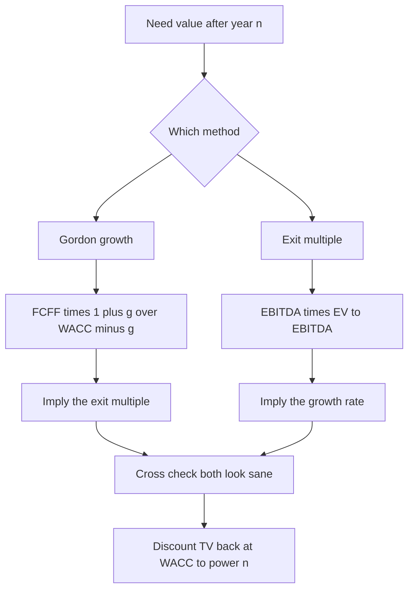
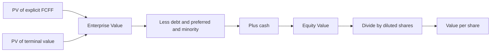
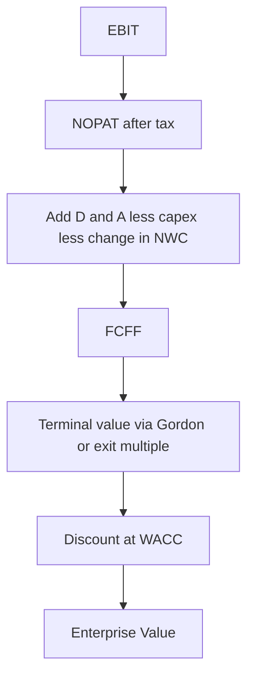

# Terminal Value

## The Problem / Why this matters

A discounted cash flow (DCF) values a business as the present value of every cash flow it will ever produce, from tomorrow until the company ceases to exist. But a company is (in principle) a going concern with an indefinite life. You cannot forecast a specific free cash flow number for the year 2074 with any credibility — nobody can. So the analyst does something pragmatic and slightly uncomfortable: forecast explicitly for a manageable window (usually 5, sometimes 7 or 10 years), and then collapse **everything that happens after that window** into a single number. That single number is the **terminal value (TV)** — also called the continuing value, horizon value, or residual value.

Here is why this is not a footnote but the whole ball game: in a typical DCF, the terminal value is **60% to 85% of the total enterprise value**. You can nail the explicit five-year forecast to the decimal, and it will barely move the answer. Get the terminal value wrong — pick a perpetual growth rate 100 basis points too high, or an exit multiple one turn too rich — and your entire valuation is garbage. The tail wags the dog.

This creates a paradox that every interviewer probes: the part of the DCF you can forecast least reliably (cash flows a decade-plus out) is the part that drives most of the value. A serious analyst therefore treats the terminal value not as a plug at the bottom of the model but as the **single most important assumption**, sanity-checks it from two independent directions, and stress-tests it before trusting the output. Candidates who "just use a 2% growth rate because that's what everyone uses" and move on get found out fast. Candidates who can explain *why* they chose that rate, what it implies about the exit multiple, and how sensitive the answer is — get the offer.

## Core Idea

After the explicit forecast period, we assume the business settles into a **steady state**: it grows at a constant, modest rate forever, or it could be sold for a multiple of its earnings that a comparable mature company commands today. Terminal value captures the value of all those steady-state years, expressed as of the **end of the explicit forecast period** (year *n*). We then discount that lump sum back to today like any other future cash flow.

There are exactly two mainstream methods, and a good model computes both and cross-checks them:

1. **Gordon Growth (Perpetuity Growth) Method** — treats post-forecast cash flows as a growing perpetuity. Intrinsic, theory-driven, "what is it worth."
2. **Exit Multiple Method** — assumes you sell the business at year *n* for a multiple (usually EV/EBITDA) that comparable mature companies trade at today. Market-driven, "what would someone pay."

The professional discipline is: compute TV one way, then **back out the implied assumption of the other method** and ask "is that reasonable?" If your perpetuity growth model implies a 25x exit EBITDA multiple, something is broken. If your 12x exit multiple implies a 6% perpetual growth rate, something is broken. The two methods are a check on each other.

## Why it works this way — first principles

### The going-concern problem and the two-stage model

A DCF sums an infinite series of discounted cash flows:

```
Enterprise Value = Σ (t=1 to ∞) FCFF_t / (1 + WACC)^t
```

An infinite forecast is impossible, so we split the timeline into two stages:

- **Stage 1 — Explicit forecast (years 1 to n):** we model revenue, margins, capex, working capital, and taxes line by line. Here we have a view: the company is scaling, margins are expanding, capex is elevated, growth is above GDP.
- **Stage 2 — Terminal period (years n+1 to ∞):** we assume the company has matured. Competitive advantage has eroded to a normal level, reinvestment has fallen to a maintenance level, margins are stable, and growth has converged to something an economy can sustain forever. Because the economics are now *stable and predictable in structure*, we can value the whole tail with a closed-form formula instead of forecasting each year.

The magic is that stability lets us use the perpetuity mathematics. You cannot forecast year 2074's cash flow, but you *can* say "from year 6 onward, cash flow grows at a steady g and the discount rate is a steady WACC" — and there is a clean formula for the present value of exactly that pattern.

### Why a perpetuity has a finite value

Intuition rebels at "infinite cash flows should be worth infinity." They are not, because discounting shrinks distant cash flows geometrically. A dollar in year 40 at a 9% discount rate is worth about 3 cents today. The sum of an infinite geometric series converges as long as the discount rate exceeds the growth rate (WACC > g). The growing perpetuity formula

```
PV of growing perpetuity = CF_next / (r − g)
```

is just the closed-form limit of that convergent series. The `(r − g)` denominator is the "capitalization rate" — it turns a single next-period cash flow into the value of the entire infinite stream. The smaller the gap between r and g, the larger the multiple you apply, and the more explosive the value — which is exactly why terminal value is so sensitive to g.

### Why the perpetual growth rate cannot exceed long-run GDP

This is the single most tested first-principles point in the chapter, so internalize it. If a company grew its cash flows **forever** at a rate faster than the economy it operates in, then — given enough time — the company would become **larger than the entire economy**. That is a mathematical impossibility. Therefore the terminal growth rate must be **at or below the long-run nominal growth rate of the economy** the firm operates in. In practice that is roughly the sum of long-run real GDP growth plus long-run inflation — call it 2% to 4% for a developed economy, sometimes tied to the risk-free rate as a proxy for long-run nominal growth. Use a number below that and you are being conservative; use a number above it and you are, quite literally, forecasting the impossible. Interviewers love to catch a candidate who typed "5% terminal growth" for a mature US business.

### Why the exit multiple method exists at all

The perpetuity method is theoretically pure but assumption-heavy: it forces you to name a forever growth rate and trust a WACC out to infinity. The exit-multiple method sidesteps that by anchoring to **observable market reality**: "at the end of my forecast the company will look like a mature player in its industry, and mature players in this industry trade at ~9x forward EBITDA today, so that's what I could sell it for." It imports a live, market-tested valuation opinion instead of a theoretical one. Its weakness is the mirror image: you are importing *today's* market sentiment (which may be a bubble or a trough) and freezing it at year *n*, potentially years away. Bankers lean on exit multiples (deal-and-market oriented); academics and pure intrinsic investors lean on perpetuity growth. Best practice uses both.

## Full technical content

### 1. Where terminal value lives in the DCF

The full unlevered (enterprise) DCF is:

```
Enterprise Value = Σ (t=1 to n) FCFF_t / (1 + WACC)^t   +   TV_n / (1 + WACC)^n
```

Two things to burn in:

- **TV is valued as of year n**, the last explicit forecast year. It is a "future lump sum" sitting at the end of the forecast, so it must be discounted back by the **same** discount factor as the year-*n* cash flow — i.e. divided by `(1 + WACC)^n`, **not** `(1 + WACC)^(n+1)`.
- **TV must be discounted at WACC** (for an unlevered/FCFF DCF), the same rate used for the explicit cash flows. A common error is discounting TV at a different rate.

### 2. Free cash flow to firm (the thing being capitalized)

Terminal value in an enterprise DCF capitalizes **unlevered free cash flow (FCFF)**:

```
FCFF = EBIT × (1 − tax rate)          [= NOPAT]
       + Depreciation & Amortization
       − Capital Expenditure
       − Increase in Net Working Capital
```

In the terminal year this FCFF should be **normalized** (see traps): D&A ≈ capex (no more heavy expansion), working-capital investment scaled to the low terminal growth, and margins at a sustainable mid-cycle level.

### 3. Method A — Gordon Growth (Perpetuity Growth)

Two algebraically equivalent ways to write it. Know both; interviewers switch between them.

**Form 1 — grow the final-year FCFF:**

```
TV_n = FCFF_n × (1 + g) / (WACC − g)
```

**Form 2 — use next year's FCFF directly:**

```
TV_n = FCFF_(n+1) / (WACC − g)
```

where `FCFF_(n+1) = FCFF_n × (1 + g)`.

| Symbol | Meaning |
|---|---|
| `TV_n` | Terminal value as of end of year *n* |
| `FCFF_n` | Unlevered free cash flow in the final explicit year |
| `g` | Perpetual (terminal) growth rate, forever |
| `WACC` | Weighted average cost of capital |

**Critical detail — the `(1 + g)` in the numerator.** The perpetuity formula `CF/(r−g)` requires the cash flow **one period after** the valuation date. Since TV sits at year *n*, the first terminal cash flow is year *n+1*, which equals `FCFF_n × (1 + g)`. Forgetting the `(1+g)` understates TV by a factor of `(1+g)` — a small but common and easily-caught slip.

**The reinvestment-consistent refinement (advanced, and impressive in interviews).** A company that grows must reinvest. The fundamental link is:

```
g = Reinvestment Rate × Return on Invested Capital (ROIC)
⇒ Reinvestment Rate = g / ROIC
⇒ Terminal FCFF = NOPAT_(n+1) × (1 − g / ROIC)
```

So a cleaner terminal value is:

```
TV_n = NOPAT_(n+1) × (1 − g / ROIC) / (WACC − g)
```

This forces internal consistency: you cannot assume 4% perpetual growth while also assuming the company reinvests nothing. If terminal ROIC = WACC (the textbook steady state where competitive advantage is fully competed away), growth creates **no value** and the formula collapses toward `NOPAT/WACC`. Dropping this into an interview signals you actually understand the machinery.

### 4. Method B — Exit Multiple

```
TV_n = Metric_n × Exit Multiple
```

Almost always:

```
TV_n = EBITDA_n × EV/EBITDA multiple
```

| Element | Convention |
|---|---|
| Metric | Terminal-year EBITDA (sometimes EBIT, revenue, or unlevered FCF) |
| Multiple | An **EV-based** multiple (EV/EBITDA, EV/EBIT) so the output is an enterprise value |
| Source | Median/mean of **current** trading multiples of mature comparable companies, or precedent M&A multiples |

**Non-negotiable rule: match the multiple to the metric's numerator base.** EV/EBITDA gives you an **enterprise value** directly. If you (mistakenly) used a P/E multiple on net income, you would get an **equity value** sitting in the middle of an enterprise-value DCF — a units mismatch that corrupts the whole bridge. In an unlevered DCF, always use an **enterprise-value multiple** so TV is an enterprise value consistent with the discounted FCFF.

**Forward vs trailing.** Decide whether the multiple is applied to terminal-year (forward) or year *n+1* EBITDA and be consistent with how the comp multiples were quoted. Most models apply the multiple to the final explicit year's EBITDA and treat it as the sale value at year *n*.

### 5. The two-way sanity check (the heart of professional practice)

The methods are duals. Compute one; imply the other.

**Imply the exit multiple from your perpetuity TV:**

```
Implied EV/EBITDA = TV_n (from Gordon) / EBITDA_n
```

Ask: is that multiple in the range that comparable mature companies trade at? If your Gordon TV implies 18x and mature peers trade at 8–10x, your g is too high or your WACC is too low.

**Imply the perpetual growth rate from your exit-multiple TV:**

```
Set  EBITDA_n × Exit Multiple  =  FCFF_n × (1 + g) / (WACC − g)
Solve for g:
g = (WACC × TV_n − FCFF_n) / (TV_n + FCFF_n)
```

Ask: is that implied g at or below long-run nominal GDP? If your 12x exit multiple implies a 5.5% forever growth rate in a 4%-GDP world, the multiple is too rich for a mature business.

A model that shows **both TVs, the implied multiple, and the implied growth** side by side is what separates a real analyst's DCF from a student's.

### 6. Discounting the terminal value back

```
PV(TV) = TV_n / (1 + WACC)^n
```

Then:

```
Enterprise Value = PV(explicit FCFFs) + PV(TV)
```

### 7. From enterprise value to equity value (the bridge)

Terminal value produces an **enterprise value**. Interviewers almost always follow "how do you get terminal value" with "OK, now walk me to the share price." The bridge:

```
Enterprise Value
 − Total Debt
 − Preferred Stock
 − Minority (Non-controlling) Interest
 + Cash & Cash Equivalents
 = Equity Value

Equity Value / Diluted Shares Outstanding = Value per Share
```

| Bridge item | Sign | Why |
|---|---|---|
| Total debt | − | Debt holders have a prior claim; equity is residual |
| Preferred stock | − | Senior to common equity |
| Minority interest | − | Portion of a consolidated sub not owned by parent |
| Cash | + | Non-operating asset; EV excludes it, equity owns it |
| Investments/associates | + | Non-operating assets owned by equity |

### 8. Mid-year convention adjustment

The standard DCF assumes each year's cash flow arrives in a **single lump on the last day of the year** (`t = 1, 2, 3…`). In reality, cash flows arrive roughly **evenly throughout the year**, so on average at the **midpoint** (t = 0.5, 1.5, 2.5…). The **mid-year convention** corrects for this by discounting each cash flow half a year less, which **raises** both the explicit-period PV and the terminal value (cash arrives sooner, so it's worth more).

**Explicit cash flows:** discount at `t = 0.5, 1.5, 2.5, …` instead of `1, 2, 3, …`.

**Terminal value — two schools, and you must state which you use:**

- **Gordon growth under mid-year:** the perpetuity itself is built from mid-year cash flows, so a common treatment multiplies the standard TV by `(1 + WACC)^0.5`, then discounts the TV back at the **whole-year** exponent `n` (because the TV is struck at year-end *n*). Net effect: `PV(TV) = [TV_n × (1+WACC)^0.5] / (1+WACC)^n`. Equivalently, discount TV at `t = n` while the perpetuity's own cash flows are mid-year shifted.
- **Exit multiple under mid-year:** the multiple is applied to a year-end EBITDA and represents a **sale at a point in time** (year-end *n*), so many practitioners **do not** apply the half-year bump to an exit-multiple TV — they discount it at the full `n` exponent. The explicit cash flows still get the mid-year treatment.

The single most important thing for an interview: **be consistent and be able to explain the convention you chose.** Mid-year typically lifts a valuation by roughly `(1+WACC)^0.5 − 1` ≈ 3–5% at an 8–10% WACC. Bankers frequently use it; know that it exists and that it *increases* value.

### Method map



### The DCF bridge



## Worked examples

### Worked Example 1 — Both methods, full bridge to share price

**Setup.** You are valuing MidCoIndustrials. Assumptions:

- Final explicit year (year 5) FCFF = **$100.0m**
- Year 5 EBITDA = **$180.0m**
- WACC = **9.0%**
- Terminal growth g = **2.5%**
- Comparable mature peers trade at **10.0x** EV/EBITDA
- Net debt = **$400.0m** (debt $500m, cash $100m); no preferred, no minority
- Diluted shares = **50.0m**
- PV of the explicit years 1–5 FCFF (given, sum) = **$330.0m**

**Step 1 — Gordon growth TV (as of year 5).**

```
TV_5 = FCFF_5 × (1 + g) / (WACC − g)
     = 100.0 × 1.025 / (0.09 − 0.025)
     = 102.5 / 0.065
     = $1,576.9m
```

**Step 2 — Discount the Gordon TV to today.**

```
Discount factor = 1 / (1.09)^5 = 1 / 1.53862 = 0.64993
PV(TV) = 1,576.9 × 0.64993 = $1,024.9m
```

**Step 3 — Enterprise value (Gordon method).**

```
EV = PV(explicit) + PV(TV) = 330.0 + 1,024.9 = $1,354.9m
```

**Step 4 — TV as a share of EV (the "it dominates" check).**

```
PV(TV) / EV = 1,024.9 / 1,354.9 = 75.6%
```

Three-quarters of the value is terminal — textbook.

**Step 5 — Sanity check: implied exit multiple.**

```
Implied EV/EBITDA = TV_5 / EBITDA_5 = 1,576.9 / 180.0 = 8.76x
```

Peers trade at 10.0x. Our intrinsic method implies **8.76x**, slightly below peers — a *conservative*, sensible result. Green light.

**Step 6 — Cross-check with the exit-multiple method.**

```
TV_5 (exit) = EBITDA_5 × 10.0 = 180.0 × 10.0 = $1,800.0m
PV(TV exit) = 1,800.0 × 0.64993 = $1,169.9m
EV (exit method) = 330.0 + 1,169.9 = $1,499.9m
```

**Step 7 — Imply growth from the exit multiple (does 10x make sense intrinsically?).**

```
g = (WACC × TV − FCFF) / (TV + FCFF)
  = (0.09 × 1,800.0 − 100.0) / (1,800.0 + 100.0)
  = (162.0 − 100.0) / 1,900.0
  = 62.0 / 1,900.0
  = 3.26%
```

A 10x exit multiple implies **3.26%** perpetual growth. That is above our 2.5% assumption but still below long-run nominal GDP (~4%), so 10x is defensible though slightly punchy. The two methods bracket the answer: **EV between $1,355m and $1,500m.**

**Step 8 — Equity bridge and per share (using the Gordon EV of $1,354.9m).**

```
Equity Value = EV − net debt = 1,354.9 − 400.0 = $954.9m
Value per share = 954.9 / 50.0 = $19.10
```

**Cross-check with exit-multiple EV:**

```
Equity = 1,499.9 − 400.0 = $1,099.9m
Per share = 1,099.9 / 50.0 = $22.00
```

**Answer:** intrinsic value per share of roughly **$19.10 (perpetuity)** to **$22.00 (exit multiple)** — a tight, well-triangulated range. Reconciles: EV → equity → per share all internally consistent.

### Worked Example 2 — Mid-year convention, and how much it moves the needle

**Setup.** Same MidCoIndustrials, Gordon method. Now apply the **mid-year convention**. For clarity we are given the year-by-year FCFF (they compound to the $100.0m year-5 figure and the $330.0m end-of-year PV from Example 1):

| Year | FCFF ($m) | End-year factor 1/(1.09)^t | PV end-year |
|---|---|---|---|
| 1 | 82.19 | 0.91743 | 75.40 |
| 2 | 86.72 | 0.84168 | 72.99 |
| 3 | 91.49 | 0.77218 | 70.65 |
| 4 | 96.53 | 0.70843 | 68.38 |
| 5 | 100.00 | 0.64993 | 64.99 |
| **Sum** | | | **352.41** |

(Note: this illustrative cash-flow path sums to ~$352m end-year; we use it self-consistently below. The point is the *mid-year uplift*, not the exact base.)

**Step 1 — Mid-year discount the explicit cash flows** (exponents 0.5, 1.5, 2.5, 3.5, 4.5). Equivalently, multiply each end-year PV by `(1.09)^0.5 = 1.04403`:

```
PV(explicit, mid-year) = 352.41 × 1.04403 = $367.93m
```

**Step 2 — Gordon TV at year 5** (same as before):

```
TV_5 = 100.0 × 1.025 / 0.065 = $1,576.9m
```

**Step 3 — Discount TV under mid-year (perpetuity built from mid-year flows):**

```
PV(TV) = TV_5 × (1.09)^0.5 / (1.09)^5
       = 1,576.9 × 1.04403 / 1.53862
       = 1,646.3 / 1.53862
       = $1,069.9m
```

Compare to the whole-year PV(TV) of $1,024.9m from Example 1 — the mid-year bump added `1,069.9 / 1,024.9 − 1 = 4.40%`, exactly `(1.09)^0.5 − 1`.

**Step 4 — Enterprise value, mid-year:**

```
EV = 367.93 + 1,069.9 = $1,437.8m
```

Versus the whole-year EV on this same cash-flow path (`352.41 + 1,024.9 = 1,377.3`): mid-year lifted EV by `1,437.8 / 1,377.3 − 1 = 4.4%`. **Takeaway:** mid-year convention systematically *raises* value by roughly the half-year discount factor. State it, apply it consistently, and never let it be an accidental toggle.

### Worked Example 3 — Reinvestment-consistent terminal value (the advanced flex)

**Setup.** GrowthMature Corp, terminal year:

- Terminal-year NOPAT (= EBIT × (1 − tax)) = **$120.0m**, expected to grow at **g = 3.0%** into year *n+1*
- Terminal **ROIC = 12.0%**
- WACC = **8.5%**
- Terminal-year EBITDA = **$200.0m**

**Step 1 — Reinvestment rate implied by growth and ROIC.**

```
Reinvestment rate = g / ROIC = 3.0% / 12.0% = 25.0%
```

To grow at 3% while earning 12% on new capital, the firm must plow back 25% of NOPAT.

**Step 2 — Terminal FCFF (next year), net of that reinvestment.**

```
NOPAT_(n+1) = 120.0 × 1.03 = 123.6
Terminal FCFF_(n+1) = NOPAT_(n+1) × (1 − g/ROIC) = 123.6 × (1 − 0.25) = 123.6 × 0.75 = $92.7m
```

**Step 3 — Terminal value.**

```
TV_n = FCFF_(n+1) / (WACC − g) = 92.7 / (0.085 − 0.03) = 92.7 / 0.055 = $1,685.5m
```

**Step 4 — Implied exit multiple, sanity check.**

```
Implied EV/EBITDA = 1,685.5 / 200.0 = 8.43x
```

Reasonable for a mature 12%-ROIC business. 

**Step 5 — The value-of-growth insight.** Suppose instead terminal **ROIC = WACC = 8.5%** (competitive advantage fully competed away). Then:

```
Reinvestment rate = 3.0% / 8.5% = 35.29%
Terminal FCFF = 123.6 × (1 − 0.3529) = 123.6 × 0.6471 = 79.98
TV = 79.98 / 0.055 = $1,454.2m
```

Now compare against a **no-growth** perpetuity where the firm reinvests nothing and just harvests NOPAT (`g = 0`): `TV = 120.0 / 0.085 = $1,411.8m`. The 3% growth added only `1,454.2 − 1,411.8 = $42.4m` — a tiny 3% uplift — because at ROIC = WACC, **growth barely creates value**. But at ROIC = 12% (Step 3), the same 3% growth produced a $1,685.5m TV. **Lesson to say out loud in an interview:** terminal value is driven not just by *how fast* the firm grows but by *whether growth earns above the cost of capital*. Naively cranking g without checking ROIC manufactures value out of thin air.

### EV build recap



## How it is tested in interviews

### Q: "Walk me through a DCF."

**Model answer (crisp, 60–90 seconds):**

"I project unlevered free cash flow — EBIT times one minus tax, plus D&A, minus capex, minus the change in working capital — for an explicit period, usually five years. I discount each year at WACC. Because the business continues past year five, I calculate a terminal value at the end of year five using one of two methods: the Gordon growth method, where terminal value equals year-five free cash flow times one plus g, divided by WACC minus g; or an exit multiple, where I apply a mature-industry EV/EBITDA multiple to year-five EBITDA. I discount that terminal value back at WACC to the power of five. Summing the discounted explicit cash flows and the discounted terminal value gives enterprise value. Then I subtract net debt, preferred, and minority interest, add back cash to get equity value, and divide by diluted shares for value per share. And critically, I cross-check the two terminal-value methods against each other — the growth method should imply a sensible exit multiple, and the exit multiple should imply a sensible growth rate."

That last sentence is what makes you sound senior.

### Q: "What percentage of your DCF value is terminal value, and is that a problem?"

**Model answer:** "Typically 60 to 85%. It's not a flaw of DCF, it's a feature of valuing a going concern — most of a company's value comes from cash flows beyond any forecast horizon. But it *does* mean the terminal assumptions deserve the most scrutiny, which is why I sanity-check the implied multiple and implied growth, and why I run a sensitivity table on g and WACC rather than trusting a point estimate."

### Q: "How do you choose the terminal growth rate?"

**Model answer:** "It's the rate the business can grow *forever*, so it's capped at the long-run nominal growth rate of the economy — real GDP plus inflation, roughly 2 to 4% for a developed market. I'll often anchor it to the long-run risk-free rate or expected inflation. I'd never set it above GDP, because no company can outgrow its economy in perpetuity — it would eventually become larger than the whole economy. If anything I stay a touch below GDP to be conservative, and I always check what growth rate my exit multiple implies to make sure the two are telling the same story."

### Q: "Perpetuity growth vs exit multiple — which do you prefer and why?"

**Model answer:** "They're complementary. The perpetuity method is intrinsic and theoretically clean but very sensitive to g and WACC. The exit multiple is grounded in observable market pricing but imports today's sentiment and freezes it years out. I compute both, then use each to sanity-check the other: the Gordon TV should imply an exit multiple close to where mature comps trade, and the exit multiple should imply a below-GDP growth rate. Bankers usually lead with the exit multiple; intrinsic investors lead with perpetuity growth. I'd present a range bracketed by both."

### Q: "Your model spits out a 20x implied exit multiple from the Gordon method. What's wrong?"

**Model answer:** "Either g is too high or WACC is too low — the `WACC minus g` denominator has collapsed and inflated TV. I'd pull g back to a defensible sub-GDP number, double-check the WACC build, and re-run. A 20x terminal multiple for a mature business isn't credible; mature-industry comps might be 8 to 11x. The implied-multiple check is exactly how you catch a runaway perpetuity."

### Q: "What is the mid-year convention and what does it do to your valuation?"

**Model answer:** "Standard DCF assumes cash arrives at year-end; mid-year assumes it arrives evenly through the year, so on average at the midpoint. You discount each cash flow half a year less — exponents 0.5, 1.5, 2.5 instead of 1, 2, 3. It *raises* the valuation by roughly the half-year discount factor, about 3 to 5% at typical WACCs, because cash is received sooner. For terminal value, I apply the half-year uplift to a Gordon TV since it's a stream of cash flows, but I'd usually treat an exit-multiple TV as a point-in-time sale at year-end and not bump it. The key is being consistent and disclosing the convention."

### Q: "Why do you add the `(1 + g)` in the terminal value numerator?"

**Model answer:** "Because the perpetuity formula needs the cash flow *one year after* the valuation date. The terminal value sits at year *n*, so the first perpetuity cash flow is year *n+1*, which is year-*n* FCFF grown by g. Leaving off the `(1+g)` understates TV."

## Traps & common mistakes

- **Terminal growth above GDP.** The cardinal sin. A 5–6% perpetual growth rate in a 4%-nominal-GDP economy is mathematically impossible over infinity. Cap g at long-run nominal GDP; stay below to be safe.

- **Forgetting the `(1 + g)` in the numerator.** `FCFF_n/(WACC−g)` instead of `FCFF_n×(1+g)/(WACC−g)`. Understates TV; interviewers spot it instantly.

- **Discounting TV by `(1+WACC)^(n+1)` instead of `^n`.** TV is struck *at* year *n*. Discount it with the same factor as the year-*n* cash flow. An extra year of discounting understates value.

- **Using an equity multiple (P/E) for an enterprise-DCF TV.** Produces an equity value floating inside an enterprise-value model — a units mismatch. Use EV/EBITDA or EV/EBIT so TV is an enterprise value.

- **Un-normalized terminal-year cash flow.** If the last explicit year still has heavy expansion capex (capex >> D&A) or a spiky working-capital swing, you are capitalizing a distorted number into infinity. In steady state, capex should approach D&A and working-capital investment should scale to the low terminal growth. Normalize before capitalizing.

- **g and WACC that imply an absurd exit multiple (or vice versa).** Not running the two-way sanity check. Always imply the other method's assumption and ask if it's sane.

- **Ignoring the ROIC–reinvestment link.** Assuming positive perpetual growth while implicitly assuming zero reinvestment. Growth requires reinvestment (`reinvestment = g/ROIC`); free growth is fake value. And growth at ROIC = WACC creates almost no value at all.

- **Tiny `WACC − g` gap → explosive TV.** When WACC is only ~1% above g, small tweaks to either detonate the valuation. Beware valuations that hinge on a razor-thin spread; show the sensitivity.

- **Inconsistent mid-year application.** Mid-year on the explicit cash flows but forgetting it on TV, or applying it to an exit multiple you also treat as a point-in-time sale. Pick a convention and apply it coherently.

- **Growing the wrong metric.** Terminal FCFF should reflect a normalized, unlevered cash flow, not a peak-margin or pre-tax figure.

- **Currency/inflation mismatch.** A nominal WACC must be paired with a nominal g (which includes inflation). Mixing a real g with a nominal WACC breaks the model.

## First-principles recap

- A going concern lives forever, so a DCF splits time into an **explicit forecast** plus a **terminal value** that captures every steady-state year beyond it in one number.
- Terminal value is usually **60–85% of enterprise value** — the least forecastable part drives most of the answer, so it deserves the most scrutiny.
- Two methods, always cross-checked: **Gordon growth** (`FCFF_n×(1+g)/(WACC−g)`, intrinsic) and **exit multiple** (`EBITDA_n × EV/EBITDA`, market-based). Each implies the other; sane models reconcile them.
- The perpetual growth rate is **capped at long-run nominal GDP** — nothing outgrows its economy forever.
- Growth only creates value when **ROIC > WACC**; growth requires reinvestment of `g/ROIC`, so free perpetual growth is an illusion.
- Terminal value is valued at year *n* and discounted by `(1+WACC)^n`; get the `(1+g)` and the exponent right.
- Terminal value is an **enterprise value** — bridge to equity by subtracting net debt (and preferred/minority) and dividing by diluted shares. **Mid-year** convention lifts value ~3–5% by assuming cash arrives mid-period.

## Quick-reference

| Concept | Formula |
|---|---|
| DCF structure | `EV = Σ FCFF_t/(1+WACC)^t + TV_n/(1+WACC)^n` |
| FCFF | `EBIT×(1−tax) + D&A − Capex − ΔNWC` |
| Gordon growth TV (form 1) | `TV_n = FCFF_n×(1+g)/(WACC−g)` |
| Gordon growth TV (form 2) | `TV_n = FCFF_(n+1)/(WACC−g)` |
| Reinvestment-consistent TV | `TV_n = NOPAT_(n+1)×(1−g/ROIC)/(WACC−g)` |
| Reinvestment rate | `Reinvestment = g / ROIC` |
| Exit multiple TV | `TV_n = EBITDA_n × EV/EBITDA` |
| Implied exit multiple | `TV_n(Gordon) / EBITDA_n` |
| Implied growth rate | `g = (WACC×TV − FCFF)/(TV + FCFF)` |
| Discount TV to today | `PV(TV) = TV_n/(1+WACC)^n` |
| Mid-year explicit CF | discount at `t = 0.5, 1.5, 2.5, …` |
| Mid-year Gordon TV | `PV(TV) = TV_n×(1+WACC)^0.5/(1+WACC)^n` |
| EV → Equity | `Equity = EV − debt − pref − minority + cash` |
| Per share | `Equity Value / Diluted Shares` |
| Growth cap | `g ≤ long-run nominal GDP (≈ real GDP + inflation)` |
