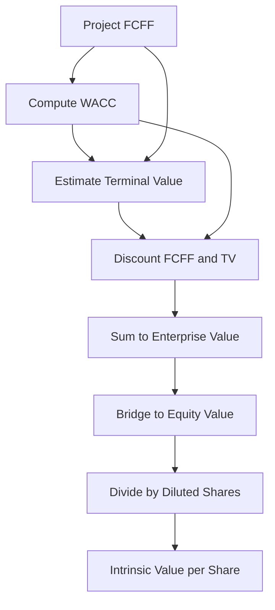
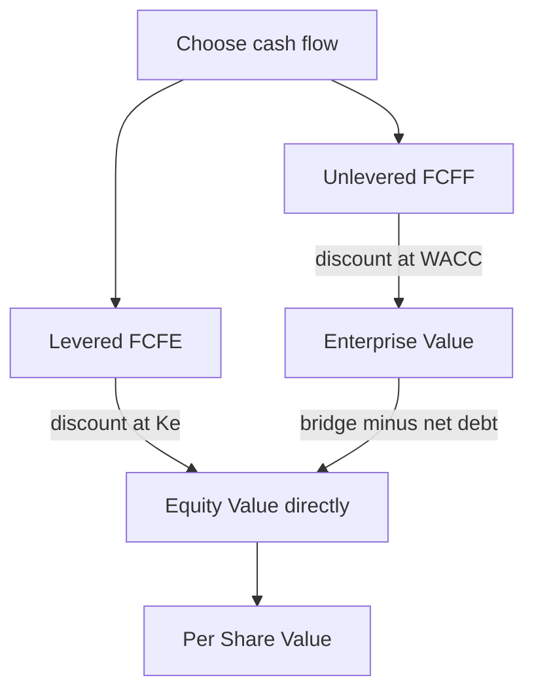

# The Full DCF Build, Step by Step

## The Problem / Why This Matters

Almost every finance interview — equity research, investment banking, private equity, credit — eventually arrives at one question: **"Walk me through a DCF."** It is the single most-asked technical prompt in the industry, and it is asked precisely *because* it is a stress test. A DCF is not one formula. It is a chain of maybe fifteen linked decisions, and each link — the revenue driver, the margin path, the reinvestment logic, the discount rate, the terminal value, the net-debt bridge, the share count — is a place where a weak candidate reveals that they have memorised an output without understanding the machinery.

The interviewer is not testing whether you can recite "free cash flow discounted at WACC." They are testing whether you understand **why** a business is worth the cash it will hand back to its investors, whether you can hold seven moving steps in your head without dropping one, and whether your numbers *reconcile* — whether the enterprise value you build actually bridges to a per-share number that a portfolio manager could act on.

Here is the uncomfortable truth that separates the top decile of candidates: **most people can describe a DCF; very few can build one that ties out.** They forget to add back non-cash charges but subtract capex. They discount a terminal value that is already a present value. They mix up enterprise and equity value in the bridge. They divide by basic shares when the company has a wall of options. They apply a mid-year convention to the projection but not the terminal value, or vice versa. Each of these is a silent, disqualifying error.

This chapter builds the DCF from the ground up as a **single, reconciling machine**. By the end you will be able to (1) construct a full seven-step DCF from a blank sheet, (2) tie every number from revenue to intrinsic price per share, (3) recite the walk-me-through skeleton in ninety seconds, and (4) survive the follow-up questions that separate the analyst from the tourist.

## Core Idea

A DCF says: **a company is worth the present value of all the cash it will generate for its capital providers over its life.** That is the entire philosophy in one sentence. Everything else is plumbing.

The plumbing has seven steps:

1. **Project unlevered free cash flow (FCFF)** — the cash the *whole business* throws off, before any decision about how it is financed.
2. **Compute the discount rate (WACC)** — the blended, risk-adjusted return demanded by *all* capital providers (debt and equity), which is the rate at which we shrink future cash to today.
3. **Estimate terminal value** — the value of all cash flows *beyond* the explicit forecast horizon, captured in a single lump at the horizon.
4. **Discount** the explicit-period FCFFs and the terminal value back to today.
5. **Sum** them to get **enterprise value (EV)** — the value of the operating business.
6. **Bridge from EV to equity value** — subtract net debt and other non-operating claims, add non-operating assets.
7. **Divide equity value by diluted shares** — to get intrinsic value per share, the number you compare to the market price.

The elegant symmetry: because we projected **unlevered** cash flow (Step 1, financing-agnostic), we must discount at the **blended** cost of *all* capital (Step 2, WACC), and the sum we get is the value of the **whole enterprise** (Step 5) — which is why we then need a **bridge** (Step 6) to strip out the debtholders' claim and isolate what belongs to shareholders. The internal consistency of the method — unlevered cash → blended rate → enterprise value → bridge to equity — is the whole game.

## Why It Works This Way — First Principles

**Why cash and not earnings?** Earnings are an accountant's opinion; cash is a fact. Net income embeds non-cash charges (depreciation, amortisation, stock comp), accrual timing (revenue booked before cash arrives), and financing noise (interest). You cannot spend earnings; you can spend cash. Valuation is about what the business can *distribute*, and only cash distributes. This is why we start from operating profit and painstakingly convert it to free cash.

**Why *free* cash flow?** Not all cash a business generates is available to investors. A growing company must plough money back into working capital (inventory, receivables) and fixed assets (capex) just to sustain and grow the operation. Only what is *left over after* those mandatory reinvestments is genuinely "free" to hand to capital providers. Free cash flow = cash from operations − reinvestment. If you value gross operating cash without subtracting reinvestment, you double-count: you credit the firm with growth but never charge it for the cost of buying that growth.

**Why *unlevered* (FCFF) rather than levered (FCFE)?** Two roads lead to Rome. FCFF values the entire enterprise and is *capital-structure neutral* — it does not care how the firm is financed, so it isolates operating performance from financing choices. This is cleaner for comparison and for companies whose leverage will change. FCFE goes straight to equity but bakes in the specific debt schedule. The industry standard, and the interview default, is **FCFF discounted at WACC**. We use it because it separates the two things you want to reason about independently: *how good is the business* (operations → FCFF) and *how is it financed* (capital structure → WACC and the bridge).

**Why discount at all — why is a rupee tomorrow worth less than a rupee today?** Three reasons stacked together: (1) **time preference** — money now can be consumed or reinvested now; (2) **inflation** — tomorrow's rupee buys less; (3) **risk** — tomorrow's promised rupee might not arrive. The discount rate bundles all three into a single required return. Discounting is just compounding run in reverse: if I need a 10% return, ₹110 a year from now is worth ₹100 today, because ₹100 compounded at 10% *becomes* ₹110.

**Why WACC as the rate?** Because the cash flow we are discounting (FCFF) belongs to *both* debt and equity holders, the rate must reflect what *both* groups demand — weighted by how much of the capital each supplies. Debtholders demand less (they have priority and collateral); equity holders demand more (they are last in line and bear residual risk). WACC is the weighted average of the two, adjusted for the fact that interest is tax-deductible (the "tax shield"), which makes debt cheaper still.

**Why a terminal value?** No business ends at year five or year ten. But we cannot forecast individual years to infinity with any credibility — competitive advantage fades, growth converges to the economy, our visibility runs out. So we forecast explicitly for as long as we have a defensible view (usually 5–10 years), then capture *everything after that* in one number — the terminal value — using a simplifying assumption of either perpetual steady growth or an exit multiple. The terminal value typically accounts for **60–80%** of total enterprise value, which is exactly why interviewers probe it so hard: the tail wags the dog.

**Why the EV-to-equity bridge?** Enterprise value is the value of the operating business to *all* claimants. But a shareholder does not own the whole business free and clear — the debtholders have a senior claim. If two identical businesses generate identical FCFF but one has ₹500 of debt and the other has none, they have the *same* enterprise value but very different equity values. The bridge is where we account for who actually gets the operating value: subtract what is owed (net debt, preferred, minorities), add what the operations excluded (cash, investments), and what remains is the equity holders'.

## Full Technical Content

### Step 1 — Project Unlevered Free Cash Flow (FCFF)

FCFF is built from the income statement down to operating profit, then adjusted back toward cash. The canonical build:

| Line | Formula / Note |
|---|---|
| Revenue | Driver-based: volume × price, or growth rate on prior year |
| − Operating costs | COGS + SG&A (as % of revenue or driver-based) |
| = **EBIT** (operating profit) | Earnings before interest and tax |
| × (1 − tax rate) | Tax the operating profit *as if unlevered* → **NOPAT** |
| = **NOPAT** | Net operating profit after tax |
| + Depreciation & Amortisation | Add back — non-cash, was deducted to get EBIT |
| − Capital expenditure (capex) | Subtract — cash out to buy/maintain fixed assets |
| − Increase in net working capital (ΔNWC) | Subtract — cash tied up in operations |
| = **FCFF** | Unlevered free cash flow |

**Formula, compact:**

```
FCFF = EBIT × (1 − t) + D&A − Capex − ΔNWC
```

Equivalent restatement often quoted:

```
FCFF = NOPAT + D&A − Capex − ΔNWC
```

Or, if starting from cash flow from operations (CFO), which is *already levered* because it is post-interest:

```
FCFF = CFO + Interest × (1 − t) − Capex
```

(You add back the after-tax interest because CFO subtracted it, and FCFF must be pre-financing.)

**Key conventions and why they matter:**

- **Tax on EBIT, not on EBT.** We tax operating profit directly at the marginal (or effective) rate, *ignoring* the interest deduction. Why? Because the value of the interest tax shield is captured *separately*, inside WACC (via the after-tax cost of debt). If we also reduced taxes here for interest, we would double-count the shield. This is the most-tested subtlety in the entire FCFF build.
- **Add back all non-cash charges.** D&A is the headline, but also add back stock-based compensation (though many analysts treat SBC as a real economic cost and instead reflect its dilution in the share count — be ready to defend your choice), and any non-cash impairments.
- **ΔNWC sign.** NWC = (non-cash current assets) − (non-debt current liabilities) = receivables + inventory − payables (plus other operating accruals). An *increase* in NWC is a *use* of cash (you funded more inventory/receivables), so it is **subtracted**. A *decrease* releases cash and is added. Growing firms usually have rising NWC, a persistent cash drag.
- **Capex vs D&A in steady state.** In the mature/terminal phase, capex should roughly equal D&A (you replace assets as they wear out) plus a growth increment. If your terminal-year capex is wildly below D&A, your FCFF is inflated and your valuation is fantasy.

### Step 2 — Compute WACC

WACC is the blended required return of all capital providers:

```
WACC = (E / V) × Ke + (D / V) × Kd × (1 − t)
```

Where:
- **E** = market value of equity; **D** = market value of debt; **V = E + D**.
- **Ke** = cost of equity; **Kd** = pre-tax cost of debt; **t** = marginal tax rate.
- The **(1 − t)** on debt captures the **interest tax shield** — interest is deductible, so the government subsidises debt.

**Cost of equity via CAPM:**

```
Ke = Rf + β × (Rm − Rf)
```

- **Rf** = risk-free rate (yield on a long-dated government bond matching the cash-flow horizon).
- **β** = levered beta — the stock's sensitivity to market moves; measures systematic (undiversifiable) risk.
- **(Rm − Rf)** = equity risk premium (ERP) — the extra return investors demand for holding equities over the risk-free asset.
- Optional add-ons: size premium, country risk premium, company-specific premium.

**Cost of debt:** the yield-to-maturity on the firm's existing debt, or the risk-free rate plus a credit spread appropriate to its rating. Use a *forward-looking* market rate, not the historical coupon.

**Weights:** use **market values**, not book. Book equity is a historical accounting residual; market equity is what shareholders' claim is actually worth today. For target capital structure, many analysts use the firm's long-run target D/E or the industry norm rather than a snapshot.

**Beta mechanics (unlever/relever)** — heavily tested:

```
Unlevered (asset) beta:   βu = βL / [1 + (1 − t) × (D/E)]
Relevered beta:           βL = βu × [1 + (1 − t) × (D/E_target)]
```

You strip a comparable's beta of *its* leverage (unlever) to isolate business risk, average across comps, then relever at *your* target structure. This is how you get a beta for a private company or a subsidiary with no traded equity.

### Step 3 — Terminal Value

Two accepted methods.

**(a) Gordon Growth (perpetuity growth) method:**

```
TV(at year N) = FCFF(N) × (1 + g) / (WACC − g)
```

or equivalently `TV = FCFF(N+1) / (WACC − g)`, where `FCFF(N+1) = FCFF(N) × (1 + g)`.

- **g** = perpetual growth rate — the rate at which FCFF grows *forever* after the explicit period.
- **Iron constraint: g < WACC** (or the formula explodes / goes negative), and — more importantly — **g must not exceed long-run nominal GDP growth** (roughly 2–4% in developed economies, a bit higher in emerging markets). A company cannot grow faster than the economy forever, or it would eventually *become* the economy.

**(b) Exit multiple method:**

```
TV(at year N) = Terminal metric(N) × Exit multiple
```

- Usually `EV/EBITDA × EBITDA(N)`, sometimes EV/EBIT or EV/FCFF.
- The multiple should reflect where a *mature* version of this business would trade — anchor to current trading multiples of mature peers, not to today's high-growth multiple.

**Critical convention — the terminal value is measured *as of year N*.** It is a value at the *end* of the explicit forecast, so it must still be **discounted back N periods** to today (same treatment as year-N cash flow). Forgetting to discount the TV is a catastrophic and common error.

**Sanity check — implied growth ↔ implied multiple.** Always cross-check: if you used an exit multiple, back out the *implied* perpetuity growth rate and confirm it is sane; if you used Gordon Growth, back out the *implied* exit multiple and confirm it is not absurd. The two methods should give answers in the same postcode.

### Step 4 — Discount to Present Value

Each cash flow is discounted by the number of periods until it arrives:

```
PV of FCFF(t) = FCFF(t) / (1 + WACC)^t
PV of TV      = TV(N)   / (1 + WACC)^N
```

**Mid-year convention.** Cash flows arrive throughout the year, not in a lump on 31 December. To reflect this, discount each flow by **(t − 0.5)** periods instead of `t` (i.e., assume cash lands mid-year on average). This raises PV slightly (cash arrives sooner). If you apply mid-year to the explicit FCFFs, be consistent about the TV:
- Gordon Growth TV is discounted at **N − 0.5** (it represents a perpetuity of mid-year cash flows starting from year N).
- Exit-multiple TV represents a *sale price at year-end N*, so it is typically discounted at full **N** even under mid-year convention. Be ready to state which you used and why.

**Discount factor table** (the shape of money losing value at 10% WACC):

| Year | Discount factor 1/(1.10)^t | Mid-year 1/(1.10)^(t−0.5) |
|---|---|---|
| 1 | 0.9091 | 0.9535 |
| 2 | 0.8264 | 0.8668 |
| 3 | 0.7513 | 0.7880 |
| 4 | 0.6830 | 0.7164 |
| 5 | 0.6209 | 0.6512 |

### Step 5 — Sum to Enterprise Value

```
Enterprise Value (EV) = Σ PV(FCFF_t) [t = 1..N] + PV(Terminal Value)
```

This EV is the value of the **operating business** to all capital providers. It is *before* any adjustment for how the firm is financed or for non-operating items.

### Step 6 — Bridge from Enterprise Value to Equity Value

```
Equity Value = Enterprise Value
             − Total debt
             − Preferred stock
             − Minority (non-controlling) interest
             − Unfunded pension / other debt-like items
             + Cash & cash equivalents
             + Non-operating assets (e.g., investments, JV stakes not in FCFF)
```

Compactly, using **net debt = total debt − cash**:

```
Equity Value = EV − Net Debt − Preferred − Minority Interest + Non-operating assets
```

**Why each item:**

| Bridge item | Add or Subtract | Reason |
|---|---|---|
| Total debt | Subtract | Senior claim; debtholders are paid before equity |
| Cash & equivalents | Add | Non-operating (FCFF didn't count it); belongs to shareholders, reduces net cost of acquisition |
| Preferred stock | Subtract | Claim senior to common equity |
| Minority interest | Subtract | EV includes 100% of a consolidated sub, but part is owned by others |
| Non-operating assets | Add | FCFF only captured *operating* cash; separately held assets add value |
| Associates / equity-method investments | Add | Their income isn't in EBIT/FCFF, so add their value separately |

**The mirror-image logic:** if you *bought the whole company*, you would pay EV to take over the operating business, *inherit* its debt (a cost, hence subtract), but *pocket* its cash (a benefit, hence add). Equity value is what is left for the common shareholders after all senior claims.

### Step 7 — Divide by Diluted Shares → Value Per Share

```
Intrinsic value per share = Equity Value / Diluted shares outstanding
```

**Use *diluted* shares, not basic.** In-the-money options, warrants, RSUs, and convertibles will become shares and dilute existing holders. Compute diluted count via the **Treasury Stock Method (TSM)** for options:

```
Net new shares from options = Options outstanding − (Options × Strike / Current price)
                            = Options × (1 − Strike/Price)   [when in-the-money]
```

The intuition: exercising options brings in cash (strike × count); the company uses that cash to buy back shares at the market price; the *net* increase is the dilution.

**The final comparison.** Intrinsic value per share vs. current market price:
- Intrinsic > Market → **undervalued** → Buy.
- Intrinsic < Market → **overvalued** → Sell/avoid.
- Present a **range** (via sensitivity on WACC and g), not a false-precision point estimate.

### The Seven-Step Machine — Visual



### The EV-to-Equity Bridge — Visual


### Method Map — Two Roads to Value



## Worked Examples

### Worked Example 1 — The Clean, End-to-End Build

**Company: "Meridian Manufacturing."** A 5-year explicit forecast, Gordon Growth terminal value, full year-end discounting.

**Assumptions:**
- Year-0 (last actual) revenue = ₹1,000; revenue grows 10%, 9%, 8%, 7%, 6% in years 1–5.
- EBIT margin flat at 20%.
- Tax rate = 25%.
- D&A = 5% of revenue; Capex = 7% of revenue; ΔNWC = 10% of the *increase* in revenue.
- WACC = 10%; perpetual growth g = 3%.
- Net debt = ₹400; no preferred, no minority; diluted shares = 100.

**Step 1 — Project FCFF.**

| Line | Y1 | Y2 | Y3 | Y4 | Y5 |
|---|---|---|---|---|---|
| Revenue | 1,100.0 | 1,199.0 | 1,294.9 | 1,385.5 | 1,468.7 |
| EBIT (20%) | 220.0 | 239.8 | 259.0 | 277.1 | 293.7 |
| NOPAT = EBIT×0.75 | 165.0 | 179.9 | 194.2 | 207.8 | 220.3 |
| + D&A (5% rev) | 55.0 | 60.0 | 64.7 | 69.3 | 73.4 |
| − Capex (7% rev) | 77.0 | 83.9 | 90.6 | 97.0 | 102.8 |
| − ΔNWC (10% of Δrev) | 10.0 | 9.9 | 9.6 | 9.1 | 8.3 |
| **FCFF** | **133.0** | **146.1** | **158.7** | **171.0** | **182.6** |

*Verification of Y1:* Revenue 1,000×1.10 = 1,100. EBIT = 220. NOPAT = 220×0.75 = 165. D&A = 55. Capex = 77. ΔRev = 100, ΔNWC = 10. FCFF = 165 + 55 − 77 − 10 = **133.0.** ✓

*Y2:* Rev 1,100×1.09 = 1,199. EBIT 239.8, NOPAT 179.85. D&A 59.95, Capex 83.93. ΔRev = 99, ΔNWC = 9.9. FCFF = 179.85 + 59.95 − 83.93 − 9.9 = **145.97 ≈ 146.1.** ✓

**Step 2 — WACC** is given at 10%.

**Step 3 — Terminal Value (Gordon Growth), at end of Y5:**

```
TV = FCFF(5) × (1 + g) / (WACC − g)
   = 182.6 × 1.03 / (0.10 − 0.03)
   = 188.1 / 0.07
   = 2,687.1
```

**Step 4 — Discount** at 10%, year-end:

| Year | FCFF | DF @10% | PV(FCFF) |
|---|---|---|---|
| 1 | 133.0 | 0.9091 | 120.9 |
| 2 | 146.1 | 0.8264 | 120.7 |
| 3 | 158.7 | 0.7513 | 119.2 |
| 4 | 171.0 | 0.6830 | 116.8 |
| 5 | 182.6 | 0.6209 | 113.4 |
| Sum PV(FCFF) | | | **591.0** |

PV of TV = 2,687.1 × 0.6209 = **1,668.4.**

**Step 5 — Enterprise Value:**

```
EV = 591.0 + 1,668.4 = 2,259.4
```

*Terminal value as % of EV = 1,668.4 / 2,259.4 = 73.8%* — typical, and a flag to sensitivity-test g.

**Step 6 — Bridge to Equity:**

```
Equity Value = EV − Net Debt = 2,259.4 − 400 = 1,859.4
```

**Step 7 — Per Share:**

```
Value per share = 1,859.4 / 100 = ₹18.59
```

If Meridian trades at ₹15, the DCF implies ~24% upside → undervalued.

---

### Worked Example 2 — Exit Multiple TV, Mid-Year Convention, Full Bridge

**Company: "Corvus Tech."** 5-year forecast, exit-multiple terminal value, mid-year discounting, and a *full* bridge with cash, preferred, minority, and dilution.

**Assumptions:**
- FCFF (already projected): Y1 200, Y2 230, Y3 260, Y4 290, Y5 320.
- Terminal-year (Y5) EBITDA = ₹500; exit multiple = 8.0× EV/EBITDA.
- WACC = 9%. Mid-year convention on explicit FCFF; exit-multiple TV discounted at full year 5 (it is a year-end sale price).
- Total debt = ₹600; cash = ₹150; preferred = ₹100; minority interest = ₹50; a non-operating investment worth ₹80.
- Options: 5 (million) outstanding at ₹40 strike; basic shares = 95 (million); estimated price ≈ ₹80.

**Step 1 — FCFF** given.

**Step 2 — WACC** = 9%.

**Step 3 — Terminal Value (exit multiple), at end of Y5:**

```
TV = EBITDA(5) × multiple = 500 × 8.0 = 4,000
```

**Step 4 — Discount.** Mid-year factors at 9%: exponent (t − 0.5).

| Year | FCFF | Exponent | DF = 1/(1.09)^exp | PV |
|---|---|---|---|---|
| 1 | 200 | 0.5 | 0.9578 | 191.6 |
| 2 | 230 | 1.5 | 0.8788 | 202.1 |
| 3 | 260 | 2.5 | 0.8062 | 209.6 |
| 4 | 290 | 3.5 | 0.7396 | 214.5 |
| 5 | 320 | 4.5 | 0.6786 | 217.2 |
| Sum PV(FCFF) | | | | **1,035.0** |

*Check DF Y1:* 1.09^0.5 = 1.04403 → 1/1.04403 = 0.9578. ✓ *Y5:* 1.09^4.5 = 1.4736 → 0.6786. ✓

PV of TV (exit multiple, full year-5 discount): DF at full 5 = 1/(1.09)^5 = 0.6499.
PV(TV) = 4,000 × 0.6499 = **2,599.6.**

**Step 5 — Enterprise Value:**

```
EV = 1,035.0 + 2,599.6 = 3,634.6
```

**Step 6 — Bridge to Equity:**

```
Equity Value = EV − Total debt − Preferred − Minority + Cash + Non-op investment
             = 3,634.6 − 600 − 100 − 50 + 150 + 80
             = 3,114.6
```

**Step 7 — Diluted shares (Treasury Stock Method):**

```
Cash from exercise = 5 × ₹40 = ₹200
Shares bought back = ₹200 / ₹80 = 2.5
Net new shares = 5 − 2.5 = 2.5
Diluted shares = 95 + 2.5 = 97.5
```

```
Value per share = 3,114.6 / 97.5 = ₹31.94
```

*Consistency check — implied perpetuity growth of the exit multiple:* an 8.0× EBITDA exit with these cash flows and a 9% WACC implies a terminal growth well within GDP-like bounds (the exit TV of 4,000 vs a Gordon TV using g≈3% would be 320×1.03/(0.09−0.03)=5,493 — so the exit multiple here is *conservative* relative to a 3% perpetuity, a defensible position). This cross-check is exactly the kind of sanity statement that impresses.

---

### Worked Example 3 — WACC Built From Scratch, Then Sensitivity

**Company: "Aster Consumer."** Here we *build the discount rate ourselves* (CAPM + capital structure), then run the DCF, then sensitise.

**Step 2 first — build WACC.**
- Risk-free Rf = 4.0%; ERP (Rm − Rf) = 5.5%; comparable levered beta = 1.20 at comps' average D/E of 0.5, comps' tax 25%.
- Aster's target: D/E = 0.4 (so D/V = 0.4/1.4 = 28.6%, E/V = 71.4%); tax = 25%; pre-tax cost of debt Kd = 6.0%.

*Unlever the comp beta:*
```
βu = 1.20 / [1 + (1 − 0.25) × 0.5] = 1.20 / 1.375 = 0.8727
```
*Relever at Aster's target:*
```
βL = 0.8727 × [1 + (1 − 0.25) × 0.4] = 0.8727 × 1.30 = 1.1345
```
*Cost of equity (CAPM):*
```
Ke = 4.0% + 1.1345 × 5.5% = 4.0% + 6.24% = 10.24%
```
*After-tax cost of debt:*
```
Kd(1−t) = 6.0% × 0.75 = 4.5%
```
*WACC:*
```
WACC = 0.714 × 10.24% + 0.286 × 4.5%
     = 7.31% + 1.29% = 8.60%
```

**Step 1 — FCFF** (given, simple): Y1 150, Y2 165, Y3 180, Y4 193, Y5 205; perpetual g = 2.5%.

**Step 3 — TV (Gordon Growth) at Y5:**
```
TV = 205 × 1.025 / (0.086 − 0.025) = 210.1 / 0.061 = 3,444.7
```

**Step 4 — Discount at 8.60%, year-end:**

| Year | FCFF | DF = 1/(1.086)^t | PV |
|---|---|---|---|
| 1 | 150 | 0.9208 | 138.1 |
| 2 | 165 | 0.8479 | 139.9 |
| 3 | 180 | 0.7807 | 140.5 |
| 4 | 193 | 0.7189 | 138.8 |
| 5 | 205 | 0.6620 | 135.7 |
| Sum | | | **693.0** |

*DF check Y1:* 1/1.086 = 0.9208. ✓ *Y5:* 1.086^5 = 1.5106 → 0.6620. ✓

PV(TV) = 3,444.7 × 0.6620 = **2,280.4.**

**Step 5 — EV:**
```
EV = 693.0 + 2,280.4 = 2,973.4
```

**Step 6 — Bridge:** net debt = ₹500, no preferred/minority.
```
Equity Value = 2,973.4 − 500 = 2,473.4
```

**Step 7 — Per share:** diluted shares = 120.
```
Value per share = 2,473.4 / 120 = ₹20.61
```

**Sensitivity (the deliverable a PM actually wants) — value per share across WACC × g:**

| g \ WACC | 8.1% | 8.6% | 9.1% |
|---|---|---|---|
| 2.0% | 20.9 | 19.3 | 17.9 |
| 2.5% | 22.4 | 20.6 | 19.0 |
| 3.0% | 24.1 | 22.0 | 20.3 |

*(Each cell re-runs Steps 3–7 with that WACC and g. The point: a ±0.5% move in either input swings value ~10%. Always present the grid, never a single number.)*

*Spot-check the centre cell (8.6%, 2.5%) = 20.6 — matches our base case ₹20.61.* ✓ The monotonicity is correct: value rises as g rises (bigger perpetuity) and falls as WACC rises (harsher discount), which confirms the grid is internally consistent.

## How It Is Tested in Interviews

### Q: "Walk me through a DCF." (the 90-second skeleton)

This is the money question. Deliver it as a confident, structured march through the seven steps — not a data dump. A model answer:

> "A DCF values a company as the present value of the cash it generates for its investors. **Step one**, I project unlevered free cash flow — EBIT, tax it to NOPAT, add back D&A, subtract capex and the change in working capital — for an explicit period, usually five to ten years. **Step two**, I compute WACC, the blended after-tax cost of debt and equity, using CAPM for the cost of equity. **Step three**, since the business continues past the forecast, I estimate a terminal value at the end of the horizon, either by a Gordon growth perpetuity or an exit EBITDA multiple. **Step four**, I discount both the explicit cash flows and the terminal value back to today at WACC. **Step five**, I sum them to get enterprise value. **Step six**, I bridge to equity value — subtract net debt, preferred, and minority interest, add non-operating assets. **Step seven**, I divide by diluted share count to get intrinsic value per share, which I compare to the market price and present as a range via a WACC-and-growth sensitivity."

Crisp lines to land: *"unlevered cash flow, so I discount at WACC and get enterprise value"* — this one sentence signals you understand the internal consistency and instantly marks you as non-junior.

### Q: "Why unlevered free cash flow and not net income?"

> "Net income is post-interest and full of non-cash items and accruals — it's an accounting result, not spendable cash. FCFF isolates the operating cash the *whole* business produces before financing choices, so it's capital-structure neutral and comparable across firms. And because it belongs to all capital providers, I discount it at WACC to get enterprise value."

### Q: "How do you get from enterprise value to equity value?"

> "Enterprise value is the value of the operating business to all claimants. To isolate what belongs to common shareholders, I subtract net debt — total debt minus cash — plus any preferred stock and minority interest, and I add non-operating assets like investments not captured in FCFF. The intuition: if I bought the whole company, I'd inherit the debt but pocket the cash. What's left after paying off senior claims is equity value. Then I divide by diluted shares."

### Q: "What discount rate would you use for FCFF? For FCFE?"

> "FCFF is discounted at WACC, because that cash belongs to both debt and equity holders. FCFE is levered — it's already after interest and net of debt flows — so it belongs only to equity, and I discount it at the cost of equity, Ke. Match the claim of the cash flow to the required return of that claim: mixing them, like discounting FCFF at Ke, is a classic error."

### Q: "What are the two ways to calculate terminal value, and which is bigger?"

> "Gordon growth — final-year FCFF times one-plus-g over WACC-minus-g — and the exit multiple, terminal EBITDA times a peer multiple. Which is larger depends entirely on the inputs, so I always compute both and cross-check: I back the implied growth rate out of my exit multiple and confirm it's below GDP, and I back the implied multiple out of my growth rate and confirm it's not crazy. The two methods should agree within reason; if they diverge wildly, one of my assumptions is off."

### Q: "Terminal value is 75% of your EV — is that a problem?"

> "It's normal — terminal value is typically 60 to 80% of EV because most of a company's cash flows lie beyond the explicit window. It's not a flaw, but it *is* the reason I sensitise the terminal assumptions hardest — a small change in g or the exit multiple moves the valuation a lot. If TV were 95% of EV I'd worry my explicit period is too short or my near-term cash flow too weak."

### Q: "If I increase WACC, what happens to the valuation? By a lot or a little?"

> "Value falls — a higher discount rate shrinks every future cash flow, and it hits the terminal value hardest because that's furthest out and the largest. The effect is large and non-linear: near the Gordon denominator WACC-minus-g, a small WACC increase sharply raises the denominator. That's exactly why I present a sensitivity grid rather than a point estimate."

### Q: "Walk me through how a $10 increase in depreciation flows through a DCF." (the integration test)

> "Depreciation is non-cash but tax-deductible. Ten more of D&A lowers EBIT by 10, so at a 25% tax rate NOPAT falls by 7.5 — but I add all 10 of D&A back, so FCFF *rises* by 2.5, the tax shield. Higher FCFF means higher EV, higher equity value, and — no change to share count — a higher per-share value. The whole move is worth the tax shield on the extra depreciation."

Being able to trace a single input cleanly through FCFF → EV → equity → per share is the strongest signal you understand the DCF as one connected machine rather than a set of disjoint formulas.

## Traps & Common Mistakes

| # | Trap | Why it's wrong / the fix |
|---|---|---|
| 1 | **Not discounting the terminal value** | TV is a value *at year N*, not today. Discount it back N periods (or N−0.5 for a mid-year Gordon TV). |
| 2 | **Taxing EBT (post-interest) instead of EBIT** in FCFF | The interest tax shield is already inside WACC. Taxing post-interest double-counts it. Always tax EBIT. |
| 3 | **Discounting FCFF at Ke** (or FCFE at WACC) | Match the cash flow to its claimants' rate. FCFF→WACC→EV; FCFE→Ke→equity directly. |
| 4 | **g ≥ WACC**, or g above long-run GDP | The perpetuity explodes or implies the firm outgrows the economy forever. Keep g below WACC and below nominal GDP (~2–4%). |
| 5 | **Using basic instead of diluted shares** | Ignores option/RSU/convert dilution; overstates per-share value. Use TSM-diluted count. |
| 6 | **Book weights in WACC** | Use *market* values of debt and equity; book equity is a meaningless accounting residual. |
| 7 | **Terminal capex ≠ terminal D&A** | In steady state capex should ≈ D&A (+ modest growth). Terminal FCFF with capex far below D&A is inflated. |
| 8 | **Adding cash but forgetting to subtract debt** (or vice versa) in the bridge | Net debt = debt − cash. Subtract debt, add cash. Getting the sign wrong flips value materially. |
| 9 | **Double-counting non-operating items** | If an asset's income is in EBIT/FCFF, don't *also* add its value in the bridge, and vice versa. Be consistent: operating in FCFF, non-operating in the bridge. |
| 10 | **Inconsistent mid-year convention** | Either apply it throughout with the right TV treatment, or not at all. Mixing conventions silently mis-times cash. |
| 11 | **Forgetting minority interest / preferred** in the bridge | EV includes 100% of consolidated subs and sits above preferred; both must be subtracted to reach common equity. |
| 12 | **False precision** — quoting ₹18.5732 | Present a *range* from a sensitivity table. A point estimate signals naivety about how uncertain the inputs are. |
| 13 | **Growth without reinvestment** | You cannot grow revenue while holding capex/NWC flat forever; growth *costs* cash. Tie reinvestment to growth. |
| 14 | **Mismatched Rf horizon** | Use a long-dated government yield matching the cash-flow horizon, not a 3-month bill. |

## First-Principles Recap

- **A company is worth the present value of the cash it hands its investors.** Cash, not earnings; free (post-reinvestment), not gross; discounted for time and risk. Everything in a DCF serves this one sentence.
- **Match the cash flow to the rate to the output.** Unlevered FCFF → discount at WACC → get enterprise value. Levered FCFE → discount at Ke → get equity value directly. The three must be internally consistent or the whole model is nonsense.
- **The tax shield lives in exactly one place.** Interest is deductible; that benefit is captured in the after-tax cost of debt inside WACC. So we tax EBIT (unlevered) in the cash flow — never post-interest — to avoid double-counting.
- **The terminal value is most of the answer and the least certain part.** 60–80% of EV, driven by g or an exit multiple. It must be discounted back to today, cross-checked between methods, and sensitised hardest.
- **The bridge is about *who gets the value.*** EV belongs to everyone; subtract senior claims (net debt, preferred, minority), add non-operating assets, and what remains is the common shareholders'.
- **Dilution is real; use diluted shares.** Options and converts will become stock. TSM captures the net new shares after the buyback funded by exercise proceeds.
- **A DCF is one connected machine.** A change to any input — depreciation, a margin, WACC — should traceably flow FCFF → EV → equity → per share. If you can walk that path, you understand valuation; if you can only recite formulas, you don't.

## Quick Reference

| Concept | Formula |
|---|---|
| **FCFF** | `EBIT × (1 − t) + D&A − Capex − ΔNWC` |
| FCFF from CFO | `CFO + Interest × (1 − t) − Capex` |
| **WACC** | `(E/V)·Ke + (D/V)·Kd·(1 − t)` |
| Cost of equity (CAPM) | `Ke = Rf + β·(Rm − Rf)` |
| Unlever beta | `βu = βL / [1 + (1 − t)(D/E)]` |
| Relever beta | `βL = βu · [1 + (1 − t)(D/E)]` |
| **TV — Gordon Growth** | `FCFF_N · (1 + g) / (WACC − g)` |
| **TV — Exit multiple** | `Metric_N × Exit multiple` |
| Discount factor | `1 / (1 + WACC)^t` (mid-year: `t − 0.5`) |
| PV of a cash flow | `CF_t / (1 + WACC)^t` |
| **Enterprise Value** | `Σ PV(FCFF_t) + PV(TV)` |
| **Equity Value** | `EV − Net Debt − Preferred − Minority + Non-op assets` |
| Net debt | `Total debt − Cash & equivalents` |
| Diluted shares (TSM) | `Basic + Options × (1 − Strike/Price)` |
| **Value per share** | `Equity Value / Diluted shares` |
| Constraint | `g < WACC` and `g ≤ long-run nominal GDP` |
| TV share of EV (typical) | `60–80%` |
