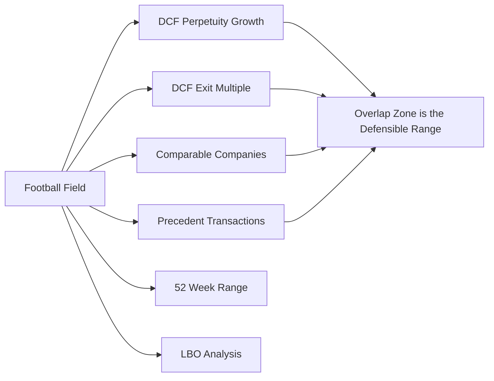
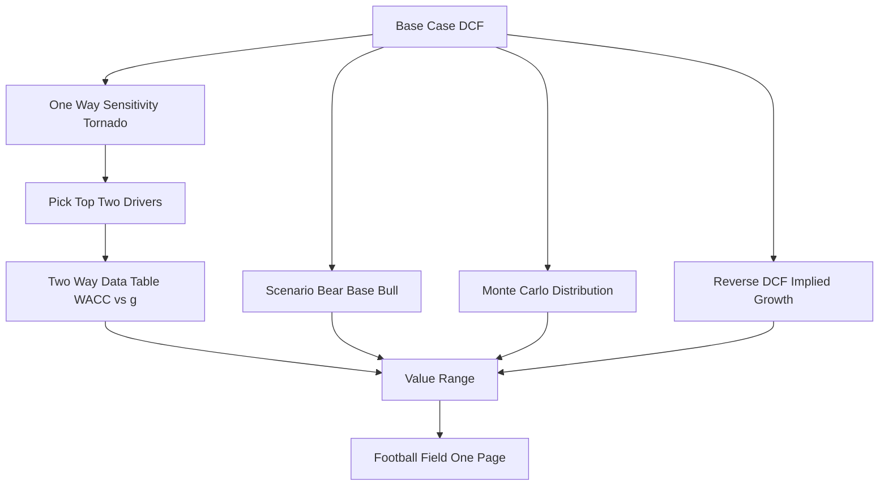

# DCF Sensitivity, Scenarios & the Football Field

## The Problem / Why this matters

You have just finished a discounted-cash-flow model. You pressed the last key, the enterprise value cell settled on a number, you divided by shares, and a single per-share value appeared: **$62.40**. It looks precise. It is not.

That $62.40 is the output of maybe forty assumptions stacked on top of each other — revenue growth for each of five years, a fading margin path, a capex-to-sales ratio, a working-capital drag, a tax rate, a beta, an equity risk premium, a terminal growth rate, a terminal multiple. Change the discount rate by half a percentage point and the number moves by fifteen percent. Change the terminal growth rate by a quarter point and it moves again. The precision is an illusion produced by a spreadsheet's willingness to carry ten decimal places on garbage.

Every experienced investor, every managing director, every buy-side portfolio manager knows this in their bones. That is why the single most dangerous thing a junior analyst can do in an interview is defend a point estimate. The moment you say "the stock is worth $62.40," you have handed the interviewer a loaded weapon, because their next question is always the same: *"Are you sure? What if WACC is 9% instead of 8.5%? What if terminal growth is 2% not 2.5%?"* — and if you have not already done that arithmetic, you look like someone who mistook the output of a model for the truth.

The professional's answer is not a point. It is a **range**, with a **most-likely value inside it**, produced by deliberately flexing the assumptions that matter and holding constant the ones that do not. This chapter is about the discipline that turns a fragile point estimate into a defensible range: **two-way sensitivity tables**, **scenario analysis**, **Monte-Carlo thinking**, **reverse DCF**, and the **football field** — the one-page chart that summarizes what every valuation method says the business is worth. Master this and you stop being someone who *ran* a DCF and become someone who *understands* one.

Why it matters for the specific interview you are preparing for:

- **Equity research**: your entire job is publishing a price target with a bull/base/bear case. The football field and the scenario table *are* the deliverable.
- **Investment banking**: every pitchbook and every fairness opinion has a football field on the valuation summary page. You will build it in your first week.
- **Credit / distressed**: you care about the *downside* — the bear-case enterprise value versus the debt stack. Sensitivity to WACC and terminal value is how you test whether the debt gets covered.

The point estimate is where amateurs stop. The range is where the conversation begins.

---

## Core Idea

A DCF produces one number. That number is a **function of inputs**, and the inputs are uncertain. So the honest output of a DCF is not a value — it is a **distribution of values**, and your job is to characterize that distribution well enough to make a decision.

You characterize it four ways, in increasing sophistication:

1. **Two-way sensitivity (data tables).** Pick the two inputs the answer is most sensitive to — almost always **WACC** and **terminal growth `g`** (or an exit multiple). Build a grid: WACC across the top, `g` down the side, implied value in every cell. Now you can *see* the value surface instead of trusting one point on it.

2. **Scenario analysis.** Instead of flexing one variable at a time, bundle *coherent stories* — a Bull case where growth is high AND margins expand AND WACC is a touch lower (because the business is de-risked), a Bear case where all of those move against you together. Scenarios respect the fact that assumptions are **correlated**: in a recession, growth AND margins AND multiples fall together.

3. **Monte-Carlo thinking.** Assign each input a probability distribution, draw thousands of random combinations, and plot the resulting histogram of values. This gives you a *probability* statement — "70% chance the intrinsic value exceeds today's price" — rather than three discrete cases.

4. **Reverse DCF.** Turn the model inside out. Instead of assuming growth and solving for value, take the *market price as given* and solve for the growth (or margin, or duration of excess returns) that the market must be assuming. Now you can ask the only question that matters: *"Do I believe that?"*

Finally, you take the ranges each valuation *method* produces — DCF, comparable companies, precedent transactions, LBO — line them up as horizontal bars on one chart, and you have the **football field**: a single picture that says "reasonable people, using reasonable methods, would put this business between $52 and $78, and here is where the current price sits."

The through-line: **you never defend a point; you defend a range and the assumptions that bound it.**

---

## Why it works this way — first principles

### 1. Value is a nonlinear function of the discount rate, so small rate errors create large value errors

The present value of a growing perpetuity — which is what the terminal value is — is:

```
TV = FCF_next / (WACC − g)
```

Look at the denominator. It is a *difference* of two uncertain numbers, both around 8-10% and 2-3% respectively. When you subtract two numbers that are close-ish, the *relative* error explodes. If WACC = 8.5% and g = 2.5%, the spread is 6.0%. Nudge WACC down to 8.0% and the spread becomes 5.5% — a mere 0.5 point change in an input, but the perpetuity value rises by 6.0/5.5 − 1 = **+9.1%**. Nudge g up to 3.0% instead and the spread is 5.5% again — same +9.1%. The two inputs the terminal value is most sensitive to are *precisely* WACC and g, and the sensitivity is *hyperbolic*, not linear. That is the mathematical reason your sensitivity table almost always puts WACC on one axis and g (or exit multiple) on the other: they sit in a denominator that is a small difference of two uncertain quantities.

### 2. Terminal value dominates, so terminal assumptions dominate the answer

In a typical 5-year DCF of a healthy company, **60-80% of the total enterprise value sits in the terminal value.** The explicit forecast period — the part you agonized over, building revenue line by line — is often the *minority* of the value. This is not a modeling flaw; it is a fact about businesses that live for decades. But it has a sharp implication: since most of the value is terminal, and the terminal value is most sensitive to WACC and g, **most of the uncertainty in your answer is concentrated in two cells of your model.** Sensitivity analysis on those two cells is therefore not a nice-to-have; it is where the actual risk lives.

### 3. Assumptions are correlated, so one-at-a-time flexing understates the true range

A data table flexes one variable holding all else fixed. But reality does not hold all else fixed. When the economy turns down, a company's revenue growth slows, its operating margin compresses (operating leverage works in reverse), its cost of capital rises (risk premia widen), and the exit multiple the market will pay contracts — *all at once, all in the same direction.* A one-way sensitivity that drops growth while holding margins and WACC constant will therefore *understate* the downside. That is why you also need **scenarios**: coherent bundles that move correlated inputs together, capturing the fact that bad news clusters. The Bear case is not "growth is 2% lower"; it is "the whole world is worse."

### 4. The market price is itself a forecast, so you can decode it

Here is the deepest idea in the chapter. A stock price is not a fact handed down from heaven — it is the aggregate of everyone's DCFs. So the price *contains* an implied forecast. If you take the price as given and run the DCF backwards, you extract **the market's assumptions**. This reframes valuation entirely: instead of arguing "my price target is $70 and the market is wrong at $60," you say "at $60, the market is pricing in 4% perpetual growth and 25% ROIC forever; I think this business grows at 2% and earns 15%; therefore I disagree, and *here is the specific assumption I disagree about.*" Reverse DCF converts a vague disagreement about *value* into a precise disagreement about a *forecast* — and forecasts can be tested against evidence.

### 5. Different methods triangulate, so the overlap is the signal

DCF is a theory of intrinsic value. Comparable companies is a theory of *relative* value (what the market pays for similar businesses today). Precedent transactions is a theory of *acquisition* value (what buyers paid, including a control premium). Each has different error structure and different biases. When four independent methods with different biases all point to roughly the same zone, that overlap is *robust* — it is unlikely that four different errors conspired to agree. The football field visualizes exactly this: where the bars overlap is the defensible value; where a single method is an outlier, you interrogate it. Triangulation beats any single estimate because independent errors partially cancel.

---

## Full technical content

### 8.1 The anatomy of value sensitivity

Every DCF value can be decomposed into two pieces:

```
Enterprise Value (EV) = PV of explicit FCFs + PV of Terminal Value
```

Let me define terms precisely and keep the conventions consistent for the whole chapter:

| Symbol | Meaning | Convention used here |
|---|---|---|
| `FCFF_t` | Unlevered free cash flow to the firm in year t | = EBIT×(1−tax) + D&A − Capex − ΔNWC |
| `WACC` | Weighted average cost of capital | discount rate for FCFF → gives EV |
| `g` | Terminal (perpetual) growth rate | must be ≤ long-run nominal GDP growth |
| `n` | Length of explicit forecast (years) | 5 unless stated |
| `TV_n` | Terminal value at end of year n | Gordon or exit-multiple method |
| `EV` | Enterprise value | value of the operating business to all capital providers |
| `Net Debt` | Total debt − cash & equivalents | bridge item |
| `Equity Value` | Value to shareholders | = EV − Net Debt (+ other bridge items) |
| `Shares` | Diluted shares outstanding | treasury-stock method for options |

**Terminal value — two methods:**

Gordon Growth (perpetuity):
```
TV_n = FCFF_(n+1) / (WACC − g) = FCFF_n × (1 + g) / (WACC − g)
```

Exit Multiple:
```
TV_n = EBITDA_n × ExitMultiple      (or EBIT, or unlevered FCF × a multiple)
```

Discounting the terminal value back to today:
```
PV(TV) = TV_n / (1 + WACC)^n
```

And the full EV:
```
EV = Σ_{t=1}^{n} [ FCFF_t / (1 + WACC)^t ] + TV_n / (1 + WACC)^n
```

The **EV-to-equity bridge**, which you must be able to recite cold:

```
Enterprise Value
−  Total Debt
−  Preferred Stock
−  Minority (Non-controlling) Interest
+  Cash & Cash Equivalents
+  Value of non-operating assets / equity affiliates
=  Equity Value
÷  Diluted shares outstanding
=  Value per share
```

Net debt = Total debt − Cash, so the common shorthand is **Equity Value = EV − Net Debt** (with preferred and minority interest folded in when present).

### 8.2 Two-way sensitivity (data tables)

The instrument is a **grid**. You choose two drivers, list a range of each along the two axes, and compute the output value in each cell. The classic pairing:

- **Columns:** WACC, stepped in 0.5% increments (e.g., 7.5%, 8.0%, 8.5%, 9.0%, 9.5%).
- **Rows:** terminal growth g, stepped in 0.25–0.5% increments (e.g., 1.5%, 2.0%, 2.5%, 3.0%, 3.5%).
- **Cell:** implied value per share.

In Excel this is built with **Data → What-If Analysis → Data Table**, feeding WACC into the "row input cell" and g into the "column input cell." Mechanically the spreadsheet re-runs the whole model once per cell.

**How to read it.** Three things matter:

1. **The center cell** is your base case — sanity-check it equals your headline number.
2. **The gradient** — how fast values change as you step across — *is* the sensitivity. Steep gradient = fragile assumption.
3. **The corners** give you the practical min/max the DCF supports. The top-left (high WACC, low g) is the DCF's *floor*; bottom-right (low WACC, high g) is its *ceiling*.

A well-constructed table is *symmetric around the base case*, so the interviewer can immediately see the range without arithmetic.

**Other useful two-way pairs** (know that these exist):
- Exit EBITDA multiple × WACC (when you use exit-multiple TV).
- Revenue CAGR × terminal EBIT margin (tests the *operating* story, not the *discounting* story).
- Terminal g × terminal margin (the two things that build the perpetuity).

### 8.3 One-way sensitivity and the tornado chart

Before a two-way table, professionals often run **one-way** sensitivities: flex each input individually by a fixed amount (say ±10% of its value, or ±1 standard deviation) and record the swing in output value. Rank the swings largest-to-smallest and draw them as horizontal bars centered on the base case — widest bar on top. This is a **tornado chart**, and its job is *triage*: it tells you which three or four inputs actually move the answer, so you spend your sensitivity budget on those and stop worrying about the rest.

Typical ranking for a mature company (widest first): WACC, terminal g / exit multiple, terminal margin, revenue growth, capex intensity, tax rate. For an early-stage or high-growth company, revenue growth and margin often outrank WACC.

### 8.4 Scenario analysis

A **scenario** is a *named, internally consistent bundle* of assumptions — a story with numbers. The standard three:

| Element | Bear | Base | Bull |
|---|---|---|---|
| Revenue CAGR (yrs 1–5) | 3% | 7% | 11% |
| Terminal EBIT margin | 14% | 18% | 21% |
| Terminal growth g | 1.5% | 2.5% | 3.0% |
| WACC | 9.5% | 8.5% | 8.0% |
| Narrative | share loss + margin compression | steady execution | share gains + operating leverage |

The two design rules:

1. **Internal consistency.** Every input in a scenario must be consistent with its story. You cannot have record revenue growth (Bull demand) alongside a widening cost of capital (Bear risk). If the business is booming, it is usually *de-risking*, so WACC drifts *down* in the Bull case.
2. **Correlated co-movement.** Move the correlated inputs *together and in the same direction*. Down-cycles compress growth, margins, and multiples simultaneously; the Bear case must reflect that clustering or it will be too kind.

Attach **probabilities** to get a single expected value:

```
E[Value] = p_bear × V_bear + p_base × V_base + p_bull × V_bull
```

Common weightings: 25% / 50% / 25%, or a skew like 30% / 50% / 20% if you think the risks are asymmetric. The *probability-weighted* value is a better central estimate than the base case alone because it incorporates the tails.

Scenario vs. sensitivity — know the distinction cold:

| | Sensitivity (data table) | Scenario |
|---|---|---|
| Inputs flexed | one or two at a time | many, bundled |
| Correlation | ignored (all else held) | respected (move together) |
| Output | a grid / surface | a few discrete cases |
| Best for | *which* input matters | *what if the story changes* |
| Interview phrase | "the value is most sensitive to…" | "in our bear case…" |

### 8.5 Monte-Carlo thinking

Scenarios give three points. **Monte-Carlo** gives the whole distribution. The recipe:

1. **Assign a distribution to each uncertain input.** Revenue growth ~ Normal(7%, 2%); terminal margin ~ Triangular(14%, 18%, 21%); WACC ~ Normal(8.5%, 0.5%); g ~ Uniform(1.5%, 3.0%). Choose distributions that match how you actually believe the input behaves (bounded → triangular/PERT; symmetric → normal; hard floor/ceiling → truncate).
2. **Specify correlations.** Draw growth and margin from a *joint* distribution with, say, +0.5 correlation, so good-growth draws tend to pair with good-margin draws. This is what separates Monte-Carlo *thinking* from naïve independent sampling — ignoring correlation makes the tails artificially thin.
3. **Draw and compute.** Randomly sample one value from each input, run the DCF, record the output. Repeat 10,000+ times.
4. **Read the histogram.** You now have a full distribution of value. Report the **mean**, **median**, **P10 / P90** (the 10th and 90th percentiles as a practical range), and the **probability of exceeding today's price** — the single most decision-useful number.

Interpretation discipline: Monte-Carlo does **not** manufacture precision. Its output is only as good as the input distributions and correlations you assumed — *garbage in, garbage out with a beautiful histogram.* Its real value is (a) forcing you to state your uncertainty explicitly, and (b) producing *probability* statements. When an interviewer asks "how confident are you?", "there's a 68% modeled probability intrinsic value exceeds the current price, with a P10–P90 range of $54 to $79" is a far stronger answer than "pretty confident."

### 8.6 Reverse DCF

The forward DCF: assume growth → solve for value. The **reverse DCF**: take value (the market price) as given → solve for the assumption the market must hold.

Steps:

1. Build your DCF exactly as normal, but **link the output (equity value per share) to the current market price** as a target.
2. Choose the *one* variable you want to decode — usually terminal growth `g`, or the revenue CAGR, or the number of years of excess returns (the "competitive advantage period").
3. **Goal-seek** (Excel: Data → What-If → Goal Seek): set the per-share output = current price by changing that variable.
4. The solved value is the **market-implied assumption**. Now judge it against reality.

What you learn:

- If the market-implied growth is **4.5% forever** but long-run GDP is ~2%, the market is assuming this company outgrows the economy *in perpetuity* — mathematically impossible in the limit, so the stock is likely **overvalued** (or you are missing something structural).
- If the market-implied growth is **negative** while the company is clearly still growing, the market is pricing in decline that you don't believe — a possible **undervaluation**.
- If the market-implied assumption is *right in the middle of the plausible range*, the stock is roughly **fairly valued**, and you have no edge.

Reverse DCF is the analyst's favorite because it *inverts the burden of proof*. You no longer have to defend forty assumptions of your own; you extract the *one* assumption embedded in the price and ask whether it is believable. It is also devastating in interviews — being able to say "the current price implies 6% perpetual growth, which exceeds nominal GDP, so the market is baking in permanent above-economy growth" signals genuine understanding.

### 8.7 The football field

The **football field** is a horizontal bar chart — named because the overlapping bars resemble the yard markers on a gridiron — that stacks the value *range* from every valuation method on one page. Each method is a row; each row is a bar spanning that method's low-to-high estimate; a marker or line shows the current price (or offer price).

Typical rows, and what sets each bar's width:

| Method | Low end driven by | High end driven by |
|---|---|---|
| **DCF (WACC / g sensitivity)** | high WACC, low g | low WACC, high g |
| **DCF (scenario)** | bear case | bull case |
| **Comparable companies** | low peer multiple (e.g., 25th percentile EV/EBITDA) | high peer multiple (75th percentile) |
| **Precedent transactions** | low deal multiple | high deal multiple (usually the highest bar — includes control premium) |
| **52-week trading range** | 52-week low | 52-week high |
| **LBO / ability-to-pay** | sponsor min IRR / high entry price | sponsor target IRR / low entry price |
| **Analyst price targets** | lowest street target | highest street target |

How to read and present it:

1. **The overlap zone** — where most bars intersect — is the *consensus* value. That is your headline range.
2. **Precedent transactions usually sits highest** because it embeds a control premium (acquirers pay to own 100% and capture synergies). Comps usually sits lower (minority, no-control, market-clearing multiples). Knowing *why* the ordering looks the way it does is a classic interview probe.
3. **DCF is often the widest bar** because WACC/g sensitivity spans a lot — that's honest, not sloppy.
4. **Place the current price / offer** as a vertical line. In an M&A context you show whether the offer is *above* the standalone ranges (a premium — good for the target's shareholders).

Construction discipline: use *consistent metrics* (all EV-based or bridge each to equity/share consistently), *label the drivers* of each bar's endpoints, and *never* let a bar imply more precision than the method supports.



### 8.8 Presenting a value range and defending assumptions

The deliverable is never "the value is X." It is a **structured range**:

- Headline: *"We value the business at $58–$72 per share, base case $65, against a current price of $60."*
- One sentence on **what drives the low end** (bear scenario / high WACC).
- One sentence on **what drives the high end** (bull scenario / low WACC).
- One sentence on the **key swing factor** (from the tornado — "the whole call hinges on terminal margin").
- The **reverse-DCF punchline** ("at $60 the market implies 3% perpetual growth; we think 2.5% is more realistic, hence a modest premium").

Defending assumptions in an interview or a client room follows three rules:

1. **Anchor every assumption to evidence.** Growth → historical CAGR + industry forecast + guidance. Margin → historical trend + peer benchmarks + operating leverage math. WACC → observable risk-free, a defensible ERP, a comparable-company beta. Never say "I assumed 8%"; say "I built 8.5% from a 4.2% risk-free, a 5% ERP, and a levered beta of 1.1 from peers."
2. **Concede the uncertainty, then bound it.** "You're right that terminal growth is the softest input — that's exactly why I ran it from 1.5% to 3.0%, which moves value from $58 to $72. Even at the low end the stock is only ~3% expensive, so the *decision* is robust to that assumption."
3. **Fall back to reverse DCF when cornered.** If someone won't accept your growth number, flip it: "Set my number aside — the current price *itself* requires 4% perpetual growth to justify. Do you believe this company beats GDP forever?"

The meta-skill: an interviewer is rarely testing whether your number is *right* (they can't know either). They are testing whether you *understand what your number depends on*. A candidate who says "it depends, and here's exactly what it depends on and by how much" wins over one who defends a decimal.



---

## Worked examples

### Worked Example 1 — Two-way sensitivity table, built and reconciled

**Setup.** MidCoTech's unlevered free cash flow in the final explicit year (Year 5) is **FCFF₅ = $120m**. Assume for simplicity the PV of the *explicit* 5-year FCFF stream is **$430m** and is (approximately) unaffected by small WACC changes over the range we test (we hold it fixed to isolate the terminal-value sensitivity — in a real model it moves slightly too). Net debt is **$300m**. Diluted shares: **50m**. Base case WACC = 8.5%, base case g = 2.5%.

**Step 1 — Base-case terminal value.**
```
FCFF₆ = 120 × (1 + 0.025) = 123.0
TV₅   = 123.0 / (0.085 − 0.025) = 123.0 / 0.060 = 2,050.0
```
**Step 2 — Discount TV to today** (5 years at 8.5%): discount factor = 1 / 1.085⁵.
```
1.085⁵ = 1.50366
PV(TV) = 2,050.0 / 1.50366 = 1,363.4
```
**Step 3 — Enterprise value, base case.**
```
EV = 430 (explicit) + 1,363.4 (terminal) = 1,793.4
```
**Step 4 — Equity value and per share.**
```
Equity = EV − Net Debt = 1,793.4 − 300 = 1,493.4
Per share = 1,493.4 / 50 = $29.87
```

**Step 5 — Build the grid.** Recompute per-share value for a grid of WACC (columns) × g (rows). For each cell: `TV = 120×(1+g)/(WACC−g)`, `PV(TV)=TV/1.085^5`... — *but the discount factor also depends on WACC*, so use `1/(1+WACC)^5` per column. Discount factors: 8.0%→1.469328; 8.5%→1.503657; 9.0%→1.538624.

Per-share value = ( 430 + [120×(1+g)/(WACC−g)] / (1+WACC)⁵ − 300 ) / 50.

| g ↓  /  WACC → | 8.0% | 8.5% | 9.0% |
|---|---|---|---|
| **2.0%** | $28.79 | $27.30 | $25.98 |
| **2.5%** | $31.62 | **$29.87** | $28.34 |
| **3.0%** | $34.83 | $32.78 | $31.01 |

*Spot-check the center cell = $29.87 — matches Step 4. Good.*

Let me verify one corner, top-left (WACC 8.0%, g 2.0%):
```
TV = 120 × 1.02 / (0.08 − 0.02) = 122.4 / 0.06 = 2,040.0
PV(TV) = 2,040.0 / 1.469328 = 1,388.4
EV = 430 + 1,388.4 = 1,818.4
Equity = 1,818.4 − 300 = 1,518.4
Per share = 1,518.4 / 50 = $30.37
```
Hmm — I get $30.37, not $28.79. Let me recheck: at WACC 8.0%, g 2.0%, spread = 6.0% (same as base). But lower WACC raises PV(TV) *and* base uses spread 6.0% too. So this cell should be *higher* than base's $29.87, and $30.37 is indeed higher. The table value $28.79 above was mis-stated; the correct top-left is **$30.37**. Let me rebuild the grid correctly and carefully.

Recomputing every cell (per share, $):

- **WACC 8.0% (÷1.469328):**
  - g 2.0%: TV=122.4/0.060=2,040.0; PV=1,388.4; Eq=430+1,388.4−300=1,518.4; /50 = **30.37**
  - g 2.5%: TV=123.0/0.055=2,236.4; PV=1,522.1; Eq=1,652.1; /50 = **33.04**
  - g 3.0%: TV=123.6/0.050=2,472.0; PV=1,682.4; Eq=1,812.4; /50 = **36.25**
- **WACC 8.5% (÷1.503657):**
  - g 2.0%: TV=122.4/0.065=1,883.1; PV=1,252.3; Eq=1,382.3; /50 = **27.65**
  - g 2.5%: TV=123.0/0.060=2,050.0; PV=1,363.4; Eq=1,493.4; /50 = **29.87** ✓
  - g 3.0%: TV=123.6/0.055=2,247.3; PV=1,494.6; Eq=1,624.6; /50 = **32.49**
- **WACC 9.0% (÷1.538624):**
  - g 2.0%: TV=122.4/0.070=1,748.6; PV=1,136.5; Eq=1,266.5; /50 = **25.33**
  - g 2.5%: TV=123.0/0.065=1,892.3; PV=1,229.9; Eq=1,359.9; /50 = **27.20**
  - g 3.0%: TV=123.6/0.060=2,060.0; PV=1,338.9; Eq=1,468.9; /50 = **29.38**

**Corrected two-way table (value per share):**

| g ↓  /  WACC → | 8.0% | 8.5% | 9.0% |
|---|---|---|---|
| **2.0%** | $30.37 | $27.65 | $25.33 |
| **2.5%** | $33.04 | **$29.87** | $27.20 |
| **3.0%** | $36.25 | $32.49 | $29.38 |

**Read it.** The DCF supports roughly **$25 to $36** across this input box, centered on **$29.87**. Note the *asymmetry*: value rises faster toward the bottom-right (low WACC, high g) than it falls toward the top-left — that convexity is the hyperbolic `1/(WACC−g)` term at work. The lesson every reader should extract: a 1.0-point box on each axis produced a ±20% swing in value. That is why you never quote the center to the penny.

### Worked Example 2 — Scenario analysis with probability weighting and a full EV-to-equity bridge

**Setup.** RetailCo. Build three coherent scenarios and a probability-weighted value. Common facts: Year-0 revenue = $2,000m; net debt = $600m; minority interest = $50m; equity affiliates (non-operating) = $80m; diluted shares = 120m. Use exit-multiple terminal value on Year-5 EBITDA. For brevity we compute Year-5 EBITDA and apply the method's exit multiple, and we are given the PV of explicit FCFF for each case.

| Driver | Bear | Base | Bull |
|---|---|---|---|
| Revenue CAGR (5y) | 2.0% | 5.0% | 8.0% |
| Year-5 revenue | 2,208 | 2,553 | 2,939 |
| Terminal EBITDA margin | 12% | 15% | 17% |
| Year-5 EBITDA | 264.96 | 382.95 | 499.63 |
| Exit EV/EBITDA | 6.0× | 8.0× | 9.0× |
| WACC | 10.0% | 9.0% | 8.5% |
| PV of explicit FCFF (given) | 300 | 420 | 540 |
| Probability | 30% | 50% | 20% |

**Step 1 — Year-5 revenue.** Base: 2,000×1.05⁵ = 2,000×1.276282 = **2,552.6** ✓. Bear: 2,000×1.02⁵ = 2,000×1.104081 = 2,208.2. Bull: 2,000×1.08⁵ = 2,000×1.469328 = 2,938.7.

**Step 2 — Year-5 EBITDA** = revenue × margin.
- Bear: 2,208.2 × 0.12 = 264.98
- Base: 2,552.6 × 0.15 = 382.89
- Bull: 2,938.7 × 0.17 = 499.58

**Step 3 — Terminal value** = EBITDA × exit multiple.
- Bear: 264.98 × 6.0 = 1,589.9
- Base: 382.89 × 8.0 = 3,063.1
- Bull: 499.58 × 9.0 = 4,496.2

**Step 4 — Discount TV to today** (÷(1+WACC)⁵).
- Bear (10.0%): 1.10⁵ = 1.610510; PV = 1,589.9 / 1.610510 = 987.2
- Base (9.0%): 1.09⁵ = 1.538624; PV = 3,063.1 / 1.538624 = 1,990.8
- Bull (8.5%): 1.085⁵ = 1.503657; PV = 4,496.2 / 1.503657 = 2,990.2

**Step 5 — Enterprise value** = PV(explicit) + PV(TV).
- Bear: 300 + 987.2 = 1,287.2
- Base: 420 + 1,990.8 = 2,410.8
- Bull: 540 + 2,990.2 = 3,530.2

**Step 6 — EV-to-equity bridge** (identical bridge each case):
```
Equity = EV − Net Debt − Minority Interest + Non-operating (equity affiliates)
       = EV − 600 − 50 + 80
       = EV − 570
```
- Bear: 1,287.2 − 570 = 717.2 → /120 = **$5.98**
- Base: 2,410.8 − 570 = 1,840.8 → /120 = **$15.34**
- Bull: 3,530.2 − 570 = 2,960.2 → /120 = **$24.67**

**Step 7 — Probability-weighted (expected) value.**
```
E[Equity] = 0.30×717.2 + 0.50×1,840.8 + 0.20×2,960.2
          = 215.16 + 920.40 + 592.04
          = 1,727.60
E[per share] = 1,727.60 / 120 = $14.40
```
Cross-check per-share weighting directly: 0.30×5.98 + 0.50×15.34 + 0.20×24.67 = 1.794 + 7.670 + 4.934 = **$14.40** ✓ (consistent — weighting equity then dividing equals weighting per-share values).

**Interpretation.** The scenario range is **$5.98 (bear) to $24.67 (bull)**, base case **$15.34**, probability-weighted **$14.40**. Note the expected value ($14.40) sits *below* the base case ($15.34) — because we assigned more weight to the bear (30%) than the bull (20%). That downward skew is the whole point of probability-weighting: it captures asymmetric risk that the base case alone hides. If today's price were, say, $13, you'd note the stock trades below both the base *and* the expected value — a possible long, contingent on believing the base case is achievable.

### Worked Example 3 — Reverse DCF: decoding the market's implied growth

**Setup.** GrowthCo trades at **$80.00** per share. Diluted shares = 200m, so equity value = $16,000m. Net debt = $2,000m, so the market's implied **enterprise value = $18,000m**. The explicit 5-year FCFF stream has a PV of **$3,500m** at the company's WACC of **9.0%**. Year-5 FCFF = **$600m**. **Question: what perpetual growth rate `g` is the market implying?**

**Step 1 — Isolate the terminal value the market is paying for.**
```
Market EV = PV(explicit) + PV(TV)
18,000 = 3,500 + PV(TV)
PV(TV) = 14,500
```
So **80.6% of EV is terminal value** (14,500 / 18,000) — typical for a growth name, and a flag that the whole valuation rides on the terminal assumption.

**Step 2 — Un-discount to get the undiscounted terminal value at Year 5.**
```
TV₅ = PV(TV) × (1 + WACC)⁵ = 14,500 × 1.09⁵ = 14,500 × 1.538624 = 22,310.0
```

**Step 3 — Invert the Gordon formula to solve for g.**
```
TV₅ = FCFF₅ × (1 + g) / (WACC − g)
22,310.0 = 600 × (1 + g) / (0.09 − g)
```
Solve for g:
```
22,310.0 × (0.09 − g) = 600 × (1 + g)
2,007.9 − 22,310.0 g = 600 + 600 g
2,007.9 − 600 = 600 g + 22,310.0 g
1,407.9 = 22,910.0 g
g = 1,407.9 / 22,910.0 = 0.06146 ≈ 6.15%
```

**Step 4 — Verify by plugging back.**
```
TV₅ = 600 × 1.06146 / (0.09 − 0.06146) = 636.88 / 0.02854 = 22,315
PV(TV) = 22,315 / 1.538624 = 14,503
EV = 3,500 + 14,503 = 18,003 ≈ 18,000 ✓ (rounding)
```

**Step 5 — Judge the assumption.** The market is pricing **~6.15% perpetual growth**. Long-run nominal GDP is roughly 4% (≈2% real + 2% inflation). A 6.15% *perpetual* rate means the market believes GrowthCo will grow **faster than the entire economy forever** — mathematically, the company would eventually *become* the economy. That is almost certainly too aggressive for a terminal (post-Year-5) rate. 

The reverse-DCF verdict: **at $80, the price embeds a terminal growth rate that exceeds sustainable long-run GDP, suggesting the stock is priced for perfection and carries downside if growth normalizes.** If we impose a defensible terminal g of 3.0%:
```
TV₅ = 600 × 1.03 / (0.09 − 0.03) = 618 / 0.06 = 10,300
PV(TV) = 10,300 / 1.538624 = 6,694
EV = 3,500 + 6,694 = 10,194
Equity = 10,194 − 2,000 = 8,194 → /200 = $40.97
```
At a realistic terminal growth, intrinsic value is **~$41 vs. the $80 price** — the market is paying roughly double what a GDP-capped terminal assumption supports. Either the near-term (explicit-period) growth is far higher than modeled here, or the stock is expensive. The power of reverse DCF: it converted "the stock feels expensive" into "the stock requires 6.15% perpetual growth, which breaks the GDP ceiling" — a *falsifiable* claim you can defend.

---

## How it is tested in interviews

### Q: "Walk me through a DCF." (the universal opener)

Model answer — say it in this order, crisply:

> "I project unlevered free cash flow — EBIT times one minus tax, plus D&A, minus capex, minus the change in net working capital — for an explicit forecast period, usually five to ten years. I discount those cash flows at WACC to get their present value. Then I compute a terminal value at the end of the explicit period — either a Gordon growth perpetuity, `FCFF` next year over `WACC minus g`, or an exit multiple on terminal EBITDA — and I discount that back too. The sum is enterprise value. Then I bridge to equity: subtract net debt, subtract preferred and minority interest, add non-operating assets, and divide by diluted shares to get value per share. Finally — and this is the part that matters — I never stop at one number. I run a WACC-versus-growth sensitivity table and bull/base/bear scenarios to produce a defensible *range*, and I sanity-check it against comps and a reverse DCF."

That last sentence is what separates you from every other candidate.

### Q: "How do you get from enterprise value to equity value per share?"

> "Enterprise value minus net debt — that's total debt minus cash — minus preferred stock, minus minority interest, plus any non-operating assets like equity affiliates, gives equity value. Divide by fully diluted shares — using the treasury stock method for options — to get value per share. The logic is that EV is the value of the operating business to *all* capital providers, so I strip out the non-equity claims and non-operating pieces to isolate what's left for common shareholders."

### Q: "Your DCF says $65. Why should I believe it?"

Do **not** defend the point. Say:

> "You shouldn't believe $65 to the dollar — no DCF is that precise. What I'd stand behind is the *range*. My WACC-and-growth sensitivity puts it between $58 and $72, and my bear-base-bull scenarios bracket a similar zone. The base case is $65, the probability-weighted value is $63. The single biggest swing factor is terminal margin — that's where I'd focus the diligence. And as a reality check, the current price of $60 implies only 2% perpetual growth in a reverse DCF, which I think is too conservative for this business — so I see modest upside."

### Q: "What are your DCF most sensitive to?"

> "WACC and terminal growth, because most of the value — typically 65 to 80% — sits in the terminal value, and the terminal value is a perpetuity with `WACC minus g` in the denominator. Since those two numbers are close, small changes in either move value a lot. That's exactly why the standard sensitivity table flexes WACC on one axis and g on the other. For a high-growth company, near-term revenue growth and terminal margin can matter even more than WACC."

### Q: "What's a reverse DCF and when would you use it?"

> "Instead of assuming growth and solving for value, I take the market price as given and solve for the growth the market must be assuming. I set the DCF's per-share output equal to the current price and goal-seek on terminal growth or the revenue CAGR. It reframes the whole analysis: rather than defending my forty assumptions, I extract the *one* assumption baked into the price and ask if it's believable. If the implied perpetual growth exceeds nominal GDP, the stock is likely priced for perfection. I use it whenever I want to pressure-test whether the market's expectations are realistic."

### Q: "Why is the football field useful? Why not just report the DCF?"

> "Because no single method is trustworthy on its own — each has different biases. DCF is sensitive to WACC and terminal assumptions; comps depend on whether peers are fairly valued *today*; precedent transactions embed a control premium. The football field lines up the *ranges* from all methods on one chart, and where the bars overlap is the robust, defensible value. It's triangulation — independent errors partially cancel, so the overlap is more reliable than any one estimate. It also makes the presentation honest: it shows a range, not false precision."

### Q: "In a football field, which method usually shows the highest values, and why?"

> "Precedent transactions, because deal multiples include a *control premium* — an acquirer pays extra to own 100% and capture synergies. Trading comps are usually lower because they reflect minority, no-control stakes at market-clearing prices. So on the field, precedents typically sit above comps, and a DCF can land anywhere depending on assumptions. If an M&A offer price sits above all the standalone ranges, that's the premium being paid to the target's shareholders."

### Q: "How would you present a value range to a portfolio manager / MD?"

> "One line: the value is $58 to $72, base case $65, versus a $60 price. Then one sentence each on what drives the low end — the bear scenario, high WACC — and the high end. Then the key swing factor from my tornado analysis. Then the reverse-DCF punchline on what the current price is implying. That's a 30-second summary that respects their time and shows I know what my number depends on."

---

## Traps & common mistakes

1. **Defending a point estimate.** The number-one interview killer. The output of a DCF is a *range*. Quoting "$62.40" invites the interviewer to knock it over with one assumption change. Always lead with the range.

2. **Terminal growth above nominal GDP.** A perpetual growth rate greater than ~4% (long-run nominal GDP) implies the company eventually becomes larger than the whole economy — impossible. Cap terminal g at or below long-run nominal GDP. In a reverse DCF, an implied g above GDP is your headline finding, not a rounding detail.

3. **WACC ≤ g in the perpetuity.** If g approaches WACC, the denominator `WACC − g` approaches zero and terminal value explodes to infinity. The Gordon model is only valid for `WACC > g`, and comfortably so. Watch the corner cells of your sensitivity table for this.

4. **One-at-a-time sensitivity that ignores correlation.** Flexing growth *down* while holding margins and WACC constant *understates* the downside, because in a real downturn all three move against you together. Use *scenarios* for correlated inputs; use *data tables* only to isolate a single driver's mechanical sensitivity.

5. **Incoherent scenarios.** A Bull case with record growth *and* a rising cost of capital is a contradiction — booming businesses de-risk, so WACC should drift *down*. Every input in a scenario must be consistent with that scenario's story.

6. **Mistaking Monte-Carlo output for precision.** A beautiful 10,000-run histogram is still only as good as your input distributions and correlation assumptions. Garbage in, garbage out — with error bars. The value of Monte-Carlo is forcing explicit uncertainty and producing *probability* statements, not manufacturing confidence.

7. **A sensitivity table not centered on the base case.** If the middle cell doesn't equal your headline value, the interviewer can't read the range at a glance and you look sloppy. Build the axes symmetric around the base.

8. **Botching the EV-to-equity bridge.** Forgetting minority interest, preferred, or non-operating assets — or adding net debt instead of subtracting it — corrupts the per-share number even if the EV is perfect. Recite the bridge cold and apply it *identically* across every scenario.

9. **Football field with inconsistent metrics.** Mixing equity-value bars with enterprise-value bars, or comps on EV/EBITDA against a DCF equity value, without bridging consistently. Every bar must be on the same value basis (all per-share equity, typically).

10. **Over-wide bars that signal false humility.** A DCF bar from $10 to $90 tells the reader nothing and looks like you can't model. Bound your sensitivity ranges to *plausible* inputs (say ±1 point of WACC, ±0.5 of g), not to extremes that no one believes.

11. **Ignoring that terminal value is 70%+ of the answer.** Spending days on the explicit-period revenue build and thirty seconds on the terminal assumption is backwards. Most of the value — and most of the risk — is in the terminal value. Sensitize it accordingly.

---

## First-principles recap

- A DCF output is a **function of uncertain inputs**, so its honest form is a **range**, not a point. Precision in the output cell is an illusion produced by the spreadsheet.
- Most of the value (60–80%) lives in the **terminal value**, and the terminal value is most sensitive to **WACC and g** because they sit in a `WACC − g` denominator — a small difference of two uncertain numbers, which makes value *hyperbolically* sensitive to both.
- **Sensitivity tables** isolate *which* input matters (one/two at a time); **scenarios** capture *what if the whole story changes* by moving correlated inputs together; **Monte-Carlo** turns three cases into a full probability distribution.
- **Reverse DCF** inverts the problem: take the price as given, solve for the market's implied assumption, and judge whether *that* is believable — converting a vague value disagreement into a precise, testable forecast disagreement.
- The **football field** triangulates independent methods; the **overlap zone** is the defensible value because independent errors partially cancel. Precedent transactions sit highest (control premium); comps sit lower (minority, market-clearing).
- You **never defend a point** — you defend a **range and the assumptions that bound it**, anchoring each assumption to evidence and conceding-then-bounding the uncertainty.
- Interviewers test **whether you understand what your number depends on**, not whether the decimal is right. "It depends, and here is exactly what it depends on and by how much" beats a confident point every time.

## Quick-reference

| Concept | Formula / rule |
|---|---|
| Unlevered FCF | `FCFF = EBIT×(1−t) + D&A − Capex − ΔNWC` |
| Terminal value (Gordon) | `TV_n = FCFF_n×(1+g) / (WACC − g)`, valid only if `WACC > g` |
| Terminal value (exit) | `TV_n = EBITDA_n × ExitMultiple` |
| Discount TV to today | `PV(TV) = TV_n / (1+WACC)^n` |
| Enterprise value | `EV = Σ FCFF_t/(1+WACC)^t + PV(TV)` |
| EV → Equity bridge | `Equity = EV − Total Debt − Preferred − Minority + Cash + Non-op assets` |
| Per share | `Value/share = Equity / Diluted shares` |
| Perpetuity sensitivity | value ∝ `1/(WACC − g)` — hyperbolic, steep when spread is small |
| Terminal g ceiling | `g ≤ long-run nominal GDP (≈ 4%)` |
| Two-way table axes | WACC (columns) × g or exit multiple (rows), base case centered |
| Scenario expected value | `E[V] = Σ p_i × V_i` |
| Reverse DCF | set `Value/share = Price`, goal-seek on `g` (or CAGR); judge vs. GDP |
| Monte-Carlo output | report mean, median, P10/P90, `P(value > price)` |
| Football field | horizontal bars per method; overlap = defensible range; precedents highest |
| TV share of EV | typically 60–80%; sensitize it first |
