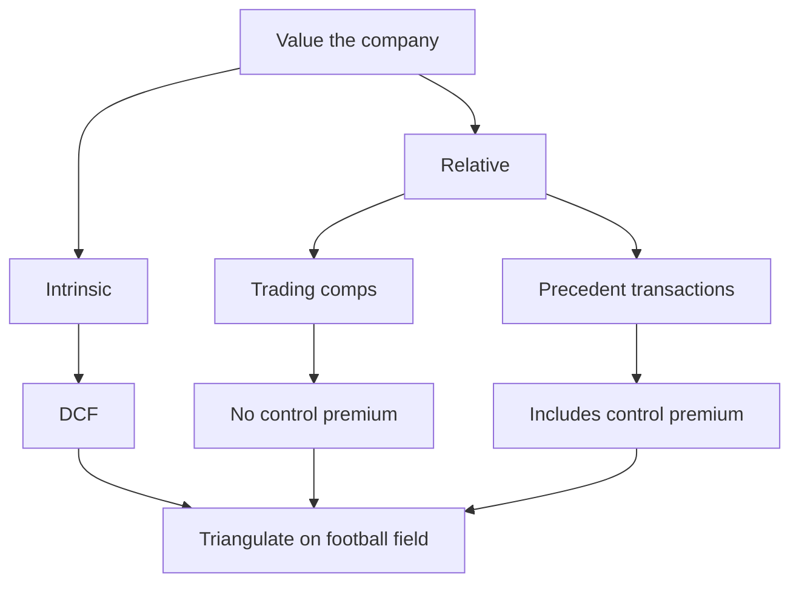

# Comparable Company Analysis (Trading Comps)

## The Problem / Why this matters

You are handed a company and asked the oldest question in finance: *what is it worth?* A discounted cash flow answers it from the inside out — forecast the cash, discount it, out pops a number. But a DCF is a fragile machine. It rests on a five-to-ten-year forecast, a discount rate, and a terminal value that is 70% of the answer. Move the WACC by 50 basis points and the value swings 15%. Interviewers know this, investors know this, and so nobody trusts a DCF that stands alone.

Comparable company analysis — "trading comps," "comps," "public comps," "the multiples approach" — answers the same question from the *outside in*. Instead of forecasting the company's own cash flows, it asks: **what price is the stock market putting on companies that look just like this one, right now?** If eight publicly traded specialty-chemicals businesses trade at a median of 9.0x forward EBITDA, and the company you are valuing is a ninth specialty-chemicals business, then absent a good reason it too should trade near 9.0x forward EBITDA. Multiply, adjust, done. You have a market-anchored value in an afternoon, not a week.

Here is why this matters for the interview and the job. Comps are the single most used valuation tool on Wall Street. An equity research analyst lives and dies by them — the "target price" at the bottom of a research note is usually a multiple applied to a forward estimate, not a DCF. In M&A, comps set the opening reference for what a buyer might pay. In an IPO, the underwriters price the deal off comps. In credit, the leverage and coverage multiples of peers set the covenant grid. If you cannot build, clean, and defend a comps table, you cannot do the job — and every interviewer knows it, which is why "walk me through how you'd value this company" almost always circles back to "and how would you pick the peer set?"

The catch — and the reason this chapter is long — is that comps are *deceptively* easy. Anyone can pull an EV/EBITDA off a screen and multiply. Doing it *correctly* means picking a genuinely comparable peer set, putting every company on the same time period (calendarization and LTM/NTM), cleaning the multiples for one-offs and non-operating junk, choosing the *right* multiple for the situation, and then adjusting for the fact that no two companies are ever truly identical — one grows faster, one has fatter margins, one carries more risk. The difference between a junior who "multiplies EBITDA by the peer number" and one who can explain *why the target deserves a discount to the peer median* is the difference between a mediocre and a strong hire.

## Core Idea

**The market has already valued businesses like the one in front of you. Find those businesses, express their prices as a ratio to some common financial yardstick, and apply that ratio to your company's yardstick.**

A multiple is just a ratio: **value in the numerator, a value driver in the denominator.** EV/EBITDA says "for every dollar of EBITDA this business produces, the market pays $9 of enterprise value." P/E says "for every dollar of earnings, investors pay $18 of equity value." The multiple is a compression of the entire DCF into a single number — it silently bundles growth, margins, risk, and reinvestment into one ratio. That is its genius (fast, market-tested) and its danger (opaque, easy to misapply).

The method has five moves, and the whole chapter is these five done rigorously:

1. **Select the peer set** — find companies genuinely comparable in business, size, geography, and economics.
2. **Standardize the inputs** — calendarize to a common period, pick LTM (trailing) or NTM (forward), and build a clean enterprise value.
3. **Calculate and clean the multiples** — compute EV/EBITDA, EV/Sales, P/E, etc., and strip out one-offs, non-operating items, and capital-structure noise.
4. **Choose the benchmark and apply it** — take a median or an adjusted peer multiple and multiply it by the target's driver to get a value.
5. **Adjust for differences** — the target is not the average peer; correct for growth, margin, and risk gaps, then bridge enterprise value to equity value to per share.


## Why it works this way — first principles

### A multiple is a DCF in disguise

The deepest thing to understand about comps — and the answer that separates strong candidates — is that **every multiple is a compressed discounted cash flow.** They are not two rival methods; they are the same theory viewed from two angles.

Start with the Gordon growth value of an equity:

```
P0 = D1 / (r - g)
```

Divide both sides by next-year earnings E1, and note the dividend is the payout ratio times earnings, D1 = E1 x payout:

```
P0 / E1 = payout / (r - g)
```

That is the forward P/E — and look what drives it: the **payout ratio** (a proxy for how much reinvestment is needed to grow), the **cost of equity r** (risk), and the **growth rate g**. A high-growth, low-risk, capital-light business *deserves* a high P/E, and this equation tells you exactly why. The multiple is not arbitrary; it is `payout / (r - g)` wearing a disguise.

The same logic runs through EV/EBITDA. A firm's enterprise value is the present value of its future free cash flow to the firm. EBITDA is a rough, pre-reinvestment proxy for that cash. So EV/EBITDA rises when growth is high, when the reinvestment needed to fund that growth is low (high cash conversion), and when the business risk (and thus WACC) is low. When an interviewer asks "why does Company A trade at 14x EBITDA and Company B at 7x?", the first-principles answer is always some combination of **A grows faster, converts more of its EBITDA to free cash, and/or is less risky.** Never "the market is just paying up." The market is paying up *for a reason*, and your job is to name it.

This is why comps and DCF should agree. If they wildly disagree, one of them encodes an assumption the other rejects — and finding that assumption is where the real analysis happens.

### Why relative valuation is trusted at all

If a multiple is just a DCF, why not always do the DCF? Three reasons, all first-principles:

1. **It uses live market prices, not your assumptions.** A DCF is your opinion. A comp is the collective opinion of every investor who priced the peer stocks today. When you tell a client "your company is worth 9x EBITDA," you are not asking them to trust your model — you are showing them what the market pays for identical businesses. That is far harder to argue with.

2. **The errors partly cancel.** Suppose the entire stock market is 10% overvalued. Your DCF (if honest) would not capture that, but a comp automatically does — because you are valuing your company *relative to* other companies that are also 10% rich. Comps measure relative, not absolute, value, and for many real-world decisions (should I buy A or B? what price clears an IPO?) relative value is exactly what you want.

3. **It is fast and legible.** A managing director can sanity-check "peers trade at 9x, we're saying 8.5x" in five seconds. Nobody sanity-checks a 4,000-row DCF in five seconds.

The flip side — and you must say this too — is that comps **inherit the market's mistakes.** If the whole sector is in a bubble, comps will tell you the bubble price is fair. Comps answer "what is the market paying for this?" not "what is this truly worth?" A good analyst holds both: DCF for intrinsic value, comps for market-relative value, and *triangulates.*

### Why "comparable" is the whole game

The entire method rests on one assumption: **the peers are genuinely comparable.** The multiple `payout / (r - g)` is only transferable from peer to target if the peer and target share similar r (risk) and g (growth) and reinvestment needs. Two companies in the same SIC code but with different growth rates do *not* deserve the same multiple, and blindly applying one to the other is the number-one error in the whole discipline. Everything downstream — calendarization, cleaning, adjustment — is in service of making the comparison apples-to-apples so that the transferred multiple actually means something.

## Full technical content

### 1. Selecting the peer set

The peer set is the foundation; a beautiful table built on the wrong peers is worthless. You are looking for companies whose **future cash-flow profile** — growth, margins, risk, reinvestment — resembles the target's. The screening dimensions, in rough order of importance:

| Dimension | What to match | Why it matters |
|---|---|---|
| **Business / sector** | Same products, same end markets, same business model | Drives the fundamental economics — a SaaS firm and a hardware firm are not comparable even in "tech" |
| **Growth profile** | Similar revenue and earnings growth rate | Growth is the biggest single driver of multiples |
| **Margins / profitability** | Similar EBITDA and operating margins | Reflects competitive position and cost structure |
| **Size** | Similar revenue / market cap | Bigger firms often get a size premium; micro-caps carry illiquidity discounts |
| **Geography** | Same primary regions | Different tax, growth, risk-free rates, and country risk |
| **Capital intensity** | Similar capex / reinvestment needs | Affects cash conversion and which multiple to use |
| **Customer / cyclicality** | Similar demand cyclicality | Cyclicals get compressed multiples at the peak |

**How to build it in practice:**
- Start with the target's own 10-K / prospectus "competition" section and equity research "comps" pages — analysts have already done the work.
- Screen by industry classification (GICS/SIC), then *manually* prune. Classification codes are a starting filter, never the final list.
- Include the companies management benchmarks itself against in earnings calls.
- Aim for **6 to 12 names.** Fewer than ~5 and one outlier distorts the median; more than ~15 and you have almost certainly loosened the comparability criteria too far.
- Split into **tiers** if needed: "core comps" (tightest matches, drive the conclusion) and "broader comps" (looser, for context).

**The honest tension:** a *tighter* peer set is more comparable but has fewer names (more sample noise); a *broader* set has more names but weaker comparability. There is no formula — judgment is the value you add. When you present comps, be ready to defend *every inclusion and every exclusion.* "Why is Company X not in your set?" is a favorite interview probe. A good answer: "I excluded X because although it's in the same sector, 60% of its revenue is a different business line and its growth rate is double the others — it would inflate the median and it isn't really the same business."

### 2. Standardizing time — calendarization and LTM / NTM

Two companies with December and March fiscal year-ends are, on any given day, reporting different periods. A multiple built on mismatched periods is garbage. Two fixes are needed.

**(a) LTM vs NTM — which period's driver do you use?**

| Term | Meaning | Nature |
|---|---|---|
| **LTM (TTM)** | Last twelve months — the most recent four reported quarters | Historical, actual, backward-looking |
| **NTM** | Next twelve months — forward consensus estimates | Forward, estimated, forward-looking |
| **FY1 / FY2** | Next full fiscal year / the year after | Forward, calendar/fiscal-year based |

- **LTM** is factual and un-manipulable by rosy forecasts, but backward-looking — for a fast-growing firm it understates the "true" run-rate and makes the multiple look artificially high.
- **NTM / forward** is what markets actually price on — stocks discount the future — so forward multiples are usually the primary basis, especially in research. The risk: forward numbers depend on consensus estimates that can be wrong or stale.
- **Convention:** show both, lead with forward (NTM or FY1) for the headline, use LTM as the factual anchor. A forward multiple is almost always *lower* than the trailing multiple for a growing company (bigger denominator), and that gap tells you the market's implied growth.

**Computing LTM** from filings (the "LTM bridge"):

```
LTM = Most recent full fiscal year
    + Latest interim year-to-date (this year)
    - Corresponding interim year-to-date (prior year)
```

Example: it is August; the company has a December year-end and just reported H1. LTM EBITDA = FY (Dec) EBITDA + H1 (this year) EBITDA − H1 (last year) EBITDA. You are swapping out the stale first half of last year for the fresh first half of this year.

**(b) Calendarization** — putting different fiscal year-ends onto a common calendar. If your peer set mixes December and June year-ends and you want everyone on a "calendar 2026E" basis, you interpolate each company's estimates:

```
Calendar-year estimate = weight1 x FY1 + weight2 x FY2
```

where the weights are the fraction of the calendar year falling in each fiscal year. A June year-end company's "calendar 2026" = ½ x (FY ending Jun-2026) + ½ x (FY ending Jun-2027). Calendarization matters most when comparing across companies with very different year-ends or in fast-moving/cyclical sectors; for a quick screen of same-year-end peers you can skip it.

### 3. Building a clean enterprise value (the numerator for EV multiples)

To compute any EV multiple you first need EV. This is drilled relentlessly in interviews because it is where people make silly errors. The bridge:

```
Enterprise Value = Equity Value (market cap, diluted)
                 + Total Debt (short + long term)
                 + Preferred Stock
                 + Minority (Non-controlling) Interest
                 - Cash and Cash Equivalents
```

```mermaid
flowchart LR
  MC[Diluted equity value] --> P1((+ Debt))
  P1 --> P2((+ Preferred))
  P2 --> P3((+ Minority interest))
  P3 --> P4((- Cash))
  P4 --> EV[Enterprise value]
```

First-principles reasons for each line (the interviewer will ask "why subtract cash?"):
- **Equity value** = diluted share count x current share price. Use the **treasury stock method** for options and add in-the-money convertibles — always the *diluted* count.
- **+ Debt:** an acquirer must repay or assume it, so it is part of the cost of buying the whole firm.
- **+ Preferred / + Minority interest:** other claims on the enterprise's assets that are not common equity. Minority interest is added because EBITDA/sales are *consolidated* (they include 100% of a partly-owned subsidiary), so EV must include 100% of the claims too — keeping numerator and denominator consistent.
- **− Cash:** cash is a non-operating asset. An acquirer effectively gets it back / can use it to repay the purchase price, so it reduces the true cost. (More precisely, only *excess* cash; in practice full cash is netted.)

The golden consistency rule: **EV multiples must use pre-financing, pre-minority denominators (Sales, EBITDA, EBIT); equity multiples must use post-financing denominators (net income, EPS, book equity).** Mix them and the multiple is meaningless. This is the single most common conceptual error and the next section explains exactly why.

### 4. The consistency principle — the rule that governs every multiple

**A multiple's numerator and denominator must belong to the same claimants.**

- **Enterprise value** is the value of the *entire* business — it belongs to *all* capital providers (debt + equity + preferred). So its denominator must be a flow available to *all* of them: a flow measured **before** interest (which pays debt), **before** preferred dividends, and **before** minority interest is stripped. That means **Revenue, EBITDA, EBIT, unlevered free cash flow** — all "above the interest line."
- **Equity value** belongs *only* to common shareholders. So its denominator must be a flow available only to them: measured **after** interest, after preferred, after minority — **net income, EPS, levered free cash flow, book value of equity.**

| Multiple | Numerator | Denominator | Claim class | Capital-structure neutral? |
|---|---|---|---|---|
| EV / Revenue | Enterprise value | Sales | All capital | Yes |
| EV / EBITDA | Enterprise value | EBITDA | All capital | Yes |
| EV / EBIT | Enterprise value | EBIT | All capital | Yes |
| EV / (EBITDA − Capex) | Enterprise value | EBITDA − Capex | All capital | Yes |
| P / E | Equity value (price) | Net income / EPS | Equity only | **No** |
| P / B | Equity value | Book equity | Equity only | No |
| P / (Free cash to equity) | Equity value | Levered FCF | Equity only | No |

The crucial consequence: **EV multiples are capital-structure neutral; equity multiples are not.** Two identical businesses financed differently (one all-equity, one 50% debt) will have very different P/E ratios — the levered one has lower net income and a lower, more volatile P/E — but nearly the same EV/EBITDA, because EV/EBITDA looks at the whole enterprise before financing. **This is why EV/EBITDA is the workhorse comp:** it lets you compare companies with different leverage on an even footing. When an interviewer asks "why do you prefer EV/EBITDA to P/E?", this is the answer — plus that EBITDA neutralizes different depreciation policies and tax situations.

### 5. The multiples toolkit — what each one is for

| Multiple | Best used for | Strength | Weakness |
|---|---|---|---|
| **EV/EBITDA** | The default, most sectors | Capital-structure & D&A neutral; proxies cash flow | Ignores capex — flatters capital-intensive firms |
| **EV/EBIT** | Capital-intensive firms | Charges for D&A, so respects capex burden | Sensitive to depreciation policy differences |
| **EV/Revenue (Sales)** | Early-stage, loss-making, or negative-EBITDA firms | Always positive; hard to manipulate | Ignores profitability entirely — a low-margin and high-margin firm look the same |
| **EV/(EBITDA − Capex)** | Very capital-intensive (telecom, industrials) | Captures true cash generation | Capex lumpy year-to-year |
| **P/E** | Banks, insurers, mature profitable firms | Simple, ubiquitous, ties to EPS | Distorted by leverage, one-offs, and D&A; useless if earnings are negative |
| **P/B** | Financials (banks, insurers) | Balance-sheet driven businesses | Meaningless for asset-light firms |
| **PEG (P/E ÷ growth)** | Comparing firms with different growth | Normalizes P/E for growth | Crude; assumes linear P/E–growth link |
| **Sector-specific** | EV/EBITDAR (retail/airlines, adds rent), EV/subscriber, EV/DAU, EV/reserves (E&P), EV/ARR (SaaS) | Tailored to the real value driver | Only comparable within the niche |

**Choosing:** match the multiple to the business. Negative earnings → you *cannot* use P/E or EV/EBITDA if EBITDA is negative, so drop to EV/Sales or a revenue-line-specific metric. Heavy capex → prefer EV/EBIT or EV/(EBITDA−capex) so you do not flatter the firm by ignoring the machines it must keep buying. Financials → P/E and P/B, because EV is ill-defined for a bank (debt *is* the raw material). A subscription business → EV/ARR or EV/subscriber alongside the standard ones.

### 6. Cleaning the multiples — the part amateurs skip

Raw reported numbers are dirty. Cleaning is where a good analyst earns their keep, because a multiple built on unadjusted figures is not comparable to anything.

**Clean the denominator (normalize the financial metric):**
- **Strip non-recurring / one-off items:** restructuring charges, litigation settlements, impairments, gains/losses on asset sales, insurance recoveries, one-time write-downs. You want *sustainable, recurring* EBITDA/EBIT/earnings — the run-rate the business actually generates. Add back the one-off costs; subtract the one-off gains.
- **Adjust for non-operating items:** remove income from non-operating assets so the denominator reflects only the operating business that EV is meant to price.
- **Normalize for accounting differences:** LIFO vs FIFO inventory, capitalized vs expensed R&D, differing depreciation schedules, operating-lease treatment (pre/post IFRS 16). Put peers on a common basis.
- **Stock-based compensation:** decide *once* whether EBITDA is pre- or post-SBC and apply it to *every* company. Inconsistency here silently breaks the table. (Modern practice increasingly treats SBC as a real expense, i.e. does *not* add it back.)
- **Pro-forma for M&A:** if a peer just made a big acquisition, use full-year pro-forma figures so the denominator matches the current EV (which already reflects the acquired business).

**Clean the numerator (the value / EV side):**
- Use a **diluted** share count (treasury stock method for options, convertibles in the money).
- Use the **most recent** balance sheet for debt and cash.
- Include preferred, minority interest, capital leases, and (where relevant) unfunded pension and operating-lease liabilities as debt-like items.
- Net out non-operating assets (e.g. investments in unconsolidated affiliates, if their earnings are excluded from the denominator).

**Handle outliers:**
- **Use the median, not the mean,** as the headline benchmark. The median is robust to one crazy peer; the mean is not. A single 40x outlier in an 8-company set drags the mean up several turns but barely moves the median.
- Show the full distribution — min, 25th percentile, median, mean, 75th percentile, max — so the reader sees the spread.
- Consider excluding or footnoting genuine outliers, but *disclose* it and justify it. Never quietly delete a peer to hit a target number — that is the fast track to being wrong and caught.
- Negative or nonsensical multiples (negative EBITDA → negative EV/EBITDA) are meaningless; exclude them and note it.

### 7. Applying the multiple — from peer benchmark to target value

Now you have a clean benchmark multiple (say median NTM EV/EBITDA = 9.0x). Apply it:

**Step 1 — pick the benchmark.** Usually the peer **median** (robust). Sometimes an average of the tightest 3–4 "core" comps. Sometimes you deliberately pick a point *within* the range that reflects where the target sits (below median if it grows slower / is riskier; above if it is a standout).

**Step 2 — apply it to the target's matching driver.**
```
Implied Enterprise Value = Benchmark EV/EBITDA x Target EBITDA
```
Use the *same period* driver as the multiple: an NTM multiple applies to NTM EBITDA; an LTM multiple to LTM EBITDA. Consistency again.

**Step 3 — bridge EV back to equity, then to per share.** This is the mirror image of the EV build, and interviewers *love* to test the bridge:
```
Implied Equity Value = Implied Enterprise Value
                     - Total Debt
                     - Preferred Stock
                     - Minority Interest
                     + Cash

Implied Value per Share = Implied Equity Value / Diluted Shares Outstanding
```
Note the signs *flip* versus the EV build: to get *from* EV *to* equity you **subtract** debt/preferred/minority and **add** cash. Getting this bridge backwards is the classic sign error that ends interviews.

**Step 4 — present a range, not a point.** Real practice: apply the 25th-percentile, median, and 75th-percentile multiples to get a low / mid / high implied value. Comps produce a *range*; a single number pretends to a precision the method does not have. On a "football field" chart, the comps range sits alongside the DCF range and precedent-transactions range.

**If you used an equity multiple (P/E)** you skip the bridge — P/E x net income gives equity value directly, and dividing by shares (or just P/E x EPS) gives the per-share value straight away. That directness is P/E's convenience and its trap (it hides leverage differences).

### 8. Adjusting for differences — growth, margins, risk

No target is the average peer. The peer *median* multiple assumes the target has peer-*median* growth, margins, and risk. When it does not, you must adjust — this is the highest-value judgment in the whole exercise, and precisely what interviewers probe with "the target grows slower than the peers — what do you do?"

**The logic comes straight from `multiple = payout / (r − g)`:**

| If the target has… | …versus peers | Then it deserves a… | Because |
|---|---|---|---|
| **Higher growth (g up)** | faster revenue/EBITDA growth | **premium** (higher multiple) | Denominator `(r − g)` shrinks → multiple expands |
| **Higher margins** | more profitable, better cash conversion | **premium** | More free cash per dollar of sales; higher quality |
| **Higher risk (r up)** | more cyclical, more levered, less liquid, worse governance | **discount** | Denominator `(r − g)` grows → multiple compresses |
| **Larger size / more liquid** | bigger, more diversified | **premium** | Size and liquidity premium; lower cost of capital |
| **Smaller / illiquid** | micro-cap, thin float | **discount** | Illiquidity and concentration risk |

**How to apply the adjustment, from crude to refined:**

1. **Judgmental haircut/premium.** "Target grows 4% vs peers' 8% and is more cyclical, so I apply a 15% discount to the median multiple: 9.0x → 7.6x." Transparent and defensible if you can articulate the *why*.
2. **Position within the range.** Instead of the median, pick the multiple of the peer(s) most similar to the target on the key driver — e.g. use the slow-growers' multiple for a slow-growing target.
3. **Growth-adjusted multiples (PEG).** Compare P/E ÷ growth across the set. If peers trade at PEG ≈ 1.5x and the target grows 10%, implied P/E ≈ 15x. Crude but explicitly normalizes for the biggest driver.
4. **Regression / driver approach (advanced).** Regress the peer multiples against the driver (e.g. EV/EBITDA vs EBITDA-growth, or EV/Sales vs EBITDA margin) across the set, then read the target's fitted multiple off the line. This is the most rigorous — it *quantifies* how many turns of multiple each point of growth or margin buys. The classic version: **EV/Sales plotted against EBITDA margin** — high-margin firms line up at higher EV/Sales, and the target's fair EV/Sales is its margin's point on that line. Interviewers at quanty shops love this because it shows you understand *why* multiples differ rather than just eyeballing.

The mindset: **the peer multiple is a starting point, not the answer.** You are asking "given that this company grows slower / earns fatter margins / is riskier than the average peer, where in (or outside) the peer range should it trade?" A candidate who says "peers are at 9x so the target is worth 9x EBITDA, full stop" has missed the entire point of the adjustment step.

### 9. Where comps sit among the valuation methods



**Trading comps vs precedent transactions** — a guaranteed interview question:
- **Trading comps** value the company at its **current, minority, market trading price** — what one share is worth in the open market. **No control premium.**
- **Precedent (transaction) comps** value it at prices paid in **actual M&A deals** — which include a **control premium** (typically 20–40%) because the buyer acquires the whole company and control, plus synergies. So precedent-transaction multiples are *systematically higher* than trading multiples.
- Use trading comps for "where should the stock trade today"; use precedents for "what would an acquirer pay." A takeover offer is benchmarked against precedents; a research target price against trading comps.

The professional discipline: never rely on one method. Put comps, precedents, and DCF side by side on a **football field** and look for a zone of overlap. Where they converge, you have a defensible value. Where they diverge, you have found the assumption worth arguing about.

## Worked examples

### Worked Example 1 — Building the table and valuing a target (EV/EBITDA)

You are valuing **Target Co**, a specialty chemicals maker, using five clean public peers. All figures NTM, calendarized to the same year, in $ millions.

**Step 1 — the peer table (given clean data):**

| Peer | Enterprise Value | EBITDA | EV/EBITDA |
|---|---|---|---|
| Alpha | 4,200 | 480 | 8.75x |
| Beta | 6,600 | 700 | 9.43x |
| Gamma | 3,000 | 350 | 8.57x |
| Delta | 9,000 | 900 | 10.00x |
| Epsilon | 2,400 | 300 | 8.00x |

Compute each multiple (EV ÷ EBITDA): 8.75, 9.43, 8.57, 10.00, 8.00.

**Step 2 — benchmark statistics:**
- Sort: 8.00, 8.57, 8.75, 9.43, 10.00.
- **Median = 8.75x** (middle value).
- Mean = (8.75+9.43+8.57+10.00+8.00)/5 = 44.75/5 = **8.95x**.
- Note the mean sits above the median because Delta (10.0x) pulls it up — we lead with the median.

**Step 3 — apply to Target Co.** Target Co NTM EBITDA = **$400m**. Target grows and earns margins right in line with the peer median, so no adjustment is warranted — use the median 8.75x.
```
Implied Enterprise Value = 8.75 x 400 = $3,500m
```

**Step 4 — bridge EV to equity to per share.** Target Co has: total debt $900m, cash $150m, no preferred, no minority interest, diluted shares 50m.
```
Implied Equity Value = 3,500 - 900 (debt) + 150 (cash) = $2,750m
Implied Value per Share = 2,750 / 50 = $55.00
```

**Step 5 — a range, not a point.** Apply the low (8.00x) and high (10.00x) too:
- Low: EV = 8.00 x 400 = 3,200 → equity = 3,200 − 900 + 150 = 2,450 → **$49.00/share**
- Mid: **$55.00/share**
- High: EV = 10.00 x 400 = 4,000 → equity = 4,000 − 900 + 150 = 3,250 → **$65.00/share**

**Conclusion:** comps imply **$49–$65 per share, midpoint ~$55.** *Self-check:* at $55 the equity is $2,750m; add back net debt of $750m (900−150) → EV $3,500m → ÷ EBITDA $400m = 8.75x, exactly the median we applied. The bridge reconciles. ✓

### Worked Example 2 — Calendarization and the LTM bridge

It is **1 September 2026.** You are adding **Peer X** (June fiscal year-end) to a comp set benchmarked on **LTM** figures and also want a calendar-2026 estimate. Data ($m):

| Period | EBITDA |
|---|---|
| FY ended Jun-2026 (full year, actual) | 300 |
| H1 (Jan–Jun 2026) actual | 160 |
| H1 (Jan–Jun 2025) actual | 130 |
| FY ending Jun-2027 (estimate) | 360 |

**Part A — LTM EBITDA (as of the latest reported interim, Jun-2026):** The company's most recent reported full year *is* the June-2026 fiscal year, so here LTM = FY Jun-2026 = **$300m** (they just closed the year). To illustrate the bridge, suppose instead only H1-2026 interim was reported after an earlier Dec-2025 year… but this firm's year-end *is* June, so no bridge is needed — LTM = $300m. 

Now take a **December year-end** peer to show the bridge properly. Peer Y ($m): FY Dec-2025 EBITDA = 500; H1 (Jan–Jun 2026) = 280; H1 (Jan–Jun 2025) = 240.
```
LTM EBITDA = FY Dec-2025 + H1-2026 - H1-2025
           = 500 + 280 - 240 = $540m
```
*Self-check:* we replaced the stale first half of 2025 (240) with the fresh first half of 2026 (280), a +40 uplift over the 500 base → 540. Sensible for a growing firm. ✓

**Part B — calendar-2026 estimate for Peer X (June year-end).** Calendar 2026 = Jan–Dec 2026. That window is the **second half of FY Jun-2026** (Jan–Jun 2026) plus the **first half of FY Jun-2027** (Jul–Dec 2026) — each half a weight of 0.5:
```
H2 of FY Jun-2026 = FY Jun-2026 - H1(Jan-Jun 2026) = 300 - 160 = 140
H1 of FY Jun-2027 = 0.5 x FY Jun-2027 (est) = 0.5 x 360 = 180
Calendar-2026 EBITDA = 140 + 180 = $320m
```
Equivalently, weighting whole fiscal years: 0.5 x 300 + 0.5 x 360 = 150 + 180 = $330m (the simpler weighted-FY method). The two differ ($320m vs $330m) because the first method uses actual H1 data while the weighted-FY method assumes even quarterly spread — the first is more precise when interim data exists. **Takeaway:** with June and December year-ends in the same set, calendarizing them to a common calendar-2026 basis prevents comparing a company's post-shock year against another's pre-shock year.

### Worked Example 3 — Cleaning multiples and adjusting for a growth/risk gap

**RivalCo** peers trade at a median **NTM P/E of 18.0x** and median **EV/EBITDA of 10.0x**. You are valuing **Newco**, but two things differ: Newco's reported EBITDA contains one-offs, and Newco grows slower and is riskier than the peers.

**Step 1 — clean Newco's EBITDA.** Reported NTM EBITDA = $250m, but it includes:
- a **$30m restructuring charge** (one-off cost, non-recurring) → add back +30
- a **$20m gain on sale of a building** (one-off, non-operating) → remove −20
- **$15m of stock-based comp** that was added back, but house policy treats SBC as a real expense → subtract it back out −15
```
Clean EBITDA = 250 + 30 - 20 - 15 = $245m
```

**Step 2 — decide on the adjustment.** Peers grow EBITDA ~9%/yr; Newco grows ~4%/yr and is more cyclical and more levered. From `multiple = payout/(r − g)`, lower g and higher r both compress the multiple. Judgment: apply a **20% discount** to the peer EV/EBITDA.
```
Adjusted EV/EBITDA = 10.0x x (1 - 0.20) = 8.0x
```

**Step 3 — implied enterprise value:**
```
Implied EV = 8.0 x 245 = $1,960m
```

**Step 4 — bridge to equity and per share.** Newco: total debt $700m, cash $100m, preferred $50m, minority interest $30m, diluted shares 40m.
```
Implied Equity Value = 1,960 - 700 (debt) - 50 (pref) - 30 (MI) + 100 (cash)
                     = 1,960 - 680 = $1,280m
Implied Value per Share = 1,280 / 40 = $32.00
```

**Step 5 — cross-check with the (cleaned) P/E.** Suppose Newco's clean NTM net income is $95m. Apply the same 20% discount to the peer P/E: 18.0x x 0.80 = 14.4x.
```
Implied Equity Value (P/E) = 14.4 x 95 = $1,368m → per share = 1,368 / 40 = $34.20
```
The two methods bracket **$32–$34 per share** — close, which builds confidence. The small gap ($1,280m vs $1,368m) reflects that EV/EBITDA and P/E weight leverage and D&A differently; presenting the range is more honest than forcing a single number. *Self-check on the EV bridge:* equity $1,280m + debt 700 + pref 50 + MI 30 − cash 100 = $1,960m EV → ÷ clean EBITDA 245 = 8.0x, the multiple we applied. Reconciles. ✓

## How it is tested in interviews

Comps are the most reliably tested valuation topic. Below are the exact questions and the crisp lines to say.

**Q: "Walk me through how you'd value a company with comparable company analysis."**
Model answer, said cleanly: *"Five steps. First, I select a peer set — public companies similar in business, size, geography, growth and margins. Second, I standardize: calendarize everyone to the same period and decide LTM versus forward, and I build a clean diluted enterprise value. Third, I calculate the multiples — usually EV/EBITDA and P/E — and clean the denominators for one-offs and non-operating items. Fourth, I take the peer median, apply it to my company's matching metric to get an implied enterprise value, then bridge to equity and per share. Fifth, I adjust for how my company differs from the peers on growth, margins and risk, and I present a range, not a point."*

**Q: "Why EV/EBITDA over P/E?"**
*"Three reasons. It's capital-structure neutral — it compares businesses regardless of how they're financed, whereas P/E is distorted by leverage. It's neutral to depreciation and tax policy, since EBITDA is before D&A and taxes. And it proxies cash flow before financing, which is what you're really buying. I'd switch to P/E for financials, where EV is ill-defined, and I'd add EV/EBIT when capex is heavy, because EBITDA ignores the cost of the assets the business has to keep replacing."*

**Q: "How do you go from enterprise value to equity value?"**
*"Subtract net debt and other non-common claims. Take enterprise value, subtract total debt, subtract preferred, subtract minority interest, and add back cash — that gives equity value. Divide by diluted shares for value per share. The signs are the exact reverse of building EV from equity, where you add debt and subtract cash."*

**Q: "Why do you subtract cash and add debt to get enterprise value?"**
*"Enterprise value is what it costs to buy the whole operating business. You add debt because the acquirer must repay or assume it. You subtract cash because it's a non-operating asset the buyer effectively gets back — it offsets the price. What's left is the value of the operating enterprise itself, financed however you like."*

**Q: "The company you're valuing grows slower than its peers. What do you do?"**
*"I don't apply the peer median blindly — slower growth means a smaller `(r − g)` benefit, so the company deserves a discount to the peer multiple. I'd either haircut the median, say by 15–20%, position it at the low end of the peer range near the other slow-growers, or use a growth-adjusted approach like PEG or a regression of the peer multiples against growth to quantify how many turns each point of growth is worth. And I'd say so explicitly rather than hide it."*

**Q: "Trading comps versus precedent transactions — what's the difference?"**
*"Trading comps use current market prices of public peers — minority, no control premium — so they tell you where the stock should trade today. Precedent transactions use prices actually paid in M&A deals, which include a control premium of roughly 20–40% and often synergies, so they're systematically higher and tell you what an acquirer would pay. I'd use trading comps for a research target price and precedents to frame a takeover offer."*

**Q: "What makes a good comparable?"**
*"Same business and end markets first, then similar growth, margins, size and geography — because a multiple is really `payout over r minus g`, so I'm trying to match risk, growth and reinvestment. I'd rather have six genuinely similar names than fifteen loose ones, and I can defend every inclusion and exclusion."*

**Q: "A peer trades at 40x EBITDA and the rest at 9x. What do you do?"**
*"First I check it's not a data error or a one-off depressed EBITDA inflating the ratio. If it's real, it's probably a genuinely different business — much faster growth or a different model — and I'd exclude it or footnote it, and I'd use the median rather than the mean so one outlier doesn't distort the benchmark. I'd never quietly delete it to hit a number."*

**Q: "Your DCF says $60 and your comps say $45. Which is right?"**
*"Neither is 'right' — they answer different questions. The DCF is intrinsic value from my own assumptions; comps are relative value from the market. The gap means my DCF encodes something the market disagrees with — maybe I'm more optimistic on growth or margins than the peer prices imply. I'd interrogate that assumption, present both as a range on a football field, and be explicit about where the difference comes from rather than pick one."*

**Q: "Why use the median rather than the average?"**
*"The median is robust to outliers. In a small peer set, one company at 40x drags the mean up several turns but barely moves the median. I show both plus the quartiles, but I benchmark off the median."*

**Q: "Should you use LTM or forward multiples?"**
*"Markets price on the future, so I lead with forward — NTM or FY1 — because that's what the peer prices actually reflect. But I show LTM alongside as the factual, un-forecast anchor. For a growing company the forward multiple is lower than the trailing one because the denominator is bigger, and that gap is the market's implied growth."*

## Traps & common mistakes

- **Mismatched numerator and denominator.** Putting equity value over EBITDA, or EV over net income. EV goes with pre-financing metrics (sales, EBITDA, EBIT); equity/price goes with post-financing metrics (net income, EPS, book value). This is the cardinal sin.
- **Getting the EV↔equity bridge signs backwards.** From equity to EV: *add* debt, *subtract* cash. From EV to equity: *subtract* debt, *add* cash. Reversing this is an instant red flag.
- **Using basic instead of diluted shares.** Always dilute — treasury method for options, in-the-money convertibles. Otherwise equity value and every per-share number is understated.
- **Comparing across different periods.** Mixing LTM and NTM, or December and June year-ends, without calendarizing. Apples to oranges.
- **Forgetting to clean the denominator.** Leaving restructuring charges, impairments, one-time gains, or acquisition noise in EBITDA/earnings makes the multiple non-comparable. Normalize to a recurring run-rate.
- **Inconsistent SBC / lease / accounting treatment across peers.** Decide once (SBC added back or not, pre/post IFRS 16 leases) and apply it to every company. Silent inconsistency breaks the whole table.
- **Blindly applying the median with no adjustment.** The median assumes the target *is* the median peer. If it grows slower, earns thinner margins, or is riskier, it deserves a discount — and vice versa. Skipping the adjustment step is missing the point of the method.
- **Using the mean and letting an outlier distort it.** Median plus quartiles, always.
- **Confusing trading comps with precedent transactions.** Applying deal multiples (with control premium) to a minority valuation, or vice versa, over- or under-values by 20–40%.
- **Treating a negative multiple as meaningful.** Negative EBITDA → negative EV/EBITDA is nonsense. Drop to EV/Sales or a driver-specific metric and exclude the bad ratio.
- **Too few or too many peers.** Two peers is noise; twenty means you loosened comparability. Aim for ~6–12.
- **Presenting a single number.** Comps yield a *range.* A point estimate fakes a precision the method cannot deliver.
- **Ignoring capex with EV/EBITDA.** For capital-intensive firms EV/EBITDA flatters — a firm that must reinvest heavily looks as cheap as a capital-light one. Cross-check with EV/EBIT or EV/(EBITDA−capex).

## First-principles recap

- **A multiple is a compressed DCF.** `Forward P/E = payout / (r − g)`; EV/EBITDA rises with growth and cash conversion and falls with risk. Every multiple encodes growth, risk and reinvestment — name them, never say "the market just pays up."
- **Comps measure relative, market value; DCF measures intrinsic value.** Comps inherit the market's mistakes but use live, testable prices. Triangulate both.
- **Comparability is the whole game.** A transferred multiple only means something if the peer shares the target's growth, margins and risk. Everything else is machinery to keep the comparison honest.
- **The consistency principle governs everything.** Numerator and denominator must belong to the same claimants — enterprise value with pre-financing flows, equity value with post-financing flows.
- **EV/EBITDA is the workhorse because it is capital-structure and D&A neutral;** switch multiples to fit the business (EV/Sales for loss-makers, P/E and P/B for financials, EV/EBIT for capex-heavy firms).
- **Clean, then benchmark on the median, then adjust.** Strip one-offs, use forward and diluted figures, benchmark off the median, and correct for how the target differs from the average peer.
- **Comps produce a range and a control-premium distinction.** Trading comps carry no control premium; precedent transactions do. Present a range on a football field, not a false-precision point.

## Quick-reference

| Item | Formula / rule |
|---|---|
| Enterprise value (build) | Equity value + Debt + Preferred + Minority interest − Cash |
| EV → Equity (bridge) | EV − Debt − Preferred − Minority interest + Cash |
| Value per share | Implied equity value ÷ diluted shares |
| Forward P/E identity | P0 / E1 = payout / (r − g) |
| EV/EBITDA | Enterprise value ÷ EBITDA (capital-structure neutral) |
| EV/EBIT | Enterprise value ÷ EBIT (charges for D&A / capex) |
| EV/Sales | Enterprise value ÷ Revenue (for loss-makers) |
| P/E | Price ÷ EPS (equity multiple; leverage-sensitive) |
| P/B | Equity value ÷ book equity (financials) |
| PEG | (P/E) ÷ earnings growth % |
| LTM bridge | Latest FY + interim YTD (this year) − interim YTD (prior year) |
| Calendarization | w1 × FY1 + w2 × FY2 (weights = fraction of calendar year in each FY) |
| Implied EV | Benchmark EV multiple × target driver (same period) |
| Benchmark stat | Use the **median** (robust to outliers), show quartiles |
| Consistency rule | EV ↔ pre-financing metrics; Equity ↔ post-financing metrics |
| Growth/risk adjustment | Higher g or margins → premium; higher r → discount |
| Trading vs precedent | Precedent multiples include a ~20–40% control premium; trading do not |
| Peer set size | ~6–12 genuinely comparable names |
| Number of names | Median over mean; range over point estimate |
