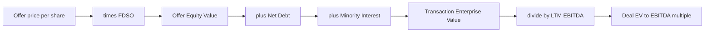
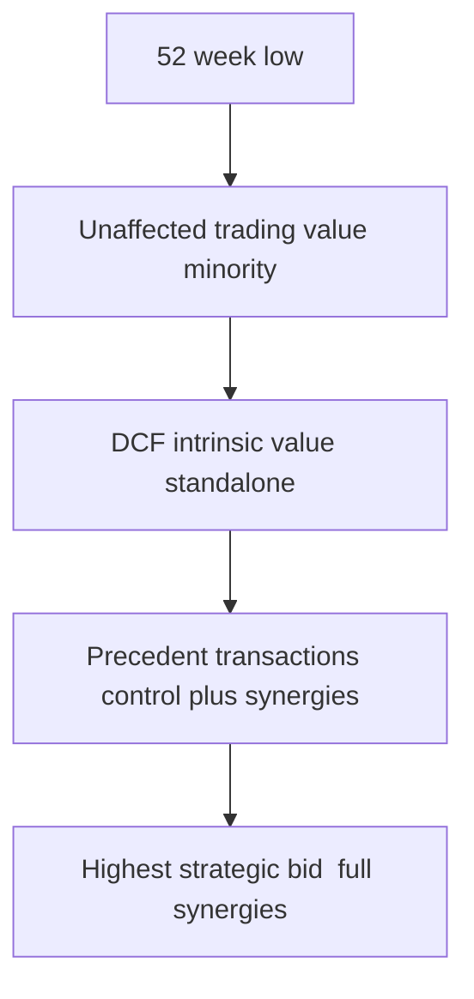
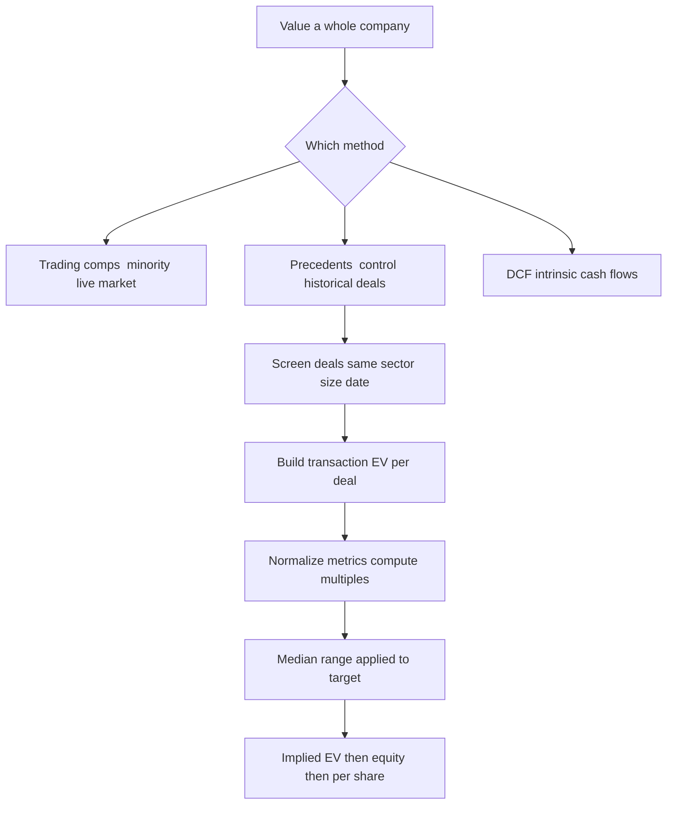

# Precedent Transaction Analysis

## The Problem / Why this matters

Imagine you are advising the board of **NovaFoods**, a mid-cap packaged-foods company that has just received an unsolicited approach from a larger strategic acquirer. The board asks you one deceptively simple question: *"What is the company worth if someone actually buys the whole thing?"*

Notice what that question is **not** asking. It is not asking what a share of NovaFoods trades for on the open market on a random Tuesday. It is not asking what a discounted-cash-flow model, built on your own forecast assumptions, spits out. It is asking a very specific, very real-world question: **what have actual buyers actually paid to acquire whole companies that look like this one?**

That is the question **Precedent Transaction Analysis** (also called "precedents," "deal comps," "transaction comps," or "M&A comps") is built to answer. It is the third leg of the classic valuation stool:

1. **Trading comparables** (public comps) — what the *market* pays for a *minority stake* (one share) in similar public companies, *today*.
2. **Precedent transactions** — what *acquirers* paid for *entire* similar companies, *historically*, in negotiated M&A deals.
3. **Discounted cash flow** — what the business is *intrinsically* worth based on the cash it will generate.

Every banker's valuation deck contains a "football field" chart that lines these methods up side by side. And in that chart, one range almost always sits **highest**: precedents. If a junior analyst cannot explain *why* precedents sit at the top — and when that ordering breaks — they will get caught out in an interview and, worse, mislead a real board.

This chapter builds precedent transaction analysis from first principles: what a "deal multiple" actually captures, why a **control premium** exists and where it comes from, how **synergies** and the identity of the buyer (strategic vs financial) push value up or down, where the data comes from, what adjustments you must make, and — crucially — *when precedents are the right tool and when they lie to you.*

---

## Core Idea

**Precedent transaction analysis values a company by looking at the prices paid in past acquisitions of comparable companies, expressed as valuation multiples, and applying those multiples to the target you are valuing.**

The mechanics rhyme with trading comps. You:

1. Assemble a set of **past M&A deals** involving companies similar to your target.
2. For each deal, compute a **multiple** — most commonly `EV / EBITDA`, `EV / Revenue`, or `Equity Value / Net Income (P/E)` — using the **transaction price** the acquirer paid.
3. Look at the range of those multiples (min, 25th percentile, median, mean, 75th percentile, max).
4. Apply a chosen multiple (usually the median or a judgment-based point in the range) to your target's corresponding metric.
5. Read off an implied **Enterprise Value**, then bridge to **Equity Value** and **per-share value**.

The single most important conceptual difference from trading comps is this: **the price in a precedent transaction is a *control* price, negotiated to buy the *entire* company, and it usually includes a premium over where the target was trading before the deal — a premium that often reflects the acquirer's expected *synergies*.** That is why precedents run rich.

> **One-line definition to memorize:** *Precedent transactions tell you what a control buyer paid, in the past, for a whole comparable company — so the multiples embed a control premium and often synergies, which is why they typically produce the highest valuation range.*

---

## Why it works this way — first-principles reasoning

Let's derive the whole method from scratch, because interviewers love to pull on this thread.

### 1. A price is evidence of value

The deepest first principle in relative valuation is: **an arm's-length transaction between a willing buyer and a willing seller is the single best evidence of what an asset is worth.** A DCF is an *opinion*. A traded share price is a *market consensus about a minority stake*. But a completed acquisition is a *fact*: real money changed hands for a real, whole company. If someone paid 12x EBITDA for a company nearly identical to yours, that is powerful, hard-to-argue-with evidence that yours is worth roughly 12x EBITDA too.

### 2. Multiples normalize for size

You cannot compare the raw dollar price of a $500m deal to a $5bn deal. To make deals comparable across sizes, you **divide the price by a value driver** (EBITDA, revenue, earnings). The multiple is a *price per unit of value driver*. A company generating twice the EBITDA should, all else equal, sell for roughly twice the price — so `EV / EBITDA` strips out the size effect and leaves you with a comparable "rate."

### 3. Why *control* changes the price

Here is the crux. When you buy **one share** of a public company, you buy a passive, minority claim on cash flows. You cannot change the CEO, cannot sell a division, cannot refinance the debt, cannot capture synergies. When you buy the **whole company**, you get all of those rights — **control**.

Control is worth money because it lets the buyer *change the cash flows*. A buyer who can replace weak management, cut redundant costs, optimize the capital structure, or fold the target into a bigger platform can extract *more* value from the same assets than the standalone market price implies. Because control is valuable, buyers pay a **control premium** over the pre-deal trading price to pry the company loose from existing shareholders.

Empirically, control premiums in public-company acquisitions typically run **20%–40%** over the unaffected share price, though they vary enormously by sector, deal dynamics, and competitive tension.

### 4. Why synergies push it further

A **strategic** buyer (an operating company in the same or an adjacent industry) expects **synergies** — value that exists only because of the *combination*:

- **Cost synergies:** eliminate duplicate headquarters, combine procurement, shut overlapping plants, remove one of the two finance/HR/IT departments.
- **Revenue synergies:** cross-sell products, expand into the target's geographies, bundle offerings.

Crucially, **synergies belong to the buyer, not the seller** — yet in a competitive auction, buyers are often forced to *share* some of that synergy value with the seller by paying up. So the transaction price can embed not just a control premium but a slice of expected synergies. That is a *second* upward push on the multiple.

### 5. Why this makes precedents the top of the football field

Stack the effects:

```
Standalone minority value  (trading comps)
      + control premium
      + shared synergies
= transaction (control) value  (precedents)
```

Because precedents = minority value **plus** control premium **plus** a share of synergies, they *structurally* sit above trading comps and often above a standalone DCF. That is the intuition behind the near-universal interview line: **"Precedents usually give the highest value because they include a control premium and synergies."**

### 6. Why they're also the *least reliable* in some ways

The same features that make precedents rich also make them **noisy**:

- **Stale:** a deal from 2019 reflects 2019's interest rates, credit conditions, and sector sentiment — not today's.
- **Situational:** a distressed fire-sale and a hotly contested auction for the same asset produce wildly different multiples.
- **Opaque:** private-target deals often don't disclose the financials, so you can't compute a clean multiple.
- **Synergy-contaminated:** the multiple you observe includes *someone else's* synergies, which may not apply to *your* target's buyer.

So precedents are simultaneously the most *concrete* (real prices) and the most *contaminated* (by control, synergies, timing, and deal-specific noise) of the methods. Holding both ideas at once is the mark of someone who actually understands the tool.

---

## Full technical content

### The building blocks: which multiples, and why

Precedents use the **same multiple architecture** as trading comps, but computed off the *deal price*. The universal rule of multiple construction still applies:

> **The numerator and denominator must belong to the same claimants.** Enterprise-value multiples pair with pre-interest, pre-financing metrics (Revenue, EBITDA, EBIT). Equity-value multiples pair with after-interest, after-tax metrics (Net Income, EPS).

| Multiple | Numerator | Denominator | Claimants | When used |
|---|---|---|---|---|
| **EV / Revenue** | Transaction Enterprise Value | LTM Revenue | All capital providers | Early-stage, unprofitable, or margin-divergent targets |
| **EV / EBITDA** | Transaction Enterprise Value | LTM EBITDA | All capital providers | **The workhorse** — capital-structure and D&A neutral |
| **EV / EBIT** | Transaction Enterprise Value | LTM EBIT | All capital providers | Capital-intensive sectors where D&A differences matter |
| **P / E** (Equity / Net Income) | Offer Equity Value | LTM Net Income | Equity holders only | Financials (banks, insurers) and mature profitable firms |
| **Equity / Book Value** | Offer Equity Value | Book Equity | Equity holders only | Banks, insurers, asset-heavy financials |

**Why `EV / EBITDA` dominates:** EBITDA is a proxy for pre-financing, pre-tax operating cash generation. Because EV captures *all* capital providers and EBITDA is *before* interest, the multiple is **independent of how the target was financed** — you can compare a debt-laden target to a debt-free one. It is also before D&A, so it neutralizes differences in depreciation policy and past capex timing. That robustness is why it is the default in M&A.

### Transaction Enterprise Value: the deal-price EV build

The heart of a precedent multiple is the **Transaction Enterprise Value** — the EV *implied by the price the acquirer agreed to pay.* You build it from the **offer price per share**, not the pre-deal trading price:

```
Offer price per share
  × Fully diluted shares outstanding  (treasury method on options, plus convertibles)
= Offer Equity Value  (a.k.a. transaction equity value / deal equity value)
  + Total debt  (and debt-like items: pensions, capital leases, preferred)
  + Minority (non-controlling) interest
  − Cash & cash equivalents
= Transaction Enterprise Value
```

Notice the bridge is the **same EV↔Equity bridge** you use everywhere in valuation — the only twist is that the equity value is computed off the *offer* price, not the market price. This EV is then divided by the target's LTM metric to yield the deal multiple.



**Fully diluted shares (FDSO)** matter here. In a takeover, in-the-money options and convertibles typically get exercised, cashed out, or converted, so you use the **treasury stock method** for options and add convertible shares. Using basic shares understates the equity check and mis-states the multiple.

### The control premium, precisely

The **control premium** is the percentage by which the offer price exceeds the target's **unaffected share price** — the price *before* the market learned of (or started to anticipate) the deal.

```
Control premium %  =  (Offer price per share  /  Unaffected share price)  −  1
```

- The **unaffected price** is usually measured 1 day, or a volume-weighted average over 5 / 20 / 30 trading days, *before* the announcement (or before the leak/rumor that moved the stock).
- Choosing the right unaffected date matters: if a leak ran the stock up 15% before the "official" announcement, using the day-before price *understates* the true premium.

| Premium reference | Typical construction | Why it exists |
|---|---|---|
| 1-day premium | Offer ÷ closing price 1 day prior | Simplest; sensitive to leaks |
| 20-day / 30-day VWAP premium | Offer ÷ volume-weighted avg | Smooths out noise and pre-announcement drift |
| 52-week high premium | Offer ÷ 52-week high | Board's "were shareholders made whole" test |

Control premiums matter in two directions:

1. **Reading precedents:** the multiples you observe *already contain* the premiums those buyers paid.
2. **Building a valuation off trading comps:** if you start from *unaffected* trading multiples and want to estimate a *control* value, you **apply an assumed control premium** (say +30%) to bridge from minority to control value. This is the "control premium method," a cousin of precedents.

### Strategic vs financial buyers

The identity of the buyer shapes the price, and interviewers test whether you know the difference.

| Dimension | **Strategic buyer** (corporate/operating co.) | **Financial buyer** (PE fund / sponsor) |
|---|---|---|
| Motive | Long-term strategic fit, market share, capability | Financial return (IRR) over a 3–7 yr hold |
| Synergies | **Yes** — cost + revenue synergies with existing ops | Generally **no** operating synergies (standalone) |
| Value ceiling | Standalone value **+ synergies** | Standalone value only (return-driven) |
| Financing | Cash / stock / balance sheet | **Leverage** (LBO debt) drives returns |
| Typical premium paid | **Higher** — can share synergies | **Lower** — disciplined by IRR hurdle |
| Hold horizon | Indefinite | Finite; must exit |

**Key implication:** in a competitive process, **strategics can usually outbid financials** because a strategic can justify a higher price using synergies a sponsor doesn't have. So a precedent set dominated by **synergy-rich strategic deals** will show *higher* multiples than one dominated by **LBO/sponsor deals**. When you pick comps, you should be conscious of which type of buyer you are implicitly assuming your target will attract.

> **Nuance for a sharp answer:** financial buyers are not always cheaper. In frothy credit markets with cheap, abundant leverage, sponsors can pay strategic-like prices. And a sponsor that owns a **platform** company in the same sector effectively becomes a quasi-strategic with its own synergies ("buy-and-build"/roll-up).

### Why precedents usually give the highest value — the full logic

Assemble the pieces into the canonical ordering:



- **Trading comps** value a *minority* stake — no control, no synergies — so they anchor the *lower* part of the field.
- **DCF** values *standalone* intrinsic cash flows — it can land above or below trading comps depending on your assumptions, but by construction it *excludes* synergies (unless you deliberately add a synergy case).
- **Precedents** value *control + shared synergies*, so they sit at the *top*.

**The exceptions — when precedents are NOT highest** (great interview follow-up):

1. **Frothy vintages baked into comps at the peak:** if precedents are drawn from a market top (e.g., 2021 tech deals) and you're valuing today in a cold market, precedents can be *too high to be credible* — or, conversely, if your live trading comps are richer than a set of *old, cheap* precedents, trading comps can top the field.
2. **Distressed precedents:** a comp set full of fire-sale, bankruptcy, or forced-seller deals will show *depressed* multiples — precedents can then sit *below* trading comps.
3. **A blue-sky DCF:** an aggressive DCF with a high terminal growth rate or low discount rate can exceed any relative method.
4. **Sector re-rating:** if public multiples have expanded sharply since the last deals closed, current trading comps outrun stale precedents.

So the honest, senior-sounding statement is: *"Precedents usually top the football field because of control and synergies — but not always; it depends on the vintage of the deals, the health of the sellers, and where public multiples are today relative to when those deals printed."*

### Data sources

| Source | What it gives | Notes |
|---|---|---|
| **Company filings** — merger proxy (DEFM14A), tender offer docs (SC 14D-9), 8-Ks, S-4 | Offer price, terms, fairness opinion, sometimes projections | Gold standard for public US targets; the fairness opinion often lists the *bankers' own* comp set |
| **Press releases / investor presentations** | Headline price, strategic rationale, guided synergies | Synergy guidance is management's estimate — treat with skepticism |
| **Data terminals** — Bloomberg (MA function), Capital IQ, FactSet, Refinitiv/LSEG, Mergermarket, Dealogic, PitchBook (private/PE) | Pre-built deal screens, multiples, premiums | The daily workhorses; still verify key figures against filings |
| **Equity research** | Analyst read-through on deal multiples and reads on the sector | Useful color, secondary evidence |
| **Fairness opinions in the proxy** | The advisor's *own* precedent set and multiples | A free, curated comp list — often your starting point |

**Practical workflow:** screen on the terminal (industry code, deal size, date range, geography, deal status = completed), export the long list, then *manually clean each deal* against the primary filing. The screen is a starting point, never the answer.

### Adjustments — where the craft lives

Raw screened multiples are almost never usable as-is. You apply adjustments to make deals comparable to each other and to your target:

1. **LTM / calendarization:** compute multiples on **Last Twelve Months** figures *as of the announcement date*, not stale annual figures. LTM = most recent full year − prior-year stub + current-year stub. This aligns the metric to the moment the price was struck.
2. **Non-recurring items / normalization:** strip out one-off gains/losses, litigation, restructuring, impairments, stock-comp treatment — so EBITDA reflects *sustainable* earnings. A depressed one-off EBITDA inflates the multiple and vice versa.
3. **Pro-forma for the target's own M&A:** if the target itself acquired something mid-year, adjust the metric to a full-year pro-forma basis so the denominator matches the business being sold.
4. **Time / vintage adjustment (judgment, not arithmetic):** weight recent deals more; be wary of deals struck under very different macro/credit conditions. There is no formula — you *narrate* the vintage risk.
5. **Deal-status filter:** use **completed** (or firm, agreed) deals. Rumored, withdrawn, or terminated deals don't represent a cleared price. Some analysts include announced-but-pending firm offers.
6. **Consideration mix (cash vs stock):** an **all-stock** deal's "price" floats with the acquirer's share price between signing and closing; fix the multiple at the **announcement-date** value to avoid contamination. All-cash prices are clean and fixed.
7. **Control-stake vs 100%:** a deal for a **51%** or **80%** stake implies a different valuation than a 100% buyout; gross up to a 100%-equivalent EV where appropriate, and be careful with minority interest.
8. **Earn-outs / contingent consideration:** headline price may include contingent payments; decide whether to value the deal at the fixed floor or the fully-earned amount, and be consistent across the set.
9. **Currency:** convert cross-border deals to a common currency at the announcement-date FX rate.
10. **Size / growth / margin dispersion:** even after all of the above, a small, slow, low-margin target should sit *below* the median; a large, fast, high-margin one *above*. Place your target within the range using judgment, don't blindly slap on the median.

### The valuation build — step by step

1. **Define the universe.** Same industry / sub-sector; similar size, geography, growth, and margin profile; sensible date window (typically last 3–5 years, extend if deal flow is thin).
2. **Screen and source.** Pull from a terminal; confirm each deal against filings.
3. **Filter.** Completed deals; drop distressed/outliers *or* flag them explicitly; keep a clean core set of 6–15 deals.
4. **Compute Transaction EV** for each deal (offer price × FDSO + net debt + minority interest).
5. **Normalize the metric** (LTM, non-recurring adjustments, pro-forma).
6. **Compute multiples** (EV/EBITDA, EV/Revenue, P/E) and the **implied premiums**.
7. **Summarize the range:** min, 25th pct, median, mean, 75th pct, max. **Lead with the median** (robust to outliers); mention mean for skew.
8. **Choose the applied multiple** — usually median, adjusted up/down for where your target sits on size/growth/margin.
9. **Apply to the target's metric** to get **implied Transaction EV**.
10. **Bridge EV → Equity → per share:** subtract net debt and minority interest, add cash, divide by the target's FDSO.
11. **Present as a range** on the football field; sanity-check against trading comps and DCF.

### A compact numeric convention block

- Multiple **range** presented as low–high; **point estimate** usually the median.
- Always state the metric period: "**EV / LTM EBITDA**," not just "EV/EBITDA."
- Premiums quoted to the **unaffected** price, with the reference window named.
- Currency and units stated once, applied consistently.

---

## Worked examples

### Worked Example 1 — Build one deal's multiple and the control premium

**Setup.** Acquirer *BigCo* agrees to buy *TargetA* for **$60.00 per share in cash**. TargetA facts as of announcement:

- Basic shares outstanding: **50.0m**
- In-the-money options: **4.0m** with a weighted average strike of **$30.00**
- Total debt: **$400m**; Cash: **$100m**; Minority interest: **$50m**
- LTM Revenue: **$1,200m**; LTM EBITDA: **$300m**
- Unaffected share price (20-day VWAP before the leak): **$46.00**

**Step 1 — Fully diluted shares (treasury stock method).**
Options exercised bring in cash used to buy back shares at the offer price.
- Cash from exercise = 4.0m × $30.00 = **$120m**
- Shares repurchased = $120m ÷ $60.00 = **2.0m**
- Net new shares = 4.0m − 2.0m = **2.0m**
- FDSO = 50.0m + 2.0m = **52.0m**

**Step 2 — Offer Equity Value.**
= $60.00 × 52.0m = **$3,120m**

**Step 3 — Transaction Enterprise Value.**
= Equity + Debt + Minority − Cash
= 3,120 + 400 + 50 − 100 = **$3,470m**

**Step 4 — Multiples.**
- EV / LTM Revenue = 3,470 ÷ 1,200 = **2.89x**
- EV / LTM EBITDA = 3,470 ÷ 300 = **11.6x**

**Step 5 — Control premium.**
= (60.00 ÷ 46.00) − 1 = 1.3043 − 1 = **30.4%**

**Reconciliation check.** Bridge back from EV to per share: EV 3,470 − debt 400 − minority 50 + cash 100 = equity 3,120; ÷ 52.0m FDSO = **$60.00** ✓ (matches the offer price). Internally consistent.

**Interview takeaway:** *"BigCo paid ~11.6x LTM EBITDA and a 30% control premium — squarely in the normal 20–40% premium band, so nothing looks distressed or frothy here."*

---

### Worked Example 2 — From a comp set to an implied value for your target

**Setup.** You are valuing **NovaFoods** using five clean precedent deals. Your screened, normalized `EV / LTM EBITDA` multiples:

| Deal | Target | Buyer type | EV/EBITDA |
|---|---|---|---|
| 1 | AlphaSnacks | Strategic | 10.0x |
| 2 | BetaBev | Strategic | 11.5x |
| 3 | GammaFoods | Sponsor (LBO) | 9.0x |
| 4 | DeltaDairy | Strategic | 12.0x |
| 5 | EpsilonEats | Sponsor (LBO) | 13.0x* |

*EpsilonEats printed at the credit-market peak — flag as a high outlier.

**Step 1 — Summarize the range.**
Sort: 9.0, 10.0, 11.5, 12.0, 13.0.
- Min = 9.0x, Max = 13.0x
- **Median = 11.5x**
- Mean = (9.0 + 10.0 + 11.5 + 12.0 + 13.0) ÷ 5 = 55.5 ÷ 5 = **11.1x**

Mean < median because the low sponsor deal (9.0x) pulls the average down; the 13.0x is a frothy outlier we'll cap by leaning on the **median**.

**Step 2 — NovaFoods financials.**
- LTM EBITDA: **$250m**
- Total debt: **$300m**; Cash: **$50m**; Minority interest: **$0**
- FDSO: **80.0m**

**Step 3 — Choose the applied multiple.** NovaFoods is a solid, mid-pack strategic-attractive asset — use the **median 11.5x**, and also show a range of **10.0x–12.0x** (25th–75th feel) around it.

**Step 4 — Implied Transaction EV (at median).**
= 11.5x × $250m = **$2,875m**

**Step 5 — Bridge EV → Equity.**
Equity = EV − Net Debt − Minority = 2,875 − (300 − 50) − 0 = 2,875 − 250 = **$2,625m**

**Step 6 — Per share.**
= $2,625m ÷ 80.0m = **$32.81**

**Step 7 — Present a range.**

| Applied multiple | Implied EV | Less net debt | Equity value | ÷ FDSO | Per share |
|---|---|---|---|---|---|
| 10.0x (low) | $2,500m | $250m | $2,250m | 80.0m | **$28.13** |
| 11.5x (median) | $2,875m | $250m | $2,625m | 80.0m | **$32.81** |
| 12.0x (high) | $3,000m | $250m | $2,750m | 80.0m | **$34.38** |

**Reconciliation check.** At the median, EV 2,875 − net debt 250 = equity 2,625; ÷ 80.0m = $32.81; × 80.0m = $2,625m; + net debt 250 = 2,875 = 11.5 × 250 ✓.

**Interview takeaway:** *"On precedents, NovaFoods is worth roughly $28–34 per share, centered near $33 at the 11.5x median. I'd lean on the median rather than the mean because a peak-vintage LBO printed a 13x outlier."*

---

### Worked Example 3 — Control premium and synergies: why the strategic can pay more

**Setup.** *TargetC* trades at an **unaffected** price of **$40.00** per share, 100m shares, so an unaffected equity value of **$4,000m**. It has **$1,000m** net debt, so **unaffected EV = $5,000m**, on LTM EBITDA of **$500m** → **10.0x** unaffected EV/EBITDA. Two bidders emerge.

**Bidder 1 — Financial sponsor.** No operating synergies. To win, it must pay a control premium but is disciplined by its IRR hurdle; it can stretch to a **25% premium**.
- Offer price = $40.00 × 1.25 = **$50.00**
- Offer equity value = $50.00 × 100m = **$5,000m**
- Offer EV = 5,000 + 1,000 net debt = **$6,000m**
- Implied EV/EBITDA = 6,000 ÷ 500 = **12.0x**

**Bidder 2 — Strategic.** Expects **$100m** of annual run-rate cost synergies. Capitalized at the same 10x, those synergies are worth **$1,000m** of standalone value — value that exists *only in the strategic's hands*. To win the auction it is willing to **share ~40%** of that synergy value with the seller, on top of matching a control premium.

Let's build the strategic's justified price:
- Start from unaffected EV: **$5,000m**
- Add a control premium comparable to the sponsor's (say the market-clearing premium is ~25% of equity = +$1,000m at EV level for simplicity of illustration): the "no-synergy" control EV ≈ **$6,000m** (same as sponsor)
- Synergy value created = **$1,000m**; strategic shares 40% with seller = **+$400m**
- Strategic's justified offer EV = 6,000 + 400 = **$6,400m**
- Offer equity value = 6,400 − 1,000 net debt = **$5,400m**
- Offer price per share = 5,400 ÷ 100m = **$54.00**
- Control premium to unaffected = (54.00 ÷ 40.00) − 1 = **35.0%**
- Implied EV/EBITDA = 6,400 ÷ 500 = **12.8x**

**Comparison table.**

| Bidder | Offer/share | Premium | Offer EV | EV/EBITDA | Why |
|---|---|---|---|---|---|
| Sponsor | $50.00 | 25% | $6,000m | 12.0x | Control only, IRR-disciplined |
| Strategic | $54.00 | 35% | $6,400m | 12.8x | Control **+ shared synergies** |

**Reconciliation check (strategic).** Offer EV 6,400 − net debt 1,000 = equity 5,400; ÷ 100m = $54.00; premium (54/40 − 1) = 35% ✓. Synergy math: full synergy value 1,000; seller's 40% share = 400; buyer keeps 600, which funds its own return — so the strategic pays 12.8x yet still captures $600m of net synergy value the sponsor never had access to.

**Interview takeaway:** *"The strategic can pay 12.8x versus the sponsor's 12.0x because it has $1,000m of synergy value the sponsor lacks and shares part of it to win. This is exactly why a precedent set full of strategic deals runs richer — the multiples embed shared synergies, not just a control premium."*

---

## How it is tested in interviews

Precedents show up in IB, ER, and even credit interviews. Below are the exact questions and crisp model answers.

### Q: "Walk me through a precedent transaction analysis."

**Model answer (say it like this):**
> "Precedent transactions value a company off the prices paid in past acquisitions of comparable companies. First I build a universe of relevant M&A deals — same sub-sector, similar size, sensible time window, completed deals. For each deal I compute the transaction enterprise value from the offer price — offer per share times fully diluted shares, plus net debt and minority interest — and divide by the target's LTM metric, usually EBITDA, to get a deal multiple. I normalize the metrics for LTM and non-recurring items, summarize the range around the median, then apply a chosen multiple to my target's EBITDA to get an implied EV. Finally I bridge EV to equity value by subtracting net debt and minority interest, and divide by shares for a per-share range. Because these are control prices that include a premium and often synergies, precedents usually sit at the top of the football field."

### Q: "Why do precedent transactions usually give a higher valuation than trading comps?"

**Crisp line:**
> "Two reasons: control and synergies. Trading comps price a minority share, but a precedent is the price to buy the *whole* company, so it includes a control premium — typically 20 to 40 percent. And many precedents involve strategic buyers who pay up to share expected synergies. Minority value plus control premium plus shared synergies equals a control price, which is why precedents run rich."

### Q: "When are precedents NOT the highest?"

> "When the deals are distressed or from a very different market — a comp set of fire-sale deals will run below trading comps, and stale deals from a peak vintage may be too high to trust or may lag today's re-rated public multiples. Also, an aggressive DCF can top everything. So 'precedents are highest' is a tendency, not a law."

### Q: "Strategic vs financial buyer — who pays more and why?"

> "Usually the strategic, because it has synergies a financial buyer doesn't — it can fold the target into existing operations, cut duplicate costs, and cross-sell, then share some of that value to win the auction. A financial buyer is disciplined by its IRR hurdle and relies on leverage, not synergies. The exception is cheap-credit environments or a sponsor with a platform company, which behaves like a quasi-strategic."

### Q: "How do you pick the multiple to apply from the range?"

> "I lead with the median because it's robust to outliers, then adjust for where my target sits on size, growth, and margins relative to the deal set. A larger, faster, higher-margin target justifies the upper quartile; a smaller, slower one the lower quartile. I never blindly apply the mean because one frothy or distressed deal can distort it."

### Q: "Precedents vs trading comps — three differences."

> "One: precedents use control prices with a premium; trading comps use minority market prices. Two: precedents are historical snapshots at the deal date; trading comps are live. Three: precedents embed synergies; trading comps don't. That's why precedents are higher but noisier."

### Q: "What data do you use and what do you adjust for?"

> "Screen a terminal — Cap IQ, Bloomberg MA, Mergermarket — then verify each deal against the merger proxy or press release. I adjust for LTM timing, non-recurring items, all-stock deals whose price floats, partial-stake deals, earn-outs, and vintage. I keep completed deals and flag distressed ones."

### Q (numerical, common): "A company has $250m EBITDA, $300m debt, $50m cash. Comparable deals traded at 11.5x. What's the equity value per share on 80m shares?"

> "11.5 times 250 is 2,875 of EV. Subtract net debt of 250 gives 2,625 of equity. Divide by 80m shares is about $32.81 per share." *(This is Worked Example 2 — practice saying it in under 20 seconds.)*

### Q: "How do you compute the control premium?"

> "Offer price divided by the unaffected share price, minus one. The unaffected price is before the market anticipated the deal — I'll use a VWAP over 20 or 30 days before announcement to avoid leak contamination."

### Q (credit-angle): "Why would a credit analyst care about precedents?"

> "For downside/recovery and covenant work. Precedent multiples give a market-tested estimate of what the enterprise could be sold for, which frames asset coverage and recovery in a distressed or take-private scenario. In LBO/leveraged-finance contexts, the entry multiple in precedents also anchors how much debt the structure can bear."

---

## Traps & common mistakes

1. **Using the pre-deal trading price instead of the offer price.** The multiple must be built off what the acquirer *paid*, not where the stock traded before. Using the unaffected price gives you a trading comp, not a precedent.
2. **Basic shares instead of fully diluted.** In a takeover, options and convertibles come into the money. Use the treasury method; basic shares understate the equity check.
3. **Blindly applying the mean.** One distressed or peak-frothy deal skews the mean. **Lead with the median.**
4. **Ignoring vintage.** A 2021 multiple applied in a 2026 credit-tight market is misleading. Weight recent, regime-comparable deals.
5. **Forgetting the deal was for a control stake or a partial stake.** A 60%-stake deal doesn't imply the same per-share value as a 100% buyout; gross up correctly.
6. **Letting an all-stock deal's price float.** Fix the multiple at the **announcement-date** value; don't use the closing-date value contaminated by acquirer share moves.
7. **Double-counting synergies.** Precedent multiples *already include* the buyers' synergies. Don't apply a synergy-rich precedent multiple *and then* add your own synergies on top — you'll double count.
8. **Mismatched numerator/denominator.** EV over Net Income, or Equity Value over EBITDA, is always wrong. Keep claimants consistent.
9. **Stale or unadjusted LTM.** Using last fiscal year's EBITDA when the deal priced mid-year mis-times the metric. Calendarize to the announcement date.
10. **Treating precedents as gospel.** They're concrete but noisy — control, synergies, timing, and deal drama all distort them. Present a range, cross-check against DCF and trading comps, and *narrate the caveats.*
11. **Not distinguishing buyer type.** A sponsor-heavy set will look cheaper than a strategic-heavy set; know which you're implicitly assuming for your target.
12. **Ignoring cash vs stock and earn-outs.** Contingent consideration and stock deals need explicit treatment or the "price" is fiction.

---

## First-principles recap

- **A completed deal is a fact, not an opinion** — the price paid is the strongest evidence of what a whole company is worth to a control buyer.
- **Multiples normalize price for size**, so deals of different scales become comparable; `EV/EBITDA` is the workhorse because it's capital-structure and D&A neutral.
- **Control is valuable** because it lets the buyer change the cash flows — hence the **control premium** (typically 20–40%) over the unaffected price.
- **Synergies belong to the buyer but get partly shared with the seller** in competitive auctions, pushing prices — and therefore multiples — even higher.
- **Minority value + control premium + shared synergies = control (transaction) value**, which is why precedents usually top the football field.
- **Strategics can outbid financials** because they have synergies sponsors lack — except when leverage is cheap or the sponsor owns a platform.
- **Precedents are the most concrete and the most contaminated method at once** — real prices, but distorted by control, synergies, vintage, and deal drama — so always present a range and cross-check.

---

## Quick-reference

| Concept | Formula / rule |
|---|---|
| Offer equity value | Offer price/share × Fully diluted shares |
| Transaction EV | Offer equity value + Total debt + Minority interest − Cash |
| EV / EBITDA multiple | Transaction EV ÷ LTM EBITDA |
| EV / Revenue multiple | Transaction EV ÷ LTM Revenue |
| P/E multiple | Offer equity value ÷ LTM Net Income |
| Control premium | (Offer price ÷ Unaffected price) − 1 |
| Implied EV (valuation) | Chosen multiple × Target LTM metric |
| EV → Equity bridge | Equity = EV − Net debt − Minority interest (+ Cash netted in net debt) |
| Per-share value | Implied equity value ÷ Target FDSO |
| Treasury stock method | Net new shares = Options − (Options × Strike ÷ Offer price) |
| Multiple ordering (typical) | Trading comps ≤ DCF ≤ Precedents (control + synergies) |
| Point estimate to lead with | **Median** (robust); show mean for skew |
| Typical control premium band | 20%–40% over unaffected price |
| Buyer who usually pays more | **Strategic** (has synergies) > Financial (IRR-disciplined) |
| Deal-status filter | Completed (or firm/agreed); exclude rumored/withdrawn |
| Metric timing | LTM as of announcement date, normalized for one-offs |

### Method map


