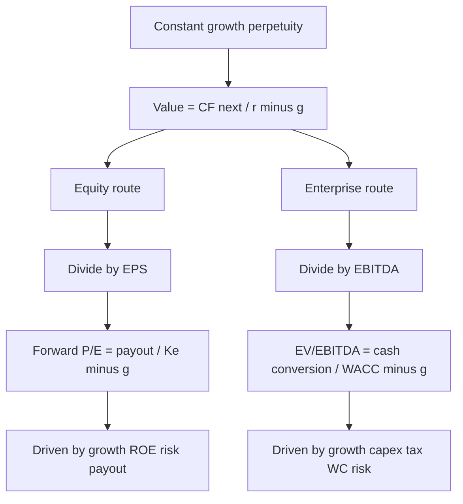
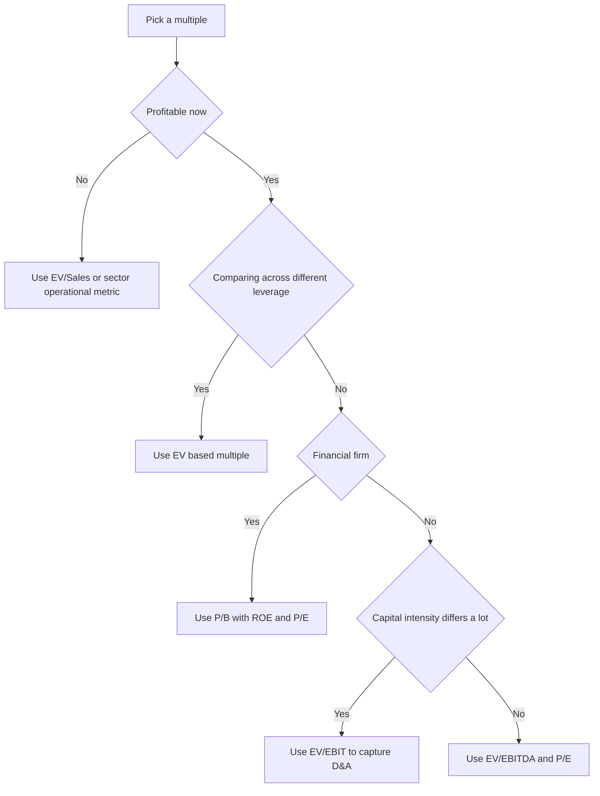

# Multiples Deep Dive

## The Problem / Why this matters

Ask a first-year analyst "what's this company worth?" and the honest answer is: *it depends on what someone will pay.* A DCF gives you an intrinsic number built from your own assumptions about the future — but the market doesn't trade on your assumptions, it trades on a **relative** logic: "this business looks like that basket of businesses, and that basket trades at 12x EBITDA, so this one is probably worth something in that neighbourhood." That relative logic is the language of **multiples**, and it is the single most-used, most-tested, most-abused tool in all of finance.

Here's why you cannot skate through interviews on hand-waving:

- **Every** equity research note, every IB pitch book, every credit memo has a comps table on the first or second page. The multiple *is* the headline.
- Multiples look trivial — "just divide price by earnings" — which is exactly why interviewers use them to separate people who *memorised* a formula from people who *understand* what a multiple is. A multiple is a **compressed DCF**. If you can decompress it into growth, margins, reinvestment and risk, you own the concept. If you can't, you'll fumble the moment someone asks "why is Company A on 25x and Company B on 10x?"
- Multiples are where the classic **equity vs enterprise** trap lives. Put an equity-value numerator over an enterprise-value denominator and your entire analysis is garbage — and the mistake is invisible unless you understand *why* the two must match.

The reader's goal in this chapter is not to memorise "EV/EBITDA is good for capital-intensive businesses." It is to be able to **derive** every multiple from a dividend-discount or free-cash-flow model, explain what makes it rise or fall, reconcile enterprise value to equity value in both directions, and answer the exact bench questions an ER/IB/credit interviewer will throw. By the end you should be able to look at any multiple and instantly say: *what has to be true about growth, margin, reinvestment and risk for that number to make sense?*

## Core Idea

A **multiple** is a ratio of **value** (in the numerator) to a **value driver** (in the denominator). It answers: "how many rupees of price am I paying per rupee of some fundamental — earnings, EBITDA, sales, book value?"

The core idea in one sentence: **a multiple is shorthand for a discounted cash flow.** Take a growing perpetuity, divide both sides by a fundamental, and out pops a multiple expressed purely in terms of growth, risk and cash-conversion. So a "high" or "low" multiple is never high or low in the abstract — it is high or low *relative to what the fundamentals justify.*

Two families exist, and keeping them straight is 80% of the battle:

| Family | Numerator = value of… | Denominator = flow to… | Examples |
|---|---|---|---|
| **Equity multiples** | Equity holders (market cap / price per share) | Equity holders (after interest & tax) | P/E, P/B, PEG, P/CF, dividend yield |
| **Enterprise multiples** | The *whole firm* (debt + equity) | *All* capital providers (before interest) | EV/EBITDA, EV/EBIT, EV/Sales, EV/EBITDAR, EV/FCFF |

**The iron rule of matching:** the numerator and denominator must be claimed by the **same** set of investors. Equity value goes over an *after-financing* flow (net income, book equity). Enterprise value goes over a *pre-financing* flow (EBITDA, EBIT, sales, unlevered cash flow). Mix them and you're comparing a claim held by shareholders to a flow that also belongs to lenders — nonsense.

## Why it works this way — first principles

Start from the one equation all of valuation reduces to: the **Gordon growth (constant-growth perpetuity)** model. The value of any stream of cash flows growing at a constant rate `g` forever, discounted at rate `r`, is:

```
Value = CF_next_year / (r − g)
```

That's it. Everything else — every multiple — is this equation wearing a costume. Let me show you the two costumes.

### Equity side: deriving P/E from the dividend discount model

The value of equity to a shareholder is the present value of dividends. With dividends growing at `g` and cost of equity `Ke`:

```
Price P0 = D1 / (Ke − g)
```

Dividends are earnings times the payout ratio: `D1 = EPS1 × payout`. Substitute:

```
P0 = EPS1 × payout / (Ke − g)
```

Divide both sides by `EPS1` and you have the **forward P/E**, fully decompressed:

```
Forward P/E = P0 / EPS1 = payout / (Ke − g)
```

Look at what fell out. The P/E a company *deserves* is:

- **Higher** when the **payout ratio** is higher (more of each rupee reaches shareholders)…
- **Higher** when **growth `g`** is higher (denominator shrinks)…
- **Lower** when **risk `Ke`** is higher (denominator grows).

But payout and growth aren't independent. Growth is funded by retention: `g = ROE × retention = ROE × (1 − payout)`. So a high payout *lowers* growth. The multiple rewards growth **only when the incremental capital earns more than its cost** — i.e., when **ROE > Ke**. If ROE = Ke, growth is value-neutral and adds nothing to the multiple. This is the single most important idea in the whole chapter: **growth is only worth paying for when returns exceed the cost of capital.**

### Enterprise side: deriving EV/EBITDA from free cash flow to the firm

Enterprise value is the present value of **free cash flow to the firm (FCFF)** — cash available to *all* capital providers, discounted at the **WACC**. In constant-growth form:

```
EV = FCFF1 / (WACC − g)
```

Now build FCFF up from EBITDA:

```
FCFF = EBITDA − (taxes on EBIT) − CapEx − ΔWorking Capital
```

Divide `EV = FCFF1 / (WACC − g)` by EBITDA:

```
EV/EBITDA = [FCFF/EBITDA] / (WACC − g)
```

The term `FCFF/EBITDA` is the **cash-conversion ratio** — how much of each rupee of EBITDA survives taxes, capex and working-capital investment to become free cash. So:

```
EV/EBITDA rises with:  higher cash conversion (low capex, low tax, low WC drag)
                       higher growth g
                       lower risk WACC
```

This is *why* capital-intensive businesses (steel, telecom, utilities) trade at low EV/EBITDA: their capex eats a huge chunk of EBITDA, so cash conversion is poor, so each rupee of EBITDA is worth fewer rupees of EV. A software company converts ~80–90% of EBITDA to cash; a steel mill maybe 30–40%. **The multiple is just the cash-conversion story compressed into one number.**

That single insight — *a multiple = fundamental cash-conversion ÷ (discount rate − growth)* — is the master key. Memorise the algebra once and you never have to memorise "which multiple suits which sector"; you can *derive* it live in the room.



## Full technical content

### 1. The enterprise-value build (the bridge everyone asks about)

Enterprise value is the value of the **operating business**, independent of how it's financed. You cannot observe it directly — you build it from equity value (which you *can* observe as market cap) by adding the claims that rank ahead of equity and subtracting non-operating assets.

```
Enterprise Value = Equity Value
                 + Total Debt (short + long term)
                 + Preferred Stock
                 + Minority (Non-controlling) Interest
                 − Cash & Cash Equivalents
                 (− other non-operating assets, e.g. investments in associates)
```

Reasoning for each line:

| Line | Add or subtract | Why |
|---|---|---|
| **Total debt** | **+** | Debtholders have a claim on the enterprise; a buyer must repay/assume it, so it's part of the price of the *whole* business. |
| **Preferred stock** | **+** | Ranks ahead of common equity; another capital provider's claim on the firm. |
| **Minority interest** | **+** | The company consolidates 100% of a subsidiary's EBITDA/sales but doesn't own 100%; adding MI puts the *whole* enterprise on top so numerator and denominator are consistent. |
| **Cash** | **−** | Cash is a non-operating asset. A buyer effectively gets it back / nets it against the price. EBITDA doesn't include interest income on cash, so cash must leave the numerator to match. |
| **Investments in associates** | **−** | Their earnings aren't in the parent's EBITDA (equity-method), so their value shouldn't be in EV either. |

Going the **other way** (EV → equity), just reverse the signs. This EV↔equity bridge is *the* most common numerical interview drill.


**Net debt** is a convenient shorthand: `Net Debt = Total Debt − Cash`. So the simplified bridge most people quote is `EV = Equity Value + Net Debt (+ Preferred + MI)`.

### 2. The multiples, one by one

#### P/E — Price / Earnings per Share

```
P/E = Price per Share / EPS   =   Market Cap / Net Income
```

- **Equity multiple.** Numerator = equity price, denominator = net income (after interest and tax — an equity flow). Consistent. ✅
- **Forward P/E** uses next-12-month (NTM) or next fiscal year EPS; **trailing P/E** uses last-12-month (LTM) EPS.
- Decompressed: `Forward P/E = payout / (Ke − g)`. Drivers: **+growth, +ROE, +payout quality, −risk.**
- **Strengths:** intuitive, universally quoted, ties directly to what shareholders keep.
- **Weaknesses:** distorted by (a) **capital structure** — two identical operating businesses with different leverage have different P/Es; (b) **non-cash & one-off items** in net income; (c) **useless when earnings are negative or near zero** (P/E goes negative or explodes); (d) affected by different **tax rates** and **D&A policies**.

#### EV/EBITDA — Enterprise Value / EBITDA

```
EBITDA = EBIT + Depreciation + Amortisation
       = Operating profit before D&A
EV/EBITDA = Enterprise Value / EBITDA
```

- **Enterprise multiple.** EBITDA is pre-interest, pre-tax, pre-D&A — a flow to *all* investors. Matches EV. ✅
- **Why it's the analyst's workhorse:** it's **capital-structure neutral** (strips out interest), **neutral to D&A policy** (strips depreciation, so it's comparable across firms with different asset ages and accounting), and roughly **tax-neutral** (before tax). This makes it the best tool for comparing companies with *different leverage* — exactly the situation in M&A and LBOs.
- Decompressed: `EV/EBITDA = (FCFF/EBITDA) / (WACC − g)`. Drivers: **+growth, +cash conversion (i.e. −capex intensity, −WC drag, −cash tax), −WACC.**
- **Key weakness:** EBITDA **ignores capex** and the real cost of maintaining the asset base. "EBITDA is not cash flow." A capital-hungry business can show fat EBITDA and burn cash. That's why you pair it with EV/EBIT or FCF.

#### EV/EBIT — Enterprise Value / EBIT

```
EBIT = Operating profit after depreciation & amortisation
EV/EBIT = Enterprise Value / EBIT
```

- **Enterprise multiple**, but EBIT is *after* D&A. D&A is a rough proxy for **maintenance capex**, so EV/EBIT penalises capital-intensive businesses that EV/EBITDA flatters. Use EV/EBIT when **capital intensity differs materially** across the comp set and you want that difference to *show up* in the multiple.
- Drivers: same as EV/EBITDA but now capital intensity bites through the D&A line directly.

#### EV/Sales (EV/Revenue)

```
EV/Sales = Enterprise Value / Revenue
```

- **Enterprise multiple** (sales belong to the whole firm). ✅
- **When to use:** early-stage / high-growth / currently-lossmaking companies where EBITDA and earnings are negative or meaningless (SaaS, biotech, marketplaces). Revenue is almost always positive and least manipulable.
- **The hidden variable is margin.** Algebraically, `EV/Sales = EV/EBIT × EBIT margin`. So EV/Sales bakes in an assumption about the margin the business will *eventually* earn. Comparing a 40%-margin software firm to a 5%-margin distributor on EV/Sales is meaningless — of course the software firm is on 8x sales and the distributor on 0.5x. **Never compare EV/Sales across different margin structures.**

#### P/B — Price / Book value of equity

```
P/B = Market Cap / Book Value of Equity  =  Price per Share / Book Value per Share
```

- **Equity multiple.** ✅
- Decompressed (from the same DDM, using `EPS = ROE × Book`): `P/B = (ROE − g) / (Ke − g)`. So **P/B is driven overwhelmingly by ROE vs Ke.** If ROE = Ke, P/B = 1. If ROE > Ke, P/B > 1 (the firm creates value on its book). If ROE < Ke, P/B < 1 (the firm *destroys* value — the market marks its equity below book).
- **When to use:** financials (banks, insurers) where assets and liabilities are marked near fair value and book means something; and asset-heavy or liquidation situations. Paired with ROE, `P/B–ROE` is *the* bank valuation framework.
- **Weakness:** book value is an accounting figure — distorted by buybacks, intangibles, goodwill, write-downs. Useless for asset-light businesses (a consulting firm's book equity is meaningless).

#### PEG — P/E to Growth

```
PEG = (P/E) / (annual EPS growth rate in %)
```

- Attempts to make P/Es comparable across companies with **different growth rates** by normalising the P/E per point of growth. A PEG around **1.0** is the rough "fairly valued" rule of thumb (a 20x P/E on 20% growth ≈ PEG 1).
- **Strength:** quick sanity check — is this high P/E justified by high growth?
- **Weaknesses:** the "1.0 is fair" rule has **no rigorous theoretical basis** (it ignores risk and payout); it's very sensitive to *which* growth number you use (1-year? 3-year CAGR? consensus long-term?); it breaks for low-growth, high-quality compounders (a stable 4%-growth utility can be a great business but shows an ugly PEG).

#### Sector-specific multiples

When earnings/EBITDA are distorted or the value driver is operational, analysts use tailored multiples. Always check: **is the denominator claimed by equity or the whole firm?** — that tells you whether to put price/market cap or EV on top.

| Sector | Common multiple | Numerator | Why |
|---|---|---|---|
| Banks / insurers | **P/B, P/TBV**, P/E | Equity | Book ≈ fair value; leverage is the business, so enterprise metrics don't apply |
| REITs / real estate | **P/FFO, P/AFFO**, EV/EBITDA | Equity / EV | Net income distorted by depreciation of property; FFO adds it back |
| Telecom / cable | **EV/EBITDA**, EV per subscriber | EV | Capital intensity, heavy D&A |
| Oil & gas (E&P) | **EV/EBITDAX**, EV/proved reserves (boe) | EV | Exploration expense & reserve base drive value |
| Airlines / shipping | **EV/EBITDAR** | EV | Adds back rent/lease to compare owned vs leased fleets |
| Retail / consumer | EV/EBITDA, EV/Sales, **EV per store** | EV | Store economics |
| SaaS / subscription | **EV/Sales, EV/ARR**, EV/Gross Profit | EV | Pre-profit; recurring revenue is the asset |
| Hotels | EV per key/room, EV/EBITDA | EV | Physical capacity |
| Media / internet | EV/EBITDA, **EV per MAU/user** | EV | Monetisable user base |

Rule for operational multiples like EV/subscriber: they implicitly assume every subscriber is worth the same across companies — only valid when the underlying **unit economics (ARPU, margin, churn)** are comparable.

### 3. Forward vs trailing

| | Trailing (LTM / TTM) | Forward (NTM / FY1, FY2) |
|---|---|---|
| Denominator | Last 12 months actuals | Next 12 months / next FY estimates |
| Pro | Real, reported, no forecast error | Forward-looking; the market prices the *future* |
| Con | Backward-looking; misses turning points; stale for fast-changing firms | Depends on forecast quality; consensus can be wrong/optimistic |
| Relationship | For a **growing** company, forward multiple < trailing multiple (bigger denominator next year) | The gap between them *is* the growth rate |

Key algebra: `Forward P/E = Trailing P/E / (1 + g)`. If a stock trades at 22x trailing and grows earnings 10%, its forward P/E is ≈ 20x. Interviewers love this because it shows you understand that **the market pays for the future, and a "cheap" trailing multiple on a shrinking business is a value trap.**

**Consistency commandment:** never compare a forward multiple for one company against a trailing multiple for another. Same basis for the whole comp set, always.

### 4. Choosing the right multiple — the decision map



### 5. The full driver table (memorise this)

| Multiple | Formula (decompressed) | Rises with | Falls with | Best for |
|---|---|---|---|---|
| Forward P/E | `payout / (Ke − g)` | growth, ROE, payout | risk (Ke), leverage | General equity, comparable capital structures |
| EV/EBITDA | `(FCFF/EBITDA) / (WACC − g)` | growth, cash conversion | WACC, capex intensity | Cross-leverage comparison, M&A/LBO |
| EV/EBIT | as above, D&A now inside | growth, low real capex | WACC, capital intensity | Differing capital intensity |
| EV/Sales | `EV/EBIT × EBIT margin` | growth, target margin | WACC, low margin | Pre-profit / high growth |
| P/B | `(ROE − g) / (Ke − g)` | ROE, growth | risk, low ROE | Banks, asset-heavy |
| PEG | `(P/E) / g%` | (normalises P/E by growth) | — | High-growth sanity check |

## Worked examples

### Worked Example 1 — The EV ↔ Equity bridge and both multiples

**Given (Company Alpha):**
- Share price: ₹200; shares outstanding: 50 crore → Market cap = 200 × 50 = **₹10,000 cr**
- Total debt: ₹4,000 cr; Cash: ₹1,000 cr; Preferred: ₹500 cr; Minority interest: ₹300 cr
- EBITDA: ₹2,000 cr; D&A: ₹500 cr → EBIT = ₹1,500 cr
- Interest expense: ₹360 cr; Tax rate: 25%
- Net income: attributable to shareholders

**Step 1 — Build enterprise value.**
```
EV = Equity value + Debt + Preferred + Minority interest − Cash
   = 10,000 + 4,000 + 500 + 300 − 1,000
   = ₹13,800 cr
```

**Step 2 — Enterprise multiples.**
```
EV/EBITDA = 13,800 / 2,000 = 6.9x
EV/EBIT   = 13,800 / 1,500 = 9.2x
```

**Step 3 — Net income and P/E.**
```
Pre-tax profit = EBIT − Interest = 1,500 − 360 = 1,140
Tax @25%       = 285
Net income (before preferred) = 855
Less preferred dividend? (assume preferred div ₹40) → to common = 815
```
For simplicity use net income to common = ₹815 cr (I'll flag the preferred). Actually let me keep it clean — assume no preferred dividend paid this year and net income to common = ₹855 cr.
```
EPS = 855 / 50 = ₹17.10
Trailing P/E = 200 / 17.10 = 11.7x
```

**Step 4 — Sanity: bridge back from EV to equity.**
```
Equity value = EV − Debt − Preferred − Minority + Cash
             = 13,800 − 4,000 − 500 − 300 + 1,000
             = ₹10,000 cr  ✅ (matches market cap — bridge reconciles)
```

**Takeaway to say aloud:** "EV/EBITDA of 6.9x is capital-structure neutral; P/E of 11.7x reflects that this firm carries ₹3,000 cr of *net* debt, so its equity is more leveraged and its P/E isn't directly comparable to an unlevered peer's."

### Worked Example 2 — Why two identical operating businesses have different P/Es but the same EV/EBITDA

Two firms, **identical operations**: each has EBITDA ₹1,000 cr, D&A ₹200 cr, EBIT ₹800 cr, tax 25%. Same enterprise value ₹8,000 cr (both EV/EBITDA = 8.0x). They differ only in financing.

| | Firm U (unlevered) | Firm L (levered) |
|---|---|---|
| Debt | 0 | ₹4,000 cr @ 8% |
| Interest | 0 | 320 |
| Pre-tax profit (EBIT − int) | 800 | 480 |
| Tax @25% | 200 | 120 |
| Net income | 600 | 360 |
| Equity value = EV − Net debt | 8,000 − 0 = 8,000 | 8,000 − 4,000 = 4,000 |
| **P/E = Equity / NI** | 8,000/600 = **13.3x** | 4,000/360 = **11.1x** |
| **EV/EBITDA** | 8,000/1,000 = **8.0x** | 8,000/1,000 = **8.0x** |

**The lesson:** identical businesses, identical EV/EBITDA, **different P/E**. Leverage lowered Firm L's P/E (cheaper-looking) but also loaded it with financial risk. This is *exactly* why analysts prefer EV/EBITDA for cross-company comparison — it neutralises the financing choice. In an interview: *"P/E is contaminated by capital structure; EV/EBITDA isn't, which is why it's the workhorse for comparing companies with different leverage."*

### Worked Example 3 — Justified multiples from fundamentals (the algebra in action)

**Company Beta:** ROE = 18%, cost of equity Ke = 12%, dividend payout = 40%, so retention = 60%.

**Step 1 — Sustainable growth.**
```
g = ROE × retention = 0.18 × 0.60 = 0.108 = 10.8%
```

**Step 2 — Justified forward P/E.**
```
Forward P/E = payout / (Ke − g) = 0.40 / (0.12 − 0.108) = 0.40 / 0.012 = 33.3x
```

**Step 3 — Justified P/B.**
```
P/B = (ROE − g) / (Ke − g) = (0.18 − 0.108) / (0.12 − 0.108)
    = 0.072 / 0.012 = 6.0x
```

**Step 4 — Cross-check consistency (P/B should equal forward P/E × forward ROE-ish).**
```
Justified P/B  = Forward P/E × (EPS1/Book) 
Note EPS1/Book0 = ROE × (1+g)... let's verify the simpler identity:
P/B / (P/E) should ≈ earnings yield on book = ROE.
6.0 / 33.3 = 0.180 = 18% = ROE  ✅
```
The two justified multiples reconcile: `P/B = P/E × ROE`. Beautiful internal consistency.

**Now the punchline — sensitivity to ROE.** Drop ROE to 12% (= Ke) holding payout at 40%:
```
g = 0.12 × 0.60 = 0.072
Forward P/E = 0.40 / (0.12 − 0.072) = 0.40 / 0.048 = 8.3x
P/B = (0.12 − 0.072)/(0.12 − 0.072) = 1.0x   ← ROE = Ke ⇒ P/B = 1
```
The justified P/E collapsed from 33x to 8x and P/B from 6.0x to 1.0x — **purely because the firm stopped earning above its cost of capital.** Growth funded at only the cost of capital adds *nothing*. This is the algebra that lets you answer "why does A trade richer than B?" from first principles: *A earns a bigger spread of ROE over Ke.*

### Worked Example 4 — Forward vs trailing, and EV/Sales margin trap

**Company Gamma:** trailing EBITDA ₹500 cr, expected to grow 25% next year → forward EBITDA ₹625 cr. EV = ₹5,000 cr.
```
Trailing EV/EBITDA = 5,000 / 500 = 10.0x
Forward  EV/EBITDA = 5,000 / 625 = 8.0x
```
The 10x trailing looks pricier than a peer at 9x trailing — but on a **forward** basis Gamma is *cheaper* (8x vs the peer's, say, 8.5x). *"On a forward basis the growth closes the gap — comparing my forward to their trailing would be apples to oranges."*

**EV/Sales margin check.** Gamma has revenue ₹2,000 cr, EBIT margin 15% → EBIT ₹300 cr.
```
EV/Sales = 5,000 / 2,000 = 2.5x
EV/EBIT  = 5,000 / 300   = 16.7x
Check identity: EV/Sales = EV/EBIT × EBIT margin = 16.7 × 0.15 = 2.5x  ✅
```
A distributor peer at 6% margin "trading at 0.6x sales" is actually on `0.6 / 0.06 = 10x EV/EBIT` — **richer than Gamma on an earnings basis** despite the lower sales multiple. The sales multiple hid the margin difference. Always convert to a margin-adjusted basis before concluding "cheap."

## How it is tested in interviews

Interviewers use multiples to test whether you *understand* valuation or just *recite* it. Here are the exact questions with model answers and crisp lines.

**Q: "Walk me through how you get from equity value to enterprise value."**
> "Enterprise value is the value of the operating business to all capital providers. I start from equity value — market cap — then add the claims senior to common equity: total debt, preferred stock, and minority interest. Then I subtract cash and non-operating assets, because cash is effectively returned to the buyer and isn't part of operations. So EV equals market cap plus net debt plus preferred plus minority interest. To go the other way, I reverse every sign."

**Q: "Why do you prefer EV/EBITDA over P/E?"**
> "Two reasons. First, capital structure: P/E is distorted by leverage because net income is after interest, so two identical businesses with different debt have different P/Es. EV/EBITDA strips that out — it's financing-neutral. Second, D&A and tax: EBITDA is before depreciation and tax, so it's comparable across firms with different asset ages, accounting policies and tax rates. That makes it ideal for M&A and cross-company comparison. The caveat is EV/EBITDA ignores capex, so I'd pair it with EV/EBIT or free cash flow for capital-intensive names."

**Q: "A company trades at 8x EBITDA and a peer at 14x. Why the gap?"**
> "The multiple decompresses to cash conversion over WACC minus growth. So a higher multiple means some combination of: faster growth, higher cash conversion — lower capex intensity, lower working-capital drag — or lower risk. I'd check: is the 14x company growing faster, is it asset-lighter so more EBITDA becomes free cash, or is it simply lower-risk with a lower WACC? If none of those hold, the 14x might be mispriced — or there's a quality or moat difference the number is capturing."

**Q: "When is a low P/E a value trap?"**
> "When the low multiple reflects declining earnings, not cheapness. `Forward P/E = trailing P/E / (1+g)`. If g is negative, the forward P/E is *higher* than trailing — the stock is optically cheap on last year's earnings but expensive on next year's. Low P/E can also signal high leverage — equity is cheap because it's risky — or a structurally declining business. I always look at forward, at the balance sheet, and at *why* it's cheap."

**Q: "Company is lossmaking — how do you value it?"**
> "Earnings multiples break down with negative denominators, so I move up the income statement to something positive: EV/Sales, or EV/Gross Profit, or a sector operational metric like EV/subscriber or EV/ARR. EV/Sales implicitly bakes in a target margin — `EV/Sales = EV/EBIT × margin` — so I'd anchor it to the margin the business can realistically reach at scale, and cross-check against a DCF."

**Q: "How does growth affect the P/E, and is more growth always better?"**
> "From the Gordon model, forward P/E equals payout over Ke minus g, and g equals ROE times retention. So growth raises the multiple — but *only if ROE exceeds the cost of equity.* If ROE equals Ke, growth is value-neutral; the P/E is the same whether the firm grows or not. If ROE is below Ke, growth actually *destroys* value and should lower the multiple. So no — growth is only worth paying for when it earns above the cost of capital."

**Q: "Why do banks trade on P/B and not EV/EBITDA?"**
> "For a bank, debt *is* the raw material — deposits and borrowings are operating inputs, not just financing — so 'enterprise value' and EBITDA are meaningless. Book value, however, is marked close to fair value, so P/B is meaningful. And P/B ties directly to returns: `P/B = (ROE − g)/(Ke − g)`, so a bank earning ROE above its cost of equity trades above book, and one earning below trades below. That's why the bank framework is P/B against ROE."

**Q: "Two companies, same EV/EBITDA. One has heavy capex. Which is really cheaper?"**
> "The capital-light one. EV/EBITDA ignores capex, so it flatters the heavy spender. I'd switch to EV/EBIT — which nets out D&A as a proxy for maintenance capex — or better, EV/unlevered free cash flow. On a cash basis the asset-heavy business will look more expensive, because less of its EBITDA survives to become cash."

**One-liners worth memorising to drop in the room:**
- "A multiple is a compressed DCF."
- "EBITDA is not cash flow — it ignores capex and working capital."
- "Match the numerator and denominator: equity claims over equity flows, firm value over firm flows."
- "Growth only creates value above the cost of capital."
- "Never compare forward to trailing, or across different margins/leverage."

## Traps & common mistakes

1. **Mismatched numerator/denominator.** Putting market cap over EBITDA, or EV over net income. Instant credibility loss. EBITDA/EBIT/Sales → EV on top; Net income/Book → equity/price on top.
2. **Forgetting to add minority interest / subtract cash in the EV build.** The two most-missed lines. MI is added because you consolidate 100% of the sub's EBITDA; cash is subtracted because it's non-operating.
3. **Using diluted vs basic shares inconsistently**, or ignoring options/convertibles in market cap. Use fully diluted (treasury-stock method) for equity value.
4. **Treating EBITDA as free cash flow.** It ignores capex, working capital *and* cash taxes. A capex-heavy business with fat EBITDA can be a cash incinerator.
5. **Comparing forward to trailing multiples** across a comp set. Pick one basis and hold it constant.
6. **Comparing EV/Sales across different margins.** A 40%-margin and a 5%-margin business "should" have wildly different sales multiples. Convert to margin-adjusted (EV/EBIT) before judging.
7. **Naïve PEG on low-growth quality names.** A stable compounder can have an "expensive" PEG and still be a great buy; PEG ignores risk and payout.
8. **Negative or near-zero denominators.** P/E on tiny/negative earnings is meaningless — the ratio explodes or flips sign. Move up the income statement.
9. **Ignoring why a multiple is low.** Cheap can mean declining, over-levered, or cyclically peaking earnings (a cyclical at *peak* earnings has a *low* P/E right before the crash — the "peak-earnings trap"; buy cyclicals on high P/E, sell on low).
10. **Book value distortions.** Buybacks below book, goodwill, write-downs and intangibles make P/B unreliable for asset-light firms.
11. **Non-recurring items** left in earnings/EBITDA. Always normalise for one-offs (restructuring, litigation, asset sales) before taking a multiple.
12. **Stale peer set / different fiscal calendars.** Comps must be genuinely comparable in business model, geography, growth and risk — and on the same time basis.

## First-principles recap

- **A multiple is a compressed DCF.** Every multiple is `Value = CF/(r − g)` divided by a fundamental, so it's fully expressible in growth, risk and cash-conversion.
- **Match the claim.** Equity numerators go over after-financing flows (net income, book); enterprise numerators go over pre-financing flows (EBITDA, EBIT, sales). Never cross them.
- **The EV bridge is add-senior-claims, subtract-cash.** EV = equity + debt + preferred + minority interest − cash. Reverse the signs to get back to equity.
- **Growth is only worth paying for above the cost of capital.** If ROE = Ke, growth adds nothing to the multiple; P/B = 1 exactly. The spread of returns over the discount rate is what drives rich multiples.
- **EV/EBITDA is the workhorse because it's financing- and accounting-neutral**, but it ignores capex — so pair it with EV/EBIT or free cash flow for capital-intensive names.
- **Capital intensity, margin and risk are the hidden variables** inside EV/EBITDA, EV/Sales and P/E respectively; naming them is what turns a memorised multiple into an understood one.
- **Consistency is everything:** same basis (forward vs trailing), same share count (diluted), same margin/leverage profile, normalised earnings — or the comparison is noise.

## Quick-reference

| Item | Formula |
|---|---|
| Constant-growth value | `Value = CF_next / (r − g)` |
| Enterprise value build | `EV = Equity + Debt + Preferred + Minority − Cash` |
| Equity from EV | `Equity = EV − Debt − Preferred − Minority + Cash` |
| Net debt | `Net Debt = Total Debt − Cash` |
| P/E | `Price/EPS = Market Cap / Net Income` |
| Forward P/E (justified) | `payout / (Ke − g)` |
| Forward vs trailing P/E | `Forward P/E = Trailing P/E / (1 + g)` |
| EBITDA | `EBIT + D&A` |
| EV/EBITDA (justified) | `(FCFF/EBITDA) / (WACC − g)` |
| EV/EBIT | `EV / EBIT` (D&A now inside denominator) |
| EV/Sales identity | `EV/Sales = EV/EBIT × EBIT margin` |
| P/B (justified) | `(ROE − g) / (Ke − g)` |
| P/B ↔ P/E link | `P/B = P/E × ROE` |
| Sustainable growth | `g = ROE × (1 − payout)` |
| PEG | `(P/E) / g%`, ~1.0 ≈ fair |
| Value rule | Multiple rises with growth & cash-conversion, falls with risk; growth only helps if ROE/ROIC > cost of capital |
