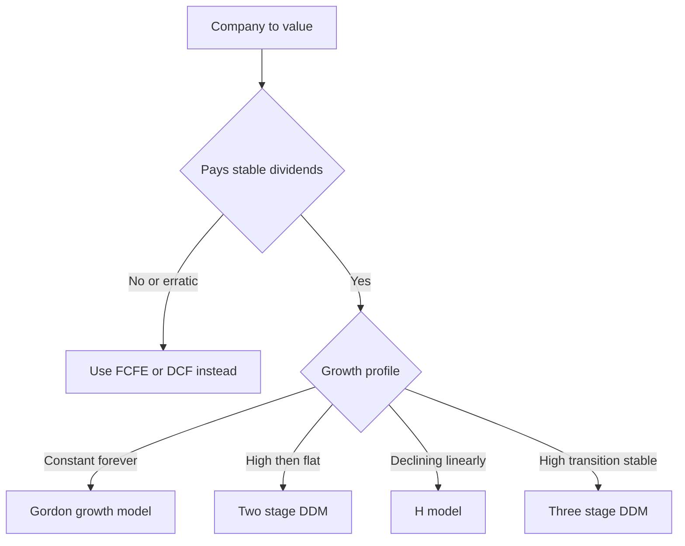
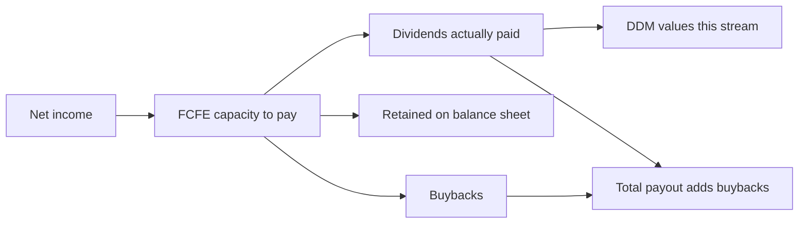
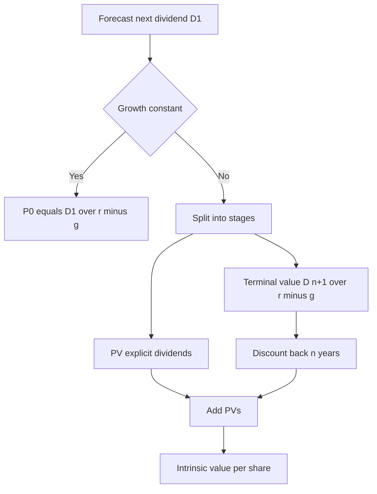

# The Dividend Discount Model

## The Problem / Why this matters

Every share of stock is a legal claim on a stream of future cash the company will hand back to its owners. If you strip away the noise — the ticker prices, the analyst upgrades, the momentum — a share is worth exactly one thing: **the present value of all the cash you, the shareholder, will ever receive from holding it.**

For a shareholder who never sells, the only cash that ever actually leaves the company and arrives in their brokerage account is the **dividend**. Buybacks change the share count, capital gains depend on someone else paying you later, but the dividend is the one cash flow that is unambiguously *yours* as an equity holder without any further transaction. That single observation is the seed of the entire **Dividend Discount Model (DDM)** — the oldest, cleanest, and most conceptually honest equity valuation framework in finance.

Why does this matter for you, sitting across the table in an equity research, investment banking, or credit interview?

1. **It is the intellectual foundation of all equity valuation.** DCF, FCFE, residual income — every model you will ever build is a descendant of the DDM. If you understand *why* the DDM works, you understand *why* discounting cash flows works at all. Interviewers probe this because it separates people who memorized a formula from people who understand valuation.
2. **It is the model for the businesses that dominate certain sectors.** Banks, insurers, utilities, REITs, mature consumer staples — for these, the DDM (or its close cousin, the excess-return / residual-income model) is often the *primary* valuation, not a sanity check. A bank analyst who reaches for an EV/EBITDA multiple has already made a mistake, and the interviewer knows it.
3. **It contains the famous Gordon Growth formula**, which is the single most-tested formula in valuation interviews — not just for stocks, but as the **terminal value** engine inside every DCF you will ever build. Master the DDM and you have simultaneously mastered the terminal value.
4. **It teaches you the relationship between growth, payout, reinvestment, and return** in a way no other model does. The moment you can derive `g = ROE × retention` on a whiteboard and explain *why*, you have demonstrated genuine financial literacy.

This chapter builds the DDM from the ground up: the one-period intuition, the infinite-horizon Gordon model, the multi-stage and H-model refinements, the sectors where it is the right tool, the deep link between dividends and free cash flow to equity (FCFE), and the reverse move interviewers love — backing the **cost of equity** out of the current price.

## Core Idea

**A stock is worth the present value of the dividends it will pay, discounted at the return equity investors require.**

That is the whole model in one sentence. Everything else is mechanics for handling the fact that dividends grow, that growth is not constant forever, and that we cannot literally add up an infinite number of cash flows by hand.

The workhorse version — the **Gordon Growth Model** — makes one simplifying assumption: dividends grow at a constant rate `g` forever. Under that assumption, the infinite sum collapses to a beautifully compact formula:

$$P_0 = \frac{D_1}{r - g}$$

where `P₀` is the value today, `D₁` is next year's dividend, `r` is the cost of equity (required return), and `g` is the perpetual growth rate. Three inputs, one answer. That deceptive simplicity is exactly why it is so heavily tested — and so heavily abused.

When constant growth is too crude — a young company growing 25% today that will mature to 4% — we chain together **stages**: an explicit high-growth period valued dividend-by-dividend, followed by a Gordon "terminal" value that captures the mature phase. The **H-model** is a clever shortcut for the common case where growth *declines linearly* from high to stable, letting you avoid modelling every year.

## Why it works this way — first principles

Let us derive the model rather than assert it, because the derivation *is* the understanding interviewers are testing for.

### Step 1 — The one-period case

Suppose you buy a share today for `P₀`, hold it for one year, collect a dividend `D₁`, and sell it for `P₁`. Your required return `r` says: the price I pay today must equal the present value of what I get back.

$$P_0 = \frac{D_1 + P_1}{1 + r}$$

This is not a model assumption — it is the *definition* of what a required return means. If the right-hand side were larger, the stock is cheap and you would buy more; if smaller, you would sell. In equilibrium they are equal.

### Step 2 — What determines P₁?

The buyer one year from now faces the identical logic:

$$P_1 = \frac{D_2 + P_2}{1 + r}$$

Substitute back into the first equation:

$$P_0 = \frac{D_1}{1+r} + \frac{D_2 + P_2}{(1+r)^2}$$

### Step 3 — Iterate to infinity

Keep substituting `P₂`, `P₃`, … Each step pushes the terminal price further into the future and discounts it harder. After `n` steps:

$$P_0 = \sum_{t=1}^{n} \frac{D_t}{(1+r)^t} + \frac{P_n}{(1+r)^n}$$

As `n → ∞`, provided the terminal price does not grow faster than the discount rate (a "no-bubble" / transversality condition), the final term `Pₙ / (1+r)ⁿ` vanishes. What survives is pure dividends:

$$\boxed{P_0 = \sum_{t=1}^{\infty} \frac{D_t}{(1+r)^t}}$$

**This is the fundamental result.** The price you pay for the *right to resell* dissolves into the present value of *all future dividends*, because whatever the next buyer pays is itself just the PV of the dividends *after* your sale. Capital gains are not an independent source of value — they are borrowed dividends. This is the single most important conceptual point in the chapter, and a favourite interview "gotcha": *"If a company never pays a dividend, is it worthless?"* (Answer below in Traps — it hinges on *eventually*.)

### Step 4 — Collapsing the infinite sum (Gordon)

Now assume dividends grow at a constant `g`: `Dₜ = D₁ · (1+g)^{t-1}`. The sum becomes a geometric series:

$$P_0 = \frac{D_1}{1+r}\left[1 + \frac{1+g}{1+r} + \left(\frac{1+g}{1+r}\right)^2 + \cdots\right]$$

A geometric series with ratio `x = (1+g)/(1+r)` sums to `1/(1-x)` when `|x| < 1` (i.e. when `r > g`). Plug in and simplify:

$$P_0 = \frac{D_1}{1+r} \cdot \frac{1}{1 - \frac{1+g}{1+r}} = \frac{D_1}{1+r} \cdot \frac{1+r}{(1+r)-(1+g)} = \frac{D_1}{r-g}$$

There it is. The `r > g` requirement is not a technicality you can wave away — it is the mathematical condition for the series to *converge*. A company genuinely growing faster than its cost of equity *forever* would have infinite value, which is why perpetual `g` must always be below `r` (and, economically, below the long-run growth of the whole economy — nothing outgrows the economy forever).

### Step 5 — Why g = ROE × retention

Where does sustainable growth come from? A company grows its earnings (and hence its dividends) only by **reinvesting** profits into new assets that earn a return. Define:

- **Retention ratio** `b` = fraction of earnings ploughed back = `1 − payout ratio`
- **ROE** = return on the equity that reinvestment builds

Each year the firm retains `b × EPS` and earns `ROE` on it, so next year's earnings rise by `b × ROE × EPS`. The growth rate of earnings is therefore:

$$g = b \times ROE = \text{retention} \times ROE$$

This is the **sustainable growth rate**, and it is the tether that keeps a DDM honest. You cannot assume 8% growth and a 90% payout ratio unless ROE is a heroic 80% (`g = 0.10 × 0.80`). The `g = b × ROE` identity forces your growth, payout, and profitability assumptions to be *internally consistent* — and interviewers absolutely check for that consistency.

## Full technical content

### The building blocks and conventions

| Symbol | Meaning | Convention |
|---|---|---|
| `P₀` | Intrinsic value per share **today** | What we solve for |
| `D₀` | Dividend **just paid** (most recent, in hand) | Known/historical |
| `D₁` | Dividend expected **one year out** | `D₁ = D₀(1+g)` in constant growth |
| `r` (or `kₑ`) | Cost of equity / required return | Usually from CAPM |
| `g` | Growth rate of dividends | Perpetual `g` must be `< r` |
| `b` | Retention (plowback) ratio | `b = 1 − payout` |
| `ROE` | Return on equity | Drives sustainable `g` |

**Timing convention (critical):** The numerator is *always* the dividend **one period ahead** of the valuation date, i.e. `D₁`, never `D₀`. A stunning number of candidates blow the Gordon formula by using `D₀`. If you are handed the *current* dividend `D₀`, you must gross it up: `D₁ = D₀(1+g)`.

### 1. The Gordon Growth Model (constant growth, single stage)

$$P_0 = \frac{D_1}{r-g} = \frac{D_0(1+g)}{r-g}$$

Valid when: `r > g`, growth is genuinely stable/perpetual, and the firm actually pays out a stable fraction of earnings.

**Rearranged for cost of equity** (the interview reverse):

$$r = \frac{D_1}{P_0} + g = \text{dividend yield} + \text{growth}$$

This says the required return equals the forward dividend yield plus the growth rate — a foundational identity used to estimate the market's implied cost of equity and, at the index level, the equity risk premium.

### 2. Two-stage DDM (explicit high growth, then stable)

When a firm grows at `g₁` for `n` years, then settles to `gₙ` forever:

$$P_0 = \underbrace{\sum_{t=1}^{n} \frac{D_0(1+g_1)^t}{(1+r)^t}}_{\text{PV of explicit dividends}} + \underbrace{\frac{1}{(1+r)^n} \cdot \frac{D_{n+1}}{r - g_n}}_{\text{PV of terminal (Gordon) value}}$$

The **terminal value** `TVₙ = D_{n+1}/(r − gₙ)` is a Gordon value computed *as of year n*, using the *first stable-phase dividend* `D_{n+1} = Dₙ(1+gₙ)`. It is then discounted back `n` years. Note the terminal value sits at the *end of year n* and is discounted by `(1+r)ⁿ`, not `(1+r)^{n+1}` — a classic off-by-one trap.

### 3. Three-stage DDM

High growth → transition (declining) → stable. You value stage 1 dividend-by-dividend, stage 2 dividend-by-dividend (with `g` ramping down each year), and stage 3 as a terminal Gordon value. More realistic, more tedious. The H-model exists precisely to approximate the transition phase without year-by-year drudgery.

### 4. The H-model

The H-model handles the very common shape where growth **declines linearly** from an initial high rate `gₛ` (short-term) down to a stable long-term rate `g_L` over a period of `2H` years — i.e. `H` is the *half-life* of the excess growth.

$$P_0 = \frac{D_0(1+g_L)}{r - g_L} + \frac{D_0 \cdot H \cdot (g_S - g_L)}{r - g_L}$$

Read it as two pieces:
- **First term** = the value *as if* the firm grew at the stable rate `g_L` forever (a plain Gordon).
- **Second term** = a *premium* for the extra growth during the fade, where `H = (years of high growth phase)/2`.

The elegance: it captures a declining-growth path in closed form, with no year-by-year modelling, as long as the decline is roughly linear. It is a favourite because it tests whether you understand that `H` is *half* the transition period and that the excess-growth value scales with `H × (gₛ − g_L)`.

### 5. Zero-growth (preferred-stock) case

If `g = 0`, the Gordon collapses to a perpetuity: `P₀ = D/r`. This is exactly how **preferred stock** and level perpetuities are valued.

### Method selection map

### When is the DDM the *right* tool?

The DDM shines exactly when dividends are a **meaningful, predictable, and representative** measure of the cash a shareholder receives — and where free cash flow is hard to define cleanly.

| Sector / situation | Why DDM fits |
|---|---|
| **Banks & insurers** | FCFF/EV/EBITDA are meaningless — debt *is* raw material, not financing; "capex" and "working capital" don't apply. Dividends (constrained by regulatory capital) are the cleanest shareholder cash flow. DDM / excess-return models dominate. |
| **Regulated utilities** | Stable, high payout, predictable regulated returns, low growth → almost tailor-made for Gordon growth. |
| **Mature consumer staples / tobacco** | Long dividend track records, stable payout policy, modest growth. |
| **REITs** | Legally required to distribute ~90% of taxable income; dividends ≈ cash flow. (Often use FFO-based dividends.) |
| **Mature, stable large caps** | Predictable payout; DDM as a cross-check on FCFE/DCF. |

### When the DDM is the *wrong* tool

- **Non-dividend payers** (early-stage tech, high-growth compounders): no dividend history to anchor `g` or payout. Use FCFE/FCFF.
- **Heavy buyback companies**: dividends *understate* shareholder returns because cash is returned via repurchases. DDM systematically undervalues them unless you add buybacks (→ "augmented dividend" / total-payout model).
- **Cyclicals & turnarounds**: dividends are erratic or cut; constant-`g` assumptions are fiction.
- **Firms where payout ≠ capacity to pay**: a company hoarding cash and under-paying will be *undervalued* by DDM; one over-distributing (borrowing to pay dividends) will be *overvalued*. This is the core reason FCFE was invented.

### The DDM–FCFE–payout relationship

This is the deep link interviewers love. **Free Cash Flow to Equity (FCFE)** is the cash a firm *could* pay shareholders after reinvestment and debt flows — its *capacity* to pay. Dividends are what it *chooses* to pay.

$$\text{FCFE} = \text{Net Income} - (\text{Capex} - \text{Depreciation}) - \Delta\text{Working Capital} + \text{Net Borrowing}$$

- If a firm **pays out exactly its FCFE** as dividends, the DDM and the FCFE model give the **identical** value. Dividends = capacity, no gap.
- If a firm **pays less than FCFE** (retaining cash on the balance sheet), the DDM *understates* value unless you assume the retained cash eventually reaches shareholders and earns `r` in the meantime. The FCFE model captures that value immediately; the DDM only captures it if the hoarded cash is eventually distributed.
- If a firm **pays more than FCFE** (funding dividends with debt or cash reserves), the DDM can *overstate* sustainable value.

**One-line interview answer:** *"The DDM values what a firm actually pays; the FCFE model values what it could afford to pay. They converge when the payout ratio equals the FCFE-payout ratio. I prefer FCFE when the two diverge, because dividend policy is a managerial choice, whereas FCFE reflects true cash-generating capacity."*

### The value drivers, decomposed

Rewrite Gordon using `D₁ = EPS₁ × payout` and `g = b × ROE`:

$$P_0 = \frac{EPS_1 \times (1 - b)}{r - b \cdot ROE}$$

Divide both sides by `EPS₁` to get the **justified forward P/E**:

$$\frac{P_0}{EPS_1} = \frac{1 - b}{r - b \cdot ROE} = \frac{\text{payout}}{r - g}$$

This is why growth companies command high P/Es *only when ROE > r*. If `ROE = r`, growth is value-neutral (reinvestment earns exactly the required return, adding nothing), and P/E reduces to `1/r` regardless of growth — a genuinely counter-intuitive result that top interviewers use to separate the field. **Growth only creates value when the return on reinvested capital exceeds the cost of capital.**

## Worked examples

### Worked Example 1 — Gordon growth, and self-consistency check

**Setup.** Utilico Ltd just paid an annual dividend `D₀ = ₹8.00`. The dividend has grown steadily and is expected to grow at `g = 4%` forever. The stock's beta implies a cost of equity `r = 10%`. Value the share, and cross-check the growth assumption against fundamentals given ROE = 10% and payout = 60%.

**Step 1 — Forward dividend.**
`D₁ = D₀(1+g) = 8.00 × 1.04 = ₹8.32`

**Step 2 — Gordon value.**
`P₀ = D₁ / (r − g) = 8.32 / (0.10 − 0.04) = 8.32 / 0.06 = ₹138.67`

**Step 3 — Consistency check via g = b × ROE.**
Retention `b = 1 − payout = 1 − 0.60 = 0.40`.
Implied `g = b × ROE = 0.40 × 0.10 = 0.04 = 4%`. ✓ Matches the assumed 4% exactly — the assumptions are internally consistent.

**Step 4 — Sanity on cost of equity via the reverse formula.**
`r = D₁/P₀ + g = 8.32/138.67 + 0.04 = 0.06 + 0.04 = 0.10 = 10%`. ✓ Reconciles.

**Interpretation.** The forward dividend yield is 6% and growth is 4%, together delivering the 10% required return — the total-return decomposition every equity investor should internalise.

### Worked Example 2 — Two-stage DDM with full terminal-value bridge

**Setup.** GrowthCo just paid `D₀ = ₹5.00`. Dividends will grow at `g₁ = 15%` for **3 years**, then drop to a stable `gₙ = 5%` forever. Cost of equity `r = 12%`. Find the intrinsic value per share.

**Step 1 — Project the explicit-stage dividends.**

| Year `t` | Dividend `Dₜ = D₀(1.15)ᵗ` | Discount factor `1/(1.12)ᵗ` | PV |
|---|---|---|---|
| 1 | 5.00 × 1.15 = 5.7500 | 0.89286 | 5.1339 |
| 2 | 5.75 × 1.15 = 6.6125 | 0.79719 | 5.2714 |
| 3 | 6.6125 × 1.15 = 7.6044 | 0.71178 | 5.4127 |

Sum of PV of explicit dividends = 5.1339 + 5.2714 + 5.4127 = **₹15.818**

**Step 2 — Terminal value at end of year 3.**
First stable-phase dividend: `D₄ = D₃(1+gₙ) = 7.6044 × 1.05 = 7.9846`.
`TV₃ = D₄ / (r − gₙ) = 7.9846 / (0.12 − 0.05) = 7.9846 / 0.07 = ₹114.066`

**Step 3 — Discount the terminal value back 3 years.**
`PV(TV₃) = 114.066 × 0.71178 = ₹81.189`

**Step 4 — Total intrinsic value.**
`P₀ = 15.818 + 81.189 = ₹97.01`

**Reconciliation / sanity checks.**
- The terminal value is **84%** of total value (81.19 / 97.01) — typical, and a number you should *always* quote to show you know terminal value dominates.
- Off-by-one check: TV uses `D₄` (not `D₃`) in the numerator and is discounted by `(1.12)³` (not `⁴`) because it sits *at* end of year 3. ✓
- `r > gₙ` (12% > 5%) so the terminal Gordon converges. ✓

### Worked Example 3 — H-model vs. explicit, showing they agree in spirit

**Setup.** FadeCo just paid `D₀ = ₹3.00`. Growth is currently `gₛ = 20%` but will **decline linearly to `g_L = 5%` over 10 years**. Cost of equity `r = 11%`. Value it with the H-model.

**Step 1 — Identify H.**
The high-growth fade lasts `2H = 10` years, so `H = 5`.

**Step 2 — Apply the H-model.**

Stable-value term:
`D₀(1+g_L)/(r − g_L) = 3.00 × 1.05 / (0.11 − 0.05) = 3.15 / 0.06 = ₹52.50`

Excess-growth premium term:
`D₀ × H × (gₛ − g_L)/(r − g_L) = 3.00 × 5 × (0.20 − 0.05) / 0.06 = 3.00 × 5 × 0.15 / 0.06 = 2.25 / 0.06 = ₹37.50`

**Step 3 — Total.**
`P₀ = 52.50 + 37.50 = ₹90.00`

**Interpretation & cross-check.** The base "no-fade" Gordon value (growing at 5% forever from today) is ₹52.50. The linear fade from 20% down to 5% adds a ₹37.50 premium — roughly the value of `H` years of the excess growth `(gₛ − g_L)`. Intuitively, the H-model treats the average excess growth over the fade as if it applied for `H` years, which is why the premium is `D₀ · H · (gₛ − g_L)/(r − g_L)`. A useful gut check: the answer must lie *between* the pure-stable Gordon (₹52.50) and a pure-20%-forever value — and ₹90 does. ✓

### Worked Example 4 — Deriving the cost of equity and implied ERP

**Setup.** The broad equity index trades at 20,000. Aggregate forward dividend is 600 index points (a 3.0% forward dividend yield). Long-run dividend growth is estimated at 5.5%. The 10-year government bond yields 7.0%. What cost of equity is the market pricing, and what is the implied equity risk premium?

**Step 1 — Implied cost of equity (Gordon reverse).**
`r = D₁/P₀ + g = 600/20,000 + 0.055 = 0.030 + 0.055 = 0.085 = 8.5%`

**Step 2 — Implied equity risk premium.**
`ERP = r − r_f = 8.5% − 7.0% = 1.5%`

**Interpretation.** The market is implicitly demanding an 8.5% return on equities, only 1.5% above the risk-free rate — a compressed premium suggesting either optimistic growth expectations or a richly-valued market. This "implied ERP" method (Damodaran's approach) is *exactly* the DDM reverse-engineered at the index level, and is a superb interview flex because it shows you can run the model backwards.

## How it is tested in interviews

Interviewers use the DDM to test *conceptual depth*, not arithmetic. Here are the exact questions and crisp model answers.

### Q1 — "Walk me through the dividend discount model."
**Model answer (60 seconds):** *"A stock is worth the present value of all future dividends discounted at the cost of equity, because for a shareholder the only cash the company actually hands over is the dividend — even capital gains are just the next buyer paying for the dividends after you sell. If I assume dividends grow at a constant rate g forever, that infinite sum collapses to the Gordon formula: price equals next year's dividend over r minus g. For companies with a high-growth phase, I split it into stages — an explicit forecast of dividends, plus a terminal value using Gordon for the mature phase. The model is ideal for stable dividend payers like banks and utilities, and it's the same math I use for the terminal value inside any DCF."*

### Q2 — "Why do we use D₁ and not D₀ in the numerator?"
*"Because valuation is forward-looking — P₀ is the PV of dividends you'll receive starting one period from now. D₀ has already been paid to the previous holder or is in hand; it's not part of the future stream. If I'm given the trailing dividend D₀, I gross it up by (1+g) to get D₁."*

### Q3 — "Why must r be greater than g?"
*"Mathematically, r > g is the convergence condition for the geometric series — if growth met or exceeded the discount rate forever, the sum would be infinite. Economically, no company can grow faster than the whole economy in perpetuity, so a perpetual g above the cost of equity — or above nominal GDP growth — is impossible. If a candidate plugs g > r they get a negative price, which is the tell-tale sign of the error."*

### Q4 — "Where does g come from? Can I just assume it?"
*"No — it has to be consistent with fundamentals. Sustainable growth equals retention times ROE: g = b × ROE. If I want higher growth I need either a higher plowback or a higher ROE, and the two must reconcile with my payout assumption. Assuming 8% growth with a 90% payout implies an 80% ROE, which is a red flag."*

### Q5 — "When would you use DDM over a DCF/FCFE?"
*"For financial institutions — banks and insurers — where FCFF and EV/EBITDA break down because debt is operating raw material, not financing, and there's no clean capex or working-capital line. Dividends, constrained by regulatory capital, are the cleanest shareholder cash flow. Also for regulated utilities and mature high-payout names. I'd avoid DDM for non-dividend payers, heavy buyback companies, and cyclicals — there I'd use FCFE."*

### Q6 — "A company pays no dividend. Is it worthless under DDM?"
*"No. The DDM values *all future* dividends, not just current ones. A non-payer is valued on the dividends it will *eventually* pay once it matures — you'd model a two- or three-stage version where the payout ratio rises over time. In practice, for a true non-payer I'd switch to FCFE, which doesn't depend on the timing of dividend policy. The philosophical point stands though: even a growth stock is ultimately worth the cash it will someday return."*

### Q7 — "How do you get the cost of equity from the DDM?"
*"Rearrange Gordon: r = D₁/P₀ + g. The required return equals the forward dividend yield plus the growth rate. At the index level this gives the market-implied cost of equity, and subtracting the risk-free rate gives the implied equity risk premium — a cleaner, forward-looking alternative to historical-average ERP."*

### Q8 — "Reconcile DDM and FCFE for me."
*"FCFE is the cash a firm *could* pay after reinvestment and debt flows — its capacity. Dividends are what it *chooses* to pay. If payout equals FCFE, the two models give the identical value. When a firm retains cash, DDM understates value unless the cash is eventually distributed; when it over-distributes, DDM can overstate. I default to FCFE when payout and FCFE diverge materially, because dividend policy is discretionary."*

### Q9 — Numerical on the spot: *"Dividend just paid ₹4, grows 6%, cost of equity 11% — value it."*
*"D₁ is 4 times 1.06, which is 4.24. Price is 4.24 over (0.11 minus 0.06), which is 4.24 over 0.05 — that's ₹84.80."* (Do it out loud, show the D₀→D₁ step; that's what they're checking.)

### Q10 — "What's the biggest weakness of the DDM?"
*"Its extreme sensitivity to r and g in the denominator (r − g). When r and g are close, tiny changes swing the value enormously — the denominator is a small difference of two large numbers. That's why I always run a sensitivity table on r and g, and why I'm suspicious of any DDM where g is within a percent or two of r."*

## Traps & common mistakes

1. **Using D₀ instead of D₁.** The numerator is *next* year's dividend. Forgetting the `(1+g)` gross-up understates value by a factor of `(1+g)`.
2. **The terminal-value off-by-one.** In a two-stage model, `TVₙ = D_{n+1}/(r − g)` sits at *end of year n* and is discounted by `(1+r)ⁿ` — not `n+1`. And the numerator is `D_{n+1}`, the *first* stable-phase dividend, not `Dₙ`.
3. **Setting g ≥ r.** Produces a negative or infinite price. A perpetual growth rate must be below `r` *and* below long-run nominal GDP (~4–6% for most economies). Never let terminal `g` exceed the economy's growth forever.
4. **Inconsistent g and payout.** Assuming high growth *and* high payout without checking `g = b × ROE`. High growth requires high retention, which means *low* payout — the two are in tension.
5. **Confusing H with the full fade period.** In the H-model, `H` is *half* the high-growth transition (`2H` = total fade years). Using the full period doubles the premium.
6. **Applying DDM to buyback-heavy or non-dividend firms.** Systematically undervalues them. Use total-payout (dividends + net buybacks) or FCFE instead.
7. **Treating dividend policy as capacity.** A cash-hoarding firm looks cheap on DDM; a firm borrowing to fund dividends looks expensive. Dividends ≠ ability to pay — that's what FCFE corrects.
8. **Denominator sensitivity blindness.** With `r − g` small, the value is razor-sensitive. Always sensitise. A 50 bp change in `g` can move value 15–25%.
9. **Forgetting r > g breaks convergence, not just "gives a weird number."** It's a mathematical impossibility, not a rounding issue.
10. **Mismatched currency/units on the ERP reverse.** Dividend yield and growth must be on the same (nominal, same-currency) basis as the risk-free rate.

## First-principles recap

- A share is the PV of **all future dividends** — capital gains are just borrowed dividends the next buyer pays you for. This is a *derived result*, not an assumption.
- The **Gordon formula `P₀ = D₁/(r − g)`** is the infinite dividend sum collapsed under constant growth; `r > g` is the *convergence condition*, not a suggestion.
- **Growth is earned, not assumed:** `g = retention × ROE`. Growth, payout, and profitability must reconcile.
- **Growth only creates value when ROE > r.** If ROE = r, reinvestment is value-neutral and P/E = 1/r regardless of growth.
- **DDM fits where dividends ≈ shareholder cash flow** — banks, utilities, REITs, mature staples — and fails where they don't (non-payers, buyback-heavy, cyclicals).
- **DDM values what's paid; FCFE values what could be paid.** They converge when payout = FCFE; diverge on discretionary policy.
- **Run the model backwards** to get the market-implied cost of equity and ERP: `r = D₁/P₀ + g`.

## Quick-reference

| Concept | Formula | Notes |
|---|---|---|
| Fundamental DDM | `P₀ = Σ Dₜ/(1+r)ᵗ` | PV of all future dividends |
| Gordon growth | `P₀ = D₁/(r − g) = D₀(1+g)/(r − g)` | Requires `r > g` |
| Zero-growth / preferred | `P₀ = D/r` | `g = 0` perpetuity |
| Cost of equity (reverse) | `r = D₁/P₀ + g` | Yield + growth |
| Sustainable growth | `g = b × ROE = (1 − payout) × ROE` | Ties growth to fundamentals |
| Two-stage DDM | `Σₜ₌₁ⁿ Dₜ/(1+r)ᵗ + TVₙ/(1+r)ⁿ` | `TVₙ = D_{n+1}/(r − gₙ)` |
| Terminal value | `TVₙ = D_{n+1}/(r − gₙ)` | Uses *first* stable dividend, discounted `n` yrs |
| H-model | `D₀(1+g_L)/(r − g_L) + D₀·H·(gₛ − g_L)/(r − g_L)` | `H = (fade years)/2` |
| Justified forward P/E | `P₀/EPS₁ = payout/(r − g)` | High P/E needs ROE > r |
| Implied ERP | `ERP = D₁/P₀ + g − r_f` | Index-level DDM reverse |

