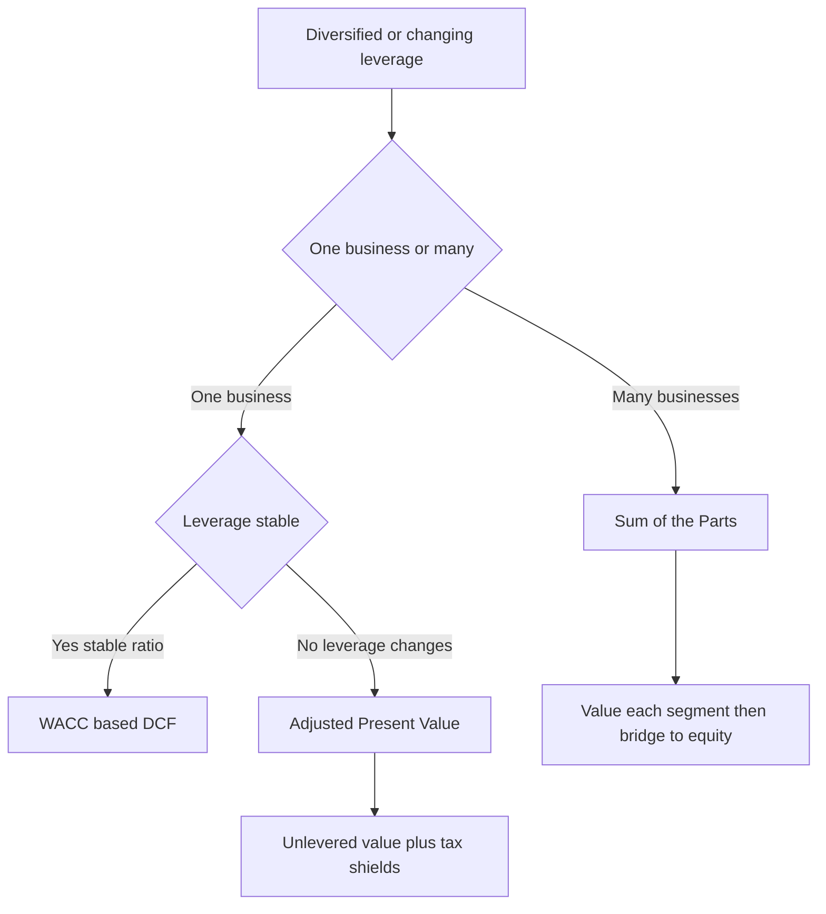
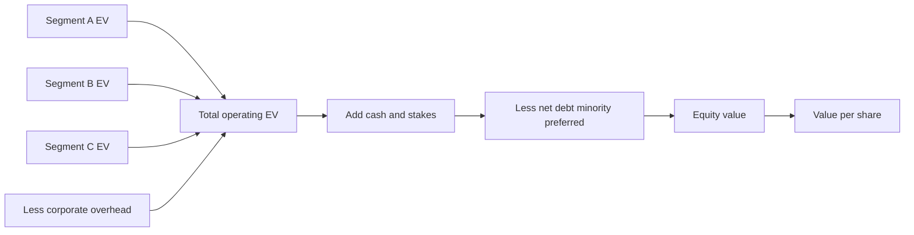
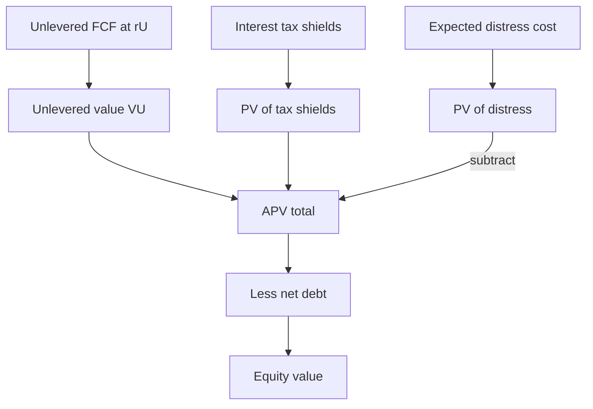

# Sum-of-the-Parts & Adjusted Present Value

## The Problem / Why this matters

Two of the most common ways a single-number DCF quietly lies to you are:

1. **The company is not one business — it is several.** A conglomerate like a Tata, a Berkshire, a Reliance, or a Siemens is a bundle of very different economic engines: a fast-growing consumer arm, a cyclical industrial arm, a regulated utility, a bank, plus a pile of listed stakes and real estate. Slapping one growth rate, one margin, and one WACC on the consolidated P&L is like pricing a fruit basket by weighing it and multiplying by the price of apples. The pieces have different risk, different growth, different capital intensity, and — crucially — different *multiples*. If you value the whole with one blended assumption, you will mis-price it and you will never be able to answer the interviewer's follow-up: "which part is actually creating the value?"

2. **The capital structure is not constant.** Standard WACC-based DCF assumes the firm holds a roughly **fixed debt-to-value ratio** forever, so that a single WACC can discount every future cash flow. That assumption breaks the moment leverage is *changing* — the textbook case being a leveraged buyout (LBO), where debt starts at 6-7x EBITDA and is paid down to 2-3x over five years. In year 1 the firm is 70% debt-funded; in year 5 it is 30% debt-funded. There is no single WACC that is correct for both. Force one in and your valuation is wrong, and you cannot cleanly say *where* the value comes from — the operations or the financing.

This chapter gives you the two tools that fix these problems:

- **Sum-of-the-Parts (SOTP)** — value each business (and each non-operating asset) separately, then add them up and bridge to equity. This is the standard framework for diversified companies, break-up analysis, holding companies, and the "conglomerate discount."
- **Adjusted Present Value (APV)** — value the business *as if all-equity financed*, then add the value of the financing side-effects (mainly the tax shield on debt) separately. This is the right tool whenever leverage changes over time.

Both share one deep idea: **value is additive**. Break the firm into pieces whose value you *can* estimate cleanly, value each on its own terms, and add. Interviewers love both because they test whether you actually understand what a DCF is doing, rather than just turning the crank.

---

## Core Idea

**Sum-of-the-Parts (SOTP):** A diversified company's enterprise value equals the sum of the enterprise values of its individual segments, plus the market value of non-operating assets, minus any unallocated corporate costs (capitalized). You then apply the same **EV-to-equity bridge** you would for any company: subtract net debt and other claims to get equity value, divide by shares for value per share.

> EV(firm) = Σ EV(segment i) + non-operating assets − PV(corporate overhead)
> Equity = EV − net debt − minorities − preferred − pensions (+ associates if not already in parts)

**Adjusted Present Value (APV):** Value the firm in two independent layers and add them.

> APV = Value if all-equity financed (unlevered) + PV of financing side-effects
> = V_U + PV(interest tax shields) − PV(costs of financial distress) ± other effects

The unlevered value is the operating business discounted at the **unlevered cost of equity** (the cost of capital with *no* leverage). The financing layer captures the fact that debt is tax-deductible, so borrowing creates real value that belongs to shareholders — plus the offsetting risk that too much debt raises the odds of distress.

The common thread: **decompose, value each piece on its own risk, then add.**

---

## Why it works this way — first principles

### Value additivity

In a frictionless market, the value of a portfolio equals the sum of the values of its holdings. If business A is worth 100 and business B is worth 60, owning both is worth 160 — otherwise you could buy the cheap side and sell the dear side for a riskless profit. This "no arbitrage" principle is what *licenses* SOTP. You are allowed to chop the firm into parts and value them separately **because value is additive across independent cash-flow streams.**

The subtlety: additivity holds for the **cash flows**, but the market may apply a **discount** to the *wrapper* that holds them (the holding company). That gap — parts worth more separately than the whole trades for — is the **conglomerate discount**, and explaining *why* it exists is a favourite interview probe (covered below).

### Why segment-level valuation beats one blended DCF

Discounting is risk-specific. A regulated utility with stable, bond-like cash flows deserves a low discount rate and supports a high multiple. A cyclical semiconductor business deserves a higher rate and a lower multiple. If you blend them, you over-discount the safe cash flows (undervaluing the utility) and under-discount the risky ones (overvaluing the chip business). The errors do not cancel — they compound, because multiples are *non-linear* in the discount rate. Valuing each part at *its own* cost of capital and *its own* comparable multiple is simply more correct.

### Why APV separates operations from financing

Here is the cleanest way to see it. A levered firm's value can always be written as:

> V_L = V_U + (value created by how it is financed)

Think of two identical companies with identical operating assets. One is all-equity; one carries debt. Their *operating* cash flows are identical — the assets don't care how they're funded (this is the Modigliani-Miller starting point). The **only** thing debt changes is the financing: interest is tax-deductible, so the levered firm pays less tax and keeps more cash. That extra cash — the **interest tax shield** — is real value, and it is created purely by the financing decision, not by operations.

APV honours this by valuing the two layers with the **right discount rate for each**:

- The **operating** cash flows carry **business risk only** → discount at the **unlevered cost of equity**, r_U.
- The **tax shield** carries the risk of the *debt schedule* → discount at a rate reflecting how safe those shields are (r_d if debt is fixed/predictable; r_U if debt tracks firm value).

WACC tries to jam both effects into one number by lowering the discount rate to reflect the tax deductibility of debt (the `(1−t)` on the cost of debt). That works fine **when the debt ratio is constant**, because then the tax shield grows in lockstep with the firm and a single adjusted rate captures it. But when leverage *changes*, the tax shield's size and risk change every year, and no single WACC can track it. APV can, because it models the shields **explicitly, year by year.**

That is the whole intuition: **WACC bakes the financing benefit into the discount rate; APV puts it in the numerator as an explicit, separately-discounted cash flow.** When financing is stable, they agree. When financing moves, only APV stays honest.

---

## Full technical content

### Part A — Sum-of-the-Parts (SOTP)

#### A.1 When to use SOTP

Use SOTP when the firm is genuinely **multi-business** and the segments differ in growth, margin, risk, or capital intensity enough that one set of assumptions distorts the answer. Classic triggers:

| Situation | Why SOTP |
|---|---|
| Diversified conglomerate | Segments have different multiples; blended DCF hides value |
| Holding company with listed stakes | Stakes have observable market value; core needs separate valuation |
| Break-up / activist / spin-off analysis | The question *is* "what are the parts worth apart?" |
| One hidden crown-jewel inside a mediocre parent | Isolate the jewel; the market may not be crediting it |
| Different geographies / regulatory regimes | Different risk and tax → different rates |

#### A.2 The four valuation approaches for a segment

Each segment can be valued by whichever method its data supports:

1. **Comparable-company multiple** — apply a peer EV/EBITDA, EV/EBIT, EV/Sales, or P/E to the segment's metric. Fast, market-anchored, most common in practice. *Pick the multiple that fits the segment's peers*, not a firm-wide average.
2. **Segment DCF** — project the segment's FCF and discount at the segment's own WACC. Most rigorous; needs disclosed or estimated segment financials.
3. **Precedent-transaction multiple** — use M&A multiples for that industry (useful in break-up/takeover contexts; includes control premium).
4. **Market value directly** — for listed stakes and quoted associates, just use the market cap of the stake (× ownership %). For cash and marketable securities, use book/market value.

#### A.3 The SOTP build — step by step

**Step 1 — Segment the firm.** Use the reported operating segments (IFRS 8 / ASC 280 disclosures give segment revenue, EBIT/EBITDA, sometimes assets and capex). Add non-operating buckets: listed investments, associates/JVs, real estate, excess cash, tax assets.

**Step 2 — Value each operating segment → segment EV.** Choose method per segment. If using a multiple:

> Segment EV = Segment metric × peer multiple

**Step 3 — Value non-operating assets.** Listed stakes at market value × stake %. Apply a **holding-company discount** or an **illiquidity/tax-on-disposal haircut** if you would have to pay capital-gains tax to monetize them (common convention: value stakes at 20-40% below headline market value, or the after-tax proceeds).

**Step 4 — Capitalize unallocated corporate costs.** Head-office overheads not charged to segments are a real drag. Capitalize them as a negative: `−(after-tax corporate cost / discount rate)`, or apply a negative multiple. Do not forget this — it is where amateurs overstate value.

**Step 5 — Sum to total enterprise value.**

> Total EV = Σ Segment EV + Non-operating assets − PV(corporate overhead)

**Step 6 — Bridge EV → equity.** Subtract net debt and all other non-equity claims:

> Equity value = Total EV − Net debt − Minority interest − Preferred − Underfunded pensions (+ Associates & Cash if not already added)

**Step 7 — Per share.** Divide by diluted shares. Optionally apply a final **conglomerate/holdco discount** to reflect that the market won't pay full parts value for the wrapper.

> Value per share = Equity value ÷ Diluted shares

#### A.4 The EV-to-equity bridge (get this exactly right)

This bridge is identical to a normal DCF and is *the* place interviewers catch people. The rule: **anything that is a claim on the firm ahead of, or alongside, common equity is subtracted; anything that is a non-operating asset the common shareholders own is added.**

| Line | Add or subtract | Why |
|---|---|---|
| Total operating EV (Σ parts) | start | Value of operating businesses |
| + Cash & equivalents | add | Owned by shareholders, not in operating EV |
| + Investments / listed stakes | add | Non-operating assets |
| + Associates / JV stake | add | If equity-accounted, not in segment EBIT |
| − Total debt | subtract | Senior claim |
| − Minority (non-controlling) interest | subtract | Portion of consolidated subs owned by others |
| − Preferred stock | subtract | Senior to common |
| − Underfunded pension / leases | subtract | Debt-like obligations |
| = Equity value | result | Belongs to common shareholders |

Note: **Net debt = Total debt − Cash**, so "− debt + cash" collapses to "− net debt." Just don't double-count cash.

#### A.5 The conglomerate discount

Empirically, diversified firms often trade **10-20% below** the sum of their standalone parts. Reasons interviewers want to hear:

- **Capital misallocation** — the parent cross-subsidizes weak divisions with cash from strong ones ("socialism in the internal capital market"), earning below-market returns.
- **Complexity / opacity** — analysts under-cover multi-business firms; harder to model → higher perceived risk → discount.
- **Agency costs & empire-building** — managers prefer size over per-share value; diversification often serves managers, not owners.
- **Reduced financial flexibility & trapped cash** — cash in one subsidiary (or one country) can't easily fund another; tax leakage on internal transfers.
- **No pure-play premium** — investors who want utility exposure can't buy it cleanly, so they won't pay the pure-play multiple.

The *mirror image* is the **break-up / spin-off thesis**: if a spin-off lets each part trade at its pure-play multiple, unlocking the discount is the value-creation catalyst activists chase. In an interview: "The SOTP says the parts are worth ₹X, the stock trades at ₹0.8X — that 20% gap is the conglomerate discount, and a demerger is the catalyst to close it."

#### A.6 Holding-company (holdco) discount

A specific version: a listed holding company that mainly owns stakes in other listed companies typically trades **below** its look-through NAV (net asset value = market value of stakes − holdco net debt). Extra reasons on top of the conglomerate list: **tax on eventual disposal** of the stakes, **holdco-level costs**, and **double taxation of dividends** passing through. Holdco discounts of 20-50% are common in practice.

---

### Part B — Adjusted Present Value (APV)

#### B.1 The APV equation

> **APV = V_U + PV(tax shields) − PV(distress costs) + PV(other financing effects)**

- **V_U** — value of the firm's unlevered operating cash flows.
- **PV(tax shields)** — the value of tax saved because interest is deductible.
- **PV(distress costs)** — expected value lost to bankruptcy risk, customer/supplier flight, fire-sale asset disposals, and management distraction, weighted by the probability of distress.
- **Other effects** — subsidized/below-market debt (e.g., government loans), issuance/flotation costs, debt-related covenants. Usually small; often ignored in a first pass.

Equity value then bridges the same way: `Equity = APV − Net debt (± other claims)`.

#### B.2 Step 1 — Unlevered value V_U

Project **unlevered free cash flow** (identical numerator to a WACC DCF):

> UFCF = EBIT × (1 − t) + D&A − Capex − ΔNWC

Note UFCF uses EBIT×(1−t), i.e., **taxes as if all-equity** — it deliberately *excludes* the interest tax shield, because APV values that shield separately in Step 2. (Double-counting the shield — once in UFCF and once as PV(tax shield) — is the single most common APV error.)

Discount UFCF at the **unlevered cost of equity r_U** (a.k.a. the "asset" or "unlevered" cost of capital):

> V_U = Σ UFCF_t / (1 + r_U)^t + Terminal Value / (1 + r_U)^n

Terminal value uses r_U (not WACC) in APV: `TV = UFCF_{n+1} / (r_U − g)`.

**Getting r_U:** unlever the equity beta, then re-lever conceptually, or use the direct rate relationship.

Beta unlevering (Hamada, with tax):

> β_U = β_L / [1 + (1 − t)(D/E)]

Then r_U = r_f + β_U × ERP (CAPM with the unlevered beta).

If you assume debt betas are zero and the tax shield tracks firm risk (Harris-Pringle), the tax-free unlevering is `β_U = β_L / (1 + D/E)`.

#### B.3 Step 2 — Value the interest tax shield

Each year the tax saving from deductible interest is:

> Tax shield_t = Interest_t × tax rate = (D_t × r_d) × t

Its present value depends on **how risky the shields are**, which depends on **how the debt is managed**:

| Debt policy | Shield risk | Discount rate for shields | PV(shield) for constant perpetual debt |
|---|---|---|---|
| **Fixed dollar debt** (schedule known in advance) | Low — as safe as the debt itself | **r_d** (cost of debt) | `t × D` (the classic Modigliani-Miller result) |
| **Debt rebalanced to a target % of value** (Harris-Pringle) | High — moves with firm value | **r_U** | `t × D × r_d / r_U` |
| **Miles-Ezzell** (rebalanced but one-period lag) | Mixed | r_d for year 1, r_U thereafter | slightly above H-P |

**The MM shortcut worth memorizing:** if debt is a *fixed permanent amount* D, the tax shield is a perpetuity of `D × r_d × t` discounted at r_d, which collapses to:

> PV(tax shield) = t × D

That is why the levered-value formula in the constant-debt world is `V_L = V_U + tD`. In an LBO, though, debt is a **known declining schedule**, so you discount each year's actual `Interest_t × t` at r_d — you do *not* use `t × D` because D is falling.

#### B.4 Step 3 — Distress costs (usually a haircut)

> PV(distress) = Probability(default) × Cost given default (as a % of firm value)

Probability of default rises steeply with leverage; cost-given-default is larger for firms with intangible, reputation-dependent, or easily-poached assets (tech, services) and smaller for hard-asset firms (real estate, utilities). In practice analysts either (a) estimate it explicitly from credit spreads / rating-implied default rates, or (b) fold it in by capping how much debt they assume. For an interview, know that it exists and *offsets* the tax shield — that trade-off is the entire theory of optimal capital structure.

#### B.5 When APV beats WACC-based DCF

| Use APV when… | Use WACC when… |
|---|---|
| Leverage **changes materially** over the forecast (LBOs, deleveraging, project finance) | Capital structure is **stable** at a target D/V |
| You want to **see the value of financing** as a separate line (tax shield, subsidized debt) | You only need the total and financing is vanilla |
| Debt is a **scheduled dollar amount** (easy to model shields directly) | Debt is managed as a **constant % of value** (WACC's native assumption) |
| Valuing a project with **project-specific financing** | Valuing a mature going concern |

**The LBO case in one line:** in an LBO, debt starts high and is paid down on a schedule, so the debt-to-value ratio falls every year. WACC assumes a *constant* ratio, so a single WACC is simply the wrong rate. APV discounts the stable operating cash flows at r_U and adds the year-by-year tax shields at r_d — both pieces are internally consistent with a *changing* balance sheet. That is why PE and academic LBO valuations lean on APV.

**Key consistency check:** with a *constant* debt ratio, APV and WACC-DCF give the **identical** answer (they must — same cash flows, same economics, just re-arranged). If they disagree in the constant-leverage case, you've made an error. Their *divergence* is meaningful only when leverage changes.

#### B.6 Relationship between r_U, r_e, r_d, and WACC

The rates are all linked. Given a target structure:

> r_e = r_U + (r_U − r_d)(1 − t)(D/E)   ← levered cost of equity (business + financial risk)

> WACC = r_e × E/V + r_d × (1 − t) × D/V

> WACC = r_U − r_U × t × (D/V)   ← Harris-Pringle simplification (constant-ratio, rebalanced debt)

The middle equation shows WACC *lowering* the rate to embed the tax shield. APV instead keeps r_U in the denominator and adds the shield in the numerator. Same economics, different bookkeeping.

---

### Method map

### SOTP EV build

### APV layers

---

## Worked examples

### Worked Example 1 — SOTP for a three-segment conglomerate

**"DiversiCorp"** reports three operating segments plus non-operating assets. All figures in ₹ crore.

| Segment | Metric | Value | Peer multiple | Method |
|---|---|---|---|---|
| Consumer (FMCG) | EBITDA | 400 | 15.0× EV/EBITDA | Comps |
| Industrials | EBITDA | 600 | 8.0× EV/EBITDA | Comps |
| Utility | EBITDA | 300 | 11.0× EV/EBITDA | Comps |

Non-operating & corporate:
- Cash: 500
- 30% listed stake in "ListCo": ListCo market cap = 2,000 → stake = 600, valued after a 25% holdco/tax haircut
- Unallocated corporate overhead: 60/year after tax, capitalize at 10%
- Total debt: 1,800
- Minority interest: 250
- Underfunded pension: 150
- Diluted shares: 100 crore
- Stock currently trades at ₹95

**Step 1 — Segment EVs.**

| Segment | Calc | Segment EV |
|---|---|---|
| Consumer | 400 × 15.0 | 6,000 |
| Industrials | 600 × 8.0 | 4,800 |
| Utility | 300 × 11.0 | 3,300 |
| **Sum of operating EV** | | **14,100** |

**Step 2 — Non-operating assets.**
- Listed stake after haircut: 600 × (1 − 0.25) = **450**
- Cash: **500**

**Step 3 — Corporate overhead (capitalized).**
- −60 / 0.10 = **−600**

**Step 4 — Total enterprise value.**

> Total EV = 14,100 (segments) − 600 (overhead) = **13,500** operating EV
> + Cash 500 + Stake 450 = **14,450** total enterprise + non-op value

**Step 5 — Bridge to equity.**

| Line | ₹ cr |
|---|---|
| Operating segment EV | 14,100 |
| − Corporate overhead (PV) | −600 |
| + Cash | +500 |
| + Listed stake (after haircut) | +450 |
| − Total debt | −1,800 |
| − Minority interest | −250 |
| − Underfunded pension | −150 |
| **= Equity value** | **12,250** |

**Step 6 — Per share.**

> Value per share = 12,250 / 100 = **₹122.50**

**Step 7 — The conglomerate-discount read.**

> SOTP fair value = ₹122.50. Market = ₹95. The stock trades at 95/122.50 = **0.776**, i.e., a **~22% conglomerate discount** to intrinsic parts value. Upside if the discount closes = 122.50/95 − 1 = **+29%**. A break-up or demerger that lets each segment re-rate to its pure-play multiple is the catalyst.

**Self-check:** 6,000 + 4,800 + 3,300 = 14,100 ✓. 14,100 − 600 + 500 + 450 = 14,450 total value; minus (1,800 + 250 + 150 = 2,200) claims = 12,250 ✓. 12,250/100 = 122.50 ✓.

---

### Worked Example 2 — APV of a five-year LBO with declining debt

A PE firm buys **"TargetCo."** Operating assumptions (₹ crore):

- Unlevered FCF (already = EBIT×(1−t) + D&A − Capex − ΔNWC):

| Year | 1 | 2 | 3 | 4 | 5 |
|---|---|---|---|---|---|
| UFCF | 120 | 135 | 150 | 165 | 180 |

- Unlevered cost of equity r_U = **12%**
- Terminal growth g = **3%**, terminal UFCF year 6 = 180 × 1.03 = 185.4
- Tax rate t = **25%**
- Cost of debt r_d = **8%**
- Debt schedule (beginning-of-year balance), paid down from an initial ₹700:

| Year | Beg. debt | Interest (8%) | Tax shield (25%) |
|---|---|---|---|
| 1 | 700 | 56.0 | 14.0 |
| 2 | 580 | 46.4 | 11.6 |
| 3 | 450 | 36.0 | 9.0 |
| 4 | 300 | 24.0 | 6.0 |
| 5 | 150 | 12.0 | 3.0 |

Ending debt after year 5 = 60 (assume steady thereafter).

**Step 1 — Unlevered value V_U.**

Discount UFCF at 12%. Discount factors: 1/1.12^t.

| Year | UFCF | DF @12% | PV |
|---|---|---|---|
| 1 | 120 | 0.8929 | 107.14 |
| 2 | 135 | 0.7972 | 107.62 |
| 3 | 150 | 0.7118 | 106.77 |
| 4 | 165 | 0.6355 | 104.86 |
| 5 | 180 | 0.5674 | 102.14 |
| Sum PV of explicit UFCF | | | **528.53** |

Terminal value at end of year 5: TV = 185.4 / (0.12 − 0.03) = 185.4 / 0.09 = **2,060.0**.
PV of TV = 2,060.0 × 0.5674 = **1,168.9**.

> **V_U = 528.53 + 1,168.9 = 1,697.4**

**Step 2 — PV of tax shields.** Debt is a *known declining schedule*, so discount each year's actual shield at r_d = 8% (fixed-schedule → shields are as safe as the debt).

| Year | Tax shield | DF @8% | PV |
|---|---|---|---|
| 1 | 14.0 | 0.9259 | 12.96 |
| 2 | 11.6 | 0.8573 | 9.94 |
| 3 | 9.0 | 0.7938 | 7.14 |
| 4 | 6.0 | 0.7350 | 4.41 |
| 5 | 3.0 | 0.6806 | 2.04 |
| Sum explicit shields | | | **36.50** |

Terminal shield: after year 5 debt is steady at ₹60, so perpetual shield = 60 × 0.08 × 0.25 = 1.2/year. Using the MM constant-debt result, terminal PV(shield) at end of year 5 = t × D = 0.25 × 60 = **15.0**. PV today = 15.0 × 0.6806 = **10.21**.

> **PV(tax shields) = 36.50 + 10.21 = 46.71**

**Step 3 — APV (ignore distress for base case).**

> **APV = V_U + PV(shields) = 1,697.4 + 46.7 = 1,744.1**

**Step 4 — Equity value.** The PE firm's entry debt is ₹700 (assume no excess cash).

> Equity value at entry = APV − Net debt = 1,744.1 − 700 = **1,044.1**

**Interpretation for the interview:** "Operations are worth ₹1,697 unlevered; the financing — the tax shield on the LBO debt as it amortizes — adds ₹47, about **2.7% of value**. Because the debt is being paid down on a fixed schedule, I discounted the shields at the 8% cost of debt, not at a blended WACC. A WACC-based DCF would be inconsistent here because the debt-to-value ratio falls every year."

**Self-check:** shield PV 46.7 is small and positive, sensible for a firm delevering fast. V_U dominated by TV (1,169 of 1,697 ≈ 69%), typical for a growing going concern. Equity 1,044 = APV 1,744 − 700 debt ✓.

---

### Worked Example 3 — APV vs WACC give the SAME answer under constant leverage

To prove the methods reconcile, take a simple perpetuity firm and value it **both ways**.

**Assumptions:**
- Unlevered perpetual FCF = 100/year, no growth.
- r_U = 10%, r_d = 6%, t = 25%.
- The firm maintains **constant debt** D = 400 forever (fixed dollar debt, MM world).

**APV route.**

> V_U = 100 / 0.10 = **1,000**
> PV(tax shield) = t × D = 0.25 × 400 = **100** (fixed perpetual debt → MM result)
> **APV = 1,000 + 100 = 1,100**
> Equity = 1,100 − 400 = **700**

**WACC route.** First get the levered cost of equity and WACC consistent with D = 400, V_L = 1,100, so E = 700, D/E = 400/700 = 0.5714, D/V = 400/1,100 = 0.3636.

> r_e = r_U + (r_U − r_d)(1 − t)(D/E) = 0.10 + (0.10 − 0.06)(0.75)(0.5714)
> = 0.10 + 0.04 × 0.75 × 0.5714 = 0.10 + 0.01714 = **0.11714** (11.714%)

> WACC = r_e × E/V + r_d(1 − t) × D/V
> = 0.11714 × (700/1,100) + 0.06 × 0.75 × (400/1,100)
> = 0.11714 × 0.6364 + 0.045 × 0.3636
> = 0.07454 + 0.01636 = **0.0909** (9.09%)

Now discount the **levered** FCF. But careful — WACC discounts *unlevered* FCF (the tax shield is inside WACC), so:

> V_L = UFCF / WACC = 100 / 0.0909 = **1,100** ✓

Both give **V_L = 1,100** and **equity = 700**. Identical.

**The lesson:** under constant leverage the two methods are algebraically the same valuation viewed from two angles. APV adds value only when leverage *changes* — which is exactly why it dominates WACC in the LBO of Example 2, where the ₹700 debt amortizes to ₹60 and no single WACC is correct.

**Self-check:** WACC 9.09% < r_U 10% by exactly the tax-shield benefit; 100/0.0909 = 1,100 = APV total ✓; equity 700 matches both routes ✓.

---

### Worked Example 4 (bonus) — SOTP with a segment DCF and a hidden crown jewel

**"HoldCo"** has two segments; the market ignores the fast-growing one.

- **Legacy Manufacturing:** EBITDA 500, peer multiple 6× → EV = 3,000.
- **SaaS division:** not yet EBITDA-positive at scale; value by DCF. UFCF: yr1 −20, yr2 10, yr3 40, yr4 70, yr5 100; terminal growth 5%; segment WACC 14%.

SaaS DCF (DF @14%):

| Year | UFCF | DF | PV |
|---|---|---|---|
| 1 | −20 | 0.8772 | −17.54 |
| 2 | 10 | 0.7695 | 7.69 |
| 3 | 40 | 0.6750 | 27.00 |
| 4 | 70 | 0.5921 | 41.44 |
| 5 | 100 | 0.5194 | 51.94 |
| Sum | | | **110.53** |

TV yr5 = 100 × 1.05 / (0.14 − 0.05) = 105 / 0.09 = 1,166.7; PV = 1,166.7 × 0.5194 = **606.0**.
SaaS EV = 110.53 + 606.0 = **716.5**.

**Total SOTP:**
- Legacy 3,000 + SaaS 716.5 = **3,716.5** EV
- Less net debt 400 → **Equity = 3,316.5**
- Shares 50 cr → **₹66.3/share**

If the market values HoldCo as "a manufacturer" at 6× blended EBITDA on ~500 (ignoring SaaS losses), it implies ~₹52/share. SOTP surfaces the ₹14/share (~27%) of hidden SaaS value. **Interview punchline:** "The blended view penalizes the whole for the SaaS losses; SOTP shows the SaaS arm is worth ₹717 crore — a quarter of equity — that the consolidated multiple buries."

**Self-check:** SaaS PV 110.53 + 606 = 716.5 ✓; equity 3,716.5 − 400 = 3,316.5; /50 = 66.33 ✓.

---

## How it is tested in interviews

**Q: "When would you use a Sum-of-the-Parts valuation instead of a single DCF?"**
Model answer: "When the company runs multiple businesses with different risk, growth, and multiple profiles — a conglomerate, a holdco with listed stakes, or any firm where one crown jewel is buried inside a mediocre parent. A blended DCF over-discounts the safe cash flows and under-discounts the risky ones. SOTP values each segment at its *own* cost of capital or peer multiple, adds them, and bridges to equity. It's also the natural framework for break-up or spin-off theses."

**Q: "Walk me through a SOTP."**
Crisp script: "Segment the firm using the reported operating segments. Value each segment — comps multiple or a segment DCF at the segment's own WACC. Value non-operating assets: cash at face, listed stakes at market value times ownership, often with a holdco or tax haircut. Capitalize unallocated corporate overhead as a negative. Sum to total EV. Then the standard bridge: subtract net debt, minority interest, preferred, and underfunded pensions to get equity value. Divide by diluted shares. Compare to the traded price — the gap is the conglomerate discount."

**Q: "What is the conglomerate discount and why does it exist?"**
"Diversified firms often trade 10-20% below their sum-of-parts. Drivers: capital misallocation across divisions, complexity and lower analyst coverage, agency costs and empire-building, trapped cash and no clean pure-play exposure for investors. The catalyst to close it is a spin-off or demerger that lets each part re-rate to its pure-play multiple."

**Q: "Walk me through APV."**
"APV values the firm in two layers. First, the unlevered value: project unlevered free cash flow — EBIT times one-minus-tax, plus D&A, minus capex and change in working capital — and discount at the *unlevered* cost of equity, r_U. Second, add the present value of financing side-effects, mainly the interest tax shield: each year's interest times the tax rate, discounted at the cost of debt if the debt schedule is fixed. Subtract expected distress costs if leverage is high. Sum the layers to get firm value, then subtract net debt for equity."

**Q: "Why and when is APV better than WACC-based DCF?"**
"WACC assumes a constant debt-to-value ratio, because it bakes the tax shield into a single discount rate. That assumption breaks when leverage *changes* — an LBO where debt amortizes from 6x to 2x EBITDA, a company deleveraging, or project finance. APV handles changing leverage cleanly because it models the tax shield explicitly, year by year, at the right discount rate, while discounting the stable operating cash flows at r_U. Under *constant* leverage APV and WACC give the identical answer — APV only adds value when the capital structure moves."

**Q: "In an LBO, why not just use WACC?"**
"Because in an LBO the debt-to-value ratio falls every year as debt is paid down, so there is no single correct WACC — it would be too low in the early high-leverage years and too high later. APV discounts operating cash flows at the unlevered rate, which doesn't change, and adds the actual scheduled tax shields at the cost of debt. It's internally consistent with a moving balance sheet, which is why PE and LBO analysis favour it."

**Q: "How do you discount the tax shield — r_d or r_U?"**
"Depends on debt policy. If the debt is a fixed, pre-set dollar schedule — like an LBO paydown — the shields are as safe as the debt, so discount at r_d; the classic result for permanent fixed debt is PV = t times D. If the firm rebalances debt to a constant percentage of value, the shields move with firm value and are as risky as the assets, so discount at r_U. Getting this right is the whole subtlety of APV."

**Q: "What's the EV-to-equity bridge?"**
"Start from enterprise value. Add non-operating assets the shareholders own — cash, investments, listed stakes. Subtract every claim senior to or alongside common equity — total debt, minority interest, preferred stock, underfunded pensions and debt-like leases. What's left is equity value; divide by diluted shares for value per share."

**Q: "A holdco trades below its NAV — is it cheap?"**
"Not automatically. Holdco discounts to look-through NAV are normal — 20-50% — because of tax on eventual disposal of the stakes, holdco-level costs, trapped cash, and no direct control. It's cheap only if the discount is wider than justified *and* there's a catalyst — a buyback at NAV, a stake monetization, or a collapse of the structure — to close it."

---

## Traps & common mistakes

**SOTP traps**

1. **Forgetting corporate overhead.** Head-office costs are real and unallocated to segments. If you sum only segment EVs and skip the capitalized overhead, you overstate value. Always subtract the PV of net corporate costs.
2. **Double-counting cash or associates.** If a segment EV already reflects an equity-accounted associate's earnings, don't add the associate again in the bridge. Cash goes in *once* — either you use net debt, or you add cash and subtract gross debt, never both.
3. **Wrong metric-multiple pairing.** Applying an EV/EBITDA peer multiple to EBIT, or a firm-wide multiple to a segment whose peers trade differently. Match the multiple's *definition* and *peer set* to the segment.
4. **Ignoring tax on monetizing stakes.** Listed stakes at full market value overstate proceeds; apply the after-tax / holdco haircut when the thesis relies on selling them.
5. **Adding the same value twice at the top and bottom.** Minority interest cuts both ways: you consolidate 100% of a sub's EBITDA into a segment EV, so you must subtract the minority's share in the bridge. Skipping it overstates equity.

**APV traps**

6. **Double-counting the tax shield.** Using *levered* FCF (which already deducts interest and gets the tax benefit) in Step 1 *and* adding PV(tax shield) in Step 2. UFCF in APV must use EBIT×(1−t) — taxes *as if all-equity* — so the shield is counted exactly once, in Step 2.
7. **Discounting UFCF at WACC in an APV.** In APV the operating cash flows are discounted at r_U, *not* WACC. Using WACC re-introduces the tax shield into the denominator and then Step 2 double-counts it.
8. **Using `t × D` when debt is amortizing.** `PV = t × D` is only valid for *permanent, fixed* debt. In an LBO with a declining schedule, discount each year's actual `Interest_t × t` — the shields shrink as debt is repaid.
9. **Wrong shield discount rate.** Using r_U for a fixed LBO schedule (understates the shield) or r_d for constantly-rebalanced debt (overstates it). Match the rate to the debt policy.
10. **Ignoring distress costs at high leverage.** For a 7x-levered LBO, expected distress costs are not negligible; omitting them overstates value and misses the point that the tax shield has a limit.
11. **Terminal value at WACC inside an APV.** The unlevered terminal value must use r_U, not WACC. Mixing rates corrupts the whole build.

---

## First-principles recap

- **Value is additive.** You may chop a firm into segments (SOTP) or into operating-plus-financing layers (APV) and value each piece on its own risk, then add — no-arbitrage guarantees it.
- **Different risks deserve different rates.** One blended WACC over a diversified firm over-discounts safe cash flows and under-discounts risky ones; segment-level valuation fixes this.
- **The conglomerate discount is real but explainable** — capital misallocation, complexity, agency costs, trapped cash — and its mirror is the break-up thesis.
- **Operations and financing are separable.** A firm's operating cash flows don't care how they're funded; the only thing leverage changes is the tax shield (a benefit) and distress risk (a cost).
- **WACC hides the tax shield in the rate; APV puts it in the numerator.** They agree under constant leverage and diverge — with APV correct — when leverage moves.
- **The shield's discount rate follows the debt policy:** r_d for fixed/scheduled debt (LBOs), r_U for debt rebalanced to a constant ratio.
- **Everything ends at the same bridge:** enterprise value → add non-op assets → subtract senior claims → equity value → per share.

---

## Quick-reference

| Concept | Formula |
|---|---|
| SOTP total EV | Σ Segment EV + Non-op assets − PV(corporate overhead) |
| Segment EV (multiple) | Segment metric × peer multiple |
| Capitalized overhead | − after-tax corporate cost ÷ discount rate |
| EV → equity bridge | Equity = EV + cash + stakes − debt − minority − preferred − pension |
| Net debt | Total debt − cash & equivalents |
| Conglomerate discount | 1 − (market cap ÷ SOTP equity value) |
| APV | V_U + PV(tax shields) − PV(distress) |
| Unlevered FCF | EBIT×(1−t) + D&A − Capex − ΔNWC |
| Unlevered value V_U | Σ UFCF_t ÷ (1+r_U)^t + TV÷(1+r_U)^n |
| Unlevered TV | UFCF_{n+1} ÷ (r_U − g) |
| Annual tax shield | D_t × r_d × t |
| PV(shield), fixed perpetual debt | t × D |
| PV(shield), rebalanced debt | t × D × r_d ÷ r_U |
| Beta unlevering (Hamada) | β_U = β_L ÷ [1 + (1−t)(D/E)] |
| Levered cost of equity | r_e = r_U + (r_U − r_d)(1−t)(D/E) |
| WACC | r_e×E/V + r_d×(1−t)×D/V |
| WACC (Harris-Pringle) | r_U − r_U×t×(D/V) |
| Distress cost | P(default) × cost-given-default |

**One-liner to remember:** *SOTP splits the firm across businesses; APV splits it across operations and financing. Both add pieces valued at their own risk, then bridge EV to equity the same way.*
