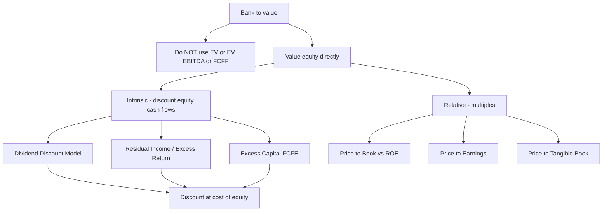
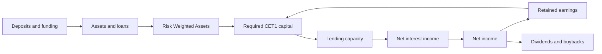

# Valuing Banks & Financial Institutions

## The Problem / Why this matters

Every valuation tool you have learned so far — enterprise value, EV/EBITDA, unlevered free cash flow to the firm, WACC — was built for an **industrial company**: a business that borrows money, buys machines, makes a product, and sells it for more than it cost. For that business, debt is *financing* — a source of capital that sits on the right-hand side of the balance sheet, separate from the operating engine that actually creates value. That separation is the entire reason enterprise-value thinking works: you value the operating business independently of how it happens to be funded, then bridge to equity by subtracting net debt.

**A bank breaks that separation completely.** For a bank, debt is not financing — it is *raw material*. Deposits, wholesale funding, and repo lines are the inventory a bank buys (it pays interest to acquire them) and then re-sells at a higher rate in the form of loans. The spread between what a bank pays for money and what it earns lending that money out *is the product*. You cannot strip out "financing" from a bank and value the "operations" underneath, because the financing **is** the operations. There is no unlevered bank.

This single fact detonates most of your valuation toolkit:

- **Enterprise value is meaningless for a bank.** EV = equity + net debt. But a bank's "debt" (deposits) is operational, and its "cash" is either regulatory reserves it cannot touch or the very inventory it lends out. Net debt is not a number you can compute cleanly, and even if you could, subtracting it makes no economic sense.
- **EV/EBITDA is meaningless.** EBITDA deliberately strips out interest — but interest expense is a bank's *cost of goods sold*. An EBITDA that ignores interest is like a retailer's EBITDA that ignores the cost of the inventory it sells. It measures nothing.
- **FCFF (free cash flow to the firm) is meaningless.** FCFF is cash available to *all* capital providers before financing. For a bank, "financing" and "operations" are the same activity, so there is no pre-financing cash flow to compute. Worse, a bank's cash flow statement is dominated by enormous, lumpy movements in loans and deposits that have nothing to do with value creation.

So how *do* you value a bank? You go back to first principles and value the thing that actually belongs to shareholders: **equity, directly.** You never take the EV detour. You discount cash flows *to equity* (dividends, via the DDM) or you value the equity capital base and the excess returns it earns (residual income). You anchor everything on **book value of equity and ROE**, because for a bank, book equity is not an accounting artifact — it is **regulatory capital**, the scarce resource that determines how much business the bank can do at all.

Why does this matter in an interview? Because the single fastest way to fail a bank equity-research or FIG (financial institutions group) interview is to say "I'd run a DCF and get to EV, then subtract net debt." The interviewer's face will fall. Conversely, the single fastest way to *impress* is to say, unprompted: *"I wouldn't use enterprise value at all for a bank — deposits are operating, not financing — so I'd value equity directly with a dividend discount or residual income model, driven off book value, ROE, and cost of equity."* That one sentence signals you actually understand what a bank is.

This chapter builds the entire framework from the ground up: why the standard tools fail, the two workhorse models (dividend discount and residual income / excess return), the P/B–ROE relationship that governs bank multiples, how regulatory capital constrains and drives value, and why net interest margin is the master value driver underneath it all.

## Core Idea

**You value a bank on its equity directly, never through enterprise value, and you anchor that value on book equity and the return the bank earns on it.**

Three sentences capture the whole chapter:

1. **Discount cash flow to equity, not to the firm.** The only clean, ownable cash flow a bank produces for its owners is what it can pay out as dividends after retaining enough capital to satisfy regulators and fund growth. So the primary DCF for a bank is a **dividend discount model** (or its refinement, a "cash-flow-to-equity" model built off excess capital), discounted at the **cost of equity** — never WACC.

2. **Value the capital base plus the excess returns it earns.** A bank's equity is worth at least its book value (the capital shareholders put in), plus a premium for every year the bank earns a return on that capital *above* what shareholders require. This is the **residual income / excess return model**, and it is the most robust bank valuation method because it front-loads value into today's book value and only forecasts the *spread* (ROE − cost of equity), which is far more stable than forecasting raw cash flows.

3. **The multiple that matters is Price-to-Book, and it is governed by ROE.** For industrials you think in EV/EBITDA; for banks you think in **P/B**. And P/B is not arbitrary — it is pinned down by a clean formula: `P/B = (ROE − g) / (r − g)`. A bank that earns exactly its cost of equity is worth exactly 1.0× book. Earn more, trade above book; earn less, trade below. Everything about bank multiples flows from that one relationship.

Underneath all of this sits the operating driver: the **net interest margin (NIM)** — the spread between the yield on assets and the cost of funding — multiplied by the size of the balance sheet the bank's capital can support. NIM is to a bank what gross margin is to a retailer: the fundamental economic engine.

## Why it works this way — first principles

Let us derive, not assert, why banks demand a different approach.

### First principle 1 — Enterprise value assumes debt is separable from operations. For a bank it is not.

Recall the logic of enterprise value. We split a company into two parts: the **operating business** (which generates operating income and free cash flow, independent of funding) and the **capital structure** (the mix of debt and equity used to finance it). EV values the operating business; the bridge (subtract net debt, subtract preferred, subtract minorities) allocates that value to the different claimants, leaving equity.

This works *only because* the operating business and the financing are genuinely different activities. Coca-Cola's syrup business exists whether Coke funds itself with 0% or 40% debt. The debt is a choice bolted onto a pre-existing operating engine.

Now ask: what is a bank's "operating business" if you strip away its debt? The answer is **nothing**. A bank with no deposits and no borrowings has no assets to lend, no spread to earn, no business at all. Deposits are not bolted on — they *are* the business. The act of gathering funds cheaply and deploying them profitably is the entire value proposition. Therefore there is no "unlevered operating business" to value, and enterprise value — which is precisely the value of that unlevered business — is undefined.

This is why the correct move is to value equity directly. We do not try to value "the firm" and then back out equity; we go straight to what the shareholder owns.

### First principle 2 — EBITDA excludes the wrong thing.

EBITDA earns its keep for industrials because interest is a financing cost, unrelated to operating performance, and D&A is a non-cash accrual. Stripping both gives a clean, capital-structure-neutral proxy for operating cash generation.

For a bank, **interest is the cost of goods sold.** A bank buys money (pays interest on deposits and borrowings) and sells money (earns interest on loans and securities). The difference — **net interest income** — is the bank's gross profit. An "earnings before interest" number for a bank is like "earnings before cost of goods sold" for a manufacturer: it adds back the single largest and most fundamental operating expense. It is not a proxy for anything. Depreciation, meanwhile, is trivial for a bank (a few branches and servers). So EBITDA both adds back the wrong thing and standardizes away nothing that matters.

### First principle 3 — Free cash flow to the firm cannot be computed for a bank.

FCFF = after-tax operating cash flow, before any financing flows, available to all capital providers. The whole construct presumes you can separate "operating" cash flows from "financing" cash flows.

For a bank, the largest cash movements *are* financing-and-operating at once. When a bank takes in $1bn of new deposits and lends out $900m, that shows up as a colossal "financing inflow" and "investing outflow" on the cash flow statement — but it is neither financing nor investing in the FCFF sense; it is the *core operation*. You cannot draw the line that FCFF requires. Practitioners therefore abandon FCFF entirely for banks and use **FCFE** (free cash flow to equity) — and even then they define FCFE specially, as the cash a bank can distribute *after* meeting its regulatory capital requirement, not the industrial-style "net income + D&A − capex − ΔNWC + net borrowing."

### First principle 4 — Book equity is real economic capital, because it is regulatory capital.

For most companies, book value of equity is a backward-looking accounting number of limited relevance — you would never say Microsoft is "worth its book value." But a bank is different. Regulators require a bank to hold equity capital equal to a percentage of its (risk-weighted) assets. That capital is the **loss-absorbing buffer** that lets the bank operate at all. It is the binding constraint on how much the bank can lend, and therefore on how much it can earn.

This makes book equity **the** central variable in bank valuation. It is the base you apply ROE to (Net income = ROE × Book equity). It is the base the market prices as a multiple (P/B). It is the resource that grows through retained earnings and shrinks through dividends and buybacks. Book value for a bank is not an afterthought — it is the engine block.

### First principle 5 — Because we discount equity cash flows, we discount at the cost of equity, never WACC.

WACC is the blended required return of *all* capital providers, used to discount FCFF (a to-the-firm cash flow). Since we never compute a to-the-firm cash flow for a bank, WACC has no role. Every bank cash flow we discount — dividends, residual income, excess-capital distributions — belongs to *equity holders only*, so the correct discount rate is the **cost of equity** `r`, typically from CAPM: `r = r_f + β × ERP`. Bank betas are often above 1 (banks are leveraged, cyclical, and sensitive to credit and rate cycles), so bank costs of equity are usually meaningfully higher than the market average — a detail worth stating in an interview.

## Full technical content

### The valuation map for a financial institution

Notice what is absent: no WACC, no enterprise value, no net-debt bridge. Every path leads to equity value directly.

### Method 1 — The Dividend Discount Model (the primary intrinsic method)

Because a bank's only clean owner cash flow is the dividend, the DDM is the natural primary model. The chapter on the DDM covered the mechanics; here is what is *bank-specific*.

**The Gordon (single-stage) form:**

$$P_0 = \frac{D_1}{r - g}$$

where `D₁` is next year's dividend per share, `r` is cost of equity, `g` is the perpetual growth rate.

**The bank-specific way to build the inputs.** For a bank you rarely start from a raw dividend. You start from **book value, ROE, and the payout the bank can afford given its capital constraint:**

- Net income = `ROE × Book equity`
- Sustainable growth `g = ROE × retention ratio = ROE × b`, where `b = 1 − payout`
- Dividend = `Net income × payout = Net income × (1 − b)`

The retention ratio is not a free choice — it is pinned by how fast the bank's *assets* (and therefore required capital) are growing. If a bank must grow its equity base at `g` to support asset growth of `g` (holding the capital ratio constant), then it must retain exactly `g / ROE` of earnings, and can pay out the rest:

$$\text{Payout} = 1 - \frac{g}{ROE}$$

This is the **sustainable payout** — the deepest idea in bank DDM. A bank growing its balance sheet at 8% while earning a 12% ROE must retain 8/12 = 66.7% of earnings to keep its capital ratio intact, and can pay out only 33.3%. Substituting this payout into Gordon gives the P/B formula we derive below.

**Multi-stage DDM** is used when a bank is over- or under-earning today and will revert to a normalized ROE — very common because bank ROEs are cyclical (they spike in benign credit environments and collapse in recessions when loan losses surge). You forecast an explicit period (say 5 years) of dividends built from a path of ROE and book value, then apply a Gordon terminal value on a *normalized* mid-cycle ROE.

### Method 2 — The Residual Income / Excess Return Model (the most robust method)

The residual income model (RIM), also called the **excess return** or **excess return on equity** model, is the FIG analyst's favorite because it is far less sensitive to terminal-value assumptions than the DDM.

**The core equation:**

$$V_0 = B_0 + \sum_{t=1}^{\infty} \frac{RI_t}{(1+r)^t}$$

where:
- `B₀` = current book value of equity (the capital already in the business)
- `RIₜ` = **residual income** in year t = `Net income_t − r × B_{t−1}` = the profit *above and beyond* the dollar cost of the equity capital employed
- `r` = cost of equity

**Read this equation carefully — it is the whole idea.** A bank's equity is worth the capital shareholders have already contributed (`B₀`), **plus** the present value of every future dollar it earns *in excess of* the required return on that capital. If a bank only ever earned exactly its cost of equity, residual income would be zero every year and the bank would be worth exactly its book value. Value above book is created **only** by earning ROE > cost of equity.

Rewriting residual income in terms of ROE makes this crystal clear:

$$RI_t = (ROE_t - r) \times B_{t-1}$$

So residual income is the **ROE spread** (`ROE − r`) times the capital base. This is why bank analysts obsess over the spread between ROE and cost of equity: it is *literally* the source of all value above book.

**Why RIM is more robust than DDM.** In a DDM (or any cash-flow DCF), a huge fraction of value — often 70–80% — sits in the terminal value, which is enormously sensitive to `g` and `r`. In a residual income model, most of the value sits in `B₀`, a number you *already know* from the balance sheet. You are only forecasting the *spread*, and spreads mean-revert (competition drives excess returns toward zero). So the model front-loads value into a hard number and forecasts a well-behaved, mean-reverting quantity. That is why RIM valuations are more stable and more defensible.

**Single-stage RIM (constant ROE and growth):**

$$V_0 = B_0 + \frac{(ROE - r) \times B_0}{r - g}$$

Divide both sides by `B₀` and you get the master P/B formula (next section).

### Method 3 — The P/B–ROE relationship (the master multiple)

Take the single-stage residual income value and divide by book value:

$$\frac{V_0}{B_0} = 1 + \frac{ROE - r}{r - g}$$

which simplifies (combining over a common denominator) to the single most important formula in bank valuation:

$$\boxed{\ \frac{P}{B} = \frac{ROE - g}{r - g}\ }$$

**This formula is the Rosetta Stone of bank valuation.** Memorize it; interviewers ask it constantly. It says:

| Situation | Result |
|---|---|
| `ROE = r` (bank earns exactly its cost of equity) | `P/B = 1.0×` — worth exactly book value |
| `ROE > r` (bank earns above its cost of equity) | `P/B > 1.0×` — trades at a premium to book |
| `ROE < r` (bank destroys value on its capital) | `P/B < 1.0×` — trades at a *discount* to book |
| Higher `ROE`, same `r`, `g` | Higher `P/B` (linear in ROE) |
| Higher `g` when `ROE > r` | Higher `P/B` (growth is valuable only if returns exceed cost) |
| Higher `g` when `ROE < r` | *Lower* `P/B` (growth destroys value if returns are below cost) |

The last row is a favorite interview trap: **growth is only good if ROE > r.** A value-destroying bank that grows faster is worth *less*, not more, because it is shoveling more capital into a negative-spread business.

**The clean derivation** (worth being able to reproduce on a whiteboard): start from Gordon `P = D₁/(r−g)`. Write the dividend as `D₁ = E₁ × payout = E₁ × (1 − g/ROE)` using sustainable payout. And `E₁ = ROE × B₀ × (1+g)`... more simply, using forward book: `E₁ = ROE × B₀` (next-year earnings on current book, for a leading multiple) gives `D₁ = ROE × B₀ × (1 − g/ROE) = B₀ × (ROE − g)`. Then `P = B₀(ROE − g)/(r − g)`, so `P/B = (ROE − g)/(r − g)`. 

**Justified P/E for a bank** falls out the same way. Since `P = B₀(ROE−g)/(r−g)` and `E₁ = ROE × B₀`:

$$\frac{P}{E} = \frac{ROE - g}{ROE \times (r - g)} = \frac{1 - g/ROE}{r - g} = \frac{\text{payout}}{r-g}$$

— the familiar justified forward P/E, consistent with the DDM.

### Regulatory capital — the constraint that governs everything

A bank cannot lend a dollar unless it holds a regulatory-mandated slice of equity capital against it. This is the master constraint on bank value. The framework is **Basel III** (with Basel III "endgame" / IV refinements), implemented through capital ratios.

**Risk-Weighted Assets (RWA).** Not all assets are equally risky, so regulators weight them. A government bond might carry a 0% risk weight; a prime mortgage 35–50%; an unsecured corporate loan 100%; a speculative exposure 150%. RWA = Σ (exposure × risk weight). Capital requirements are expressed as a percentage of RWA, not of raw assets.

**The key ratios (as % of RWA):**

| Ratio | Numerator | Typical minimum (incl. buffers) |
|---|---|---|
| **CET1** (Common Equity Tier 1) | Common equity, retained earnings, minus goodwill/intangibles/DTAs | ~7% floor, most banks target **11–13%** |
| **Tier 1 Capital** | CET1 + Additional Tier 1 (e.g. certain perpetual instruments) | ~8.5%+ |
| **Total Capital** | Tier 1 + Tier 2 (subordinated debt, etc.) | ~10.5%+ |
| **Leverage ratio** | Tier 1 ÷ total (unweighted) exposure | ~3–5% (a non-risk-weighted backstop) |

**Why this drives value:**

1. **Capital is the scarce resource.** The size of the balance sheet a bank can run — and thus how much net interest income it can generate — is capped at `CET1 / (target CET1 ratio) × (RWA density)`. More capital or a more efficient (lower-risk-weight) asset mix = more earning capacity.

2. **Excess capital is distributable; deficit capital must be funded.** The modern "cash-flow-to-equity" model for banks defines distributable cash as: earnings, plus any capital *above* the target ratio the bank can release to shareholders (buybacks/dividends), minus any capital it must *retain* to support RWA growth. This is the bank-specific FCFE:

$$FCFE_{bank} = \text{Net income} - \Delta(\text{Required capital to hit target CET1})$$

A bank sitting on excess CET1 can return more than its earnings for a while (payout > 100%); a fast-growing bank must retain earnings and may even raise capital (payout < sustainable, or negative FCFE). **This is the single most important bank-specific modeling nuance** — value comes from earnings *and* from the release of trapped excess capital.

3. **Buffers and stress tests cap payouts.** Regulators (via stress tests like the Fed's CCAR/DFAST) can restrict dividends and buybacks if a bank's capital would fall below buffers in a downturn. So the "payout the bank can afford" is a regulatory question, not just a management preference.

4. **Tangible book, not book.** Because regulators deduct goodwill and intangibles from CET1, analysts value banks on **tangible book value (TBVPS)** and use **return on tangible common equity (ROTCE)** rather than raw ROE. Goodwill absorbs no losses and earns no regulatory credit, so it is stripped out. When an interviewer asks for "the right denominator," the sophisticated answer is *tangible* common equity.

### Net Interest Margin — the master operating driver

If regulatory capital sets *how big* the bank can be, **net interest margin (NIM)** sets *how profitably* it runs that balance sheet. NIM is to a bank what gross margin is to a manufacturer.

**Definition:**

$$NIM = \frac{\text{Net interest income}}{\text{Average interest-earning assets}} = \frac{\text{Interest income} - \text{Interest expense}}{\text{Average earning assets}}$$

NIM is the spread between the average yield the bank earns on its assets (loans + securities) and the average rate it pays on its funding (deposits + borrowings), scaled by the asset base.

**Why NIM is the value engine — the driver tree.** Trace it all the way down to ROE:

- Net interest income = `NIM × Earning assets`
- Add non-interest income (fees, trading, wealth management), subtract non-interest expense (staff, tech, branches), subtract **loan loss provisions** (the expected cost of loans going bad), subtract tax → **Net income**
- `ROE = Net income / Equity`
- And value = `f(ROE, r, g)` via the P/B formula

So a change in NIM flows straight through to net income, to ROE, and to the multiple. **A bank's whole valuation can be reverse-engineered from NIM, asset growth, provisioning (cost of risk), the efficiency ratio, and the capital ratio.** These five levers are the bank-model equivalent of an industrial's revenue growth / margin / capex assumptions.

**Key related ratios interviewers expect you to know:**

| Ratio | Formula | What it tells you |
|---|---|---|
| **Net interest margin** | Net interest income / avg earning assets | Core spread profitability |
| **Efficiency ratio** | Non-interest expense / (net interest income + non-interest income) | Cost discipline — *lower is better*; ~50–60% is good |
| **Cost of risk / provision rate** | Loan loss provisions / average loans | How expensive credit losses are running |
| **NPL ratio** | Non-performing loans / total loans | Asset-quality stress |
| **Coverage ratio** | Loan loss reserves / non-performing loans | Cushion against bad loans |
| **Loan-to-deposit ratio** | Loans / deposits | Funding reliance / liquidity |
| **ROA** | Net income / average assets | Profitability per dollar of assets (~1%+ is good) |
| **ROE / ROTCE** | Net income / (tangible) common equity | Return on shareholder capital — the value driver |
| **CET1 ratio** | CET1 / RWA | Capital strength / distribution capacity |

Note the identity that ties it together: **`ROE = ROA × leverage`**, where leverage = assets / equity. Banks earn a *thin* ROA (~1%) but run *high* leverage (~10×), which is exactly why they need regulatory capital rules — the leverage that produces a respectable ROE is the same leverage that makes them fragile.

### Insurance companies — the same philosophy, different plumbing

Insurers share the core lesson (value equity directly, use DDM/RIM, anchor on book) but with their own mechanics. A life or P&C insurer collects premiums up front and pays claims later; the money held in between is the **float**, invested to earn a return. Key differences:

- The book-value anchor is **embedded value (EV, confusingly)** for life insurers — the present value of the existing policy book plus adjusted net worth — or simply book/tangible book for P&C.
- The profitability metric for P&C is the **combined ratio** = (claims + expenses) / premiums; below 100% means underwriting profit, above 100% means the insurer loses on underwriting and relies on investment income.
- Valuation multiples: **P/B and P/EV**, driven by ROE vs cost of equity — the same P/B–ROE logic as banks.

The unifying theme: **any business where the balance sheet *is* the business — banks, insurers, some specialty finance and BDCs — is valued on equity directly, off book value and return on that book.**

## Worked examples

### Worked Example 1 — Gordon DDM and the P/B–ROE formula must reconcile

**Setup.** MidCap Bank has:
- Book value of equity per share (BVPS) today = **$40.00**
- Sustainable ROE = **13%**
- Cost of equity `r` = **10%**
- Perpetual growth `g` = **5%**

**Step 1 — Sustainable payout and dividend.**
Retention needed to grow book at 5% while earning 13%: `b = g / ROE = 5% / 13% = 0.3846`.
So payout = `1 − 0.3846 = 0.6154`.

Next-year earnings on current book (leading): `E₁ = ROE × BVPS = 0.13 × 40 = $5.20`.
Next-year dividend: `D₁ = E₁ × payout = 5.20 × 0.6154 = $3.20`.

(Check via the shortcut `D₁ = B₀(ROE − g) = 40 × (0.13 − 0.05) = 40 × 0.08 = $3.20`. ✓ matches.)

**Step 2 — Gordon DDM value.**
$$P_0 = \frac{D_1}{r - g} = \frac{3.20}{0.10 - 0.05} = \frac{3.20}{0.05} = \$64.00$$

**Step 3 — Cross-check with the P/B–ROE formula.**
$$\frac{P}{B} = \frac{ROE - g}{r - g} = \frac{0.13 - 0.05}{0.10 - 0.05} = \frac{0.08}{0.05} = 1.60\times$$
Value = `1.60 × BVPS = 1.60 × 40 = $64.00`. ✓ **Reconciles exactly.**

**Step 4 — Cross-check with the residual income form.**
`RI (year 1) = (ROE − r) × B₀ = (0.13 − 0.10) × 40 = 0.03 × 40 = $1.20` in the first year, growing at 5%.
$$V_0 = B_0 + \frac{(ROE - r) \times B_0}{r - g} = 40 + \frac{1.20}{0.10 - 0.05} = 40 + \frac{1.20}{0.05} = 40 + 24 = \$64.00$$
✓ **All three methods give $64.00.** The bank is worth its $40 book value plus $24 of present-value excess returns.

**Interpretation for interview:** "The bank trades at 1.6× book because it earns a 3-point spread over its cost of equity. Of the $64 value, $40 is the capital already in the business and $24 is the capitalized value of earning 13% on capital that only costs 10%."

### Worked Example 2 — Two-stage residual income with ROE fade

**Setup.** GrowthBank is over-earning today and will fade to a mature ROE.
- Current tangible book value = **$1,000m**
- Cost of equity `r` = **11%**
- Years 1–3 ROE = **18%**, and the bank retains **60%** of earnings (pays out 40%) to fund growth
- From year 4 onward, ROE settles to a mature **12%**, growth `g` = **4%** in perpetuity

**Step 1 — Roll the book value forward through the high-growth years.**
Book grows by retained earnings each year. Retained earnings = `ROE × B_beg × retention`.

| Year | Beg. book B | Net income = 18%×B | Residual income = (0.18−0.11)×B | Retained = 60%×NI | End book |
|---|---|---|---|---|---|
| 1 | 1,000.0 | 180.0 | 70.0 | 108.0 | 1,108.0 |
| 2 | 1,108.0 | 199.4 | 77.6 | 119.7 | 1,227.7 |
| 3 | 1,227.7 | 221.0 | 85.9 | 132.6 | 1,360.3 |

(RI = `(0.18 − 0.11) × B_beg = 0.07 × B_beg`. Year 1: 0.07×1000 = 70.0; Year 2: 0.07×1108 = 77.6; Year 3: 0.07×1227.7 = 85.9.)

**Step 2 — PV of the explicit residual income (discount at 11%).**
- Year 1: `70.0 / 1.11 = 63.06`
- Year 2: `77.6 / 1.11² = 77.6 / 1.2321 = 62.98`
- Year 3: `85.9 / 1.11³ = 85.9 / 1.36763 = 62.81`
- **Sum of explicit PV of RI = 63.06 + 62.98 + 62.81 = 188.85**

**Step 3 — Terminal value of residual income from year 4 onward.**
At the start of year 4, beginning book = end-of-year-3 book = **1,360.3**.
Mature residual income in year 4 = `(ROE_mature − r) × B₃ = (0.12 − 0.11) × 1,360.3 = 0.01 × 1,360.3 = 13.60`.
This RI grows at `g = 4%`. Terminal value at end of year 3:
$$TV_3 = \frac{RI_4}{r - g} = \frac{13.60}{0.11 - 0.04} = \frac{13.60}{0.07} = 194.29$$
PV of terminal value = `194.29 / 1.11³ = 194.29 / 1.36763 = 142.06`.

**Step 4 — Assemble equity value.**
$$V_0 = B_0 + PV(\text{explicit RI}) + PV(TV) = 1,000 + 188.85 + 142.06 = \$1,330.9m$$

**Step 5 — Implied P/B.** `1,330.9 / 1,000 = 1.33× tangible book.`

**Sanity check on the terminal multiple.** The mature-phase P/B implied by the terminal formula: `(ROE−g)/(r−g) = (0.12−0.04)/(0.11−0.04) = 0.08/0.07 = 1.143×`. Applied to year-3 book of 1,360.3 → mature equity value of 1,554.6 at end of year 3. PV = 1,554.6/1.36763 = 1,136.7. Add PV of the three high-ROE dividends the bank pays during years 1–3 (payout 40%): dividends = 0.40 × NI = 72.0, 79.8, 88.4; PV = 72.0/1.11 + 79.8/1.2321 + 88.4/1.36763 = 64.86 + 64.76 + 64.64 = 194.3. Total = 1,136.7 + 194.3 = **1,331.0m.** ✓ Matches the residual-income build to rounding — the DDM and RIM reconcile.

**Interview point:** "Most of GrowthBank's $1.33bn value — a full $1.0bn — is just its existing tangible book. The premium to book is modest because its excess return fades to just 1 point over cost of equity. That is why residual income is robust: I am anchored on a known $1bn and only forecasting a shrinking spread."

### Worked Example 3 — NIM drives the whole thing, and excess capital is distributable

**Setup — build ROE from the ground up.** RetailBank:
- Average interest-earning assets = **$50,000m**
- Net interest margin = **3.0%**
- Non-interest (fee) income = **$450m**
- Non-interest (operating) expense = **$1,200m**
- Loan loss provisions (cost of risk) = **$300m**
- Tax rate = **25%**
- Common equity = **$5,000m**; RWA = **$40,000m**; target CET1 = **11%**

**Step 1 — Net interest income.** `NIM × earning assets = 3.0% × 50,000 = $1,500m.`

**Step 2 — Pre-provision, pre-tax, then net income.**
- Total revenue = NII + fees = `1,500 + 450 = 1,950`
- Pre-provision operating profit = `1,950 − 1,200 (opex) = 750`
- Pre-tax profit = `750 − 300 (provisions) = 450`
- Net income = `450 × (1 − 0.25) = $337.5m`

**Step 3 — Key ratios.**
- ROA = `337.5 / (assets ≈ 50,000) = 0.675%`
- ROE = `337.5 / 5,000 = 6.75%`
- Efficiency ratio = `opex / revenue = 1,200 / 1,950 = 61.5%`
- Current CET1 = `5,000 / 40,000 = 12.5%` (target is 11%)

**Step 4 — Sensitivity: NIM is the master lever.** Suppose NIM rises from 3.0% to **3.3%** (a 30bp improvement, e.g. from rate repricing), everything else held constant.
- New NII = `3.3% × 50,000 = 1,650` (up $150m)
- New pre-tax = `450 + 150 = 600`; net income = `600 × 0.75 = $450m` (up from 337.5)
- New ROE = `450 / 5,000 = 9.0%` — **a 30bp NIM change lifted ROE by 225bp** (6.75% → 9.0%).

**Feed into value** (assume `r = 9%`, `g = 3%`):
- At ROE 6.75%: `P/B = (0.0675 − 0.03)/(0.09 − 0.03) = 0.0375/0.06 = 0.625×` → below book (value-destructive: ROE < r).
- At ROE 9.0%: `P/B = (0.09 − 0.03)/(0.09 − 0.03) = 1.00×` → exactly book (ROE now equals r).

So a 30bp NIM improvement moved the bank from a **0.63× "problem bank" multiple to 1.0× fair value** — a ~60% increase in equity value (from $3,125m to $5,000m). **This is why NIM is the single most-watched number in bank research.**

**Step 5 — Excess capital is distributable (the FCFE nuance).** At the higher earnings, the bank holds CET1 of 12.5% vs an 11% target. Excess capital = `(12.5% − 11%) × RWA = 0.015 × 40,000 = $600m` that could be returned via buyback/dividend *on top of* ongoing earnings, provided stress tests permit. So near-term distributable cash to equity = ongoing net income **plus** a one-time $600m release — a payout ratio well above 100% for that year. An analyst who models only the dividend from earnings, and ignores the trapped $600m, undervalues the bank.

**Interview line:** "RetailBank screens cheap at 0.6× book, but that is because its 6.75% ROE is below its 9% cost of equity. The whole thesis is NIM: 30bp of margin recovery takes ROE to its cost of equity and the stock to book value. And there's a $600m capital-return kicker sitting in excess CET1."

## How it is tested in interviews

### Q: "Walk me through how you'd value a bank."
**Model answer:** "First, I would *not* use enterprise value or EV/EBITDA, because for a bank debt is operating, not financing — deposits are the raw material, and interest is effectively cost of goods sold, so EV and EBITDA are meaningless. Instead I value the equity directly. My primary intrinsic method is a residual income or dividend discount model, discounted at the **cost of equity**, not WACC. In a residual income model, equity value = current tangible book value plus the present value of future excess returns, where excess return is (ROE − cost of equity) times the equity base. On the relative side, I anchor on **price-to-tangible-book versus ROE**, because P/B is governed by the formula (ROE − g)/(r − g). I'd triangulate DDM/RIM against the P/B–ROE regression and P/E. The key drivers I'd forecast are net interest margin, balance-sheet growth, cost of risk (provisions), the efficiency ratio, and the CET1 capital ratio."

*That answer, delivered cleanly, essentially passes the bank-valuation portion of any FIG interview.*

### Q: "Why doesn't EV/EBITDA work for a bank?"
**Crisp line:** "Because EBITDA strips out interest, and for a bank interest is the cost of goods sold, not a financing item. A bank buys money and sells money — the net interest spread is its gross profit. Adding interest back gives a number that measures nothing. And enterprise value assumes you can separate operations from financing, but for a bank they're the same thing — there's no unlevered bank to value."

### Q: "A bank earns a 10% ROE and its cost of equity is 10%. What should it trade at, price-to-book?"
**Answer:** "Exactly 1.0× book. From P/B = (ROE − g)/(r − g), when ROE equals r the numerator and denominator differ only by that spread — plug ROE = r and you get (r − g)/(r − g) = 1. A bank creates value above book only by earning more than its cost of equity." *(If they add growth g, note P/B is still exactly 1.0 whenever ROE = r, for any g — a nice thing to point out.)*

### Q: "This bank earns ROE below its cost of equity but is growing fast. Is growth good or bad?"
**Answer:** "Bad. Growth is only valuable when ROE exceeds the cost of equity. Below it, every incremental dollar of retained capital earns a negative spread, so faster growth *destroys* more value. In the P/B formula, when ROE < r, raising g lowers P/B. The right move for such a bank is to shrink or return capital, not grow." *(This is a classic trap — most candidates reflexively say growth is good.)*

### Q: "How do you get from a bank's projections to equity value — what's the discount rate?"
**Answer:** "Cost of equity, always — never WACC. Every cash flow I discount for a bank belongs to equity holders: dividends, residual income, or excess-capital distributions. There's no to-the-firm cash flow because there's no separable financing. I get cost of equity from CAPM — risk-free plus beta times the equity risk premium — and bank betas tend to run above 1 because banks are leveraged and cyclical, so the cost of equity is usually higher than the market average."

### Q: "What is residual income and why do analysts prefer it for banks?"
**Answer:** "Residual income is net income minus a capital charge — specifically the dollar cost of equity, r times beginning book equity. Equivalently it's (ROE − r) times book. Value equals current book plus the PV of all future residual income. Analysts prefer it for banks because most of the value sits in today's book value — a hard number from the balance sheet — so you're only forecasting the ROE spread, which mean-reverts and is far more stable than raw cash flows. It puts far less weight on the terminal value than a DDM does."

### Q: "What's the single most important driver of a bank's profitability?"
**Answer:** "Net interest margin — the spread between asset yields and funding costs, on the size of the earning-asset base. It's the bank's gross margin. NIM times earning assets is net interest income, which is the biggest line of revenue; a small NIM change is highly geared to ROE because banks run so much leverage on a thin ROA. After NIM I'd watch cost of risk — loan loss provisions — because credit costs are what turn a good year into a bad one, and the efficiency ratio for cost discipline."

### Q: "Why tangible book value and ROTCE rather than book and ROE?"
**Answer:** "Because regulators deduct goodwill and intangibles from CET1 capital — they absorb no losses and get no regulatory credit. So the capital that actually supports the balance sheet and backstops depositors is *tangible* common equity. Valuing on tangible book and return on tangible common equity aligns the valuation with the capital regulators and the market actually care about."

### Q: "How does regulatory capital affect a bank's value?"
**Answer:** "Two ways. First, CET1 capital is the scarce resource that caps how big the balance sheet can be, so it caps earning capacity — more efficient capital use means more value. Second, capital *above* the target ratio is distributable — it's excess capital that can be returned via buybacks or dividends on top of earnings, subject to stress tests. So a proper bank cash-flow-to-equity model is earnings minus the capital needed to support asset growth, plus the release of any excess capital. Ignoring trapped excess capital undervalues the bank."

## Traps & common mistakes

1. **Using EV/EBITDA or getting to EV then subtracting net debt.** The cardinal sin. For a bank there is no enterprise value; value equity directly. Saying "EV minus net debt" in a FIG interview is an instant tell that you don't understand banks.

2. **Discounting bank cash flows at WACC.** Always cost of equity. There is no to-the-firm cash flow, so WACC never appears.

3. **Assuming growth is always good.** Growth only adds value when ROE > cost of equity. Below that, growth destroys value. Watch the sign of `(ROE − r)`.

4. **Forgetting the sustainable-payout constraint.** A bank cannot pay out 90% of earnings *and* grow its balance sheet 10% without breaching its capital ratio. Payout and growth are linked: `payout = 1 − g/ROE`. Assuming an unsustainable payout inflates the DDM.

5. **Using raw book instead of tangible book (and ROE instead of ROTCE).** Goodwill isn't regulatory capital. Analysts price banks on P/TBV and ROTCE.

6. **Ignoring excess/deficit capital in the cash flow.** A well-capitalized bank can distribute more than its earnings (releasing excess CET1); a fast grower must retain earnings or raise equity. Modeling only the earnings-based dividend misses this.

7. **Treating provisions as one-time or ignoring the credit cycle.** Bank ROEs are cyclical because loan loss provisions swing hugely between benign and recessionary environments. Valuing off a peak-cycle ROE (low provisions) overvalues; use a **normalized, mid-cycle ROE** for terminal value.

8. **Double-counting the capital charge in residual income.** Residual income already charges for the cost of equity (`r × B`). Don't then *also* discount at a rate that re-penalizes equity in a way that double-counts — the discount rate is `r`, and the capital charge inside RI is also `r`; that's correct and consistent, not a double count, but candidates sometimes get confused. The book value anchor `B₀` is *not* discounted (it's already present value).

9. **Netting the terminal value on the wrong ROE.** Terminal P/B must use the *mature* ROE, not the current (possibly elevated) one. Using a high current ROE in perpetuity is the most common overvaluation error.

10. **Confusing NIM improvement drivers.** A rising NIM from higher rates is good only if funding costs don't rise as fast (deposit beta) and if it doesn't come with higher credit losses. Don't celebrate NIM in isolation from cost of risk.

## First-principles recap

- **A bank's debt is its raw material, not its financing** — so enterprise value, EV/EBITDA, and FCFF are undefined. You value **equity directly**, always at the **cost of equity**.
- **Interest is a bank's cost of goods sold**; net interest income is its gross profit; **NIM** is its gross margin and the master operating driver.
- **Book (tangible) equity is regulatory capital** — the scarce, binding resource that determines lending capacity and therefore earning power. Value is anchored on it.
- **Value above book comes only from earning ROE above the cost of equity.** Residual income = `(ROE − r) × B` capitalizes exactly that spread.
- **P/B is governed by `(ROE − g)/(r − g)`**: earn your cost of equity → 1.0× book; earn more → premium; earn less → discount. Growth helps only when ROE > r.
- **Distributable cash = earnings adjusted for the capital needed to grow, plus release of excess CET1** — the bank-specific FCFE. Regulatory buffers and stress tests cap payouts.
- **Residual income is the most robust method** because it front-loads value into today's known book and forecasts only the mean-reverting ROE spread, minimizing terminal-value dependence.

## Quick-reference

| Concept | Formula / Rule |
|---|---|
| Do **not** use | EV, EV/EBITDA, FCFF, WACC |
| Discount rate | Cost of equity `r = r_f + β·ERP` (CAPM) |
| Gordon DDM | `P₀ = D₁ / (r − g)` |
| Sustainable growth | `g = ROE × retention = ROE × b` |
| Sustainable payout | `payout = 1 − g/ROE` |
| Dividend from book | `D₁ = B₀ × (ROE − g)` |
| Residual income (level) | `RIₜ = NIₜ − r·B_{t−1} = (ROEₜ − r)·B_{t−1}` |
| Residual income value | `V₀ = B₀ + Σ RIₜ/(1+r)ᵗ` |
| Single-stage RIM | `V₀ = B₀ + (ROE − r)·B₀ / (r − g)` |
| **Justified P/B** | `P/B = (ROE − g) / (r − g)` |
| Justified forward P/E | `P/E = payout / (r − g)` |
| Net income from book | `NI = ROE × B` |
| ROE decomposition | `ROE = ROA × (Assets/Equity)` |
| Net interest margin | `NIM = Net interest income / avg earning assets` |
| Net interest income | `NII = NIM × earning assets` |
| Efficiency ratio | `Non-interest expense / (NII + fee income)` — lower better |
| Cost of risk | `Loan loss provisions / avg loans` |
| CET1 ratio | `CET1 capital / RWA` — target ~11–13% |
| Excess capital | `(actual CET1% − target CET1%) × RWA` |
| Bank FCFE | `Net income − Δ(required capital for RWA growth)` |
| Right denominator | **Tangible** common equity; use **ROTCE**, P/TBV |
| P/B when ROE = r | Exactly `1.0×` (for any g) |
