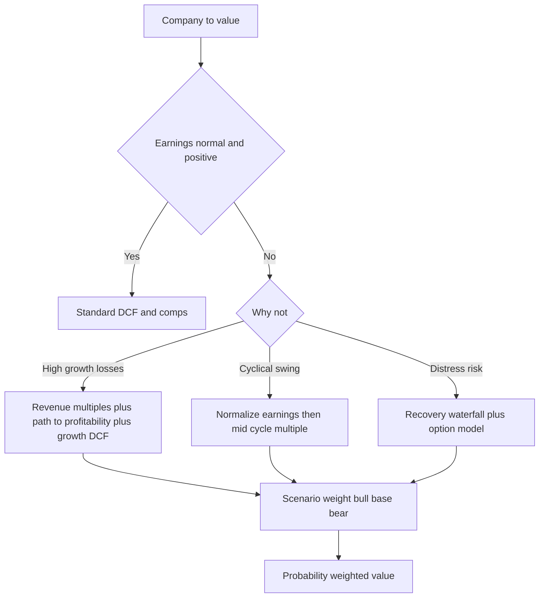
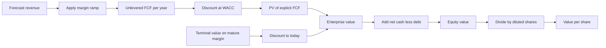
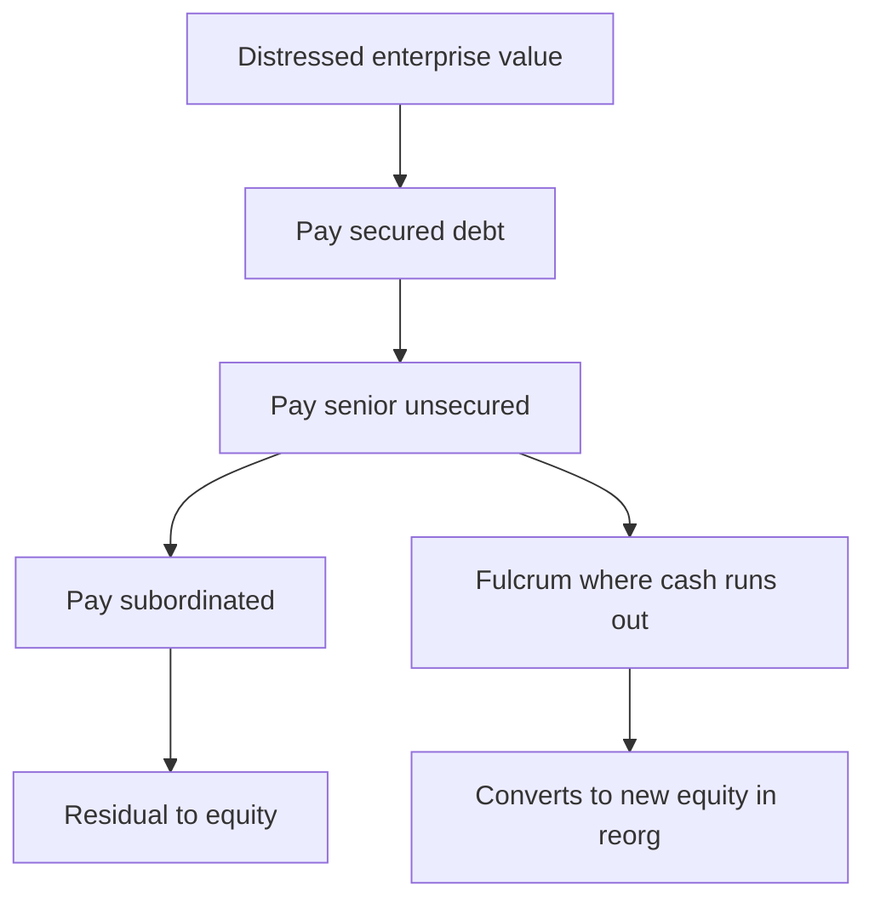

# Valuing High-Growth, Cyclical & Distressed Firms

## The Problem / Why this matters

Most valuation courses teach you to value a "normal" company: positive earnings, stable margins, a business that looks roughly next year like it did last year. You apply a P/E, run a two-stage DCF, sanity-check against comparables, and move on. That toolkit quietly assumes three things that are often false in the real world:

1. **The company earns money today.** A DCF terminal value dominates, but the early cash flows are positive and anchor the model.
2. **This year's earnings are representative.** A trailing or forward P/E only means something if the "E" is a normal, mid-cycle number.
3. **The firm will keep operating.** Going-concern is baked in; you never seriously model the scenario where the enterprise stops existing and creditors carve up the assets.

Break any one of these and the standard toolkit produces nonsense. A hyper-growth SaaS firm losing money on GAAP has no meaningful P/E — the denominator is negative. A steelmaker at the top of the cycle prints a 4x P/E that screams "cheap" right before earnings collapse 70%. A distressed retailer with more debt than assets has an equity value that behaves like a call option, not like a discounted stream of dividends.

These three situations — **high-growth loss-makers, cyclicals, and distressed firms** — are exactly where interviewers push, because they separate people who *memorized* a DCF from people who *understand* what valuation is actually doing. Every serious equity research, investment banking, and credit interview will probe at least one of them. Getting them right is also where the real money is made and lost in markets: the mispricings are largest precisely where the standard models fail.

This chapter builds the specialized toolkit from first principles: revenue multiples and path-to-profitability logic for growth; earnings normalization and mid-cycle multiples for cyclicals; option-theoretic and recovery-based frameworks for distress; and scenario / probability-weighted valuation as the connective tissue that ties them all together.

## Core Idea

Every valuation is still, underneath, the same statement: **an asset is worth the present value of the cash it will generate over its life, adjusted for risk.** The three hard cases don't overturn that principle — they force you to be honest about *which* cash flows, *whose* cash flows, and *under what conditions* they arrive.

- **High-growth loss-makers:** the cash is real but *deferred*. Today's losses are investments in tomorrow's scale. You value the *destination* (a mature, profitable business) and discount it back, using revenue and unit economics as leading indicators because earnings don't exist yet.
- **Cyclicals:** the cash is real but *lumpy and mean-reverting*. This year's number is a point on a sine wave. You value the *average through the cycle* (normalized earnings), not the peak or the trough.
- **Distressed firms:** the cash is real but *contested*. Multiple claimants (secured lenders, bondholders, equity) fight over an uncertain, possibly-insufficient pool. You value each *claim* separately, and equity becomes a *bet on survival* — mathematically, an option.

The unifying discipline across all three is **scenario thinking**: instead of a single base case, you model a distribution of outcomes and weight them by probability. A single-point DCF is a lie in these situations; a probability-weighted set of DCFs is the truth.

## Why it works this way — first-principles reasoning

**Why revenue multiples for loss-makers.** Value is the PV of future free cash flow. For a young company, FCF is negative today because it is spending ahead of revenue (sales teams, R&D, customer acquisition) to capture a market. But if you believe the business will eventually reach a steady state — say a 25% FCF margin at maturity — then value ≈ (mature FCF margin × future revenue) discounted back. Revenue is the *only* line on the income statement that already reflects the business the way it will look at scale. Earnings, margins, and cash flow are all *distorted* by the growth investment. So we anchor on revenue and make explicit assumptions about the margin the business will *earn once it stops investing to grow*. A revenue multiple is just a compressed shorthand for "future margin × discount factor × growth."

**Why normalization for cyclicals.** A P/E ratio is price divided by earnings. The price the market sets reflects the *average* earning power the company will show over many years, because an owner holds through the whole cycle. If earnings this year are 3x their mid-cycle level (a peak), then P/E looks tiny — but that's an artifact of a temporarily inflated denominator, not cheapness. Markets know this, which is why cyclicals *look* most expensive (high P/E) at the bottom, when earnings are depressed, and *cheapest* (low P/E) at the top. The fix is to replace the distorted "E" with a normalized, mid-cycle "E" that represents sustainable earning power. This is just restoring the denominator to something the numerator can sensibly be compared against.

**Why options for distress.** Equity holders have limited liability: they can lose their entire investment but no more. They receive value only if the firm's assets exceed what is owed to creditors. That payoff — "you get max(asset value − debt, 0)" — is *exactly* the payoff of a call option struck at the face value of debt, written on the firm's asset value. Robert Merton formalized this in 1974. It works this way because limited liability *creates* the optionality: downside is capped at zero, upside is unlimited. And options are worth more when the underlying is more volatile — which is why deeply distressed equity can trade well above zero even when the firm is technically insolvent. The option's "time value" reflects the chance that asset values recover before debt comes due.

**Why probability-weighting.** A DCF discounts *expected* cash flows. When outcomes are binary or highly skewed (the drug gets approved or it doesn't; the firm restructures or liquidates), a single "base case" is not the expected value — it's just one branch. The mathematically correct expected value is Σ(probability × outcome value). Averaging *scenarios* rather than averaging *inputs* respects the non-linearity of value. This is why you weight *valuations*, not assumptions.

---

## Full technical content

### Part A — Valuing high-growth, loss-making companies

#### A.1 Why earnings multiples fail

For a company burning cash, trailing and forward P/E are undefined or meaningless (negative or absurdly large E). EV/EBITDA fails too if EBITDA is negative. You need multiples further *up* the income statement, where the number is still positive and less distorted by growth investment:

| Multiple | When to use | What it implicitly assumes |
|---|---|---|
| EV/Revenue (EV/Sales) | Pre-profit, high-growth | A stable future margin the market can back into |
| EV/Gross Profit | When gross margins vary widely across peers | Gross margin is the true "quality of revenue" |
| EV/ARR (annual recurring revenue) | Subscription/SaaS | Revenue is recurring and high-retention |
| EV/(Revenue growth-adjusted) e.g. "Rule of 40" screens | Comparing growth vs profitability trade-off | Growth + margin should sum to ~40%+ |
| EV/Gross Profit ÷ growth ("growth-adjusted") | Ranking peers on a like-for-like basis | Higher growth justifies higher multiple |

**Key convention:** always use **EV** (enterprise value), never equity value / price, in the numerator of a revenue or EBITDA multiple. Revenue and EBITDA are *pre-financing* flows available to all capital providers, so they must be compared to the value of the whole enterprise. Using P/Sales mixes a levered numerator with an unlevered denominator — a classic error.

#### A.2 The path to profitability

The heart of a growth valuation is a credible bridge from *today's loss* to *tomorrow's profit*. You build it by projecting the income statement forward and letting margins expand as the business scales and growth spend normalizes:

- **Revenue:** grows fast early (say 40–80%), decelerating toward GDP+ growth over 7–10 years. Growth *must* fade — no company compounds at 50% forever; that would make it larger than the world economy.
- **Gross margin:** usually expands modestly with scale (better unit costs, pricing power), then stabilizes.
- **Operating expenses as % of revenue:** this is the big lever. S&M, R&D, and G&A are elevated early (a growth company spends 50%+ of revenue on S&M to acquire customers) and *decline as a percentage of revenue* as the company matures and existing customers generate revenue without proportional new spend. The gap between gross margin and normalized opex % is your **target operating margin**.
- **Target operating margin:** anchor it to mature, comparable businesses (what does a scaled version of this company earn?). A mature software firm might sustain 25–35% operating margins; a mature marketplace 15–25%.

#### A.3 Unit economics — the microscope

Before you trust *any* top-down margin story, you check whether the business makes money *one customer at a time*. If the unit economics don't work, no amount of scale fixes it — you just lose money faster. Core metrics:

| Metric | Formula | Interpretation |
|---|---|---|
| CAC (customer acquisition cost) | Sales & marketing spend ÷ new customers acquired | Cost to buy one customer |
| ARPU / ACV | Revenue ÷ customers (per period) | Revenue per customer |
| Gross margin per customer | ARPU × gross margin % | Contribution before opex |
| Churn | Customers lost ÷ starting customers (per period) | Leakage rate |
| Customer lifetime | 1 ÷ churn rate | Expected years retained |
| LTV (lifetime value) | (ARPU × gross margin %) ÷ churn rate | PV-ish of a customer's gross profit |
| LTV/CAC ratio | LTV ÷ CAC | Return on customer acquisition — target ≥ 3x |
| CAC payback | CAC ÷ (monthly ARPU × gross margin %) | Months to recover acquisition cost — target < 18 |
| Net revenue retention (NRR) | Revenue from existing cohort this year ÷ last year | > 100% means the base grows even with zero new logos |

The single most important idea: **an LTV/CAC above ~3x with reasonable payback means growth spend is value-creating** — every dollar of S&M buys more than a dollar of discounted future gross profit, so the *losses are rational investments*. If LTV/CAC < 1, growth *destroys* value and you should assign little or no value to the growth story.

A more rigorous LTV discounts the gross-profit annuity at a cost of capital rather than dividing by churn:

`LTV = (ARPU × gross margin%) × [ r_retain / (1 + d − r_retain) ]`

where `r_retain = 1 − churn` and `d` = discount rate. Dividing by churn (the simple formula) implicitly uses a zero discount rate and overstates LTV.

#### A.4 Putting it together — the growth DCF

The cleanest way to value a high-growth loss-maker is still a **DCF**, structured as three stages:

1. **Explicit high-growth phase (Years 1–5):** model revenue growth and the margin ramp explicitly. FCF is often negative early — that is fine and expected. Fund it with cash on hand and/or dilution (track the cash runway).
2. **Transition phase (Years 6–10):** growth fades to a sustainable rate; margins reach the target level.
3. **Terminal value:** apply Gordon Growth to a *normalized* terminal FCF (mature margin × terminal revenue), or an exit EV/EBITDA multiple consistent with a mature peer.

Because the value sits mostly in the terminal year, two assumptions dominate: **the terminal operating margin** and **the terminal revenue level** (a function of the growth path). Interviewers know this, so they attack those two inputs.

An important discipline: **discount rate should reflect stage.** Early-stage, cash-burning firms carry higher risk; some analysts use a higher WACC early and step it down as the firm matures, or (in VC) use a very high target IRR. In public equity you typically use a single WACC (10–13% for such names) but stress-test it.

### Part B — Normalizing cyclical earnings

#### B.1 The cyclical trap in one sentence

**Cyclicals look cheapest at the peak and most expensive at the trough** — because the "E" in P/E is a peak or trough number, not a normal one. Buying a low-P/E cyclical at the top of the cycle is one of the most reliable ways to lose money in equities.

#### B.2 Normalization methods

The goal is to estimate **mid-cycle (normalized) earnings** — what the company earns in an average year across a full cycle. Methods, roughly in order of rigor:

| Method | How | Best when |
|---|---|---|
| Average historical margin | Take the average operating (or net) margin over a full cycle (7–10 yrs) and apply it to *current* revenue | Revenue is not itself hugely cyclical, margins are |
| Average absolute earnings | Average the last full cycle of earnings, then grow to today's scale | Both revenue and margin swing |
| Mid-cycle ROE/ROIC | Apply a normalized ROIC to current invested capital / book value | Asset base is stable, returns mean-revert |
| Normalized commodity price | Rebuild earnings at a "through-cycle" commodity price × current volumes and cost curve | Commodity producers (oil, steel, mining) |
| Regression to trend | Fit a trend line through log-earnings, read off the trend value today | Long clean history |

**Shiller CAPE (cyclically adjusted P/E)** is the index-level cousin: price ÷ average real earnings over the past 10 years. Same idea — replace a volatile one-year denominator with a smoothed, inflation-adjusted average.

#### B.3 The mechanics

1. Identify the cycle length (peak-to-peak) and make sure your averaging window spans at least one full cycle — ideally including one recession.
2. Choose the variable to normalize (margin is usually more stable than absolute earnings; commodity price for producers).
3. Apply the normalized margin/price to *current* volume/revenue/capital to get **normalized earnings**.
4. Apply a **normal, mid-cycle multiple** to normalized earnings. Do *not* apply a peak multiple to normalized earnings or you double count.
5. Sanity-check the implied normalized ROIC against the company's cost of capital and history.

**Convention:** normalize *both* the numerator and denominator consistently. Either (a) normalized earnings × normal multiple, or (b) current earnings × through-cycle-adjusted multiple. Never mix a peak multiple with peak earnings, or a trough multiple with trough earnings.

#### B.4 Replacement cost & asset-based cross-checks

For heavy cyclicals (steel, cement, shipping), **EV/replacement cost** (a form of Tobin's Q) is a powerful cross-check. When EV falls below the cost of building the assets new, the industry stops adding capacity, supply tightens, and prices/margins eventually recover. Q < 1 is a classic bottom-of-cycle signal; Q >> 1 signals a capex boom that will flood the market and crush future returns.

### Part C — Distressed & option-based valuation

#### C.1 What "distressed" means

A firm is distressed when there is a material probability it cannot meet its obligations — signs include leverage far above peers, negative or thin interest coverage (EBIT/interest < 1–2x), bonds trading well below par (e.g., 40–70 cents), a spread to Treasuries in the hundreds/thousands of bps, or negative equity book value. Valuation shifts from "what are the cash flows worth" to "**who gets what, and with what probability**."

#### C.2 The absolute priority rule (APR) and the waterfall

In bankruptcy, claims are paid in strict seniority (the "waterfall") before any junior claim receives a cent:

1. Super-priority / DIP (debtor-in-possession) financing
2. Secured debt (up to collateral value)
3. Administrative & priority claims (some taxes, wages)
4. Senior unsecured debt
5. Subordinated debt
6. Preferred equity
7. Common equity (the residual)

**Recovery analysis** estimates a distressed enterprise value (often a low EBITDA multiple, or a liquidation asset value), then "waterfalls" it down the stack. The claim where the money *runs out* is the **fulcrum security** — the piece of debt that gets partly repaid and typically converts into the post-reorg equity. Identifying the fulcrum is the central skill of distressed/credit investing.

| Term | Meaning |
|---|---|
| Recovery rate | Value received ÷ face (claim) amount |
| Fulcrum security | The most senior claim not paid in full — converts to new equity |
| Going-concern value | EV as an operating business (EBITDA × multiple) |
| Liquidation value | Sum of asset recoveries if wound down (usually lower) |
| LGD | Loss given default = 1 − recovery rate |

#### C.3 Equity as a call option (Merton model)

Structurally, equity in a levered firm is a **European call option** on the firm's asset value `V`, struck at the face value of debt `F`, expiring at debt maturity `T`:

`Equity value E = call(V, F, σ_V, r, T)`

Using Black–Scholes:

```
E = V·N(d1) − F·e^(−rT)·N(d2)
d1 = [ ln(V/F) + (r + σ_V²/2)·T ] / (σ_V·√T)
d2 = d1 − σ_V·√T
```

and the risky debt is worth `D = V − E`. The **credit spread** and **risk-neutral default probability** fall straight out: `N(−d2)` is the risk-neutral probability the firm defaults (assets below debt at T).

Why this matters intuitively:
- **Insolvent ≠ worthless.** Even if `V < F` today (negative "intrinsic" equity), the option has *time value*: if assets are volatile and maturity is distant, there is real probability `V` climbs above `F`. So distressed equity can trade above zero.
- **Volatility helps equity, hurts debt.** Higher `σ_V` raises the call (equity) and lowers the debt. This creates the classic **risk-shifting / asset-substitution** conflict: near default, equity holders *want* the firm to take wild gambles, because they capture the upside and creditors eat the downside.
- **Debt is short a put.** Owning risky debt = owning risk-free debt + writing a put on the firm's assets. The put premium *is* the credit spread.

#### C.4 Distressed DCF & the discount-rate problem

You can still DCF a distressed firm, but:
- Use **scenario-weighted** cash flows (survive-and-recover vs restructure vs liquidate), not a single optimistic base case.
- The **discount rate** is contentious: a distressed firm's cost of capital is very high (distressed debt can yield 15–25%+). Many practitioners instead model *expected* (probability-weighted) cash flows and discount at a more normal rate, to avoid double-counting default risk (once in the cash-flow scenarios and again in a punitive discount rate).
- Watch the **debt-overhang** effect: high leverage can cause management to underinvest (all the upside of good projects flows to creditors), impairing the cash flows themselves.

### Part D — Scenario & probability-weighted valuation

This is the connective tissue. Instead of one point estimate, you build discrete scenarios, value each, and probability-weight:

`Expected value = Σ (p_i × Value_i)`  with `Σ p_i = 1`

Applications:
- **Growth:** Bull (TAM captured, high terminal margin) / Base / Bear (competition compresses margins, growth stalls). This is how you value a company that is "worth $200/share if it works, $20 if it doesn't."
- **Cyclical:** weight peak / mid / trough environments — though normalization usually already embeds this.
- **Distressed:** survive (equity worth X) / restructure (equity heavily diluted or zero, fulcrum recovers Y) / liquidate (recoveries by tranche). This directly produces expected recovery for each security.
- **Binary / event-driven** (biotech, litigation, M&A arb): `Value = p·(value if event) + (1−p)·(value if not)`.

**Real-options overlay.** Where management has flexibility — to abandon, expand, delay, or switch — a static DCF *understates* value because it ignores the option to change course as uncertainty resolves. Techniques: decision trees, Black–Scholes on the underlying project value, or binomial lattices. The value of a pharma pipeline, an undeveloped oil reserve, or a staged VC investment is fundamentally optional. Key insight: **optionality is worth more when uncertainty is higher** — the opposite of the intuition that uncertainty is always bad for value.

---

## The valuation method map



---

## Worked examples

### Worked Example 1 — Growth SaaS: unit economics, path to profitability, and a revenue-multiple cross-check

**CloudGrid Inc.** is a subscription software firm.

Given:
- Current ARR (annual recurring revenue) = $200m, growing 50% this year.
- Gross margin = 78%.
- S&M = 55% of revenue, R&D = 25%, G&A = 15% → currently *loss-making*.
- CAC = $12,000 per customer; ARPU = $6,000/yr; annual churn = 8%; net revenue retention = 118%.
- Net cash = $150m; shares outstanding = 50m.

**Step 1 — Unit economics.**
- Gross profit per customer per year = ARPU × GM% = $6,000 × 0.78 = **$4,680**.
- Simple LTV (÷ churn) = $4,680 / 0.08 = **$58,500**.
- LTV/CAC = $58,500 / $12,000 = **4.9x** → well above the 3x threshold: acquiring customers is value-creating.
- CAC payback = CAC ÷ (monthly gross profit per customer) = $12,000 ÷ ($4,680/12) = $12,000 ÷ $390 = **30.8 months**. That's longer than the <18-month ideal — a yellow flag; growth is value-creating but cash-intensive.
- Discounted LTV at d = 12%, r_retain = 0.92: LTV = $4,680 × [0.92 / (1 + 0.12 − 0.92)] = $4,680 × (0.92 / 0.20) = $4,680 × 4.6 = **$21,528**. Discounted LTV/CAC = 1.79x — still > 1, so value-creating but far less lush than the naive 4.9x. *Lesson: the simple LTV formula flattered the business.*

**Step 2 — Current operating margin (to confirm it's a loss-maker).**
Operating margin = GM − opex% = 78% − (55% + 25% + 15%) = 78% − 95% = **−17%**. On $200m revenue that's a **−$34m** operating loss. Confirmed.

**Step 3 — Path to profitability (5-year sketch).** Assume revenue growth fades 50% → 40% → 32% → 26% → 20%, and S&M falls from 55% → 30% of revenue as the installed base compounds (NRR 118% means the base grows without proportional S&M), R&D 25% → 20%, G&A 15% → 10%, gross margin 78% → 80%.

| Year | Growth | Revenue ($m) | GM% | S&M% | R&D% | G&A% | Op margin | Op profit ($m) |
|---|---|---|---|---|---|---|---|---|
| 0 | — | 200 | 78 | 55 | 25 | 15 | −17% | −34.0 |
| 1 | 50% | 300 | 78 | 48 | 24 | 14 | −8% | −24.0 |
| 2 | 40% | 420 | 79 | 42 | 22 | 13 | +2% | +8.4 |
| 3 | 32% | 554 | 79 | 37 | 21 | 12 | +9% | +49.9 |
| 4 | 26% | 698 | 80 | 33 | 20 | 11 | +16% | +111.7 |
| 5 | 20% | 838 | 80 | 30 | 20 | 10 | +20% | +167.6 |

By Year 5 the firm reaches a **20% operating margin** on ~$838m revenue — a credible mature-software profile.

**Step 4 — Revenue-multiple cross-check on today's value.** Suppose mature peers trade at EV/Revenue ≈ 8x when growing 50% with a clear path to 25%+ margins. EV ≈ 8 × $200m = **$1,600m**. Equity value = EV + net cash = 1,600 + 150 = **$1,750m**. Per share = 1,750 / 50 = **$35.00**.

**Step 5 — Reconcile against a quick terminal-value logic.** Year 5 operating profit $167.6m; tax at 23% → NOPAT ≈ $129m; assume Year 5 is near steady FCF conversion. If mature such firms trade ~20x NOPAT, Year-5 enterprise value ≈ $2.58bn. Discounting back 5 years at 12%: 2,580 / 1.12^5 = 2,580 / 1.762 = **$1,464m** — in the same neighborhood as the $1,600m revenue-multiple EV, confirming internal consistency. Averaging, call EV ≈ $1.5bn, equity ≈ $1.65bn, **~$33/share**.

**Takeaway to say aloud:** "The unit economics justify the growth spend — LTV/CAC ~5x on the simple measure, ~1.8x discounted — so the losses are rational investment. The DCF and revenue multiple both land near $1.5–1.7bn EV / ~$33–35 per share, with the answer almost entirely driven by the terminal margin assumption of ~20–25%."

---

### Worked Example 2 — Normalizing a cyclical: don't buy the peak

**Ferro Steel Co.** — a commodity steelmaker at the top of its cycle.

Given (current, peak year):
- Revenue = $10,000m; EBIT margin = 20% (peak); EBIT = $2,000m.
- Shares = 500m; share price = $40 → market cap = $20,000m.
- Net debt = $4,000m → EV = $24,000m.
- Tax = 25%. Historical EBIT margins over the last full cycle: 20% (peak), 14%, 9%, 4% (trough), 8%, 12%, 15% → average ≈ **11.7%**.

**Step 1 — The naive (trap) multiple.** Current EV/EBIT = 24,000 / 2,000 = **12x**; on net income (EBIT×0.75 − after-tax interest, ignore interest for simplicity → ~$1,500m) trailing P/E ≈ 20,000 / 1,500 = **13x**. Looks reasonable, even cheap for the sector's peak optics.

**Step 2 — Normalize earnings.** Apply the through-cycle average EBIT margin to current revenue:
Normalized EBIT = 11.7% × $10,000m = **$1,170m**. Normalized net income ≈ $1,170m × 0.75 = **$877.5m** (ignoring interest for a clean comparison; with $4bn net debt at 5% = $200m interest, taxed: normalized NI ≈ (1,170 − 200) × 0.75 = **$727.5m**).

**Step 3 — Normalized multiples reveal the truth.**
- Normalized EV/EBIT = 24,000 / 1,170 = **20.5x** — far richer than the 12x headline.
- Normalized P/E = 20,000 / 727.5 = **27.5x** — the stock is *expensive*, not cheap. The low headline P/E was an artifact of peak earnings.

**Step 4 — Fair value on a mid-cycle multiple.** Suppose a fair mid-cycle EV/EBIT for this steelmaker is **8x** (cyclical, capital-intensive, low ROIC).
Fair EV = 8 × normalized EBIT = 8 × $1,170m = **$9,360m**.
Fair equity = EV − net debt = 9,360 − 4,000 = **$5,360m**.
Fair value per share = 5,360 / 500 = **$10.72**.

**Step 5 — The verdict.** Trading at $40 versus normalized fair value ~$10.72, the stock is priced for peak conditions to persist. If margins mean-revert toward 11.7%, EBIT falls from $2,000m to ~$1,170m and the multiple re-rates down simultaneously — a double hit. **This is the textbook cyclical value trap.** A cross-check: if EV/replacement cost of the asset base is, say, 1.6x here, that reinforces "top of cycle — new capacity is coming."

**Takeaway to say aloud:** "Never apply a multiple to peak earnings. Normalizing to an 11.7% mid-cycle margin, the true EV/EBIT is ~20x, not 12x — the stock is discounting the peak as permanent. Fair value near $11 versus $40 means the low headline P/E is a trap."

---

### Worked Example 3 — Distressed firm: recovery waterfall, fulcrum security, and equity as an option

**Zenith Retail** is over-levered and may restructure.

Capital structure (face values):
- Secured term loan: $300m
- Senior unsecured notes: $400m
- Subordinated notes: $200m
- Total debt = **$900m**; Common equity: 100m shares.

Distressed enterprise value estimated via scenarios of EBITDA × exit multiple. Current EBITDA = $120m; distressed exit multiple ≈ 5x → **going-concern EV ≈ $600m**. Liquidation value of assets ≈ **$450m**.

**Step 1 — Recovery waterfall (going-concern, EV = $600m).**

| Claim (seniority) | Face | Cumulative claim | Paid from $600m | Recovery % |
|---|---|---|---|---|
| Secured term loan | $300m | $300m | $300m | 100% |
| Senior unsecured | $400m | $700m | $300m | 75% |
| Subordinated | $200m | $900m | $0 | 0% |
| Common equity | — | — | $0 | 0% |

Value runs out inside the **senior unsecured notes** — so the **senior unsecured is the fulcrum security**. It recovers 75% (the remaining $300m ÷ $400m face) and, in a reorganization, typically converts into the new equity of the company. Subordinated notes and common equity are **out of the money** on the going-concern value.

**Step 2 — Liquidation scenario (EV = $450m).**

| Claim | Face | Paid from $450m | Recovery % |
|---|---|---|---|
| Secured | $300m | $300m | 100% |
| Senior unsecured | $400m | $150m | 37.5% |
| Subordinated | $200m | $0 | 0% |
| Equity | — | $0 | 0% |

Here the fulcrum is *still* the senior unsecured, but recovery drops to 37.5%. Secured is money-good in both cases.

**Step 3 — Probability-weighted recovery on the senior unsecured.** Suppose: going-concern restructuring 60%, liquidation 40%.
Expected recovery = 0.60 × 75% + 0.40 × 37.5% = 45% + 15% = **60%**.
If the senior notes trade at **52 cents**, an investor buying the fulcrum has expected recovery ~60c → positive expected return, plus the equity upside from conversion. That is the distressed-debt thesis in one line.

**Step 4 — Equity as an option (why common isn't necessarily zero).** Model equity as a call on asset value `V`, struck at total debt `F = $900m`, maturity `T = 2` years (when the big maturity wall hits).
Inputs: `V = $600m` (current asset/EV), `σ_V = 60%` (retail, distressed → high vol), `r = 5%`.

```
d1 = [ ln(600/900) + (0.05 + 0.60²/2)(2) ] / (0.60·√2)
   = [ ln(0.6667) + (0.05 + 0.18)(2) ] / (0.8485)
   = [ −0.4055 + 0.46 ] / 0.8485
   = 0.0545 / 0.8485 = 0.0642
d2 = 0.0642 − 0.8485 = −0.7843
N(d1) ≈ 0.526 ,  N(d2) ≈ 0.216
E = 600(0.526) − 900·e^(−0.05·2)(0.216)
  = 315.6 − 900(0.9048)(0.216)
  = 315.6 − 175.9 = $139.7m
```

Even though the firm is "underwater" (assets $600m < debt $900m), the equity call is worth **~$140m**, or **$1.40/share** on 100m shares — pure *time value*. The risk-neutral default probability is `N(−d2) = N(0.7843) ≈ 78%` — high, as expected for a distressed name, yet the 22% survival-and-recover chance keeps equity alive.

**Step 5 — Reconcile the two lenses.** The waterfall says equity recovers **$0** *if restructuring happens today*. The option model says equity is worth **~$140m** *because restructuring might not happen for two years and asset values are volatile*. Both are correct: the option value is the market's price for the *chance* that Zenith trades its way out before the maturity wall. In practice distressed equity often trades at a small positive value for exactly this reason, and the gap between the two is the "hope value."

**Sanity note on the bridge:** going-concern EV $600m = fulcrum-and-senior claims of $600m paid out, with $300m of face (subordinated) and all equity impaired. Debt market value ≈ $600m; equity option value $140m is *incremental time value above the current asset value*, not additional enterprise value already counted — it is a claim-splitting/optionality effect, not double counting of EV.

**Takeaway to say aloud:** "The senior unsecured is the fulcrum — it recovers ~60% blended and converts to new equity, so it's the security to own. Common equity is worthless on a liquidation basis today but carries option value of about $1.40 because assets are volatile and the maturity is two years out."

---

## The EV build and DCF bridge (for the growth case)





---

## How it is tested in interviews

Interviewers use these cases to see whether you can *reason*, not recite. Below are the exact prompts and crisp model answers.

**Q: "How do you value a company that has no earnings?"**
> "I move up the income statement to a line that's still positive and less distorted by growth spend — usually revenue, sometimes gross profit — and use an EV/Revenue or EV/Gross Profit multiple benchmarked to peers with a similar growth-and-margin profile. But a multiple is just shorthand; the real work is a DCF that models the path to profitability: revenue growth fading over time and operating margin ramping to a mature target as S&M and R&D normalize as a percent of revenue. I anchor the terminal margin to a scaled, mature comparable. And I check unit economics — LTV/CAC and payback — to confirm the growth spend is actually value-creating rather than just burning cash."

**Q: "Walk me through a DCF for a pre-profit high-growth company."**
> "Three stages. Stage one, five years of explicit forecasts — high revenue growth, FCF often negative early as the company invests. Stage two, a transition where growth decelerates to GDP-plus and margins reach the mature target. Stage three, terminal value using Gordon Growth on a *normalized* terminal FCF or an exit EV/EBITDA on a mature peer. Discount everything at WACC — maybe 11–13% for a name like this — sum to EV, add net cash, divide by diluted shares including options and RSUs. The value is dominated by the terminal margin and the terminal revenue level, so I always sensitize those two."

**Q: "This cyclical trades at 6x earnings — is it cheap?"**
> "Not necessarily — that's the classic cyclical trap. Cyclicals look cheapest at the peak because the 'E' is inflated. I'd normalize: take the average margin over a full cycle, apply it to current revenue to get mid-cycle earnings, then apply a normal mid-cycle multiple. If the 6x is really 18x on normalized earnings, the stock is discounting peak conditions as permanent and is actually expensive. I'd cross-check with EV/replacement cost — below 1x supports a real bottom; well above 1x confirms a peak with new supply coming."

**Q: "How can a company that's insolvent still have positive equity value?"**
> "Because equity is a call option on the firm's assets, struck at the face value of debt, with limited liability capping the downside at zero. Even if assets are below debt today, if the assets are volatile and the debt matures in the future, there's a real probability assets recover above the debt before maturity — that's the option's time value. Merton formalized this with Black–Scholes. It's also why distressed equity can trade above zero and why equity holders like volatility near default — the asset-substitution problem."

**Q: "What's the fulcrum security and why do you care?"**
> "The fulcrum is the most senior claim that *isn't* paid in full when you waterfall the restructured enterprise value down the capital structure — the security where the money runs out. It matters because in a reorganization the fulcrum typically converts into the new equity, so it captures the upside of the recovery. If you're a distressed investor, you want to identify and own the fulcrum: senior claims above it are money-good but low-return, junior claims below it are likely zeroed."

**Q: "How would you value a biotech with one drug in Phase 3?"**
> "Scenario / probability-weighted. Value the company assuming approval — a DCF of the drug's peak sales, ramp, and patent-cliff — call it X per share. Value it assuming failure — basically cash minus burn — call it Y. Then weight by the clinical probability of success, maybe 60% for a Phase 3 asset: expected value = 0.6X + 0.4Y. A single point estimate is meaningless for a binary outcome; you have to weight the branches. If there's a pipeline, each program is a real option and I'd sum their risk-adjusted values."

**Q: "Peak or trough — when does a cyclical look cheapest on P/E?"**
> "At the peak. Earnings are highest, so P/E is lowest, making it look cheap right before earnings roll over. And it looks most *expensive* at the trough on depressed earnings — which is often the best time to buy. That inversion is exactly why you normalize."

**Q: "How do you get from enterprise value to equity value per share?"**
> "EV minus net debt — that's total debt plus preferred and minority interest, minus cash and equivalents — gives equity value. Then divide by fully diluted shares, using the treasury method for in-the-money options and RSUs. For a growth company with a big option pool, that dilution is material, so I never skip it. For a distressed name, I don't do a simple bridge at all — I waterfall EV through the claims by seniority, because the 'net debt' isn't going to be paid at par."

**One-liners worth memorizing:**
- "Losses can be rational investment — check LTV/CAC and payback before judging."
- "Never apply a multiple to peak or trough earnings; normalize first."
- "Equity is a call option on the assets struck at the debt."
- "Own the fulcrum."
- "Weight the scenarios, not the assumptions."

---

## Traps & common mistakes

1. **Using P/Sales instead of EV/Sales.** Revenue is pre-financing; it must be compared to enterprise value, not equity value. Mixing levered numerator with unlevered denominator is a rookie error.
2. **Straight-lining hyper-growth.** No company grows 50% forever. Growth *must* fade in the model, or terminal value explodes to absurdity.
3. **Assuming margins never expand — or expand infinitely.** Both are wrong. Justify the terminal margin against a *specific* mature comparable.
4. **Trusting the simple LTV/churn formula.** Dividing gross profit by churn assumes a zero discount rate and infinite customer life — it flatters LTV. Discount the annuity.
5. **Buying the low-P/E cyclical at the peak.** The single most reliable cyclical mistake. Low headline P/E on peak earnings = expensive.
6. **Applying a peak multiple to normalized earnings (or vice versa).** Double counting. Normalize numerator and denominator consistently.
7. **Treating distressed equity as a DCF.** It's an option; a going-concern DCF ignores default probability and the claim waterfall entirely.
8. **Ignoring the capital structure / fulcrum in distress.** Enterprise value is meaningless to a specific security until you know where it sits in the waterfall.
9. **Punishing cash flows *and* the discount rate for the same risk.** In distress, either scenario-weight the cash flows *or* use a high distressed discount rate — not both, or you double-count default risk.
10. **Single-point valuation for binary outcomes.** For biotech, litigation, or restructuring, a base case is not the expected value. Probability-weight.
11. **Forgetting dilution.** Growth firms have huge option/RSU pools; diluted share count can be 10–20% above basic. Always use treasury-method diluted shares.
12. **Confusing going-concern and liquidation value.** They differ, often materially; the relevant one depends on whether the firm reorganizes or is wound down, so scenario-weight both.

---

## First-principles recap

- **Value is always the risk-adjusted PV of future cash — the three hard cases just distort *which* cash, *whose* cash, and *under what conditions*.** Growth defers it, cyclicality averages it, distress contests it.
- **For loss-makers, value the destination, not today.** Anchor on revenue and a *justified* mature margin; use unit economics to prove the growth spend creates value (LTV/CAC ≥ 3x, sensible payback).
- **For cyclicals, average through the cycle.** Normalize earnings to mid-cycle and apply a normal multiple; the low peak P/E is a trap, not a bargain.
- **For distress, split the claims and think in options.** Waterfall EV by seniority to find the fulcrum; equity is a call struck at the debt, so insolvent ≠ worthless.
- **When outcomes are skewed or binary, weight the scenarios, not the inputs.** Expected value = Σ p·V. Optionality is worth *more* when uncertainty is *higher*.
- **Terminal assumptions dominate — so attack them.** In every one of these models, the answer lives in the terminal margin, the normalized level, or the recovery/probability. Sensitize relentlessly.
- **Match the numerator to the denominator, and the discount rate to the cash flows.** EV with pre-financing flows; don't double-count risk.

---

## Quick-reference

| Concept | Formula / Rule |
|---|---|
| EV/Revenue | EV ÷ Revenue (use EV, never price) |
| LTV (simple) | (ARPU × GM%) ÷ churn |
| LTV (discounted) | (ARPU × GM%) × [ r_ret / (1 + d − r_ret) ], r_ret = 1 − churn |
| LTV/CAC target | ≥ 3x (value-creating growth) |
| CAC payback | CAC ÷ (monthly ARPU × GM%); target < 18 months |
| Net revenue retention | Existing-cohort revenue this yr ÷ last yr; > 100% good |
| Rule of 40 | Revenue growth % + FCF (or EBITDA) margin % ≥ 40 |
| Growth DCF | 3 stages: explicit → transition → terminal on mature margin |
| Normalized earnings | Through-cycle avg margin × current revenue |
| Cyclical rule | Cheapest P/E at peak; normalize before judging |
| Mid-cycle value | Normalized earnings × normal multiple |
| Tobin's Q | EV ÷ replacement cost of assets; < 1 = bottom signal |
| Recovery rate | Value received ÷ face claim |
| Fulcrum security | Most senior claim not paid in full → converts to new equity |
| Equity as call | E = V·N(d1) − F·e^(−rT)·N(d2) |
| d1, d2 | d1 = [ln(V/F)+(r+σ²/2)T]/(σ√T); d2 = d1 − σ√T |
| Risk-neutral default prob | N(−d2) |
| Debt = risk-free − put | Credit spread = value of the written put on assets |
| Expected value | Σ (p_i × Value_i), Σ p_i = 1 |
| Binary event value | p·(value if event) + (1−p)·(value if not) |
| EV → equity | Equity = EV − net debt − preferred − minorities (going concern) |
| Distress → equity | Waterfall EV through claims by seniority; don't net at par |
