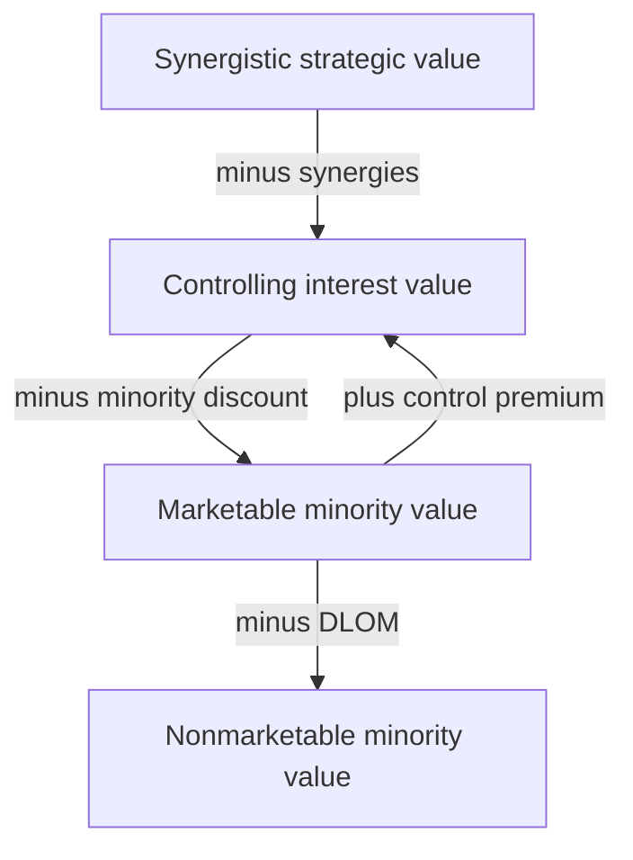
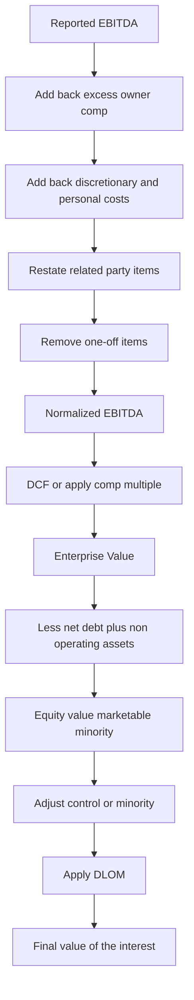
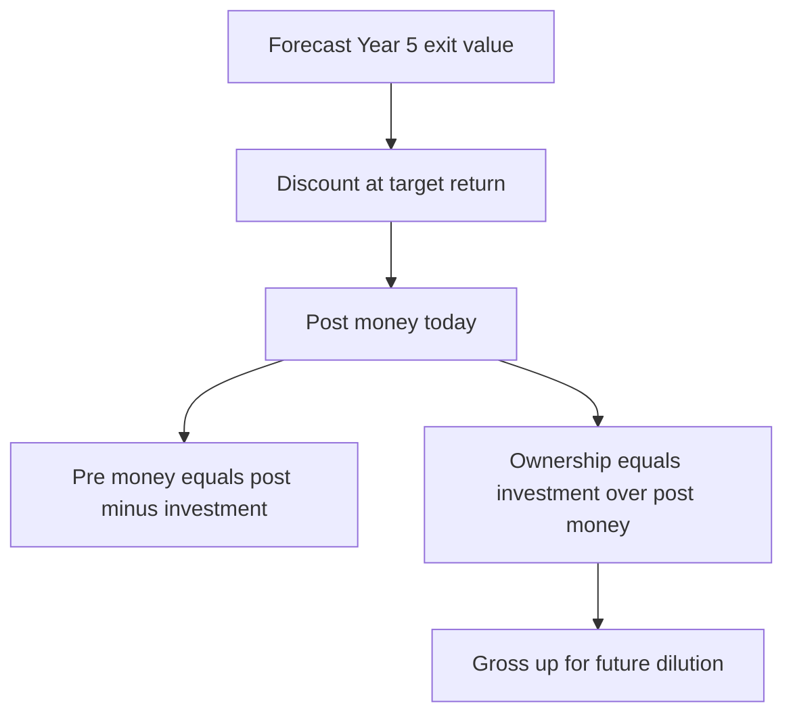

# Private Company Valuation & Illiquidity

## The Problem / Why this matters

Almost every valuation technique you learn first is built on a convenient fiction: that there is a liquid, continuously quoted market price for the thing you are valuing. Beta comes from a regression of the stock against the index. The equity value is "shares outstanding times price." The cost of equity assumes you can diversify away idiosyncratic risk because you hold a tiny slice of a huge, tradable float. WACC assumes a target capital structure you can observe from market values of debt and equity.

Now strip all of that away. You are valuing a family-owned auto-parts manufacturer in Pune, a founder-run SaaS business, a regional hospital chain, or a Series B startup. There is **no ticker, no daily price, no market beta, no observable float**. The owner is also the CEO, and his "salary" is whatever the accountant decided minimizes tax. The financials are prepared for the taxman, not for you. Half the value walks out of the door every evening in the founder's head. And when you finally arrive at a number, the buyer cannot simply sell the stake next Tuesday — it may take a year to find a counterparty and close a deal.

This is the world of **private company valuation**, and it is where a huge fraction of real-world valuation work actually happens: M&A of private targets, private equity, venture capital, ESOP valuations, estate and tax disputes, fairness opinions, litigation, and pre-IPO pricing. It is also a favourite interview battleground precisely because it forces you off the memorized "walk me through a DCF" script and tests whether you actually understand *why* each input exists.

The core difficulty is threefold:

1. **No market price and thin data** — you cannot observe value, so you must build it, and the raw inputs (beta, cost of equity, capital structure, even "true" earnings) all have to be manufactured from public proxies.
2. **The numbers are not clean** — reported private-company earnings are distorted by owner compensation, related-party transactions, personal expenses run through the business, and aggressive or conservative tax accounting. You must **normalize** before you value.
3. **Illiquidity and control** — a private stake is worth less than an identical publicly traded stake because you cannot sell it easily, and its worth changes depending on whether you are buying *control* or a *minority* slice. These are captured through **discounts and premia**.

Master this chapter and you can value anything, quoted or not. You will also have a much deeper grasp of *why* the public-company shortcuts work — because you will have seen what breaks when you remove them.

---

## Core Idea

> **A private company is valued with the same discounted-cash-flow and multiples machinery as a public one — but every input that a public market would have handed you for free must now be estimated from public proxies, the earnings must be normalized to an arm's-length basis, and the final value must be adjusted for the specific buyer's level of control and for the illiquidity of the stake.**

Three big moves distinguish private-company work:

- **Rebuild the discount rate from public proxies.** You cannot regress a private stock, so you borrow beta from comparable public companies (unlever and relever), and you often add small-company and company-specific risk premia to the cost of equity.
- **Normalize the earnings.** Reported EBITDA/earnings are adjusted to what the business would earn under professional, market-rate management with arm's-length costs — the biggest single adjustment being **owner compensation**.
- **Adjust for control and marketability.** Start from the value implied by public comps (which are *marketable, minority* prices), then add a **control premium** if you are buying control, and subtract a **discount for lack of marketability (DLOM)** because the stake cannot be readily sold.

Everything else — venture-style valuation for pre-profit startups, the choice of income vs market vs cost approach — hangs off these three ideas.

---

## Why it works this way — first principles

Value, at root, is always the same object: **the present value of expected future cash flows, discounted at a rate that reflects their risk**. Nothing about being private changes that definition. What changes is *your information*.

**Why borrow beta from public comps.** Beta measures systematic (non-diversifiable) risk — the sensitivity of an asset's returns to the market. It is a property of the *business and its operating/financial leverage*, not of whether the stock happens to trade. Two companies in the same industry, with the same business model and the same leverage, have roughly the same systematic risk regardless of listing status. So you can read the risk of a private firm off its public twins. You must strip out the twins' financial leverage (unlever beta to get the pure business/asset risk) and re-apply the private firm's own leverage (relever), because leverage is firm-specific but business risk is shared.

**Why add extra premia.** The pure CAPM beta captures only systematic risk under the assumption of a *fully diversified* investor. The typical buyer of a private company — a founder, a family, a PE fund concentrating capital — is *not* diversified. They bear idiosyncratic risk that CAPM says should be free. Empirically, small and closely held firms have delivered returns above what raw CAPM predicts (the size effect), and specific firms carry key-person, customer-concentration, and thin-data risks. Adding a **size premium** and a **company-specific risk premium** is the practitioner's patch for the gap between CAPM's diversified-investor world and the concentrated reality of private ownership.

**Why normalize earnings.** Value belongs to a *business*, not to a particular owner's tax strategy. If the founder pays himself ₹2 crore when a hired CEO would cost ₹60 lakh, the reported profit understates the economic earning power of the business by ₹1.4 crore. A rational buyer values the cash flows *available to any owner running it at arm's length*. Normalization converts idiosyncratic, owner-specific accounting into the standardized earning power that a buyer is actually purchasing.

**Why control and marketability adjustments exist.** These follow from two simple facts:

- **Control has value** because whoever controls the company controls its cash flows — dividend policy, compensation, capital allocation, whether to sell or lever up. A 51% stake is worth more *per share* than a 10% stake because the 51% holder can *do things* to unlock value that the minority holder cannot. Hence a **control premium** over minority value, and a mirror-image **minority (lack-of-control) discount**.
- **Liquidity has value** because the ability to convert an asset to cash quickly, at low cost, and at a predictable price is itself worth paying for. A publicly traded share can be sold in seconds at the quoted price; a private stake may take 6–18 months, cost 5–10% in fees, and close at an uncertain price. Investors demand compensation for giving that up — the **illiquidity (marketability) discount**. This is the same reason a 10-year off-the-run Treasury yields a hair more than the on-the-run bond, only far larger in magnitude.

Once you internalize "same DCF, but manufacture the inputs and adjust for who's buying and how trapped the money is," private-company valuation stops being a special case and becomes an exercise in applied first principles.

---

## Full technical content

### 1. The valuation approaches for private firms

There are three families of methods. In practice you triangulate across at least two.

| Approach | What it does | Typical use for private firms | Key inputs |
|---|---|---|---|
| **Income approach (DCF / capitalized cash flow)** | PV of expected future cash flows | Stable, cash-generating businesses; the workhorse | Normalized FCF, discount rate (build-up or CAPM), growth |
| **Market approach (comparable companies & precedent transactions)** | Apply multiples from comparable listed firms or M&A deals | Where good comps exist; sanity check on DCF | Normalized EBITDA/EBIT/revenue, comp multiples |
| **Cost / asset approach (net asset value)** | Sum of the fair values of assets minus liabilities | Asset-heavy, holding, or loss-making firms; floor value | Restated balance-sheet asset & liability values |

**Capitalized Cash Flow (CCF)** deserves a mention: for a stable private firm growing at a constant rate *g*, instead of projecting 5–10 years you capitalize a single normalized cash flow:

```
Value = Normalized FCF next year / (r − g)
```

This is just a one-period Gordon growth model. It is popular in private-company appraisal because credible long-range projections often don't exist.

### 2. Building the discount rate without a market beta

You cannot regress the stock, so you have two main routes.

**Route A — Bottom-up (relevered) beta + CAPM.**

Step by step:

1. Pick 5–10 **public comparables** in the same business.
2. For each, get its **levered (equity) beta** and its D/E and tax rate.
3. **Unlever** each to strip out financial leverage (Hamada):

```
βu = βL / [ 1 + (1 − t) × (D/E) ]
```

4. Take the **median unlevered (asset) beta** of the set — this is the pure business risk.
5. **Relever** at the *private firm's own* target D/E and tax rate:

```
βL(private) = βu × [ 1 + (1 − t) × (D/E)private ]
```

6. Plug into CAPM:

```
Cost of equity = Rf + βL(private) × ERP  ( + size premium + specific-risk premium )
```

**Route B — Build-up method** (common in appraisal practice, no beta needed):

```
Cost of equity = Rf
              + Equity risk premium (ERP)
              + Size premium
              + Industry risk premium (+/−)
              + Company-specific risk premium
```

The build-up method is essentially CAPM with beta implicitly set to 1 for the industry, plus explicit add-ons for size and firm-specific risk.

**Typical add-on magnitudes (illustrative, developed-market style):**

| Component | Illustrative range |
|---|---|
| Risk-free rate (long govt bond) | 3% – 7% |
| Equity risk premium | 4.5% – 7% |
| Size premium (small/micro-cap) | 1% – 6% |
| Company-specific risk premium | 0% – 5% |

**WACC for a private firm.** Because you can't observe market weights, you assume a **target capital structure** — usually the industry-median D/(D+E) from the same comps — and use it consistently in relevering beta *and* in WACC:

```
WACC = E/(D+E) × Re + D/(D+E) × Rd × (1 − t)
```

The cost of debt Rd is estimated from a synthetic rating (interest-coverage-based) or the actual borrowing rate the firm faces.

### 3. Normalizing the financials

The goal: restate reported earnings to **arm's-length, sustainable, ongoing** earning power. Categories of adjustment:

| Adjustment type | Direction | Example |
|---|---|---|
| **Owner / officer compensation** | Usually **add back** excess (or **deduct** shortfall) | Founder paid ₹2cr vs market ₹60L → add back ₹1.4cr to EBITDA |
| **Discretionary / personal expenses** | Add back | Personal car, travel, family on payroll, club memberships |
| **Related-party transactions** | Restate to market | Rent paid to owner's other company above/below market |
| **Non-recurring / one-off items** | Remove | Litigation settlement, insurance gain, one-time write-off |
| **Non-operating assets/income** | Separate out | Surplus land, investments held for personal reasons |
| **Accounting policy differences** | Conform | Depreciation method, inventory (LIFO/FIFO), revenue recognition |

**Adjusted (normalized) EBITDA** is the single most important output — it drives both the DCF and the comps multiple. The convention is often called **"seller's discretionary earnings" (SDE)** for very small businesses (EBITDA + a single owner's full compensation), versus **adjusted EBITDA** (EBITDA + *excess* owner comp only) for larger ones where professional management is assumed. Be precise about which you use, because the matching multiple differs.

> **Owner compensation, the crux.** Reported profit reflects what the owner *chose* to pay himself. Value reflects what the business earns under a market-rate manager. The normalizing adjustment = **actual owner compensation − arm's-length replacement compensation**. If actual > market, you add the difference back (earnings were understated). If the owner underpays himself (common when extracting cash as dividends instead), you *deduct* the shortfall.

### 4. Using public comps for a private target

The public market gives you *marketable, minority-interest* multiples (a share of a listed company is liquid and represents a minority stake). To apply them to a private target:

1. Compute the multiple on a **normalized** metric (EV/EBITDA on adjusted EBITDA, not reported).
2. Consider a **haircut** to the multiple for size, growth, and quality differences — private targets are typically smaller and riskier, so they trade at *lower* multiples than large listed comps. (Some practitioners bake this into the DLOM/size premium instead of the multiple; don't double-count.)
3. The resulting value is a **marketable-minority Enterprise Value**. Bridge EV → equity, then apply control and marketability adjustments as appropriate.

**Precedent transactions** are especially useful for private targets because M&A deals *are* control transactions of often-private companies — they already embed a control premium and reflect what real buyers paid.

### 5. The "levels of value" chart — the heart of discounts and premia

Value is not a single number; it depends on **what interest** you own and **how liquid** it is. The standard framework has four levels:



- **Synergistic / strategic value** — what a specific strategic buyer would pay, including synergies unique to them. Highest.
- **Controlling (financial control) interest value** — value to a control buyer without special synergies.
- **Marketable minority value** — the "as-if freely traded" value of a minority stake. **This is what public comps give you.**
- **Non-marketable minority value** — a minority stake in a private firm you cannot readily sell. Lowest for a passive holder.

**Key relationships:**

```
Control premium and minority discount are two sides of one coin:
    Minority discount = 1 − 1/(1 + Control premium)

Example: 30% control premium ⇒ minority discount = 1 − 1/1.30 = 23.1%
```

**Discount for Lack of Marketability (DLOM):** applied to convert a *marketable* value to a *non-marketable* one. Empirical anchors:

| Evidence source | Typical implied DLOM |
|---|---|
| Restricted-stock studies (pre-IPO lockups) | ~10% – 35% |
| Pre-IPO transaction studies | ~30% – 50% |
| Option-pricing (protective put) models | Varies with volatility & holding period |
| Practitioner working range | **15% – 35%** for a typical private minority interest |

An intuitive **option-based** way to think about DLOM: the cost of illiquidity ≈ the cost of a **protective put** that guarantees you could sell at today's price over the expected holding period. Higher volatility and longer expected holding period ⇒ larger put value ⇒ larger DLOM.

**Order of operations matters.** Apply control/minority adjustment *first* (it changes the base level of value), then apply DLOM to the resulting minority (or control) value. A control interest in a private firm also carries *some* marketability discount — smaller than for a minority (maybe 5–15%) because a controlling owner can force a sale, but not zero because the sale still takes time and costs money.

### 6. Venture-style valuation basics

Early-stage companies have negative earnings, negligible revenue, huge uncertainty, and staged financing. Classic DCF chokes. VCs use purpose-built methods:

**(a) The VC Method (exit-based).**

1. Forecast an **exit value** at the harvest year (e.g., Year 5), usually as *exit multiple × exit metric* (e.g., 5× Year-5 revenue, or a P/E on Year-5 earnings).
2. Discount back at a **target rate of return** (VCs use 30%–60%+ to compensate for failure risk and illiquidity), or divide by a target multiple of money.
3. That gives today's **post-money value** (or the value that justifies the round).
4. Ownership required = investment / post-money.
5. Adjust for **dilution** from future rounds (retention ratio).

```
Post-money (today) = Exit value / (1 + target return)^n
Pre-money = Post-money − Investment
Investor ownership % = Investment / Post-money
```

**(b) First Chicago Method.** Build **scenarios** — success, sideways, failure — each with its own cash-flow path and exit; weight by probability; sum the probability-weighted PVs. Captures the fat-tailed, binary nature of startups better than a single forecast.

**(c) Scorecard / Berkus / comparable-round methods.** For very early (pre-revenue) deals with no numbers, benchmark against typical valuations of comparable startups in the region/stage, adjusting up or down for team, product, market, traction.

**(d) Option / staged-financing view.** Each VC round is like buying a **call option** on the next stage; the VC can abandon (not fund the next round) if milestones miss. This real-options lens explains why staged financing is worth more than committing all capital upfront.

**Pre-money vs post-money — the identity every VC interview tests:**

```
Post-money = Pre-money + New investment
Investor % = Investment / Post-money
Founder %  = Pre-money / Post-money
```

---

## Worked examples

### Worked Example 1 — Full private-company DCF with normalization, control and DLOM

**Situation.** You are valuing a 100% *control* stake in "Bharat Fasteners Pvt Ltd," a profitable, founder-run manufacturer, for a private-equity buyer.

**Reported figures (₹ crore):**

- Revenue 200; reported EBITDA 30
- Founder's salary charged to P&L: 5.0 (a hired MD would cost 1.5)
- Rent paid to founder's family trust: 4.0 (market rent for the premises: 2.5)
- One-off litigation settlement expense in EBITDA: 1.0
- Personal expenses run through the business (cars, travel): 0.5

**Step 1 — Normalize EBITDA.**

| Item | Adjustment to EBITDA |
|---|---|
| Reported EBITDA | 30.0 |
| Add back excess owner salary (5.0 − 1.5) | +3.5 |
| Add back above-market rent (4.0 − 2.5) | +1.5 |
| Add back one-off litigation cost | +1.0 |
| Add back personal expenses | +0.5 |
| **Normalized EBITDA** | **36.5** |

**Step 2 — Build the discount rate (bottom-up beta).**

- Comparable listed fastener/auto-parts firms: median unlevered beta βu = 0.90.
- Target capital structure (industry median): D/(D+E) = 30%, so D/E = 0.4286; tax t = 25%.
- Relever: βL = 0.90 × [1 + (1 − 0.25) × 0.4286] = 0.90 × 1.3214 = **1.189**.
- CAPM: Rf = 7%, ERP = 6%, size premium = 2%.
  - Re = 7% + 1.189 × 6% + 2% = 7% + 7.14% + 2% = **16.14%**.
- Cost of debt Rd = 9%; after-tax = 9% × 0.75 = 6.75%.
- WACC = 0.70 × 16.14% + 0.30 × 6.75% = 11.30% + 2.03% = **13.33%** → round to **13.3%**.

**Step 3 — Free cash flow.** From normalized EBITDA 36.5:

- Depreciation 6.5 → EBIT = 30.0
- Taxes at 25% on EBIT = 7.5 → NOPAT = 22.5
- Add back D&A +6.5; less capex 8.0; less increase in working capital 2.0.
- **FCFF (Year 1) = 22.5 + 6.5 − 8.0 − 2.0 = 19.0.**

**Step 4 — Value the firm (constant-growth capitalization).** Assume long-run g = 5%.

```
Enterprise Value = FCFF1 / (WACC − g) = 19.0 / (0.133 − 0.05) = 19.0 / 0.083 = 228.9
```

**Enterprise Value ≈ ₹228.9 crore.**

**Step 5 — EV → equity bridge.** Net debt = debt 60 − cash 5 = 55. Also add non-operating surplus land at fair value 10 (was excluded from operating FCF).

```
Equity value = EV − net debt + non-operating assets
             = 228.9 − 55 + 10 = 183.9
```

**Step 6 — Control and marketability.** The buyer acquires 100% *control*, and value was built from operating cash flows the controller commands, so **no minority discount** applies. But even a control interest in a private firm is not instantly sellable — apply a modest control-level DLOM of 10%:

```
Value of 100% control stake = 183.9 × (1 − 0.10) = 165.5
```

**Answer: the 100% control stake is worth ≈ ₹165.5 crore.** Note how the normalization (+6.5 of EBITDA) added roughly 6.5/0.083 ≈ ₹78 crore of enterprise value versus valuing reported numbers — normalization is not a rounding detail, it *is* the valuation.

---

### Worked Example 2 — Non-marketable minority interest via the levels-of-value chart

**Situation.** A passive investor holds **15%** of "Ganga Foods Pvt Ltd." You must value that minority, non-marketable stake for an estate settlement.

**Given.**

- Public comps trade at **EV/EBITDA = 8.0×** (marketable, minority multiple).
- Ganga's normalized EBITDA = ₹25 crore; net debt = ₹40 crore.
- Observed control premiums in the sector average **30%**.
- Appropriate DLOM for a small private minority = **25%**.

**Step 1 — Marketable-minority equity value (100% basis).** Public multiples give marketable-*minority* enterprise value directly:

```
EV = 8.0 × 25 = 200
Equity (marketable minority, 100%) = 200 − 40 = 160
```

**Step 2 — The investor owns a *minority*, so we stay at the minority level.** We do *not* add a control premium (the 15% holder cannot exercise control). Pro-rata marketable-minority value of the stake:

```
15% × 160 = 24.0
```

**Step 3 — Apply DLOM (it *is* non-marketable).**

```
Non-marketable minority value = 24.0 × (1 − 0.25) = 18.0
```

**Answer: the 15% stake is worth ≈ ₹18.0 crore.**

**Cross-check via the levels chart.** Had this instead been a 100% *control* sale, we would go the other way: marketable-minority equity 160 × (1 + 30% control premium) = 208 control value, then a small control-level DLOM. The *same company* is worth ₹208cr-ish on a control basis but only ₹18cr for this trapped 15% slice (₹120cr pro-rata before discounts, i.e., 15% × 160 = 24 minus DLOM). This spread between control and non-marketable-minority is exactly what the discounts quantify — a classic interview "why can't you just multiply by 15%?" trap.

*(Consistency note: minority discount implied by a 30% control premium = 1 − 1/1.30 = 23.1%. Starting from control value 208, applying a 23.1% minority discount returns 208 × 0.769 = 160 — reconciling back to the marketable-minority level. The math is internally consistent.)*

---

### Worked Example 3 — Venture (VC method) with dilution

**Situation.** A VC considers investing **₹20 crore** in "NimbusAI," a Series A SaaS startup, targeting an exit in **Year 5**.

**Assumptions.**

- Year-5 forecast revenue: ₹300 crore; comparable SaaS firms exit at **4.0× revenue**.
- Target return: **50% per year** (reflecting failure risk + illiquidity).
- Expected **dilution** from a future Series B: the VC's stake will be diluted to **80%** of its original (retention ratio 0.80).

**Step 1 — Exit (terminal) equity value.**

```
Exit value (Year 5) = 4.0 × 300 = 1,200
```

**Step 2 — Discount to today at the target return.**

```
Post-money today = 1,200 / (1.50)^5
(1.50)^5 = 7.59375
Post-money = 1,200 / 7.59375 = 158.0
```

**Step 3 — Pre-money and required ownership (before dilution).**

```
Pre-money = Post-money − Investment = 158.0 − 20 = 138.0
Ownership needed today = Investment / Post-money = 20 / 158.0 = 12.66%
```

**Step 4 — Gross up for expected dilution.** To *end up* with enough after Series B dilutes the stake to 80% of original, the VC must take a larger slice now:

```
Required initial ownership = 12.66% / 0.80 = 15.82%
```

**Step 5 — Interpretation / check.** At 15.82% initial ownership diluted to 80% → 12.66% at exit. Exit proceeds to the VC = 12.66% × 1,200 = ₹151.9 crore. Multiple of money = 151.9 / 20 = **7.6×** over 5 years, which is exactly (1.5)^5 = 7.59× — confirming the 50% IRR target is met. Internally consistent.

**Answer:** the VC should require **≈15.8% of NimbusAI today** for its ₹20 crore, implying a pre-money of ≈₹138 crore and a post-money of ≈₹158 crore (before accounting for the dilution grab; on a headline pre/post basis the round is 20 into 158 post).

---

## How it is tested in interviews

Private-company and illiquidity questions are gold for interviewers because you can't fake understanding. Here are the exact questions with crisp model answers.

### Q: "How is valuing a private company different from a public one?"

**Say this:** "The framework is identical — it's still the present value of future cash flows or a multiple of earnings. What changes is that the market no longer hands me the inputs. There's no market price, no beta, no observable capital structure, and the earnings are distorted by owner-specific items. So I do three things: I *build* the discount rate from public comps using a bottom-up beta plus size and specific-risk premia, I *normalize* the earnings — mostly owner compensation — to an arm's-length basis, and I *adjust* the final value for control and for illiquidity with a control premium or minority discount and a discount for lack of marketability."

### Q: "You can't regress the stock, so how do you get a cost of equity for a private firm?"

**Say this:** "Two ways. Bottom-up beta: take a set of public comparables, unlever each of their betas to strip out financial leverage, take the median asset beta as the pure business risk, then relever at the private firm's target capital structure and run CAPM — adding a size premium and a company-specific risk premium. Or the build-up method: risk-free plus equity risk premium, size premium, industry premium, and a company-specific premium, with no explicit beta. Both land in the same place — I'm compensating for the fact that a private owner isn't diversified and the firm is small and thinly documented."

### Q: "Walk me through the levels of value."

**Say this:** "Top to bottom: strategic/synergistic value to a specific buyer; then financial control value; then marketable minority value — which is what public comps give you; then non-marketable minority value at the bottom. You move up from minority to control by adding a control premium, and down from marketable to non-marketable by subtracting a DLOM. The two mistakes are forgetting that comps are already at the *marketable minority* level, and getting the order of operations wrong — control adjustment first, marketability second."

### Q: "Why does a private stake trade at a discount to an identical public one?"

**Say this:** "Two separable reasons. Illiquidity — you can't sell it quickly, cheaply, or at a certain price, so buyers demand a discount for lack of marketability, typically 15–35%. And potentially lack of control — a minority holder can't set dividend policy, compensation, or force a sale, so a minority interest is discounted relative to a control interest. Public shares are liquid *and* trade at a marketable-minority price, so they escape the marketability discount that private stakes suffer."

### Q: "What's the single biggest adjustment when normalizing a private company's earnings?"

**Say this:** "Owner compensation. Founders often over- or under-pay themselves for tax reasons, so I restate their comp to what a hired executive doing the same job would cost. If actual comp exceeds market, I add the excess back to EBITDA; if they underpay themselves, I deduct the shortfall. After that: personal expenses run through the business, above- or below-market related-party rents, and one-off items."

### Q: "How would a VC value a pre-revenue or pre-profit startup?"

**Say this:** "Not with a standard DCF — the cash flows are negative and the uncertainty is enormous. VCs use the VC method: forecast an exit value in year 5 as an exit multiple times an exit metric, discount it back at a 30–60% target return, and that sets the post-money valuation and the ownership stake needed, adjusted for future dilution. For the binary outcomes they'll use the First Chicago method — probability-weighted success/sideways/failure scenarios. And for truly pre-revenue deals, benchmarking methods like scorecard or Berkus."

### Q (numerical): "A 30% control premium implies what minority discount?"

**Say this:** "1 minus 1 over 1.30, which is 23.1%. They're reciprocals, not equal — a common trap is to assume a 30% premium means a 30% discount."

### Q: "You've got a marketable-minority equity value of 160 and you own 20% and want the value of your non-marketable stake. Walk me through it."

**Say this:** "Twenty percent of 160 is 32 at the marketable-minority level — I don't add a control premium because I'm a minority. Then I apply a DLOM, say 25%, so 32 times 0.75 = 24. That's the non-marketable minority value. The pro-rata 32 overstates it because I can't actually sell the stake."

---

## Traps & common mistakes

- **Applying public multiples to *reported* earnings.** Comps must be applied to **normalized** EBITDA/earnings, or you value the founder's tax strategy instead of the business.
- **Treating a control premium and a minority discount as equal.** They're reciprocals: minority discount = 1 − 1/(1 + premium). A 25% premium is a 20% discount, not 25%.
- **Double-counting risk.** Adding a size premium *and* a company-specific premium *and* haircutting the multiple *and* using conservative cash flows can stack the same risk three or four times. Pick where risk lives and be disciplined.
- **Forgetting comps are marketable-minority.** Public multiples already sit at the marketable-minority level. If you're valuing control, add a premium; if valuing a private minority, subtract DLOM — but don't forget which level you started at.
- **Wrong order of operations.** Adjust for control/minority *first* (it changes the level of value), then apply DLOM. Reversing them or applying DLOM to a synergistic value is wrong.
- **Applying full DLOM to a control interest.** A control owner can force a sale, so the marketability discount on control is small (5–15%), not the 25–35% you'd use for a trapped minority.
- **Ignoring key-person risk.** If the founder *is* the business — relationships, technical knowledge, rainmaking — a buyer faces a real cliff. That belongs in the company-specific premium (higher discount rate) or an explicit earnings haircut, not glossed over.
- **Using a public-company beta directly (levered).** You must unlever and relever to the private firm's own capital structure; the comps' leverage is not the target's.
- **Confusing pre-money and post-money.** Post-money = pre-money + investment; investor % = investment / post-money. Getting these backwards blows the ownership math.
- **Over-precision.** Private valuation has wide error bars. Present a *range* triangulated across DCF, comps, and asset value — a single decimal-point number signals false confidence.
- **Netting non-operating assets incorrectly.** Surplus land, personal investments, and excess cash should be pulled out of operating cash flows and added back separately in the EV-to-equity bridge — not left to distort the operating multiple.

---

## First-principles recap

- **Value is always PV of expected cash flows at a risk-adjusted rate** — being private changes your *information*, not the definition of value.
- **Systematic risk is a property of the business, not of the listing** — so you can borrow beta from public twins, unlever it, and relever to the private firm's own leverage.
- **CAPM assumes diversification the private owner doesn't have** — hence size and company-specific premia patch the gap.
- **Value belongs to the business, not the owner's tax return** — normalize earnings, above all owner compensation, to an arm's-length basis before valuing.
- **Control is the power to direct cash flows** — so control interests are worth more per share than minority interests; the premium and the minority discount are two views of one gap.
- **Liquidity is worth paying for** — the inability to sell quickly, cheaply, and at a certain price forces a discount for lack of marketability, roughly the cost of a protective put over the holding period.
- **Startups are valued off the exit, not the present** — negative near-term cash flows make DCF useless, so VCs discount an exit value at a high target return and think in scenarios and options.

---

## Quick-reference

| Concept | Formula |
|---|---|
| Unlever beta (Hamada) | βu = βL / [1 + (1 − t)(D/E)] |
| Relever beta | βL = βu × [1 + (1 − t)(D/E)] |
| Cost of equity (CAPM + premia) | Re = Rf + β·ERP + size premium + specific premium |
| Build-up cost of equity | Re = Rf + ERP + size + industry + specific |
| WACC | E/(D+E)·Re + D/(D+E)·Rd·(1 − t) |
| Capitalized cash flow | Value = FCF₁ / (r − g) |
| Normalized EBITDA | Reported EBITDA ± owner-comp adj ± discretionary ± one-offs ± related-party |
| Owner-comp adjustment | Actual comp − arm's-length replacement comp |
| Minority discount from control premium | MD = 1 − 1/(1 + CP) |
| Control premium from minority discount | CP = 1/(1 − MD) − 1 |
| DLOM applied | Value × (1 − DLOM) |
| EV → equity bridge | Equity = EV − net debt + non-operating assets − minority interest − preferred |
| VC method post-money | Exit value / (1 + target return)ⁿ |
| Investor ownership | Investment / Post-money |
| Grossed-up ownership for dilution | Ownership / retention ratio |
| Pre / post money identity | Post-money = Pre-money + Investment |





